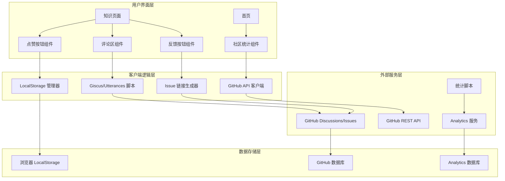

# 设计文档：社区互动功能

## 概述

本设计文档描述了医疗器械嵌入式软件知识体系的社区互动功能实现方案。该功能旨在通过评论系统、反馈机制、社区统计和访问分析来增强用户参与度和内容质量。

系统采用轻量级、隐私友好的方案，主要依赖 GitHub 生态系统（Discussions/Issues）和客户端技术，最小化服务器端依赖。

## 架构

### 整体架构



### 技术栈选择

| 组件 | 技术选择 | 理由 |
|------|---------|------|
| 评论系统 | Giscus (首选) | 基于 GitHub Discussions，支持回复、反应、分类，更好的讨论体验 |
| 评论系统备选 | Utterances | 基于 GitHub Issues，更简单轻量，加载更快 |
| 反馈机制 | GitHub Issues + 模板 | 无需额外服务，与开发流程集成 |
| 点赞存储 | LocalStorage | 客户端存储，无需后端，隐私友好 |
| 社区统计 | GitHub REST API v3 | 官方 API，可靠稳定，免费使用 |
| 访问统计 | Plausible (首选) | 隐私友好，GDPR 合规，轻量级 |
| 访问统计备选 | Google Analytics 4 | 功能强大，但需要 Cookie 同意 |

## 组件和接口

### 1. 评论系统组件

#### 1.1 Giscus 集成

**配置文件**: `mkdocs.yml`

```yaml
extra:
  comments:
    provider: giscus
    repo: X-Gen-Lab/medical-embedded-knowledge
    repo_id: <REPO_ID>  # 从 GitHub 获取
    category: General
    category_id: <CATEGORY_ID>  # 从 GitHub 获取
    mapping: pathname
    reactions_enabled: true
    emit_metadata: false
    input_position: bottom
    theme: preferred_color_scheme
    lang: zh-CN
```

**页面模板**: `docs/overrides/main.html`

```html



  {{ super() }}
  
  <!-- Giscus 评论区 -->
  
  <div class="md-content__comments">
    <h2>讨论区</h2>
    <script src="https://giscus.app/client.js"
            data-repo="{{ config.extra.comments.repo }}"
            data-repo-id="{{ config.extra.comments.repo_id }}"
            data-category="{{ config.extra.comments.category }}"
            data-category-id="{{ config.extra.comments.category_id }}"
            data-mapping="{{ config.extra.comments.mapping }}"
            data-reactions-enabled="{{ config.extra.comments.reactions_enabled }}"
            data-emit-metadata="{{ config.extra.comments.emit_metadata }}"
            data-input-position="{{ config.extra.comments.input_position }}"
            data-theme="{{ config.extra.comments.theme }}"
            data-lang="{{ config.extra.comments.lang }}"
            crossorigin="anonymous"
            async>
    </script>
  </div>
  

```

#### 1.2 主题同步

**JavaScript**: `docs/javascripts/comments-theme.js`

```javascript
// 监听主题切换，同步 Giscus 主题
document.addEventListener('DOMContentLoaded', function() {
  const observer = new MutationObserver(function(mutations) {
    mutations.forEach(function(mutation) {
      if (mutation.attributeName === 'data-md-color-scheme') {
        const theme = document.body.getAttribute('data-md-color-scheme');
        const iframe = document.querySelector('iframe.giscus-frame');
        if (iframe) {
          iframe.contentWindow.postMessage(
            { giscus: { setConfig: { theme: theme === 'slate' ? 'dark' : 'light' } } },
            'https://giscus.app'
          );
        }
      }
    });
  });
  
  observer.observe(document.body, { attributes: true });
});
```

### 2. 反馈功能组件

#### 2.1 报告问题按钮

**页面模板**: `docs/overrides/main.html`

```html

  {{ super() }}
  
  <div class="md-content__feedback">
    <a href="https://github.com/X-Gen-Lab/medical-embedded-knowledge/issues/new?template=content-error.md&title=[内容问题]%20{{ page.title }}&labels=content-error&body=页面URL:%20{{ page.canonical_url }}%0A页面标题:%20{{ page.title }}%0A%0A问题描述:%0A"
       class="md-button md-button--primary"
       target="_blank"
       rel="noopener">
      <span class="twemoji">
        
      </span>
      报告问题
    </a>
  </div>

```

#### 2.2 Issue 模板

**文件**: `.github/ISSUE_TEMPLATE/content-error.md`

```markdown
---
name: 内容错误
about: 报告知识库内容中的错误或不准确信息
title: '[内容问题] '
labels: content-error
assignees: ''
---

## 页面信息
- **页面 URL**: 
- **页面标题**: 
- **发现日期**: 

## 问题描述
请清楚地描述发现的错误或不准确信息。

## 期望内容
请描述您认为正确的内容应该是什么。

## 其他信息
添加任何其他有助于理解问题的信息、截图或参考资料。
```

#### 2.3 点赞按钮

**HTML 模板**:

```html
<div class="md-content__like">
  <button id="like-button" class="md-button" onclick="toggleLike()">
    <span class="twemoji" id="like-icon">
      
    </span>
    <span id="like-text">内容有用</span>
    <span id="like-count" class="like-count"></span>
  </button>
</div>
```

**JavaScript**: `docs/javascripts/like-button.js`

```javascript
function toggleLike() {
  const pageKey = 'like_' + window.location.pathname;
  const isLiked = localStorage.getItem(pageKey) === 'true';
  
  if (isLiked) {
    localStorage.removeItem(pageKey);
    updateLikeButton(false);
  } else {
    localStorage.setItem(pageKey, 'true');
    updateLikeButton(true);
    // 添加动画效果
    document.getElementById('like-button').classList.add('liked-animation');
    setTimeout(() => {
      document.getElementById('like-button').classList.remove('liked-animation');
    }, 600);
  }
}

function updateLikeButton(isLiked) {
  const icon = document.getElementById('like-icon');
  const text = document.getElementById('like-text');
  
  if (isLiked) {
    icon.innerHTML = '';
    text.textContent = '已点赞';
  } else {
    icon.innerHTML = '';
    text.textContent = '内容有用';
  }
}

// 页面加载时恢复点赞状态
document.addEventListener('DOMContentLoaded', function() {
  const pageKey = 'like_' + window.location.pathname;
  const isLiked = localStorage.getItem(pageKey) === 'true';
  updateLikeButton(isLiked);
});
```

### 3. 社区统计组件

#### 3.1 GitHub API 客户端

**JavaScript**: `docs/javascripts/github-stats.js`

```javascript
class GitHubStats {
  constructor(owner, repo) {
    this.owner = owner;
    this.repo = repo;
    this.apiBase = 'https://api.github.com';
    this.cacheKey = 'github_stats_cache';
    this.cacheExpiry = 3600000; // 1 hour
  }
  
  async fetchStats() {
    // 检查缓存
    const cached = this.getCache();
    if (cached) return cached;
    
    try {
      const response = await fetch(`${this.apiBase}/repos/${this.owner}/${this.repo}`);
      if (!response.ok) throw new Error('API request failed');
      
      const data = await response.json();
      const stats = {
        stars: data.stargazers_count,
        forks: data.forks_count,
        watchers: data.subscribers_count,
        updated_at: data.updated_at
      };
      
      this.setCache(stats);
      return stats;
    } catch (error) {
      console.error('Failed to fetch GitHub stats:', error);
      return this.getFallbackStats();
    }
  }
  
  async fetchContributors() {
    try {
      const response = await fetch(
        `${this.apiBase}/repos/${this.owner}/${this.repo}/contributors?per_page=10`
      );
      if (!response.ok) throw new Error('API request failed');
      
      return await response.json();
    } catch (error) {
      console.error('Failed to fetch contributors:', error);
      return [];
    }
  }
  
  getCache() {
    const cached = localStorage.getItem(this.cacheKey);
    if (!cached) return null;
    
    const { data, timestamp } = JSON.parse(cached);
    if (Date.now() - timestamp > this.cacheExpiry) {
      localStorage.removeItem(this.cacheKey);
      return null;
    }
    
    return data;
  }
  
  setCache(data) {
    localStorage.setItem(this.cacheKey, JSON.stringify({
      data,
      timestamp: Date.now()
    }));
  }
  
  getFallbackStats() {
    return {
      stars: 0,
      forks: 0,
      watchers: 0,
      updated_at: new Date().toISOString()
    };
  }
}

// 初始化并更新统计
document.addEventListener('DOMContentLoaded', async function() {
  const stats = new GitHubStats('X-Gen-Lab', 'medical-embedded-knowledge');
  
  const data = await stats.fetchStats();
  document.getElementById('github-stars').textContent = data.stars;
  document.getElementById('github-forks').textContent = data.forks;
  
  const contributors = await stats.fetchContributors();
  document.getElementById('github-contributors').textContent = contributors.length;
  
  // 显示贡献者头像
  const contributorsContainer = document.getElementById('contributors-list');
  contributors.forEach(contributor => {
    const img = document.createElement('img');
    img.src = contributor.avatar_url;
    img.alt = contributor.login;
    img.title = contributor.login;
    img.className = 'contributor-avatar';
    contributorsContainer.appendChild(img);
  });
});
```

#### 3.2 首页统计展示

**HTML 模板**: `docs/zh/index.md` (Front Matter)

```markdown
---
template: home.html
---

<!-- 在自定义模板中添加 -->
<div class="community-stats">
  <h2>社区统计</h2>
  <div class="stats-grid">
    <div class="stat-item">
      <span class="stat-icon">⭐</span>
      <span class="stat-value" id="github-stars">-</span>
      <span class="stat-label">Stars</span>
    </div>
    <div class="stat-item">
      <span class="stat-icon">🍴</span>
      <span class="stat-value" id="github-forks">-</span>
      <span class="stat-label">Forks</span>
    </div>
    <div class="stat-item">
      <span class="stat-icon">👥</span>
      <span class="stat-value" id="github-contributors">-</span>
      <span class="stat-label">贡献者</span>
    </div>
  </div>
  
  <div class="contributors-section">
    <h3>感谢贡献者</h3>
    <div id="contributors-list" class="contributors-list"></div>
  </div>
  
  <div class="cta-section">
    <a href="/CONTRIBUTING.html" class="md-button md-button--primary">
      加入我们
    </a>
  </div>
</div>
```

### 4. 访问统计组件（可选）

#### 4.1 Plausible Analytics 集成

**配置**: `mkdocs.yml`

```yaml
extra:
  analytics:
    provider: plausible
    domain: x-gen-lab.github.io/medical-embedded-knowledge
    src: https://plausible.io/js/script.js
```

**页面模板**: `docs/overrides/main.html`

```html

  
  <script defer 
          data-domain="{{ config.extra.analytics.domain }}"
          src="{{ config.extra.analytics.src }}">
  </script>
  

```

#### 4.2 Google Analytics 4 集成（备选）

**配置**: `mkdocs.yml`

```yaml
extra:
  analytics:
    provider: google
    property: G-XXXXXXXXXX
```

**Cookie 同意横幅**: `docs/javascripts/cookie-consent.js`

```javascript
function showCookieConsent() {
  const consent = localStorage.getItem('cookie_consent');
  if (consent) return;
  
  const banner = document.createElement('div');
  banner.className = 'cookie-consent';
  banner.innerHTML = `
    <div class="cookie-consent__content">
      <p>我们使用 Cookie 来改善您的体验。继续使用本站即表示您同意我们的 Cookie 政策。</p>
      <div class="cookie-consent__actions">
        <button onclick="acceptCookies()">接受</button>
        <button onclick="rejectCookies()">拒绝</button>
      </div>
    </div>
  `;
  document.body.appendChild(banner);
}

function acceptCookies() {
  localStorage.setItem('cookie_consent', 'accepted');
  document.querySelector('.cookie-consent').remove();
  // 启用 Google Analytics
  window.dataLayer = window.dataLayer || [];
  function gtag(){dataLayer.push(arguments);}
  gtag('js', new Date());
  gtag('config', 'G-XXXXXXXXXX');
}

function rejectCookies() {
  localStorage.setItem('cookie_consent', 'rejected');
  document.querySelector('.cookie-consent').remove();
}

document.addEventListener('DOMContentLoaded', showCookieConsent);
```

## 数据模型

### LocalStorage 数据结构

```typescript
// 点赞记录
interface LikeRecord {
  [pageKey: string]: boolean;  // 'like_/path/to/page': true
}

// GitHub 统计缓存
interface GitHubStatsCache {
  data: {
    stars: number;
    forks: number;
    watchers: number;
    updated_at: string;
  };
  timestamp: number;
}

// Cookie 同意
interface CookieConsent {
  cookie_consent: 'accepted' | 'rejected';
}
```

### GitHub API 响应模型

```typescript
// 仓库信息
interface RepositoryInfo {
  id: number;
  name: string;
  full_name: string;
  stargazers_count: number;
  forks_count: number;
  subscribers_count: number;
  updated_at: string;
  pushed_at: string;
}

// 贡献者信息
interface Contributor {
  login: string;
  id: number;
  avatar_url: string;
  html_url: string;
  contributions: number;
}
```

## 正确性属性

*属性是关于系统应该满足的特征或行为的形式化陈述，可以通过测试来验证。*

### 属性 1：评论系统加载

*对于任何*启用了评论的知识页面，当页面加载完成时，评论区组件应该成功加载并显示在页面底部。

**验证：需求 15.2**

### 属性 2：点赞状态持久化

*对于任何*页面，当用户点击点赞按钮后刷新页面，点赞状态应该保持不变（已点赞状态应该被恢复）。

**验证：需求 16.6, 23.5**

### 属性 3：点赞防重复

*对于任何*页面，同一用户不应该能够对同一页面多次点赞（LocalStorage 中只应有一条记录）。

**验证：需求 16.7, 23.3**

### 属性 4：GitHub 统计数据有效性

*对于任何*从 GitHub API 获取的统计数据，Stars、Forks 和 Contributors 数量应该是非负整数。

**验证：需求 17.1, 17.2, 17.3**

### 属性 5：统计数据缓存

*对于任何*GitHub API 请求，如果缓存未过期（1小时内），应该返回缓存数据而不发起新的 API 请求。

**验证：需求 21.6**

### 属性 6：Issue 链接正确性

*对于任何*"报告问题"链接，生成的 GitHub Issue URL 应该包含正确的页面标题和 URL 参数。

**验证：需求 16.2, 16.4**

### 属性 7：主题同步

*对于任何*主题切换操作（亮色/暗色），评论区的主题应该在 500ms 内同步更新。

**验证：需求 19.3**

### 属性 8：API 失败降级

*对于任何*GitHub API 请求失败的情况，系统应该显示缓存数据或占位符，而不是显示错误信息。

**验证：需求 17.8, 21.5**

### 属性 9：隐私保护

*对于任何*统计跟踪，系统不应该收集或存储用户的个人身份信息（PII）。

**验证：需求 18.7, 25.4**

### 属性 10：Cookie 同意

*对于任何*使用 Google Analytics 的情况，在用户明确同意之前，不应该加载 Analytics 脚本。

**验证：需求 22.7, 22.8**

## 错误处理

### 1. GitHub API 错误处理

| 错误类型 | 处理策略 |
|---------|---------|
| 网络错误 | 返回缓存数据或静态备用数据 |
| 速率限制 | 显示缓存数据，1小时后重试 |
| 404 错误 | 记录错误，显示占位符 |
| 认证错误 | 使用公开 API（无需认证） |

### 2. LocalStorage 错误处理

| 错误类型 | 处理策略 |
|---------|---------|
| 存储已满 | 清理过期缓存，重试 |
| 隐私模式 | 降级为会话存储或内存存储 |
| 读取失败 | 假设未点赞状态 |

### 3. 评论系统错误处理

| 错误类型 | 处理策略 |
|---------|---------|
| 脚本加载失败 | 显示"评论加载失败"提示和重试按钮 |
| GitHub 服务不可用 | 显示"评论暂时不可用"提示 |
| 用户未登录 | 显示"请登录 GitHub 发表评论"提示 |

## 测试策略

### 单元测试

1. **LocalStorage 管理器测试**
   - 测试点赞状态的保存和读取
   - 测试缓存的设置和过期
   - 测试存储已满的处理

2. **GitHub API 客户端测试**
   - 测试 API 请求的构造
   - 测试响应数据的解析
   - 测试错误处理逻辑

3. **URL 生成器测试**
   - 测试 Issue 链接的生成
   - 测试参数的正确编码
   - 测试特殊字符的处理

### 集成测试

1. **评论系统集成测试**
   - 测试 Giscus 脚本的加载
   - 测试主题同步功能
   - 测试评论区的显示和隐藏

2. **统计展示集成测试**
   - 测试 GitHub API 的调用
   - 测试统计数据的显示
   - 测试贡献者列表的渲染

3. **反馈功能集成测试**
   - 测试"报告问题"链接的生成
   - 测试点赞按钮的交互
   - 测试状态的持久化

### 端到端测试

1. **用户流程测试**
   - 测试完整的评论发表流程
   - 测试完整的问题报告流程
   - 测试完整的点赞流程

2. **跨浏览器测试**
   - 测试 Chrome、Firefox、Safari、Edge
   - 测试移动端浏览器
   - 测试隐私模式

3. **性能测试**
   - 测试页面加载时间影响
   - 测试 API 请求的响应时间
   - 测试缓存的有效性

### 属性测试

使用 Hypothesis 或类似工具进行属性测试：

1. **点赞状态一致性**
   - 生成随机的点赞操作序列
   - 验证最终状态的正确性

2. **缓存过期逻辑**
   - 生成随机的时间戳
   - 验证缓存过期判断的正确性

3. **URL 编码正确性**
   - 生成随机的页面标题和 URL
   - 验证生成的 Issue 链接的正确性

## 安全考虑

### 1. XSS 防护

- 所有用户输入（页面标题、URL）在生成 Issue 链接时进行 URL 编码
- 评论内容由 GitHub 处理，继承 GitHub 的 XSS 防护
- 不直接渲染用户提供的 HTML 内容

### 2. CSRF 防护

- 评论系统使用 GitHub OAuth，由 GitHub 处理 CSRF
- 点赞功能仅使用 LocalStorage，无服务器端交互
- Issue 创建通过 GitHub 界面，由 GitHub 处理 CSRF

### 3. 隐私保护

- 点赞数据仅存储在用户本地，不上传服务器
- 统计服务使用匿名化数据
- 遵守 GDPR、CCPA 等隐私法规
- 提供隐私政策和数据删除选项

### 4. API 安全

- 使用 HTTPS 进行所有 API 请求
- 不在客户端代码中暴露敏感凭证
- 实施速率限制和缓存以减少 API 滥用
- 处理 API 错误，不暴露敏感信息

## 性能优化

### 1. 延迟加载

- 评论区使用延迟加载，仅在用户滚动到页面底部时加载
- 统计数据使用异步加载，不阻塞页面渲染
- 贡献者头像使用懒加载

### 2. 缓存策略

- GitHub API 响应缓存 1 小时
- 使用 LocalStorage 缓存，减少 API 请求
- 使用 CDN 加载第三方脚本（Giscus、Analytics）

### 3. 资源优化

- 压缩 JavaScript 和 CSS 文件
- 使用 SVG 图标而非图片
- 最小化 DOM 操作

### 4. 网络优化

- 使用 `async` 和 `defer` 加载脚本
- 使用 `preconnect` 预连接到第三方域名
- 实施请求去抖动，防止频繁 API 调用

## 部署和配置

### 1. 环境变量

```bash
# GitHub 仓库信息
GITHUB_OWNER=X-Gen-Lab
GITHUB_REPO=medical-embedded-knowledge

# Giscus 配置
GISCUS_REPO_ID=<从 GitHub 获取>
GISCUS_CATEGORY_ID=<从 GitHub 获取>

# Analytics 配置（可选）
PLAUSIBLE_DOMAIN=x-gen-lab.github.io/medical-embedded-knowledge
# 或
GA_MEASUREMENT_ID=G-XXXXXXXXXX
```

### 2. GitHub 配置

1. **启用 Discussions**
   - 在仓库设置中启用 Discussions 功能
   - 创建"General"分类用于评论

2. **配置 Issue 模板**
   - 在 `.github/ISSUE_TEMPLATE/` 目录创建模板文件
   - 配置标签和分配规则

3. **配置 GitHub Pages**
   - 启用 GitHub Pages
   - 配置自定义域名（可选）

### 3. 第三方服务配置

1. **Giscus 配置**
   - 访问 https://giscus.app
   - 输入仓库信息获取配置参数
   - 复制配置到 `mkdocs.yml`

2. **Plausible 配置**（可选）
   - 注册 Plausible 账号
   - 添加网站域名
   - 获取跟踪脚本 URL

3. **Google Analytics 配置**（可选）
   - 创建 GA4 属性
   - 获取 Measurement ID
   - 配置数据流

## 维护和监控

### 1. 日常维护

- 每周检查 GitHub API 速率限制使用情况
- 每月审查用户反馈和 Issues
- 定期更新第三方脚本版本
- 监控评论区的垃圾评论

### 2. 性能监控

- 监控页面加载时间
- 监控 API 请求成功率
- 监控缓存命中率
- 监控用户参与度指标

### 3. 安全监控

- 监控异常的 API 请求模式
- 定期审查隐私政策合规性
- 监控第三方服务的安全公告
- 定期进行安全审计

## 未来扩展

### 短期扩展（3-6个月）

1. **点赞数据同步**
   - 实现简单的后端服务存储点赞数据
   - 在页面显示全局点赞数量
   - 提供热门内容排行榜

2. **评论通知**
   - 集成 GitHub Notifications
   - 提供评论摘要邮件
   - 支持评论订阅

3. **高级统计**
   - 添加更多仓库指标（Issues、PRs）
   - 显示贡献趋势图表
   - 展示活跃贡献者排行

### 中期扩展（6-12个月）

1. **用户系统**
   - 实现简单的用户认证
   - 支持学习进度跟踪
   - 提供个性化推荐

2. **社区功能**
   - 添加用户问答功能
   - 支持内容评分和推荐
   - 实现用户徽章系统

3. **内容分析**
   - 实现内容质量评分
   - 提供内容改进建议
   - 生成内容分析报告

### 长期扩展（12个月以上）

1. **AI 辅助**
   - 使用 AI 自动回答常见问题
   - 提供智能内容推荐
   - 实现自动内容审核

2. **多平台集成**
   - 支持其他评论系统（Disqus、Commento）
   - 集成社交媒体分享
   - 支持第三方登录

3. **高级分析**
   - 实现用户行为分析
   - 提供 A/B 测试功能
   - 生成详细的分析报告
