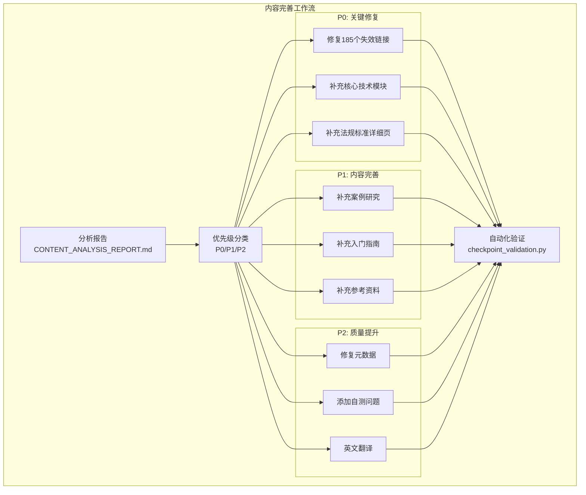
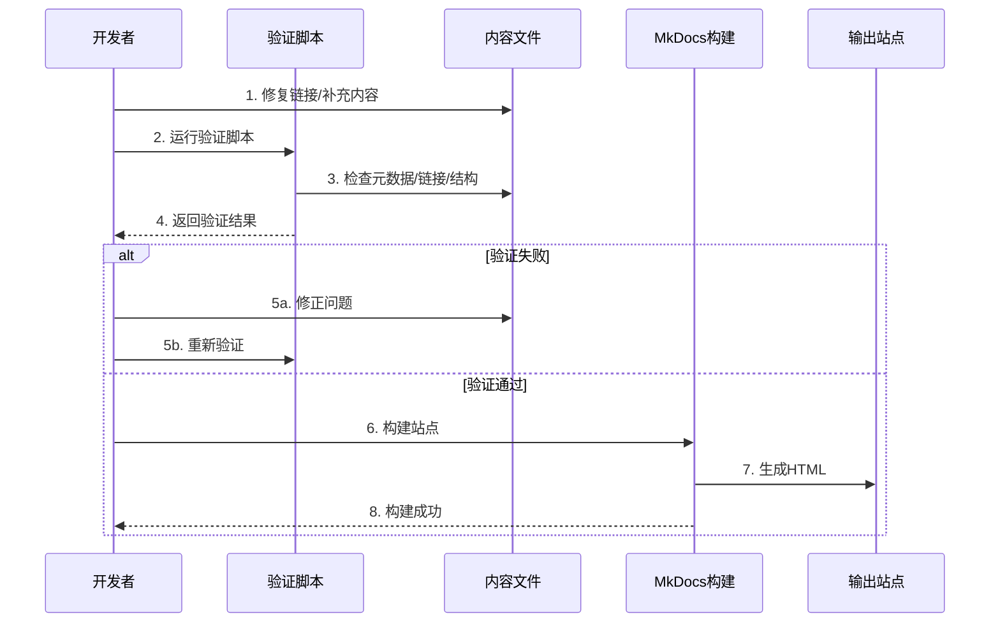

# 设计文档：医疗器械嵌入式软件知识体系完善

## 概述

本设计文档描述如何完善现有的医疗器械嵌入式软件知识体系。系统已经建立了基础框架和部分高质量内容，但存在大量内容缺失、链接失效和质量问题。本设计专注于：

1. **修复185个失效的内部链接**
2. **补充约50个缺失的详细页面**
3. **完善元数据和内容质量**
4. **翻译核心内容到英文**

设计遵循以下原则：
- **优先级驱动**：P0（链接+核心内容）→ P1（案例+指南）→ P2（翻译）
- **质量优先**：确保新增内容符合现有高质量标准
- **一致性**：保持与现有内容的结构和风格一致
- **可验证性**：所有改进都可通过自动化测试验证

## 架构

### 系统架构概览

本项目不改变现有系统架构，而是在现有MkDocs静态站点生成器框架内补充内容和修复问题。




### 工作流程设计



## 组件和接口

### 1. 链接修复组件（Link Repair Component）

**职责**：修复所有失效的内部链接

**链接类型分类**：
1. **学习路径链接**（约70个）：指向不存在的详细页面
2. **相关模块链接**（约50个）：Front Matter中的related_modules路径错误
3. **参考资料链接**（约20个）：指向不存在的参考页面
4. **案例研究链接**（约15个）：指向不存在的案例
5. **技术文档内部链接**（约30个）：指向不存在的同级或子级页面

**修复策略**：

```python
# 链接修复策略伪代码
class LinkRepairStrategy:
    def repair_learning_path_links(self, path_file):
        """修复学习路径中的链接"""
        # 1. 读取学习路径配置
        # 2. 检查每个模块ID对应的文件是否存在
        # 3. 如果文件不存在：
        #    - 创建占位文件（如果是P0优先级）
        #    - 或移除链接（如果是低优先级）
        # 4. 更新路径配置
        pass
    
    def repair_related_modules_links(self, md_file):
        """修复Front Matter中的related_modules链接"""
        # 1. 解析Front Matter
        # 2. 检查related_modules中的每个路径
        # 3. 修正路径格式（移除多余的/index/）
        # 4. 验证目标文件存在
        # 5. 更新Front Matter
        pass
    
    def repair_inline_links(self, md_file):
        """修复Markdown内容中的内联链接"""
        # 1. 提取所有内部链接
        # 2. 解析相对路径
        # 3. 检查目标文件是否存在
        # 4. 如果不存在：
        #    - 创建占位文件
        #    - 或更新链接指向现有页面
        # 5. 更新Markdown内容
        pass
```


### 2. 内容生成组件（Content Generation Component）

**职责**：生成缺失的知识模块页面

**内容模板系统**：

```python
# 内容模板定义
class ContentTemplate:
    """知识模块内容模板"""
    
    FRONT_MATTER_TEMPLATE = """---
title: "{title}"
description: "{description}"
difficulty: "{difficulty}"
estimated_time: "{estimated_time}"
tags: {tags}
related_modules: {related_modules}
last_updated: "{last_updated}"
version: "1.0"
language: "{language}"
---
"""
    
    CONTENT_TEMPLATE = """# {title}

## 学习目标

完成本模块后，你将能够：
- {learning_objective_1}
- {learning_objective_2}
- {learning_objective_3}

## 前置知识

- {prerequisite_1}
- {prerequisite_2}

## 内容

### 概念介绍

{concept_introduction}

### 详细说明

{detailed_explanation}

### 代码示例

```{code_language}
{code_example}
```

**代码说明**：
- {code_explanation_1}
- {code_explanation_2}

### 最佳实践

!!! tip "最佳实践"
    - {best_practice_1}
    - {best_practice_2}

### 常见陷阱

!!! warning "注意事项"
    - {common_pitfall_1}
    - {common_pitfall_2}

## 实践练习

1. {exercise_1}
2. {exercise_2}

## 自测问题

??? question "{question_1_title}"
    {question_1_content}
    
    ??? success "答案"
        {question_1_answer}

??? question "{question_2_title}"
    {question_2_content}
    
    ??? success "答案"
        {question_2_answer}

??? question "{question_3_title}"
    {question_3_content}
    
    ??? success "答案"
        {question_3_answer}

??? question "{question_4_title}"
    {question_4_content}
    
    ??? success "答案"
        {question_4_answer}

??? question "{question_5_title}"
    {question_5_content}
    
    ??? success "答案"
        {question_5_answer}

## 相关资源

- [{related_resource_1_title}]({related_resource_1_link})
- [{related_resource_2_title}]({related_resource_2_link})

## 参考文献

1. {reference_1}
2. {reference_2}
3. {reference_3}
"""
```


**内容生成策略**：

按优先级生成内容：

**P0 - 核心技术模块**（10个页面）：
1. `technical-knowledge/rtos/synchronization.md` - RTOS同步机制
2. `technical-knowledge/rtos/interrupt-handling.md` - RTOS中断处理
3. `technical-knowledge/rtos/resource-management.md` - RTOS资源管理
4. `technical-knowledge/hardware-interfaces/spi.md` - SPI通信
5. `technical-knowledge/hardware-interfaces/uart.md` - UART通信
6. `technical-knowledge/hardware-interfaces/adc-dac.md` - ADC/DAC
7. `technical-knowledge/hardware-interfaces/gpio.md` - GPIO操作
8. `technical-knowledge/low-power-design/sleep-modes.md` - 睡眠模式
9. `technical-knowledge/low-power-design/power-optimization.md` - 功耗优化
10. `technical-knowledge/signal-processing/digital-filters.md` - 数字滤波

**P0 - 法规标准详细页**（14个页面）：
1. `regulatory-standards/iec-62304/lifecycle-processes.md`
2. `regulatory-standards/iec-62304/documentation-requirements.md`
3. `regulatory-standards/iso-13485/quality-management.md`
4. `regulatory-standards/iso-13485/audit-checklist.md`
5. `regulatory-standards/iso-14971/risk-analysis.md`
6. `regulatory-standards/iso-14971/risk-evaluation.md`
7. `regulatory-standards/iso-14971/risk-control.md`
8. `regulatory-standards/fda-regulations/510k-process.md`
9. `regulatory-standards/fda-regulations/pma-process.md`
10. `regulatory-standards/fda-regulations/software-validation.md`
11. `regulatory-standards/iec-60601-1/electrical-safety.md`
12. `regulatory-standards/iec-60601-1/emc-requirements.md`
13. `regulatory-standards/iec-81001-5-1/threat-modeling.md`
14. `regulatory-standards/iec-81001-5-1/security-controls.md`

**P0 - 软件工程模块**（13个页面）：
1. `software-engineering/requirements-engineering/change-management.md`
2. `software-engineering/architecture-design/layered-architecture.md`
3. `software-engineering/architecture-design/interface-design.md`
4. `software-engineering/coding-standards/misra-c.md`
5. `software-engineering/coding-standards/cert-c.md`
6. `software-engineering/coding-standards/code-review-checklist.md`
7. `software-engineering/testing-strategy/unit-testing.md`
8. `software-engineering/testing-strategy/integration-testing.md`
9. `software-engineering/testing-strategy/system-testing.md`
10. `software-engineering/configuration-management/version-control.md`
11. `software-engineering/configuration-management/baseline-management.md`
12. `software-engineering/static-analysis/tool-usage.md`
13. `software-engineering/static-analysis/defect-classification.md`

### 3. 元数据修复组件（Metadata Repair Component）

**职责**：修复和完善所有文档的Front Matter元数据

**元数据验证规则**：

```python
class MetadataValidator:
    """元数据验证器"""
    
    REQUIRED_FIELDS = [
        'title',
        'description',
        'difficulty',
        'estimated_time',
        'tags',
        'last_updated',
        'version'
    ]
    
    VALID_DIFFICULTIES = ['基础', '中级', '高级']
    
    def validate_metadata(self, front_matter):
        """验证元数据完整性和正确性"""
        errors = []
        
        # 检查必需字段
        for field in self.REQUIRED_FIELDS:
            if field not in front_matter:
                errors.append(f"缺少必需字段: {field}")
        
        # 检查difficulty值
        if 'difficulty' in front_matter:
            if front_matter['difficulty'] not in self.VALID_DIFFICULTIES:
                errors.append(f"difficulty值无效: {front_matter['difficulty']}")
        
        # 检查tags格式
        if 'tags' in front_matter:
            if not isinstance(front_matter['tags'], list):
                errors.append("tags必须是列表格式")
        
        return errors
    
    def repair_metadata(self, md_file):
        """修复元数据"""
        # 1. 读取文件
        # 2. 解析Front Matter
        # 3. 补充缺失字段
        # 4. 修正错误值
        # 5. 写回文件
        pass
```


### 4. 内容质量提升组件（Content Quality Enhancement Component）

**职责**：为现有内容添加自测问题、参考文献和完善结构

**自测问题生成策略**：

```python
class SelfTestGenerator:
    """自测问题生成器"""
    
    QUESTION_TYPES = [
        'concept',      # 概念理解题
        'application',  # 应用题
        'analysis',     # 分析题
        'comparison',   # 对比题
        'troubleshooting'  # 故障排查题
    ]
    
    def generate_questions(self, module_content, count=5):
        """为模块生成自测问题"""
        questions = []
        
        # 1. 分析模块内容，提取关键概念
        # 2. 为每个关键概念生成问题
        # 3. 确保问题类型多样化
        # 4. 生成答案解析
        
        return questions
    
    def format_question(self, question_data):
        """格式化问题为Markdown"""
        return f"""??? question "{question_data['title']}"
    {question_data['content']}
    
    ??? success "答案"
        {question_data['answer']}
"""
```

**参考文献补充策略**：

```python
class ReferenceManager:
    """参考文献管理器"""
    
    def add_references(self, md_file, module_topic):
        """为模块添加参考文献"""
        # 1. 根据模块主题查找相关参考资料
        # 2. 包括：标准文档、书籍、在线资源
        # 3. 格式化为统一格式
        # 4. 添加到文档末尾
        pass
    
    REFERENCE_SOURCES = {
        'iec-62304': [
            'IEC 62304:2006+AMD1:2015 - Medical device software - Software life cycle processes',
            'FDA Guidance for the Content of Premarket Submissions for Software Contained in Medical Devices',
            '《医疗器械软件开发实践指南》'
        ],
        'rtos': [
            'FreeRTOS Reference Manual',
            '《嵌入式实时操作系统》- 邵贝贝',
            'Real-Time Concepts for Embedded Systems - Qing Li'
        ],
        # ... 更多主题的参考资料
    }
```

### 5. 翻译管理组件（Translation Management Component）

**职责**：将中文内容翻译为英文，保持结构和质量一致

**翻译策略**：

```python
class TranslationManager:
    """翻译管理器"""
    
    def translate_module(self, zh_file):
        """翻译知识模块"""
        # 1. 读取中文文件
        # 2. 分离Front Matter和内容
        # 3. 翻译Front Matter字段
        # 4. 翻译内容（保持Markdown格式）
        # 5. 保持代码示例不变
        # 6. 保持技术术语准确性
        # 7. 生成英文文件到en/目录
        pass
    
    TERM_GLOSSARY = {
        '任务调度': 'Task Scheduling',
        '中断处理': 'Interrupt Handling',
        '风险管理': 'Risk Management',
        '软件安全分类': 'Software Safety Classification',
        # ... 更多术语映射
    }
    
    def preserve_technical_terms(self, text):
        """保持技术术语的准确性"""
        # 使用术语表确保一致的翻译
        pass
```

**翻译优先级**：
1. P2阶段：翻译所有P0阶段补充的核心内容
2. 确保中英文版本结构一致
3. 保持代码示例和图表不变
4. 技术术语使用标准英文表达


### 6. 验证和测试组件（Validation and Testing Component）

**职责**：自动化验证所有改进的正确性

**验证脚本增强**：

```python
class EnhancedValidator:
    """增强的验证器"""
    
    def validate_all(self):
        """运行所有验证检查"""
        results = {
            'link_validation': self.validate_links(),
            'metadata_validation': self.validate_metadata(),
            'content_structure': self.validate_content_structure(),
            'self_test_questions': self.validate_self_tests(),
            'references': self.validate_references(),
            'translation_consistency': self.validate_translations()
        }
        return results
    
    def validate_links(self):
        """验证所有链接有效"""
        # 1. 扫描所有Markdown文件
        # 2. 提取内部链接
        # 3. 验证目标文件存在
        # 4. 返回失效链接列表
        pass
    
    def validate_metadata(self):
        """验证元数据完整性"""
        # 1. 检查所有主要模块的Front Matter
        # 2. 验证必需字段存在
        # 3. 验证字段值有效
        # 4. 返回问题列表
        pass
    
    def validate_content_structure(self):
        """验证内容结构一致性"""
        # 1. 检查必需部分存在（学习目标、前置知识等）
        # 2. 验证代码示例有注释
        # 3. 返回结构问题列表
        pass
    
    def validate_self_tests(self):
        """验证自测问题数量"""
        # 1. 检查主要模块的自测问题
        # 2. 确保至少5个问题
        # 3. 返回不符合要求的模块
        pass
    
    def validate_references(self):
        """验证参考文献存在性"""
        # 1. 检查参考文献部分
        # 2. 确保至少3个参考条目
        # 3. 返回缺失参考文献的模块
        pass
    
    def validate_translations(self):
        """验证翻译一致性"""
        # 1. 对比中英文目录结构
        # 2. 检查核心模块的翻译覆盖
        # 3. 返回缺失翻译的模块
        pass
```

## 数据模型

### 链接修复记录模型

```python
from dataclasses import dataclass
from typing import List, Optional
from enum import Enum

class LinkType(Enum):
    LEARNING_PATH = "learning_path"
    RELATED_MODULE = "related_module"
    INLINE = "inline"
    REFERENCE = "reference"

@dataclass
class BrokenLink:
    """失效链接记录"""
    source_file: str          # 源文件路径
    link_text: str            # 链接文本
    link_url: str             # 链接URL
    link_type: LinkType       # 链接类型
    line_number: Optional[int]  # 行号
    
@dataclass
class LinkRepairAction:
    """链接修复动作"""
    broken_link: BrokenLink
    action: str               # 'create_file', 'update_link', 'remove_link'
    target_file: Optional[str]  # 目标文件路径
    new_url: Optional[str]    # 新的URL
```

### 内容生成任务模型

```python
@dataclass
class ContentGenerationTask:
    """内容生成任务"""
    file_path: str            # 文件路径
    title: str                # 标题
    category: str             # 分类（技术/法规/工程）
    priority: str             # 优先级（P0/P1/P2）
    estimated_words: int      # 预计字数
    template_type: str        # 模板类型
    related_modules: List[str]  # 相关模块
    status: str               # 状态（pending/in_progress/completed）
```

### 元数据修复记录模型

```python
@dataclass
class MetadataIssue:
    """元数据问题记录"""
    file_path: str
    issue_type: str           # 'missing_field', 'invalid_value'
    field_name: str
    current_value: Optional[str]
    expected_value: Optional[str]

@dataclass
class MetadataRepairAction:
    """元数据修复动作"""
    issue: MetadataIssue
    action: str               # 'add_field', 'update_value'
    new_value: str
```

### 验证结果模型

```python
@dataclass
class ValidationResult:
    """验证结果"""
    check_name: str           # 检查名称
    passed: bool              # 是否通过
    total_items: int          # 总项目数
    failed_items: int         # 失败项目数
    details: List[str]        # 详细信息
    timestamp: str            # 时间戳

@dataclass
class ValidationReport:
    """验证报告"""
    results: List[ValidationResult]
    overall_passed: bool
    summary: str
```


## 正确性属性

*属性是关于系统应该满足的特征或行为的正式陈述——本质上是对系统应该做什么的正式声明。属性是人类可读规范和机器可验证正确性保证之间的桥梁。*

### 属性反思（Property Reflection）

在定义正确性属性之前，我们需要识别和消除冗余：

**冗余分析**：
1. 需求1.1-1.5都是关于链接有效性的，可以合并为一个综合的"所有内部链接有效"属性
2. 需求8.1和8.3重叠（都是关于元数据完整性），可以合并
3. 需求10.1-10.6都是关于内容结构的，可以合并为一个综合属性
4. 需求2、3、4的具体文件存在性检查是examples，不需要单独的properties

**最终属性列表**（消除冗余后）：
- 属性1：内部链接有效性（合并1.1-1.5）
- 属性2：元数据完整性（合并8.1, 8.3）
- 属性3：元数据值有效性（8.2）
- 属性4：中英文元数据一致性（8.5）
- 属性5：内容结构完整性（合并10.1-10.6）
- 属性6：自测问题数量要求（9.1）
- 属性7：自测问题答案完整性（9.2）
- 属性8：参考文献存在性（9.3）
- 属性9：参考文献数量要求（9.4）
- 属性10：代码示例说明完整性（9.5）
- 属性11：案例研究代码示例存在性（5.3）
- 属性12：入门指南快速开始部分（6.4）
- 属性13：入门指南FAQ部分（6.5）
- 属性14：参考资料评价完整性（7.5）
- 属性15：中英文结构一致性（11.7）
- 属性16：验证脚本零错误（12.6）

### 属性 1：内部链接有效性

*对于任何*Markdown文档中的内部链接，链接指向的目标文件必须存在于文档目录中。

**验证：需求 1.1, 1.2, 1.3, 1.4, 1.5**

### 属性 2：元数据完整性

*对于任何*主要知识模块文件，其Front Matter元数据必须包含title、description、difficulty、estimated_time、tags、last_updated和version字段。

**验证：需求 8.1, 8.3**

### 属性 3：元数据值有效性

*对于任何*包含difficulty字段的文档，difficulty的值必须是"基础"、"中级"或"高级"之一。

**验证：需求 8.2**

### 属性 4：中英文元数据一致性

*对于任何*同时存在中英文版本的知识模块，英文版本的元数据字段（title除外）必须与中文版本的对应字段一致或等价。

**验证：需求 8.5**

### 属性 5：内容结构完整性

*对于任何*主要知识模块文档，其内容必须包含"学习目标"、"前置知识"、"内容"、"最佳实践"、"常见陷阱"和"实践练习"部分。

**验证：需求 10.1, 10.2, 10.3, 10.4, 10.5, 10.6**

### 属性 6：自测问题数量要求

*对于任何*主要知识模块文档，其自测问题部分必须包含至少5个问题。

**验证：需求 9.1**

### 属性 7：自测问题答案完整性

*对于任何*自测问题，必须有对应的答案解析部分。

**验证：需求 9.2**

### 属性 8：参考文献存在性

*对于任何*知识模块文档，必须包含"参考文献"或"参考资料"部分。

**验证：需求 9.3**

### 属性 9：参考文献数量要求

*对于任何*知识模块的参考文献部分，必须包含至少3个参考条目。

**验证：需求 9.4**

### 属性 10：代码示例说明完整性

*对于任何*代码示例块，必须在代码块后附带说明文本，或代码块内包含注释。

**验证：需求 9.5**

### 属性 11：案例研究代码示例存在性

*对于任何*案例研究文档，必须包含至少一个代码示例块。

**验证：需求 5.3**

### 属性 12：入门指南快速开始部分

*对于任何*入门指南文档，必须包含"快速开始"、"快速入门"或"Getting Started"部分。

**验证：需求 6.4**

### 属性 13：入门指南FAQ部分

*对于任何*入门指南文档，必须包含"常见问题"、"FAQ"或"Q&A"部分。

**验证：需求 6.5**

### 属性 14：参考资料评价完整性

*对于任何*参考资料列表中的条目，必须包含评价或推荐理由字段。

**验证：需求 7.5**

### 属性 15：中英文结构一致性

*对于任何*同时存在中英文版本的知识模块，英文版本的标题层级结构必须与中文版本一致。

**验证：需求 11.7**

### 属性 16：验证脚本零错误

*对于任何*完成的文档集合，运行完整验证脚本后必须报告零错误。

**验证：需求 12.6**


## 错误处理

### 链接修复失败

**场景**：无法自动修复某些失效链接

**处理策略**：
- 记录无法自动修复的链接
- 生成人工审查清单
- 提供修复建议（创建文件 vs 更新链接）
- 允许跳过低优先级链接

**实现**：
```python
class LinkRepairError(Exception):
    """链接修复错误"""
    pass

def repair_link_with_fallback(broken_link):
    """带降级策略的链接修复"""
    try:
        # 尝试自动修复
        return auto_repair_link(broken_link)
    except LinkRepairError as e:
        # 记录到人工审查清单
        log_manual_review_needed(broken_link, str(e))
        
        # 根据优先级决定是否继续
        if broken_link.priority == 'P0':
            raise  # P0链接必须修复
        else:
            # 低优先级链接可以跳过
            return None
```

### 内容生成质量不足

**场景**：生成的内容不符合质量标准

**处理策略**：
- 使用内容模板确保基本结构
- 标记需要人工审查的内容
- 提供内容改进建议
- 允许迭代改进

**实现**：
```python
def generate_content_with_validation(task):
    """带验证的内容生成"""
    content = generate_from_template(task)
    
    # 验证内容质量
    quality_issues = validate_content_quality(content)
    
    if quality_issues:
        # 标记需要审查
        mark_for_review(task.file_path, quality_issues)
        
        # 添加TODO注释
        content = add_review_markers(content, quality_issues)
    
    return content

def add_review_markers(content, issues):
    """添加审查标记"""
    markers = "\n\n<!-- TODO: 需要人工审查 -->\n"
    for issue in issues:
        markers += f"<!-- - {issue} -->\n"
    return content + markers
```

### 元数据修复冲突

**场景**：自动修复的元数据与现有内容冲突

**处理策略**：
- 保留现有有效值
- 只补充缺失字段
- 记录冲突情况
- 提供人工决策选项

**实现**：
```python
def repair_metadata_safely(md_file):
    """安全的元数据修复"""
    current_metadata = extract_front_matter(md_file)
    
    # 只补充缺失字段，不覆盖现有值
    for field in REQUIRED_FIELDS:
        if field not in current_metadata:
            # 生成默认值
            default_value = generate_default_value(field, md_file)
            current_metadata[field] = default_value
        elif not is_valid_value(field, current_metadata[field]):
            # 值无效，记录冲突
            log_metadata_conflict(md_file, field, 
                                 current_metadata[field])
            # 提供修复建议但不自动修改
            suggest_fix(md_file, field)
    
    return current_metadata
```

### 翻译一致性问题

**场景**：中英文版本结构不一致

**处理策略**：
- 对比中英文文档结构
- 生成差异报告
- 提供同步建议
- 允许手动调整

**实现**：
```python
def validate_translation_consistency(zh_file, en_file):
    """验证翻译一致性"""
    zh_structure = extract_structure(zh_file)
    en_structure = extract_structure(en_file)
    
    differences = compare_structures(zh_structure, en_structure)
    
    if differences:
        report = generate_consistency_report(zh_file, en_file, differences)
        log_translation_issue(report)
        
        # 提供自动同步选项
        if can_auto_sync(differences):
            return suggest_auto_sync(zh_file, en_file, differences)
        else:
            return suggest_manual_sync(zh_file, en_file, differences)
    
    return None
```

### 验证脚本执行失败

**场景**：验证脚本本身出错

**处理策略**：
- 捕获并记录异常
- 提供详细错误信息
- 允许部分验证继续
- 生成不完整验证报告

**实现**：
```python
def run_validation_with_error_handling():
    """带错误处理的验证执行"""
    results = []
    errors = []
    
    validation_checks = [
        ('链接验证', validate_links),
        ('元数据验证', validate_metadata),
        ('内容结构验证', validate_content_structure),
        ('自测问题验证', validate_self_tests),
        ('参考文献验证', validate_references),
        ('翻译一致性验证', validate_translations)
    ]
    
    for check_name, check_func in validation_checks:
        try:
            result = check_func()
            results.append(result)
        except Exception as e:
            error_msg = f"{check_name}执行失败: {str(e)}"
            errors.append(error_msg)
            logging.error(error_msg, exc_info=True)
            
            # 继续执行其他检查
            continue
    
    # 生成报告（即使有错误）
    report = generate_validation_report(results, errors)
    return report
```


## 测试策略

### 单元测试

单元测试用于验证特定功能和边缘情况。

**测试框架**：pytest（Python）

**测试范围**：

1. **链接解析和验证测试**
   - 测试相对路径解析
   - 测试锚点链接处理
   - 测试Front Matter链接提取
   - 测试学习路径链接提取

2. **元数据验证测试**
   - 测试Front Matter解析
   - 测试必需字段检查
   - 测试difficulty值验证
   - 测试日期格式验证

3. **内容结构验证测试**
   - 测试部分标题识别
   - 测试代码块提取
   - 测试自测问题计数
   - 测试参考文献提取

4. **内容生成测试**
   - 测试模板渲染
   - 测试变量替换
   - 测试Front Matter生成

**示例单元测试**：

```python
# tests/test_link_validation.py
import pytest
from pathlib import Path
from link_validator import LinkValidator, BrokenLink

def test_extract_inline_links():
    """测试提取内联链接"""
    content = """
    这是一个[内部链接](../rtos/task-scheduling.md)
    这是一个[外部链接](https://example.com)
    """
    
    validator = LinkValidator()
    links = validator.extract_inline_links(content)
    
    assert len(links) == 2
    assert links[0].url == '../rtos/task-scheduling.md'
    assert links[1].url == 'https://example.com'

def test_validate_internal_link_exists():
    """测试验证内部链接存在"""
    validator = LinkValidator()
    
    # 假设文件存在
    result = validator.validate_link(
        source_file='docs/zh/technical-knowledge/rtos/index.md',
        link_url='task-scheduling.md'
    )
    
    assert result.is_valid == True

def test_validate_internal_link_missing():
    """测试验证内部链接缺失"""
    validator = LinkValidator()
    
    # 假设文件不存在
    result = validator.validate_link(
        source_file='docs/zh/technical-knowledge/rtos/index.md',
        link_url='nonexistent.md'
    )
    
    assert result.is_valid == False
    assert isinstance(result.error, BrokenLink)

def test_extract_front_matter_links():
    """测试提取Front Matter链接"""
    content = """---
title: "测试"
related_modules:
  - "rtos/synchronization"
  - "rtos/interrupt-handling"
---

# 内容
"""
    
    validator = LinkValidator()
    links = validator.extract_front_matter_links(content)
    
    assert len(links) == 2
    assert 'rtos/synchronization' in links

# tests/test_metadata_validation.py
import pytest
from metadata_validator import MetadataValidator

def test_validate_complete_metadata():
    """测试完整元数据验证"""
    metadata = {
        'title': '测试模块',
        'description': '测试描述',
        'difficulty': '中级',
        'estimated_time': '30分钟',
        'tags': ['测试'],
        'last_updated': '2026-02-07',
        'version': '1.0'
    }
    
    validator = MetadataValidator()
    errors = validator.validate(metadata)
    
    assert len(errors) == 0

def test_validate_missing_required_field():
    """测试缺失必需字段"""
    metadata = {
        'title': '测试模块',
        'description': '测试描述'
        # 缺少其他必需字段
    }
    
    validator = MetadataValidator()
    errors = validator.validate(metadata)
    
    assert len(errors) > 0
    assert any('difficulty' in error for error in errors)

def test_validate_invalid_difficulty():
    """测试无效difficulty值"""
    metadata = {
        'title': '测试',
        'description': '测试',
        'difficulty': '无效值',
        'estimated_time': '30分钟',
        'tags': ['测试'],
        'last_updated': '2026-02-07',
        'version': '1.0'
    }
    
    validator = MetadataValidator()
    errors = validator.validate(metadata)
    
    assert len(errors) > 0
    assert any('difficulty' in error for error in errors)

# tests/test_content_structure.py
import pytest
from content_validator import ContentStructureValidator

def test_validate_required_sections():
    """测试必需部分验证"""
    content = """
# 模块标题

## 学习目标

- 目标1

## 前置知识

- 知识1

## 内容

内容部分

## 最佳实践

实践内容

## 常见陷阱

陷阱内容

## 实践练习

练习内容
"""
    
    validator = ContentStructureValidator()
    result = validator.validate(content)
    
    assert result.has_all_required_sections == True

def test_validate_missing_sections():
    """测试缺失部分"""
    content = """
# 模块标题

## 学习目标

- 目标1

## 内容

内容部分
"""
    
    validator = ContentStructureValidator()
    result = validator.validate(content)
    
    assert result.has_all_required_sections == False
    assert '前置知识' in result.missing_sections

def test_count_self_test_questions():
    """测试自测问题计数"""
    content = """
## 自测问题

??? question "问题1"
    内容
    
    ??? success "答案"
        答案

??? question "问题2"
    内容
    
    ??? success "答案"
        答案
"""
    
    validator = ContentStructureValidator()
    count = validator.count_self_test_questions(content)
    
    assert count == 2
```


### 属性测试

属性测试用于验证系统的通用正确性属性，使用Hypothesis框架进行基于属性的测试。

**测试框架**：Hypothesis（Python）

**测试配置**：每个属性测试运行至少100次迭代

**示例属性测试**：

```python
# tests/test_properties.py
from hypothesis import given, strategies as st, settings
from pathlib import Path
import yaml
import re

@settings(max_examples=100)
def test_property_all_internal_links_valid():
    """
    属性1：内部链接有效性
    对于任何Markdown文档中的内部链接，目标文件必须存在
    
    Feature: knowledge-system-completion
    Property 1: 内部链接有效性
    Validates: Requirements 1.1, 1.2, 1.3, 1.4, 1.5
    """
    docs_dir = Path('docs/zh')
    link_pattern = r'\[([^\]]+)\]\(([^)]+)\)'
    
    for md_file in docs_dir.rglob('*.md'):
        with open(md_file, 'r', encoding='utf-8') as f:
            content = f.read()
        
        links = re.findall(link_pattern, content)
        for text, url in links:
            # 只检查内部链接
            if not url.startswith('http'):
                # 解析相对路径
                if url.startswith('/'):
                    target_path = docs_dir / url.lstrip('/')
                else:
                    target_path = (md_file.parent / url).resolve()
                
                # 移除锚点
                target_path = str(target_path).split('#')[0]
                target_path = Path(target_path)
                
                assert target_path.exists(), \
                    f"{md_file}: 链接指向不存在的文件 {url}"

@settings(max_examples=100)
def test_property_metadata_completeness():
    """
    属性2：元数据完整性
    对于任何主要知识模块，Front Matter必须包含所有必需字段
    
    Feature: knowledge-system-completion
    Property 2: 元数据完整性
    Validates: Requirements 8.1, 8.3
    """
    docs_dir = Path('docs/zh')
    required_fields = [
        'title', 'description', 'difficulty',
        'estimated_time', 'tags', 'last_updated', 'version'
    ]
    
    # 主要知识模块目录
    main_modules = [
        'technical-knowledge',
        'regulatory-standards',
        'software-engineering'
    ]
    
    for module_dir in main_modules:
        module_path = docs_dir / module_dir
        if not module_path.exists():
            continue
        
        for md_file in module_path.rglob('*.md'):
            # 跳过index文件
            if md_file.name == 'index.md':
                continue
            
            with open(md_file, 'r', encoding='utf-8') as f:
                content = f.read()
            
            if content.startswith('---'):
                parts = content.split('---', 2)
                if len(parts) >= 3:
                    front_matter = yaml.safe_load(parts[1])
                    
                    for field in required_fields:
                        assert field in front_matter, \
                            f"{md_file}: 缺少必需字段 {field}"

@settings(max_examples=100)
def test_property_difficulty_value_valid():
    """
    属性3：元数据值有效性
    对于任何包含difficulty字段的文档，值必须有效
    
    Feature: knowledge-system-completion
    Property 3: 元数据值有效性
    Validates: Requirements 8.2
    """
    docs_dir = Path('docs/zh')
    valid_difficulties = ['基础', '中级', '高级']
    
    for md_file in docs_dir.rglob('*.md'):
        with open(md_file, 'r', encoding='utf-8') as f:
            content = f.read()
        
        if content.startswith('---'):
            parts = content.split('---', 2)
            if len(parts) >= 3:
                front_matter = yaml.safe_load(parts[1])
                
                if 'difficulty' in front_matter:
                    assert front_matter['difficulty'] in valid_difficulties, \
                        f"{md_file}: difficulty值无效 {front_matter['difficulty']}"

@settings(max_examples=100)
def test_property_content_structure_complete():
    """
    属性5：内容结构完整性
    对于任何主要知识模块，必须包含所有必需部分
    
    Feature: knowledge-system-completion
    Property 5: 内容结构完整性
    Validates: Requirements 10.1, 10.2, 10.3, 10.4, 10.5, 10.6
    """
    docs_dir = Path('docs/zh')
    required_sections = [
        '学习目标',
        '前置知识',
        '内容',
        '最佳实践',
        '常见陷阱',
        '实践练习'
    ]
    
    main_modules = [
        'technical-knowledge',
        'regulatory-standards',
        'software-engineering'
    ]
    
    for module_dir in main_modules:
        module_path = docs_dir / module_dir
        if not module_path.exists():
            continue
        
        for md_file in module_path.rglob('*.md'):
            if md_file.name == 'index.md':
                continue
            
            with open(md_file, 'r', encoding='utf-8') as f:
                content = f.read()
            
            for section in required_sections:
                assert f'## {section}' in content or f'### {section}' in content, \
                    f"{md_file}: 缺少必需部分 {section}"

@settings(max_examples=100)
def test_property_self_test_questions_count():
    """
    属性6：自测问题数量要求
    对于任何主要知识模块，必须包含至少5个自测问题
    
    Feature: knowledge-system-completion
    Property 6: 自测问题数量要求
    Validates: Requirements 9.1
    """
    docs_dir = Path('docs/zh')
    question_pattern = r'\?\?\? question'
    
    main_modules = [
        'technical-knowledge',
        'regulatory-standards',
        'software-engineering'
    ]
    
    for module_dir in main_modules:
        module_path = docs_dir / module_dir
        if not module_path.exists():
            continue
        
        for md_file in module_path.rglob('*.md'):
            if md_file.name == 'index.md':
                continue
            
            with open(md_file, 'r', encoding='utf-8') as f:
                content = f.read()
            
            questions = re.findall(question_pattern, content)
            assert len(questions) >= 5, \
                f"{md_file}: 自测问题数量不足 (需要5个，实际{len(questions)}个)"

@settings(max_examples=100)
def test_property_self_test_answers_complete():
    """
    属性7：自测问题答案完整性
    对于任何自测问题，必须有对应的答案
    
    Feature: knowledge-system-completion
    Property 7: 自测问题答案完整性
    Validates: Requirements 9.2
    """
    docs_dir = Path('docs/zh')
    
    for md_file in docs_dir.rglob('*.md'):
        with open(md_file, 'r', encoding='utf-8') as f:
            content = f.read()
        
        # 提取问题和答案
        questions = re.findall(r'\?\?\? question', content)
        answers = re.findall(r'\?\?\? success "答案"', content)
        
        if len(questions) > 0:
            assert len(answers) == len(questions), \
                f"{md_file}: 问题和答案数量不匹配 (问题{len(questions)}个，答案{len(answers)}个)"

@settings(max_examples=100)
def test_property_references_exist():
    """
    属性8：参考文献存在性
    对于任何知识模块，必须包含参考文献部分
    
    Feature: knowledge-system-completion
    Property 8: 参考文献存在性
    Validates: Requirements 9.3
    """
    docs_dir = Path('docs/zh')
    
    main_modules = [
        'technical-knowledge',
        'regulatory-standards',
        'software-engineering'
    ]
    
    for module_dir in main_modules:
        module_path = docs_dir / module_dir
        if not module_path.exists():
            continue
        
        for md_file in module_path.rglob('*.md'):
            if md_file.name == 'index.md':
                continue
            
            with open(md_file, 'r', encoding='utf-8') as f:
                content = f.read()
            
            assert '## 参考文献' in content or '## 参考资料' in content, \
                f"{md_file}: 缺少参考文献部分"

@settings(max_examples=100)
def test_property_references_count():
    """
    属性9：参考文献数量要求
    对于任何参考文献部分，必须包含至少3个条目
    
    Feature: knowledge-system-completion
    Property 9: 参考文献数量要求
    Validates: Requirements 9.4
    """
    docs_dir = Path('docs/zh')
    
    for md_file in docs_dir.rglob('*.md'):
        if md_file.name == 'index.md':
            continue
        
        with open(md_file, 'r', encoding='utf-8') as f:
            content = f.read()
        
        # 查找参考文献部分
        if '## 参考文献' in content or '## 参考资料' in content:
            # 提取参考文献部分
            ref_section = content.split('## 参考文献')[-1] if '## 参考文献' in content else content.split('## 参考资料')[-1]
            
            # 计算条目数（以数字开头的行）
            ref_items = re.findall(r'^\d+\.', ref_section, re.MULTILINE)
            
            assert len(ref_items) >= 3, \
                f"{md_file}: 参考文献条目不足 (需要3个，实际{len(ref_items)}个)"

@settings(max_examples=100)
def test_property_code_examples_have_explanations():
    """
    属性10：代码示例说明完整性
    对于任何代码示例，必须有说明文本或注释
    
    Feature: knowledge-system-completion
    Property 10: 代码示例说明完整性
    Validates: Requirements 9.5
    """
    docs_dir = Path('docs/zh')
    
    for md_file in docs_dir.rglob('*.md'):
        with open(md_file, 'r', encoding='utf-8') as f:
            content = f.read()
        
        # 提取代码块
        code_blocks = re.findall(r'```[\s\S]*?```', content)
        
        for i, code_block in enumerate(code_blocks):
            # 检查代码块后是否有说明
            code_end_pos = content.find(code_block) + len(code_block)
            next_content = content[code_end_pos:code_end_pos+500]
            
            # 检查是否有"代码说明"、"说明"或注释
            has_explanation = (
                '**代码说明**' in next_content or
                '**说明**' in next_content or
                '//' in code_block or
                '#' in code_block or
                '/*' in code_block
            )
            
            assert has_explanation, \
                f"{md_file}: 代码块{i+1}缺少说明或注释"
```


### 集成测试

集成测试验证系统各组件的协同工作。

**测试场景**：

1. **完整修复流程测试**
   - 运行链接修复脚本
   - 验证所有链接已修复
   - 验证生成的文件符合模板

2. **内容生成流程测试**
   - 生成缺失的知识模块
   - 验证生成的内容结构
   - 验证元数据完整性

3. **验证脚本集成测试**
   - 运行完整验证脚本
   - 验证报告生成
   - 验证错误检测

4. **构建测试**
   - 运行MkDocs构建
   - 验证站点生成成功
   - 验证所有页面可访问

**示例集成测试**：

```python
# tests/test_integration.py
import subprocess
import pytest
from pathlib import Path
import json

def test_link_repair_workflow():
    """测试链接修复完整流程"""
    # 1. 运行链接修复脚本
    result = subprocess.run(
        ['python', 'scripts/repair_links.py'],
        capture_output=True,
        text=True
    )
    
    assert result.returncode == 0, f"链接修复失败: {result.stderr}"
    
    # 2. 运行链接验证
    result = subprocess.run(
        ['python', 'scripts/validate_links.py'],
        capture_output=True,
        text=True
    )
    
    assert result.returncode == 0, "仍有失效链接"

def test_content_generation_workflow():
    """测试内容生成完整流程"""
    # 1. 生成缺失内容
    result = subprocess.run(
        ['python', 'scripts/generate_missing_content.py', '--priority', 'P0'],
        capture_output=True,
        text=True
    )
    
    assert result.returncode == 0, f"内容生成失败: {result.stderr}"
    
    # 2. 验证生成的文件
    expected_files = [
        'docs/zh/technical-knowledge/rtos/synchronization.md',
        'docs/zh/technical-knowledge/rtos/interrupt-handling.md',
        # ... 更多文件
    ]
    
    for file_path in expected_files:
        assert Path(file_path).exists(), f"文件未生成: {file_path}"

def test_validation_script_integration():
    """测试验证脚本集成"""
    # 运行完整验证
    result = subprocess.run(
        ['python', 'scripts/checkpoint_validation.py'],
        capture_output=True,
        text=True
    )
    
    # 验证脚本应该成功执行（即使有错误）
    assert result.returncode == 0, "验证脚本执行失败"
    
    # 解析输出，检查报告格式
    output = result.stdout
    assert '验证报告' in output or 'Validation Report' in output

def test_mkdocs_build_succeeds():
    """测试MkDocs构建成功"""
    result = subprocess.run(
        ['mkdocs', 'build', '--strict'],
        capture_output=True,
        text=True
    )
    
    assert result.returncode == 0, f"构建失败: {result.stderr}"
    
    # 验证输出目录
    site_dir = Path('site')
    assert site_dir.exists()
    assert (site_dir / 'index.html').exists()
    
    # 验证关键页面存在
    key_pages = [
        'technical-knowledge/index.html',
        'regulatory-standards/index.html',
        'software-engineering/index.html'
    ]
    
    for page in key_pages:
        assert (site_dir / page).exists(), f"关键页面缺失: {page}"

def test_translation_consistency():
    """测试翻译一致性"""
    zh_dir = Path('docs/zh')
    en_dir = Path('docs/en')
    
    # 对比核心模块的中英文文件
    core_modules = [
        'technical-knowledge/rtos/task-scheduling.md',
        'regulatory-standards/iec-62304/index.md',
        'software-engineering/coding-standards/index.md'
    ]
    
    for module in core_modules:
        zh_file = zh_dir / module
        en_file = en_dir / module
        
        if zh_file.exists():
            assert en_file.exists(), f"缺少英文翻译: {module}"
            
            # 对比结构
            with open(zh_file, 'r', encoding='utf-8') as f:
                zh_content = f.read()
            with open(en_file, 'r', encoding='utf-8') as f:
                en_content = f.read()
            
            # 提取标题
            zh_headers = re.findall(r'^#+\s+(.+)$', zh_content, re.MULTILINE)
            en_headers = re.findall(r'^#+\s+(.+)$', en_content, re.MULTILINE)
            
            assert len(zh_headers) == len(en_headers), \
                f"{module}: 中英文标题数量不一致"
```

### 测试执行策略

**双重测试方法**：
- **单元测试**：验证特定示例、边缘情况和错误条件
- **属性测试**：验证跨所有输入的通用属性
- 两者互补，共同提供全面覆盖

**单元测试平衡**：
- 单元测试用于特定示例和边缘情况
- 避免编写过多单元测试 - 属性测试处理大量输入覆盖
- 单元测试应专注于：
  - 演示正确行为的特定示例
  - 组件之间的集成点
  - 边缘情况和错误条件
- 属性测试应专注于：
  - 对所有输入都成立的通用属性
  - 通过随机化实现全面的输入覆盖

**属性测试配置**：
- 每个属性测试最少100次迭代（由于随机化）
- 每个属性测试必须引用其设计文档属性
- 标签格式：**Feature: knowledge-system-completion, Property {number}: {property_text}**
- 每个正确性属性必须由单个属性测试实现

**本地开发测试**：
1. 开发人员在提交前运行单元测试
2. 运行特定模块的验证脚本
3. 本地构建验证

**持续集成测试**：
1. 每次提交触发自动化测试
2. 运行所有单元测试和属性测试
3. 运行完整验证脚本
4. 生成测试覆盖率报告

**定期测试**：
1. 每周运行完整的集成测试套件
2. 每周运行外部链接检查
3. 每月生成完整验证报告

**发布前测试**：
1. 运行所有测试套件
2. 验证所有P0任务完成
3. 人工审查关键内容
4. 验证MkDocs构建成功

**CI/CD配置示例**（GitHub Actions）：

```yaml
# .github/workflows/knowledge-completion-test.yml
name: Knowledge System Completion Tests

on: [push, pull_request]

jobs:
  test:
    runs-on: ubuntu-latest
    
    steps:
    - uses: actions/checkout@v2
    
    - name: Set up Python
      uses: actions/setup-python@v2
      with:
        python-version: '3.9'
    
    - name: Install dependencies
      run: |
        pip install -r requirements.txt
        pip install pytest hypothesis pyyaml
    
    - name: Run unit tests
      run: pytest tests/test_*.py -v --tb=short
    
    - name: Run property tests
      run: pytest tests/test_properties.py -v --tb=short
    
    - name: Run validation scripts
      run: |
        python scripts/checkpoint_validation.py
        python scripts/validate_links.py
    
    - name: Build site
      run: mkdocs build --strict
    
    - name: Run integration tests
      run: pytest tests/test_integration.py -v
    
    - name: Generate test report
      if: always()
      run: |
        pytest --html=report.html --self-contained-html
    
    - name: Upload test report
      if: always()
      uses: actions/upload-artifact@v2
      with:
        name: test-report
        path: report.html
```

## 实施计划

### 阶段划分

**阶段1：P0 - 关键修复**（预计2-3天）
1. 修复所有185个失效链接
2. 补充10个核心技术模块页面
3. 补充14个法规标准详细页面
4. 补充13个软件工程模块页面

**阶段2：P1 - 内容完善**（预计2-3天）
1. 补充2个案例研究
2. 补充3个入门指南
3. 补充4个参考资料页面
4. 修复元数据问题

**阶段3：P2 - 质量提升**（预计1-2周）
1. 为所有主要模块添加自测问题
2. 为所有模块添加参考文献
3. 翻译核心内容到英文
4. 确保所有验证测试通过

### 成功标准

项目完成的标准：
1. ✅ 所有内部链接验证通过（0个失效链接）
2. ✅ 所有P0优先级内容已补充
3. ✅ 所有元数据验证通过
4. ✅ 所有内容结构验证通过
5. ✅ 所有属性测试通过
6. ✅ MkDocs构建成功
7. ✅ 验证脚本报告零错误

