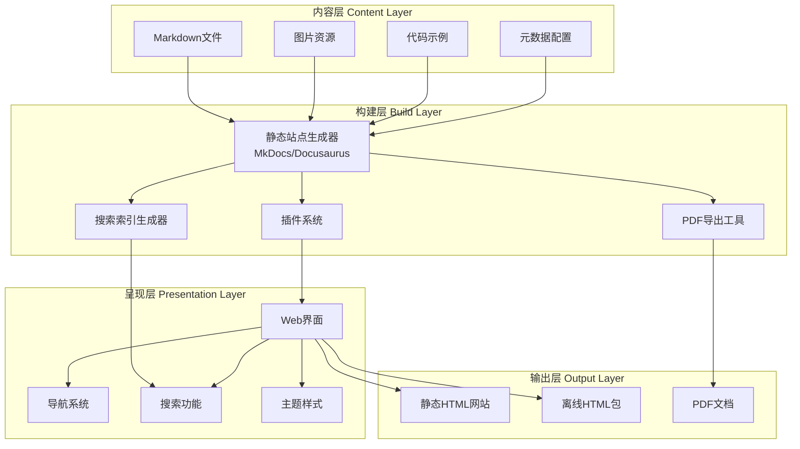

# 设计文档

## 概述

本系统是一个基于静态站点生成器的医疗器械嵌入式软件知识管理系统。系统采用文档即代码（Docs-as-Code）的方法，使用Markdown格式组织知识内容，通过静态站点生成器（推荐使用MkDocs或Docusaurus）生成可浏览、可搜索的知识库网站。

系统设计遵循以下核心原则：
- **内容与呈现分离**：知识内容使用Markdown编写，与展示层解耦
- **版本控制友好**：所有内容存储在Git仓库中，支持协作和版本追踪
- **可扩展性**：模块化的内容组织，便于添加新知识模块
- **多渠道访问**：支持在线浏览、离线HTML和PDF导出
- **符合医疗行业标准**：内容组织和文档结构参考IEC 62304等标准

## 架构

### 系统架构图



### 技术栈选择

**静态站点生成器**：MkDocs（推荐）或Docusaurus
- MkDocs：Python生态，简单易用，适合技术文档
- Docusaurus：React生态，功能丰富，适合大型文档站点

**核心依赖**：
- MkDocs Material主题（提供现代化UI和丰富功能）
- Python-Markdown扩展（支持高级Markdown语法）
- Lunr.js或Algolia（全文搜索）
- Mermaid.js（图表渲染）
- Prism.js或Highlight.js（代码高亮）

**部署选项**：
- GitHub Pages（免费托管）
- Netlify/Vercel（自动构建和部署）
- 本地服务器（内网部署）

## 组件和接口

### 1. 内容管理组件（Content Manager）

**职责**：组织和管理知识内容的文件结构

**目录结构**：
```
docs/
├── index.md                          # 首页
├── getting-started/                  # 入门指南
│   ├── index.md
│   ├── for-developers.md
│   ├── for-qa-engineers.md
│   └── for-regulatory-affairs.md
├── technical-knowledge/              # 核心技术知识
│   ├── index.md
│   ├── embedded-c-cpp/
│   │   ├── index.md
│   │   ├── memory-management.md
│   │   ├── pointer-operations.md
│   │   ├── bit-manipulation.md
│   │   └── code-examples/
│   ├── rtos/
│   │   ├── index.md
│   │   ├── task-scheduling.md
│   │   ├── synchronization.md
│   │   ├── interrupt-handling.md
│   │   └── freertos-examples/
│   ├── hardware-interfaces/
│   │   ├── index.md
│   │   ├── i2c.md
│   │   ├── spi.md
│   │   ├── uart.md
│   │   └── adc-dac.md
│   ├── low-power-design/
│   │   ├── index.md
│   │   ├── sleep-modes.md
│   │   └── power-optimization.md
│   └── signal-processing/
│       ├── index.md
│       ├── digital-filters.md
│       ├── fft.md
│       └── ecg-processing.md
├── regulatory-standards/             # 医疗法规与标准
│   ├── index.md
│   ├── iec-62304/
│   │   ├── index.md
│   │   ├── software-classification.md
│   │   ├── lifecycle-processes.md
│   │   ├── documentation-requirements.md
│   │   └── templates/
│   ├── iso-13485/
│   │   ├── index.md
│   │   ├── quality-management.md
│   │   └── audit-checklist.md
│   ├── iso-14971/
│   │   ├── index.md
│   │   ├── risk-analysis.md
│   │   ├── risk-evaluation.md
│   │   └── risk-control.md
│   ├── fda-regulations/
│   │   ├── index.md
│   │   ├── 510k-process.md
│   │   ├── pma-process.md
│   │   └── software-validation.md
│   ├── iec-60601-1/
│   │   ├── index.md
│   │   ├── electrical-safety.md
│   │   └── emc-requirements.md
│   └── iec-81001-5-1/
│       ├── index.md
│       ├── threat-modeling.md
│       └── security-controls.md
├── software-engineering/             # 软件工程实践
│   ├── index.md
│   ├── requirements-engineering/
│   │   ├── index.md
│   │   ├── requirements-traceability.md
│   │   └── change-management.md
│   ├── architecture-design/
│   │   ├── index.md
│   │   ├── layered-architecture.md
│   │   └── interface-design.md
│   ├── coding-standards/
│   │   ├── index.md
│   │   ├── misra-c.md
│   │   ├── cert-c.md
│   │   └── code-review-checklist.md
│   ├── testing-strategy/
│   │   ├── index.md
│   │   ├── unit-testing.md
│   │   ├── integration-testing.md
│   │   └── system-testing.md
│   ├── configuration-management/
│   │   ├── index.md
│   │   ├── version-control.md
│   │   └── baseline-management.md
│   └── static-analysis/
│       ├── index.md
│       ├── tool-usage.md
│       └── defect-classification.md
├── case-studies/                     # 实践案例
│   ├── index.md
│   ├── class-a-device-example.md
│   ├── class-b-device-example.md
│   └── class-c-device-example.md
├── learning-paths/                   # 学习路径
│   ├── index.md
│   ├── embedded-engineer-path.md
│   ├── qa-engineer-path.md
│   ├── architect-path.md
│   └── regulatory-specialist-path.md
├── references/                       # 参考资料
│   ├── index.md
│   ├── books.md
│   ├── standards-documents.md
│   ├── online-courses.md
│   └── tools-and-libraries.md
└── glossary.md                       # 术语表
```

**元数据格式**（每个Markdown文件的Front Matter）：
```yaml
---
title: "任务调度"
description: "RTOS中的任务调度机制和优先级管理"
difficulty: "中级"
estimated_time: "30分钟"
tags: ["RTOS", "调度", "优先级"]
related_modules:
  - "rtos/synchronization"
  - "rtos/interrupt-handling"
last_updated: "2026-02-07"
version: "1.0"
language: "zh-CN"
---
```

### 2. 静态站点生成器配置（SSG Configuration）

**MkDocs配置示例**（mkdocs.yml）：
```yaml
site_name: 医疗器械嵌入式软件知识体系
site_description: 全面的医疗器械嵌入式软件开发知识库
site_author: 知识体系团队
site_url: https://medical-embedded-knowledge.example.com

theme:
  name: material
  language: zh
  features:
    - navigation.tabs
    - navigation.sections
    - navigation.expand
    - navigation.top
    - search.suggest
    - search.highlight
    - content.code.copy
    - content.tabs.link
  palette:
    - scheme: default
      primary: blue
      accent: light-blue
      toggle:
        icon: material/brightness-7
        name: 切换到暗色模式
    - scheme: slate
      primary: blue
      accent: light-blue
      toggle:
        icon: material/brightness-4
        name: 切换到亮色模式

plugins:
  - search:
      lang:
        - zh
        - en
  - tags
  - pdf-export
  - mermaid2
  - git-revision-date-localized:
      enable_creation_date: true

markdown_extensions:
  - pymdownx.highlight:
      anchor_linenums: true
  - pymdownx.superfences:
      custom_fences:
        - name: mermaid
          class: mermaid
          format: !!python/name:pymdownx.superfences.fence_code_format
  - pymdownx.tabbed:
      alternate_style: true
  - admonition
  - pymdownx.details
  - pymdownx.tasklist:
      custom_checkbox: true
  - attr_list
  - md_in_html
  - toc:
      permalink: true

nav:
  - 首页: index.md
  - 入门指南:
      - getting-started/index.md
      - 开发人员: getting-started/for-developers.md
      - 质量工程师: getting-started/for-qa-engineers.md
      - 监管事务: getting-started/for-regulatory-affairs.md
  - 核心技术知识:
      - technical-knowledge/index.md
      - 嵌入式C/C++: technical-knowledge/embedded-c-cpp/
      - RTOS: technical-knowledge/rtos/
      - 硬件接口: technical-knowledge/hardware-interfaces/
      - 低功耗设计: technical-knowledge/low-power-design/
      - 信号处理: technical-knowledge/signal-processing/
  - 法规与标准:
      - regulatory-standards/index.md
      - IEC 62304: regulatory-standards/iec-62304/
      - ISO 13485: regulatory-standards/iso-13485/
      - ISO 14971: regulatory-standards/iso-14971/
      - FDA法规: regulatory-standards/fda-regulations/
      - IEC 60601-1: regulatory-standards/iec-60601-1/
      - IEC 81001-5-1: regulatory-standards/iec-81001-5-1/
  - 软件工程:
      - software-engineering/index.md
      - 需求工程: software-engineering/requirements-engineering/
      - 架构设计: software-engineering/architecture-design/
      - 编码规范: software-engineering/coding-standards/
      - 测试策略: software-engineering/testing-strategy/
      - 配置管理: software-engineering/configuration-management/
      - 静态分析: software-engineering/static-analysis/
  - 实践案例: case-studies/
  - 学习路径: learning-paths/
  - 参考资料: references/
  - 术语表: glossary.md

extra:
  social:
    - icon: fontawesome/brands/github
      link: https://github.com/your-org/medical-embedded-knowledge
  version:
    provider: mike
```

### 3. 搜索引擎组件（Search Engine）

**实现方式**：使用MkDocs内置的搜索插件（基于Lunr.js）

**搜索功能**：
- 全文搜索：搜索所有Markdown内容
- 标题搜索：优先匹配标题
- 标签搜索：按标签过滤
- 搜索建议：输入时实时显示建议
- 搜索高亮：在结果中高亮关键词

**搜索索引生成**：
```python
# 伪代码：搜索索引生成逻辑
def generate_search_index(docs_directory):
    index = []
    for markdown_file in docs_directory:
        content = parse_markdown(markdown_file)
        metadata = extract_front_matter(markdown_file)
        
        index_entry = {
            "title": metadata.title,
            "text": content.text,
            "tags": metadata.tags,
            "url": generate_url(markdown_file),
            "section": extract_section(markdown_file)
        }
        index.append(index_entry)
    
    return serialize_to_json(index)
```

### 4. 导航系统组件（Navigation System）

**导航类型**：
1. **主导航**：顶部标签式导航，显示主要分类
2. **侧边栏导航**：左侧树形导航，显示当前分类的所有页面
3. **面包屑导航**：显示当前页面的层级路径
4. **页内导航**：右侧目录，显示当前页面的标题结构
5. **上一页/下一页**：页面底部的顺序导航

**导航配置**：
```yaml
# 在mkdocs.yml中配置导航结构
nav:
  - 首页: index.md
  - 核心技术:
      - 概述: technical-knowledge/index.md
      - RTOS:
          - 介绍: technical-knowledge/rtos/index.md
          - 任务调度: technical-knowledge/rtos/task-scheduling.md
```

### 5. 学习路径管理组件（Learning Path Manager）

**学习路径定义**（YAML格式）：
```yaml
# learning-paths/embedded-engineer-path.yaml
path_id: embedded-engineer
title: 嵌入式软件工程师学习路径
description: 为嵌入式软件开发人员设计的系统学习路径
estimated_total_time: "40小时"
difficulty: 中级

prerequisites:
  - C语言基础
  - 基本的电子电路知识
  - Linux命令行基础

modules:
  - stage: 1
    title: 基础阶段
    modules:
      - id: embedded-c-cpp/memory-management
        required: true
      - id: embedded-c-cpp/pointer-operations
        required: true
      - id: embedded-c-cpp/bit-manipulation
        required: true
  
  - stage: 2
    title: RTOS阶段
    modules:
      - id: rtos/index
        required: true
      - id: rtos/task-scheduling
        required: true
      - id: rtos/synchronization
        required: true
      - id: rtos/interrupt-handling
        required: false
  
  - stage: 3
    title: 硬件接口阶段
    modules:
      - id: hardware-interfaces/i2c
        required: true
      - id: hardware-interfaces/spi
        required: true
      - id: hardware-interfaces/uart
        required: true
  
  - stage: 4
    title: 法规与质量阶段
    modules:
      - id: iec-62304/index
        required: true
      - id: iec-62304/software-classification
        required: true
      - id: coding-standards/misra-c
        required: true

checkpoints:
  - after_stage: 2
    assessment: "完成RTOS基础自测"
  - after_stage: 4
    assessment: "完成综合案例分析"
```

**学习路径渲染**：
```python
# 伪代码：学习路径页面生成
def render_learning_path(path_config):
    html = f"<h1>{path_config.title}</h1>"
    html += f"<p>{path_config.description}</p>"
    html += f"<p>预计学习时间：{path_config.estimated_total_time}</p>"
    
    for stage in path_config.modules:
        html += f"<h2>阶段 {stage.stage}: {stage.title}</h2>"
        html += "<ul>"
        for module in stage.modules:
            module_info = get_module_info(module.id)
            required_badge = "必修" if module.required else "选修"
            html += f"<li>[{required_badge}] <a href='{module_info.url}'>{module_info.title}</a></li>"
        html += "</ul>"
    
    return html
```

### 6. 内容模板组件（Content Templates）

**知识模块模板**：
```markdown
---
title: "[模块标题]"
description: "[简短描述]"
difficulty: "[基础/中级/高级]"
estimated_time: "[预计学习时间]"
tags: ["标签1", "标签2"]
related_modules: []
last_updated: "YYYY-MM-DD"
version: "1.0"
---

# [模块标题]

## 学习目标

完成本模块后，你将能够：
- 目标1
- 目标2
- 目标3

## 前置知识

- 前置知识1
- 前置知识2

## 内容

### 概念介绍

[核心概念的解释]

### 详细说明

[详细的技术说明]

### 代码示例

```c
// 示例代码
void example_function() {
    // 实现
}
```

**代码说明**：
- 说明1
- 说明2

### 最佳实践

!!! tip "最佳实践"
    - 实践建议1
    - 实践建议2

### 常见陷阱

!!! warning "注意事项"
    - 陷阱1
    - 陷阱2

## 实践练习

1. 练习1描述
2. 练习2描述

## 自测问题

??? question "问题1"
    问题描述
    
    ??? success "答案"
        答案解析

## 相关资源

- [相关模块1](链接)
- [相关模块2](链接)
- [外部参考资料](链接)

## 参考文献

1. 参考文献1
2. 参考文献2
```

### 7. PDF导出组件（PDF Export）

**实现方式**：使用mkdocs-pdf-export-plugin或mkdocs-with-pdf插件

**PDF生成配置**：
```yaml
# mkdocs.yml中的PDF配置
plugins:
  - pdf-export:
      combined: true
      combined_output_path: medical-embedded-knowledge-complete.pdf
      media_type: print
      enabled_if_env: ENABLE_PDF_EXPORT
```

**PDF样式定制**：
```css
/* pdf-styles.css */
@media print {
    .md-header,
    .md-footer,
    .md-sidebar {
        display: none;
    }
    
    h1 {
        page-break-before: always;
        font-size: 24pt;
    }
    
    pre, code {
        page-break-inside: avoid;
    }
}
```

### 8. 多语言支持组件（i18n Support）

**实现方式**：使用MkDocs的多语言插件或目录结构分离

**目录结构**：
```
docs/
├── zh/                    # 中文内容
│   ├── index.md
│   ├── technical-knowledge/
│   └── ...
├── en/                    # 英文内容
│   ├── index.md
│   ├── technical-knowledge/
│   └── ...
```

**语言切换配置**：
```yaml
# mkdocs.yml
plugins:
  - i18n:
      default_language: zh
      languages:
        zh:
          name: 中文
          build: true
        en:
          name: English
          build: true
      nav_translations:
        en:
          首页: Home
          核心技术知识: Technical Knowledge
          法规与标准: Regulatory Standards
```

## 数据模型

### 知识模块元数据模型

```typescript
interface KnowledgeModule {
    id: string;                      // 唯一标识符
    title: string;                   // 标题
    description: string;             // 描述
    difficulty: 'basic' | 'intermediate' | 'advanced';  // 难度
    estimatedTime: string;           // 预计学习时间（如"30分钟"）
    tags: string[];                  // 标签列表
    relatedModules: string[];        // 相关模块ID列表
    lastUpdated: Date;               // 最后更新日期
    version: string;                 // 版本号
    language: 'zh-CN' | 'en-US';    // 语言
    category: string;                // 分类（技术/法规/工程）
    filePath: string;                // 文件路径
}
```

### 学习路径模型

```typescript
interface LearningPath {
    pathId: string;                  // 路径ID
    title: string;                   // 路径标题
    description: string;             // 路径描述
    estimatedTotalTime: string;      // 总预计时间
    difficulty: 'basic' | 'intermediate' | 'advanced';
    prerequisites: string[];         // 前置要求
    stages: LearningStage[];         // 学习阶段
    checkpoints: Checkpoint[];       // 检查点
}

interface LearningStage {
    stage: number;                   // 阶段编号
    title: string;                   // 阶段标题
    modules: ModuleReference[];      // 模块引用
}

interface ModuleReference {
    id: string;                      // 模块ID
    required: boolean;               // 是否必修
}

interface Checkpoint {
    afterStage: number;              // 在哪个阶段之后
    assessment: string;              // 评估描述
}
```

### 搜索索引模型

```typescript
interface SearchIndexEntry {
    title: string;                   // 页面标题
    text: string;                    // 页面文本内容
    tags: string[];                  // 标签
    url: string;                     // 页面URL
    section: string;                 // 所属章节
    difficulty: string;              // 难度级别
}
```

### 用户进度模型（可选，用于未来扩展）

```typescript
interface UserProgress {
    userId: string;                  // 用户ID
    completedModules: string[];      // 已完成模块ID列表
    currentPath: string;             // 当前学习路径ID
    lastAccessedModule: string;      // 最后访问的模块ID
    lastAccessTime: Date;            // 最后访问时间
    assessmentScores: Map<string, number>;  // 评估分数
}
```

## 正确性属性

*属性是关于系统应该满足的特征或行为的正式陈述——本质上是对系统应该做什么的正式声明。属性是人类可读规范和机器可验证正确性保证之间的桥梁。*

### 属性 1：知识模块元数据完整性

*对于任何*知识模块文件，其Front Matter元数据必须包含title、description、difficulty、estimated_time、tags、last_updated和version字段，且difficulty必须是"基础"、"中级"或"高级"之一。

**验证：需求 4.3, 8.2**

### 属性 2：知识模块内容结构一致性

*对于任何*知识模块页面，渲染后的HTML必须包含模块标题、学习目标部分、前置知识部分和预计学习时间信息。

**验证：需求 4.1**

### 属性 3：内部链接有效性

*对于任何*知识模块中的内部交叉引用链接，链接指向的目标文件必须存在于文档目录中。

**验证：需求 4.4, 11.3**

### 属性 4：搜索结果相关性

*对于任何*搜索关键词，返回的所有搜索结果必须在标题或内容中包含该关键词。

**验证：需求 6.1, 6.2**

### 属性 5：标签过滤一致性

*对于任何*标签过滤操作，返回的所有知识模块的元数据中必须包含该标签。

**验证：需求 6.4**

### 属性 6：搜索结果高亮

*对于任何*搜索结果页面，匹配关键词的文本必须被HTML高亮标记（如`<mark>`或`<span class="highlight">`）包裹。

**验证：需求 6.5**

### 属性 7：代码示例完整性

*对于任何*包含代码示例的知识模块，代码块必须附带注释、使用说明或潜在陷阱提示中的至少一项。

**验证：需求 7.3**

### 属性 8：学习路径顺序保持

*对于任何*学习路径配置，渲染后的模块列表顺序必须与配置文件中定义的stage和模块顺序一致。

**验证：需求 5.5**

### 属性 9：自测问题数量要求

*对于任何*标记为"主要知识模块"的模块，其内容中必须包含至少5个自测问题。

**验证：需求 9.1**

### 属性 10：核心模块多语言覆盖

*对于任何*标记为"核心知识模块"的模块，必须同时存在中文（zh/）和英文（en/）两个版本的文件。

**验证：需求 10.2**

### 属性 11：单语言模块标识

*对于任何*仅存在单一语言版本的知识模块，其页面必须显示语言可用性标识（如"仅中文"或"仅英文"）。

**验证：需求 10.5**

### 属性 12：离线版本资源完整性

*对于任何*生成的离线HTML版本，所有在线版本中引用的图片、代码示例和样式文件必须包含在离线包中。

**验证：需求 11.4**

### 属性 13：参考文献存在性

*对于任何*知识模块，其内容必须包含"参考文献"或"参考资料"部分，且至少包含一个参考条目。

**验证：需求 12.1**

## 错误处理

### 文件不存在错误

**场景**：用户访问不存在的页面或链接指向不存在的文件

**处理策略**：
- 显示友好的404错误页面
- 提供搜索框，帮助用户找到相关内容
- 显示热门页面链接
- 提供返回首页的链接

**实现**：
```yaml
# mkdocs.yml
theme:
  name: material
  custom_dir: overrides
  
# overrides/404.html
<!DOCTYPE html>
<html>
<head>
    <title>页面未找到 - 医疗器械嵌入式软件知识体系</title>
</head>
<body>
    <h1>抱歉，页面未找到</h1>
    <p>您访问的页面不存在或已被移动。</p>
    <form action="/search/" method="get">
        <input type="text" name="q" placeholder="搜索知识内容...">
        <button type="submit">搜索</button>
    </form>
    <h2>热门页面</h2>
    <ul>
        <li><a href="/">首页</a></li>
        <li><a href="/technical-knowledge/">核心技术知识</a></li>
        <li><a href="/regulatory-standards/">法规与标准</a></li>
    </ul>
</body>
</html>
```

### 搜索无结果错误

**场景**：用户搜索关键词但没有匹配结果

**处理策略**：
- 显示"未找到结果"消息
- 提供搜索建议（检查拼写、使用不同关键词）
- 显示热门搜索词
- 提供浏览分类的链接

**实现**：
```javascript
// 自定义搜索结果处理
function handleSearchResults(results, query) {
    if (results.length === 0) {
        return `
            <div class="no-results">
                <h3>未找到与"${query}"相关的结果</h3>
                <p>建议：</p>
                <ul>
                    <li>检查关键词拼写</li>
                    <li>尝试使用更通用的关键词</li>
                    <li>使用同义词或相关术语</li>
                </ul>
                <h4>热门搜索</h4>
                <ul>
                    <li><a href="/search/?q=RTOS">RTOS</a></li>
                    <li><a href="/search/?q=IEC+62304">IEC 62304</a></li>
                    <li><a href="/search/?q=MISRA+C">MISRA C</a></li>
                </ul>
            </div>
        `;
    }
    return renderResults(results);
}
```

### 构建错误

**场景**：Markdown文件格式错误或配置文件错误导致构建失败

**处理策略**：
- 在构建过程中验证所有Markdown文件的Front Matter
- 检查配置文件的YAML语法
- 验证所有内部链接的有效性
- 提供详细的错误消息和文件位置

**实现**：
```python
# 构建前验证脚本
import os
import yaml
from pathlib import Path

def validate_markdown_files(docs_dir):
    errors = []
    for md_file in Path(docs_dir).rglob('*.md'):
        try:
            with open(md_file, 'r', encoding='utf-8') as f:
                content = f.read()
                
            # 检查Front Matter
            if content.startswith('---'):
                parts = content.split('---', 2)
                if len(parts) >= 3:
                    front_matter = yaml.safe_load(parts[1])
                    
                    # 验证必需字段
                    required_fields = ['title', 'description', 'difficulty']
                    for field in required_fields:
                        if field not in front_matter:
                            errors.append(f"{md_file}: 缺少必需字段 '{field}'")
                    
                    # 验证difficulty值
                    if 'difficulty' in front_matter:
                        valid_difficulties = ['基础', '中级', '高级']
                        if front_matter['difficulty'] not in valid_difficulties:
                            errors.append(f"{md_file}: difficulty值无效")
        except Exception as e:
            errors.append(f"{md_file}: {str(e)}")
    
    return errors

def validate_config(config_file):
    try:
        with open(config_file, 'r', encoding='utf-8') as f:
            config = yaml.safe_load(f)
        return []
    except yaml.YAMLError as e:
        return [f"配置文件错误: {str(e)}"]

# 在构建前运行验证
if __name__ == '__main__':
    errors = []
    errors.extend(validate_markdown_files('docs'))
    errors.extend(validate_config('mkdocs.yml'))
    
    if errors:
        print("发现以下错误：")
        for error in errors:
            print(f"  - {error}")
        exit(1)
    else:
        print("验证通过，开始构建...")
```

### 外部链接失效

**场景**：参考资料中的外部链接失效

**处理策略**：
- 定期运行链接检查工具
- 在页面上标注链接检查日期
- 对失效链接添加警告标识
- 提供替代资源或存档链接

**实现**：
```python
# 链接检查脚本
import requests
from pathlib import Path
import re
from datetime import datetime

def check_external_links(docs_dir):
    link_pattern = r'\[([^\]]+)\]\((https?://[^\)]+)\)'
    results = []
    
    for md_file in Path(docs_dir).rglob('*.md'):
        with open(md_file, 'r', encoding='utf-8') as f:
            content = f.read()
        
        links = re.findall(link_pattern, content)
        for text, url in links:
            try:
                response = requests.head(url, timeout=5, allow_redirects=True)
                status = response.status_code
                if status >= 400:
                    results.append({
                        'file': str(md_file),
                        'url': url,
                        'status': status,
                        'text': text
                    })
            except Exception as e:
                results.append({
                    'file': str(md_file),
                    'url': url,
                    'status': 'error',
                    'text': text,
                    'error': str(e)
                })
    
    # 生成报告
    report_file = f'link-check-report-{datetime.now().strftime("%Y%m%d")}.md'
    with open(report_file, 'w', encoding='utf-8') as f:
        f.write(f"# 链接检查报告\n\n")
        f.write(f"检查日期：{datetime.now().strftime('%Y-%m-%d %H:%M:%S')}\n\n")
        
        if results:
            f.write("## 失效链接\n\n")
            for item in results:
                f.write(f"- 文件：{item['file']}\n")
                f.write(f"  - 链接：{item['url']}\n")
                f.write(f"  - 状态：{item['status']}\n\n")
        else:
            f.write("所有外部链接正常。\n")
    
    return results
```

### PDF导出失败

**场景**：PDF导出过程中遇到格式问题或资源缺失

**处理策略**：
- 验证所有图片路径的有效性
- 确保CSS样式兼容打印媒体
- 处理过长的代码块（自动换行或分页）
- 提供降级方案（单页PDF vs 完整PDF）

**实现**：
```yaml
# mkdocs.yml PDF配置
plugins:
  - pdf-export:
      combined: true
      combined_output_path: medical-embedded-knowledge-complete.pdf
      media_type: print
      enabled_if_env: ENABLE_PDF_EXPORT
      # 错误处理配置
      verbose: true
      debug_html: true
      # 如果单个页面失败，继续处理其他页面
      strict: false
```

## 测试策略

### 单元测试

单元测试用于验证特定功能和边缘情况：

**测试范围**：
1. **元数据验证测试**
   - 测试Front Matter解析
   - 测试必需字段存在性
   - 测试字段值的有效性

2. **链接验证测试**
   - 测试内部链接解析
   - 测试相对路径转换
   - 测试锚点链接

3. **搜索功能测试**
   - 测试关键词匹配
   - 测试搜索结果排序
   - 测试特殊字符处理

4. **构建过程测试**
   - 测试Markdown到HTML转换
   - 测试代码高亮
   - 测试Mermaid图表渲染

**测试框架**：pytest（Python）或Jest（JavaScript）

**示例测试**：
```python
# tests/test_metadata_validation.py
import pytest
import yaml

def test_front_matter_has_required_fields():
    """测试Front Matter包含所有必需字段"""
    front_matter = """
    title: "测试模块"
    description: "测试描述"
    difficulty: "中级"
    estimated_time: "30分钟"
    tags: ["测试"]
    last_updated: "2026-02-07"
    version: "1.0"
    """
    
    data = yaml.safe_load(front_matter)
    required_fields = ['title', 'description', 'difficulty', 'estimated_time']
    
    for field in required_fields:
        assert field in data, f"缺少必需字段: {field}"

def test_difficulty_value_is_valid():
    """测试difficulty字段值有效"""
    valid_difficulties = ['基础', '中级', '高级']
    
    for difficulty in valid_difficulties:
        front_matter = f"""
        title: "测试"
        description: "测试"
        difficulty: "{difficulty}"
        """
        data = yaml.safe_load(front_matter)
        assert data['difficulty'] in valid_difficulties

def test_invalid_difficulty_raises_error():
    """测试无效的difficulty值"""
    front_matter = """
    title: "测试"
    description: "测试"
    difficulty: "无效"
    """
    data = yaml.safe_load(front_matter)
    valid_difficulties = ['基础', '中级', '高级']
    
    assert data['difficulty'] not in valid_difficulties
```

### 属性测试

属性测试用于验证系统的通用正确性属性：

**测试框架**：Hypothesis（Python）或fast-check（JavaScript）

**测试配置**：每个属性测试运行至少100次迭代

**示例属性测试**：

```python
# tests/test_properties.py
from hypothesis import given, strategies as st
import os
from pathlib import Path

@given(st.text(min_size=1, max_size=50))
def test_property_search_results_contain_keyword(keyword):
    """
    属性4：搜索结果相关性
    对于任何搜索关键词，返回的所有搜索结果必须包含该关键词
    
    Feature: medical-device-embedded-knowledge-system
    Property 4: 搜索结果相关性
    Validates: Requirements 6.1, 6.2
    """
    # 假设有一个搜索函数
    results = search_knowledge_base(keyword)
    
    for result in results:
        # 检查标题或内容是否包含关键词
        assert (keyword.lower() in result['title'].lower() or 
                keyword.lower() in result['content'].lower()), \
                f"搜索结果不包含关键词: {keyword}"

def test_property_all_modules_have_complete_metadata():
    """
    属性1：知识模块元数据完整性
    对于任何知识模块文件，其元数据必须包含所有必需字段
    
    Feature: medical-device-embedded-knowledge-system
    Property 1: 知识模块元数据完整性
    Validates: Requirements 4.3, 8.2
    """
    docs_dir = Path('docs')
    required_fields = ['title', 'description', 'difficulty', 
                      'estimated_time', 'tags', 'last_updated', 'version']
    valid_difficulties = ['基础', '中级', '高级']
    
    for md_file in docs_dir.rglob('*.md'):
        if md_file.name == 'index.md':
            continue  # 跳过索引文件
        
        with open(md_file, 'r', encoding='utf-8') as f:
            content = f.read()
        
        if content.startswith('---'):
            parts = content.split('---', 2)
            if len(parts) >= 3:
                front_matter = yaml.safe_load(parts[1])
                
                # 检查所有必需字段
                for field in required_fields:
                    assert field in front_matter, \
                        f"{md_file}: 缺少字段 {field}"
                
                # 检查difficulty值
                assert front_matter['difficulty'] in valid_difficulties, \
                    f"{md_file}: difficulty值无效"

def test_property_internal_links_are_valid():
    """
    属性3：内部链接有效性
    对于任何知识模块中的内部链接，目标文件必须存在
    
    Feature: medical-device-embedded-knowledge-system
    Property 3: 内部链接有效性
    Validates: Requirements 4.4, 11.3
    """
    docs_dir = Path('docs')
    link_pattern = r'\[([^\]]+)\]\(([^)]+)\)'
    
    for md_file in docs_dir.rglob('*.md'):
        with open(md_file, 'r', encoding='utf-8') as f:
            content = f.read()
        
        links = re.findall(link_pattern, content)
        for text, url in links:
            # 只检查内部链接（相对路径）
            if not url.startswith('http'):
                # 解析相对路径
                target_path = (md_file.parent / url).resolve()
                assert target_path.exists(), \
                    f"{md_file}: 链接指向不存在的文件 {url}"

@given(st.sampled_from(['RTOS', 'IEC 62304', '测试', 'C语言']))
def test_property_tag_filter_consistency(tag):
    """
    属性5：标签过滤一致性
    对于任何标签过滤，返回的所有模块必须包含该标签
    
    Feature: medical-device-embedded-knowledge-system
    Property 5: 标签过滤一致性
    Validates: Requirements 6.4
    """
    filtered_modules = filter_by_tag(tag)
    
    for module in filtered_modules:
        assert tag in module['tags'], \
            f"模块 {module['id']} 不包含标签 {tag}"

def test_property_learning_path_order_preserved():
    """
    属性8：学习路径顺序保持
    对于任何学习路径，渲染的模块顺序必须与配置一致
    
    Feature: medical-device-embedded-knowledge-system
    Property 8: 学习路径顺序保持
    Validates: Requirements 5.5
    """
    learning_paths_dir = Path('learning-paths')
    
    for path_file in learning_paths_dir.glob('*.yaml'):
        with open(path_file, 'r', encoding='utf-8') as f:
            path_config = yaml.safe_load(f)
        
        # 获取渲染后的模块列表
        rendered_modules = render_learning_path(path_config)
        
        # 验证顺序
        expected_order = []
        for stage in path_config['modules']:
            for module in stage['modules']:
                expected_order.append(module['id'])
        
        actual_order = [m['id'] for m in rendered_modules]
        assert actual_order == expected_order, \
            f"学习路径 {path_file.name} 的模块顺序不一致"
```

### 集成测试

集成测试验证系统各组件的协同工作：

**测试场景**：
1. **完整构建测试**
   - 从Markdown源文件构建完整站点
   - 验证所有页面可访问
   - 验证搜索索引生成

2. **导航测试**
   - 测试主导航链接
   - 测试侧边栏导航
   - 测试面包屑导航

3. **多语言切换测试**
   - 测试语言切换功能
   - 验证对应页面存在

4. **PDF导出测试**
   - 测试单页PDF导出
   - 测试完整PDF导出
   - 验证PDF内容完整性

**示例集成测试**：
```python
# tests/test_integration.py
import subprocess
import pytest
from pathlib import Path

def test_full_build_succeeds():
    """测试完整构建过程"""
    result = subprocess.run(['mkdocs', 'build'], 
                          capture_output=True, 
                          text=True)
    assert result.returncode == 0, f"构建失败: {result.stderr}"
    
    # 验证输出目录存在
    site_dir = Path('site')
    assert site_dir.exists()
    assert (site_dir / 'index.html').exists()

def test_search_index_generated():
    """测试搜索索引生成"""
    subprocess.run(['mkdocs', 'build'], check=True)
    
    search_index = Path('site/search/search_index.json')
    assert search_index.exists()
    
    # 验证索引内容
    import json
    with open(search_index, 'r', encoding='utf-8') as f:
        index = json.load(f)
    
    assert 'docs' in index
    assert len(index['docs']) > 0

def test_all_navigation_links_valid():
    """测试所有导航链接有效"""
    subprocess.run(['mkdocs', 'build'], check=True)
    
    # 解析mkdocs.yml获取导航结构
    with open('mkdocs.yml', 'r', encoding='utf-8') as f:
        config = yaml.safe_load(f)
    
    def check_nav_item(item, base_path='site'):
        if isinstance(item, dict):
            for key, value in item.items():
                if isinstance(value, str):
                    # 这是一个页面链接
                    page_path = Path(base_path) / value.replace('.md', '.html')
                    assert page_path.exists(), f"导航链接指向不存在的页面: {value}"
                elif isinstance(value, list):
                    # 这是一个子菜单
                    for sub_item in value:
                        check_nav_item(sub_item, base_path)
    
    for nav_item in config['nav']:
        check_nav_item(nav_item)
```

### 端到端测试

使用Selenium或Playwright进行浏览器自动化测试：

**测试场景**：
1. 用户搜索知识内容
2. 用户浏览学习路径
3. 用户切换语言
4. 用户导出PDF

**示例E2E测试**：
```python
# tests/test_e2e.py
from selenium import webdriver
from selenium.webdriver.common.by import By
from selenium.webdriver.common.keys import Keys
import time

def test_search_functionality():
    """测试搜索功能"""
    driver = webdriver.Chrome()
    driver.get('http://localhost:8000')
    
    # 找到搜索框
    search_box = driver.find_element(By.CSS_SELECTOR, 'input[type="search"]')
    search_box.send_keys('RTOS')
    search_box.send_keys(Keys.RETURN)
    
    time.sleep(1)
    
    # 验证搜索结果
    results = driver.find_elements(By.CSS_SELECTOR, '.search-result')
    assert len(results) > 0
    
    # 验证结果包含关键词
    for result in results:
        text = result.text.lower()
        assert 'rtos' in text
    
    driver.quit()

def test_learning_path_navigation():
    """测试学习路径导航"""
    driver = webdriver.Chrome()
    driver.get('http://localhost:8000/learning-paths/embedded-engineer-path/')
    
    # 验证页面加载
    assert '嵌入式软件工程师' in driver.title
    
    # 点击第一个模块链接
    first_module = driver.find_element(By.CSS_SELECTOR, '.learning-path-module a')
    first_module.click()
    
    time.sleep(1)
    
    # 验证跳转到模块页面
    assert driver.current_url != 'http://localhost:8000/learning-paths/embedded-engineer-path/'
    
    driver.quit()
```

### 测试执行策略

1. **本地开发测试**
   - 开发人员在提交前运行单元测试
   - 使用`mkdocs serve`进行本地预览

2. **持续集成测试**
   - 每次提交触发自动化测试
   - 运行单元测试、属性测试和集成测试
   - 生成测试覆盖率报告

3. **定期测试**
   - 每周运行外部链接检查
   - 每月运行完整的E2E测试套件

4. **发布前测试**
   - 运行所有测试套件
   - 验证PDF导出
   - 验证离线HTML包
   - 人工审查关键页面

**CI/CD配置示例**（GitHub Actions）：
```yaml
# .github/workflows/test.yml
name: Test Knowledge System

on: [push, pull_request]

jobs:
  test:
    runs-on: ubuntu-latest
    
    steps:
    - uses: actions/checkout@v2
    
    - name: Set up Python
      uses: actions/setup-python@v2
      with:
        python-version: '3.9'
    
    - name: Install dependencies
      run: |
        pip install mkdocs mkdocs-material
        pip install pytest hypothesis pyyaml
    
    - name: Run unit tests
      run: pytest tests/test_*.py -v
    
    - name: Validate markdown files
      run: python scripts/validate_markdown.py
    
    - name: Build site
      run: mkdocs build --strict
    
    - name: Run integration tests
      run: pytest tests/test_integration.py -v
    
    - name: Check external links (weekly)
      if: github.event.schedule == '0 0 * * 0'
      run: python scripts/check_links.py
```

