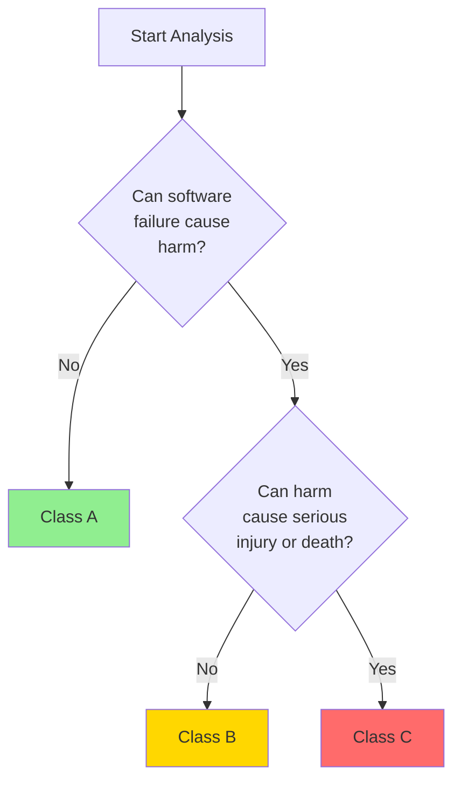

---
title: "IEC 62304 - Medical Device Software Lifecycle Processes"
description: "IEC 62304 standard knowledge, including software safety classification, lifecycle processes, and documentation requirements"
difficulty: "Intermediate"
estimated_time: "6 hours"
tags: ["IEC 62304", "Software Lifecycle", "Medical Standards"]
related_modules:
  - "regulatory-standards/iso-14971"
  - "software-engineering/requirements-engineering"
  - "software-engineering/testing-strategy"
last_updated: "2026-02-07"
version: "1.0"
language: "en-US"
translation_status: complete
---

# IEC 62304 - Medical Device Software Lifecycle Processes

## Learning Objectives

After completing this module, you will be able to:
- Understand the scope and core requirements of IEC 62304 standard
- Master medical device software safety classification methods
- Understand various processes in the software development lifecycle
- Understand documentation requirements for different safety levels
- Apply IEC 62304 requirements to actual projects

## Prerequisites

- Software development fundamentals
- Basic medical device concepts
- Quality management system basics

## Standard Overview

IEC 62304 is a medical device software lifecycle process standard published by the International Electrotechnical Commission (IEC), formally titled "Medical device software - Software life cycle processes". This standard defines the development, maintenance, and risk management processes for medical device software.

### Standard Scope

IEC 62304 applies to:
- Software that is a medical device
- Software that is part of a medical device
- Software used to manufacture medical devices (partial requirements)

### Standard Structure

IEC 62304 includes the following main chapters:
1. Software development process
2. Software maintenance process
3. Software risk management process
4. Software configuration management process
5. Software problem resolution process

## Software Safety Classification

IEC 62304 classifies medical device software into three safety levels based on the severity of harm that software failure may cause:

### Class A (Low Risk)

**Definition**: Software failure cannot result in injury

**Characteristics**:
- Software failure will not cause harm to patients or operators
- Software is only used for information provision or data recording
- No diagnostic or therapeutic functions

**Examples**:
- Patient information management systems
- Medical device usage recording software
- Simple data display software

### Class B (Medium Risk)

**Definition**: Software failure may result in minor injury

**Characteristics**:
- Software failure may cause reversible minor injury
- Software participates in diagnosis or monitoring but does not directly control treatment
- Has manual intervention mechanisms

**Examples**:
- Blood pressure monitoring software
- ECG analysis software
- Medical image processing software

### Class C (High Risk)

**Definition**: Software failure may result in death or serious injury

**Characteristics**:
- Software failure may cause irreversible serious injury or death
- Software directly controls therapeutic or life support functions
- Lacks effective risk mitigation measures

**Examples**:
- Infusion pump control software
- Ventilator control software
- Radiation therapy planning software
- Cardiac pacemaker software

### Safety Classification Method



## Software Development Lifecycle Processes

### 1. Software Development Planning

**Purpose**: Define software development methods, resources, and schedule

**Key Activities**:
- Define development lifecycle model (waterfall, iterative, agile, etc.)
- Identify development team and responsibilities
- Define development standards and tools
- Develop verification and validation plans
- Establish configuration management plan

**Output Documents**:
- Software Development Plan
- Software Verification Plan
- Software Validation Plan

### 2. Software Requirements Analysis

**Purpose**: Define what the software should do

**Key Activities**:
- Identify software requirements from system requirements
- Define functional and performance requirements
- Define software interface requirements
- Define user interface requirements
- Identify safety requirements
- Establish requirements traceability

**Output Documents**:
- Software Requirements Specification (SRS)
- Requirements Traceability Matrix

**Quality Standards**:
- Requirements should be clear and verifiable
- Requirements should be consistent with risk analysis results
- Requirements should be traceable to system requirements

### 3. Software Architectural Design

**Purpose**: Define high-level software structure

**Key Activities**:
- Transform software requirements into architecture
- Define software components and interfaces
- Identify SOUP (Software of Unknown Provenance)
- Define software unit isolation strategy
- Evaluate architectural risk mitigation measures

**Output Documents**:
- Software Architecture Design Document
- SOUP List

**Architecture Pattern Example**:

```
鈹屸攢鈹€鈹€鈹€鈹€鈹€鈹€鈹€鈹€鈹€鈹€鈹€鈹€鈹€鈹€鈹€鈹€鈹€鈹€鈹€鈹€鈹€鈹€鈹€鈹€鈹€鈹€鈹€鈹€鈹€鈹€鈹€鈹€鈹€鈹€鈹€鈹€鈹?
鈹?     Application Layer               鈹?
鈹? - User Interface                    鈹?
鈹? - Business Logic                    鈹?
鈹斺攢鈹€鈹€鈹€鈹€鈹€鈹€鈹€鈹€鈹€鈹€鈹€鈹€鈹€鈹€鈹€鈹€鈹€鈹€鈹€鈹€鈹€鈹€鈹€鈹€鈹€鈹€鈹€鈹€鈹€鈹€鈹€鈹€鈹€鈹€鈹€鈹€鈹?
           鈫?
鈹屸攢鈹€鈹€鈹€鈹€鈹€鈹€鈹€鈹€鈹€鈹€鈹€鈹€鈹€鈹€鈹€鈹€鈹€鈹€鈹€鈹€鈹€鈹€鈹€鈹€鈹€鈹€鈹€鈹€鈹€鈹€鈹€鈹€鈹€鈹€鈹€鈹€鈹?
鈹?     Service Layer                   鈹?
鈹? - Data Processing                   鈹?
鈹? - Algorithm Implementation          鈹?
鈹斺攢鈹€鈹€鈹€鈹€鈹€鈹€鈹€鈹€鈹€鈹€鈹€鈹€鈹€鈹€鈹€鈹€鈹€鈹€鈹€鈹€鈹€鈹€鈹€鈹€鈹€鈹€鈹€鈹€鈹€鈹€鈹€鈹€鈹€鈹€鈹€鈹€鈹?
           鈫?
鈹屸攢鈹€鈹€鈹€鈹€鈹€鈹€鈹€鈹€鈹€鈹€鈹€鈹€鈹€鈹€鈹€鈹€鈹€鈹€鈹€鈹€鈹€鈹€鈹€鈹€鈹€鈹€鈹€鈹€鈹€鈹€鈹€鈹€鈹€鈹€鈹€鈹€鈹?
鈹?     Hardware Abstraction Layer      鈹?
鈹? - Device Drivers                    鈹?
鈹? - Hardware Interfaces               鈹?
鈹斺攢鈹€鈹€鈹€鈹€鈹€鈹€鈹€鈹€鈹€鈹€鈹€鈹€鈹€鈹€鈹€鈹€鈹€鈹€鈹€鈹€鈹€鈹€鈹€鈹€鈹€鈹€鈹€鈹€鈹€鈹€鈹€鈹€鈹€鈹€鈹€鈹€鈹?
```

**Explanation**: This diagram illustrates a typical three-layer software architecture for medical devices compliant with IEC 62304. The Application Layer handles user interactions and business logic, the Service Layer processes data and implements algorithms, and the Hardware Abstraction Layer provides device drivers and hardware interfaces. This layered approach promotes modularity, testability, and maintainability.


### 4. Software Detailed Design

**Purpose**: Define implementation details of software units

**Key Activities**:
- Refine software architecture to implementable units
- Define algorithms and data structures
- Define unit interfaces
- Evaluate detailed design risks

**Output Documents**:
- Software Detailed Design Document

### 5. Software Unit Implementation and Verification

**Purpose**: Implement and verify software units

**Key Activities**:
- Write source code
- Follow coding standards (e.g., MISRA C)
- Execute unit tests
- Execute code reviews
- Execute static analysis

**Verification Methods**:
- Unit testing
- Code review
- Static analysis tools

### 6. Software Integration and Integration Testing

**Purpose**: Integrate software units and verify integration results

**Key Activities**:
- Integrate software units according to integration strategy
- Execute integration tests
- Verify software interfaces
- Verify SOUP integration

**Test Types**:
- Interface testing
- Functional testing
- Performance testing
- Stress testing

### 7. Software System Testing

**Purpose**: Verify software meets all requirements

**Key Activities**:
- Execute system-level tests
- Verify all software requirements
- Execute regression tests
- Record test results

**Test Coverage**:
- Functional testing: Verify all functional requirements
- Performance testing: Verify performance requirements
- Safety testing: Verify safety requirements
- Usability testing: Verify user interface requirements

### 8. Software Release

**Purpose**: Prepare software for production and distribution

**Key Activities**:
- Ensure all verification activities are complete
- Prepare release documentation
- Archive software configuration
- Obtain release approval

**Output Documents**:
- Software Release Record
- Known Issues List
- User Documentation

## Requirements Differences by Safety Level

| Activity | Class A | Class B | Class C |
|----------|---------|---------|---------|
| Software Development Planning | Required | Required | Required |
| Software Requirements Analysis | Required | Required | Required |
| Software Architectural Design | Simplified | Required | Required |
| Software Detailed Design | Not Required | Required | Required |
| Unit Testing | Not Required | Required | Required |
| Integration Testing | Required | Required | Required |
| System Testing | Required | Required | Required |
| Code Review | Not Required | Recommended | Required |
| Static Analysis | Not Required | Recommended | Required |

## Best Practices

!!! tip "Development Practice Recommendations"
    1. **Early Safety Classification**: Determine software safety level early in the project to avoid rework
    2. **Establish Traceability**: Build complete traceability chain from requirements to tests
    3. **Use Automation Tools**: Use static analysis, unit test frameworks, etc. to improve efficiency
    4. **Template Documentation**: Establish standard document templates to ensure consistency
    5. **Continuous Integration**: Adopt CI/CD processes for automated testing and verification

## Common Pitfalls

!!! warning "Cautions"
    1. **Underestimating Safety Classification**: Underestimating software risks leads to insufficient verification
    2. **Documentation Lag**: Code first, documentation later, causing inconsistencies
    3. **Neglecting SOUP Management**: Insufficient evaluation of third-party software risks
    4. **Insufficient Test Coverage**: Especially for Class C software, 100% statement coverage is required
    5. **Improper Change Management**: Unevaluated changes may introduce new risks

## Practice Exercises

1. Perform safety classification for blood glucose monitoring device software and explain reasoning
2. List required documentation for Class B software development process
3. Design a software architecture implementing hardware abstraction layer isolation
4. Develop a test plan for a software unit

## Self-Assessment Questions

??? question "Question 1: How many safety levels does IEC 62304 classify medical device software into? What are the main differences?"
    
    ??? success "Answer"
        IEC 62304 classifies medical device software into three safety levels:
        
        - **Class A (Low Risk)**: Software failure cannot result in injury
        - **Class B (Medium Risk)**: Software failure may result in minor injury
        - **Class C (High Risk)**: Software failure may result in death or serious injury
        
        Main differences lie in the rigor of development process requirements. Class C has the strictest requirements, requiring detailed design, unit testing, code review, and static analysis; Class A has the most lenient requirements, not requiring detailed design and unit testing.

??? question "Question 2: What is SOUP? How is SOUP managed in IEC 62304?"
    
    ??? success "Answer"
        SOUP stands for "Software of Unknown Provenance", referring to third-party libraries, open-source software, or commercial off-the-shelf software (COTS).
        
        IEC 62304 requires:
        1. Identify all SOUP components
        2. Evaluate SOUP functional and performance requirements
        3. Evaluate known SOUP anomalies
        4. Establish and maintain SOUP list
        5. Verify SOUP meets intended use
        6. Monitor SOUP updates and security bulletins

## Related Resources

- [Software Classification Details](software-classificationn.md)
- [ISO 14971 - Risk Management](../iso-14971/index.md)
- [Requirements Engineering](../../software-engineering/requirements-engineering/index.md)
- [Testing Strategy](../../software-engineering/testing-strategy/index.md)

## References

1. IEC 62304:2006+AMD1:2015 - Medical device software - Software life cycle processes
2. FDA Guidance: "Guidance for the Content of Premarket Submissions for Software Contained in Medical Devices"
3. AAMI TIR45:2012 - Guidance on the use of AGILE practices in the development of medical device software
4. ISO/TR 80002-2:2017 - Medical device software - Part 2: Validation of software for medical device quality systems
5. Book: "Medical Device Software Verification, Validation and Compliance" by David A. Vogel
