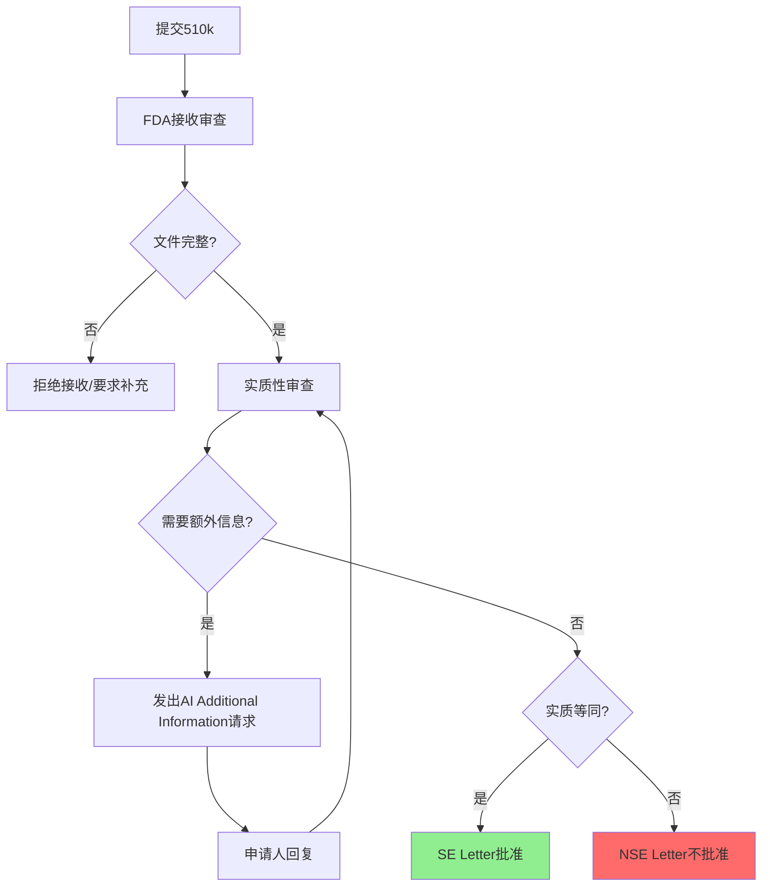

# FDA法规

## 学习目标

完成本模块后，你将能够：
- 理解FDA医疗器械分类和监管要求
- 掌握510(k)申报流程和要求
- 了解PMA（上市前批准）流程
- 理解软件验证和确认的FDA要求
- 应用FDA法规要求到产品开发

## 前置知识

- 医疗器械基本概念
- 美国医疗器械市场基础知识
- 质量管理体系基础

## FDA概述

美国食品药品监督管理局（FDA）是负责监管医疗器械的联邦机构。FDA通过联邦食品、药品和化妆品法案（FD&C Act）和相关法规（21 CFR）监管医疗器械。

### FDA的职责

- 保护公众健康
- 确保医疗器械的安全性和有效性
- 监管医疗器械的上市前审批和上市后监督
- 执行质量体系法规（QSR, 21 CFR Part 820）

## 医疗器械分类

FDA根据风险程度将医疗器械分为三类：

### Class I（低风险）

**特征**：
- 对患者风险最小
- 通常不接触人体内部
- 简单的设计和功能

**监管要求**：
- 一般控制（General Controls）
- 大多数豁免510(k)
- 需要注册和列名

**示例**：
- 手术手套
- 绷带
- 手动手术器械
- 体温计

### Class II（中风险）

**特征**：
- 对患者有中等风险
- 需要特殊控制以确保安全有效
- 大多数医疗器械属于此类

**监管要求**：
- 一般控制 + 特殊控制（Special Controls）
- 通常需要510(k)许可
- 需要遵守QSR

**示例**：
- 血压计
- 心电图机
- 输液泵
- 手术显微镜

### Class III（高风险）

**特征**：
- 对患者有高风险
- 支持或维持生命
- 植入体内或有重大风险

**监管要求**：
- 一般控制 + 特殊控制 + 上市前批准（PMA）
- 最严格的监管
- 需要临床试验数据

**示例**：
- 心脏起搏器
- 人工心脏瓣膜
- 植入式除颤器
- 冠状动脉支架

## 510(k)申报流程

### 什么是510(k)？

510(k)是上市前通知（Premarket Notification），证明新器械与已上市的合法器械（谓词器械）实质等同（Substantially Equivalent, SE）。

### 实质等同性

**定义**：新器械与谓词器械具有：
- 相同的预期用途
- 相同的技术特征，或
- 不同的技术特征但不影响安全性和有效性

### 510(k)类型

1. **传统510(k)**
   - 最常见的类型
   - 需要提供完整的技术和性能数据

2. **特殊510(k)**
   - 用于对已批准器械的修改
   - 使用设计控制和风险分析
   - 审查时间更短（30天）

3. **简化510(k)**
   - 使用FDA认可的共识标准
   - 使用指南文件
   - 简化文档要求

### 510(k)申报内容

**必需内容**：
1. **器械描述**
   - 预期用途和适应症
   - 技术特征
   - 工作原理
   - 材料和组件

2. **实质等同性比较**
   - 谓词器械识别
   - 相同点和不同点分析
   - 性能比较

3. **性能数据**
   - 台架测试（Bench Testing）
   - 动物测试（如需要）
   - 临床数据（如需要）
   - 软件验证和确认

4. **标签和使用说明**
   - 产品标签
   - 使用说明书
   - 警告和注意事项

5. **生物相容性**（如适用）
   - ISO 10993测试
   - 生物相容性评估

6. **灭菌**（如适用）
   - 灭菌方法验证
   - 灭菌残留物测试

7. **软件文档**（如适用）
   - 软件描述
   - 风险分析
   - 验证和确认文档

### 510(k)审查流程

**审查时间**：
- 传统510(k)：90天（FDA目标）
- 特殊510(k)：30天
- 实际时间可能更长，取决于AI请求

## PMA（上市前批准）流程

### 什么是PMA？

PMA是上市前批准（Premarket Approval），是FDA对Class III器械的最严格审查，要求提供科学证据证明器械的安全性和有效性。

### PMA与510(k)的区别

| 特征 | 510(k) | PMA |
|-----|--------|-----|
| 适用器械 | Class I/II | Class III |
| 证明标准 | 实质等同 | 安全有效 |
| 临床数据 | 通常不需要 | 通常需要 |
| 审查时间 | 90天 | 180天 |
| 批准难度 | 较低 | 较高 |

### PMA申报内容

**必需内容**：
1. **非临床研究**
   - 台架测试
   - 动物研究
   - 生物相容性
   - 灭菌验证

2. **临床研究**
   - 临床试验方案
   - 临床试验数据
   - 统计分析
   - 临床结论

3. **制造信息**
   - 制造流程
   - 质量控制
   - 设施信息

4. **标签**
   - 产品标签
   - 使用说明
   - 患者信息

### PMA审查流程

1. **提交前会议**：与FDA讨论申报策略
2. **提交PMA**：提交完整申报文件
3. **接收审查**：FDA检查文件完整性（45天）
4. **实质性审查**：FDA审查科学数据（180天）
5. **咨询委员会**：专家小组评审（如需要）
6. **批准决定**：批准、批准附条件或拒绝

## 软件验证和确认

### FDA软件指南

FDA发布了多个软件相关指南：
- "Guidance for the Content of Premarket Submissions for Software Contained in Medical Devices"
- "General Principles of Software Validation"
- "Cybersecurity for Networked Medical Devices"

### 软件文档级别

FDA根据软件的关注程度（Level of Concern）确定文档要求：

**Minor Level of Concern（轻微关注）**：
- 软件故障不会导致严重伤害
- 文档要求最低

**Moderate Level of Concern（中等关注）**：
- 软件故障可能导致轻微伤害
- 需要中等程度的文档

**Major Level of Concern（重大关注）**：
- 软件故障可能导致严重伤害或死亡
- 需要最详细的文档

### 软件文档要求

**所有级别都需要**：
- 软件描述
- 器械危害分析
- 软件需求规格（SRS）

**Moderate和Major级别额外需要**：
- 软件设计规格（SDS）
- 追溯矩阵
- 软件开发环境描述

**Major级别额外需要**：
- 详细的测试协议和结果
- 修订历史
- 未解决的异常

### 软件验证和确认活动

**验证（Verification）**：
- 单元测试
- 集成测试
- 系统测试
- 代码审查
- 静态分析

**确认（Validation）**：
- 用户需求确认
- 实际使用环境测试
- 用户可用性测试

## 质量体系法规（QSR）

### 21 CFR Part 820

QSR是FDA的质量管理体系法规，类似于ISO 13485但有一些差异。

**主要要求**：
- 管理职责
- 设计控制
- 文档控制
- 采购控制
- 生产和过程控制
- 纠正和预防措施（CAPA）
- 记录和报告

### 设计控制

**设计控制要求**（21 CFR 820.30）：
1. 设计和开发计划
2. 设计输入
3. 设计输出
4. 设计评审
5. 设计验证
6. 设计确认
7. 设计转移
8. 设计变更

## 上市后要求

### 医疗器械报告（MDR）

**要求**：
- 报告死亡事件（30天内）
- 报告严重伤害（30天内）
- 报告故障（30天内，如可能导致死亡或严重伤害）

### 召回

**召回分类**：
- Class I召回：可能导致严重健康后果或死亡
- Class II召回：可能导致暂时或可逆的健康后果
- Class III召回：不太可能导致健康后果

## 最佳实践

!!! tip "FDA合规建议"
    1. **早期沟通**：在开发早期与FDA沟通
    2. **使用共识标准**：使用FDA认可的标准简化审批
    3. **完整文档**：保持完整的设计和测试文档
    4. **风险管理**：整合ISO 14971风险管理
    5. **质量体系**：建立符合QSR的质量体系
    6. **临床策略**：早期规划临床试验策略
    7. **网络安全**：考虑网络安全要求

## 常见陷阱

!!! warning "注意事项"
    1. **谓词器械选择不当**：选择不合适的谓词器械
    2. **实质等同性论证不充分**：未充分证明SE
    3. **软件文档不完整**：软件文档不符合FDA要求
    4. **临床数据不足**：PMA申报缺少足够的临床数据
    5. **标签不合规**：标签不符合FDA要求
    6. **QSR不合规**：质量体系不符合21 CFR 820
    7. **上市后监督不足**：未及时报告不良事件

## 实践练习

1. 为一个血压监测器选择合适的谓词器械并进行实质等同性分析
2. 确定一个医疗器械软件的Level of Concern并列出所需文档
3. 设计一个符合FDA设计控制要求的开发流程
4. 制定一个PMA申报的临床试验计划

## 自测问题

??? question "问题1：FDA医疗器械的三个分类是什么？各有什么特点？"
    
    ??? success "答案"
        **Class I（低风险）**：
        - 对患者风险最小
        - 一般控制
        - 大多数豁免510(k)
        - 示例：手术手套、绷带
        
        **Class II（中风险）**：
        - 中等风险
        - 一般控制 + 特殊控制
        - 通常需要510(k)
        - 示例：血压计、心电图机
        
        **Class III（高风险）**：
        - 高风险，支持或维持生命
        - 需要PMA
        - 最严格监管
        - 示例：心脏起搏器、人工心脏瓣膜

??? question "问题2：什么是实质等同性（SE）？如何证明SE？"
    
    ??? success "答案"
        **实质等同性**：新器械与谓词器械具有相同的预期用途和相同或相似的技术特征。
        
        **证明方法**：
        1. **识别谓词器械**：选择已合法上市的器械
        2. **比较预期用途**：证明预期用途相同
        3. **比较技术特征**：
           - 如果技术特征相同，则SE
           - 如果技术特征不同，需证明不影响安全性和有效性
        4. **提供性能数据**：通过测试证明性能相当或更好
        5. **风险分析**：证明风险相同或更低

??? question "问题3：510(k)和PMA的主要区别是什么？"
    
    ??? success "答案"
        | 特征 | 510(k) | PMA |
        |-----|--------|-----|
        | 适用器械 | Class I/II | Class III |
        | 证明标准 | 实质等同 | 安全有效 |
        | 临床数据 | 通常不需要 | 通常需要 |
        | 审查时间 | 90天 | 180天 |
        | 批准难度 | 较低 | 较高 |
        | 批准率 | 约95% | 约50-60% |
        
        简单记忆：510(k)是"我和别人一样"，PMA是"我是安全有效的"。

??? question "问题4：软件的Level of Concern如何确定？"
    
    ??? success "答案"
        **确定因素**：软件故障可能导致的伤害程度
        
        **Minor Level of Concern**：
        - 软件故障不会导致严重伤害
        - 示例：患者信息管理软件
        
        **Moderate Level of Concern**：
        - 软件故障可能导致轻微伤害
        - 示例：血压监测软件
        
        **Major Level of Concern**：
        - 软件故障可能导致严重伤害或死亡
        - 示例：输液泵控制软件、呼吸机软件
        
        **考虑因素**：
        - 器械的预期用途
        - 软件在器械中的作用
        - 风险缓解措施的有效性
        - 使用环境和用户

??? question "问题5：FDA设计控制的七个要素是什么？"
    
    ??? success "答案"
        根据21 CFR 820.30，设计控制包括：
        
        1. **设计和开发计划**：定义设计活动和职责
        2. **设计输入**：定义器械的需求
        3. **设计输出**：设计的结果（图纸、规格等）
        4. **设计评审**：定期评审设计进展
        5. **设计验证**：确保设计输出满足设计输入
        6. **设计确认**：确保器械满足用户需求
        7. **设计转移**：将设计转移到生产
        8. **设计变更**：控制设计变更
        
        这些要素与IEC 62304的要求类似，但FDA更强调文档化。

??? question "问题6：什么是医疗器械报告（MDR）？何时需要报告？"
    
    ??? success "答案"
        **MDR（Medical Device Reporting）**：制造商向FDA报告与器械相关的不良事件的要求。
        
        **报告时限**：
        - **死亡事件**：30天内报告
        - **严重伤害**：30天内报告
        - **故障**：30天内报告（如果故障可能导致死亡或严重伤害）
        
        **报告内容**：
        - 事件描述
        - 器械信息
        - 患者信息（去标识化）
        - 事件分析
        - 纠正措施
        
        **注意**：
        - 即使不确定器械是否是原因，也应报告
        - 未及时报告可能导致FDA执法行动
        - 报告不等于承认责任

## 相关资源

- [IEC 62304 - 软件生命周期](../iec-62304/index.md)
- [ISO 13485 - 质量管理体系](../iso-13485/index.md)
- [ISO 14971 - 风险管理](../iso-14971/index.md)

## 参考文献

1. 21 CFR Part 820 - Quality System Regulation
2. FDA Guidance: "Guidance for the Content of Premarket Submissions for Software Contained in Medical Devices"
3. FDA Guidance: "General Principles of Software Validation"
4. FDA Guidance: "The 510(k) Program: Evaluating Substantial Equivalence in Premarket Notifications"
5. FDA Guidance: "Deciding When to Submit a 510(k) for a Change to an Existing Device"
6. 书籍：《FDA Regulatory Affairs》by Douglas J. Pisano and David S. Mantus

## 内容模块

- [FDA 510(k) 流程](510k-process.md)
- [FDA PMA 流程](pma-process.md)
- [FDA 软件验证](software-validation.md)
