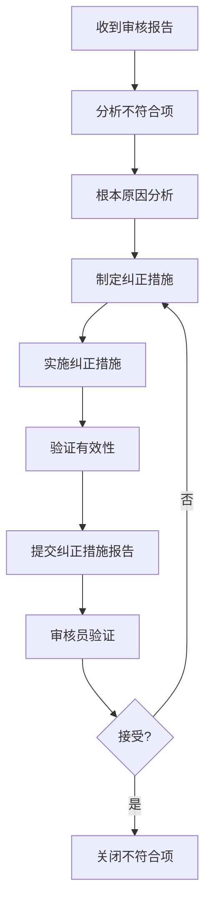

# IEC 62304审核案例分析

## 学习目标

完成本模块后，你将能够：
- 理解IEC 62304审核的重点和方法
- 识别常见的不符合项
- 了解审核员的关注点
- 准备和应对审核
- 实施有效的纠正措施
- 避免常见审核陷阱

## 前置知识

- IEC 62304标准全面知识
- 软件开发生命周期
- 质量管理体系（ISO 13485）
- 文档管理

## 审核概述

### 审核类型

#### 1. 内部审核（Internal Audit）

**目的**：
- 验证过程符合性
- 识别改进机会
- 准备外部审核

**频率**：至少每年一次

#### 2. 外部审核（External Audit）

**类型**：
- **认证审核**：ISO 13485认证机构
- **监管审核**：FDA、公告机构（Notified Body）
- **客户审核**：大客户的供应商审核

#### 3. 审核范围

**典型审核范围**：
- 软件开发计划和过程
- 需求管理和追溯性
- 设计和实现
- 验证和确认
- 风险管理
- 配置管理
- 问题解决
- SOUP管理
- 维护过程

### 审核方法

**审核员常用方法**：
1. **文档审查**：检查文档完整性和一致性
2. **过程审查**：验证过程是否按计划执行
3. **记录审查**：检查活动记录和证据
4. **人员访谈**：了解实际执行情况
5. **现场观察**：观察实际工作过程
6. **追溯性检查**：验证需求到测试的追溯

## 案例1：软件安全分类不当

### 背景

**公司**：中型医疗器械制造商
**产品**：血糖监测系统
**审核类型**：公告机构CE认证审核

### 发现的问题

**不符合项**：软件安全分类为Class B，但审核员认为应为Class C

**审核员观察**：
```markdown
发现：软件安全分类文档
- 软件被分类为Class B（非严重伤害）
- 理由：血糖测量错误可能导致错误的胰岛素剂量，但用户会验证结果

审核员质疑：
- 如果用户依赖错误的血糖值注射胰岛素，可能导致严重低血糖或高血糖
- 严重低血糖可能导致昏迷甚至死亡
- 应分类为Class C（死亡或严重伤害）

证据：
- 风险分析文档显示"严重低血糖"的严重度为"严重"
- 但软件分类文档未充分考虑这一风险
```

### 根本原因

1. **分类方法不当**：
   - 假设用户会验证结果，降低了风险评估
   - 未考虑最坏情况（用户完全依赖设备）

2. **风险分析与分类脱节**：
   - 风险分析识别了严重风险
   - 但软件分类未充分考虑这些风险

### 纠正措施

**立即纠正**：
```markdown
1. 重新评估软件安全分类
   - 重新审查风险分析
   - 考虑最坏情况场景
   - 将软件重新分类为Class C

2. 补充开发活动
   - 补充详细设计文档
   - 补充单元测试文档
   - 执行代码审查
   - 执行静态分析
   - 达到100%代码覆盖率

3. 更新文档
   - 更新软件安全分类文档
   - 更新软件开发计划
   - 更新验证计划和报告
```

**预防措施**：
```markdown
1. 改进分类流程
   - 建立软件分类审查检查清单
   - 要求多人审查分类决定
   - 确保风险分析与分类一致

2. 培训团队
   - 培训软件安全分类方法
   - 强调最坏情况分析原则
   - 分享审核案例

3. 定期审查
   - 在项目里程碑审查分类
   - 在风险分析更新时重新评估分类
```

### 经验教训

!!! warning "关键教训"
    1. **不要低估风险**：始终考虑最坏情况
    2. **保持一致性**：风险分析和软件分类必须一致
    3. **充分论证**：分类决定需要充分的证据支持
    4. **独立审查**：分类决定应由独立人员审查

## 案例2：追溯性不完整

### 背景

**公司**：小型医疗软件公司
**产品**：医学影像分析软件（SaMD）
**审核类型**：FDA 510(k)审查

### 发现的问题

**不符合项**：需求到测试的追溯性不完整

**审核员观察**：
```markdown
发现：追溯矩阵审查
- 软件需求规格说明包含85个需求
- 追溯矩阵只覆盖了72个需求
- 13个需求没有对应的测试用例

具体示例：
- 需求SR-045: "系统应在5秒内完成图像加载"
  → 无对应测试用例
- 需求SR-062: "系统应支持DICOM格式"
  → 无对应测试用例
- 需求SR-078: "系统应记录所有用户操作"
  → 无对应测试用例

影响：
- 无法证明这些需求已被验证
- 可能存在未测试的功能
```

### 根本原因

1. **追溯管理不当**：
   - 手工维护追溯矩阵，容易遗漏
   - 需求变更后未更新追溯矩阵
   - 缺少追溯性验证流程

2. **过程执行不力**：
   - 测试计划制定时未检查追溯性
   - 测试执行后未验证覆盖率
   - 发布前未进行追溯性审查

### 纠正措施

**立即纠正**：
```markdown
1. 补充缺失的测试用例
   - 为13个需求编写测试用例
   - 执行测试并记录结果
   - 更新追溯矩阵

2. 验证追溯性完整性
   - 逐一检查所有需求
   - 确保每个需求都有对应的测试
   - 确保每个测试都追溯到需求

3. 更新文档
   - 更新测试计划
   - 更新测试报告
   - 更新追溯矩阵
```

**预防措施**：
```markdown
1. 使用追溯管理工具
   - 采用需求管理工具（如DOORS、Jira）
   - 自动生成追溯矩阵
   - 自动检查追溯性完整性

2. 建立追溯性检查点
   - 需求评审：检查需求可追溯性
   - 测试计划评审：检查测试覆盖
   - 测试执行后：验证追溯性
   - 发布前：完整性审查

3. 定义追溯性标准
   - 每个需求必须有至少一个测试用例
   - 每个测试用例必须追溯到至少一个需求
   - 追溯关系必须在工具中维护
```

### 经验教训

!!! warning "关键教训"
    1. **使用工具**：手工维护追溯矩阵容易出错
    2. **建立检查点**：在关键里程碑验证追溯性
    3. **自动化检查**：使用工具自动检查完整性
    4. **持续维护**：追溯性是持续的活动，不是一次性的

## 案例3：SOUP管理不足

### 背景

**公司**：中型嵌入式医疗器械公司
**产品**：便携式心电监护仪
**审核类型**：ISO 13485认证审核

### 发现的问题

**不符合项**：SOUP识别不完整，验证不充分

**审核员观察**：
```markdown
发现1：SOUP清单不完整
- SOUP清单列出了FreeRTOS和mbedTLS
- 但代码中使用了STM32 HAL库，未在清单中
- 使用了标准C库函数，未在清单中
- 使用了GCC编译器，未在清单中

发现2：SOUP验证不充分
- FreeRTOS验证报告只测试了任务创建
- 未测试实际使用的其他功能（互斥量、队列等）
- mbedTLS验证报告缺失

发现3：SOUP已知异常未记录
- FreeRTOS发布说明中提到的已知问题未在文档中记录
- 未评估这些已知问题的影响
```

### 根本原因

1. **SOUP识别不系统**：
   - 缺少SOUP识别检查清单
   - 未分析构建依赖
   - 未考虑开发工具

2. **验证范围不足**：
   - 只测试了部分功能
   - 未基于预期用途进行验证
   - 缺少验证计划

3. **已知异常管理缺失**：
   - 未建立SOUP监控机制
   - 未查阅SOUP发布说明
   - 未评估已知问题影响

### 纠正措施

**立即纠正**：
```markdown
1. 完善SOUP清单
   - 添加STM32 HAL库
   - 添加标准C库
   - 添加GCC编译器
   - 分析并添加所有遗漏的SOUP

2. 补充SOUP验证
   - 为每个SOUP制定验证计划
   - 基于预期用途测试所有使用的功能
   - 记录验证结果

3. 记录已知异常
   - 查阅所有SOUP的发布说明
   - 记录已知问题
   - 评估影响并定义缓解措施

4. 更新文档
   - 更新SOUP清单
   - 补充SOUP验证报告
   - 添加SOUP已知异常文档
```

**预防措施**：
```markdown
1. 建立SOUP识别流程
   - 使用SOUP识别检查清单
   - 分析构建系统依赖
   - 在架构设计阶段识别SOUP

2. 建立SOUP验证标准
   - 验证计划必须基于预期用途
   - 测试所有使用的功能
   - 记录验证环境和结果

3. 建立SOUP监控机制
   - 订阅SOUP更新通知
   - 定期检查SOUP发布说明
   - 评估已知问题和安全公告

4. 使用工具支持
   - 使用依赖分析工具
   - 使用SOUP管理工具
   - 自动化SOUP清单生成
```

### 经验教训

!!! warning "关键教训"
    1. **系统识别SOUP**：使用检查清单和工具，不要遗漏
    2. **充分验证SOUP**：基于预期用途验证所有使用的功能
    3. **管理已知异常**：主动查阅和评估SOUP的已知问题
    4. **持续监控SOUP**：建立SOUP监控和更新机制

## 案例4：维护过程缺失

### 背景

**公司**：医疗软件初创公司
**产品**：远程患者监护平台（SaaS）
**审核类型**：公告机构CE认证审核

### 发现的问题

**不符合项**：缺少软件维护过程和文档

**审核员观察**：
```markdown
发现1：无维护计划
- 软件已发布并在使用中
- 已收到客户问题报告
- 已发布过更新版本
- 但没有软件维护计划文档

发现2：问题管理不规范
- 使用GitHub Issues跟踪问题
- 但没有问题分类和优先级标准
- 没有问题解决流程文档
- 没有问题趋势分析

发现3：维护发布不规范
- 已发布v1.1和v1.2维护版本
- 但没有维护发布记录
- 没有影响分析文档
- 没有回归测试报告

发现4：变更控制不足
- 代码变更直接提交到主分支
- 没有变更评审流程
- 没有变更影响分析
```

### 根本原因

1. **过程意识不足**：
   - 团队来自互联网行业，习惯敏捷开发
   - 不了解医疗器械软件的维护要求
   - 认为GitHub Issues足够

2. **文档化不足**：
   - 过程虽然在执行，但没有文档化
   - 缺少正式的计划和记录
   - 无法证明符合IEC 62304要求

3. **质量管理缺失**：
   - 没有建立质量管理体系
   - 缺少过程审核和改进
   - 缺少培训和意识提升

### 纠正措施

**立即纠正**：
```markdown
1. 编写维护计划
   - 定义维护过程和流程
   - 定义角色和职责
   - 定义问题分类和优先级标准
   - 定义变更控制流程

2. 补充维护文档
   - 为v1.1和v1.2编写维护发布记录
   - 补充影响分析文档
   - 补充回归测试报告

3. 规范问题管理
   - 在GitHub Issues中添加标签（分类、优先级）
   - 建立问题处理模板
   - 定义问题状态流转规则

4. 建立变更控制
   - 使用Pull Request进行代码审查
   - 要求变更影响分析
   - 要求测试证据
```

**预防措施**：
```markdown
1. 建立质量管理体系
   - 制定质量手册
   - 建立过程文档
   - 定义文档模板

2. 培训团队
   - IEC 62304标准培训
   - 医疗器械软件开发培训
   - 文档编写培训

3. 建立过程审核
   - 定期内部审核
   - 过程符合性检查
   - 持续改进

4. 使用合适的工具
   - 使用Jira等专业工具
   - 集成需求、开发、测试工具
   - 自动化文档生成
```

### 经验教训

!!! warning "关键教训"
    1. **医疗器械软件不同于互联网软件**：需要更严格的过程和文档
    2. **过程必须文档化**：执行了但没有文档，等于没有执行
    3. **维护与开发同等重要**：维护过程必须符合IEC 62304要求
    4. **培训很重要**：团队必须理解医疗器械软件的特殊要求

## 案例5：风险管理与开发脱节

### 背景

**公司**：大型医疗器械公司
**产品**：手术导航系统
**审核类型**：FDA 510(k)审查

### 发现的问题

**不符合项**：软件风险管理与开发过程脱节

**审核员观察**：
```markdown
发现1：风险分析与需求脱节
- 风险分析识别了"图像配准错误"的风险
- 但软件需求规格说明中没有对应的安全需求
- 无法追溯风险到需求

发现2：风险控制措施未实施
- 风险分析定义了"双重验证算法"作为风险控制措施
- 但软件设计文档中没有这个算法
- 代码中也没有实现

发现3：风险控制验证不足
- 风险分析要求验证风险控制措施的有效性
- 但测试计划中没有对应的测试用例
- 无法证明风险控制措施有效

发现4：剩余风险未评估
- 实施风险控制措施后，未重新评估剩余风险
- 无法证明剩余风险可接受
```

### 根本原因

1. **过程集成不足**：
   - 风险管理和软件开发由不同团队负责
   - 两个过程独立执行，缺少集成
   - 缺少跨团队沟通机制

2. **追溯性缺失**：
   - 风险到需求的追溯缺失
   - 需求到设计的追溯缺失
   - 设计到测试的追溯缺失

3. **验证不充分**：
   - 未验证风险控制措施的实施
   - 未验证风险控制措施的有效性
   - 未评估剩余风险

### 纠正措施

**立即纠正**：
```markdown
1. 建立风险到需求的追溯
   - 审查所有风险控制措施
   - 在软件需求中添加对应的安全需求
   - 建立追溯关系

2. 实施缺失的风险控制措施
   - 在软件设计中添加"双重验证算法"
   - 实施代码
   - 进行单元测试和集成测试

3. 验证风险控制措施
   - 在测试计划中添加风险控制验证测试
   - 执行测试
   - 记录验证结果

4. 评估剩余风险
   - 重新评估实施风险控制措施后的剩余风险
   - 确认剩余风险可接受
   - 更新风险管理报告
```

**预防措施**：
```markdown
1. 集成风险管理和软件开发
   - 在需求分析阶段集成风险分析
   - 在设计阶段实施风险控制措施
   - 在测试阶段验证风险控制措施

2. 建立完整的追溯性
   - 风险 → 安全需求
   - 安全需求 → 设计
   - 设计 → 实现
   - 实现 → 测试

3. 定义集成流程
   - 定义风险管理和软件开发的接口
   - 定义跨团队沟通机制
   - 定义联合评审流程

4. 使用集成工具
   - 使用支持风险管理和需求管理集成的工具
   - 自动化追溯性管理
   - 自动化验证覆盖检查
```

### 经验教训

!!! warning "关键教训"
    1. **风险管理必须集成到开发过程**：不能独立执行
    2. **建立完整的追溯链**：从风险到测试的完整追溯
    3. **验证风险控制措施**：必须验证实施和有效性
    4. **跨团队协作很重要**：风险管理和开发团队必须紧密协作

## 审核准备最佳实践

### 审核前准备

**准备检查清单**：

```markdown
# IEC 62304审核准备检查清单

## 1. 文档准备 (提前4周)
- [ ] 软件开发计划
- [ ] 软件需求规格说明
- [ ] 软件架构设计文档
- [ ] 软件详细设计文档
- [ ] 软件验证计划和报告
- [ ] 软件确认计划和报告
- [ ] 软件发布记录
- [ ] 软件维护计划
- [ ] SOUP清单和验证报告
- [ ] 风险管理文档
- [ ] 追溯矩阵

## 2. 文档审查 (提前3周)
- [ ] 检查文档完整性
- [ ] 检查文档一致性
- [ ] 检查追溯性完整性
- [ ] 检查签名和批准
- [ ] 检查版本控制

## 3. 内部预审核 (提前2周)
- [ ] 模拟审核过程
- [ ] 识别潜在问题
- [ ] 实施纠正措施
- [ ] 验证纠正措施有效性

## 4. 团队准备 (提前1周)
- [ ] 培训团队审核流程
- [ ] 分配审核角色
- [ ] 准备审核问题答案
- [ ] 准备演示和展示

## 5. 现场准备 (审核前1天)
- [ ] 准备审核会议室
- [ ] 准备文档副本
- [ ] 准备演示环境
- [ ] 准备茶点和午餐
```

### 审核中应对

**应对策略**：

1. **诚实回答**：
   - 不要隐瞒问题
   - 不要夸大事实
   - 不确定时说"我需要确认"

2. **提供证据**：
   - 用文档和记录支持回答
   - 展示实际工作产品
   - 演示过程执行

3. **保持专业**：
   - 尊重审核员
   - 不要争辩
   - 记录审核员的观察

4. **及时澄清**：
   - 如果审核员误解，及时澄清
   - 提供额外信息
   - 但不要过度解释

### 审核后跟进

**纠正措施流程**：



## 常见审核发现总结

### 高频不符合项

| 排名 | 不符合项 | 频率 | 严重度 |
|------|---------|------|--------|
| 1 | 追溯性不完整 | 85% | 中 |
| 2 | SOUP管理不足 | 75% | 中-高 |
| 3 | 软件分类不当 | 60% | 高 |
| 4 | 维护过程缺失 | 55% | 中 |
| 5 | 风险管理脱节 | 50% | 高 |
| 6 | 文档不一致 | 45% | 低-中 |
| 7 | 测试覆盖不足 | 40% | 中 |
| 8 | 变更控制不严 | 35% | 中 |
| 9 | 已知异常未记录 | 30% | 中 |
| 10 | 配置管理混乱 | 25% | 低-中 |

### 预防措施总结

!!! tip "避免审核发现的最佳实践"
    1. **建立完善的过程**：文档化所有过程和流程
    2. **使用工具支持**：使用专业工具管理需求、测试、追溯
    3. **建立检查点**：在关键里程碑进行内部审查
    4. **培训团队**：确保团队理解IEC 62304要求
    5. **定期内部审核**：提前发现和解决问题
    6. **保持文档更新**：文档与代码同步更新
    7. **建立追溯性**：从需求到测试的完整追溯
    8. **集成风险管理**：风险管理与开发过程集成
    9. **充分验证SOUP**：系统识别和验证所有SOUP
    10. **规范维护过程**：建立完善的维护计划和流程

## 实践练习

1. 模拟一次IEC 62304内部审核，识别潜在不符合项
2. 分析一个审核发现，进行根本原因分析并制定纠正措施
3. 准备一份审核准备检查清单，包含所有必需文档
4. 设计一个追溯性验证流程，确保追溯性完整
5. 制定一个SOUP管理流程，避免SOUP相关的审核发现

## 相关资源

- [IEC 62304 标准概述](index.md)
- [IEC 62304 生命周期过程](lifecycle-processes.md)
- [SOUP管理详解](soup-management.md)
- [软件维护流程](maintenance-process.md)
- [问题解决流程](problem-resolution.md)
- [ISO 13485 质量管理](../iso-13485/index.md)

## 参考文献

1. IEC 62304:2006+AMD1:2015 - Medical device software - Software life cycle processes
2. ISO 13485:2016 - Medical devices - Quality management systems
3. ISO 19011:2018 - Guidelines for auditing management systems
4. FDA Guidance: "General Principles of Software Validation"
5. MDCG 2019-11: "Guidance on Qualification and Classification of Software"
6. 书籍：《Auditing Medical Device Software》by David Nettleton
