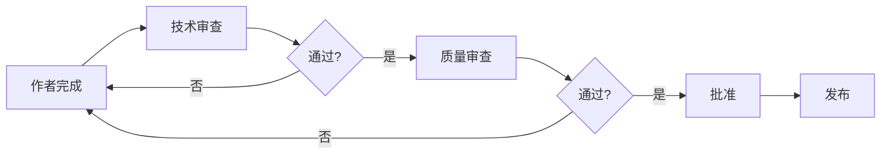

# IEC 62304 文档要求

## 学习目标

完成本模块后，你将能够：
- 理解IEC 62304要求的所有必需文档
- 掌握不同安全等级的文档要求差异
- 了解文档模板的结构和内容
- 应用文档管理最佳实践
- 建立符合IEC 62304的文档体系

## 前置知识

- IEC 62304标准基础知识
- 软件生命周期过程
- 医疗器械软件安全分类
- 文档管理基础

## 内容

### 文档要求概览

IEC 62304要求建立完整的文档体系，以证明软件开发过程的合规性和可追溯性。

**文档的作用**：
- 📋 证明符合标准要求
- 🔍 支持审核和检查
- 📊 建立可追溯性
- 🔄 支持维护和变更
- 📚 知识传承和培训

**文档分类**：
1. **计划文档**：定义如何执行过程
2. **规格文档**：定义软件应该做什么和如何做
3. **记录文档**：记录实际执行的活动和结果

## 必需文档清单

### 按生命周期过程分类

#### 1. 软件开发过程文档

| 文档名称 | Class A | Class B | Class C | 说明 |
|---------|---------|---------|---------|------|
| 软件开发计划 | ✅ | ✅ | ✅ | 定义开发方法和资源 |
| 软件需求规格说明 | ✅ | ✅ | ✅ | 定义软件功能和性能要求 |
| 软件架构设计 | 简化 | ✅ | ✅ | 定义软件高层结构 |
| 软件详细设计 | ❌ | ✅ | ✅ | 定义软件单元实现细节 |
| 软件验证计划 | ✅ | ✅ | ✅ | 定义验证策略和方法 |
| 软件验证报告 | ✅ | ✅ | ✅ | 记录验证活动和结果 |
| 软件确认计划 | ✅ | ✅ | ✅ | 定义确认策略和方法 |
| 软件确认报告 | ✅ | ✅ | ✅ | 记录确认活动和结果 |
| 软件发布记录 | ✅ | ✅ | ✅ | 记录发布的软件配置 |
| 需求追溯矩阵 | ✅ | ✅ | ✅ | 建立需求到测试的追溯 |

#### 2. 软件维护过程文档

| 文档名称 | Class A | Class B | Class C | 说明 |
|---------|---------|---------|---------|------|
| 软件维护计划 | ✅ | ✅ | ✅ | 定义维护方法和流程 |
| 问题报告 | ✅ | ✅ | ✅ | 记录软件问题 |
| 修改请求 | ✅ | ✅ | ✅ | 记录修改需求 |
| 维护记录 | ✅ | ✅ | ✅ | 记录维护活动 |

#### 3. 软件风险管理文档

| 文档名称 | Class A | Class B | Class C | 说明 |
|---------|---------|---------|---------|------|
| 软件风险管理计划 | ✅ | ✅ | ✅ | 定义风险管理方法 |
| 软件风险分析 | ✅ | ✅ | ✅ | 识别和分析软件风险 |
| 风险控制措施 | ✅ | ✅ | ✅ | 定义风险缓解措施 |
| 风险管理报告 | ✅ | ✅ | ✅ | 总结风险管理活动 |

#### 4. 软件配置管理文档

| 文档名称 | Class A | Class B | Class C | 说明 |
|---------|---------|---------|---------|------|
| 软件配置管理计划 | ✅ | ✅ | ✅ | 定义配置管理方法 |
| 配置项清单 | ✅ | ✅ | ✅ | 列出所有配置项 |
| 变更记录 | ✅ | ✅ | ✅ | 记录配置变更 |
| SOUP清单 | ✅ | ✅ | ✅ | 列出第三方软件 |

#### 5. 软件问题解决文档

| 文档名称 | Class A | Class B | Class C | 说明 |
|---------|---------|---------|---------|------|
| 问题解决计划 | ✅ | ✅ | ✅ | 定义问题解决流程 |
| 问题报告 | ✅ | ✅ | ✅ | 记录问题详情 |
| 问题分析记录 | ✅ | ✅ | ✅ | 记录根本原因分析 |

## 核心文档详解

### 1. 软件开发计划（Software Development Plan, SDP）

**目的**：定义软件开发的方法、资源和时间表

**必需内容**：

```markdown
# 软件开发计划

## 1. 项目概述
- 项目名称和标识
- 软件安全分类（Class A/B/C）
- 项目范围和目标
- 预期用途

## 2. 组织和职责
- 项目组织结构
- 团队成员和角色
- 职责分配
- 沟通机制

## 3. 开发生命周期模型
- 选择的生命周期模型（瀑布、迭代、敏捷等）
- 各阶段定义
- 阶段间的评审和批准

## 4. 开发标准和方法
- 编码标准（如MISRA C）
- 设计方法
- 文档标准
- 命名规范

## 5. 开发工具和环境
- 开发工具（IDE、编译器）
- 版本控制系统
- 测试工具
- 静态分析工具
- 需求管理工具

## 6. 交付物
- 文档清单
- 软件交付物
- 交付时间表

## 7. 验证和确认
- 验证策略
- 确认策略
- 测试方法
- 验收标准

## 8. 风险管理
- 风险管理方法
- 与ISO 14971的集成

## 9. 配置管理
- 配置管理方法
- 版本控制策略
- 变更控制流程

## 10. 问题解决
- 问题报告流程
- 问题跟踪方法
- 升级机制

## 11. 文档管理
- 文档控制流程
- 文档审批流程
- 文档归档方法
```

**模板示例**：

```
文档编号: SDP-001
版本: 1.0
日期: 2026-02-09
项目: 血压监测设备软件

1. 项目概述
   项目名称: BP-Monitor-SW
   软件安全分类: Class B
   项目范围: 开发血压测量和数据管理软件
   预期用途: 家用血压监测

2. 组织和职责
   项目经理: 张三
   软件架构师: 李四
   开发工程师: 王五、赵六
   测试工程师: 孙七
   质量保证: 周八

3. 开发生命周期模型
   采用迭代开发模型，包含以下阶段：
   - 需求分析（2周）
   - 架构设计（1周）
   - 详细设计（2周）
   - 实现和单元测试（4周）
   - 集成测试（2周）
   - 系统测试（2周）
   - 发布准备（1周）

4. 开发标准
   - 编码标准: MISRA C 2012
   - 注释规范: Doxygen格式
   - 文档模板: 公司标准模板
```

**说明**: 这是软件开发计划(SDP)文档的示例模板。包含项目概述、软件安全分类、项目范围和预期用途等关键信息，是IEC 62304要求的核心文档之一。


### 2. 软件需求规格说明（Software Requirements Specification, SRS）

**目的**：定义软件应该实现的功能和性能

**必需内容**：

```markdown
# 软件需求规格说明

## 1. 引言
- 文档目的
- 文档范围
- 术语和缩写
- 参考文档

## 2. 总体描述
- 产品视角
- 产品功能
- 用户特征
- 约束条件
- 假设和依赖

## 3. 功能需求
- FR-001: [功能需求描述]
- FR-002: [功能需求描述]
- ...

## 4. 性能需求
- 响应时间要求
- 吞吐量要求
- 资源使用要求

## 5. 接口需求
- 硬件接口
- 软件接口
- 用户界面
- 通信接口

## 6. 安全需求
- 来自风险分析的安全需求
- 风险控制措施
- 报警和警告要求

## 7. 数据要求
- 数据定义
- 数据范围和约束
- 数据验证规则

## 8. 可靠性和可用性要求
- 可靠性指标
- 可用性指标
- 故障处理要求

## 9. 可维护性要求
- 诊断功能
- 日志记录
- 错误报告

## 10. 追溯性
- 需求到系统需求的追溯
- 需求到风险的追溯
```

**需求编写示例**：

```
需求ID: FR-BP-001
标题: 血压测量功能
优先级: 高
安全等级: Class B
来源: 系统需求 SR-001

描述:
系统应能够测量用户的收缩压和舒张压。

详细要求:
1. 测量范围：
   - 收缩压: 70-200 mmHg
   - 舒张压: 40-130 mmHg
   
2. 测量精度：±3 mmHg

3. 测量时间：不超过60秒

4. 输入：
   - 来自压力传感器的ADC数据
   - 采样率: 100 Hz
   
5. 输出：
   - 收缩压值（mmHg）
   - 舒张压值（mmHg）
   - 测量质量指示
   
6. 错误处理：
   - 如果测量失败，显示错误信息
   - 如果数据超出范围，拒绝测量

验证方法: 系统测试
追溯到: SR-001, RISK-003
```

**说明**: 这是软件需求规格(SRS)文档中需求条目的示例格式。每个需求包含ID、标题、优先级、安全等级、来源、描述和详细要求，确保需求的完整性和可追溯性。


### 3. 软件架构设计文档（Software Architecture Design Document）

**目的**：定义软件的高层结构

**必需内容**：

```markdown
# 软件架构设计文档

## 1. 架构概述
- 架构目标
- 架构约束
- 架构原则

## 2. 架构视图
- 逻辑视图：组件和接口
- 物理视图：部署结构
- 开发视图：模块组织
- 过程视图：运行时行为

## 3. 软件组件
- 组件清单
- 组件职责
- 组件接口

## 4. 软件单元
- 单元划分
- 单元接口
- 单元依赖关系

## 5. SOUP
- SOUP清单
- SOUP功能和限制
- SOUP已知异常
- SOUP使用方式

## 6. 隔离策略
- 安全等级隔离
- 硬件抽象层
- 错误隔离机制

## 7. 数据流和控制流
- 主要数据流
- 控制流程
- 状态机

## 8. 架构风险分析
- 架构层面的风险
- 风险缓解措施
```

**架构图示例**：

```
┌─────────────────────────────────────────────┐
│          应用层 (Application Layer)          │
│  ┌──────────────┐  ┌──────────────┐        │
│  │ 用户界面模块  │  │ 数据管理模块  │        │
│  └──────────────┘  └──────────────┘        │
└─────────────────────────────────────────────┘
                    ↓
┌─────────────────────────────────────────────┐
│          服务层 (Service Layer)              │
│  ┌──────────────┐  ┌──────────────┐        │
│  │ 测量算法模块  │  │ 数据处理模块  │        │
│  └──────────────┘  └──────────────┘        │
└─────────────────────────────────────────────┘
                    ↓
┌─────────────────────────────────────────────┐
│      硬件抽象层 (Hardware Abstraction Layer) │
│  ┌──────────────┐  ┌──────────────┐        │
│  │ 传感器驱动    │  │ 显示驱动      │        │
│  └──────────────┘  └──────────────┘        │
└─────────────────────────────────────────────┘
```

**说明**: 这是软件架构设计文档中的架构图示例。展示了应用层、服务层和硬件抽象层的分层架构，以及各层之间的依赖关系，帮助理解系统的整体结构。


### 4. 软件详细设计文档（Software Detailed Design Document）

**目的**：定义软件单元的实现细节

**必需内容**：

```markdown
# 软件详细设计文档

## 1. 单元设计
对每个软件单元：

### 单元名称: [单元名]
- 单元ID
- 单元职责
- 输入和输出
- 算法描述
- 数据结构
- 接口规格
- 错误处理
- 性能考虑
- 风险分析

## 2. 数据结构定义
- 结构体定义
- 枚举定义
- 常量定义

## 3. 算法详细说明
- 伪代码或流程图
- 计算公式
- 状态机

## 4. 接口详细规格
- 函数原型
- 参数说明
- 返回值说明
- 前置条件和后置条件
```

**详细设计示例**：

```c
/**
 * 单元名称: 血压计算模块
 * 单元ID: UNIT-BP-CALC-001
 * 职责: 从原始传感器数据计算血压值
 */

/**
 * @brief 计算血压
 * @param raw_data 原始ADC数据数组
 * @param length 数据长度
 * @param result 输出结果结构体
 * @return 0成功，-1失败
 * 
 * 算法步骤：
 * 1. 数据预处理
 *    - 去除异常值
 *    - 低通滤波（截止频率20Hz）
 * 2. 特征提取
 *    - 检测压力峰值
 *    - 检测脉搏波形
 * 3. 血压计算
 *    - 收缩压 = 最大压力峰值
 *    - 舒张压 = 使用振荡法计算
 * 4. 结果验证
 *    - 检查范围有效性
 *    - 检查逻辑一致性
 * 
 * 前置条件:
 * - raw_data不为NULL
 * - length >= 100
 * - result不为NULL
 * 
 * 后置条件:
 * - 如果成功，result包含有效的血压值
 * - 如果失败，result未修改
 */
int calculate_blood_pressure(
    const uint16_t* raw_data,
    size_t length,
    BloodPressureResult* result
);

/**
 * 数据结构定义
 */
typedef struct {
    uint16_t systolic;      // 收缩压 (mmHg)
    uint16_t diastolic;     // 舒张压 (mmHg)
    uint8_t quality;        // 测量质量 (0-100)
    uint32_t timestamp;     // 时间戳
} BloodPressureResult;
```

### 5. 软件验证计划和报告

**验证计划内容**：

```markdown
# 软件验证计划

## 1. 验证策略
- 验证方法（测试、审查、分析）
- 验证级别（单元、集成、系统）
- 验证覆盖目标

## 2. 单元验证
- 单元测试方法
- 测试工具
- 覆盖率目标

## 3. 集成验证
- 集成策略
- 集成测试方法
- 接口测试

## 4. 系统验证
- 系统测试方法
- 测试环境
- 测试数据

## 5. 代码审查
- 审查方法
- 审查检查清单
- 审查记录

## 6. 静态分析
- 分析工具
- 分析规则
- 缺陷处理

## 7. 追溯性验证
- 需求覆盖验证
- 追溯矩阵验证

## 8. 验证资源
- 人员和角色
- 工具和设备
- 时间表
```

**验证报告内容**：

```markdown
# 软件验证报告

## 1. 验证概述
- 验证范围
- 验证方法
- 验证环境

## 2. 验证结果
- 单元测试结果
- 集成测试结果
- 系统测试结果
- 代码审查结果
- 静态分析结果

## 3. 覆盖率分析
- 需求覆盖率
- 代码覆盖率（语句、分支）
- 覆盖率报告

## 4. 缺陷统计
- 发现的缺陷数量
- 缺陷严重性分布
- 缺陷状态

## 5. 验证结论
- 验证是否通过
- 未解决的问题
- 风险评估
```

### 6. 软件发布记录

**必需内容**：

```markdown
# 软件发布记录

## 1. 发布信息
- 软件名称和版本
- 发布日期
- 发布批准人

## 2. 软件配置
- 源代码版本
- 构建工具和版本
- 编译选项
- 依赖库版本

## 3. 已知问题
- 已知缺陷清单
- 限制和约束
- 使用注意事项

## 4. 验证状态
- 验证活动完成状态
- 测试通过状态
- 未解决问题的风险评估

## 5. 交付物
- 可执行文件
- 配置文件
- 用户文档
- 安装指南

## 6. 归档信息
- 归档位置
- 归档内容清单
```

## 文档管理最佳实践

### 1. 文档模板化

**优势**：
- ✅ 确保一致性
- ✅ 提高效率
- ✅ 减少遗漏
- ✅ 便于审核

**实施方法**：
- 为每种文档类型建立标准模板
- 在模板中包含必需章节
- 提供填写指南和示例
- 定期更新模板

### 2. 文档版本控制

**版本命名规则**：
```
主版本.次版本.修订版本
例如: 1.2.3

主版本: 重大变更
次版本: 功能增加或修改
修订版本: 错误修正或小改进
```

**版本控制实践**：
- 所有文档纳入版本控制系统
- 记录每次修改的原因
- 保留历史版本
- 建立文档审批流程

### 3. 文档追溯性

**追溯矩阵示例**：

| 需求ID | 设计ID | 代码单元 | 测试用例 | 状态 |
|--------|--------|----------|----------|------|
| FR-001 | ARCH-001 | bp_calc.c | TC-001, TC-002 | ✅ |
| FR-002 | ARCH-002 | ui_display.c | TC-003 | ✅ |
| FR-003 | ARCH-003 | data_mgmt.c | TC-004, TC-005 | 🔄 |

**追溯性工具**：
- 需求管理工具（DOORS, Jira）
- 电子表格
- 专用追溯工具

### 4. 文档审查和批准

**审查流程**：


**审查检查清单**：
- ✅ 内容完整性
- ✅ 技术准确性
- ✅ 符合模板要求
- ✅ 追溯性完整
- ✅ 格式和语言规范

### 5. 文档归档和检索

**归档原则**：
- 按项目组织
- 按文档类型分类
- 包含版本信息
- 便于检索

**归档结构示例**：
```
项目根目录/
├── 01_计划/
│   ├── SDP_v1.0.pdf
│   ├── 验证计划_v1.0.pdf
│   └── 维护计划_v1.0.pdf
├── 02_需求/
│   ├── SRS_v1.2.pdf
│   └── 需求追溯矩阵_v1.2.xlsx
├── 03_设计/
│   ├── 架构设计_v1.1.pdf
│   └── 详细设计_v1.0.pdf
├── 04_测试/
│   ├── 测试计划_v1.0.pdf
│   ├── 测试报告_v1.0.pdf
│   └── 测试用例_v1.0.xlsx
└── 05_发布/
    ├── 发布记录_v1.0.pdf
    └── 用户手册_v1.0.pdf
```

**说明**: 这是IEC 62304项目文档的推荐目录结构。按照开发生命周期阶段组织文档，包括计划、需求、设计、实现、测试、发布和维护等目录，便于文档管理和审核。


## 不同安全等级的文档要求对比

### Class A 文档要求

**简化的文档**：
- 软件开发计划（简化）
- 软件需求规格说明
- 软件架构设计（简化）
- 软件验证计划和报告
- 软件发布记录

**可省略的文档**：
- 软件详细设计
- 单元测试文档
- 代码审查记录
- 静态分析报告

### Class B 文档要求

**完整的文档**：
- 所有计划文档
- 需求和设计文档（包括详细设计）
- 验证和测试文档
- 单元测试文档
- 发布文档

**推荐但非必需**：
- 代码审查记录
- 静态分析报告

### Class C 文档要求

**最严格的文档**：
- 所有Class B要求的文档
- 代码审查记录（必需）
- 静态分析报告（必需）
- 详细的测试覆盖率报告
- 完整的追溯矩阵

## 最佳实践

!!! tip "文档管理建议"
    1. **及时更新**：文档应与代码同步更新，避免滞后
    2. **使用工具**：使用文档管理工具提高效率
    3. **模板标准化**：建立并维护标准文档模板
    4. **审查机制**：建立文档审查和批准流程
    5. **追溯性管理**：使用工具管理追溯关系
    6. **版本控制**：所有文档纳入版本控制
    7. **定期审核**：定期审核文档完整性和一致性
    8. **培训团队**：确保团队理解文档要求

## 常见陷阱

!!! warning "注意事项"
    1. **文档滞后**：代码先行，文档后补，导致不一致
    2. **过度文档化**：文档过于详细，维护成本高
    3. **文档不足**：文档过于简略，无法支持审核
    4. **追溯性缺失**：缺少需求到测试的追溯
    5. **版本混乱**：文档版本管理不当
    6. **审查流于形式**：文档审查不认真
    7. **模板僵化**：机械套用模板，不考虑实际情况
    8. **归档不当**：文档归档混乱，难以检索

## 实践练习

1. 为一个血糖监测设备制定文档清单，区分必需和可选文档
2. 编写一个软件需求规格说明的模板，包含所有必需章节
3. 建立一个需求追溯矩阵，追溯需求到设计、代码和测试
4. 设计一个文档审查检查清单，确保文档质量

## 自测问题

??? question "问题1：IEC 62304要求的核心文档有哪些？"
    
    ??? success "答案"
        IEC 62304要求的核心文档包括：
        
        **计划文档**：
        - 软件开发计划
        - 软件验证计划
        - 软件维护计划
        - 软件配置管理计划
        
        **规格文档**：
        - 软件需求规格说明
        - 软件架构设计文档
        - 软件详细设计文档（Class B/C）
        
        **记录文档**：
        - 软件验证报告
        - 软件测试报告
        - 软件发布记录
        - 问题报告和修改记录
        
        **支持文档**：
        - 需求追溯矩阵
        - SOUP清单
        - 风险分析文档

??? question "问题2：Class A、B、C软件的文档要求有什么区别？"
    
    ??? success "答案"
        **Class A（低风险）**：
        - 简化的架构设计
        - 不要求详细设计
        - 不要求单元测试文档
        - 不要求代码审查记录
        
        **Class B（中风险）**：
        - 完整的架构设计
        - 需要详细设计
        - 需要单元测试文档
        - 推荐代码审查（非必需）
        
        **Class C（高风险）**：
        - 完整的架构和详细设计
        - 需要单元测试文档
        - 必需代码审查记录
        - 必需静态分析报告
        - 需要100%代码覆盖率报告
        
        总体原则：风险越高，文档要求越严格

??? question "问题3：软件需求规格说明（SRS）应该包含哪些内容？"
    
    ??? success "答案"
        软件需求规格说明应包含：
        
        1. **功能需求**：软件应实现的功能
        2. **性能需求**：响应时间、吞吐量等
        3. **接口需求**：硬件接口、软件接口、用户界面
        4. **安全需求**：来自风险分析的安全要求
        5. **数据要求**：数据定义、范围、验证规则
        6. **可靠性和可用性要求**
        7. **可维护性要求**
        8. **追溯性**：到系统需求和风险的追溯
        
        每个需求应该：
        - 有唯一标识符
        - 清晰明确
        - 可验证
        - 可追溯

??? question "问题4：什么是需求追溯矩阵？为什么重要？"
    
    ??? success "答案"
        **定义**：
        需求追溯矩阵是一个表格，建立需求与设计、实现、测试之间的对应关系。
        
        **内容**：
        - 需求ID → 设计元素
        - 设计元素 → 代码单元
        - 代码单元 → 测试用例
        - 测试用例 → 测试结果
        
        **重要性**：
        1. **完整性验证**：确保所有需求都被实现和测试
        2. **影响分析**：评估变更的影响范围
        3. **审核支持**：证明符合标准要求
        4. **质量保证**：确保需求到测试的完整链条
        5. **维护支持**：帮助理解系统结构
        
        **工具**：
        - 需求管理工具（DOORS, Jira）
        - 电子表格
        - 专用追溯工具

??? question "问题5：如何确保文档与代码的一致性？"
    
    ??? success "答案"
        确保文档与代码一致性的方法：
        
        1. **同步更新**：
           - 代码修改时同步更新文档
           - 将文档更新纳入变更流程
        
        2. **版本控制**：
           - 文档和代码使用同一版本控制系统
           - 文档和代码版本关联
        
        3. **审查机制**：
           - 代码审查时检查文档一致性
           - 文档审查时对照代码验证
        
        4. **自动化工具**：
           - 使用Doxygen等工具从代码生成文档
           - 使用工具检查接口一致性
        
        5. **定期审核**：
           - 定期审核文档和代码的一致性
           - 在发布前进行完整性检查
        
        6. **追溯性验证**：
           - 验证追溯矩阵的完整性
           - 确保所有需求都有对应的实现和测试

## 相关资源

- [IEC 62304 标准概述](index.md)
- [IEC 62304 生命周期过程](lifecycle-processes.md)
- [软件配置管理](../../software-engineering/configuration-management/index.md)
- [需求工程](../../software-engineering/requirements-engineering/index.md)

## 参考文献

1. IEC 62304:2006+AMD1:2015 - Medical device software - Software life cycle processes
2. FDA Guidance: "Guidance for the Content of Premarket Submissions for Software Contained in Medical Devices"
3. ISO/TR 80002-2:2017 - Medical device software - Part 2: Validation of software for medical device quality systems
4. AAMI TIR45:2012 - Guidance on the use of AGILE practices in the development of medical device software
5. 书籍：《Medical Device Software Documentation》by John F. Murray
