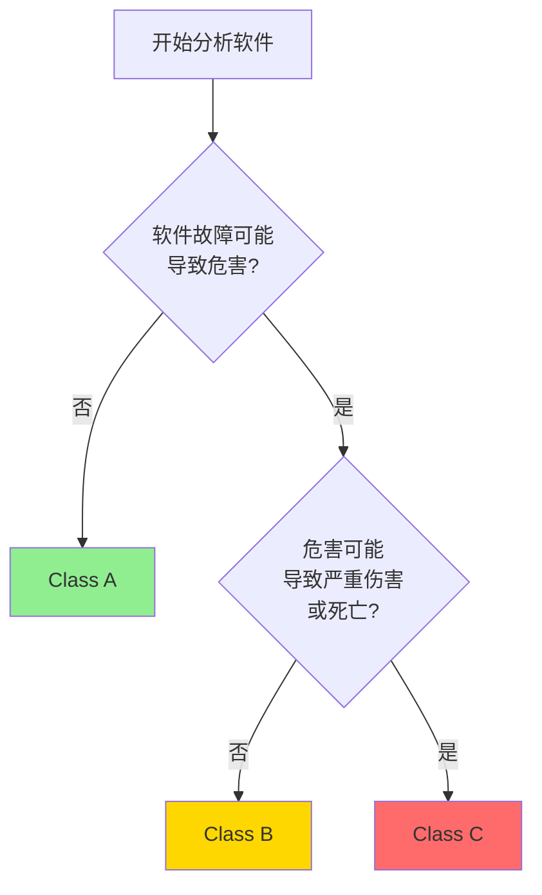

# IEC 62304 - 医疗器械软件生命周期过程

## 学习目标

完成本模块后，你将能够：
- 理解IEC 62304标准的适用范围和核心要求
- 掌握医疗器械软件安全分类方法
- 了解软件开发生命周期的各个过程
- 理解不同安全等级对应的文档要求
- 应用IEC 62304要求到实际项目中

## 前置知识

- 软件开发基础知识
- 医疗器械基本概念
- 质量管理体系基础

## 标准概述

IEC 62304是国际电工委员会（IEC）发布的医疗器械软件生命周期过程标准，全称为"Medical device software - Software life cycle processes"。该标准定义了医疗器械软件的开发、维护和风险管理过程。

### 标准适用范围

IEC 62304适用于：
- 作为医疗器械的软件
- 医疗器械的组成部分的软件
- 用于生产医疗器械的软件（部分要求）

### 标准结构

IEC 62304标准包含以下主要章节：
1. 软件开发过程
2. 软件维护过程
3. 软件风险管理过程
4. 软件配置管理过程
5. 软件问题解决过程

## 软件安全分类

IEC 62304根据软件故障可能造成的危害程度，将医疗器械软件分为三个安全等级：

### Class A（低风险）

**定义**：软件故障不可能导致伤害

**特征**：
- 软件故障不会对患者或操作者造成伤害
- 软件仅用于信息提供或数据记录
- 没有诊断或治疗功能

**示例**：
- 患者信息管理系统
- 医疗设备使用记录软件
- 简单的数据显示软件

### Class B（中风险）

**定义**：软件故障可能导致轻微伤害

**特征**：
- 软件故障可能造成可逆的轻微伤害
- 软件参与诊断或监测，但不直接控制治疗
- 有人工干预机制

**示例**：
- 血压监测软件
- 心电图分析软件
- 医学影像处理软件

### Class C（高风险）

**定义**：软件故障可能导致死亡或严重伤害

**特征**：
- 软件故障可能造成不可逆的严重伤害或死亡
- 软件直接控制治疗或生命支持功能
- 缺乏有效的风险缓解措施

**示例**：
- 输液泵控制软件
- 呼吸机控制软件
- 放射治疗计划软件
- 心脏起搏器软件

### 安全分类方法



## 软件开发生命周期过程

### 1. 软件开发计划

**目的**：定义软件开发的方法、资源和时间表

**关键活动**：
- 定义开发生命周期模型（瀑布、迭代、敏捷等）
- 识别开发团队和职责
- 定义开发标准和工具
- 制定验证和确认计划
- 建立配置管理计划

**输出文档**：
- 软件开发计划（Software Development Plan）
- 软件验证计划（Software Verification Plan）
- 软件确认计划（Software Validation Plan）

### 2. 软件需求分析

**目的**：定义软件应该做什么

**关键活动**：
- 识别系统需求中的软件需求
- 定义功能需求和性能需求
- 定义软件接口需求
- 定义用户界面需求
- 识别安全需求
- 建立需求可追溯性

**输出文档**：
- 软件需求规格说明（Software Requirements Specification, SRS）
- 需求追溯矩阵

**质量标准**：
- 需求应该是明确的、可验证的
- 需求应该与风险分析结果一致
- 需求应该可追溯到系统需求

### 3. 软件架构设计

**目的**：定义软件的高层结构

**关键活动**：
- 将软件需求转换为架构
- 定义软件组件和接口
- 识别SOUP（Software of Unknown Provenance，来源不明软件）
- 定义软件单元的隔离策略
- 评估架构的风险缓解措施

**输出文档**：
- 软件架构设计文档（Software Architecture Design Document）
- SOUP清单

**架构模式示例**：

```
┌─────────────────────────────────────┐
│      应用层 (Application Layer)      │
│  - 用户界面                          │
│  - 业务逻辑                          │
└─────────────────────────────────────┘
           ↓
┌─────────────────────────────────────┐
│      服务层 (Service Layer)          │
│  - 数据处理                          │
│  - 算法实现                          │
└─────────────────────────────────────┘
           ↓
┌─────────────────────────────────────┐
│      硬件抽象层 (HAL)                │
│  - 设备驱动                          │
│  - 硬件接口                          │
└─────────────────────────────────────┘
```

**说明**: 这是符合IEC 62304标准的典型三层软件架构图。应用层处理用户交互和业务逻辑，服务层处理数据和算法实现，硬件抽象层提供设备驱动和硬件接口。这种分层设计促进了模块化、可测试性和可维护性。


### 4. 软件详细设计

**目的**：定义软件单元的实现细节

**关键活动**：
- 细化软件架构到可实现的单元
- 定义算法和数据结构
- 定义单元接口
- 评估详细设计的风险

**输出文档**：
- 软件详细设计文档（Software Detailed Design Document）

### 5. 软件单元实现和验证

**目的**：实现和验证软件单元

**关键活动**：
- 编写源代码
- 遵循编码标准（如MISRA C）
- 执行单元测试
- 执行代码审查
- 执行静态分析

**验证方法**：
- 单元测试
- 代码审查
- 静态分析工具

### 6. 软件集成和集成测试

**目的**：将软件单元集成并验证集成结果

**关键活动**：
- 按照集成策略集成软件单元
- 执行集成测试
- 验证软件接口
- 验证SOUP集成

**测试类型**：
- 接口测试
- 功能测试
- 性能测试
- 压力测试

### 7. 软件系统测试

**目的**：验证软件满足所有需求

**关键活动**：
- 执行系统级测试
- 验证所有软件需求
- 执行回归测试
- 记录测试结果

**测试覆盖**：
- 功能测试：验证所有功能需求
- 性能测试：验证性能需求
- 安全测试：验证安全需求
- 可用性测试：验证用户界面需求

### 8. 软件发布

**目的**：准备软件用于生产和分发

**关键活动**：
- 确保所有验证活动完成
- 准备发布文档
- 归档软件配置
- 获得发布批准

**输出文档**：
- 软件发布记录
- 已知问题清单
- 用户文档

## 不同安全等级的要求差异

| 活动 | Class A | Class B | Class C |
|------|---------|---------|---------|
| 软件开发计划 | 必需 | 必需 | 必需 |
| 软件需求分析 | 必需 | 必需 | 必需 |
| 软件架构设计 | 简化 | 必需 | 必需 |
| 软件详细设计 | 不要求 | 必需 | 必需 |
| 单元测试 | 不要求 | 必需 | 必需 |
| 集成测试 | 必需 | 必需 | 必需 |
| 系统测试 | 必需 | 必需 | 必需 |
| 代码审查 | 不要求 | 推荐 | 必需 |
| 静态分析 | 不要求 | 推荐 | 必需 |

## 最佳实践

!!! tip "开发实践建议"
    1. **尽早进行安全分类**：在项目初期确定软件安全等级，避免后期返工
    2. **建立追溯性**：从需求到测试建立完整的追溯链
    3. **使用自动化工具**：使用静态分析、单元测试框架等工具提高效率
    4. **文档模板化**：建立标准文档模板，确保一致性
    5. **持续集成**：采用CI/CD流程，自动化测试和验证

## 常见陷阱

!!! warning "注意事项"
    1. **安全分类过低**：低估软件风险，导致验证不充分
    2. **文档滞后**：代码先行，文档后补，导致不一致
    3. **忽视SOUP管理**：未充分评估第三方软件的风险
    4. **测试覆盖不足**：特别是Class C软件，需要100%语句覆盖
    5. **变更管理不当**：未经评估的变更可能引入新风险

## 实践练习

1. 为一个血糖监测设备的软件进行安全分类，并说明理由
2. 列出Class B软件开发过程中必需的文档清单
3. 设计一个软件架构，实现硬件抽象层隔离
4. 制定一个软件单元的测试计划

## 自测问题

??? question "问题1：IEC 62304将医疗器械软件分为几个安全等级？各等级的主要区别是什么？"
    
    ??? success "答案"
        IEC 62304将医疗器械软件分为三个安全等级：
        
        - **Class A（低风险）**：软件故障不可能导致伤害
        - **Class B（中风险）**：软件故障可能导致轻微伤害
        - **Class C（高风险）**：软件故障可能导致死亡或严重伤害
        
        主要区别在于对开发过程的严格程度要求不同。Class C要求最严格，需要详细设计、单元测试、代码审查和静态分析；Class A要求最宽松，不需要详细设计和单元测试。

??? question "问题2：什么是SOUP？在IEC 62304中如何管理SOUP？"
    
    ??? success "答案"
        SOUP是"Software of Unknown Provenance"的缩写，指来源不明软件，通常指第三方库、开源软件或商业现成软件（COTS）。
        
        IEC 62304要求：
        1. 识别所有SOUP组件
        2. 评估SOUP的功能和性能要求
        3. 评估SOUP的已知异常
        4. 建立SOUP清单并维护
        5. 验证SOUP满足预期用途
        6. 监控SOUP的更新和安全公告

??? question "问题3：Class C软件的代码覆盖率要求是多少？"
    
    ??? success "答案"
        IEC 62304要求Class C软件达到：
        - **100%语句覆盖率**（Statement Coverage）
        - **100%分支覆盖率**（Branch Coverage）
        
        这意味着所有代码行和所有决策分支都必须在测试中执行到。Class B软件要求较低，通常要求语句覆盖率达到一定比例即可。

??? question "问题4：软件需求规格说明（SRS）应该包含哪些内容？"
    
    ??? success "答案"
        软件需求规格说明应包含：
        1. **功能需求**：软件应该实现的功能
        2. **性能需求**：响应时间、吞吐量等
        3. **接口需求**：与硬件、其他软件的接口
        4. **用户界面需求**：显示、输入、交互方式
        5. **安全需求**：与风险控制相关的需求
        6. **数据定义和数据库需求**
        7. **可靠性和可用性需求**
        8. **可维护性需求**
        
        所有需求应该是可验证的，并可追溯到系统需求和风险分析。

??? question "问题5：IEC 62304与ISO 13485的关系是什么？"
    
    ??? success "答案"
        - **ISO 13485**是医疗器械质量管理体系标准，定义了组织层面的质量管理要求
        - **IEC 62304**是医疗器械软件生命周期过程标准，定义了软件开发的技术要求
        
        关系：
        - IEC 62304是ISO 13485在软件开发方面的具体实施标准
        - ISO 13485要求建立设计和开发过程，IEC 62304提供了软件开发的详细方法
        - 两者配合使用，ISO 13485提供质量管理框架，IEC 62304提供技术实施细节
        - 符合IEC 62304是满足ISO 13485软件开发要求的有效方法

??? question "问题6：软件维护过程包括哪些主要活动？"
    
    ??? success "答案"
        软件维护过程包括：
        1. **问题分析**：分析报告的问题和反馈
        2. **修改实施**：实施纠正、预防或改进措施
        3. **维护测试**：验证修改的正确性
        4. **回归测试**：确保修改未引入新问题
        5. **发布更新**：发布维护版本
        6. **退役**：当软件不再使用时的退役过程
        
        所有维护活动都应遵循与开发相同的质量标准，并进行风险评估。

## 相关资源

- [软件安全分类详解](software-classification.md)
- [ISO 14971 - 风险管理](../iso-14971/index.md)
- [需求工程](../../software-engineering/requirements-engineering/index.md)
- [测试策略](../../software-engineering/testing-strategy/index.md)

## 参考文献

1. IEC 62304:2006+AMD1:2015 - Medical device software - Software life cycle processes
2. FDA Guidance: "Guidance for the Content of Premarket Submissions for Software Contained in Medical Devices"
3. AAMI TIR45:2012 - Guidance on the use of AGILE practices in the development of medical device software
4. ISO/TR 80002-2:2017 - Medical device software - Part 2: Validation of software for medical device quality systems
5. 书籍：《Medical Device Software Verification, Validation and Compliance》by David A. Vogel


## 内容模块

- [IEC 62304 文档要求](documentation-requirements.md)
- [IEC 62304 生命周期过程](lifecycle-processes.md)
