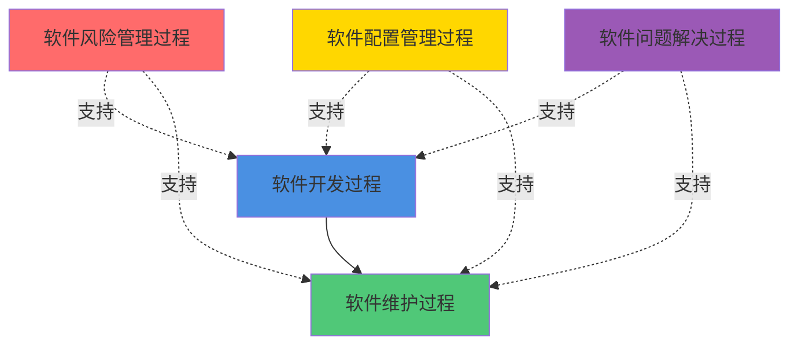
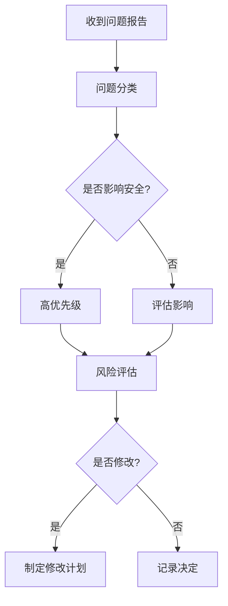
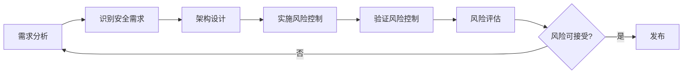

# IEC 62304 生命周期过程

## 学习目标

完成本模块后，你将能够：
- 理解IEC 62304定义的完整生命周期过程
- 掌握软件开发过程的各个阶段和活动
- 了解软件维护过程的要求和最佳实践
- 理解软件风险管理过程与ISO 14971的关系
- 应用生命周期过程到实际医疗器械软件项目

## 前置知识

- IEC 62304标准基础知识
- 软件工程基本概念
- 医疗器械软件安全分类
- 风险管理基础

## 内容

### 生命周期过程概览

IEC 62304定义了五个主要的生命周期过程：

1. **软件开发过程**（Software Development Process）
2. **软件维护过程**（Software Maintenance Process）
3. **软件风险管理过程**（Software Risk Management Process）
4. **软件配置管理过程**（Software Configuration Management Process）
5. **软件问题解决过程**（Software Problem Resolution Process）



## 一、软件开发过程

软件开发过程是IEC 62304的核心，定义了从需求到发布的完整开发流程。

### 5.1 软件开发计划

**目的**：建立软件开发的框架和方法

**关键活动**：

1. **定义生命周期模型**
   - 选择开发模型（瀑布、迭代、敏捷等）
   - 定义各阶段的输入和输出
   - 建立阶段间的评审机制

2. **定义交付物**
   - 识别所有必需的文档
   - 定义文档模板和标准
   - 建立文档审批流程

3. **定义开发标准**
   - 编码标准（如MISRA C、CERT C）
   - 命名规范
   - 注释规范
   - 文档规范

4. **定义开发方法和工具**
   - 开发环境和IDE
   - 版本控制系统
   - 测试工具
   - 静态分析工具
   - 需求管理工具

5. **定义团队和职责**
   - 项目经理
   - 软件架构师
   - 开发工程师
   - 测试工程师
   - 质量保证人员

**输出文档**：
- 软件开发计划（Software Development Plan, SDP）
- 软件验证计划（Software Verification Plan）
- 软件确认计划（Software Validation Plan）

**不同安全等级的要求**：
- Class A/B/C：均需要软件开发计划

### 5.2 软件需求分析

**目的**：定义软件应该实现的功能和性能

**关键活动**：

1. **定义软件需求**
   - 从系统需求中提取软件需求
   - 定义功能需求
   - 定义性能需求（响应时间、吞吐量等）
   - 定义接口需求（硬件接口、软件接口）
   - 定义用户界面需求

2. **定义软件系统输入输出**
   - 识别所有输入源
   - 定义输入数据格式和范围
   - 定义输出数据格式
   - 定义错误处理

3. **识别安全需求**
   - 从风险分析中提取安全需求
   - 定义风险控制措施
   - 定义报警和警告要求

4. **建立需求追溯性**
   - 需求到系统需求的追溯
   - 需求到风险的追溯
   - 需求到测试的追溯

**需求质量标准**：
- ✅ 明确性：需求表述清晰，无歧义
- ✅ 可验证性：可以通过测试验证
- ✅ 完整性：覆盖所有功能和性能要求
- ✅ 一致性：需求之间无冲突
- ✅ 可追溯性：可追溯到上游需求

**输出文档**：
- 软件需求规格说明（Software Requirements Specification, SRS）
- 需求追溯矩阵（Requirements Traceability Matrix）

**不同安全等级的要求**：
- Class A/B/C：均需要软件需求分析

### 5.3 软件架构设计

**目的**：定义软件的高层结构和组件划分

**关键活动**：

1. **将需求转换为架构**
   - 识别主要软件组件
   - 定义组件职责
   - 定义组件间接口

2. **定义软件单元**
   - 划分可独立实现和测试的单元
   - 定义单元接口
   - 建立单元间的依赖关系

3. **识别SOUP**
   - 列出所有第三方软件
   - 评估SOUP的功能和限制
   - 识别SOUP的已知异常
   - 定义SOUP的使用方式

4. **定义隔离策略**
   - 隔离不同安全等级的软件
   - 隔离硬件相关代码
   - 定义错误隔离机制

5. **评估架构风险**
   - 识别架构层面的风险
   - 定义风险缓解措施
   - 验证架构满足安全需求

**架构模式示例**：

```c
// 分层架构示例
// 应用层
typedef struct {
    void (*init)(void);
    void (*process)(void);
    void (*shutdown)(void);
} ApplicationLayer;

// 服务层
typedef struct {
    int (*calculate)(int input);
    int (*validate)(int data);
} ServiceLayer;

// 硬件抽象层
typedef struct {
    void (*read_sensor)(uint8_t* data);
    void (*write_actuator)(uint8_t data);
} HardwareAbstractionLayer;
```

**输出文档**：
- 软件架构设计文档（Software Architecture Design Document）
- SOUP清单（SOUP List）
- 架构风险分析

**不同安全等级的要求**：
- Class A：简化的架构设计
- Class B/C：完整的架构设计

### 5.4 软件详细设计

**目的**：细化架构到可实现的软件单元

**关键活动**：

1. **细化软件单元**
   - 定义算法和数据结构
   - 定义单元内部逻辑
   - 定义单元接口规格

2. **定义数据结构**
   - 定义数据类型
   - 定义数据范围和约束
   - 定义数据验证规则

3. **定义算法**
   - 描述处理逻辑
   - 定义计算公式
   - 定义状态机

4. **评估详细设计风险**
   - 识别实现层面的风险
   - 定义单元级风险控制

**详细设计示例**：

```c
/**
 * @brief 血压测量算法
 * @param raw_data 原始ADC数据
 * @param length 数据长度
 * @param result 输出结果（收缩压、舒张压）
 * @return 0成功，-1失败
 * 
 * 算法步骤：
 * 1. 数据预处理（滤波、去噪）
 * 2. 特征提取（峰值检测）
 * 3. 血压计算
 * 4. 结果验证
 */
int calculate_blood_pressure(
    const uint16_t* raw_data,
    size_t length,
    BloodPressureResult* result
);
```

**输出文档**：
- 软件详细设计文档（Software Detailed Design Document）

**不同安全等级的要求**：
- Class A：不要求详细设计
- Class B/C：需要详细设计

### 5.5 软件单元实现和验证

**目的**：实现软件单元并验证其正确性

**关键活动**：

1. **编写源代码**
   - 遵循编码标准
   - 添加适当注释
   - 实现错误处理

2. **单元测试**
   - 测试所有功能路径
   - 测试边界条件
   - 测试错误处理

3. **代码审查**
   - 检查代码质量
   - 检查是否符合标准
   - 检查安全性

4. **静态分析**
   - 使用静态分析工具
   - 检查潜在缺陷
   - 检查编码规范符合性

**代码示例**：

```c
/**
 * @brief 验证血压测量结果
 * @param systolic 收缩压
 * @param diastolic 舒张压
 * @return true有效，false无效
 */
bool validate_blood_pressure(uint16_t systolic, uint16_t diastolic) {
    // 范围检查
    if (systolic < 70 || systolic > 200) {
        return false;
    }
    if (diastolic < 40 || diastolic > 130) {
        return false;
    }
    
    // 逻辑检查：收缩压应大于舒张压
    if (systolic <= diastolic) {
        return false;
    }
    
    // 合理性检查：脉压差应在合理范围
    uint16_t pulse_pressure = systolic - diastolic;
    if (pulse_pressure < 20 || pulse_pressure > 100) {
        return false;
    }
    
    return true;
}
```

**输出文档**：
- 源代码
- 单元测试报告
- 代码审查记录
- 静态分析报告

**不同安全等级的要求**：
- Class A：不要求单元测试
- Class B：需要单元测试
- Class C：需要单元测试 + 代码审查 + 静态分析

### 5.6 软件集成和集成测试

**目的**：将软件单元集成并验证集成结果

**关键活动**：

1. **集成软件单元**
   - 按照集成策略逐步集成
   - 集成SOUP
   - 解决集成问题

2. **集成测试**
   - 测试组件间接口
   - 测试数据流
   - 测试控制流

3. **验证SOUP集成**
   - 验证SOUP功能
   - 测试SOUP接口
   - 验证SOUP异常处理

**集成策略**：
- 自底向上：从底层组件开始集成
- 自顶向下：从顶层组件开始集成
- 增量集成：逐步添加组件

**输出文档**：
- 集成测试计划
- 集成测试报告

**不同安全等级的要求**：
- Class A/B/C：均需要集成测试

### 5.7 软件系统测试

**目的**：验证软件满足所有需求

**关键活动**：

1. **执行系统测试**
   - 功能测试
   - 性能测试
   - 安全测试
   - 可用性测试

2. **验证需求覆盖**
   - 确保所有需求都被测试
   - 建立测试到需求的追溯

3. **回归测试**
   - 在修改后重新测试
   - 确保未引入新问题

**测试覆盖率要求**：
- Class A：需求覆盖
- Class B：需求覆盖 + 语句覆盖
- Class C：需求覆盖 + 100%语句覆盖 + 100%分支覆盖

**输出文档**：
- 系统测试计划
- 系统测试报告
- 测试追溯矩阵

**不同安全等级的要求**：
- Class A/B/C：均需要系统测试

### 5.8 软件发布

**目的**：准备软件用于生产和分发

**关键活动**：

1. **确保验证完成**
   - 所有测试通过
   - 所有缺陷已解决或评估
   - 所有文档完整

2. **准备发布文档**
   - 发布说明
   - 已知问题清单
   - 用户手册
   - 安装指南

3. **归档配置**
   - 归档源代码
   - 归档构建脚本
   - 归档测试数据
   - 归档文档

4. **获得批准**
   - 质量保证批准
   - 管理层批准

**输出文档**：
- 软件发布记录
- 已知问题清单
- 用户文档

## 二、软件维护过程

软件维护过程定义了软件发布后的修改和更新活动。

### 6.1 建立维护计划

**目的**：定义维护活动的方法和资源

**关键活动**：
- 定义维护团队和职责
- 定义问题报告和跟踪流程
- 定义修改评估和批准流程
- 定义维护发布流程

**输出文档**：
- 软件维护计划

### 6.2 问题和修改分析

**目的**：分析报告的问题和修改请求

**关键活动**：

1. **问题分类**
   - 缺陷（Bug）
   - 改进请求
   - 适应性修改（环境变化）

2. **影响分析**
   - 评估对安全的影响
   - 评估对功能的影响
   - 评估对性能的影响

3. **风险评估**
   - 不修改的风险
   - 修改的风险
   - 决定是否修改

**问题分析流程**：



**说明**: 这是问题解决流程图，展示了从收到问题报告到最终验证的完整流程。包括问题分类、安全性评估、风险评估、修改计划制定和验证等关键步骤，确保问题得到系统化处理。


### 6.3 实施修改

**目的**：实施批准的修改

**关键活动**：
- 使用开发过程实施修改
- 遵循与开发相同的标准
- 进行适当的验证

**注意事项**：
- 修改应遵循原开发过程
- 修改的验证程度取决于影响范围
- 小修改可能只需要回归测试
- 大修改可能需要完整的验证

### 6.4 维护测试

**目的**：验证修改的正确性

**关键活动**：

1. **修改验证**
   - 验证修改解决了问题
   - 验证修改满足需求

2. **回归测试**
   - 测试受影响的功能
   - 确保未引入新问题

3. **测试覆盖**
   - 根据影响范围确定测试范围
   - 可能需要完整的系统测试

### 6.5 维护发布

**目的**：发布维护版本

**关键活动**：
- 更新版本号
- 准备发布说明
- 通知用户
- 归档维护记录

**输出文档**：
- 维护发布记录
- 更新的用户文档

### 6.6 软件退役

**目的**：安全地停止使用软件

**关键活动**：
- 通知用户停止使用
- 提供数据迁移方案
- 归档软件和文档
- 记录退役决定

## 三、软件风险管理过程

软件风险管理过程与ISO 14971紧密集成。

### 7.1 风险管理活动

**关键活动**：

1. **风险分析**
   - 识别软件相关的危害
   - 分析危害的原因
   - 评估风险的严重性和概率

2. **风险评估**
   - 确定风险是否可接受
   - 决定是否需要风险控制

3. **风险控制**
   - 在软件中实施风险控制措施
   - 验证风险控制的有效性

4. **风险监控**
   - 监控已知风险
   - 识别新的风险

**风险管理与开发过程的集成**：



**说明**: 这是风险管理与软件开发的集成流程图。展示了如何在整个开发生命周期中持续进行风险管理，从需求分析到架构设计、风险控制实施、验证和评估，形成闭环管理。


### 7.2 风险控制措施示例

**软件层面的风险控制**：

1. **输入验证**
```c
// 验证输入数据范围
if (input < MIN_VALUE || input > MAX_VALUE) {
    log_error("Input out of range");
    return ERROR_INVALID_INPUT;
}
```

2. **冗余检查**
```c
// 关键计算的冗余验证
result1 = calculate_method1(data);
result2 = calculate_method2(data);
if (abs(result1 - result2) > TOLERANCE) {
    log_error("Calculation mismatch");
    return ERROR_CALCULATION;
}
```

3. **看门狗定时器**
```c
// 防止软件挂起
void main_loop(void) {
    while (1) {
        watchdog_reset();
        process_tasks();
    }
}
```

4. **故障安全状态**
```c
// 检测到错误时进入安全状态
if (critical_error_detected()) {
    enter_safe_state();
    disable_actuators();
    alert_user();
}
```

## 四、软件配置管理过程

### 8.1 配置管理活动

**目的**：管理软件配置项的变更和版本

**关键活动**：

1. **配置识别**
   - 识别配置项（源代码、文档、工具等）
   - 定义版本命名规则
   - 建立配置项清单

2. **变更控制**
   - 建立变更请求流程
   - 评估变更影响
   - 批准或拒绝变更

3. **配置状态记录**
   - 记录配置项的当前状态
   - 记录变更历史
   - 生成配置报告

4. **配置审核**
   - 验证配置完整性
   - 验证配置一致性

**版本控制示例**：

```bash
# Git工作流示例
# 主分支：稳定发布版本
main
  |
  # 开发分支：日常开发
  develop
    |
    # 功能分支：新功能开发
    feature/blood-pressure-algorithm
    |
    # 修复分支：缺陷修复
    bugfix/sensor-calibration
    |
    # 发布分支：准备发布
    release/v2.1.0
```

### 8.2 配置管理工具

**推荐工具**：
- 版本控制：Git, SVN
- 需求管理：DOORS, Jira
- 缺陷跟踪：Jira, Bugzilla
- 文档管理：Confluence, SharePoint

## 五、软件问题解决过程

### 9.1 问题解决活动

**目的**：系统地解决软件问题

**关键活动**：

1. **准备问题报告**
   - 建立问题报告模板
   - 定义问题分类
   - 定义优先级规则

2. **调查问题**
   - 重现问题
   - 分析根本原因
   - 评估影响范围

3. **建议解决方案**
   - 提出修复方案
   - 评估方案的风险
   - 选择最佳方案

4. **实施解决方案**
   - 使用维护过程实施
   - 验证问题已解决

5. **跟踪问题**
   - 记录问题状态
   - 跟踪到关闭
   - 分析问题趋势

**问题报告模板**：

```
问题ID: BUG-2026-001
标题: 血压测量偶尔返回异常值
严重性: 高
优先级: P1
报告人: 张三
报告日期: 2026-02-09

描述:
在连续测量时，偶尔会出现明显异常的血压值（如300/200）

重现步骤:
1. 启动设备
2. 连续测量10次
3. 约有1-2次出现异常值

预期结果: 所有测量值应在合理范围内
实际结果: 偶尔出现异常高值

影响: 可能导致错误的诊断决策
根本原因: [待调查]
解决方案: [待确定]
状态: 打开
```

**说明**: 这是问题报告的示例格式。包含问题ID、标题、严重性、优先级、报告人、报告日期和详细描述等信息，为问题跟踪和解决提供完整的记录。


### 9.2 问题分析和趋势

**分析维度**：
- 问题类型分布
- 问题严重性分布
- 问题来源（开发、测试、用户）
- 问题解决时间
- 重复问题

**持续改进**：
- 识别常见问题模式
- 改进开发和测试流程
- 更新检查清单和标准
- 加强培训

## 最佳实践

!!! tip "生命周期过程实施建议"
    1. **文档模板化**：建立标准文档模板，提高一致性和效率
    2. **工具自动化**：使用工具自动化重复性任务（测试、构建、分析）
    3. **持续集成**：建立CI/CD流程，及早发现问题
    4. **追溯性管理**：使用工具管理需求、设计、测试的追溯关系
    5. **定期审查**：定期审查过程执行情况，持续改进
    6. **培训团队**：确保团队理解并正确执行过程
    7. **适度裁剪**：根据项目规模和风险适度调整过程
    8. **记录决策**：记录重要的技术和管理决策及其理由

## 常见陷阱

!!! warning "注意事项"
    1. **过程僵化**：机械执行过程而不考虑实际情况
    2. **文档滞后**：代码先行，文档后补，导致不一致
    3. **忽视维护**：只关注开发，忽视维护过程的重要性
    4. **风险管理脱节**：风险管理与开发过程分离
    5. **配置管理混乱**：版本控制不规范，难以追溯
    6. **问题跟踪不力**：问题报告后缺乏跟踪和分析
    7. **变更控制不严**：未经评估的变更可能引入新风险
    8. **测试覆盖不足**：特别是Class C软件，必须达到100%覆盖

## 实践练习

1. 为一个血糖监测设备制定软件开发计划，包括生命周期模型选择和关键里程碑
2. 设计一个软件架构，实现硬件抽象层隔离，并识别可能的SOUP
3. 为一个输液泵软件制定维护计划，包括问题分类和优先级规则
4. 分析一个软件缺陷，进行根本原因分析，并提出预防措施

## 自测问题

??? question "问题1：IEC 62304定义的五个主要生命周期过程是什么？"
    
    ??? success "答案"
        IEC 62304定义的五个主要生命周期过程是：
        
        1. **软件开发过程**：从需求到发布的完整开发流程
        2. **软件维护过程**：软件发布后的修改和更新
        3. **软件风险管理过程**：识别、评估和控制软件相关风险
        4. **软件配置管理过程**：管理配置项的变更和版本
        5. **软件问题解决过程**：系统地解决软件问题
        
        这五个过程相互支持，共同确保医疗器械软件的质量和安全。

??? question "问题2：Class C软件的代码覆盖率要求是什么？为什么有这样的要求？"
    
    ??? success "答案"
        Class C软件的代码覆盖率要求：
        - **100%语句覆盖率**（Statement Coverage）
        - **100%分支覆盖率**（Branch Coverage）
        
        原因：
        - Class C软件故障可能导致死亡或严重伤害
        - 高覆盖率确保所有代码路径都经过测试
        - 未测试的代码可能包含致命缺陷
        - 100%覆盖是验证软件安全性的重要手段
        
        注意：100%覆盖率是必要但不充分的条件，还需要测试用例的质量。

??? question "问题3：什么是SOUP？如何管理SOUP？"
    
    ??? success "答案"
        **SOUP定义**：
        SOUP是"Software of Unknown Provenance"的缩写，指来源不明软件，包括：
        - 第三方库
        - 开源软件
        - 商业现成软件（COTS）
        - 操作系统
        
        **SOUP管理要求**：
        1. **识别**：列出所有SOUP组件
        2. **评估**：评估SOUP的功能、性能和限制
        3. **异常识别**：识别SOUP的已知缺陷和限制
        4. **验证**：验证SOUP满足预期用途
        5. **监控**：监控SOUP的更新和安全公告
        6. **文档化**：维护SOUP清单和评估记录
        
        **风险考虑**：
        - SOUP可能包含未知缺陷
        - SOUP更新可能影响医疗器械功能
        - 需要建立SOUP变更评估流程

??? question "问题4：软件维护过程与软件开发过程有什么关系？"
    
    ??? success "答案"
        **关系**：
        - 维护过程使用开发过程来实施修改
        - 维护修改应遵循与开发相同的标准和流程
        - 维护的验证程度取决于修改的影响范围
        
        **关键区别**：
        1. **触发方式**：
           - 开发：按计划进行
           - 维护：响应问题或变更请求
        
        2. **范围**：
           - 开发：完整的软件系统
           - 维护：通常是局部修改
        
        3. **验证**：
           - 开发：完整的验证和确认
           - 维护：可能只需要回归测试
        
        **最佳实践**：
        - 建立维护计划，定义维护流程
        - 对每个修改进行影响分析
        - 根据影响范围确定验证程度
        - 维护完整的变更记录

??? question "问题5：软件配置管理的主要活动有哪些？"
    
    ??? success "答案"
        软件配置管理的四个主要活动：
        
        1. **配置识别**：
           - 识别配置项（源代码、文档、工具等）
           - 定义版本命名规则
           - 建立配置项清单
        
        2. **变更控制**：
           - 建立变更请求流程
           - 评估变更影响
           - 批准或拒绝变更
           - 实施批准的变更
        
        3. **配置状态记录**：
           - 记录配置项的当前状态
           - 记录变更历史
           - 生成配置报告
        
        4. **配置审核**：
           - 验证配置完整性
           - 验证配置一致性
           - 确保发布的软件与文档一致
        
        **工具支持**：
        - 版本控制系统（Git, SVN）
        - 需求管理工具（DOORS, Jira）
        - 构建和发布工具

## 相关资源

- [IEC 62304 标准概述](index.md)
- [IEC 62304 文档要求](documentation-requirements.md)
- [ISO 14971 风险管理](../iso-14971/index.md)
- [软件需求工程](../../software-engineering/requirements-engineering/index.md)
- [软件测试策略](../../software-engineering/testing-strategy/index.md)

## 参考文献

1. IEC 62304:2006+AMD1:2015 - Medical device software - Software life cycle processes
2. ISO 14971:2019 - Medical devices - Application of risk management to medical devices
3. FDA Guidance: "Guidance for the Content of Premarket Submissions for Software Contained in Medical Devices" (2005)
4. AAMI TIR45:2012 - Guidance on the use of AGILE practices in the development of medical device software
5. 书籍：《Medical Device Software Verification, Validation and Compliance》by David A. Vogel
6. ISO/TR 80002-2:2017 - Medical device software - Part 2: Validation of software for medical device quality systems
