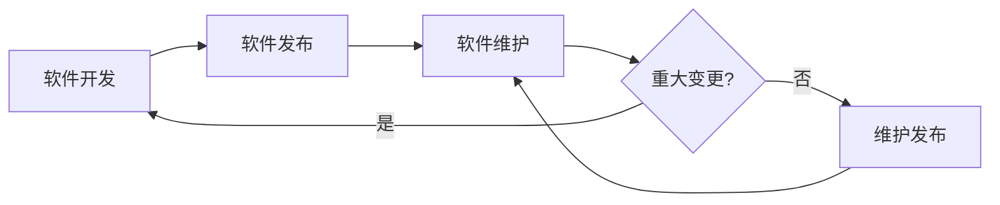
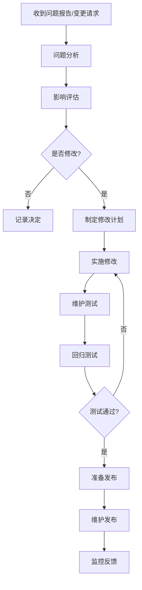
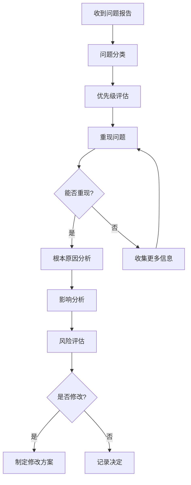
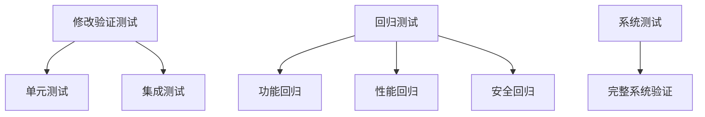
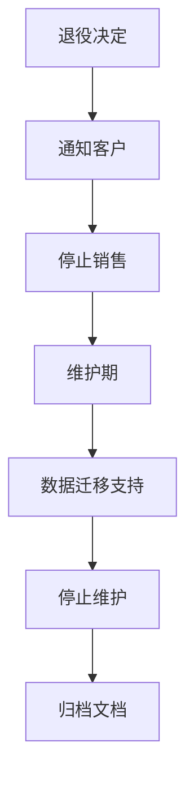

# 软件维护流程详解

## 学习目标

完成本模块后，你将能够：
- 理解软件维护过程的重要性和范围
- 掌握维护计划的制定方法
- 了解问题分析和修改评估流程
- 应用维护测试和验证方法
- 管理维护发布和文档
- 建立软件退役流程

## 前置知识

- IEC 62304标准基础知识
- 软件开发生命周期
- 风险管理基础（ISO 14971）
- 软件配置管理

## 软件维护概述

### 什么是软件维护

**IEC 62304定义**：
软件维护是指软件发布后对软件进行的修改，包括纠正性维护、预防性维护和适应性维护。

**维护类型**：

#### 1. 纠正性维护（Corrective Maintenance）

**目的**：修复软件缺陷

**示例**：
- 修复导致错误计算的缺陷
- 修复导致系统崩溃的缺陷
- 修复用户界面显示错误


#### 2. 预防性维护（Preventive Maintenance）

**目的**：改进软件质量，防止未来问题

**示例**：
- 代码重构以提高可维护性
- 更新SOUP以修复已知漏洞
- 改进错误处理机制

#### 3. 适应性维护（Adaptive Maintenance）

**目的**：适应环境变化

**示例**：
- 适配新的硬件平台
- 支持新的操作系统版本
- 适应新的法规要求

#### 4. 完善性维护（Perfective Maintenance）

**目的**：增强功能或性能

**示例**：
- 添加新功能
- 改进用户界面
- 优化性能

### 维护与开发的关系



**关键区别**：

| 特征 | 开发 | 维护 |
|------|------|------|
| 范围 | 完整系统 | 局部修改 |
| 触发 | 计划驱动 | 问题驱动 |
| 验证 | 完整验证 | 回归测试 |
| 文档 | 完整文档 | 更新文档 |
| 风险 | 系统风险 | 变更风险 |

## 维护过程流程

### 流程概览



## 1. 维护计划

### 维护计划内容

**软件维护计划模板**：

```markdown
# 软件维护计划

## 1. 项目信息
- 项目名称: 血压监测设备软件
- 软件版本: v2.1.0
- 软件安全分类: Class B
- 文档版本: 1.0
- 日期: 2026-02-10

## 2. 维护范围
- 维护的软件产品
- 维护的版本
- 维护期限

## 3. 维护组织
- 维护团队组成
- 角色和职责
- 联系方式

### 3.1 维护团队
| 角色 | 姓名 | 职责 | 联系方式 |
|------|------|------|---------|
| 维护经理 | 张三 | 维护计划和协调 | zhang@example.com |
| 软件工程师 | 李四 | 问题分析和修改实施 | li@example.com |
| 测试工程师 | 王五 | 维护测试和验证 | wang@example.com |
| 质量保证 | 赵六 | 质量审核和批准 | zhao@example.com |

## 4. 问题报告和跟踪
- 问题报告渠道
- 问题分类标准
- 问题优先级定义
- 问题跟踪工具

### 4.1 问题报告渠道
- 客户支持热线: 400-XXX-XXXX
- 电子邮件: support@example.com
- 问题跟踪系统: Jira
- 现场服务报告

### 4.2 问题分类
| 类别 | 定义 | 示例 |
|------|------|------|
| 缺陷 | 软件不符合规格 | 计算错误、崩溃 |
| 改进 | 功能增强请求 | 新功能、性能优化 |
| 适应 | 环境变化适配 | 新硬件、新法规 |

### 4.3 优先级定义
| 优先级 | 定义 | 响应时间 | 解决时间 |
|--------|------|---------|---------|
| P1 - 紧急 | 严重安全问题 | 4小时 | 7天 |
| P2 - 高 | 功能失效 | 1天 | 30天 |
| P3 - 中 | 功能受限 | 3天 | 90天 |
| P4 - 低 | 轻微问题 | 7天 | 下一版本 |

## 5. 修改评估和批准
- 影响分析方法
- 风险评估流程
- 批准权限

### 5.1 影响分析
对每个修改请求进行：
- 功能影响分析
- 性能影响分析
- 安全影响分析
- 接口影响分析
- 文档影响分析

### 5.2 批准流程
| 修改类型 | 批准人 |
|---------|--------|
| 紧急安全修复 | 维护经理 + 质量经理 |
| 功能修改 | 维护经理 + 产品经理 |
| 性能优化 | 维护经理 |
| 文档更新 | 维护经理 |

## 6. 修改实施
- 使用的开发过程
- 开发标准和工具
- 配置管理

### 6.1 开发过程
- 遵循原软件开发计划
- 根据影响范围调整验证程度
- 小修改：单元测试 + 回归测试
- 大修改：完整验证流程

### 6.2 开发标准
- 编码标准: MISRA C 2012
- 文档标准: 公司模板
- 测试标准: IEEE 829

## 7. 维护测试
- 测试策略
- 测试方法
- 测试覆盖要求

### 7.1 测试策略
- 修改验证测试
- 回归测试
- 系统测试（如需要）

### 7.2 回归测试范围
- 受影响的功能
- 相关的接口
- 关键安全功能

## 8. 维护发布
- 发布流程
- 发布文档
- 客户通知

### 8.1 发布流程
1. 完成所有测试
2. 更新文档
3. 准备发布说明
4. 质量审核
5. 批准发布
6. 归档配置
7. 通知客户

## 9. 监控和反馈
- 发布后监控
- 客户反馈收集
- 问题趋势分析

### 9.1 监控机制
- 发布后30天重点监控
- 收集客户反馈
- 跟踪新问题报告
- 分析问题趋势

## 10. 软件退役
- 退役条件
- 退役流程
- 数据迁移

### 10.1 退役条件
- 产品停产
- 技术过时
- 法规不再符合
- 成本效益考虑

## 11. 文档管理
- 维护文档清单
- 文档更新流程
- 文档归档

### 11.1 维护文档
- 维护计划（本文档）
- 问题报告
- 修改请求
- 影响分析报告
- 维护测试报告
- 维护发布记录

## 12. 培训
- 维护团队培训
- 培训内容
- 培训记录

## 13. 度量和改进
- 维护度量指标
- 过程改进

### 13.1 度量指标
- 问题响应时间
- 问题解决时间
- 缺陷密度
- 回归缺陷率
- 客户满意度

## 14. 批准
- 编制人: 张三 日期: 2026-02-10
- 审核人: 李四 日期: 2026-02-10
- 批准人: 王五 日期: 2026-02-10
```

## 2. 问题和修改分析

### 问题报告

**问题报告模板**：

```markdown
# 问题报告

## 基本信息
- **问题ID**: PR-2026-001
- **报告日期**: 2026-02-10
- **报告人**: 客户服务部 - 张三
- **产品**: 血压监测设备
- **软件版本**: v2.1.0
- **硬件版本**: v1.5

## 问题分类
- **类别**: 缺陷
- **优先级**: P2 - 高
- **严重度**: 中等
- **状态**: 打开

## 问题描述
### 症状
在连续测量模式下，偶尔会出现血压值异常高的情况（如收缩压>250 mmHg）。

### 重现步骤
1. 启动设备
2. 选择连续测量模式
3. 进行10次连续测量
4. 约有1-2次出现异常高值

### 预期结果
所有测量值应在合理范围内（收缩压70-200 mmHg）

### 实际结果
偶尔出现明显超出范围的异常值

### 频率
约10%的测量出现异常

## 环境信息
- 使用场景: 家庭使用
- 环境温度: 20-25°C
- 用户操作: 按照说明书操作
- 其他设备: 无干扰

## 影响评估
- **用户影响**: 可能导致错误的健康决策
- **安全影响**: 中等 - 可能延误治疗
- **功能影响**: 核心功能受影响
- **客户数量**: 已收到5个类似报告

## 附件
- 错误日志: error_log_20260210.txt
- 测量数据: measurement_data.csv
- 照片: device_screen.jpg

## 初步分析
可能原因：
1. 传感器数据异常
2. 算法计算错误
3. 数据验证不足

## 处理记录
- 2026-02-10: 问题报告创建
- 2026-02-11: 分配给李四进行分析
- 2026-02-12: 根本原因分析中
```

### 问题分析

**问题分析流程**：



**根本原因分析示例**：

```markdown
# 根本原因分析报告

## 问题信息
- 问题ID: PR-2026-001
- 分析人: 李四
- 分析日期: 2026-02-12

## 问题重现
### 重现环境
- 硬件: 开发板 + 实际传感器
- 软件: v2.1.0
- 测试工具: 示波器、调试器

### 重现结果
✅ 成功重现问题
- 在连续测量模式下，约10%的测量出现异常值
- 异常值通常是正常值的2-3倍

## 根本原因分析

### 分析方法
使用5-Why分析法：

1. **为什么出现异常高值？**
   - 因为算法计算出了错误的血压值

2. **为什么算法计算错误？**
   - 因为输入数据包含异常的峰值

3. **为什么输入数据包含异常峰值？**
   - 因为ADC采样时偶尔出现噪声尖峰

4. **为什么ADC采样出现噪声尖峰？**
   - 因为在气泵启动瞬间产生电磁干扰

5. **为什么电磁干扰没有被过滤？**
   - 因为软件滤波器的截止频率设置过高，无法过滤高频噪声

### 根本原因
软件滤波器的截止频率设置不当，无法有效过滤气泵启动时产生的高频噪声。

## 代码分析

### 问题代码
```c
// 当前滤波器配置
#define FILTER_CUTOFF_FREQ  50  // Hz - 过高

void filter_adc_data(uint16_t* data, size_t length) {
    // 简单的移动平均滤波
    for (size_t i = 1; i < length; i++) {
        data[i] = (data[i] + data[i-1]) / 2;
    }
}
```

### 问题分析
- 移动平均滤波器阶数太低，无法有效抑制尖峰
- 截止频率过高，无法过滤高频噪声
- 缺少异常值检测和剔除机制

## 修改方案

### 方案1: 改进滤波器（推荐）
```c
// 改进的滤波器配置
#define FILTER_CUTOFF_FREQ  20  // Hz - 降低截止频率
#define FILTER_ORDER  5  // 增加滤波器阶数

void filter_adc_data(uint16_t* data, size_t length) {
    // 中值滤波 + 低通滤波
    median_filter(data, length, 5);
    low_pass_filter(data, length, FILTER_CUTOFF_FREQ);
}
```

**优点**：
- 有效抑制尖峰噪声
- 保留有效信号
- 实现简单

**缺点**：
- 略微增加计算量

### 方案2: 添加异常值检测
```c
bool validate_adc_sample(uint16_t sample, uint16_t prev_sample) {
    // 检查变化率
    int16_t delta = abs(sample - prev_sample);
    if (delta > MAX_DELTA) {
        return false;  // 异常值
    }
    return true;
}
```

**优点**：
- 直接剔除异常值
- 计算量小

**缺点**：
- 可能误判快速变化的有效信号

### 推荐方案
采用方案1（改进滤波器）+ 方案2（异常值检测）的组合。

## 影响分析
- **功能影响**: 改进测量准确性
- **性能影响**: 略微增加CPU使用（<5%）
- **接口影响**: 无
- **其他模块影响**: 无
- **文档影响**: 需要更新算法文档

## 风险评估
- **修改风险**: 低 - 局部修改，影响范围小
- **不修改风险**: 高 - 影响测量准确性和用户安全
- **建议**: 实施修改

## 验证计划
1. 单元测试：测试新滤波器函数
2. 集成测试：测试完整测量流程
3. 回归测试：测试其他测量模式
4. 现场测试：在实际环境中验证

## 批准
- 分析人: 李四 日期: 2026-02-12
- 审核人: 张三 日期: 2026-02-12
```

### 影响分析

**影响分析模板**：

```markdown
# 修改影响分析

## 修改信息
- 修改ID: CR-2026-001
- 相关问题: PR-2026-001
- 修改描述: 改进ADC数据滤波算法
- 分析人: 李四
- 分析日期: 2026-02-12

## 功能影响分析

### 直接影响的功能
| 功能 | 影响描述 | 影响程度 |
|------|---------|---------|
| 血压测量 | 改进测量准确性 | 中等 |
| 数据显示 | 无影响 | 无 |
| 数据存储 | 无影响 | 无 |

### 间接影响的功能
| 功能 | 影响描述 | 影响程度 |
|------|---------|---------|
| 趋势分析 | 数据更准确，分析更可靠 | 低 |

## 性能影响分析

| 性能指标 | 当前值 | 预期值 | 影响 |
|---------|--------|--------|------|
| CPU使用率 | 45% | 48% | +3% |
| 内存使用 | 32KB | 33KB | +1KB |
| 测量时间 | 45s | 46s | +1s |
| 功耗 | 150mA | 152mA | +2mA |

**评估**: 性能影响可接受

## 接口影响分析

### 软件接口
- ✅ 无外部接口变更
- ✅ 内部接口保持兼容

### 硬件接口
- ✅ 无硬件接口变更

### 用户接口
- ✅ 无用户界面变更

## 安全影响分析

### 风险影响
| 风险ID | 当前风险等级 | 修改后风险等级 | 变化 |
|--------|------------|--------------|------|
| RISK-003 | 中等 | 低 | ↓ 降低 |

### 新增风险
- 无新增风险

### 风险控制措施
- 充分测试新滤波算法
- 验证各种测量场景
- 监控发布后反馈

## 文档影响分析

### 需要更新的文档
| 文档 | 更新内容 | 工作量 |
|------|---------|--------|
| 软件详细设计 | 更新滤波算法描述 | 2小时 |
| 测试计划 | 添加新测试用例 | 1小时 |
| 用户手册 | 无需更新 | 0小时 |
| 发布说明 | 添加修复说明 | 0.5小时 |

## 验证影响分析

### 需要的验证活动
| 活动 | 描述 | 工作量 |
|------|------|--------|
| 单元测试 | 测试滤波函数 | 4小时 |
| 集成测试 | 测试测量流程 | 8小时 |
| 回归测试 | 测试其他功能 | 16小时 |
| 系统测试 | 完整系统测试 | 8小时 |

**总验证工作量**: 36小时

## 配置影响分析

### 受影响的配置项
- 源文件: `blood_pressure_algorithm.c`
- 头文件: `blood_pressure_algorithm.h`
- 测试文件: `test_bp_algorithm.c`
- 文档: `软件详细设计.docx`

### 版本变更
- 当前版本: v2.1.0
- 目标版本: v2.1.1（维护版本）

## 成本效益分析

### 成本
- 开发工作量: 8小时
- 测试工作量: 36小时
- 文档工作量: 3.5小时
- **总成本**: 47.5小时

### 效益
- 提高测量准确性
- 降低安全风险
- 提升用户满意度
- 减少客户投诉

**结论**: 效益大于成本，建议实施

## 修改决定
- ✅ 批准修改
- 优先级: P2 - 高
- 计划版本: v2.1.1
- 计划时间: 2周

## 批准
- 分析人: 李四 日期: 2026-02-12
- 审核人: 张三 日期: 2026-02-12
- 批准人: 王五 日期: 2026-02-13
```


## 3. 实施修改

### 修改实施原则

**遵循原开发过程**：
- 使用与原开发相同的标准和工具
- 遵循相同的编码规范
- 执行相同的验证活动

**根据影响调整**：
- 小修改：简化验证
- 大修改：完整验证

### 修改实施示例

**修改前代码**：

```c
// 原始滤波函数
void filter_adc_data(uint16_t* data, size_t length) {
    // 简单的移动平均滤波
    for (size_t i = 1; i < length; i++) {
        data[i] = (data[i] + data[i-1]) / 2;
    }
}
```

**修改后代码**：

```c
/**
 * @brief 改进的ADC数据滤波
 * @param data ADC数据数组
 * @param length 数据长度
 * @return 0成功，-1失败
 * 
 * 修改记录:
 * - CR-2026-001: 改进滤波算法以抑制噪声尖峰
 * - 日期: 2026-02-13
 * - 作者: 李四
 */
int filter_adc_data(uint16_t* data, size_t length) {
    // 参数验证
    if (data == NULL || length < MIN_DATA_LENGTH) {
        return -1;
    }
    
    // 步骤1: 中值滤波，去除尖峰
    median_filter(data, length, 5);
    
    // 步骤2: 低通滤波，平滑数据
    low_pass_filter(data, length, 20);  // 20Hz截止频率
    
    // 步骤3: 异常值检测
    for (size_t i = 1; i < length; i++) {
        if (!validate_sample(data[i], data[i-1])) {
            // 用前一个有效值替换异常值
            data[i] = data[i-1];
            log_warning("Anomaly detected at index %zu", i);
        }
    }
    
    return 0;
}

/**
 * @brief 验证采样值
 */
static bool validate_sample(uint16_t current, uint16_t previous) {
    int16_t delta = abs((int16_t)current - (int16_t)previous);
    return (delta <= MAX_SAMPLE_DELTA);
}
```

## 4. 维护测试

### 测试策略

**测试层次**：



### 修改验证测试

**测试目的**：验证修改解决了问题

**测试用例示例**：

```c
/**
 * @brief 测试改进的滤波算法
 */
void test_improved_filter(void) {
    // 测试数据：包含噪声尖峰
    uint16_t test_data[] = {
        100, 102, 105, 300,  // 300是噪声尖峰
        108, 110, 112, 115
    };
    size_t length = sizeof(test_data) / sizeof(test_data[0]);
    
    // 执行滤波
    int result = filter_adc_data(test_data, length);
    
    // 验证结果
    assert(result == 0);
    
    // 验证噪声尖峰被抑制
    for (size_t i = 0; i < length; i++) {
        assert(test_data[i] < 200);  // 所有值应<200
    }
    
    // 验证数据平滑
    for (size_t i = 1; i < length; i++) {
        int16_t delta = abs(test_data[i] - test_data[i-1]);
        assert(delta < 10);  // 相邻值变化应<10
    }
}
```

### 回归测试

**回归测试范围**：

```markdown
# 回归测试计划

## 测试范围

### 1. 直接影响的功能
- ✅ 血压测量（所有模式）
- ✅ 数据验证
- ✅ 错误处理

### 2. 间接影响的功能
- ✅ 数据显示
- ✅ 数据存储
- ✅ 趋势分析

### 3. 关键安全功能
- ✅ 测量范围验证
- ✅ 异常检测
- ✅ 报警功能

## 测试用例

| 测试ID | 测试描述 | 预期结果 | 状态 |
|--------|---------|---------|------|
| RT-001 | 单次测量模式 | 测量正常 | ✅ 通过 |
| RT-002 | 连续测量模式 | 测量正常 | ✅ 通过 |
| RT-003 | 自动测量模式 | 测量正常 | ✅ 通过 |
| RT-004 | 数据显示 | 显示正确 | ✅ 通过 |
| RT-005 | 数据存储 | 存储正确 | ✅ 通过 |
| RT-006 | 异常值检测 | 检测正常 | ✅ 通过 |
| RT-007 | 报警功能 | 报警正常 | ✅ 通过 |

## 测试结果
- 总用例数: 7
- 通过: 7
- 失败: 0
- 阻塞: 0
- **通过率**: 100%
```

## 5. 维护发布

### 发布准备

**发布检查清单**：

```markdown
# 维护发布检查清单

## 版本信息
- 版本号: v2.1.1
- 发布日期: 2026-02-20
- 发布类型: 维护版本

## 修改内容
- [x] CR-2026-001: 改进ADC数据滤波算法

## 验证完成
- [x] 单元测试通过
- [x] 集成测试通过
- [x] 回归测试通过
- [x] 系统测试通过
- [x] 代码审查完成
- [x] 静态分析通过

## 文档更新
- [x] 软件详细设计已更新
- [x] 测试报告已完成
- [x] 发布说明已准备
- [x] 用户手册已审查（无需更新）

## 配置管理
- [x] 源代码已提交
- [x] 版本标签已创建
- [x] 构建已完成
- [x] 配置已归档

## 质量审核
- [x] 质量保证审核通过
- [x] 风险评估完成
- [x] 追溯性验证完成

## 批准
- [x] 维护经理批准
- [x] 质量经理批准
- [x] 产品经理批准

## 发布准备
- [x] 发布包已准备
- [x] 安装指南已准备
- [x] 客户通知已准备
```

### 发布说明

**发布说明模板**：

```markdown
# 软件发布说明

## 版本信息
- **产品名称**: 血压监测设备软件
- **版本号**: v2.1.1
- **发布日期**: 2026-02-20
- **发布类型**: 维护版本
- **前一版本**: v2.1.0

## 修改内容

### 缺陷修复
1. **修复血压测量偶尔出现异常高值的问题**
   - 问题ID: PR-2026-001
   - 修改ID: CR-2026-001
   - 描述: 改进ADC数据滤波算法，有效抑制噪声尖峰
   - 影响: 提高测量准确性和可靠性
   - 优先级: P2 - 高

## 已知问题
- 无新增已知问题

## 兼容性
- ✅ 与v2.1.0完全兼容
- ✅ 无需修改配置
- ✅ 数据格式兼容

## 升级说明
1. 备份当前软件版本
2. 使用升级工具安装v2.1.1
3. 验证升级成功
4. 测试基本功能

## 升级时间
- 预计升级时间: 5分钟
- 设备停机时间: 5分钟

## 回退方案
如果升级后出现问题，可以回退到v2.1.0：
1. 使用升级工具
2. 选择"回退到前一版本"
3. 等待回退完成

## 技术支持
- 技术支持热线: 400-XXX-XXXX
- 电子邮件: support@example.com
- 在线支持: www.example.com/support

## 附件
- 升级包: BP-Monitor-v2.1.1.bin
- 升级工具: Upgrade-Tool-v1.2.exe
- 安装指南: Installation-Guide-v2.1.1.pdf
```

### 客户通知

**客户通知模板**：

```markdown
# 软件更新通知

尊敬的客户：

我们很高兴地通知您，血压监测设备软件v2.1.1现已发布。

## 更新内容
本次更新修复了一个可能导致血压测量偶尔出现异常高值的问题，提高了测量的准确性和可靠性。

## 更新建议
我们强烈建议所有使用v2.1.0的客户升级到v2.1.1。

## 如何更新
1. 访问我们的网站下载升级包
2. 按照安装指南进行升级
3. 升级过程约需5分钟

## 技术支持
如果您在升级过程中遇到任何问题，请联系我们的技术支持团队：
- 热线: 400-XXX-XXXX
- 邮箱: support@example.com

感谢您选择我们的产品！

[公司名称]
2026年2月20日
```

## 6. 软件退役

### 退役流程



### 退役计划

**退役计划模板**：

```markdown
# 软件退役计划

## 退役信息
- 产品名称: 血压监测设备软件
- 退役版本: v1.x系列
- 退役日期: 2027-12-31
- 替代版本: v2.x系列

## 退役原因
- 技术过时
- 不符合新法规要求
- 维护成本过高

## 退役时间表

### 2026-06-30: 停止销售
- 停止销售包含v1.x软件的设备
- 推荐客户购买v2.x版本

### 2026-12-31: 停止新功能开发
- 只提供安全和关键缺陷修复
- 不再添加新功能

### 2027-06-30: 维护期结束通知
- 通知客户维护期即将结束
- 提供升级方案

### 2027-12-31: 停止维护
- 停止提供技术支持
- 停止发布更新

## 客户支持

### 升级方案
- 提供v1.x到v2.x的升级路径
- 升级折扣: 30%
- 升级支持: 免费技术支持

### 数据迁移
- 提供数据迁移工具
- 迁移指南
- 技术支持

## 文档归档
- 归档所有v1.x文档
- 保留期限: 10年
- 归档位置: 公司文档库

## 批准
- 编制人: 张三 日期: 2026-02-10
- 批准人: 王五 日期: 2026-02-10
```

## 维护度量和改进

### 度量指标

**维护度量仪表板**：

```markdown
# 维护度量报告 - 2026年Q1

## 问题统计

### 问题数量
- 总问题数: 45
- 缺陷: 30 (67%)
- 改进请求: 10 (22%)
- 适应性修改: 5 (11%)

### 问题优先级分布
- P1 (紧急): 2 (4%)
- P2 (高): 8 (18%)
- P3 (中): 20 (44%)
- P4 (低): 15 (33%)

### 问题来源
- 客户报告: 25 (56%)
- 内部测试: 15 (33%)
- 现场服务: 5 (11%)

## 响应和解决时间

### 平均响应时间
- P1: 2.5小时 (目标: 4小时) ✅
- P2: 0.8天 (目标: 1天) ✅
- P3: 2.5天 (目标: 3天) ✅
- P4: 5天 (目标: 7天) ✅

### 平均解决时间
- P1: 5天 (目标: 7天) ✅
- P2: 25天 (目标: 30天) ✅
- P3: 70天 (目标: 90天) ✅
- P4: 待下一版本

## 质量指标

### 缺陷密度
- 当前: 0.8缺陷/KLOC
- 目标: <1.0缺陷/KLOC
- 状态: ✅ 达标

### 回归缺陷率
- 当前: 5%
- 目标: <10%
- 状态: ✅ 达标

### 修复有效率
- 当前: 95%
- 目标: >90%
- 状态: ✅ 达标

## 客户满意度
- 满意度评分: 4.2/5.0
- 目标: >4.0
- 状态: ✅ 达标

## 趋势分析

### 问题趋势
- 问题数量呈下降趋势 ✅
- 严重问题比例降低 ✅
- 客户投诉减少 ✅

### 改进建议
1. 加强预防性维护
2. 改进测试覆盖
3. 增强用户培训
```

## 最佳实践

!!! tip "维护过程最佳实践"
    1. **建立完善的维护计划**：明确维护流程、职责和标准
    2. **快速响应问题**：建立问题快速响应机制
    3. **充分分析问题**：进行根本原因分析，避免重复问题
    4. **评估修改影响**：对每个修改进行全面影响分析
    5. **充分测试**：执行修改验证和回归测试
    6. **及时通知客户**：主动通知客户重要更新
    7. **监控发布后反馈**：跟踪发布后的问题和反馈
    8. **持续改进**：分析维护度量，持续改进过程

## 常见陷阱

!!! warning "注意事项"
    1. **问题分析不充分**：未找到根本原因，导致问题重复
    2. **影响评估不足**：未充分评估修改影响，引入新问题
    3. **测试不充分**：回归测试范围不足，遗漏问题
    4. **文档不更新**：修改后未更新文档，导致不一致
    5. **变更控制不严**：未经评估的修改可能引入风险
    6. **客户沟通不足**：未及时通知客户重要更新
    7. **监控不到位**：发布后未跟踪反馈，问题未及时发现
    8. **度量不足**：缺少维护度量，无法持续改进

## 实践练习

1. 为一个医疗器械软件制定完整的维护计划
2. 分析一个软件缺陷，进行根本原因分析和影响评估
3. 设计一个回归测试计划，确定测试范围和用例
4. 编写一份软件发布说明，包含修改内容和升级指南
5. 制定一个软件退役计划，包含时间表和客户支持方案

## 相关资源

- [IEC 62304 标准概述](index.md)
- [IEC 62304 生命周期过程](lifecycle-processes.md)
- [问题解决流程](problem-resolution.md)
- [软件配置管理](../../software-engineering/configuration-management/index.md)
- [软件测试策略](../../software-engineering/testing-strategy/index.md)

## 参考文献

1. IEC 62304:2006+AMD1:2015 - Medical device software - Software life cycle processes
2. ISO/IEC 14764:2006 - Software Engineering - Software Life Cycle Processes - Maintenance
3. IEEE 1219-1998 - IEEE Standard for Software Maintenance
4. FDA Guidance: "Cybersecurity for Networked Medical Devices Containing Off-the-Shelf (OTS) Software"
5. AAMI TIR45:2012 - Guidance on the use of AGILE practices in the development of medical device software
