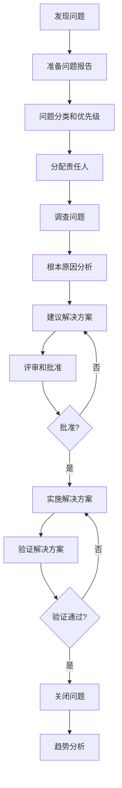
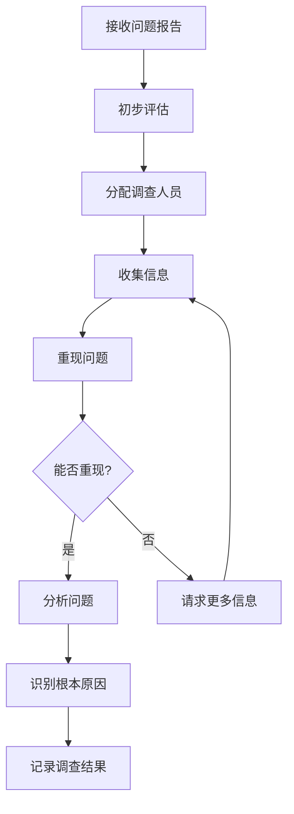
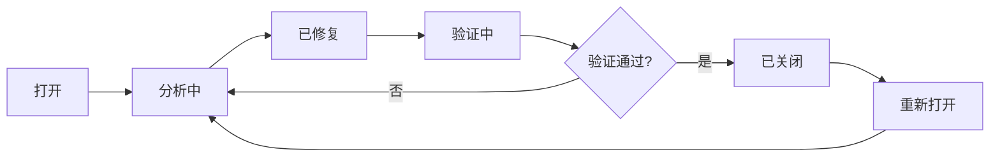

# 问题解决流程详解

## 学习目标

完成本模块后，你将能够：
- 理解问题解决过程的重要性
- 掌握问题报告和分类方法
- 了解问题调查和根本原因分析
- 应用问题解决和验证方法
- 建立问题跟踪和趋势分析机制
- 实施持续改进

## 前置知识

- IEC 62304标准基础知识
- 软件维护过程
- 质量管理基础
- 根本原因分析方法

## 问题解决过程概述

### IEC 62304要求

IEC 62304第9章要求建立软件问题解决过程，包括：
- 准备问题报告
- 调查问题
- 建议解决方案
- 实施解决方案
- 跟踪问题到关闭
- 分析问题趋势

### 问题解决流程



## 1. 问题报告

### 问题来源

**内部来源**：
- 开发过程中发现的缺陷
- 测试发现的问题
- 代码审查发现的问题
- 静态分析工具报告

**外部来源**：
- 客户报告
- 现场服务报告
- 监管机构反馈
- 上市后监督

### 问题报告模板

```markdown
# 问题报告

## 基本信息
- **问题ID**: PR-2026-XXX
- **报告日期**: YYYY-MM-DD
- **报告人**: [姓名/部门]
- **问题来源**: [内部/客户/现场/监管]
- **产品**: [产品名称]
- **软件版本**: vX.Y.Z
- **硬件版本**: vX.Y

## 问题分类
- **类别**: [缺陷/改进/适应/其他]
- **子类别**: [功能/性能/安全/可用性/文档]
- **优先级**: [P1/P2/P3/P4]
- **严重度**: [严重/高/中/低]
- **状态**: [打开/分析中/已修复/已验证/已关闭]

## 问题描述
### 症状
[清晰描述观察到的问题]

### 重现步骤
1. [步骤1]
2. [步骤2]
3. [步骤3]

### 预期结果
[应该发生什么]

### 实际结果
[实际发生了什么]

### 频率
[总是/经常/偶尔/罕见]

## 环境信息
- 使用场景: [描述]
- 环境条件: [温度、湿度等]
- 用户操作: [描述]
- 其他设备: [相关设备]

## 影响评估
- **用户影响**: [描述对用户的影响]
- **安全影响**: [是否影响安全]
- **功能影响**: [影响哪些功能]
- **影响范围**: [影响多少用户/设备]

## 附件
- 日志文件
- 截图/照片
- 测试数据
- 其他相关文件

## 处理记录
- [日期]: [处理动作]
```

### 问题分类标准

#### 按类别分类

| 类别 | 定义 | 示例 |
|------|------|------|
| 缺陷 | 软件不符合规格或预期行为 | 计算错误、崩溃、显示错误 |
| 改进 | 功能增强或优化请求 | 新功能、性能优化、界面改进 |
| 适应 | 环境变化导致的修改需求 | 新硬件支持、新法规符合 |
| 其他 | 文档问题、配置问题等 | 文档错误、配置不当 |

#### 按优先级分类

| 优先级 | 定义 | 响应时间 | 解决时间 |
|--------|------|---------|---------|
| P1 - 紧急 | 严重安全问题，系统无法使用 | 4小时 | 7天 |
| P2 - 高 | 核心功能失效，有变通方法 | 1天 | 30天 |
| P3 - 中 | 功能受限，影响有限 | 3天 | 90天 |
| P4 - 低 | 轻微问题，不影响使用 | 7天 | 下一版本 |

#### 按严重度分类

| 严重度 | 定义 | 示例 |
|--------|------|------|
| 严重 | 可能导致死亡或严重伤害 | 剂量计算错误、安全机制失效 |
| 高 | 可能导致轻微伤害或功能失效 | 测量不准确、报警失效 |
| 中 | 功能受限但有变通方法 | 显示错误、性能下降 |
| 低 | 轻微问题，不影响使用 | 界面美观问题、文档错误 |

## 2. 问题调查

### 调查流程



### 问题重现

**重现环境搭建**：

```markdown
# 问题重现环境

## 硬件配置
- 处理器: STM32F407VGT6
- 内存: 192KB RAM
- 存储: 1MB Flash
- 传感器: MPX5700AP压力传感器
- 显示: 2.4" TFT LCD

## 软件配置
- 软件版本: v2.1.0
- 编译器: GCC ARM 10.3
- RTOS: FreeRTOS v10.4.6
- 配置文件: config_default.ini

## 测试条件
- 环境温度: 25°C
- 电源电压: 5.0V
- 测试模式: 连续测量模式
```

**重现步骤记录**：

```markdown
# 问题重现记录

## 问题ID: PR-2026-001

## 重现尝试1
- 日期: 2026-02-11
- 测试人: 李四
- 环境: 开发板 + 实际传感器
- 步骤:
  1. 启动设备
  2. 选择连续测量模式
  3. 进行20次测量
- 结果: ✅ 成功重现，第3次和第15次出现异常高值
- 观察: 异常值约为正常值的2-3倍

## 重现尝试2
- 日期: 2026-02-11
- 测试人: 李四
- 环境: 模拟器
- 步骤: 同上
- 结果: ❌ 未能重现
- 观察: 模拟器环境无法重现，可能与硬件相关

## 结论
- 问题可在实际硬件上稳定重现
- 问题与硬件环境相关
- 重现概率约10%
```

### 根本原因分析

#### 5-Why分析法

```markdown
# 5-Why分析

## 问题: 血压测量偶尔出现异常高值

### Why 1: 为什么出现异常高值？
**答**: 因为算法计算出了错误的血压值

### Why 2: 为什么算法计算错误？
**答**: 因为输入数据包含异常的峰值

### Why 3: 为什么输入数据包含异常峰值？
**答**: 因为ADC采样时偶尔出现噪声尖峰

### Why 4: 为什么ADC采样出现噪声尖峰？
**答**: 因为在气泵启动瞬间产生电磁干扰

### Why 5: 为什么电磁干扰没有被过滤？
**答**: 因为软件滤波器的截止频率设置过高，无法过滤高频噪声

## 根本原因
软件滤波器的截止频率设置不当，无法有效过滤气泵启动时产生的高频噪声。

## 验证
通过示波器观察，确认气泵启动时产生高频噪声（>100Hz），而当前滤波器截止频率为50Hz，无法有效抑制。
```

#### 鱼骨图分析法

```
                    血压测量异常高值
                          |
        ┌─────────────────┼─────────────────┐
        |                 |                 |
      人员              方法              机器
        |                 |                 |
    操作正确          算法设计          传感器正常
                          |
        ┌─────────────────┼─────────────────┐
        |                 |                 |
      材料              环境              测量
        |                 |                 |
    软件版本          电磁干扰  ←──  滤波器设置不当
    v2.1.0           (气泵启动)        (根本原因)
```

### 调查报告

```markdown
# 问题调查报告

## 问题信息
- 问题ID: PR-2026-001
- 调查人: 李四
- 调查日期: 2026-02-11 至 2026-02-12

## 问题重现
✅ 成功重现
- 重现环境: 实际硬件
- 重现概率: 约10%
- 重现条件: 连续测量模式

## 根本原因
软件滤波器的截止频率设置不当（50Hz），无法有效过滤气泵启动时产生的高频噪声（>100Hz）。

## 分析过程
1. 使用5-Why分析法识别根本原因
2. 使用示波器验证噪声频率
3. 分析滤波器设计参数
4. 确认滤波器设置不当

## 影响分析
- 影响功能: 血压测量
- 影响范围: 所有v2.1.0设备
- 安全影响: 中等 - 可能导致错误诊断
- 用户影响: 约10%的测量受影响

## 解决方案建议
1. 降低滤波器截止频率到20Hz
2. 增加滤波器阶数
3. 添加异常值检测机制

## 附件
- 示波器截图
- 代码分析
- 测试数据
```

## 3. 解决方案

### 解决方案评估

**评估标准**：

| 标准 | 权重 | 说明 |
|------|------|------|
| 有效性 | 40% | 能否解决问题 |
| 风险 | 30% | 引入新问题的风险 |
| 成本 | 15% | 实施成本 |
| 时间 | 15% | 实施时间 |

**方案对比**：

```markdown
# 解决方案对比

## 方案1: 改进滤波器
**描述**: 降低截止频率，增加滤波器阶数

**优点**:
- ✅ 有效抑制噪声
- ✅ 保留有效信号
- ✅ 实施简单

**缺点**:
- ⚠️ 略微增加计算量（<5%）

**评分**:
- 有效性: 9/10
- 风险: 8/10
- 成本: 9/10
- 时间: 9/10
- **总分**: 8.75

## 方案2: 硬件滤波
**描述**: 添加硬件低通滤波电路

**优点**:
- ✅ 彻底解决噪声问题
- ✅ 不增加软件复杂度

**缺点**:
- ❌ 需要硬件变更
- ❌ 成本高
- ❌ 时间长

**评分**:
- 有效性: 10/10
- 风险: 9/10
- 成本: 3/10
- 时间: 2/10
- **总分**: 6.85

## 方案3: 异常值检测
**描述**: 添加异常值检测和剔除

**优点**:
- ✅ 实施简单
- ✅ 计算量小

**缺点**:
- ⚠️ 可能误判快速变化
- ⚠️ 治标不治本

**评分**:
- 有效性: 6/10
- 风险: 7/10
- 成本: 10/10
- 时间: 10/10
- **总分**: 7.25

## 推荐方案
**方案1（改进滤波器）+ 方案3（异常值检测）的组合**
- 综合有效性最高
- 风险可控
- 成本合理
- 时间可接受
```

### 解决方案实施

**实施计划**：

```markdown
# 解决方案实施计划

## 问题ID: PR-2026-001
## 修改ID: CR-2026-001

## 实施内容
1. 改进ADC数据滤波算法
2. 添加异常值检测机制

## 实施步骤

### 步骤1: 设计修改 (2天)
- 设计新滤波算法
- 设计异常值检测逻辑
- 更新详细设计文档

### 步骤2: 实施修改 (2天)
- 修改源代码
- 添加单元测试
- 代码审查

### 步骤3: 验证修改 (3天)
- 单元测试
- 集成测试
- 功能测试

### 步骤4: 回归测试 (5天)
- 执行回归测试套件
- 验证其他功能正常

### 步骤5: 文档更新 (1天)
- 更新设计文档
- 更新测试文档
- 准备发布说明

### 步骤6: 发布准备 (1天)
- 质量审核
- 批准发布
- 准备发布包

## 总工期: 14天

## 资源需求
- 软件工程师: 1人
- 测试工程师: 1人
- 质量工程师: 0.5人

## 风险和缓解
- 风险: 修改可能影响性能
- 缓解: 充分的性能测试
```

## 4. 问题跟踪

### 问题状态管理

**问题状态流转**：



**状态定义**：

| 状态 | 定义 | 责任人 |
|------|------|--------|
| 打开 | 问题已报告，等待分配 | 问题管理员 |
| 分析中 | 正在调查和分析 | 调查人员 |
| 已修复 | 解决方案已实施 | 开发人员 |
| 验证中 | 正在验证解决方案 | 测试人员 |
| 已关闭 | 问题已解决并验证 | 问题管理员 |
| 重新打开 | 问题未解决或重现 | 问题管理员 |

### 问题跟踪工具

**推荐工具**：
- Jira
- Bugzilla
- GitHub Issues
- Azure DevOps

**跟踪信息**：
- 问题ID和标题
- 状态和优先级
- 责任人和截止日期
- 相关修改和测试
- 评论和附件

## 5. 趋势分析

### 分析维度

**问题趋势分析**：

```markdown
# 问题趋势分析报告 - 2026年Q1

## 问题数量趋势
| 月份 | 新增 | 关闭 | 未解决 | 趋势 |
|------|------|------|--------|------|
| 1月 | 18 | 15 | 25 | ↑ |
| 2月 | 15 | 18 | 22 | ↓ |
| 3月 | 12 | 16 | 18 | ↓ |

**分析**: 问题数量呈下降趋势 ✅

## 问题类别分布
| 类别 | 数量 | 占比 | 变化 |
|------|------|------|------|
| 缺陷 | 30 | 67% | ↓ 5% |
| 改进 | 10 | 22% | ↑ 3% |
| 适应 | 5 | 11% | ↑ 2% |

**分析**: 缺陷比例下降，质量改善 ✅

## 问题来源分析
| 来源 | 数量 | 占比 | 变化 |
|------|------|------|------|
| 客户 | 25 | 56% | ↓ 8% |
| 内部测试 | 15 | 33% | ↑ 5% |
| 现场服务 | 5 | 11% | ↑ 3% |

**分析**: 客户报告减少，内部测试增强 ✅

## 高频问题
1. 测量准确性问题 (8次)
2. 用户界面问题 (5次)
3. 数据存储问题 (4次)

**改进建议**:
- 加强测量算法验证
- 改进用户界面设计
- 增强数据存储可靠性

## 根本原因分析
| 根本原因 | 问题数 | 占比 |
|---------|--------|------|
| 设计缺陷 | 12 | 40% |
| 编码错误 | 10 | 33% |
| 需求不明确 | 5 | 17% |
| 测试不足 | 3 | 10% |

**改进建议**:
- 加强设计审查
- 提高编码质量
- 改进需求分析
- 增强测试覆盖

## 解决效率
- 平均解决时间: 25天
- 目标: 30天
- 状态: ✅ 达标

- 首次修复成功率: 92%
- 目标: >90%
- 状态: ✅ 达标
```

### 持续改进

**改进措施**：

```markdown
# 持续改进计划

## 基于趋势分析的改进措施

### 改进1: 加强设计审查
- 问题: 40%的问题源于设计缺陷
- 措施:
  - 增加设计审查频率
  - 使用设计审查检查清单
  - 邀请更多人员参与审查
- 预期效果: 减少设计缺陷20%
- 责任人: 架构师
- 完成日期: 2026-04-30

### 改进2: 提高编码质量
- 问题: 33%的问题源于编码错误
- 措施:
  - 强化编码规范培训
  - 增加代码审查覆盖
  - 使用更多静态分析工具
- 预期效果: 减少编码错误15%
- 责任人: 开发经理
- 完成日期: 2026-05-31

### 改进3: 改进需求分析
- 问题: 17%的问题源于需求不明确
- 措施:
  - 改进需求评审流程
  - 增加需求澄清会议
  - 使用需求原型验证
- 预期效果: 减少需求问题10%
- 责任人: 产品经理
- 完成日期: 2026-06-30

### 改进4: 增强测试覆盖
- 问题: 10%的问题源于测试不足
- 措施:
  - 增加测试用例
  - 提高代码覆盖率目标
  - 增加探索性测试
- 预期效果: 减少测试遗漏5%
- 责任人: 测试经理
- 完成日期: 2026-07-31
```

## 最佳实践

!!! tip "问题解决最佳实践"
    1. **及时报告问题**：建立便捷的问题报告渠道
    2. **准确分类问题**：使用标准分类和优先级
    3. **充分调查问题**：进行根本原因分析
    4. **评估解决方案**：对比多个方案，选择最优
    5. **跟踪问题状态**：使用工具跟踪问题到关闭
    6. **分析问题趋势**：定期分析，识别系统性问题
    7. **持续改进**：基于趋势分析实施改进措施
    8. **知识共享**：记录和分享问题解决经验

## 常见陷阱

!!! warning "注意事项"
    1. **问题报告不完整**：缺少关键信息，难以调查
    2. **未找到根本原因**：只解决表面问题，导致重复
    3. **解决方案评估不足**：选择次优方案
    4. **问题跟踪不力**：问题长期未解决
    5. **缺少趋势分析**：未识别系统性问题
    6. **改进措施不落实**：分析后未采取行动
    7. **知识未共享**：重复犯同样错误
    8. **过程流于形式**：机械执行，不注重实效

## 实践练习

1. 编写一份完整的问题报告，包含所有必需信息
2. 对一个软件缺陷进行5-Why根本原因分析
3. 评估多个解决方案，选择最优方案
4. 设计一个问题跟踪流程，包括状态流转和责任人
5. 分析一组问题数据，识别趋势和系统性问题

## 相关资源

- [IEC 62304 标准概述](index.md)
- [IEC 62304 生命周期过程](lifecycle-processes.md)
- [软件维护流程](maintenance-process.md)
- [软件配置管理](../../software-engineering/configuration-management/index.md)

## 参考文献

1. IEC 62304:2006+AMD1:2015 - Medical device software - Software life cycle processes
2. ISO 9001:2015 - Quality management systems - Requirements
3. IEEE 1044-2009 - IEEE Standard Classification for Software Anomalies
4. 书籍：《Root Cause Analysis: Simplified Tools and Techniques》by Bjørn Andersen and Tom Fagerhaug
5. 书籍：《The Problem Solving Memory Jogger》by GOAL/QPC
