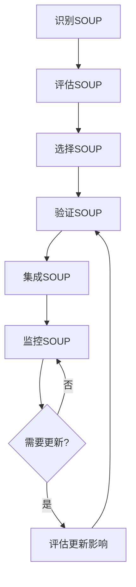
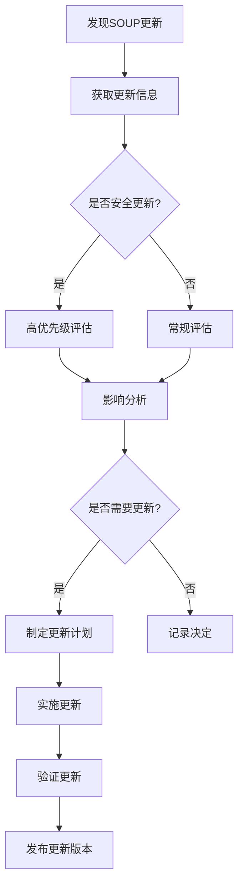

# SOUP管理详解

## 学习目标

完成本模块后，你将能够：
- 理解SOUP的定义和范围
- 掌握SOUP的识别和分类方法
- 了解SOUP的风险评估和管理
- 应用SOUP验证和确认方法
- 建立SOUP监控和更新机制
- 管理SOUP的整个生命周期

## 前置知识

- IEC 62304标准基础知识
- 软件架构设计
- 风险管理基础（ISO 14971）
- 软件配置管理

## 什么是SOUP

### SOUP定义

**SOUP**是"Software of Unknown Provenance"的缩写，字面意思是"来源不明的软件"。

**IEC 62304定义**：
> SOUP是指已经开发完成并可供使用的软件产品，但该软件不是为了集成到正在开发的医疗器械中而专门开发的。


**通俗理解**：
- 不是你自己开发的软件
- 你无法访问其源代码或设计文档
- 你无法控制其开发过程

### SOUP的类型

#### 1. 开源软件（Open Source Software）

**特征**：
- 源代码公开可获取
- 遵循开源许可证
- 社区驱动开发

**示例**：
- FreeRTOS（实时操作系统）
- OpenSSL（加密库）
- SQLite（数据库）
- zlib（压缩库）

#### 2. 商业现成软件（COTS - Commercial Off-The-Shelf）

**特征**：
- 商业许可
- 通常不提供源代码
- 供应商支持

**示例**：
- ThreadX（实时操作系统）
- 商业数据库系统
- 商业图形库
- 商业通信协议栈

#### 3. 操作系统和中间件

**特征**：
- 提供基础运行环境
- 通常是大型复杂系统
- 可能是开源或商业

**示例**：
- Linux内核
- Windows Embedded
- RTOS（VxWorks, QNX）
- 通信协议栈（TCP/IP, Bluetooth）

#### 4. 开发工具和库

**特征**：
- 用于开发过程
- 可能影响最终产品

**示例**：
- 编译器和链接器
- 标准C库
- 数学库
- 图形库

### SOUP与自研软件的区别

| 特征 | 自研软件 | SOUP |
|------|---------|------|
| 源代码访问 | ✅ 完全访问 | ❌ 通常无法访问 |
| 设计文档 | ✅ 完整文档 | ❌ 可能不完整 |
| 开发过程控制 | ✅ 完全控制 | ❌ 无法控制 |
| 修改能力 | ✅ 可以修改 | ❌ 通常不能修改 |
| 验证方法 | 白盒测试 | 黑盒测试 |
| 风险 | 已知风险 | 未知风险 |

## SOUP管理流程

### 流程概览



### 1. SOUP识别

**识别时机**：
- 架构设计阶段
- 详细设计阶段
- 实现阶段

**识别方法**：

#### 方法1：架构分析法

分析软件架构，识别所有外部依赖：

```
医疗器械软件架构
├── 应用层
│   ├── 用户界面 (自研)
│   └── 业务逻辑 (自研)
├── 服务层
│   ├── 数据处理 (自研)
│   └── 加密模块 (SOUP: OpenSSL)
├── 中间件层
│   ├── RTOS (SOUP: FreeRTOS)
│   └── 文件系统 (SOUP: FatFs)
└── 硬件抽象层
    ├── 驱动程序 (自研)
    └── HAL库 (SOUP: STM32 HAL)
```

#### 方法2：依赖分析法

分析构建系统和链接器输出：

```bash
# 分析链接的库
$ arm-none-eabi-nm firmware.elf | grep " U "
         U malloc
         U free
         U memcpy
         U FreeRTOS_CreateTask
         U mbedtls_ssl_init

# 分析包含的头文件
$ grep -r "#include" src/ | grep -v "\"" | sort | uniq
#include <FreeRTOS.h>
#include <task.h>
#include <mbedtls/ssl.h>
#include <string.h>
```

#### 方法3：清单法

建立SOUP识别检查清单：

- [ ] 操作系统或RTOS
- [ ] 标准C/C++库
- [ ] 第三方库和框架
- [ ] 驱动程序和HAL
- [ ] 通信协议栈
- [ ] 加密库
- [ ] 数据库系统
- [ ] 图形库
- [ ] 文件系统
- [ ] 开发工具（编译器、链接器）

### 2. SOUP评估

**评估目的**：
- 确定SOUP是否适合预期用途
- 识别SOUP的限制和已知问题
- 评估SOUP的风险

#### 评估维度

**1. 功能适用性**

评估SOUP是否满足功能需求：

```markdown
SOUP名称: FreeRTOS v10.4.6
预期用途: 提供实时任务调度和同步机制

功能评估:
✅ 支持抢占式调度
✅ 支持任务优先级
✅ 支持互斥量和信号量
✅ 支持消息队列
✅ 支持软件定时器
❌ 不支持内存保护单元（MPU）
❌ 不支持多核处理器

结论: 满足基本需求，但缺少MPU支持
```

**2. 性能评估**

评估SOUP的性能特征：

```markdown
性能指标:
- 任务切换时间: <10μs (满足要求)
- 中断响应时间: <5μs (满足要求)
- 内存占用: ~10KB (满足要求)
- 最大任务数: 无限制 (满足要求)
```

**3. 质量评估**

评估SOUP的质量和成熟度：

| 评估项 | 评分 | 说明 |
|--------|------|------|
| 成熟度 | ⭐⭐⭐⭐⭐ | 广泛使用，成熟稳定 |
| 文档完整性 | ⭐⭐⭐⭐ | 文档齐全，示例丰富 |
| 社区支持 | ⭐⭐⭐⭐⭐ | 活跃社区，快速响应 |
| 更新频率 | ⭐⭐⭐⭐ | 定期更新，修复缺陷 |
| 安全记录 | ⭐⭐⭐⭐ | 少量已知漏洞，及时修复 |

**4. 许可证评估**

评估SOUP的许可证条款：

```markdown
许可证: MIT License

评估:
✅ 允许商业使用
✅ 允许修改
✅ 允许分发
✅ 无专利限制
✅ 无版权费
⚠️ 需要保留版权声明
⚠️ 需要包含许可证文本

结论: 许可证条款可接受
```

**5. 供应商评估**

评估SOUP供应商的可靠性：

```markdown
供应商: Real Time Engineers Ltd.

评估:
✅ 公司稳定，长期运营
✅ 提供商业支持选项
✅ 有医疗器械应用案例
✅ 提供SafeRTOS认证版本
✅ 响应安全问题及时

结论: 供应商可靠
```

#### 已知异常识别

**定义**：已知异常是指SOUP的已知缺陷、限制或不符合规格的行为。

**识别来源**：
- 供应商发布说明
- 已知缺陷列表
- 安全公告
- 用户报告
- 技术论坛

**已知异常记录示例**：

```markdown
SOUP: FreeRTOS v10.4.6

已知异常清单:

1. 异常ID: FreeRTOS-001
   描述: 在某些ARM Cortex-M0处理器上，任务切换可能导致堆栈溢出
   影响: 可能导致系统崩溃
   缓解措施: 增加任务堆栈大小，启用堆栈溢出检测
   风险评估: 中等风险，已实施缓解措施

2. 异常ID: FreeRTOS-002
   描述: vTaskDelay()在某些配置下精度不足
   影响: 定时精度误差±1个时钟周期
   缓解措施: 使用vTaskDelayUntil()代替
   风险评估: 低风险，不影响安全功能

3. 异常ID: FreeRTOS-003
   描述: 动态内存分配可能导致内存碎片
   影响: 长期运行可能导致内存不足
   缓解措施: 使用静态内存分配，禁用动态分配
   风险评估: 低风险，已禁用动态分配
```

### 3. SOUP选择

**选择标准**：

1. **功能匹配度** (权重: 30%)
   - 满足所有必需功能
   - 性能满足要求

2. **质量和成熟度** (权重: 25%)
   - 广泛使用，成熟稳定
   - 文档完整
   - 社区活跃

3. **风险可控性** (权重: 25%)
   - 已知异常可接受
   - 有效的缓解措施
   - 供应商可靠

4. **许可证和成本** (权重: 10%)
   - 许可证条款可接受
   - 成本合理

5. **长期支持** (权重: 10%)
   - 供应商承诺长期支持
   - 有升级路径

**选择决策矩阵示例**：

| SOUP候选 | 功能 | 质量 | 风险 | 许可 | 支持 | 总分 |
|---------|------|------|------|------|------|------|
| FreeRTOS | 9/10 | 9/10 | 8/10 | 10/10 | 9/10 | 8.95 |
| ThreadX | 10/10 | 10/10 | 9/10 | 7/10 | 10/10 | 9.15 |
| Zephyr | 8/10 | 8/10 | 7/10 | 10/10 | 8/10 | 8.05 |

**选择结果**: ThreadX（总分最高）

### 4. SOUP验证

**验证目的**：
- 验证SOUP满足预期用途
- 验证SOUP在目标环境中正常工作
- 验证已知异常的缓解措施有效

#### 验证方法

**1. 功能测试**

测试SOUP的关键功能：

```c
/**
 * @brief 测试FreeRTOS任务创建和调度
 */
void test_freertos_task_creation(void) {
    TaskHandle_t task1, task2;
    
    // 测试1: 创建任务
    BaseType_t result = xTaskCreate(
        test_task_function,
        "TestTask1",
        128,
        NULL,
        1,
        &task1
    );
    assert(result == pdPASS);
    
    // 测试2: 任务调度
    vTaskStartScheduler();
    
    // 测试3: 任务优先级
    UBaseType_t priority = uxTaskPriorityGet(task1);
    assert(priority == 1);
    
    // 测试4: 任务删除
    vTaskDelete(task1);
}

/**
 * @brief 测试FreeRTOS互斥量
 */
void test_freertos_mutex(void) {
    SemaphoreHandle_t mutex;
    
    // 测试1: 创建互斥量
    mutex = xSemaphoreCreateMutex();
    assert(mutex != NULL);
    
    // 测试2: 获取互斥量
    BaseType_t result = xSemaphoreTake(mutex, portMAX_DELAY);
    assert(result == pdTRUE);
    
    // 测试3: 释放互斥量
    result = xSemaphoreGive(mutex);
    assert(result == pdTRUE);
    
    // 测试4: 删除互斥量
    vSemaphoreDelete(mutex);
}
```

**2. 性能测试**

测试SOUP的性能特征：

```c
/**
 * @brief 测试任务切换时间
 */
void test_task_switch_time(void) {
    uint32_t start_time, end_time, switch_time;
    
    // 记录开始时间
    start_time = get_timestamp_us();
    
    // 触发任务切换
    taskYIELD();
    
    // 记录结束时间
    end_time = get_timestamp_us();
    
    // 计算切换时间
    switch_time = end_time - start_time;
    
    // 验证性能要求
    assert(switch_time < 10);  // 要求<10μs
    
    printf("Task switch time: %lu us\n", switch_time);
}
```

**3. 压力测试**

测试SOUP在极限条件下的行为：

```c
/**
 * @brief 压力测试：创建最大数量任务
 */
void test_max_tasks(void) {
    TaskHandle_t tasks[100];
    int created_count = 0;
    
    // 尝试创建100个任务
    for (int i = 0; i < 100; i++) {
        BaseType_t result = xTaskCreate(
            dummy_task,
            "Task",
            128,
            NULL,
            1,
            &tasks[i]
        );
        
        if (result == pdPASS) {
            created_count++;
        } else {
            break;
        }
    }
    
    printf("Created %d tasks\n", created_count);
    
    // 清理
    for (int i = 0; i < created_count; i++) {
        vTaskDelete(tasks[i]);
    }
}
```

**4. 异常测试**

测试已知异常和缓解措施：

```c
/**
 * @brief 测试堆栈溢出检测
 */
void test_stack_overflow_detection(void) {
    // 创建一个堆栈很小的任务
    TaskHandle_t task;
    xTaskCreate(
        stack_overflow_task,  // 故意溢出堆栈的任务
        "OverflowTask",
        64,  // 很小的堆栈
        NULL,
        1,
        &task
    );
    
    // 等待堆栈溢出检测触发
    vTaskDelay(pdMS_TO_TICKS(100));
    
    // 验证堆栈溢出钩子被调用
    assert(stack_overflow_detected == true);
}
```

**5. 集成测试**

测试SOUP与自研软件的集成：

```c
/**
 * @brief 测试SOUP与应用代码的集成
 */
void test_soup_integration(void) {
    // 测试1: 应用任务与RTOS集成
    test_application_task_creation();
    
    // 测试2: 应用数据与RTOS队列集成
    test_application_queue_usage();
    
    // 测试3: 应用中断与RTOS集成
    test_application_interrupt_handling();
    
    // 测试4: 应用定时器与RTOS集成
    test_application_timer_usage();
}
```

#### 验证文档

**SOUP验证报告模板**：

```markdown
# SOUP验证报告

## 1. SOUP信息
- SOUP名称: FreeRTOS
- 版本: v10.4.6
- 供应商: Real Time Engineers Ltd.
- 预期用途: 实时任务调度和同步

## 2. 验证环境
- 硬件平台: STM32F407
- 编译器: GCC ARM 10.3
- 测试工具: Unity测试框架

## 3. 验证活动

### 3.1 功能测试
| 测试用例 | 描述 | 结果 |
|---------|------|------|
| TC-SOUP-001 | 任务创建和删除 | ✅ 通过 |
| TC-SOUP-002 | 任务调度 | ✅ 通过 |
| TC-SOUP-003 | 互斥量操作 | ✅ 通过 |
| TC-SOUP-004 | 消息队列 | ✅ 通过 |
| TC-SOUP-005 | 软件定时器 | ✅ 通过 |

### 3.2 性能测试
| 测试项 | 要求 | 实测 | 结果 |
|--------|------|------|------|
| 任务切换时间 | <10μs | 8.5μs | ✅ 通过 |
| 中断响应时间 | <5μs | 4.2μs | ✅ 通过 |
| 内存占用 | <15KB | 10.2KB | ✅ 通过 |

### 3.3 已知异常验证
| 异常ID | 缓解措施 | 验证结果 |
|--------|---------|---------|
| FreeRTOS-001 | 增加堆栈，启用检测 | ✅ 有效 |
| FreeRTOS-002 | 使用vTaskDelayUntil | ✅ 有效 |
| FreeRTOS-003 | 禁用动态分配 | ✅ 有效 |

## 4. 验证结论
- 验证状态: ✅ 通过
- FreeRTOS满足预期用途
- 所有已知异常的缓解措施有效
- 可以集成到医疗器械软件中

## 5. 批准
- 验证人: [姓名] 日期: [日期]
- 审核人: [姓名] 日期: [日期]
```


### 5. SOUP集成

**集成策略**：

#### 1. 隔离策略

将SOUP与自研代码隔离，减少风险：

```c
// 硬件抽象层：隔离SOUP
// hal_wrapper.h
#ifndef HAL_WRAPPER_H
#define HAL_WRAPPER_H

// 不直接暴露SOUP的头文件
// 提供自己的接口

typedef enum {
    HAL_OK = 0,
    HAL_ERROR = 1,
    HAL_BUSY = 2,
    HAL_TIMEOUT = 3
} HAL_StatusTypeDef;

// 包装SOUP函数
HAL_StatusTypeDef HAL_GPIO_WritePin(uint32_t pin, uint8_t value);
HAL_StatusTypeDef HAL_UART_Transmit(const uint8_t* data, uint16_t size);

#endif

// hal_wrapper.c
#include "hal_wrapper.h"
#include "stm32f4xx_hal.h"  // SOUP头文件

HAL_StatusTypeDef HAL_GPIO_WritePin(uint32_t pin, uint8_t value) {
    // 添加输入验证
    if (pin > MAX_PIN_NUMBER) {
        return HAL_ERROR;
    }
    
    // 调用SOUP函数
    HAL_GPIO_WritePin_SOUP(pin, value);
    
    // 添加错误检查
    return HAL_OK;
}
```

#### 2. 错误处理

为SOUP添加额外的错误处理：

```c
/**
 * @brief 安全的内存分配包装
 */
void* safe_malloc(size_t size) {
    // 参数验证
    if (size == 0 || size > MAX_ALLOC_SIZE) {
        log_error("Invalid allocation size: %zu", size);
        return NULL;
    }
    
    // 调用SOUP函数
    void* ptr = malloc(size);
    
    // 错误处理
    if (ptr == NULL) {
        log_error("Memory allocation failed: %zu bytes", size);
        // 触发错误处理机制
        handle_memory_error();
        return NULL;
    }
    
    // 记录分配
    log_allocation(ptr, size);
    
    return ptr;
}
```

#### 3. 监控和日志

监控SOUP的运行状态：

```c
/**
 * @brief RTOS任务监控
 */
void monitor_rtos_tasks(void) {
    TaskStatus_t task_status[10];
    UBaseType_t task_count;
    
    // 获取任务状态
    task_count = uxTaskGetSystemState(
        task_status,
        10,
        NULL
    );
    
    // 检查任务状态
    for (UBaseType_t i = 0; i < task_count; i++) {
        // 检查堆栈使用
        if (task_status[i].usStackHighWaterMark < STACK_WARNING_THRESHOLD) {
            log_warning("Task %s: Low stack (%u bytes)",
                task_status[i].pcTaskName,
                task_status[i].usStackHighWaterMark
            );
        }
        
        // 检查任务状态
        if (task_status[i].eCurrentState == eDeleted) {
            log_error("Task %s: Unexpectedly deleted",
                task_status[i].pcTaskName
            );
        }
    }
}
```

### 6. SOUP监控

**监控目的**：
- 跟踪SOUP的更新和安全公告
- 评估更新对医疗器械的影响
- 决定是否需要更新SOUP

#### 监控机制

**1. 建立监控清单**

```markdown
# SOUP监控清单

| SOUP名称 | 版本 | 监控渠道 | 检查频率 | 负责人 |
|---------|------|---------|---------|--------|
| FreeRTOS | v10.4.6 | GitHub, 邮件列表 | 每月 | 张三 |
| mbedTLS | v2.28.0 | GitHub, CVE数据库 | 每月 | 李四 |
| STM32 HAL | v1.7.0 | ST官网 | 每季度 | 王五 |
| FatFs | R0.14 | 官网 | 每季度 | 赵六 |
```

**2. 监控信息来源**

- **官方网站**：供应商发布的更新和公告
- **安全数据库**：CVE、NVD等安全漏洞数据库
- **邮件列表**：订阅SOUP的邮件列表
- **GitHub/GitLab**：关注SOUP的代码仓库
- **技术论坛**：Stack Overflow、Reddit等
- **行业新闻**：医疗器械行业新闻

**3. 监控记录**

```markdown
# SOUP监控记录

## 日期: 2026-02-10
## 监控人: 张三

### FreeRTOS
- 当前版本: v10.4.6
- 最新版本: v10.5.0
- 更新内容:
  - 修复任务通知的竞态条件
  - 改进堆栈溢出检测
  - 添加新的API函数
- 安全公告: 无
- 影响评估: 需要评估更新
- 行动: 创建变更请求 CR-2026-001

### mbedTLS
- 当前版本: v2.28.0
- 最新版本: v2.28.2
- 更新内容:
  - 修复CVE-2026-XXXX（高危）
  - 修复内存泄漏
- 安全公告: CVE-2026-XXXX
- 影响评估: 高优先级，需要立即更新
- 行动: 创建紧急变更请求 CR-2026-002
```

#### 更新评估

**评估流程**：



**影响分析**：

```markdown
# SOUP更新影响分析

## SOUP信息
- SOUP名称: FreeRTOS
- 当前版本: v10.4.6
- 目标版本: v10.5.0

## 更新内容
1. 修复任务通知的竞态条件
2. 改进堆栈溢出检测
3. 添加新的API函数

## 影响分析

### 1. 功能影响
- ✅ 修复的竞态条件不影响我们的使用方式
- ✅ 改进的堆栈检测是增强功能
- ⚠️ 新API函数我们不使用

### 2. 接口影响
- ✅ 现有API保持兼容
- ✅ 不需要修改应用代码

### 3. 性能影响
- ✅ 性能改进，任务切换更快
- ✅ 内存占用略有减少

### 4. 风险影响
- ✅ 修复已知缺陷，降低风险
- ⚠️ 新版本可能引入新缺陷

### 5. 验证影响
- ⚠️ 需要重新执行SOUP验证
- ⚠️ 需要回归测试

## 更新决定
- 决定: ✅ 更新到v10.5.0
- 理由: 修复重要缺陷，风险可控
- 优先级: 中等
- 计划时间: 下一个维护版本

## 批准
- 分析人: 张三 日期: 2026-02-10
- 审核人: 李四 日期: 2026-02-10
```

## SOUP文档

### SOUP清单

**SOUP清单模板**：

```markdown
# SOUP清单

## 项目信息
- 项目名称: 血压监测设备软件
- 项目版本: v2.1.0
- 文档版本: 1.0
- 日期: 2026-02-10

## SOUP列表

### 1. FreeRTOS
- **SOUP ID**: SOUP-001
- **名称**: FreeRTOS
- **版本**: v10.4.6
- **供应商**: Real Time Engineers Ltd.
- **许可证**: MIT License
- **预期用途**: 实时任务调度和同步
- **使用的功能**:
  - 任务创建和删除
  - 任务调度
  - 互斥量
  - 消息队列
  - 软件定时器
- **未使用的功能**:
  - 协程
  - 事件组
  - 流缓冲区
- **已知异常**: 见SOUP-001异常清单
- **验证状态**: ✅ 已验证
- **验证文档**: SOUP-001-验证报告.pdf

### 2. mbedTLS
- **SOUP ID**: SOUP-002
- **名称**: mbedTLS (ARM Mbed TLS)
- **版本**: v2.28.0
- **供应商**: ARM Limited
- **许可证**: Apache License 2.0
- **预期用途**: TLS/SSL加密通信
- **使用的功能**:
  - TLS 1.2客户端
  - AES加密
  - SHA-256哈希
  - RSA签名验证
- **未使用的功能**:
  - TLS服务器
  - 其他加密算法
- **已知异常**: 见SOUP-002异常清单
- **验证状态**: ✅ 已验证
- **验证文档**: SOUP-002-验证报告.pdf

### 3. STM32 HAL库
- **SOUP ID**: SOUP-003
- **名称**: STM32F4xx HAL Driver
- **版本**: v1.7.0
- **供应商**: STMicroelectronics
- **许可证**: BSD 3-Clause License
- **预期用途**: 硬件抽象层
- **使用的功能**:
  - GPIO驱动
  - UART驱动
  - SPI驱动
  - I2C驱动
  - ADC驱动
- **未使用的功能**:
  - USB驱动
  - 以太网驱动
- **已知异常**: 见SOUP-003异常清单
- **验证状态**: ✅ 已验证
- **验证文档**: SOUP-003-验证报告.pdf

### 4. FatFs
- **SOUP ID**: SOUP-004
- **名称**: FatFs
- **版本**: R0.14
- **供应商**: ChaN
- **许可证**: FatFs License (类BSD)
- **预期用途**: FAT文件系统
- **使用的功能**:
  - 文件读写
  - 目录操作
  - FAT32支持
- **未使用的功能**:
  - exFAT支持
  - 长文件名
- **已知异常**: 见SOUP-004异常清单
- **验证状态**: ✅ 已验证
- **验证文档**: SOUP-004-验证报告.pdf

## 开发工具SOUP

### 5. GCC ARM编译器
- **SOUP ID**: SOUP-005
- **名称**: GNU Arm Embedded Toolchain
- **版本**: 10.3-2021.10
- **供应商**: ARM Limited
- **许可证**: GPL
- **预期用途**: 编译和链接
- **验证**: 通过编译器验证测试套件

## 批准
- 编制人: 张三 日期: 2026-02-10
- 审核人: 李四 日期: 2026-02-10
- 批准人: 王五 日期: 2026-02-10
```

### SOUP风险分析

**SOUP风险分析模板**：

```markdown
# SOUP风险分析

## SOUP信息
- SOUP名称: FreeRTOS
- 版本: v10.4.6
- SOUP ID: SOUP-001

## 风险识别

### 风险1: 任务调度失败
- **危害**: 关键任务未执行
- **危害情况**: RTOS调度器故障
- **后果**: 测量功能失效
- **严重度**: 中等
- **概率**: 低
- **风险等级**: 中等风险
- **风险控制措施**:
  1. 使用成熟稳定的RTOS版本
  2. 充分测试任务调度功能
  3. 实施看门狗监控
- **验证**: 通过SOUP验证测试

### 风险2: 内存泄漏
- **危害**: 系统内存耗尽
- **危害情况**: RTOS内存管理缺陷
- **后果**: 系统崩溃
- **严重度**: 高
- **概率**: 低
- **风险等级**: 中等风险
- **风险控制措施**:
  1. 禁用动态内存分配
  2. 使用静态任务和队列
  3. 内存使用监控
- **验证**: 通过长期运行测试

### 风险3: 堆栈溢出
- **危害**: 任务崩溃或数据损坏
- **危害情况**: 任务堆栈不足
- **后果**: 系统不稳定
- **严重度**: 高
- **概率**: 中等
- **风险等级**: 高风险
- **风险控制措施**:
  1. 充分的堆栈大小分配
  2. 启用堆栈溢出检测
  3. 堆栈使用监控
- **验证**: 通过压力测试和堆栈分析

## 风险评估总结
- 识别风险数: 3
- 高风险: 1
- 中等风险: 2
- 低风险: 0
- 所有风险已实施控制措施
- 剩余风险可接受

## 批准
- 分析人: 张三 日期: 2026-02-10
- 审核人: 李四 日期: 2026-02-10
```

## SOUP管理最佳实践

### 1. 尽早识别SOUP

!!! tip "最佳实践"
    - 在架构设计阶段就识别所有SOUP
    - 建立SOUP识别检查清单
    - 定期审查SOUP清单的完整性

### 2. 选择成熟稳定的SOUP

!!! tip "最佳实践"
    - 优先选择广泛使用、成熟稳定的SOUP
    - 选择有医疗器械应用案例的SOUP
    - 选择有长期支持承诺的SOUP
    - 考虑认证版本（如SafeRTOS）

### 3. 充分验证SOUP

!!! tip "最佳实践"
    - 制定详细的SOUP验证计划
    - 测试SOUP的所有使用功能
    - 验证已知异常的缓解措施
    - 进行集成测试

### 4. 隔离SOUP

!!! tip "最佳实践"
    - 使用包装层隔离SOUP
    - 不直接暴露SOUP的接口
    - 添加额外的错误处理
    - 限制SOUP的使用范围

### 5. 持续监控SOUP

!!! tip "最佳实践"
    - 建立SOUP监控机制
    - 订阅安全公告和更新通知
    - 定期检查SOUP更新
    - 及时评估安全漏洞

### 6. 管理SOUP更新

!!! tip "最佳实践"
    - 建立SOUP更新评估流程
    - 对每个更新进行影响分析
    - 重新验证更新后的SOUP
    - 记录更新决策和理由

### 7. 文档化SOUP

!!! tip "最佳实践"
    - 维护完整的SOUP清单
    - 记录SOUP的预期用途
    - 记录已知异常和缓解措施
    - 保留SOUP验证文档

## 常见陷阱

!!! warning "注意事项"
    1. **SOUP识别不完整**：遗漏某些SOUP，如标准库、编译器
    2. **忽视已知异常**：未充分评估SOUP的已知缺陷
    3. **验证不充分**：只进行简单测试，未覆盖所有使用场景
    4. **缺乏监控**：未跟踪SOUP的更新和安全公告
    5. **更新不及时**：发现安全漏洞后未及时更新
    6. **文档不完整**：SOUP清单和验证文档不完整
    7. **过度依赖SOUP**：关键功能过度依赖未验证的SOUP
    8. **许可证问题**：未充分评估SOUP的许可证条款

## 实践练习

1. 为一个嵌入式医疗器械项目识别所有SOUP，建立SOUP清单
2. 选择一个SOUP（如FreeRTOS），进行完整的评估和验证
3. 为一个SOUP编写风险分析文档，识别风险并定义缓解措施
4. 设计一个SOUP监控机制，包括监控渠道和检查频率
5. 模拟一个SOUP安全漏洞，进行影响分析和更新决策

## 自测问题

??? question "问题1：什么是SOUP？为什么需要特别管理？"
    
    ??? success "答案"
        **SOUP定义**：
        SOUP是"Software of Unknown Provenance"的缩写，指已经开发完成并可供使用的软件产品，但不是为了集成到正在开发的医疗器械中而专门开发的。
        
        **需要特别管理的原因**：
        1. **无法控制开发过程**：SOUP不是自己开发的，无法控制其开发过程和质量
        2. **源代码不可访问**：通常无法访问SOUP的源代码和设计文档
        3. **未知风险**：SOUP可能包含未知的缺陷和安全漏洞
        4. **验证困难**：只能进行黑盒测试，无法进行白盒测试
        5. **更新风险**：SOUP的更新可能影响医疗器械的功能和安全
        6. **监管要求**：IEC 62304要求对SOUP进行识别、评估和验证
        
        **管理目标**：
        - 确保SOUP满足预期用途
        - 识别和缓解SOUP的风险
        - 监控SOUP的更新和安全问题

??? question "问题2：如何识别项目中的所有SOUP？"
    
    ??? success "答案"
        **识别方法**：
        
        1. **架构分析法**：
           - 分析软件架构图
           - 识别所有外部依赖
           - 区分自研和第三方组件
        
        2. **依赖分析法**：
           - 分析构建系统配置
           - 检查链接器输出
           - 分析包含的头文件
        
        3. **清单法**：
           - 使用SOUP识别检查清单
           - 系统地检查各类SOUP
        
        **常见SOUP类型**：
        - 操作系统和RTOS
        - 标准库（C/C++标准库）
        - 第三方库和框架
        - 驱动程序和HAL
        - 通信协议栈
        - 加密库
        - 数据库系统
        - 开发工具（编译器、链接器）
        
        **注意事项**：
        - 不要遗漏标准库和编译器
        - 包括间接依赖的SOUP
        - 定期审查SOUP清单的完整性

??? question "问题3：如何验证SOUP满足预期用途？"
    
    ??? success "答案"
        **验证方法**：
        
        1. **功能测试**：
           - 测试SOUP的所有使用功能
           - 验证功能满足需求
           - 测试边界条件和错误情况
        
        2. **性能测试**：
           - 测试性能指标（响应时间、吞吐量）
           - 验证满足性能要求
           - 测试资源使用（内存、CPU）
        
        3. **压力测试**：
           - 测试极限条件下的行为
           - 验证稳定性和可靠性
        
        4. **异常测试**：
           - 测试已知异常
           - 验证缓解措施的有效性
        
        5. **集成测试**：
           - 测试SOUP与自研代码的集成
           - 验证接口兼容性
           - 测试数据流和控制流
        
        **验证文档**：
        - SOUP验证计划
        - SOUP验证报告
        - 测试用例和测试结果
        
        **验证原则**：
        - 只验证使用的功能
        - 基于预期用途进行验证
        - 在目标环境中验证

??? question "问题4：如何管理SOUP的已知异常？"
    
    ??? success "答案"
        **已知异常管理流程**：
        
        1. **识别已知异常**：
           - 查阅供应商发布说明
           - 检查已知缺陷列表
           - 监控安全公告
           - 查看用户报告和论坛
        
        2. **评估影响**：
           - 分析异常对预期用途的影响
           - 评估可能导致的危害
           - 确定风险等级
        
        3. **定义缓解措施**：
           - 避免使用有问题的功能
           - 添加额外的验证和检查
           - 实施监控和报警
           - 使用替代方案
        
        4. **验证缓解措施**：
           - 测试缓解措施的有效性
           - 验证风险已降低到可接受水平
        
        5. **文档化**：
           - 记录所有已知异常
           - 记录缓解措施
           - 记录验证结果
        
        **示例**：
        ```
        已知异常: FreeRTOS在某些处理器上任务切换可能导致堆栈溢出
        影响: 可能导致系统崩溃
        缓解措施:
        1. 增加任务堆栈大小
        2. 启用堆栈溢出检测
        3. 监控堆栈使用情况
        验证: 通过压力测试和长期运行测试
        ```

??? question "问题5：如何决定是否更新SOUP？"
    
    ??? success "答案"
        **更新决策流程**：
        
        1. **获取更新信息**：
           - 更新内容和变更日志
           - 修复的缺陷
           - 新增功能
           - 已知问题
        
        2. **影响分析**：
           - **功能影响**：是否影响现有功能
           - **接口影响**：是否需要修改应用代码
           - **性能影响**：性能是否改变
           - **风险影响**：是否修复安全漏洞或引入新风险
           - **验证影响**：需要多少验证工作
        
        3. **风险评估**：
           - **不更新的风险**：保留已知缺陷的风险
           - **更新的风险**：引入新缺陷的风险
           - **验证成本**：重新验证的工作量
        
        4. **决策标准**：
           - **必须更新**：修复严重安全漏洞
           - **应该更新**：修复影响功能的缺陷
           - **可以更新**：性能改进或新功能
           - **不更新**：风险大于收益
        
        5. **更新计划**：
           - 确定更新时机
           - 制定验证计划
           - 评估对发布计划的影响
        
        **文档化**：
        - 记录更新决策和理由
        - 记录影响分析结果
        - 更新SOUP清单

??? question "问题6：开源软件和商业软件在SOUP管理上有什么区别？"
    
    ??? success "答案"
        **开源软件（OSS）**：
        
        **优势**：
        - ✅ 源代码可获取，可以审查
        - ✅ 社区支持，问题响应快
        - ✅ 通常免费，无许可费用
        - ✅ 可以修改和定制
        
        **挑战**：
        - ⚠️ 质量参差不齐
        - ⚠️ 文档可能不完整
        - ⚠️ 无正式支持承诺
        - ⚠️ 许可证条款需要仔细评估
        - ⚠️ 维护可能不持续
        
        **商业软件（COTS）**：
        
        **优势**：
        - ✅ 通常质量较高
        - ✅ 完整的文档和支持
        - ✅ 正式的支持承诺
        - ✅ 可能有认证版本
        
        **挑战**：
        - ⚠️ 源代码通常不可获取
        - ⚠️ 许可费用可能较高
        - ⚠️ 无法修改
        - ⚠️ 依赖供应商
        
        **管理建议**：
        - 开源软件：选择成熟、活跃的项目
        - 商业软件：选择有医疗器械经验的供应商
        - 两者都需要：充分验证、监控更新、管理风险

## 相关资源

- [IEC 62304 标准概述](index.md)
- [IEC 62304 生命周期过程](lifecycle-processes.md)
- [ISO 14971 风险管理](../iso-14971/index.md)
- [软件架构设计](../../software-engineering/architecture-design/index.md)
- [软件配置管理](../../software-engineering/configuration-management/index.md)

## 参考文献

1. IEC 62304:2006+AMD1:2015 - Medical device software - Software life cycle processes
2. FDA Guidance: "Off-The-Shelf Software Use in Medical Devices" (1999)
3. AAMI TIR45:2012 - Guidance on the use of AGILE practices in the development of medical device software
4. ISO 14971:2019 - Medical devices - Application of risk management to medical devices
5. 书籍：《Medical Device Software Verification, Validation and Compliance》by David A. Vogel
6. IMDRF/SaMD Working Group: "Software as a Medical Device (SaMD): Application of Quality Management System" (2015)
