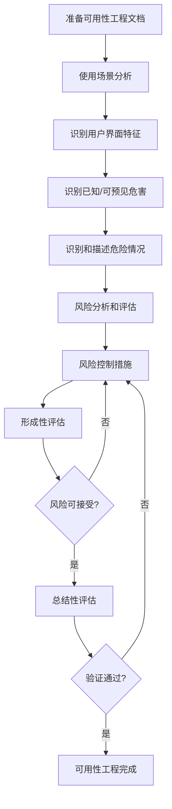

# IEC 62366 可用性工程

## 概述

IEC 62366系列标准是医疗器械可用性工程的国际标准，旨在确保医疗器械的用户界面设计能够最大限度地降低使用错误风险，保障患者和用户安全。

### 标准版本

- **IEC 62366-1:2015** - 医疗器械可用性工程的应用（主标准）
- **IEC 62366-2:2016** - 可用性工程文档指南（技术报告）

### 为什么可用性工程至关重要？

医疗器械使用错误可能导致严重后果：

- **患者伤害或死亡** - 错误的药物剂量、误诊、治疗延误
- **治疗失败** - 设备操作不当导致治疗无效
- **使用者挫败感** - 复杂界面导致医护人员压力增加
- **监管不合规** - FDA、欧盟MDR等法规强制要求

!!! warning "法规要求"
    欧盟MDR（2017/745）和美国FDA 21 CFR Part 820明确要求医疗器械制造商实施可用性工程流程。

## 核心概念

### 可用性（Usability）

> 特定用户在特定使用环境中，为达到特定目标而使用产品时的有效性、效率和满意度。

**三个维度**：

1. **有效性（Effectiveness）** - 用户能否完成任务
2. **效率（Efficiency）** - 完成任务所需的资源（时间、精力）
3. **满意度（Satisfaction）** - 用户的主观感受

### 使用错误（Use Error）

用户的行为或行为缺失导致与制造商预期不同的结果。

**使用错误类型**：

- **操作错误** - 按错按钮、输入错误数值
- **遗漏错误** - 忘记执行关键步骤
- **顺序错误** - 步骤执行顺序错误
- **时间错误** - 操作时机不当

### 使用相关风险（Use-Related Risk）

由于用户界面设计不当导致的使用错误可能引发的风险。

## 可用性工程流程

### 主要阶段

1. **准备阶段** - 建立可用性工程文档框架
2. **分析阶段** - 使用场景、用户、任务分析
3. **设计阶段** - 用户界面设计和风险控制
4. **评估阶段** - 形成性和总结性评估
5. **验证阶段** - 可用性验证测试

## 关键文档

### 可用性工程文档（Usability Engineering File）

必须包含的内容：

- **使用说明书** - 用户手册、快速指南
- **使用场景描述** - 预期用户、使用环境、使用任务
- **用户界面规范** - UI设计文档、交互流程
- **风险分析** - 使用相关风险识别和控制
- **形成性评估报告** - 设计阶段的可用性测试
- **总结性评估报告** - 最终可用性验证测试

## 与其他标准的关系

### ISO 14971（风险管理）

可用性工程是风险管理的重要组成部分：

- 使用错误是风险源之一
- 可用性测试是风险控制措施验证方法
- 残余风险需要在使用说明书中告知

### IEC 60601-1-6（医用电气设备可用性）

针对医用电气设备的可用性专用标准：

- 报警系统设计要求
- 显示屏和控制器设计
- 环境光照和噪声考虑

### ISO 9241（人机交互工效学）

通用人机交互设计原则：

- 对话原则（适合任务、自我描述等）
- 视觉显示设计
- 输入设备设计

## 监管要求

### 欧盟MDR

**附录I第5条** - 设计和制造要求：

> 医疗器械的设计和制造应考虑预期用户的技术知识、经验、教育、培训和使用环境，以及用户的医疗和身体状况。

**必须提交**：

- 可用性工程报告
- 使用场景分析
- 可用性测试报告

### FDA要求

**人因工程指南（2016）**：

- 适用于所有需要人机交互的医疗器械
- 关键任务必须进行可用性验证
- 提交510(k)或PMA时需包含人因工程报告

**关键任务识别**：

- 可能导致严重伤害的任务
- 使用频率高的任务
- 复杂或易混淆的任务

## 实施建议

### 早期介入

- 在概念设计阶段就开始可用性工程
- 避免后期大规模设计变更
- 降低开发成本和时间

### 迭代设计

- 采用"设计-测试-改进"循环
- 多次形成性评估
- 持续优化用户界面

### 用户参与

- 招募真实目标用户参与测试
- 模拟真实使用环境
- 收集定性和定量数据

### 跨职能协作

- 设计师、工程师、临床专家、法规人员共同参与
- 建立可用性工程团队
- 定期评审和沟通

## 学习路径

1. [可用性工程流程](usability-engineering-process.md) - 详细流程和方法
2. [使用错误分析](use-error-analysis.md) - 识别和分类使用错误
3. [用户界面设计原则](ui-design-principles.md) - 医疗器械UI/UX最佳实践
4. [形成性评估](formative-evaluation.md) - 设计阶段的可用性测试
5. [总结性评估](summative-evaluation.md) - 最终可用性验证

## 参考资源

### 标准文档

- IEC 62366-1:2015 - Medical devices — Part 1: Application of usability engineering to medical devices
- IEC 62366-2:2016 - Medical devices — Part 2: Guidance on the application of usability engineering to medical devices
- IEC 60601-1-6:2010 - Medical electrical equipment — Part 1-6: General requirements for basic safety and essential performance — Collateral standard: Usability

### 监管指南

- FDA - Applying Human Factors and Usability Engineering to Medical Devices (2016)
- MHRA - Human Factors and Usability Engineering — Guidance for Medical Devices Including Drug-device Combination Products (2021)

### 推荐书籍

- "Usability Engineering" by Jakob Nielsen
- "The Design of Everyday Things" by Don Norman
- "Handbook of Human Factors in Medical Device Design" by Matthew B. Weinger et al.

---

**下一步**: 开始学习[可用性工程流程](usability-engineering-process.md)，了解如何系统地实施可用性工程。
