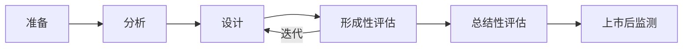

# 可用性工程流程

## 概述

IEC 62366-1定义了一个系统化的可用性工程流程，确保医疗器械的用户界面设计能够最大限度地降低使用错误风险。本文档详细介绍流程的每个阶段和关键活动。

## 流程概览



## 第一阶段：准备

### 1.1 建立可用性工程文档

创建可用性工程文档（Usability Engineering File, UEF）框架，作为整个流程的核心文档。

**文档结构**：

```
可用性工程文档/
├── 1-计划/
│   ├── 可用性工程计划.docx
│   └── 团队组成和职责.docx
├── 2-分析/
│   ├── 使用场景分析.docx
│   ├── 用户画像.docx
│   └── 任务分析.docx
├── 3-设计/
│   ├── 用户界面规范.docx
│   ├── 风险分析.xlsx
│   └── 设计原型/
├── 4-评估/
│   ├── 形成性评估报告/
│   └── 总结性评估报告.docx
└── 5-验证/
    └── 可用性验证报告.docx
```

### 1.2 组建可用性工程团队

**核心成员**：

- **可用性工程师** - 流程负责人
- **工业设计师** - UI/UX设计
- **软件工程师** - 交互实现
- **临床专家** - 医疗场景咨询
- **法规专员** - 合规性审查
- **质量工程师** - 风险管理整合

### 1.3 制定可用性工程计划

**计划内容**：

- 项目范围和目标
- 时间表和里程碑
- 资源分配
- 评估方法和标准
- 风险管理策略

## 第二阶段：分析

### 2.1 使用场景分析

识别和描述医疗器械的预期使用场景。

#### 使用场景要素

**1. 预期用户（Intended Users）**

识别所有可能使用设备的人员：

| 用户类型 | 特征 | 示例 |
|---------|------|------|
| 专业医护人员 | 医学培训、临床经验 | 医生、护士、技师 |
| 患者 | 可能无医学背景 | 糖尿病患者、心脏病患者 |
| 护理人员 | 基础培训或无培训 | 家属、护工 |
| 维护人员 | 技术培训 | 生物医学工程师 |

**用户特征分析**：

- **年龄** - 儿童、成人、老年人
- **身体能力** - 视力、听力、灵活性、力量
- **认知能力** - 记忆力、注意力、学习能力
- **教育背景** - 医学知识、技术素养
- **经验水平** - 新手、熟练、专家
- **语言能力** - 母语、多语言需求

**示例：血糖仪用户画像**

```markdown
### 用户画像1：老年糖尿病患者

- **年龄**: 65-80岁
- **视力**: 可能有老花眼或白内障
- **灵活性**: 手指关节炎，精细动作困难
- **认知**: 记忆力下降，需要简单清晰的指示
- **经验**: 可能首次使用血糖仪
- **使用频率**: 每天2-4次
- **使用环境**: 家中，光线可能不足
```

**2. 使用环境（Use Environment）**

描述设备使用的物理和社会环境：

**物理环境**：

- **地点** - 医院、诊所、家庭、救护车
- **光照** - 明亮、昏暗、变化
- **噪声** - 安静、嘈杂（ICU报警声）
- **温度/湿度** - 室温、极端条件
- **空间** - 宽敞、拥挤、移动中

**社会环境**：

- **工作压力** - 急诊vs常规检查
- **干扰因素** - 多任务、中断
- **团队协作** - 单人vs多人操作
- **时间压力** - 紧急vs非紧急

**示例：除颤器使用环境**

```markdown
### 使用环境：院外心脏骤停

- **地点**: 公共场所（机场、商场、街道）
- **光照**: 不可预测，可能昏暗
- **噪声**: 嘈杂，围观人群
- **空间**: 可能拥挤，地面不平
- **压力**: 极高，生死攸关
- **用户**: 可能是非专业人员
- **干扰**: 围观者、情绪紧张
```

**3. 使用任务（Use Tasks）**

列出用户需要执行的所有任务：

**任务类型**：

- **主要任务** - 核心治疗/诊断功能
- **辅助任务** - 设置、校准、维护
- **异常处理** - 错误恢复、故障排除

**任务分析模板**：

| 任务ID | 任务描述 | 频率 | 关键性 | 复杂度 |
|--------|---------|------|--------|--------|
| T-001 | 开机并选择测量模式 | 每次使用 | 高 | 低 |
| T-002 | 输入患者信息 | 每次使用 | 中 | 中 |
| T-003 | 执行测量 | 每次使用 | 高 | 中 |
| T-004 | 解读测量结果 | 每次使用 | 高 | 高 |
| T-005 | 处理错误信息 | 偶尔 | 高 | 高 |

### 2.2 用户需求分析

**功能需求**：

- 设备必须提供的功能
- 性能指标（准确性、速度）

**可用性需求**：

- 任务完成时间目标
- 错误率限制
- 用户满意度目标

**示例：胰岛素泵可用性需求**

```markdown
- 剂量设置错误率 < 1%
- 紧急停止操作 < 3秒
- 新用户培训时间 < 2小时
- 用户满意度评分 > 4/5
```

### 2.3 识别用户界面特征

列出所有用户与设备交互的界面元素：

**输入元素**：

- 按钮、旋钮、触摸屏
- 键盘、语音输入
- 传感器、探头

**输出元素**：

- 显示屏、指示灯
- 声音报警、语音提示
- 打印输出

**连接接口**：

- 电源线、数据线
- 无线连接
- 附件接口

## 第三阶段：设计

### 3.1 用户界面设计

应用人因工程原则设计用户界面（详见[用户界面设计原则](ui-design-principles.md)）。

**设计原则**：

1. **一致性** - 相似功能使用相似界面
2. **可见性** - 重要信息和控制清晰可见
3. **反馈** - 及时明确的操作反馈
4. **容错性** - 防止错误，易于恢复
5. **简洁性** - 避免不必要的复杂性

### 3.2 识别危害和危险情况

分析用户界面可能导致的危害：

**常见危害**：

- 错误的治疗剂量
- 延误治疗
- 误诊
- 设备损坏
- 交叉感染

**危险情况示例**：

```markdown
### 危险情况1：剂量输入错误

- **危害**: 药物过量
- **危险情况**: 用户将"10"输入为"100"
- **可能原因**: 
  - 小数点不清晰
  - 单位标识不明显
  - 缺少确认步骤
- **严重性**: 严重（可能致命）
- **发生概率**: 中等
```

### 3.3 风险控制措施

针对识别的风险实施控制措施：

**控制措施层级**（优先级从高到低）：

1. **本质安全设计** - 消除危害
   - 示例：限制最大剂量输入范围

2. **保护措施** - 降低风险
   - 示例：剂量确认对话框

3. **使用说明** - 告知用户
   - 示例：用户手册中的警告

**示例：剂量输入风险控制**

```markdown
### 风险控制措施

**措施1：输入范围限制**（本质安全）
- 软件限制：最大剂量不超过临床安全值
- 实施：输入验证算法

**措施2：二次确认**（保护措施）
- 显示："您输入的剂量是100单位，请确认"
- 要求：用户必须点击"确认"才能继续

**措施3：视觉强化**（保护措施）
- 大字体显示剂量值
- 单位标识醒目（"单位"字样）
- 颜色编码：异常高剂量显示为红色

**措施4：使用说明**（信息）
- 用户手册：剂量输入步骤详细说明
- 快速参考卡：常用剂量范围
```

## 第四阶段：形成性评估

形成性评估是设计过程中的迭代测试，目的是发现和解决可用性问题。

### 4.1 形成性评估方法

**1. 启发式评估（Heuristic Evaluation）**

专家根据可用性原则评审界面：

- **评审人员**: 3-5名可用性专家
- **评审内容**: 对照可用性原则检查界面
- **输出**: 可用性问题列表和严重性评级

**2. 认知走查（Cognitive Walkthrough）**

模拟用户执行任务的思维过程：

- **步骤**: 逐步分析每个操作
- **问题**: 
  - 用户能否知道下一步做什么？
  - 用户能否找到正确的控制？
  - 用户能否理解反馈？

**3. 用户测试（User Testing）**

招募真实用户测试原型：

- **参与者**: 5-8名目标用户
- **任务**: 代表性使用场景
- **数据收集**: 
  - 任务成功率
  - 完成时间
  - 错误次数
  - 用户反馈

### 4.2 形成性评估时机

**多次迭代**：

- **纸质原型阶段** - 测试基本布局和流程
- **低保真原型** - 测试交互逻辑
- **高保真原型** - 测试视觉设计和细节
- **工程样机** - 测试完整功能

### 4.3 问题分类和优先级

**严重性分级**：

| 等级 | 描述 | 处理 |
|------|------|------|
| 1-灾难性 | 导致严重伤害或死亡 | 必须修复 |
| 2-严重 | 导致中等伤害或治疗失败 | 必须修复 |
| 3-中等 | 导致轻微伤害或使用不便 | 应该修复 |
| 4-轻微 | 仅影响用户体验 | 考虑修复 |

## 第五阶段：总结性评估

总结性评估是最终的可用性验证测试，证明设备可以安全有效地使用。

### 5.1 总结性评估计划

**测试目标**：

- 验证关键任务可以安全完成
- 确认残余风险可接受
- 证明符合可用性需求

**测试设计**：

- **参与者数量**: 至少15名（FDA建议）
- **用户代表性**: 覆盖所有用户群体
- **任务选择**: 包含所有关键任务
- **环境模拟**: 尽可能真实的使用环境

### 5.2 关键任务识别

关键任务是可能导致严重伤害的任务，必须进行验证。

**识别标准**：

- 任务失败可能导致严重伤害
- 任务复杂或易混淆
- 任务使用频率高

**示例：输液泵关键任务**

```markdown
1. 设置输液速率
2. 设置输液总量
3. 启动输液
4. 响应报警
5. 紧急停止
```

### 5.3 测试执行

**测试流程**：

1. **参与者招募和筛选**
2. **知情同意**
3. **背景问卷**
4. **培训**（根据使用说明书）
5. **任务执行**（观察和记录）
6. **访谈和问卷**

**数据收集**：

- **任务成功/失败**
- **使用错误**（类型、频率、严重性）
- **接近错误**（差点犯错但自我纠正）
- **任务完成时间**
- **用户满意度**

### 5.4 验收标准

**成功标准示例**：

```markdown
### 关键任务：设置输液速率

- **成功率**: ≥95%
- **严重使用错误**: 0次
- **平均完成时间**: ≤30秒
- **用户满意度**: ≥4/5
```

### 5.5 测试报告

**报告内容**：

- 测试方法和参与者
- 任务描述和结果
- 使用错误分析
- 风险评估
- 结论和建议

## 第六阶段：上市后监测

### 6.1 上市后可用性数据收集

**数据来源**：

- 用户投诉和不良事件报告
- 客户反馈和调查
- 现场观察
- 培训反馈

### 6.2 持续改进

- 分析上市后数据
- 识别新的可用性问题
- 实施纠正和预防措施
- 更新可用性工程文档

## 实践建议

### 早期用户参与

- 在概念阶段就开始用户研究
- 定期邀请用户参与设计评审
- 建立用户咨询委员会

### 迭代设计

- 采用敏捷开发方法
- 快速原型和测试
- 小步快跑，持续改进

### 跨职能协作

- 定期召开可用性评审会议
- 设计师、工程师、临床专家共同参与
- 建立开放的沟通文化

### 文档管理

- 使用版本控制系统
- 保持文档更新
- 建立可追溯性

## 常见挑战和解决方案

### 挑战1：用户招募困难

**解决方案**：

- 与医院和诊所建立合作关系
- 提供合理的参与补偿
- 使用远程测试方法

### 挑战2：时间和资源限制

**解决方案**：

- 优先测试关键任务
- 使用快速评估方法（如启发式评估）
- 整合到开发流程中，而非独立阶段

### 挑战3：设计变更阻力

**解决方案**：

- 早期发现问题，降低变更成本
- 用数据说话，展示可用性问题的严重性
- 获得管理层支持

## 工具和模板

### 推荐工具

- **原型设计**: Figma, Sketch, Adobe XD
- **用户测试**: UserTesting, Lookback, Morae
- **数据分析**: Excel, SPSS, R
- **文档管理**: Confluence, SharePoint

### 模板下载

- 使用场景分析模板
- 任务分析表
- 形成性评估计划模板
- 总结性评估报告模板

---

**下一步**: 学习[使用错误分析](use-error-analysis.md)，深入了解如何识别和分类使用错误。
