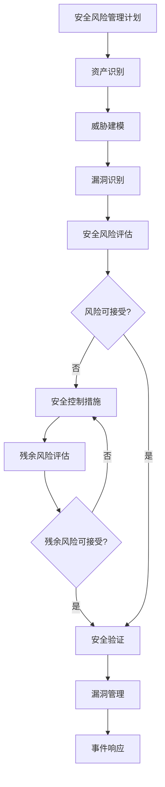

# IEC 81001-5-1 - 网络安全

## 学习目标

完成本模块后，你将能够：
- 理解医疗器械网络安全的重要性和标准要求
- 掌握威胁建模和风险评估方法
- 了解安全控制措施的设计和实施
- 理解漏洞管理和事件响应流程
- 应用网络安全要求到医疗器械开发

## 前置知识

- 网络安全基础知识
- 医疗器械软件开发基础
- 风险管理基础（ISO 14971）

## 标准概述

IEC 81001-5-1是医疗器械网络安全的国际标准，全称为"Health software and health IT systems safety, effectiveness and security - Part 5-1: Security - Activities in the product life cycle"。该标准提供了医疗器械网络安全的系统方法。

### 网络安全的重要性

医疗器械面临的网络安全威胁：
- 患者数据泄露
- 设备功能被篡改
- 勒索软件攻击
- 未授权访问
- 拒绝服务攻击

### 标准与其他标准的关系

- **IEC 62304**：软件生命周期过程
- **ISO 14971**：风险管理
- **IEC 62443**：工业自动化和控制系统安全
- **ISO/IEC 27001**：信息安全管理体系

## 网络安全风险管理

### 安全风险管理流程



**说明**: 这是IEC 81001-5-1安全风险管理流程图。展示了从安全风险管理计划到资产识别、威胁建模、漏洞识别、风险评估、安全控制措施实施和残余风险评估的完整流程，确保医疗设备的网络安全。


### 1. 资产识别

**资产类型**：
- **数据资产**：患者数据、配置数据、日志数据
- **软件资产**：应用软件、操作系统、固件
- **硬件资产**：处理器、存储器、通信接口
- **网络资产**：网络连接、协议、服务

**资产价值评估**：
- 机密性（Confidentiality）
- 完整性（Integrity）
- 可用性（Availability）

### 2. 威胁建模

**威胁类型**：

1. **未授权访问**
   - 物理访问
   - 网络访问
   - 本地访问

2. **数据泄露**
   - 传输中的数据
   - 存储中的数据
   - 显示中的数据

3. **数据篡改**
   - 配置数据修改
   - 软件代码修改
   - 患者数据修改

4. **拒绝服务**
   - 网络拒绝服务
   - 资源耗尽
   - 功能阻断

5. **恶意软件**
   - 病毒
   - 木马
   - 勒索软件

**威胁建模方法**：

**STRIDE模型**：
- **S**poofing（欺骗）：冒充合法用户或设备
- **T**ampering（篡改）：修改数据或代码
- **R**epudiation（否认）：否认执行的操作
- **I**nformation Disclosure（信息泄露）：未授权访问信息
- **D**enial of Service（拒绝服务）：阻止合法用户访问
- **E**levation of Privilege（权限提升）：获得未授权的权限

**攻击树分析**：
```
        获取患者数据
             |
    ┌────────┴────────┐
    |                 |
 物理访问          网络攻击
    |                 |
┌───┴───┐         ┌───┴───┐
|       |         |       |
窃取设备 USB访问  中间人攻击 SQL注入
```

**说明**: 这是攻击树示例，展示了攻击者获取患者数据的可能路径。包括物理访问(窃取设备、USB访问)和网络攻击(中间人攻击、SQL注入)等多种攻击向量，用于威胁建模和安全分析。


### 3. 漏洞识别

**常见漏洞**：

1. **认证漏洞**
   - 弱密码
   - 默认凭证
   - 缺少多因素认证

2. **授权漏洞**
   - 权限控制不当
   - 权限提升
   - 缺少访问控制

3. **加密漏洞**
   - 弱加密算法
   - 密钥管理不当
   - 未加密敏感数据

4. **输入验证漏洞**
   - SQL注入
   - 命令注入
   - 跨站脚本（XSS）

5. **配置漏洞**
   - 不安全的默认配置
   - 未关闭的调试接口
   - 不必要的服务

**漏洞评估方法**：
- 代码审查
- 渗透测试
- 漏洞扫描
- 威胁情报分析

### 4. 安全风险评估

**风险计算**：
风险 = 威胁可能性 × 漏洞严重程度 × 资产价值

**风险等级**：

| 风险等级 | 描述 | 处理策略 |
|---------|------|---------|
| 极高 | 立即威胁患者安全 | 必须立即缓解 |
| 高 | 可能威胁患者安全 | 优先缓解 |
| 中 | 可能影响设备功能 | 计划缓解 |
| 低 | 影响有限 | 接受或监控 |

## 安全控制措施

### 安全控制分类

**预防性控制**：防止安全事件发生
**检测性控制**：检测安全事件
**响应性控制**：响应和恢复安全事件

### 1. 身份认证和访问控制

**认证机制**：
- 用户名和密码
- 多因素认证（MFA）
- 生物识别
- 证书认证

**密码策略**：
- 最小长度：8-12字符
- 复杂度要求：大小写、数字、特殊字符
- 密码历史：防止重复使用
- 密码过期：定期更换

**访问控制**：
- 基于角色的访问控制（RBAC）
- 最小权限原则
- 职责分离
- 会话管理

**示例代码**：
```c
// 密码强度验证
bool validate_password_strength(const char* password) {
    int length = strlen(password);
    bool has_upper = false;
    bool has_lower = false;
    bool has_digit = false;
    bool has_special = false;
    
    // 检查最小长度
    if (length < 8) {
        return false;
    }
    
    // 检查字符类型
    for (int i = 0; i < length; i++) {
        if (isupper(password[i])) has_upper = true;
        if (islower(password[i])) has_lower = true;
        if (isdigit(password[i])) has_digit = true;
        if (ispunct(password[i])) has_special = true;
    }
    
    // 至少包含三种字符类型
    int types = has_upper + has_lower + has_digit + has_special;
    return types >= 3;
}
```

### 2. 数据保护

**传输中的数据保护**：
- TLS/SSL加密
- VPN
- 安全协议（HTTPS, SFTP）

**存储中的数据保护**：
- 加密存储
- 安全删除
- 备份加密

**显示中的数据保护**：
- 屏幕锁定
- 数据脱敏
- 防止肩窥

**加密算法选择**：
- 对称加密：AES-256
- 非对称加密：RSA-2048或更高
- 哈希算法：SHA-256或更高
- 避免：DES, MD5, SHA-1

**示例代码**：
```c
// AES-256加密示例（伪代码）
int encrypt_patient_data(const uint8_t* plaintext, size_t len,
                         const uint8_t* key, uint8_t* ciphertext) {
    // 初始化AES上下文
    AES_CTX ctx;
    aes_init(&ctx, key, 256);
    
    // 生成随机IV
    uint8_t iv[16];
    generate_random_iv(iv, 16);
    
    // 加密数据
    int result = aes_encrypt_cbc(&ctx, plaintext, len, iv, ciphertext);
    
    // 清除密钥
    memset(&ctx, 0, sizeof(ctx));
    
    return result;
}
```

### 3. 安全通信

**网络分段**：
- 医疗网络与企业网络隔离
- VLAN分段
- 防火墙规则

**安全协议**：
- HTTPS（HTTP over TLS）
- DICOM TLS
- HL7 over TLS

**证书管理**：
- 使用受信任的CA
- 证书有效期管理
- 证书吊销检查

### 4. 审计和日志

**审计事件**：
- 用户登录/登出
- 访问患者数据
- 配置更改
- 安全事件
- 系统错误

**日志内容**：
- 时间戳
- 用户标识
- 事件类型
- 事件结果
- 源IP地址

**日志保护**：
- 日志完整性保护
- 日志加密存储
- 日志备份
- 日志保留期限

**示例代码**：
```c
// 审计日志记录
void audit_log(const char* user, const char* action, 
               const char* resource, bool success) {
    time_t now = time(NULL);
    struct tm* tm_info = localtime(&now);
    char timestamp[26];
    strftime(timestamp, 26, "%Y-%m-%d %H:%M:%S", tm_info);
    
    // 记录到安全日志
    fprintf(audit_log_file, "[%s] User: %s, Action: %s, "
            "Resource: %s, Result: %s\n",
            timestamp, user, action, resource,
            success ? "SUCCESS" : "FAILURE");
    
    // 立即刷新到磁盘
    fflush(audit_log_file);
}
```

### 5. 软件完整性

**代码签名**：
- 数字签名验证
- 防止代码篡改
- 可信启动

**安全启动**：
- 验证引导加载程序
- 验证操作系统
- 验证应用程序

**运行时完整性检查**：
- 内存保护
- 代码完整性验证
- 配置文件完整性验证

### 6. 安全更新

**更新机制**：
- 自动更新通知
- 安全更新优先级
- 更新验证
- 回滚机制

**更新流程**：
1. 漏洞发现
2. 补丁开发
3. 补丁测试
4. 补丁发布
5. 补丁部署
6. 部署验证

## 漏洞管理

### 漏洞生命周期


**说明**: 这是漏洞管理流程图，展示了从漏洞发现到验证关闭的完整生命周期。包括漏洞评估、修复、补丁测试、发布、部署和验证等步骤，确保安全漏洞得到及时有效的处理。


### 漏洞披露

**协调漏洞披露（CVD）**：
- 建立漏洞报告渠道
- 与研究人员合作
- 协调披露时间
- 发布安全公告

**漏洞评分**：
使用CVSS（Common Vulnerability Scoring System）评分：
- 基础评分（Base Score）：0-10
- 时间评分（Temporal Score）
- 环境评分（Environmental Score）

### 第三方组件管理

**SBOM（Software Bill of Materials）**：
- 列出所有第三方组件
- 跟踪组件版本
- 监控组件漏洞
- 及时更新组件

**示例SBOM**：
```json
{
  "components": [
    {
      "name": "OpenSSL",
      "version": "1.1.1k",
      "license": "Apache-2.0",
      "vulnerabilities": []
    },
    {
      "name": "SQLite",
      "version": "3.35.5",
      "license": "Public Domain",
      "vulnerabilities": []
    }
  ]
}
```

**说明**: 这是软件物料清单(SBOM)的JSON格式示例。记录了软件中使用的所有第三方组件，包括名称、版本、许可证和已知漏洞信息，用于供应链安全管理和漏洞跟踪。


## 事件响应

### 事件响应计划

**准备阶段**：
- 建立事件响应团队
- 制定响应流程
- 准备响应工具
- 进行演练

**检测和分析**：
- 监控安全事件
- 分析事件严重程度
- 确定影响范围

**遏制、根除和恢复**：
- 隔离受影响系统
- 消除威胁
- 恢复正常运行

**事后活动**：
- 事件总结
- 改进措施
- 更新响应计划

### 事件分类

| 严重程度 | 描述 | 响应时间 |
|---------|------|---------|
| 紧急 | 威胁患者安全 | 立即 |
| 高 | 重大功能影响 | 4小时内 |
| 中 | 部分功能影响 | 24小时内 |
| 低 | 轻微影响 | 7天内 |

## 安全测试

### 测试类型

**静态测试**：
- 代码审查
- 静态分析工具
- 配置审查

**动态测试**：
- 渗透测试
- 模糊测试
- 漏洞扫描

**示例测试场景**：

1. **认证测试**
   - 弱密码测试
   - 暴力破解测试
   - 会话劫持测试

2. **授权测试**
   - 权限提升测试
   - 水平权限测试
   - 垂直权限测试

3. **输入验证测试**
   - SQL注入测试
   - 命令注入测试
   - XSS测试

4. **加密测试**
   - 加密算法验证
   - 密钥管理测试
   - 证书验证测试

## 最佳实践

!!! tip "网络安全建议"
    1. **安全设计**：从设计阶段就考虑安全
    2. **纵深防御**：多层安全控制
    3. **最小权限**：只授予必要的权限
    4. **默认安全**：安全的默认配置
    5. **持续监控**：持续监控安全事件
    6. **定期更新**：及时应用安全补丁
    7. **安全培训**：培训开发和运维人员

## 常见陷阱

!!! warning "注意事项"
    1. **硬编码凭证**：在代码中硬编码密码或密钥
    2. **弱加密**：使用过时的加密算法
    3. **缺少输入验证**：未验证用户输入
    4. **过度权限**：授予过多权限
    5. **忽视日志**：未记录安全事件
    6. **延迟更新**：未及时应用安全补丁
    7. **缺少测试**：未进行安全测试

## 实践练习

1. 为一个血压监测器进行威胁建模，使用STRIDE方法
2. 设计一个安全的用户认证系统
3. 制定一个漏洞管理流程
4. 编写一个安全事件响应计划

## 自测问题

??? question "问题1：STRIDE威胁建模方法包括哪些威胁类型？"
    
    ??? success "答案"
        STRIDE包括六种威胁类型：
        
        1. **Spoofing（欺骗）**：冒充合法用户或设备
           - 示例：使用窃取的凭证登录
        
        2. **Tampering（篡改）**：修改数据或代码
           - 示例：修改患者数据或设备配置
        
        3. **Repudiation（否认）**：否认执行的操作
           - 示例：用户否认访问了患者数据
        
        4. **Information Disclosure（信息泄露）**：未授权访问信息
           - 示例：窃取患者数据
        
        5. **Denial of Service（拒绝服务）**：阻止合法用户访问
           - 示例：网络攻击导致设备无法使用
        
        6. **Elevation of Privilege（权限提升）**：获得未授权的权限
           - 示例：普通用户获得管理员权限

??? question "问题2：什么是纵深防御？如何实施？"
    
    ??? success "答案"
        **纵深防御**：使用多层安全控制，即使一层被突破，其他层仍能提供保护。
        
        **实施方法**：
        1. **网络层**：防火墙、网络分段、入侵检测
        2. **主机层**：操作系统加固、防病毒软件、主机防火墙
        3. **应用层**：输入验证、输出编码、安全配置
        4. **数据层**：加密、访问控制、数据脱敏
        5. **物理层**：物理访问控制、设备锁定
        
        **示例**：
        - 第1层：防火墙阻止未授权网络访问
        - 第2层：认证系统验证用户身份
        - 第3层：授权系统控制用户权限
        - 第4层：加密保护敏感数据
        - 第5层：审计日志记录所有操作

??? question "问题3：为什么要避免使用MD5和SHA-1？应该使用什么？"
    
    ??? success "答案"
        **避免原因**：
        - **MD5**：已被证明存在碰撞漏洞，不安全
        - **SHA-1**：已被证明存在碰撞漏洞，不推荐使用
        
        **推荐算法**：
        - **哈希**：SHA-256, SHA-384, SHA-512
        - **对称加密**：AES-256
        - **非对称加密**：RSA-2048或更高，ECC-256或更高
        - **密钥派生**：PBKDF2, bcrypt, scrypt, Argon2
        
        **示例**：
        ```c
        // 不推荐
        MD5(password);  // 不安全
        
        // 推荐
        SHA256(password);  // 更安全
        PBKDF2(password, salt, iterations);  // 密码哈希最佳实践
        ```

??? question "问题4：什么是SBOM？为什么重要？"
    
    ??? success "答案"
        **SBOM（Software Bill of Materials）**：软件物料清单，列出软件中所有组件的清单。
        
        **内容**：
        - 组件名称和版本
        - 许可证信息
        - 依赖关系
        - 已知漏洞
        
        **重要性**：
        1. **漏洞管理**：快速识别受影响的组件
        2. **许可证合规**：确保许可证合规
        3. **供应链安全**：了解软件供应链
        4. **事件响应**：快速响应安全事件
        5. **法规要求**：满足FDA等监管要求
        
        **示例场景**：
        - 发现OpenSSL漏洞（如Heartbleed）
        - 查看SBOM确定是否使用了受影响版本
        - 如果使用，立即更新并发布补丁

??? question "问题5：安全事件响应的四个阶段是什么？"
    
    ??? success "答案"
        **四个阶段**：
        
        1. **准备（Preparation）**：
           - 建立事件响应团队
           - 制定响应流程和手册
           - 准备响应工具和资源
           - 进行演练和培训
        
        2. **检测和分析（Detection and Analysis）**：
           - 监控安全事件
           - 分析事件性质和严重程度
           - 确定影响范围
           - 通知相关人员
        
        3. **遏制、根除和恢复（Containment, Eradication, and Recovery）**：
           - 遏制：隔离受影响系统，防止扩散
           - 根除：消除威胁，修复漏洞
           - 恢复：恢复正常运行，验证系统安全
        
        4. **事后活动（Post-Incident Activity）**：
           - 事件总结和文档化
           - 根本原因分析
           - 改进措施
           - 更新响应计划

??? question "问题6：什么是最小权限原则？如何实施？"
    
    ??? success "答案"
        **最小权限原则**：用户或进程只应拥有完成其任务所需的最小权限。
        
        **实施方法**：
        1. **基于角色的访问控制（RBAC）**：
           - 定义角色（如医生、护士、技术员）
           - 为每个角色分配最小必要权限
           - 将用户分配到角色
        
        2. **默认拒绝**：
           - 默认拒绝所有访问
           - 明确授予必要权限
        
        3. **定期审查**：
           - 定期审查用户权限
           - 删除不再需要的权限
        
        4. **职责分离**：
           - 关键操作需要多人协作
           - 防止单点故障
        
        **示例**：
        - 护士只能查看和记录患者数据，不能修改设备配置
        - 技术员只能修改设备配置，不能访问患者数据
        - 管理员可以管理用户，但需要审计

## 相关资源

- [IEC 62304 - 软件生命周期](../iec-62304/index.md)
- [ISO 14971 - 风险管理](../iso-14971/index.md)

## 参考文献

1. IEC 81001-5-1:2021 - Health software and health IT systems safety, effectiveness and security - Part 5-1: Security - Activities in the product life cycle
2. FDA Guidance: "Cybersecurity for Networked Medical Devices Containing Off-the-Shelf (OTS) Software"
3. FDA Guidance: "Postmarket Management of Cybersecurity in Medical Devices"
4. NIST Cybersecurity Framework
5. 书籍：《Medical Device Cybersecurity for Engineers and Manufacturers》by Axel Wirth
