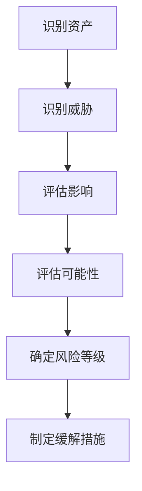

# IEC 81001-5-1 威胁建模

## 学习目标

完成本模块后，你将能够：
- 理解IEC 81001-5-1 威胁建模的核心要求和流程
- 掌握相关的方法、工具和最佳实践
- 应用到实际医疗器械项目中
- 满足相关法规和标准要求

## 前置知识

- 医疗器械法规基础知识
- 质量管理体系概念
- 相关标准的基本了解

## 内容

### 威胁建模概述

威胁建模是识别和评估医疗器械网络安全威胁的系统化方法。

### STRIDE模型

**STRIDE威胁分类**：
- **S**poofing（欺骗）：冒充身份
- **T**ampering（篡改）：修改数据或代码
- **R**epudiation（否认）：否认操作
- **I**nformation Disclosure（信息泄露）：未授权访问
- **D**enial of Service（拒绝服务）：阻止服务
- **E**levation of Privilege（权限提升）：获得未授权权限

### 威胁识别方法

1. **资产识别**：
   - 数据资产
   - 系统组件
   - 通信接口

2. **攻击面分析**：
   - 网络接口
   - 物理接口
   - 用户接口

3. **威胁场景**：
   - 外部攻击
   - 内部威胁
   - 供应链风险

### 威胁分析流程

**说明**: 这是威胁建模流程图，展示了从资产识别到缓解措施制定的系统化方法。包括识别资产、识别威胁、评估影响、评估可能性、确定风险等级和制定缓解措施等步骤，是安全风险管理的核心流程。

### 威胁评估

**影响评估**：
- 患者安全影响
- 数据机密性影响
- 系统可用性影响

**可能性评估**：
- 攻击者能力
- 攻击动机
- 攻击机会

### 文档要求

- 威胁模型文档
- 威胁清单
- 风险评估结果
- 缓解措施计划

## 最佳实践

!!! tip "实施建议"
    1. **系统方法**：采用系统化的方法进行规划和实施
    2. **早期规划**：在项目早期阶段就考虑相关要求
    3. **文档完整**：保持完整准确的文档记录
    4. **团队培训**：确保团队理解并能正确执行要求
    5. **持续改进**：定期评审和改进流程
    6. **专家咨询**：必要时寻求专业咨询支持
    7. **工具支持**：使用适当的工具提高效率和准确性
    8. **风险管理**：整合风险管理到整个过程

## 常见陷阱

!!! warning "注意事项"
    1. **理解偏差**：对要求理解不准确或不完整
    2. **文档不足**：缺少必要的文档或记录不完整
    3. **时间估计不足**：低估所需时间和资源
    4. **沟通不畅**：与监管机构沟通不充分
    5. **变更管理不当**：未能有效管理变更
    6. **测试不充分**：验证和确认活动不充分
    7. **忽视细节**：忽视看似次要但重要的要求
    8. **缺乏持续性**：批准后缺乏持续维护

## 实践练习

1. 分析一个具体的医疗器械产品，应用本模块的要求
2. 制定相关的计划和程序文档
3. 识别潜在的合规风险和挑战
4. 制定风险缓解和改进计划

## 自测问题

??? question "问题1：本标准/流程的主要目的是什么？"
    
    ??? success "答案"
        主要目的是确保医疗器械的安全性和有效性，通过系统化的方法满足法规要求。
        
        具体包括：
        - 保护患者和用户安全
        - 确保产品质量和性能
        - 满足监管要求
        - 支持产品上市和持续改进
        - 建立可追溯性和问责制

??? question "问题2：关键步骤和要求有哪些？"
    
    ??? success "答案"
        关键步骤包括：
        1. 理解适用的法规和标准要求
        2. 制定详细的实施计划
        3. 建立必要的程序和文档体系
        4. 培训相关人员
        5. 执行并记录所有活动
        6. 进行充分的验证和确认
        7. 与监管机构沟通
        8. 持续监控和改进

??? question "问题3：如何确保持续合规？"
    
    ??? success "答案"
        确保持续合规的方法：
        - 建立质量管理体系
        - 定期进行内部审核
        - 进行管理评审
        - 监控法规变化
        - 及时更新文档和流程
        - 持续培训团队
        - 管理变更和偏差
        - 处理不合格和投诉
        - 进行批准后监督

??? question "问题4：常见的挑战和解决方案是什么？"
    
    ??? success "答案"
        **常见挑战**：
        - 要求复杂且不断变化
        - 资源和时间限制
        - 跨部门协调困难
        - 文档工作量大
        - 技术难题
        
        **解决方案**：
        - 早期规划和准备
        - 寻求专家支持
        - 使用项目管理工具
        - 建立跨职能团队
        - 采用模板和工具
        - 持续学习和改进
        - 与监管机构保持沟通

??? question "问题5：与其他标准/流程的关系是什么？"
    
    ??? success "答案"
        本标准/流程与其他相关标准和流程紧密相关：
        
        - 与ISO 13485质量管理体系整合
        - 与ISO 14971风险管理协调
        - 与IEC 62304软件生命周期对接
        - 与其他特定标准配合使用
        
        需要：
        - 建立统一的管理框架
        - 避免重复工作
        - 确保一致性
        - 优化资源利用
        - 建立完整的追溯性

## 相关资源

- [IEC 81001-5-1概览](../index.md)

## 参考文献

1. 相关国际标准和法规文件
2. FDA指南文件和技术文档
3. 行业最佳实践指南和白皮书
4. 专业书籍和学术文献
5. 在线资源、培训材料和案例研究
