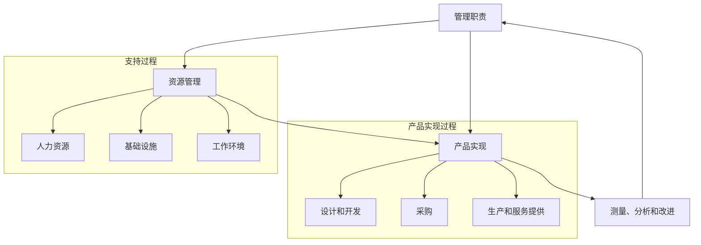

# ISO 13485 - 质量管理体系

## 学习目标

完成本模块后，你将能够：
- 理解ISO 13485标准的目的和适用范围
- 掌握质量管理体系的核心要求
- 了解文档控制和记录管理的要求
- 理解设计和开发过程的质量要求
- 应用ISO 13485要求建立质量管理体系

## 前置知识

- 质量管理基础概念
- 医疗器械法规基础
- 组织管理知识

## 标准概述

ISO 13485是专门针对医疗器械行业的质量管理体系标准，全称为"Medical devices - Quality management systems - Requirements for regulatory purposes"。该标准基于ISO 9001，但更加强调满足法规要求和风险管理。

### 标准特点

与ISO 9001相比，ISO 13485的特点：
- **法规导向**：强调满足法规和安全要求
- **风险管理**：要求整合ISO 14971风险管理
- **文档要求**：更严格的文档控制要求
- **可追溯性**：强调产品可追溯性
- **验证和确认**：明确区分验证和确认活动

### 适用范围

ISO 13485适用于：
- 医疗器械的设计和开发
- 医疗器械的生产
- 医疗器械的安装和服务
- 医疗器械的销售和分销
- 相关服务的提供

## 质量管理体系架构



**说明**: 这是ISO 13485质量管理体系的过程模型图。展示了管理职责、资源管理、产品实现和测量分析改进之间的关系，以及产品实现过程中的各个子过程，体现了PDCA(计划-执行-检查-改进)循环。


## 核心要求

### 1. 质量管理体系总要求

**文档要求**：
- 质量手册
- 程序文件
- 作业指导书
- 质量记录

**过程方法**：
- 识别质量管理体系所需的过程
- 确定过程的顺序和相互作用
- 确定过程的准则和方法
- 监视、测量和分析过程
- 实施必要的措施以实现过程目标

### 2. 管理职责

**最高管理者职责**：
- 制定质量方针
- 确保质量目标的建立
- 进行管理评审
- 确保资源的获得

**质量方针**：
- 与组织的宗旨相适应
- 包括对满足要求和保持质量管理体系有效性的承诺
- 提供制定和评审质量目标的框架
- 在组织内得到沟通和理解
- 定期评审以确保持续适宜性

**管理评审**：
- 定期进行（至少每年一次）
- 评审输入包括：审核结果、客户反馈、过程绩效、产品符合性、纠正和预防措施、以往管理评审的跟踪措施
- 评审输出包括：质量管理体系及其过程有效性的改进、与客户要求有关的产品的改进、资源需求

### 3. 资源管理

**人力资源**：
- 能力、意识和培训
- 确定从事影响产品质量工作的人员所需的能力
- 提供培训或采取其他措施以满足这些需求
- 评价所采取措施的有效性
- 保持教育、培训、技能和经验的适当记录

**基础设施**：
- 建筑物、工作场所和相关设施
- 过程设备（硬件和软件）
- 支持性服务（如运输、通讯）

**工作环境**：
- 清洁度要求
- 污染控制
- 人员健康、清洁和服装要求
- 环境条件（温度、湿度等）

### 4. 产品实现

#### 4.1 设计和开发

**设计和开发策划**：
- 设计和开发阶段
- 每个阶段适宜的评审、验证和确认活动
- 设计和开发的职责和权限

**设计和开发输入**：
- 功能和性能要求
- 适用的法规要求
- 适用的标准
- 风险管理输出
- 以往类似设计的信息

**设计和开发输出**：
- 满足输入要求
- 提供采购、生产和服务提供的适当信息
- 包含或引用产品接收准则
- 规定对产品安全和正常使用必不可少的特性

**设计和开发验证**：
- 确保设计和开发输出满足输入要求
- 保持验证结果和必要措施的记录

**设计和开发确认**：
- 确保产品能够满足规定的应用或预期用途的要求
- 在产品交付或实施之前完成
- 保持确认结果和必要措施的记录

**设计和开发更改控制**：
- 识别设计和开发更改
- 评审、验证和确认更改
- 批准更改
- 评价更改对产品和已交付产品的影响

#### 4.2 采购

**采购过程**：
- 确保采购的产品符合规定的采购要求
- 对供方的选择、评价和再评价
- 保持评价结果和必要措施的记录

**采购信息**：
- 产品规格
- 接收准则
- 程序、过程和设备要求
- 人员资格要求
- 质量管理体系要求

**采购产品的验证**：
- 实施检验或其他必要的活动
- 在供方现场实施验证时，在采购信息中规定验证的安排和产品放行的方法

#### 4.3 生产和服务提供

**生产和服务提供的控制**：
- 获得规定产品特性的信息
- 必要时，获得作业指导书
- 使用适宜的设备
- 获得和使用监视和测量装置
- 实施监视和测量
- 实施放行、交付和交付后活动

**产品的清洁**：
- 如果产品在最终使用前需要清洁，应规定清洁过程
- 如果产品不能清洁后再灭菌，应在受控条件下进行清洁

**安装活动**：
- 建立安装和验证接收准则的文件化程序
- 保持安装和验证的记录

**服务活动**：
- 建立实施服务活动和验证服务活动满足要求的文件化程序
- 保持服务活动的记录

**可追溯性**：
- 建立文件化程序以确保产品的可追溯性
- 保持唯一标识的记录
- 对于植入性医疗器械，保持分销和接收者的记录

### 5. 测量、分析和改进

**监视和测量**：
- 客户满意度
- 内部审核
- 过程的监视和测量
- 产品的监视和测量

**不合格品控制**：
- 识别和控制不合格品
- 评审不合格品
- 采取措施消除不合格
- 保持不合格的性质和采取措施的记录

**数据分析**：
- 收集和分析数据以证实质量管理体系的适宜性和有效性
- 评价可以进行的持续改进

**改进**：
- 纠正措施
- 预防措施
- 持续改进

## 文档控制要求

### 文档层次结构

```
第一层：质量手册
    ├── 质量方针和目标
    ├── 组织结构和职责
    └── 质量管理体系概述

第二层：程序文件
    ├── 文档控制程序
    ├── 记录控制程序
    ├── 内部审核程序
    ├── 不合格品控制程序
    ├── 纠正措施程序
    └── 预防措施程序

第三层：作业指导书
    ├── 操作规程
    ├── 检验规程
    └── 测试规程

第四层：质量记录
    ├── 设计记录
    ├── 生产记录
    ├── 检验记录
    └── 审核记录
```

**说明**: 这是ISO 13485文档体系的层级结构。第一层是质量手册，第二层是程序文件，第三层是作业指导书，第四层是记录表单。这种分层结构确保了文档的系统性和可管理性。


### 文档控制要求

**文档批准和发布**：
- 文档发布前得到批准
- 必要时对文档进行评审和更新
- 确保文档的更改和现行修订状态得到识别
- 确保在使用处可获得适用文件的有关版本
- 确保文档保持清晰、易于识别
- 确保外来文件得到识别并控制其分发
- 防止作废文件的非预期使用

**记录控制**：
- 建立并保持记录以提供符合要求和质量管理体系有效运行的证据
- 记录应保持清晰、易于识别和检索
- 规定记录的标识、贮存、保护、检索、保存期限和处置

## 审核要点

### 内部审核

**审核计划**：
- 审核的频次（至少每年一次）
- 审核的范围
- 审核的准则
- 审核员的选择

**审核实施**：
- 审核前准备（检查表、文件审查）
- 首次会议
- 现场审核（观察、访谈、文件审查）
- 末次会议
- 审核报告

**审核跟踪**：
- 不符合项的纠正措施
- 纠正措施的验证
- 纠正措施的关闭

### 外部审核（认证审核）

**第一阶段审核**：
- 文件审查
- 现场评估准备情况
- 确定第二阶段审核的重点

**第二阶段审核**：
- 全面评估质量管理体系的实施和有效性
- 现场观察和访谈
- 记录审查
- 不符合项识别

**监督审核**：
- 证书有效期内的定期审核（通常每年一次）
- 验证质量管理体系的持续符合性

**再认证审核**：
- 证书到期前的全面审核（通常3年一次）
- 评估质量管理体系的持续有效性

## 最佳实践

!!! tip "实施建议"
    1. **高层承诺**：确保最高管理者的承诺和参与
    2. **过程方法**：采用过程方法建立质量管理体系
    3. **风险管理整合**：将ISO 14971风险管理整合到质量管理体系
    4. **持续改进**：建立持续改进的文化
    5. **培训和意识**：确保所有人员理解质量管理体系的要求
    6. **文档简化**：文档应简洁明了，避免过度文档化
    7. **电子化管理**：使用电子文档管理系统提高效率

## 常见陷阱

!!! warning "注意事项"
    1. **文档与实际脱节**：文档描述与实际操作不一致
    2. **记录不完整**：缺少关键活动的记录
    3. **培训不充分**：人员不了解质量管理体系要求
    4. **纠正措施无效**：未找到根本原因，措施治标不治本
    5. **管理评审流于形式**：缺乏实质性的评审和决策
    6. **供应商管理不足**：未充分评估和监控供应商
    7. **变更控制不当**：未评估变更的影响

## 实践练习

1. 设计一个文档控制程序，包括文档的编制、审批、发布、更改和作废
2. 制定一个内部审核计划，包括审核范围、频次和审核员安排
3. 编写一个纠正措施报告，包括问题描述、根本原因分析和纠正措施
4. 设计一个供应商评估表，包括评估准则和评分方法

## 自测问题

??? question "问题1：ISO 13485与ISO 9001的主要区别是什么？"
    
    ??? success "答案"
        主要区别包括：
        1. **法规导向**：ISO 13485更强调满足法规要求，而ISO 9001更强调客户满意
        2. **风险管理**：ISO 13485要求整合ISO 14971风险管理，ISO 9001的风险管理要求较宽泛
        3. **持续改进**：ISO 13485要求保持质量管理体系的有效性，ISO 9001要求持续改进
        4. **文档要求**：ISO 13485的文档要求更严格，特别是记录保存
        5. **可追溯性**：ISO 13485对产品可追溯性有明确要求
        6. **验证和确认**：ISO 13485明确区分验证和确认，要求更详细

??? question "问题2：质量手册应该包含哪些内容？"
    
    ??? success "答案"
        质量手册应包含：
        1. 质量管理体系的范围，包括任何删减的细节和理由
        2. 为质量管理体系建立的文件化程序或对其引用
        3. 质量管理体系过程之间的相互作用的表述
        4. 组织的质量方针和质量目标
        5. 组织结构和职责
        6. 管理者代表的任命
        
        质量手册应该是一个高层次的文件，提供质量管理体系的概述。

??? question "问题3：什么是纠正措施和预防措施？两者有什么区别？"
    
    ??? success "答案"
        **纠正措施（Corrective Action, CA）**：
        - 针对已发生的不合格
        - 目的是消除不合格的原因，防止再次发生
        - 包括：问题识别、根本原因分析、措施制定、实施、验证有效性
        
        **预防措施（Preventive Action, PA）**：
        - 针对潜在的不合格
        - 目的是消除潜在不合格的原因，防止发生
        - 包括：潜在问题识别、原因分析、措施制定、实施、验证有效性
        
        **主要区别**：
        - 纠正措施是"事后"的，预防措施是"事前"的
        - 纠正措施针对实际问题，预防措施针对潜在问题
        - 两者都需要根本原因分析和有效性验证

??? question "问题4：设计验证和设计确认有什么区别？"
    
    ??? success "答案"
        **设计验证（Design Verification）**：
        - 目的：确保设计输出满足设计输入要求
        - 问题："我们是否正确地构建了产品？"（Are we building the product right?）
        - 方法：测试、检查、分析、演示等
        - 时机：在设计阶段进行
        - 示例：单元测试、集成测试、代码审查
        
        **设计确认（Design Validation）**：
        - 目的：确保产品满足用户需求和预期用途
        - 问题："我们是否构建了正确的产品？"（Are we building the right product?）
        - 方法：在实际或模拟使用条件下进行测试
        - 时机：在产品交付前进行
        - 示例：临床评价、用户测试、现场测试
        
        简单记忆：验证是"做对"，确认是"做对的事"。

??? question "问题5：管理评审的输入和输出分别是什么？"
    
    ??? success "答案"
        **管理评审输入**：
        1. 审核结果
        2. 客户反馈
        3. 过程的绩效和产品的符合性
        4. 预防和纠正措施的状况
        5. 以往管理评审的跟踪措施
        6. 可能影响质量管理体系的变更
        7. 改进的建议
        8. 新的或修订的法规要求
        
        **管理评审输出**：
        1. 质量管理体系及其过程有效性的改进
        2. 与客户要求有关的产品的改进
        3. 资源需求
        4. 质量方针和质量目标的变更（如需要）
        
        管理评审应形成记录，包括评审的决定和措施。

??? question "问题6：产品可追溯性的要求是什么？对于植入性医疗器械有什么特殊要求？"
    
    ??? success "答案"
        **一般可追溯性要求**：
        1. 建立文件化程序以确保产品的可追溯性
        2. 保持产品唯一标识的记录
        3. 能够追溯产品的生产历史、使用的材料和部件
        4. 记录应包括：批号、序列号、生产日期等
        
        **植入性医疗器械的特殊要求**：
        1. 保持分销记录，包括：
           - 产品的名称和序列号
           - 发货日期
           - 接收者的名称和地址
        2. 保持接收者的记录（如医院、诊所）
        3. 记录保存期限通常要求至少保存到产品预期寿命结束后2年
        4. 能够在必要时快速召回产品
        
        这些要求确保在产品出现问题时能够快速定位和召回。

## 相关资源

- [IEC 62304 - 软件生命周期](../iec-62304/index.md)
- [ISO 14971 - 风险管理](../iso-14971/index.md)
- [配置管理](../../software-engineering/configuration-management/index.md)

## 参考文献

1. ISO 13485:2016 - Medical devices - Quality management systems - Requirements for regulatory purposes
2. ISO 9001:2015 - Quality management systems - Requirements
3. ISO 14971:2019 - Medical devices - Application of risk management to medical devices
4. FDA 21 CFR Part 820 - Quality System Regulation
5. 书籍：《ISO 13485:2016 - A Complete Guide to Quality Management in the Medical Device Industry》by Itay Abuhav
