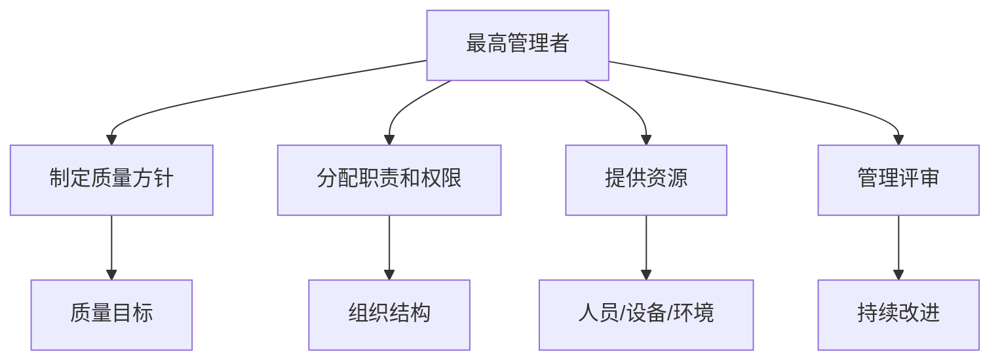
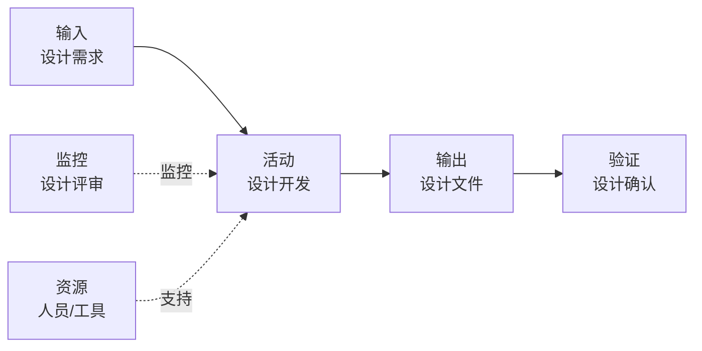
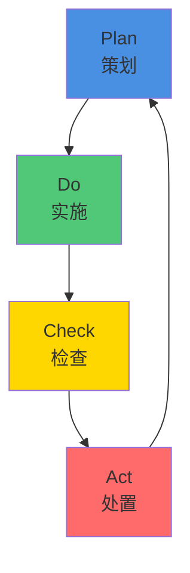
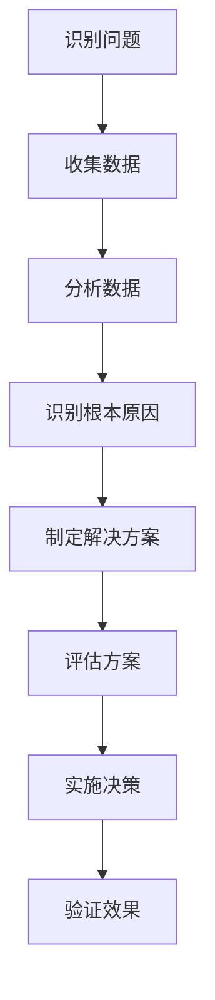
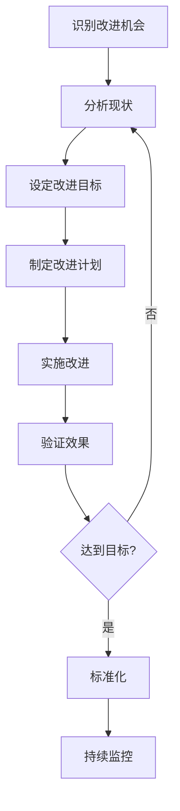

# ISO 13485 质量管理原则

## 学习目标

完成本模块后，你将能够：
- 理解ISO 13485的质量管理原则
- 掌握过程方法的应用
- 了解PDCA循环在质量管理中的作用
- 应用质量管理原则到实际工作中
- 建立有效的质量管理体系

## 前置知识

- ISO 13485标准基础知识
- 质量管理基本概念
- 医疗器械法规要求
- 组织管理基础

## 内容

### 质量管理原则概述

ISO 13485基于以下核心质量管理原则：

1. **以顾客为关注焦点**
2. **领导作用**
3. **全员参与**
4. **过程方法**
5. **持续改进**
6. **基于事实的决策方法**
7. **与供方的互利关系**

### 1. 以顾客为关注焦点

**原则说明**：
组织依存于顾客，因此应理解顾客当前和未来的需求，满足顾客要求并争取超越顾客期望。

**在医疗器械行业的应用**：
- 顾客包括：患者、医护人员、监管机构
- 理解使用环境和用户需求
- 确保产品安全性和有效性
- 及时响应顾客反馈和投诉

**实施要点**：
```
1. 识别顾客需求
   - 进行市场调研
   - 收集用户反馈
   - 分析法规要求
   
2. 转化为产品要求
   - 定义产品规格
   - 建立验收标准
   - 确定性能指标
   
3. 验证顾客满意度
   - 收集使用反馈
   - 分析投诉数据
   - 进行满意度调查
```

**说明**: 这是以顾客为关注焦点的实施步骤。从识别顾客需求开始，通过市场调研和用户反馈收集需求，然后转化为产品要求，建立验收标准和性能指标，最后通过满意度调查持续改进。


### 2. 领导作用

**原则说明**：
领导者建立组织统一的宗旨和方向，应当创造并保持使员工能够充分参与实现组织目标的内部环境。

**最高管理者职责**：
- 制定质量方针和质量目标
- 确保质量管理体系的建立和实施
- 提供必要的资源
- 进行管理评审
- 促进持续改进

**领导力体现**：


**说明**: 这是领导作用的组织结构图。展示了最高管理者如何通过制定质量方针、分配职责和权限、提供资源和进行管理评审来履行领导职责，推动质量管理体系的有效运行。


### 3. 全员参与

**原则说明**：
各级人员都是组织之本，只有他们的充分参与，才能使他们的才干为组织带来收益。

**实施方法**：
- 明确岗位职责和权限
- 提供必要的培训
- 建立激励机制
- 鼓励员工参与改进
- 建立沟通渠道

**培训体系**：
```
入职培训
├── 质量意识培训
├── 岗位技能培训
└── 法规要求培训

在职培训
├── 专业技能提升
├── 新法规/标准培训
└── 质量工具培训

持续教育
├── 外部培训
├── 内部分享
└── 经验交流
```

**说明**: 这是人员培训体系的结构。包括入职培训(质量意识、岗位技能、法规要求)、在职培训(专业技能提升、新法规标准、质量工具)和持续教育(外部培训、内部分享、自主学习)，确保人员能力持续提升。


### 4. 过程方法

**原则说明**：
将活动和相关资源作为过程进行管理，可以更高效地得到期望的结果。

**过程识别**：
```
核心过程：
- 设计和开发
- 采购
- 生产和服务提供
- 监视和测量

支持过程：
- 人力资源管理
- 基础设施管理
- 工作环境管理
- 文档和记录管理

管理过程：
- 管理评审
- 内部审核
- 纠正和预防措施
```

**过程管理要素**：
1. **输入**：过程所需的资源和信息
2. **活动**：将输入转化为输出的活动
3. **输出**：过程的结果
4. **监控**：过程的监视和测量
5. **改进**：基于监控结果的改进

**过程方法示例**：



**说明**: 这是过程方法的SIPOC图(供应商-输入-过程-输出-顾客)。展示了设计开发过程的输入(设计需求)、活动(设计开发)、输出(设计文件)、监控(设计评审)、资源(人员/工具)和验证(设计确认)之间的关系。


### 5. 持续改进

**原则说明**：
持续改进整体业绩应当是组织的一个永恒目标。

**PDCA循环**：



**PDCA在质量管理中的应用**：

**Plan（策划）**：
- 识别改进机会
- 分析现状
- 设定目标
- 制定改进计划

**Do（实施）**：
- 实施改进措施
- 收集数据
- 记录过程

**Check（检查）**：
- 监视和测量结果
- 与目标对比
- 分析偏差

**Act（处置）**：
- 标准化有效措施
- 纠正无效措施
- 识别新的改进机会

**改进工具**：
- 根本原因分析（5 Why、鱼骨图）
- 纠正和预防措施（CAPA）
- 内部审核
- 管理评审
- 数据分析

### 6. 基于事实的决策方法

**原则说明**：
有效决策是建立在数据和信息分析的基础上。

**数据收集**：
```
质量数据：
- 不合格品率
- 返工率
- 顾客投诉
- 内部审核发现

过程数据：
- 过程能力指数
- 周期时间
- 资源利用率

产品数据：
- 性能测试结果
- 可靠性数据
- 使用反馈
```

**数据分析方法**：
- 统计过程控制（SPC）
- 趋势分析
- 帕累托分析
- 相关性分析

**决策流程**：


**说明**: 这是基于证据的决策流程图。展示了从识别问题、收集数据、分析数据、识别根本原因、制定解决方案、评估方案、实施决策到验证效果的系统化决策过程，确保决策基于客观证据。


### 7. 与供方的互利关系

**原则说明**：
组织与供方是相互依存的，互利的关系可增强双方创造价值的能力。

**供方管理**：
```
供方选择：
- 建立选择标准
- 评估供方能力
- 审核供方质量体系

供方评价：
- 定期评价供方绩效
- 监控交付质量
- 评估服务水平

供方开发：
- 提供技术支持
- 共同改进质量
- 建立长期合作关系
```

**采购控制**：
- 明确采购要求
- 验证采购产品
- 保持采购记录
- 管理供方变更

## 过程方法详解

### 过程识别和定义

**过程识别步骤**：
1. 列出所有活动
2. 将相关活动组合成过程
3. 确定过程的输入和输出
4. 识别过程间的相互作用
5. 确定过程的顺序

**过程定义要素**：
```
过程名称: 设计和开发过程
过程目的: 将需求转化为产品设计
过程负责人: 研发经理
输入: 
  - 产品需求
  - 法规要求
  - 风险分析结果
活动:
  - 设计策划
  - 设计输入
  - 设计输出
  - 设计评审
  - 设计验证
  - 设计确认
  - 设计转换
输出:
  - 设计文件
  - 验证报告
  - 确认报告
监控指标:
  - 设计变更次数
  - 设计评审通过率
  - 验证一次通过率
```

**说明**: 这是过程定义的示例格式。包含过程名称、目的、负责人、输入、活动、输出、监控指标和相关文档等要素，为过程管理提供清晰的框架。


### 过程绩效监控

**关键绩效指标（KPI）**：

| 过程 | KPI | 目标 |
|------|-----|------|
| 设计开发 | 设计变更率 | <5% |
| 采购 | 供方合格率 | >95% |
| 生产 | 一次合格率 | >98% |
| 检验 | 检验及时率 | 100% |
| 投诉处理 | 投诉关闭及时率 | >90% |

**监控方法**：
- 定期收集数据
- 分析趋势
- 识别异常
- 采取纠正措施

### 过程改进

**改进触发因素**：
- 内部审核发现
- 管理评审决定
- 数据分析结果
- 顾客反馈
- 法规变更

**改进实施**：


**说明**: 这是持续改进的PDCA循环图。展示了从识别改进机会、分析现状、设定目标、制定计划、实施改进、验证效果到标准化和持续监控的完整循环，体现了持续改进的理念。


## 质量管理体系文件

### 文件层次结构

```
第一层: 质量手册
├── 质量方针
├── 质量目标
└── 体系概述

第二层: 程序文件
├── 文档控制程序
├── 记录控制程序
├── 内部审核程序
├── 纠正措施程序
└── 预防措施程序

第三层: 作业指导书
├── 操作规程
├── 检验规程
└── 维护规程

第四层: 质量记录
├── 设计记录
├── 生产记录
├── 检验记录
└── 审核记录
```

**说明**: 这是质量管理体系文档的四层结构。第一层质量手册定义方针和体系概述，第二层程序文件规定具体流程，第三层作业指导书提供操作细节，第四层记录表单记录执行证据。


### 文档控制要求

**文档批准和发布**：
- 文档发布前应经批准
- 确保文档的适宜性
- 文档应可识别和可追溯

**文档更新**：
- 必要时评审和更新文档
- 更新后重新批准
- 识别文档的更改状态

**文档分发**：
- 确保相关场所使用适用版本
- 及时撤回作废文档
- 保留作废文档用于参考

## 最佳实践

!!! tip "质量管理实施建议"
    1. **高层承诺**：确保最高管理者的承诺和参与
    2. **全员培训**：培训所有员工理解质量管理原则
    3. **过程导向**：建立清晰的过程定义和流程图
    4. **数据驱动**：建立数据收集和分析机制
    5. **持续改进**：建立PDCA文化，鼓励持续改进
    6. **文档简化**：文档应实用，避免过度文档化
    7. **定期审核**：定期进行内部审核和管理评审
    8. **风险管理**：整合ISO 14971风险管理

## 常见陷阱

!!! warning "注意事项"
    1. **形式主义**：建立体系只为通过认证，不注重实际效果
    2. **文档过载**：过度文档化，增加管理负担
    3. **缺乏承诺**：管理层缺乏承诺，体系流于形式
    4. **培训不足**：员工不理解质量管理要求
    5. **数据缺失**：缺乏数据支持决策
    6. **改进停滞**：满足于现状，缺乏持续改进
    7. **过程脱节**：过程之间缺乏有效衔接
    8. **忽视风险**：未充分整合风险管理

## 实践练习

1. 为一个医疗器械公司绘制过程相互作用图
2. 设计一个设计开发过程的KPI体系
3. 制定一个PDCA改进计划，解决产品质量问题
4. 建立一个供方评价和选择的标准

## 自测问题

??? question "问题1：ISO 13485的核心质量管理原则有哪些？"
    
    ??? success "答案"
        ISO 13485基于以下核心质量管理原则：
        
        1. **以顾客为关注焦点**：理解和满足顾客需求
        2. **领导作用**：建立统一的宗旨和方向
        3. **全员参与**：发挥各级人员的才干
        4. **过程方法**：将活动作为过程进行管理
        5. **持续改进**：永恒的组织目标
        6. **基于事实的决策方法**：基于数据和信息分析
        7. **与供方的互利关系**：增强双方创造价值的能力
        
        这些原则相互关联，共同支持质量管理体系的有效运行。

??? question "问题2：什么是过程方法？如何应用过程方法？"
    
    ??? success "答案"
        **过程方法定义**：
        将活动和相关资源作为过程进行管理，以更高效地得到期望的结果。
        
        **应用步骤**：
        1. **识别过程**：识别质量管理体系所需的过程
        2. **确定顺序**：确定过程的顺序和相互作用
        3. **定义准则**：确定过程的准则和方法
        4. **提供资源**：确保资源的可获得性
        5. **监视测量**：监视、测量和分析过程
        6. **实施改进**：实施必要的措施以实现目标
        
        **过程要素**：
        - 输入：过程所需的资源和信息
        - 活动：将输入转化为输出的活动
        - 输出：过程的结果
        - 监控：过程的监视和测量
        - 改进：基于监控结果的改进

??? question "问题3：PDCA循环是什么？如何在质量管理中应用？"
    
    ??? success "答案"
        **PDCA循环**：
        - **P (Plan)**: 策划 - 识别改进机会，制定计划
        - **D (Do)**: 实施 - 执行计划，收集数据
        - **C (Check)**: 检查 - 监视测量结果，分析偏差
        - **A (Act)**: 处置 - 标准化有效措施，纠正无效措施
        
        **应用场景**：
        1. **质量改进**：解决质量问题
        2. **过程优化**：提高过程效率
        3. **新产品开发**：从设计到量产
        4. **纠正措施**：解决不合格问题
        
        **关键点**：
        - PDCA是一个循环，不断重复
        - 每个循环都应有明确的目标
        - 基于数据和事实进行决策
        - 标准化成功的改进措施

??? question "问题4：如何建立有效的过程绩效监控？"
    
    ??? success "答案"
        **建立步骤**：
        
        1. **确定KPI**：
           - 选择关键绩效指标
           - 确保指标可测量
           - 设定目标值
        
        2. **数据收集**：
           - 建立数据收集机制
           - 确定收集频率
           - 确保数据准确性
        
        3. **数据分析**：
           - 定期分析数据
           - 识别趋势和异常
           - 与目标对比
        
        4. **采取行动**：
           - 对异常采取纠正措施
           - 对趋势采取预防措施
           - 持续改进过程
        
        5. **报告和沟通**：
           - 定期报告绩效
           - 与相关方沟通
           - 管理评审输入
        
        **监控工具**：
        - 控制图
        - 趋势图
        - 帕累托图
        - 仪表板

??? question "问题5：ISO 13485与ISO 9001有什么区别？"
    
    ??? success "答案"
        **主要区别**：
        
        1. **法规导向**：
           - ISO 13485：强调满足法规要求
           - ISO 9001：强调顾客满意
        
        2. **风险管理**：
           - ISO 13485：要求整合ISO 14971
           - ISO 9001：风险思维但不要求正式风险管理
        
        3. **文档要求**：
           - ISO 13485：更严格的文档控制
           - ISO 9001：文档要求相对灵活
        
        4. **可追溯性**：
           - ISO 13485：强制要求产品可追溯性
           - ISO 9001：根据需要建立可追溯性
        
        5. **验证和确认**：
           - ISO 13485：明确区分验证和确认
           - ISO 9001：要求相对简化
        
        6. **持续改进**：
           - ISO 13485：要求持续改进，但允许维持现状
           - ISO 9001：强调持续改进
        
        **共同点**：
        - 都基于过程方法
        - 都要求管理评审
        - 都要求内部审核
        - 都要求纠正措施

## 相关资源

- [ISO 13485 标准概述](index.md)
- [ISO 13485 审核清单](audit-checklist.md)
- [IEC 62304 软件生命周期](../iec-62304/index.md)
- [ISO 14971 风险管理](../iso-14971/index.md)

## 参考文献

1. ISO 13485:2016 - Medical devices - Quality management systems - Requirements for regulatory purposes
2. ISO 9001:2015 - Quality management systems - Requirements
3. ISO 9000:2015 - Quality management systems - Fundamentals and vocabulary
4. FDA 21 CFR Part 820 - Quality System Regulation
5. 书籍：《ISO 13485:2016 Medical Devices Quality Management Systems》by Itay Abuhav
