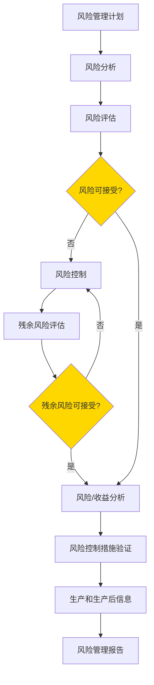

# ISO 14971 - 风险管理

## 学习目标

完成本模块后，你将能够：
- 理解ISO 14971风险管理标准的核心概念
- 掌握风险分析的方法和工具
- 学会进行风险评估和风险控制
- 了解残余风险和风险可接受性的判定
- 应用风险管理到医疗器械开发全生命周期

## 前置知识

- 医疗器械基本概念
- 产品开发流程基础
- 统计学基础知识

## 标准概述

ISO 14971是医疗器械风险管理的国际标准，全称为"Medical devices - Application of risk management to medical devices"。该标准提供了一个系统的风险管理框架，适用于医疗器械的整个生命周期。

### 风险管理的重要性

在医疗器械开发中，风险管理至关重要，因为：
- 医疗器械直接关系到患者和使用者的安全
- 法规要求（FDA、欧盟MDR等）强制要求风险管理
- 可以提前识别和控制潜在危害
- 降低产品召回和法律责任的风险
- 提高产品质量和用户信心

### 核心概念

**风险（Risk）**：危害发生的概率与该危害严重程度的组合

**危害（Hazard）**：可能造成伤害的潜在来源

**危险情况（Hazardous Situation）**：人员、财产或环境暴露于一个或多个危害的情况

**伤害（Harm）**：对人体健康的损伤或损害，包括对财产或环境的损害

**严重程度（Severity）**：伤害可能产生的后果的度量

**概率（Probability）**：危害发生的可能性的度量

## 风险管理流程



### 1. 风险管理计划

**目的**：定义风险管理活动的范围、职责和准则

**内容**：
- 风险管理活动的范围
- 职责和权限的分配
- 风险可接受性准则
- 验证活动
- 生产和生产后信息的收集和评审

**风险可接受性准则示例**：

| 严重程度 | 概率 | 风险等级 | 可接受性 |
|---------|------|---------|---------|
| 灾难性 | 频繁 | 不可接受 | 必须消除 |
| 严重 | 可能 | 不可接受 | 必须降低 |
| 中等 | 偶尔 | 可接受（有条件） | 需要降低 |
| 轻微 | 罕见 | 可接受 | 可以接受 |

### 2. 风险分析

**目的**：识别危害并估计每个危险情况的风险

#### 2.1 预期用途和可合理预见的误用

**预期用途**：
- 产品的医疗适应症
- 目标患者群体
- 使用环境（医院、家庭、急救等）
- 使用者（医生、护士、患者、家属）
- 使用频率和持续时间

**可合理预见的误用**：
- 未按说明书使用
- 使用者培训不足
- 使用环境不当
- 维护保养不当
- 与其他设备的不兼容使用

#### 2.2 危害识别

**危害类型**：

1. **能量危害**
   - 电气危害（电击、电磁干扰）
   - 机械危害（锐利边缘、运动部件）
   - 热危害（过热、低温）
   - 辐射危害（电离辐射、非电离辐射）

2. **生物和化学危害**
   - 生物污染（细菌、病毒）
   - 化学物质（毒性、过敏）
   - 生物相容性问题

3. **操作危害**
   - 不充分的标识
   - 不充分的操作说明
   - 复杂的用户界面
   - 警告和警报不充分

4. **功能危害**
   - 软件错误
   - 测量不准确
   - 输出不正确
   - 功能失效

5. **信息危害**
   - 不充分或不正确的信息
   - 误导性信息
   - 信息安全问题（数据泄露）

**危害识别方法**：
- 头脑风暴
- 检查表
- 故障树分析（FTA）
- 故障模式与影响分析（FMEA）
- 危害与可操作性分析（HAZOP）
- 历史数据分析
- 类似产品的经验

#### 2.3 风险估计

**严重程度分级示例**：

| 等级 | 描述 | 示例 |
|-----|------|------|
| 1 - 可忽略 | 不适或暂时不便 | 轻微皮肤刺激 |
| 2 - 轻微 | 暂时性伤害，无需医疗干预 | 轻微擦伤 |
| 3 - 严重 | 需要医疗干预的伤害 | 骨折、烧伤 |
| 4 - 危急 | 永久性伤害或威胁生命 | 器官损伤 |
| 5 - 灾难性 | 死亡 | 患者死亡 |

**概率分级示例**：

| 等级 | 描述 | 定量范围 |
|-----|------|---------|
| A - 频繁 | 预期会发生 | > 10^-3 |
| B - 可能 | 可能会发生 | 10^-3 ~ 10^-4 |
| C - 偶尔 | 可能发生但不常见 | 10^-4 ~ 10^-5 |
| D - 罕见 | 不太可能发生 | 10^-5 ~ 10^-6 |
| E - 不可能 | 几乎不可能发生 | < 10^-6 |

**风险矩阵示例**：

```
严重程度 →
概率 ↓     可忽略  轻微   严重   危急   灾难性
频繁        中     高     高     极高   极高
可能        低     中     高     高     极高
偶尔        低     低     中     高     高
罕见        低     低     中     中     高
不可能      低     低     低     中     中
```

**说明**: 这是风险矩阵示例，用于评估风险等级。横轴表示严重程度(从可忽略到灾难性)，纵轴表示发生概率(从不可能到频繁)。通过两者的组合确定风险等级(低、中、高、极高)，指导风险控制决策。


### 3. 风险评估

**目的**：判定风险是否可接受

**评估准则**：
- 与风险可接受性准则比较
- 考虑法规要求
- 考虑行业标准
- 考虑最新技术水平

**决策**：
- 风险可接受：无需进一步风险控制
- 风险不可接受：必须实施风险控制措施

### 4. 风险控制

**目的**：降低风险到可接受水平

#### 风险控制措施的优先级

1. **固有安全设计**（最优先）
   - 消除危害
   - 降低危害发生的概率或严重程度
   - 示例：使用低电压、添加机械限位、冗余设计

2. **保护措施**
   - 在医疗器械中或上添加保护措施
   - 示例：保险丝、接地、警报系统、互锁装置

3. **使用信息**（最后手段）
   - 提供安全信息
   - 示例：警告标签、使用说明、培训

#### 风险控制措施示例

**软件相关的风险控制**：
- 输入验证和范围检查
- 错误处理和异常管理
- 看门狗定时器
- 自检和诊断功能
- 软件冗余和多样性
- 形式化方法和静态分析

**硬件相关的风险控制**：
- 故障安全设计
- 冗余系统
- 限流和过压保护
- 温度监控和保护
- 机械限位和互锁

**使用相关的风险控制**：
- 清晰的用户界面
- 错误预防设计
- 警告和警报
- 培训材料
- 维护说明

### 5. 残余风险评估

**残余风险**：实施风险控制措施后仍然存在的风险

**评估内容**：
- 风险控制措施的有效性
- 风险控制措施是否引入新的危害
- 残余风险是否可接受

**新危害的识别**：
- 风险控制措施本身可能引入新的危害
- 示例：添加警报可能导致警报疲劳；添加保护罩可能影响散热

### 6. 风险/收益分析

**目的**：评估医疗收益是否超过残余风险

**考虑因素**：
- 医疗收益的大小
- 残余风险的严重程度
- 替代治疗方案的风险
- 患者群体的特征

**决策**：
- 收益大于风险：可以接受
- 收益小于风险：不可接受，需要重新设计或放弃

### 7. 风险控制措施的验证

**目的**：确认风险控制措施已正确实施并有效

**验证方法**：
- 测试
- 检查
- 分析
- 审查

**验证内容**：
- 风险控制措施已实施
- 风险控制措施有效
- 未引入新的不可接受风险

### 8. 生产和生产后信息

**目的**：收集和评审生产和生产后信息，识别新的危害或危险情况

**信息来源**：
- 客户投诉
- 不良事件报告
- 维修和服务记录
- 文献和行业信息
- 类似产品的信息

**评审频率**：
- 定期评审（如每季度、每年）
- 重大事件后立即评审

**评审输出**：
- 识别新的危害
- 更新风险分析
- 实施额外的风险控制措施
- 更新风险管理文件

### 9. 风险管理报告

**目的**：总结风险管理活动并提供证据

**内容**：
- 风险管理计划的执行情况
- 识别的危害和危险情况
- 风险评估结果
- 实施的风险控制措施
- 残余风险的可接受性
- 风险/收益分析结论
- 生产和生产后信息的评审

## 风险分析工具

### 1. 故障模式与影响分析（FMEA）

**定义**：系统地识别产品或过程中的潜在故障模式及其影响

**FMEA表格示例**：

| 功能 | 故障模式 | 故障影响 | 严重程度(S) | 故障原因 | 概率(O) | 现有控制 | 检测度(D) | RPN | 建议措施 |
|-----|---------|---------|-----------|---------|--------|---------|---------|-----|---------|
| 血压测量 | 传感器失效 | 测量不准确 | 8 | 传感器老化 | 3 | 定期校准 | 4 | 96 | 添加自检功能 |

**RPN（风险优先数）= S × O × D**

**优点**：
- 系统化方法
- 易于理解和使用
- 可以量化风险

**缺点**：
- 可能遗漏复杂的故障组合
- RPN计算可能不够准确

### 2. 故障树分析（FTA）

**定义**：从顶层事件（不希望发生的事件）开始，逐层分析导致该事件的原因

**故障树示例**：

```
        患者受伤
           |
    ┌──────┴──────┐
    |             |
 过量给药      给药不足
    |             |
┌───┴───┐     ┌───┴───┐
|       |     |       |
软件错误 硬件故障 传感器失效 操作错误
```

**优点**：
- 可以分析复杂的因果关系
- 可以进行定量分析
- 可视化效果好

**缺点**：
- 构建复杂
- 需要专业知识

### 3. 危害与可操作性分析（HAZOP）

**定义**：使用引导词系统地识别偏离设计意图的情况

**引导词**：
- 无（No）
- 更多（More）
- 更少（Less）
- 以及（As well as）
- 部分（Part of）
- 反向（Reverse）
- 其他（Other than）

**HAZOP表格示例**：

| 参数 | 引导词 | 偏差 | 原因 | 后果 | 保护措施 | 建议 |
|-----|-------|------|------|------|---------|------|
| 温度 | 更多 | 温度过高 | 加热器故障 | 组织损伤 | 温度传感器+警报 | 添加硬件限温器 |

## 软件风险管理

软件在医疗器械中的作用越来越重要，软件风险管理需要特别关注：

### 软件特有的危害

1. **逻辑错误**
   - 算法错误
   - 边界条件处理错误
   - 并发问题

2. **数据错误**
   - 数据损坏
   - 数据丢失
   - 数据类型错误

3. **接口错误**
   - 硬件接口错误
   - 软件接口错误
   - 用户接口错误

4. **时序错误**
   - 超时
   - 竞态条件
   - 死锁

### 软件风险控制措施

1. **设计措施**
   - 防御性编程
   - 输入验证
   - 错误处理
   - 冗余和多样性

2. **验证措施**
   - 单元测试
   - 集成测试
   - 系统测试
   - 代码审查
   - 静态分析

3. **文档措施**
   - 清晰的需求规格
   - 详细的设计文档
   - 完整的测试文档

## 最佳实践

!!! tip "风险管理建议"
    1. **早期开始**：在设计阶段就开始风险管理
    2. **持续进行**：风险管理贯穿整个生命周期
    3. **跨职能团队**：包括工程、质量、临床、法规等
    4. **文档化**：所有风险管理活动都应有记录
    5. **可追溯性**：建立风险到需求、设计、测试的追溯
    6. **定期评审**：定期评审和更新风险分析
    7. **学习改进**：从生产后信息中学习并改进

## 常见陷阱

!!! warning "注意事项"
    1. **危害识别不充分**：遗漏重要危害
    2. **风险估计不准确**：过高或过低估计风险
    3. **风险控制措施无效**：措施未能有效降低风险
    4. **忽视残余风险**：未充分评估残余风险
    5. **文档不完整**：缺少关键的风险管理记录
    6. **生产后信息未评审**：未及时评审和响应生产后信息
    7. **风险/收益分析不充分**：未充分考虑医疗收益

## 实践练习

1. 为一个血糖仪进行危害识别，列出至少10个潜在危害
2. 使用FMEA方法分析输液泵的故障模式
3. 为一个软件功能（如剂量计算）构建故障树
4. 设计风险控制措施，将一个高风险降低到可接受水平

## 自测问题

??? question "问题1：风险的定义是什么？如何计算风险？"
    
    ??? success "答案"
        **风险的定义**：危害发生的概率与该危害严重程度的组合
        
        **风险计算**：
        - 定性方法：使用风险矩阵，将概率和严重程度组合得到风险等级
        - 定量方法：风险 = 概率 × 严重程度
        
        示例：
        - 严重程度：4（危急）
        - 概率：10^-4（可能）
        - 风险 = 4 × 10^-4 = 0.0004
        
        或使用风险矩阵：严重程度"危急" + 概率"可能" = 风险等级"高"

??? question "问题2：风险控制措施的三个优先级是什么？为什么要按这个顺序？"
    
    ??? success "答案"
        **三个优先级**：
        1. **固有安全设计**：消除或降低危害
        2. **保护措施**：添加保护装置
        3. **使用信息**：提供警告和说明
        
        **原因**：
        1. 固有安全设计最可靠，从根本上消除危害，不依赖于用户行为或设备功能
        2. 保护措施可以降低风险，但可能失效，需要维护
        3. 使用信息最不可靠，依赖于用户阅读、理解和遵守，容易被忽视
        
        示例：
        - 固有安全：使用低电压（24V而不是220V）
        - 保护措施：添加保险丝和接地
        - 使用信息：标注"小心触电"警告

??? question "问题3：什么是残余风险？如何处理残余风险？"
    
    ??? success "答案"
        **残余风险**：实施风险控制措施后仍然存在的风险
        
        **处理方法**：
        1. **评估可接受性**：
           - 与风险可接受性准则比较
           - 如果可接受，进行风险/收益分析
           - 如果不可接受，实施额外的风险控制措施
        
        2. **风险/收益分析**：
           - 评估医疗收益是否超过残余风险
           - 考虑替代治疗方案
           - 考虑目标患者群体
        
        3. **告知用户**：
           - 在使用说明中披露残余风险
           - 提供风险缓解建议
           - 提供培训
        
        4. **持续监控**：
           - 收集生产后信息
           - 定期评审残余风险
           - 必要时采取额外措施

??? question "问题4：FMEA中的RPN是什么？如何使用RPN？"
    
    ??? success "答案"
        **RPN（Risk Priority Number，风险优先数）**：
        - 计算公式：RPN = S × O × D
        - S（Severity）：严重程度（1-10）
        - O（Occurrence）：发生概率（1-10）
        - D（Detection）：检测度（1-10，10表示最难检测）
        
        **使用方法**：
        1. 计算每个故障模式的RPN
        2. 按RPN从高到低排序
        3. 优先处理高RPN的故障模式
        4. 实施风险控制措施后重新计算RPN
        5. 验证RPN是否降低到可接受水平
        
        **注意事项**：
        - RPN只是一个参考指标，不能完全依赖
        - 即使RPN较低，严重程度高的故障也应重点关注
        - 不同的S、O、D组合可能得到相同的RPN，但风险性质不同
        
        示例：
        - 故障1：S=9, O=2, D=3, RPN=54（严重但罕见）
        - 故障2：S=3, O=6, D=3, RPN=54（轻微但常见）
        - 虽然RPN相同，但应优先处理故障1

??? question "问题5：生产和生产后信息在风险管理中的作用是什么？"
    
    ??? success "答案"
        **作用**：
        1. **识别新的危害**：
           - 实际使用中发现的未预见的危害
           - 新的使用场景和误用模式
        
        2. **验证风险控制措施的有效性**：
           - 确认风险控制措施在实际使用中有效
           - 识别风险控制措施的不足
        
        3. **更新风险分析**：
           - 根据实际数据更新概率估计
           - 根据实际事件更新严重程度评估
        
        4. **持续改进**：
           - 改进产品设计
           - 改进使用说明
           - 改进培训材料
        
        **信息来源**：
        - 客户投诉
        - 不良事件报告
        - 维修和服务记录
        - 文献和行业信息
        - 监管机构的警告和召回信息
        
        **评审频率**：
        - 定期评审（如每季度、每年）
        - 重大事件后立即评审
        - 产品变更前评审

??? question "问题6：软件风险管理有什么特殊性？"
    
    ??? success "答案"
        **软件的特殊性**：
        1. **无磨损失效**：软件不会因使用而磨损，但可能有潜在缺陷
        2. **复杂性**：软件逻辑复杂，难以完全测试
        3. **不可见性**：软件运行过程不可见，难以观察
        4. **易变性**：软件容易修改，但修改可能引入新问题
        
        **特殊的风险管理要求**：
        1. **软件安全分类**：根据IEC 62304进行分类（Class A/B/C）
        2. **软件验证**：
           - 单元测试
           - 集成测试
           - 系统测试
           - 代码审查
           - 静态分析
        3. **软件确认**：在实际或模拟使用条件下验证
        4. **SOUP管理**：评估和控制第三方软件的风险
        5. **变更控制**：严格的软件变更管理流程
        6. **可追溯性**：从需求到测试的完整追溯
        
        **软件特有的风险控制措施**：
        - 防御性编程
        - 输入验证和范围检查
        - 错误处理和异常管理
        - 看门狗定时器
        - 软件冗余和多样性
        - 形式化方法

## 相关资源

- [IEC 62304 - 软件生命周期](../iec-62304/index.md)
- [ISO 13485 - 质量管理体系](../iso-13485/index.md)

## 参考文献

1. ISO 14971:2019 - Medical devices - Application of risk management to medical devices
2. IEC/TR 80002-1:2009 - Medical device software - Part 1: Guidance on the application of ISO 14971 to medical device software
3. FDA Guidance: "Applying Human Factors and Usability Engineering to Medical Devices"
4. ISO/IEC Guide 51:2014 - Safety aspects - Guidelines for their inclusion in standards
5. 书籍：《Risk Management for Medical Devices》by Faisal Amin


## 内容模块

- [ISO 14971 风险分析](risk-analysis.md)
- [ISO 14971 风险评估](risk-evaluation.md)
- [ISO 14971 风险控制](risk-control.md)
- [风险管理文件模板](risk-management-templates.md)
- [FMEA/FMECA详细指南](fmea-guide.md)
- [故障树分析(FTA)](fault-tree-analysis.md)
- [风险可追溯矩阵示例](risk-traceability-matrix.md)
