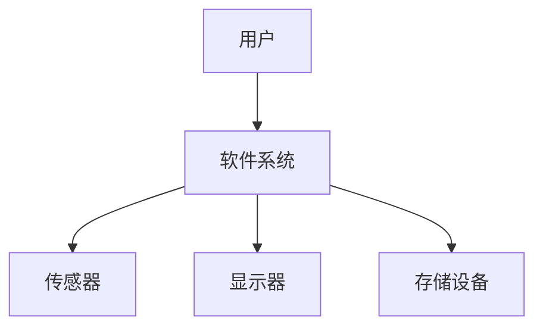
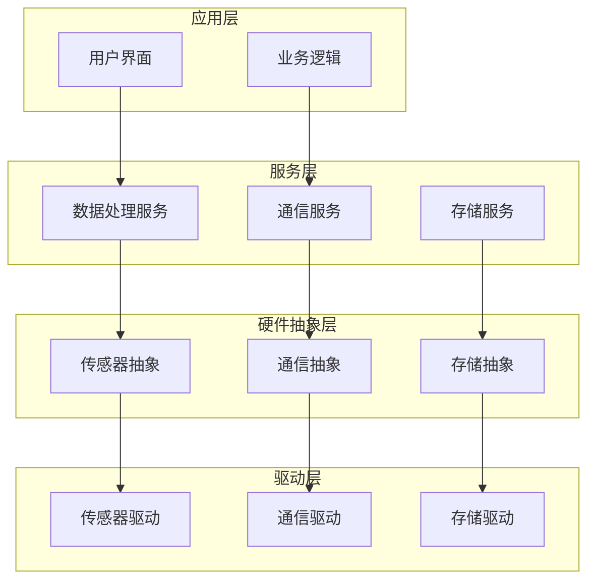
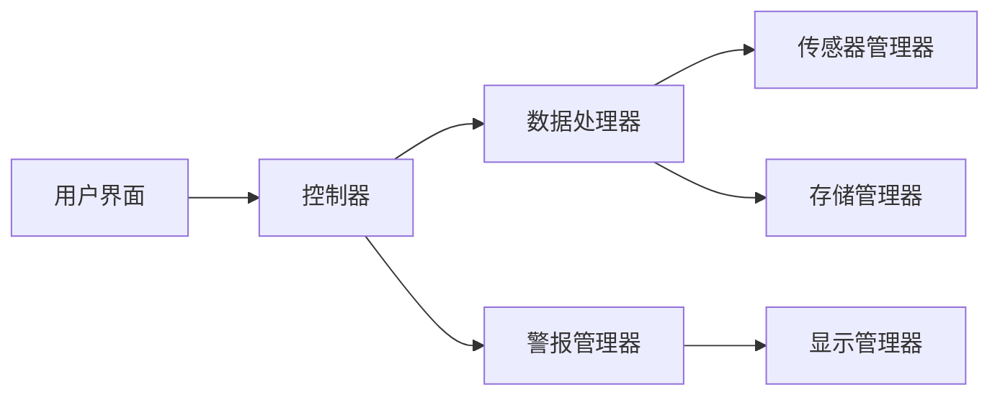
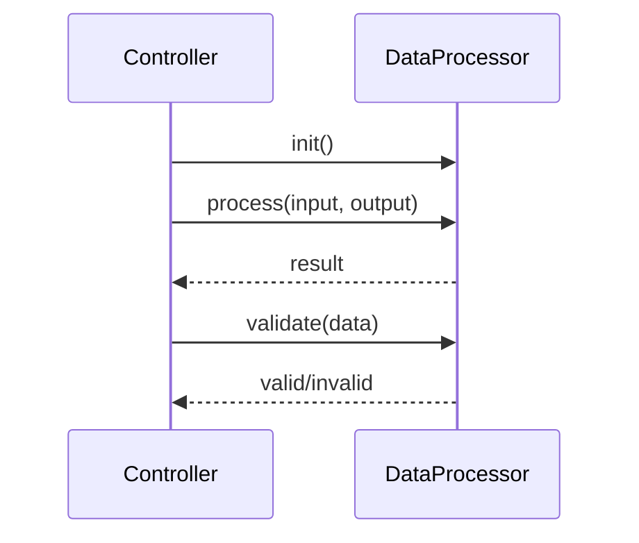
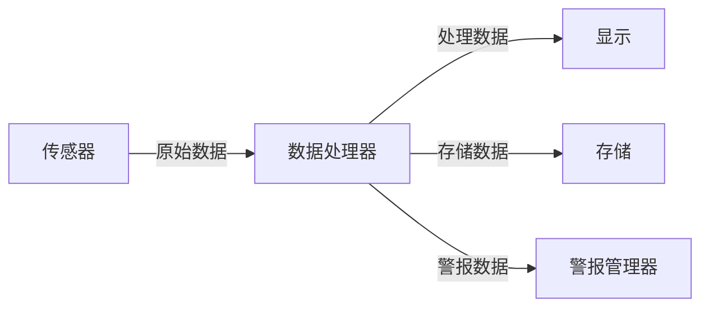
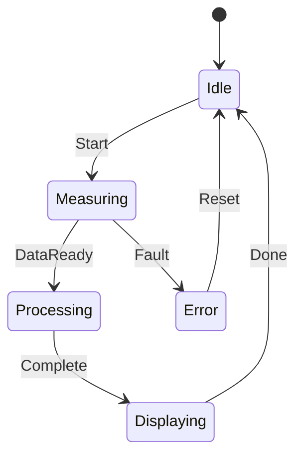
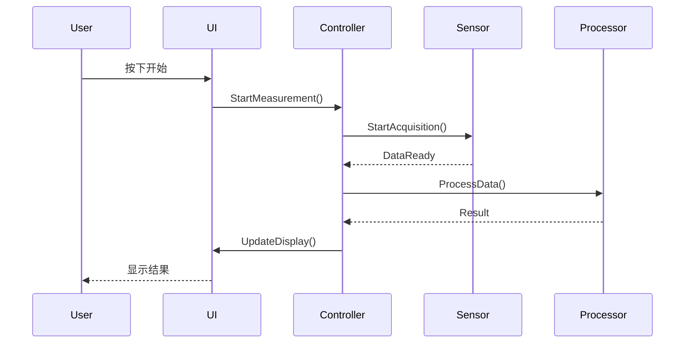
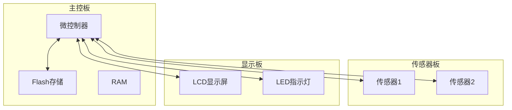

# 架构文档模板

## 学习目标

完成本模块后，你将能够：
- 理解架构文档的结构和内容要求
- 使用标准模板编写架构文档
- 确保文档满足IEC 62304要求
- 编写清晰、完整的架构文档

## 前置知识

- 软件架构设计基础
- IEC 62304标准要求
- 技术文档编写基础

## 内容

### 文档模板

以下是符合IEC 62304要求的软件架构设计规格说明书模板：

---

# 软件架构设计规格说明书
## [项目名称]

**文档信息**

| 项目 | 内容 |
|------|------|
| 文档编号 | SAS-[项目代号]-001 |
| 版本 | 1.0 |
| 日期 | YYYY-MM-DD |
| 作者 | [姓名] |
| 审核者 | [姓名] |
| 批准者 | [姓名] |
| 软件安全分类 | □ A类 □ B类 □ C类 |

**修订历史**

| 版本 | 日期 | 作者 | 修订说明 |
|------|------|------|----------|
| 0.1 | YYYY-MM-DD | [姓名] | 初稿 |
| 1.0 | YYYY-MM-DD | [姓名] | 正式版本 |

---

## 1. 引言

### 1.1 目的

本文档描述[项目名称]的软件架构设计，包括：
- 系统的高层结构
- 主要组件及其职责
- 组件间的接口和交互
- 关键设计决策

本文档旨在：
- 为开发团队提供架构指导
- 为评审和验证提供依据
- 满足IEC 62304标准要求

### 1.2 范围

本文档涵盖[项目名称]软件系统的架构设计，包括：
- [列出包含的模块/子系统]
- [列出包含的功能]

不包括：
- [列出不包含的内容]

### 1.3 术语和缩写

| 术语/缩写 | 定义 |
|-----------|------|
| HAL | Hardware Abstraction Layer (硬件抽象层) |
| API | Application Programming Interface (应用程序接口) |
| [其他术语] | [定义] |

### 1.4 参考文档

1. [项目名称] 软件需求规格说明书, [文档编号], [版本]
2. [项目名称] 风险管理文件, [文档编号], [版本]
3. IEC 62304:2006+AMD1:2015 - Medical device software - Software life cycle processes
4. [其他参考文档]

---

## 2. 架构概述

### 2.1 系统概述

[简要描述系统的目的、主要功能和特点]

**系统上下文图**：



### 2.2 架构目标

本架构设计旨在实现以下目标：

1. **功能性**：满足所有功能需求
2. **性能**：[具体性能目标]
3. **可靠性**：[具体可靠性目标]
4. **安全性**：[具体安全性目标]
5. **可维护性**：模块化、文档化
6. **可测试性**：支持单元测试和集成测试
7. **合规性**：符合IEC 62304要求

### 2.3 架构约束

**技术约束**：
- 处理器：[型号和规格]
- 内存：[RAM大小]
- 存储：[Flash大小]
- 操作系统：[RTOS或裸机]

**法规约束**：
- IEC 62304软件安全分类：[A/B/C类]
- IEC 60601-1电气安全要求
- [其他法规要求]

**项目约束**：
- 开发时间：[时间]
- 开发资源：[人员]
- 成本预算：[预算]

---

## 3. 架构设计

### 3.1 架构风格

本系统采用**分层架构**模式，具有以下特点：
- 清晰的层次划分
- 单向依赖（上层依赖下层）
- 每层职责明确
- 支持独立测试和维护

### 3.2 系统分层



**层次说明**：

| 层次 | 职责 | 主要组件 |
|------|------|----------|
| 应用层 | 用户交互、业务流程控制 | UI模块、控制器 |
| 服务层 | 业务逻辑、数据处理 | 算法模块、服务模块 |
| 硬件抽象层 | 硬件接口抽象 | HAL接口 |
| 驱动层 | 硬件直接控制 | 设备驱动 |

### 3.3 组件视图

**主要组件**：



**组件描述**：

#### 3.3.1 用户界面组件

**职责**：
- 显示系统状态和数据
- 接收用户输入
- 提供用户交互界面

**接口**：
- `void UI_Init(void)`
- `void UI_Update(const DisplayData_t* data)`
- `UserInput_t UI_GetInput(void)`

**依赖**：
- 控制器组件
- 显示管理器

#### 3.3.2 控制器组件

**职责**：
- 协调各组件工作
- 处理用户输入
- 实现业务流程

**接口**：
- `void Controller_Init(void)`
- `void Controller_HandleInput(UserInput_t input)`
- `void Controller_Process(void)`

**依赖**：
- 数据处理器
- 警报管理器

#### 3.3.3 数据处理器组件

**职责**：
- 处理传感器数据
- 执行算法
- 数据验证

**接口**：
- `void DataProcessor_Init(void)`
- `int DataProcessor_Process(const uint8_t* input, uint8_t* output)`
- `bool DataProcessor_Validate(const uint8_t* data)`

**依赖**：
- 传感器管理器
- 存储管理器

[继续描述其他组件...]

---

## 4. 接口设计

### 4.1 模块间接口

#### 4.1.1 控制器 ↔ 数据处理器接口

**接口名称**：IDataProcessor

**接口定义**：
```c
typedef struct {
    int (*init)(void);
    int (*process)(const uint8_t* input, uint16_t input_size,
                  uint8_t* output, uint16_t* output_size);
    int (*validate)(const uint8_t* data, uint16_t size);
} IDataProcessor_t;
```

**数据流**：
- 输入：原始传感器数据
- 输出：处理后的数据
- 错误：错误码

**调用序列**：


[继续描述其他接口...]

### 4.2 硬件接口

#### 4.2.1 传感器接口

**接口类型**：I2C

**硬件连接**：
- SCL: GPIO_PIN_X
- SDA: GPIO_PIN_Y
- INT: GPIO_PIN_Z

**通信协议**：
- 速率：400kHz
- 地址：0x48
- 数据格式：[描述]

**接口定义**：
```c
typedef struct {
    int (*init)(void);
    int (*read)(uint8_t* buffer, uint16_t length);
    int (*write)(const uint8_t* data, uint16_t length);
} ISensor_t;
```

[继续描述其他硬件接口...]

### 4.3 用户接口

**界面布局**：
```
┌─────────────────────────────┐
│  [项目名称]                  │
├─────────────────────────────┤
│  测量值: XXX.X              │
│  状态: [正常/警报]          │
│  时间: HH:MM:SS             │
├─────────────────────────────┤
│  [开始] [停止] [设置]       │
└─────────────────────────────┘
```

**交互流程**：
1. 用户按下"开始"按钮
2. 系统开始测量
3. 显示实时数据
4. 用户按下"停止"按钮
5. 系统停止测量

---

## 5. 数据设计

### 5.1 数据结构

#### 5.1.1 传感器数据结构

```c
typedef struct {
    uint16_t value;           // 测量值
    uint32_t timestamp;       // 时间戳
    uint8_t quality;          // 数据质量指标
    bool valid;               // 数据有效性
} SensorData_t;
```

#### 5.1.2 配置数据结构

```c
typedef struct {
    uint16_t sample_rate;     // 采样率
    uint8_t filter_type;      // 滤波器类型
    uint16_t alarm_threshold; // 警报阈值
} SystemConfig_t;
```

### 5.2 数据流



### 5.3 数据存储

**存储位置**：Flash存储器

**数据组织**：
- 配置数据：地址0x0000-0x0FFF
- 测量数据：地址0x1000-0xFFFF

**数据格式**：
```
[Header][Data][CRC]
```

---

## 6. 动态行为

### 6.1 状态机

**系统状态机**：



**状态说明**：

| 状态 | 描述 | 进入条件 | 退出条件 |
|------|------|----------|----------|
| Idle | 空闲状态 | 系统启动/测量完成 | 用户按下开始 |
| Measuring | 测量中 | 用户按下开始 | 数据就绪/故障 |
| Processing | 处理中 | 数据就绪 | 处理完成 |
| Displaying | 显示中 | 处理完成 | 显示完成 |
| Error | 错误状态 | 发生故障 | 用户复位 |

### 6.2 时序图

**测量流程时序图**：



---

## 7. 部署视图

### 7.1 硬件部署



### 7.2 软件部署

**内存分配**：

| 区域 | 大小 | 用途 |
|------|------|------|
| 代码段 | 128KB | 程序代码 |
| 常量段 | 32KB | 常量数据 |
| 数据段 | 16KB | 全局变量 |
| 堆 | 32KB | 动态分配 |
| 栈 | 8KB | 函数调用栈 |

**Flash分区**：

| 分区 | 地址范围 | 大小 | 用途 |
|------|----------|------|------|
| Bootloader | 0x0000-0x3FFF | 16KB | 引导程序 |
| Application | 0x4000-0x3FFFF | 240KB | 应用程序 |
| Configuration | 0x40000-0x40FFF | 4KB | 配置数据 |
| Data | 0x41000-0x7FFFF | 252KB | 测量数据 |

---

## 8. 设计决策

### 8.1 架构模式选择

**决策**：采用分层架构模式

**理由**：
1. 清晰的职责划分
2. 易于维护和测试
3. 支持硬件移植
4. 符合医疗器械软件开发最佳实践

**替代方案**：
- 微服务架构：过于复杂，不适合嵌入式系统
- 单体架构：耦合度高，难以维护

**权衡**：
- 优点：可维护性、可测试性
- 缺点：可能有性能开销

### 8.2 通信机制选择

**决策**：模块间使用直接函数调用

**理由**：
1. 性能高
2. 实现简单
3. 调试方便

**替代方案**：
- 消息队列：增加复杂度
- 事件驱动：适合异步场景

### 8.3 数据存储方案

**决策**：使用Flash存储

**理由**：
1. 非易失性存储
2. 成本低
3. 容量足够

**替代方案**：
- EEPROM：容量小
- SD卡：增加硬件成本

---

## 9. 质量属性

### 9.1 性能

**目标**：
- 测量响应时间 < 100ms
- 数据处理延迟 < 50ms
- 显示更新频率 > 10Hz

**策略**：
- 使用DMA减少CPU占用
- 优化算法实现
- 使用双缓冲技术

### 9.2 可靠性

**目标**：
- 系统可用性 > 99.9%
- MTBF > 10000小时

**策略**：
- 看门狗机制
- 错误检测和恢复
- 数据校验（CRC）
- 冗余设计

### 9.3 安全性

**目标**：
- 防止未授权访问
- 数据完整性保护

**策略**：
- 访问控制
- 数据加密（如需要）
- 审计日志

### 9.4 可维护性

**目标**：
- 代码可读性高
- 模块化程度高
- 文档完整

**策略**：
- 遵循编码规范
- 充分注释
- 完整文档

---

## 10. 风险控制措施

### 10.1 风险追溯

| 风险ID | 风险描述 | 架构控制措施 | 组件 |
|--------|----------|--------------|------|
| RISK-001 | 传感器故障 | 故障检测和警报 | SensorMonitor |
| RISK-002 | 数据错误 | 数据验证 | DataValidator |
| RISK-003 | 系统死机 | 看门狗 | WatchdogManager |

### 10.2 安全功能

**关键安全功能**：
1. 传感器故障检测
2. 数据范围检查
3. 警报功能
4. 安全状态切换

**隔离措施**：
- 安全功能独立模块
- 关键数据保护
- 故障隔离

---

## 11. 追溯性

### 11.1 需求到架构追溯

| 需求ID | 需求描述 | 架构组件 | 接口 |
|--------|----------|----------|------|
| REQ-001 | 心率监测 | SensorManager, DataProcessor | ISensor, IProcessor |
| REQ-002 | 数据显示 | DisplayManager, UI | IDisplay |
| REQ-003 | 数据存储 | StorageManager | IStorage |
| REQ-004 | 警报功能 | AlarmManager | IAlarm |

### 11.2 架构到测试追溯

| 组件 | 单元测试 | 集成测试 | 系统测试 |
|------|----------|----------|----------|
| SensorManager | UT-SM-001 | IT-SM-001 | ST-001 |
| DataProcessor | UT-DP-001 | IT-DP-001 | ST-002 |
| DisplayManager | UT-DM-001 | IT-DM-001 | ST-003 |

---

## 12. 附录

### 12.1 术语表

| 术语 | 定义 |
|------|------|
| HAL | Hardware Abstraction Layer |
| DMA | Direct Memory Access |
| CRC | Cyclic Redundancy Check |

### 12.2 参考代码

[包含关键接口的示例代码]

### 12.3 图表索引

[列出所有图表及其页码]

---

**文档结束**

