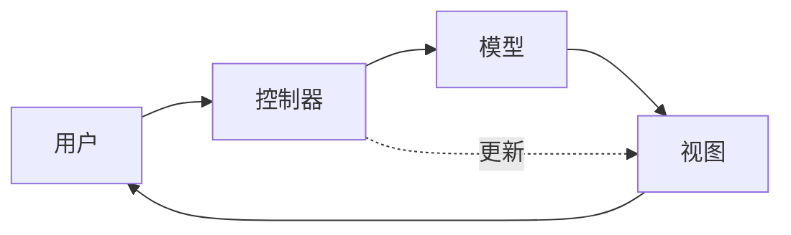
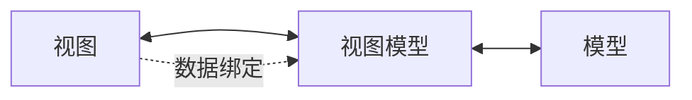
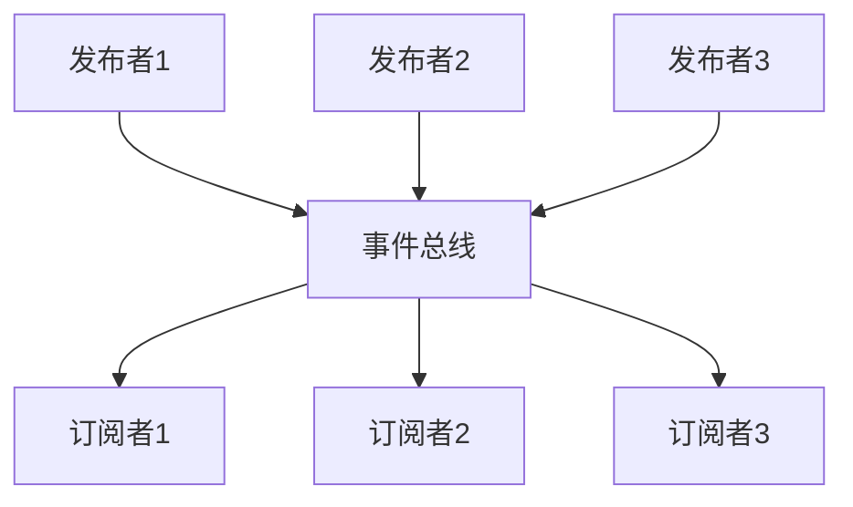
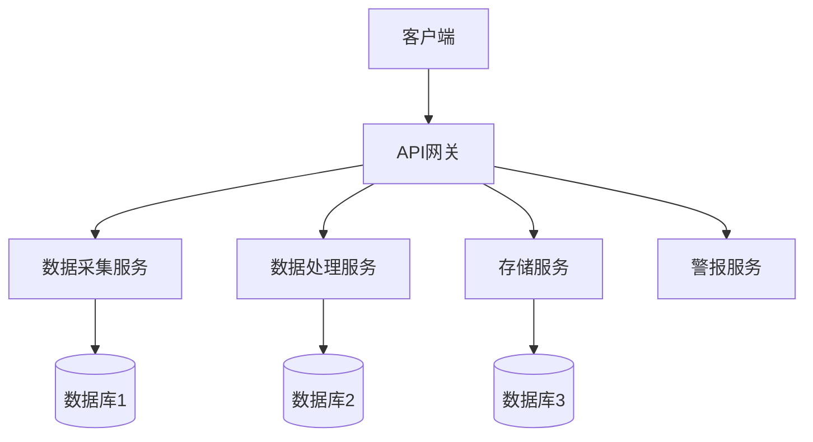
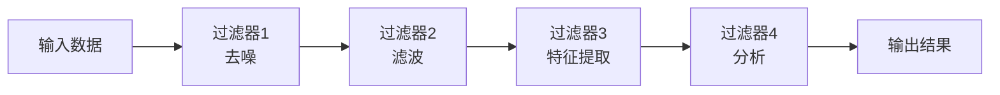

# 架构模式详解

## 学习目标

完成本模块后，你将能够：
- 理解常见架构模式的原理和特点
- 掌握MVC、MVVM、事件驱动等模式的应用
- 根据项目需求选择合适的架构模式
- 在医疗器械软件中正确实现架构模式
- 理解不同模式的优缺点和适用场景

## 前置知识

- 软件架构设计基础
- 面向对象设计原则
- C/C++编程经验
- 设计模式基础

## 内容

### 架构模式概述

架构模式（Architectural Pattern）是软件架构设计中反复出现的问题的通用解决方案。它提供了一套经过验证的设计结构，帮助开发者构建高质量的软件系统。

**架构模式 vs 设计模式**：
- **架构模式**：关注整个系统的结构和组织
- **设计模式**：关注特定问题的代码级解决方案


### 1. MVC模式（Model-View-Controller）

#### 概述

MVC是一种将应用程序分为三个核心组件的架构模式：
- **Model（模型）**：管理数据和业务逻辑
- **View（视图）**：负责数据的展示
- **Controller（控制器）**：处理用户输入，协调Model和View

#### 架构图



#### 工作流程

1. 用户通过View进行操作
2. Controller接收用户输入
3. Controller更新Model
4. Model通知View数据已变更
5. View从Model获取新数据并更新显示

#### C语言实现示例

```c
// model.h - 模型层
#ifndef MODEL_H
#define MODEL_H

#include <stdint.h>
#include <stdbool.h>

// 数据模型
typedef struct {
    float temperature;
    float heart_rate;
    uint32_t timestamp;
    bool valid;
} MedicalData_t;

// 模型观察者回调
typedef void (*ModelObserver_t)(const MedicalData_t* data);

// 模型接口
typedef struct {
    void (*init)(void);
    bool (*set_temperature)(float temp);
    bool (*set_heart_rate)(float hr);
    const MedicalData_t* (*get_data)(void);
    void (*register_observer)(ModelObserver_t observer);
    void (*unregister_observer)(ModelObserver_t observer);
} Model_t;

const Model_t* get_model(void);

#endif // MODEL_H
```

```c
// model.c
#include "model.h"
#include <string.h>
#include <time.h>

#define MAX_OBSERVERS 5

static MedicalData_t current_data = {0};
static ModelObserver_t observers[MAX_OBSERVERS] = {NULL};
static uint8_t observer_count = 0;

static void notify_observers(void) {
    for (uint8_t i = 0; i < observer_count; i++) {
        if (observers[i] != NULL) {
            observers[i](&current_data);
        }
    }
}

static void model_init(void) {
    memset(&current_data, 0, sizeof(current_data));
    observer_count = 0;
}

static bool model_set_temperature(float temp) {
    if (temp < 35.0f || temp > 42.0f) {
        return false;  // 温度范围验证
    }
    current_data.temperature = temp;
    current_data.timestamp = (uint32_t)time(NULL);
    current_data.valid = true;
    notify_observers();
    return true;
}

static bool model_set_heart_rate(float hr) {
    if (hr < 40.0f || hr > 200.0f) {
        return false;  // 心率范围验证
    }
    current_data.heart_rate = hr;
    current_data.timestamp = (uint32_t)time(NULL);
    current_data.valid = true;
    notify_observers();
    return true;
}

static const MedicalData_t* model_get_data(void) {
    return &current_data;
}

static void model_register_observer(ModelObserver_t observer) {
    if (observer_count < MAX_OBSERVERS) {
        observers[observer_count++] = observer;
    }
}

static void model_unregister_observer(ModelObserver_t observer) {
    for (uint8_t i = 0; i < observer_count; i++) {
        if (observers[i] == observer) {
            // 移除观察者
            for (uint8_t j = i; j < observer_count - 1; j++) {
                observers[j] = observers[j + 1];
            }
            observer_count--;
            break;
        }
    }
}

static const Model_t model = {
    .init = model_init,
    .set_temperature = model_set_temperature,
    .set_heart_rate = model_set_heart_rate,
    .get_data = model_get_data,
    .register_observer = model_register_observer,
    .unregister_observer = model_unregister_observer
};

const Model_t* get_model(void) {
    return &model;
}
```

```c
// view.h - 视图层
#ifndef VIEW_H
#define VIEW_H

#include "model.h"

typedef struct {
    void (*init)(void);
    void (*update)(const MedicalData_t* data);
    void (*display_error)(const char* message);
} View_t;

const View_t* get_view(void);

#endif // VIEW_H
```

```c
// view.c
#include "view.h"
#include <stdio.h>

static void view_init(void) {
    printf("=== Medical Monitor View ===\n");
}

static void view_update(const MedicalData_t* data) {
    if (data == NULL || !data->valid) {
        printf("No valid data\n");
        return;
    }
    
    printf("\n--- Medical Data Update ---\n");
    printf("Temperature: %.1f °C\n", data->temperature);
    printf("Heart Rate:  %.0f bpm\n", data->heart_rate);
    printf("Timestamp:   %u\n", data->timestamp);
    printf("---------------------------\n");
}

static void view_display_error(const char* message) {
    printf("ERROR: %s\n", message);
}

static const View_t view = {
    .init = view_init,
    .update = view_update,
    .display_error = view_display_error
};

const View_t* get_view(void) {
    return &view;
}
```

```c
// controller.h - 控制器层
#ifndef CONTROLLER_H
#define CONTROLLER_H

#include <stdint.h>

typedef struct {
    void (*init)(void);
    void (*handle_temperature_input)(float temp);
    void (*handle_heart_rate_input)(float hr);
    void (*handle_refresh_request)(void);
} Controller_t;

const Controller_t* get_controller(void);

#endif // CONTROLLER_H
```

```c
// controller.c
#include "controller.h"
#include "model.h"
#include "view.h"

static const Model_t* model;
static const View_t* view;

// Model观察者回调
static void on_model_changed(const MedicalData_t* data) {
    view->update(data);
}

static void controller_init(void) {
    model = get_model();
    view = get_view();
    
    model->init();
    view->init();
    
    // 注册为Model的观察者
    model->register_observer(on_model_changed);
}

static void controller_handle_temperature_input(float temp) {
    if (!model->set_temperature(temp)) {
        view->display_error("Invalid temperature value");
    }
}

static void controller_handle_heart_rate_input(float hr) {
    if (!model->set_heart_rate(hr)) {
        view->display_error("Invalid heart rate value");
    }
}

static void controller_handle_refresh_request(void) {
    const MedicalData_t* data = model->get_data();
    view->update(data);
}

static const Controller_t controller = {
    .init = controller_init,
    .handle_temperature_input = controller_handle_temperature_input,
    .handle_heart_rate_input = controller_handle_heart_rate_input,
    .handle_refresh_request = controller_handle_refresh_request
};

const Controller_t* get_controller(void) {
    return &controller;
}
```

```c
// main.c - 使用示例
#include "controller.h"

int main(void) {
    const Controller_t* controller = get_controller();
    
    // 初始化MVC
    controller->init();
    
    // 模拟用户输入
    controller->handle_temperature_input(36.5f);
    controller->handle_heart_rate_input(72.0f);
    
    // 无效输入测试
    controller->handle_temperature_input(50.0f);  // 超出范围
    
    // 刷新显示
    controller->handle_refresh_request();
    
    return 0;
}
```

#### MVC模式的优缺点

**优点**：
- 关注点分离：Model、View、Controller职责清晰
- 可维护性高：修改View不影响Model
- 可测试性好：可以独立测试各个组件
- 支持多视图：同一Model可以有多个View

**缺点**：
- 增加复杂度：小型应用可能过度设计
- Controller可能变得臃肿：复杂逻辑集中在Controller
- 学习曲线：需要理解三个组件的交互

#### 医疗器械应用场景

- 患者监护仪：数据采集（Model）、显示（View）、用户交互（Controller）
- 诊断设备：测量数据（Model）、结果展示（View）、操作控制（Controller）
- 治疗设备：治疗参数（Model）、界面显示（View）、参数调整（Controller）


### 2. MVVM模式（Model-View-ViewModel）

#### 概述

MVVM是MVC的演进，特别适合数据绑定场景：
- **Model（模型）**：业务数据和逻辑
- **View（视图）**：用户界面
- **ViewModel（视图模型）**：View的抽象，处理View的展示逻辑

#### 架构图



#### 核心特点

1. **数据绑定**：View和ViewModel之间自动同步
2. **命令模式**：用户操作通过命令传递
3. **属性通知**：ViewModel变化自动通知View

#### C语言实现示例

```c
// viewmodel.h
#ifndef VIEWMODEL_H
#define VIEWMODEL_H

#include <stdint.h>
#include <stdbool.h>

// ViewModel属性
typedef struct {
    char temperature_text[16];
    char heart_rate_text[16];
    char status_text[64];
    bool is_measuring;
    bool has_error;
} ViewModelProperties_t;

// 属性变化通知回调
typedef void (*PropertyChangedCallback_t)(const char* property_name);

// ViewModel接口
typedef struct {
    void (*init)(void);
    const ViewModelProperties_t* (*get_properties)(void);
    void (*command_start_measurement)(void);
    void (*command_stop_measurement)(void);
    void (*register_property_changed)(PropertyChangedCallback_t callback);
} ViewModel_t;

const ViewModel_t* get_viewmodel(void);

#endif // VIEWMODEL_H
```

```c
// viewmodel.c
#include "viewmodel.h"
#include "model.h"
#include <stdio.h>
#include <string.h>

static ViewModelProperties_t properties = {0};
static PropertyChangedCallback_t property_changed_callback = NULL;
static const Model_t* model;

static void notify_property_changed(const char* property_name) {
    if (property_changed_callback != NULL) {
        property_changed_callback(property_name);
    }
}

static void update_properties_from_model(const MedicalData_t* data) {
    if (data == NULL || !data->valid) {
        snprintf(properties.status_text, sizeof(properties.status_text), 
                "No data available");
        properties.has_error = true;
    } else {
        snprintf(properties.temperature_text, sizeof(properties.temperature_text),
                "%.1f °C", data->temperature);
        snprintf(properties.heart_rate_text, sizeof(properties.heart_rate_text),
                "%.0f bpm", data->heart_rate);
        snprintf(properties.status_text, sizeof(properties.status_text),
                "Measurement complete");
        properties.has_error = false;
    }
    
    notify_property_changed("temperature_text");
    notify_property_changed("heart_rate_text");
    notify_property_changed("status_text");
    notify_property_changed("has_error");
}

static void viewmodel_init(void) {
    model = get_model();
    model->init();
    
    // 注册Model观察者
    model->register_observer(update_properties_from_model);
    
    // 初始化属性
    strcpy(properties.status_text, "Ready");
    properties.is_measuring = false;
    properties.has_error = false;
}

static const ViewModelProperties_t* viewmodel_get_properties(void) {
    return &properties;
}

static void viewmodel_command_start_measurement(void) {
    properties.is_measuring = true;
    strcpy(properties.status_text, "Measuring...");
    notify_property_changed("is_measuring");
    notify_property_changed("status_text");
    
    // 模拟测量
    model->set_temperature(36.8f);
    model->set_heart_rate(75.0f);
    
    properties.is_measuring = false;
    notify_property_changed("is_measuring");
}

static void viewmodel_command_stop_measurement(void) {
    properties.is_measuring = false;
    strcpy(properties.status_text, "Stopped");
    notify_property_changed("is_measuring");
    notify_property_changed("status_text");
}

static void viewmodel_register_property_changed(PropertyChangedCallback_t callback) {
    property_changed_callback = callback;
}

static const ViewModel_t viewmodel = {
    .init = viewmodel_init,
    .get_properties = viewmodel_get_properties,
    .command_start_measurement = viewmodel_command_start_measurement,
    .command_stop_measurement = viewmodel_command_stop_measurement,
    .register_property_changed = viewmodel_register_property_changed
};

const ViewModel_t* get_viewmodel(void) {
    return &viewmodel;
}
```

```c
// view_mvvm.c - MVVM的View实现
#include "viewmodel.h"
#include <stdio.h>

static const ViewModel_t* viewmodel;

static void on_property_changed(const char* property_name) {
    const ViewModelProperties_t* props = viewmodel->get_properties();
    
    printf("\n[Property Changed: %s]\n", property_name);
    
    // 根据属性更新UI
    if (strcmp(property_name, "temperature_text") == 0) {
        printf("Temperature: %s\n", props->temperature_text);
    } else if (strcmp(property_name, "heart_rate_text") == 0) {
        printf("Heart Rate: %s\n", props->heart_rate_text);
    } else if (strcmp(property_name, "status_text") == 0) {
        printf("Status: %s\n", props->status_text);
    } else if (strcmp(property_name, "is_measuring") == 0) {
        printf("Measuring: %s\n", props->is_measuring ? "Yes" : "No");
    }
}

void view_mvvm_init(void) {
    viewmodel = get_viewmodel();
    viewmodel->init();
    viewmodel->register_property_changed(on_property_changed);
    
    printf("=== MVVM Medical Monitor ===\n");
}

void view_mvvm_start_button_clicked(void) {
    viewmodel->command_start_measurement();
}

void view_mvvm_stop_button_clicked(void) {
    viewmodel->command_stop_measurement();
}
```

#### MVVM模式的优缺点

**优点**：
- 更好的分离：View和业务逻辑完全分离
- 数据绑定：减少手动更新UI的代码
- 可测试性：ViewModel可以独立测试
- 适合复杂UI：特别适合数据驱动的界面

**缺点**：
- 学习曲线陡峭：概念较复杂
- 调试困难：数据绑定可能难以追踪
- 内存开销：需要维护ViewModel状态
- 过度设计：简单界面可能不需要

#### 医疗器械应用场景

- 实时监护界面：数据自动更新
- 参数配置界面：双向数据绑定
- 报告生成界面：数据驱动的展示


### 3. 事件驱动架构（Event-Driven Architecture）

#### 概述

事件驱动架构是一种以事件为核心的架构模式，组件通过发布和订阅事件进行通信。

**核心概念**：
- **事件（Event）**：系统中发生的重要状态变化
- **事件发布者（Publisher）**：产生事件的组件
- **事件订阅者（Subscriber）**：处理事件的组件
- **事件总线（Event Bus）**：事件分发机制

#### 架构图



#### C语言实现示例

```c
// event_bus.h
#ifndef EVENT_BUS_H
#define EVENT_BUS_H

#include <stdint.h>

// 事件类型
typedef enum {
    EVENT_SENSOR_DATA_READY,
    EVENT_ALARM_TRIGGERED,
    EVENT_MEASUREMENT_COMPLETE,
    EVENT_ERROR_OCCURRED,
    EVENT_SYSTEM_SHUTDOWN,
    EVENT_TYPE_MAX
} EventType_t;

// 事件数据
typedef struct {
    EventType_t type;
    uint32_t timestamp;
    void* data;
    uint16_t data_size;
} Event_t;

// 事件处理器回调
typedef void (*EventHandler_t)(const Event_t* event);

// 事件总线接口
typedef struct {
    void (*init)(void);
    int (*subscribe)(EventType_t type, EventHandler_t handler);
    int (*unsubscribe)(EventType_t type, EventHandler_t handler);
    int (*publish)(const Event_t* event);
    void (*process_events)(void);
} EventBus_t;

const EventBus_t* get_event_bus(void);

#endif // EVENT_BUS_H
```

```c
// event_bus.c
#include "event_bus.h"
#include <string.h>
#include <stdio.h>

#define MAX_HANDLERS_PER_EVENT 10
#define MAX_EVENT_QUEUE_SIZE 50

// 事件处理器列表
static EventHandler_t event_handlers[EVENT_TYPE_MAX][MAX_HANDLERS_PER_EVENT];
static uint8_t handler_counts[EVENT_TYPE_MAX] = {0};

// 事件队列
static Event_t event_queue[MAX_EVENT_QUEUE_SIZE];
static uint8_t queue_head = 0;
static uint8_t queue_tail = 0;
static uint8_t queue_count = 0;

static void event_bus_init(void) {
    memset(event_handlers, 0, sizeof(event_handlers));
    memset(handler_counts, 0, sizeof(handler_counts));
    queue_head = 0;
    queue_tail = 0;
    queue_count = 0;
}

static int event_bus_subscribe(EventType_t type, EventHandler_t handler) {
    if (type >= EVENT_TYPE_MAX || handler == NULL) {
        return -1;
    }
    
    if (handler_counts[type] >= MAX_HANDLERS_PER_EVENT) {
        return -2;  // 处理器已满
    }
    
    event_handlers[type][handler_counts[type]++] = handler;
    return 0;
}

static int event_bus_unsubscribe(EventType_t type, EventHandler_t handler) {
    if (type >= EVENT_TYPE_MAX || handler == NULL) {
        return -1;
    }
    
    for (uint8_t i = 0; i < handler_counts[type]; i++) {
        if (event_handlers[type][i] == handler) {
            // 移除处理器
            for (uint8_t j = i; j < handler_counts[type] - 1; j++) {
                event_handlers[type][j] = event_handlers[type][j + 1];
            }
            handler_counts[type]--;
            return 0;
        }
    }
    
    return -2;  // 未找到处理器
}

static int event_bus_publish(const Event_t* event) {
    if (event == NULL || event->type >= EVENT_TYPE_MAX) {
        return -1;
    }
    
    if (queue_count >= MAX_EVENT_QUEUE_SIZE) {
        return -2;  // 队列已满
    }
    
    // 添加到队列
    event_queue[queue_tail] = *event;
    queue_tail = (queue_tail + 1) % MAX_EVENT_QUEUE_SIZE;
    queue_count++;
    
    return 0;
}

static void event_bus_process_events(void) {
    while (queue_count > 0) {
        // 从队列取出事件
        Event_t event = event_queue[queue_head];
        queue_head = (queue_head + 1) % MAX_EVENT_QUEUE_SIZE;
        queue_count--;
        
        // 分发给所有订阅者
        for (uint8_t i = 0; i < handler_counts[event.type]; i++) {
            if (event_handlers[event.type][i] != NULL) {
                event_handlers[event.type][i](&event);
            }
        }
    }
}

static const EventBus_t event_bus = {
    .init = event_bus_init,
    .subscribe = event_bus_subscribe,
    .unsubscribe = event_bus_unsubscribe,
    .publish = event_bus_publish,
    .process_events = event_bus_process_events
};

const EventBus_t* get_event_bus(void) {
    return &event_bus;
}
```

```c
// sensor_publisher.c - 事件发布者示例
#include "event_bus.h"
#include <stdio.h>
#include <time.h>

typedef struct {
    float temperature;
    float heart_rate;
} SensorData_t;

void sensor_publish_data(float temp, float hr) {
    const EventBus_t* bus = get_event_bus();
    
    static SensorData_t data;
    data.temperature = temp;
    data.heart_rate = hr;
    
    Event_t event = {
        .type = EVENT_SENSOR_DATA_READY,
        .timestamp = (uint32_t)time(NULL),
        .data = &data,
        .data_size = sizeof(SensorData_t)
    };
    
    bus->publish(&event);
    printf("[Publisher] Sensor data published: %.1f°C, %.0f bpm\n", temp, hr);
}

void sensor_publish_alarm(void) {
    const EventBus_t* bus = get_event_bus();
    
    Event_t event = {
        .type = EVENT_ALARM_TRIGGERED,
        .timestamp = (uint32_t)time(NULL),
        .data = NULL,
        .data_size = 0
    };
    
    bus->publish(&event);
    printf("[Publisher] Alarm triggered\n");
}
```

```c
// display_subscriber.c - 事件订阅者示例
#include "event_bus.h"
#include <stdio.h>

typedef struct {
    float temperature;
    float heart_rate;
} SensorData_t;

static void handle_sensor_data(const Event_t* event) {
    if (event->data != NULL) {
        SensorData_t* data = (SensorData_t*)event->data;
        printf("[Display] Temperature: %.1f°C, Heart Rate: %.0f bpm\n",
               data->temperature, data->heart_rate);
    }
}

static void handle_alarm(const Event_t* event) {
    printf("[Display] *** ALARM ALERT ***\n");
}

void display_subscriber_init(void) {
    const EventBus_t* bus = get_event_bus();
    
    bus->subscribe(EVENT_SENSOR_DATA_READY, handle_sensor_data);
    bus->subscribe(EVENT_ALARM_TRIGGERED, handle_alarm);
    
    printf("[Display] Subscriber initialized\n");
}
```

```c
// logger_subscriber.c - 另一个订阅者示例
#include "event_bus.h"
#include <stdio.h>

typedef struct {
    float temperature;
    float heart_rate;
} SensorData_t;

static void log_sensor_data(const Event_t* event) {
    if (event->data != NULL) {
        SensorData_t* data = (SensorData_t*)event->data;
        printf("[Logger] [%u] Sensor data logged: %.1f°C, %.0f bpm\n",
               event->timestamp, data->temperature, data->heart_rate);
    }
}

static void log_alarm(const Event_t* event) {
    printf("[Logger] [%u] Alarm event logged\n", event->timestamp);
}

void logger_subscriber_init(void) {
    const EventBus_t* bus = get_event_bus();
    
    bus->subscribe(EVENT_SENSOR_DATA_READY, log_sensor_data);
    bus->subscribe(EVENT_ALARM_TRIGGERED, log_alarm);
    
    printf("[Logger] Subscriber initialized\n");
}
```

```c
// main_event_driven.c - 使用示例
#include "event_bus.h"

// 外部函数声明
void display_subscriber_init(void);
void logger_subscriber_init(void);
void sensor_publish_data(float temp, float hr);
void sensor_publish_alarm(void);

int main(void) {
    const EventBus_t* bus = get_event_bus();
    
    // 初始化事件总线
    bus->init();
    
    // 初始化订阅者
    display_subscriber_init();
    logger_subscriber_init();
    
    // 发布事件
    sensor_publish_data(36.5f, 72.0f);
    sensor_publish_data(37.2f, 85.0f);
    sensor_publish_alarm();
    
    // 处理事件
    bus->process_events();
    
    return 0;
}
```

#### 事件驱动架构的优缺点

**优点**：
- 松耦合：组件之间不直接依赖
- 可扩展性：容易添加新的订阅者
- 异步处理：支持异步事件处理
- 灵活性：动态订阅和取消订阅

**缺点**：
- 调试困难：事件流难以追踪
- 性能开销：事件分发有开销
- 复杂性：事件顺序和依赖管理复杂
- 内存消耗：需要事件队列

#### 医疗器械应用场景

- 实时监护系统：传感器数据事件、警报事件
- 多模块协同：不同模块通过事件通信
- 审计日志：订阅所有事件进行记录
- 警报系统：多个模块响应警报事件


### 4. 微服务架构（Microservices Architecture）

#### 概述

微服务架构将应用程序构建为一组小型、独立的服务，每个服务运行在自己的进程中，通过轻量级机制通信。

**核心特征**：
- 服务独立部署
- 服务自治
- 去中心化
- 故障隔离

#### 架构图



#### 在嵌入式医疗器械中的应用

虽然传统微服务架构主要用于云端，但其思想可以应用于嵌入式系统：

```c
// service_interface.h - 服务接口定义
#ifndef SERVICE_INTERFACE_H
#define SERVICE_INTERFACE_H

#include <stdint.h>

// 服务请求
typedef struct {
    uint16_t service_id;
    uint16_t operation_id;
    void* request_data;
    uint16_t request_size;
} ServiceRequest_t;

// 服务响应
typedef struct {
    int status_code;
    void* response_data;
    uint16_t response_size;
} ServiceResponse_t;

// 服务接口
typedef struct {
    uint16_t service_id;
    const char* service_name;
    int (*init)(void);
    int (*handle_request)(const ServiceRequest_t* request, 
                         ServiceResponse_t* response);
    int (*shutdown)(void);
} Service_t;

#endif // SERVICE_INTERFACE_H
```

```c
// data_acquisition_service.c - 数据采集服务
#include "service_interface.h"
#include <stdio.h>
#include <string.h>

#define SERVICE_ID_DATA_ACQUISITION 1
#define OP_START_ACQUISITION 1
#define OP_STOP_ACQUISITION 2
#define OP_GET_DATA 3

static bool is_acquiring = false;
static float sensor_data[100];
static uint16_t data_count = 0;

static int service_init(void) {
    printf("[Data Acquisition Service] Initialized\n");
    is_acquiring = false;
    data_count = 0;
    return 0;
}

static int service_handle_request(const ServiceRequest_t* request,
                                 ServiceResponse_t* response) {
    if (request == NULL || response == NULL) {
        return -1;
    }
    
    switch (request->operation_id) {
        case OP_START_ACQUISITION:
            is_acquiring = true;
            response->status_code = 0;
            printf("[Data Acquisition Service] Started\n");
            break;
            
        case OP_STOP_ACQUISITION:
            is_acquiring = false;
            response->status_code = 0;
            printf("[Data Acquisition Service] Stopped\n");
            break;
            
        case OP_GET_DATA:
            if (data_count > 0) {
                response->response_data = sensor_data;
                response->response_size = data_count * sizeof(float);
                response->status_code = 0;
            } else {
                response->status_code = -1;
            }
            break;
            
        default:
            response->status_code = -2;
            break;
    }
    
    return 0;
}

static int service_shutdown(void) {
    printf("[Data Acquisition Service] Shutdown\n");
    return 0;
}

static const Service_t data_acquisition_service = {
    .service_id = SERVICE_ID_DATA_ACQUISITION,
    .service_name = "Data Acquisition Service",
    .init = service_init,
    .handle_request = service_handle_request,
    .shutdown = service_shutdown
};

const Service_t* get_data_acquisition_service(void) {
    return &data_acquisition_service;
}
```

#### 微服务架构的优缺点

**优点**：
- 独立部署：服务可以独立更新
- 技术多样性：不同服务可以用不同技术
- 故障隔离：一个服务故障不影响其他服务
- 可扩展性：可以独立扩展特定服务

**缺点**：
- 复杂性增加：分布式系统的复杂性
- 通信开销：服务间通信有性能开销
- 数据一致性：分布式数据管理困难
- 资源消耗：每个服务需要独立资源

#### 医疗器械应用场景

- 云连接医疗设备：设备端和云端服务分离
- 模块化医疗系统：不同功能模块作为独立服务
- 可升级系统：独立升级特定功能模块

### 5. 管道-过滤器架构（Pipe-Filter Architecture）

#### 概述

管道-过滤器架构将数据处理组织为一系列处理步骤（过滤器），数据通过管道在过滤器之间流动。

#### 架构图



#### C语言实现示例

```c
// filter.h
#ifndef FILTER_H
#define FILTER_H

#include <stdint.h>

// 过滤器接口
typedef struct {
    const char* name;
    int (*process)(const float* input, uint16_t input_size,
                  float* output, uint16_t* output_size);
} Filter_t;

// 管道
typedef struct {
    Filter_t* filters[10];
    uint8_t filter_count;
} Pipeline_t;

void pipeline_init(Pipeline_t* pipeline);
int pipeline_add_filter(Pipeline_t* pipeline, Filter_t* filter);
int pipeline_execute(Pipeline_t* pipeline, 
                     const float* input, uint16_t input_size,
                     float* output, uint16_t* output_size);

#endif // FILTER_H
```

```c
// filter.c
#include "filter.h"
#include <string.h>
#include <stdio.h>

void pipeline_init(Pipeline_t* pipeline) {
    memset(pipeline, 0, sizeof(Pipeline_t));
}

int pipeline_add_filter(Pipeline_t* pipeline, Filter_t* filter) {
    if (pipeline->filter_count >= 10) {
        return -1;
    }
    pipeline->filters[pipeline->filter_count++] = filter;
    return 0;
}

int pipeline_execute(Pipeline_t* pipeline,
                    const float* input, uint16_t input_size,
                    float* output, uint16_t* output_size) {
    float temp_buffer1[256];
    float temp_buffer2[256];
    
    const float* current_input = input;
    uint16_t current_size = input_size;
    float* current_output = temp_buffer1;
    uint16_t next_size;
    
    for (uint8_t i = 0; i < pipeline->filter_count; i++) {
        printf("Executing filter: %s\n", pipeline->filters[i]->name);
        
        int result = pipeline->filters[i]->process(
            current_input, current_size,
            current_output, &next_size
        );
        
        if (result != 0) {
            return result;
        }
        
        // 交换缓冲区
        current_input = current_output;
        current_size = next_size;
        current_output = (current_output == temp_buffer1) ? 
                        temp_buffer2 : temp_buffer1;
    }
    
    // 复制最终结果
    memcpy(output, current_input, current_size * sizeof(float));
    *output_size = current_size;
    
    return 0;
}
```

```c
// denoise_filter.c - 去噪过滤器
#include "filter.h"
#include <string.h>

static int denoise_process(const float* input, uint16_t input_size,
                          float* output, uint16_t* output_size) {
    // 简单的中值滤波去噪
    for (uint16_t i = 0; i < input_size; i++) {
        if (i == 0 || i == input_size - 1) {
            output[i] = input[i];
        } else {
            // 3点中值
            float a = input[i-1];
            float b = input[i];
            float c = input[i+1];
            
            if (a > b) { float t = a; a = b; b = t; }
            if (b > c) { float t = b; b = c; c = t; }
            if (a > b) { float t = a; a = b; b = t; }
            
            output[i] = b;
        }
    }
    *output_size = input_size;
    return 0;
}

static Filter_t denoise_filter = {
    .name = "Denoise Filter",
    .process = denoise_process
};

Filter_t* get_denoise_filter(void) {
    return &denoise_filter;
}
```

```c
// lowpass_filter.c - 低通滤波器
#include "filter.h"

static int lowpass_process(const float* input, uint16_t input_size,
                          float* output, uint16_t* output_size) {
    // 简单的移动平均低通滤波
    const uint8_t window_size = 5;
    
    for (uint16_t i = 0; i < input_size; i++) {
        float sum = 0.0f;
        uint8_t count = 0;
        
        for (int j = -window_size/2; j <= window_size/2; j++) {
            int idx = i + j;
            if (idx >= 0 && idx < input_size) {
                sum += input[idx];
                count++;
            }
        }
        
        output[i] = sum / count;
    }
    
    *output_size = input_size;
    return 0;
}

static Filter_t lowpass_filter = {
    .name = "Lowpass Filter",
    .process = lowpass_process
};

Filter_t* get_lowpass_filter(void) {
    return &lowpass_filter;
}
```

```c
// main_pipeline.c - 使用示例
#include "filter.h"
#include <stdio.h>

extern Filter_t* get_denoise_filter(void);
extern Filter_t* get_lowpass_filter(void);

int main(void) {
    Pipeline_t pipeline;
    pipeline_init(&pipeline);
    
    // 构建处理管道
    pipeline_add_filter(&pipeline, get_denoise_filter());
    pipeline_add_filter(&pipeline, get_lowpass_filter());
    
    // 输入数据（模拟带噪声的信号）
    float input[20] = {
        1.0, 1.2, 5.0, 1.1, 1.3,  // 5.0是噪声
        2.0, 2.1, 2.2, 8.0, 2.3,  // 8.0是噪声
        3.0, 3.1, 3.2, 3.3, 3.4,
        4.0, 4.1, 4.2, 4.3, 4.4
    };
    
    float output[20];
    uint16_t output_size;
    
    // 执行管道
    printf("=== Signal Processing Pipeline ===\n");
    int result = pipeline_execute(&pipeline, input, 20, output, &output_size);
    
    if (result == 0) {
        printf("\nProcessed %d samples\n", output_size);
        printf("First 10 output values:\n");
        for (int i = 0; i < 10 && i < output_size; i++) {
            printf("  [%d] %.2f -> %.2f\n", i, input[i], output[i]);
        }
    }
    
    return 0;
}
```

#### 管道-过滤器架构的优缺点

**优点**：
- 模块化：每个过滤器独立开发和测试
- 可复用：过滤器可以在不同管道中复用
- 灵活性：容易重组和扩展管道
- 并行处理：过滤器可以并行执行

**缺点**：
- 性能开销：数据在过滤器间传递有开销
- 共享状态困难：过滤器间难以共享状态
- 错误处理复杂：错误需要在管道中传播
- 不适合交互式处理：主要用于批处理

#### 医疗器械应用场景

- 信号处理：ECG、EEG等生理信号处理
- 图像处理：医学影像的预处理和分析
- 数据转换：数据格式转换和标准化
- 质量控制：多步骤的数据验证


## 架构模式对比

### 模式选择指南

| 架构模式 | 适用场景 | 优先考虑因素 | 不适用场景 |
|---------|---------|-------------|-----------|
| **MVC** | 用户界面应用 | 清晰的UI和业务逻辑分离 | 无UI的嵌入式系统 |
| **MVVM** | 数据驱动的UI | 复杂的数据绑定需求 | 简单的UI |
| **事件驱动** | 异步、松耦合系统 | 模块间解耦 | 强依赖的顺序处理 |
| **微服务** | 大型分布式系统 | 独立部署和扩展 | 资源受限的嵌入式系统 |
| **管道-过滤器** | 数据处理流水线 | 数据转换和处理 | 需要共享状态的处理 |

### 模式组合使用

在实际项目中，通常会组合使用多种架构模式：

```c
// 示例：组合MVC和事件驱动架构

// 1. Model使用事件驱动通知View
typedef struct {
    // Model数据
    float sensor_value;
    
    // 事件总线引用
    const EventBus_t* event_bus;
} Model_t;

void model_update_value(Model_t* model, float value) {
    model->sensor_value = value;
    
    // 发布事件通知View
    Event_t event = {
        .type = EVENT_MODEL_CHANGED,
        .data = &model->sensor_value,
        .data_size = sizeof(float)
    };
    model->event_bus->publish(&event);
}

// 2. View订阅Model的事件
void view_on_model_changed(const Event_t* event) {
    if (event->data != NULL) {
        float* value = (float*)event->data;
        printf("View updated: %.2f\n", *value);
    }
}

void view_init(View_t* view) {
    const EventBus_t* bus = get_event_bus();
    bus->subscribe(EVENT_MODEL_CHANGED, view_on_model_changed);
}

// 3. Controller协调Model和View
void controller_handle_input(Controller_t* controller, float input) {
    // 验证输入
    if (input < 0 || input > 100) {
        view_show_error("Invalid input");
        return;
    }
    
    // 更新Model（会自动通过事件通知View）
    model_update_value(controller->model, input);
}
```

## 最佳实践

!!! tip "架构模式应用建议"
    1. **理解问题域**：选择模式前先理解问题的本质
    2. **从简单开始**：不要过度设计，从最简单的模式开始
    3. **渐进式演进**：随着需求增长逐步引入复杂模式
    4. **文档化决策**：记录为什么选择特定模式
    5. **保持一致性**：在项目中保持架构风格的一致性
    6. **考虑约束**：考虑资源、性能、团队技能等约束
    7. **可测试性**：选择易于测试的架构
    8. **适应变化**：架构应该能够适应需求变化

## 常见陷阱

!!! warning "注意事项"
    1. **模式滥用**：不是所有问题都需要复杂模式
    2. **过度抽象**：过度抽象导致代码难以理解
    3. **忽视性能**：某些模式有性能开销
    4. **盲目跟风**：不考虑实际需求盲目使用流行模式
    5. **混合不当**：不同模式混合使用导致混乱
    6. **缺少文档**：没有文档化架构决策
    7. **忽视团队**：选择团队不熟悉的模式
    8. **一成不变**：架构应该随需求演进

## 实践练习

1. **MVC实现练习**：
   - 为一个血压监测器实现完整的MVC架构
   - 支持多个View（LCD显示、LED指示）

2. **事件驱动练习**：
   - 实现一个事件总线系统
   - 创建多个发布者和订阅者
   - 处理事件优先级

3. **管道-过滤器练习**：
   - 实现ECG信号处理管道
   - 包括去噪、滤波、特征提取过滤器
   - 支持动态配置管道

4. **模式组合练习**：
   - 组合MVC和事件驱动架构
   - 实现一个完整的监护系统

## 自测问题

??? question "MVC和MVVM的主要区别是什么？"
    两种模式都用于UI应用，但有重要区别。
    
    ??? success "答案"
        **主要区别**：
        
        1. **数据绑定**：
           - MVC：View需要主动从Model获取数据
           - MVVM：View和ViewModel之间自动数据绑定
        
        2. **Controller vs ViewModel**：
           - MVC的Controller：处理用户输入，协调Model和View
           - MVVM的ViewModel：View的抽象，包含View的状态和逻辑
        
        3. **依赖关系**：
           - MVC：View依赖Model
           - MVVM：View只依赖ViewModel，不直接依赖Model
        
        4. **可测试性**：
           - MVVM的ViewModel更容易测试（不依赖UI）
        
        **选择建议**：
        - 简单UI：使用MVC
        - 复杂数据绑定：使用MVVM
        - 嵌入式系统：MVC更轻量

??? question "事件驱动架构的主要优势是什么？"
    事件驱动架构在某些场景下特别有用。
    
    ??? success "答案"
        **主要优势**：
        
        1. **松耦合**：
           - 发布者和订阅者不直接依赖
           - 容易添加新的订阅者
        
        2. **异步处理**：
           - 支持异步事件处理
           - 不阻塞发布者
        
        3. **可扩展性**：
           - 容易添加新的事件类型
           - 容易添加新的处理器
        
        4. **灵活性**：
           - 运行时动态订阅/取消订阅
           - 支持事件过滤和转换
        
        **适用场景**：
        - 实时监护系统
        - 警报系统
        - 审计日志
        - 模块间通信

??? question "如何选择合适的架构模式？"
    选择架构模式需要考虑多个因素。
    
    ??? success "答案"
        **选择步骤**：
        
        1. **分析需求**：
           - 功能需求：需要什么功能
           - 质量需求：性能、可维护性、可扩展性
        
        2. **考虑约束**：
           - 资源约束：内存、CPU、存储
           - 技术约束：开发工具、平台
           - 团队约束：团队技能和经验
        
        3. **评估模式**：
           - 每种模式的优缺点
           - 模式的适用场景
           - 模式的复杂度
        
        4. **原型验证**：
           - 创建小型原型验证模式
           - 评估性能和可行性
        
        5. **文档化决策**：
           - 记录选择理由
           - 记录权衡分析
        
        **决策因素**：
        - 系统规模和复杂度
        - 性能要求
        - 可维护性要求
        - 团队熟悉度
        - 未来扩展需求

??? question "管道-过滤器架构适合什么场景？"
    管道-过滤器架构有特定的适用场景。
    
    ??? success "答案"
        **适用场景**：
        
        1. **数据处理流水线**：
           - 信号处理（ECG、EEG）
           - 图像处理
           - 数据转换
        
        2. **批处理**：
           - 大量数据的批量处理
           - 离线数据分析
        
        3. **可复用处理步骤**：
           - 处理步骤可以在不同场景复用
           - 需要灵活组合处理步骤
        
        **不适用场景**：
        
        1. **交互式处理**：需要用户交互的场景
        2. **共享状态**：过滤器间需要共享复杂状态
        3. **实时性要求高**：管道有延迟
        4. **双向通信**：需要反馈的处理
        
        **实现要点**：
        - 每个过滤器独立、无状态
        - 统一的数据接口
        - 错误处理机制
        - 性能优化（避免不必要的数据拷贝）

??? question "如何在医疗器械软件中组合使用多种架构模式？"
    实际项目中通常需要组合多种模式。
    
    ??? success "答案"
        **组合策略**：
        
        1. **分层 + MVC**：
           - 应用层使用MVC
           - 服务层提供业务逻辑
           - HAL层隔离硬件
        
        2. **分层 + 事件驱动**：
           - 层间通过事件通信
           - 降低层间耦合
           - 支持异步处理
        
        3. **MVC + 事件驱动**：
           - Model通过事件通知View
           - 支持多个View
           - 解耦Model和View
        
        4. **管道-过滤器 + 事件驱动**：
           - 管道处理数据
           - 通过事件通知处理结果
        
        **示例场景**：
        
        **患者监护仪**：
        - 分层架构：应用层、服务层、HAL层
        - MVC：用户界面部分
        - 事件驱动：警报系统
        - 管道-过滤器：信号处理
        
        **注意事项**：
        - 保持架构清晰
        - 避免过度复杂
        - 文档化架构决策
        - 团队理解和认同

## 相关资源

- [软件架构设计](index.md)
- [分层架构设计](layered-architecture.md)
- [接口设计](interface-design.md)
- [设计模式](design-patterns/index.md)
- [事件驱动架构详解](event/index.md)

## 参考文献

1. Fowler, Martin. "Patterns of Enterprise Application Architecture." Addison-Wesley, 2002.
2. Gamma, Erich, et al. "Design Patterns: Elements of Reusable Object-Oriented Software." Addison-Wesley, 1994.
3. Bass, Len, Paul Clements, and Rick Kazman. "Software Architecture in Practice, 3rd Edition." Addison-Wesley, 2012.
4. Richards, Mark. "Software Architecture Patterns." O'Reilly Media, 2015.
5. Newman, Sam. "Building Microservices: Designing Fine-Grained Systems." O'Reilly Media, 2015.
6. Douglass, Bruce Powel. "Real-Time Design Patterns: Robust Scalable Architecture for Real-Time Systems." Addison-Wesley, 2002.
7. IEC 62304:2006+AMD1:2015 - Medical device software - Software life cycle processes
8. 《架构整洁之道》，Robert C. Martin，电子工业出版社，2018
