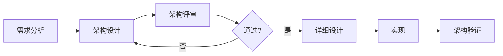

# 架构评审检查清单

## 学习目标

完成本模块后，你将能够：
- 理解架构评审的目的和重要性
- 掌握系统化的架构评审方法
- 使用检查清单进行全面的架构评审
- 识别架构设计中的潜在问题
- 确保架构满足IEC 62304等标准要求

## 前置知识

- 软件架构设计基础
- IEC 62304标准要求
- 需求工程基础
- 风险管理基础

## 内容

### 架构评审概述

#### 什么是架构评审？

架构评审是对软件架构设计进行系统化检查和评估的过程，目的是：
- 验证架构满足所有需求
- 识别架构设计中的缺陷和风险
- 评估架构的质量属性
- 确保架构符合标准和最佳实践

#### 架构评审的时机



**关键评审点**：
1. **初步架构评审**：架构设计完成后
2. **详细架构评审**：详细设计前
3. **变更评审**：架构重大变更时
4. **最终评审**：实现完成后


### 架构评审检查清单

#### 1. 完整性检查

##### 1.1 需求覆盖

- [ ] 所有功能需求都有对应的架构组件
- [ ] 所有非功能需求都在架构中体现
- [ ] 架构支持所有用例场景
- [ ] 架构满足性能需求
- [ ] 架构满足安全性需求
- [ ] 架构满足可靠性需求
- [ ] 架构满足可维护性需求
- [ ] 架构满足可扩展性需求

**评审要点**：
```markdown
需求ID: REQ-001
需求描述: 系统应能实时监测心率
架构组件: 
- 传感器接口模块
- 数据采集模块
- 信号处理模块
- 显示模块
追溯性: ✓ 完整
```

##### 1.2 接口定义

- [ ] 所有模块间接口都已定义
- [ ] 接口包含输入、输出、错误处理
- [ ] 接口文档完整清晰
- [ ] 接口版本管理明确
- [ ] 外部接口（硬件、网络）已定义
- [ ] 用户接口已定义
- [ ] API接口文档完整

**接口检查示例**：
```c
// 接口定义检查
typedef struct {
    // ✓ 输入参数明确
    uint8_t* data;
    uint16_t length;
    
    // ✓ 输出参数明确
    uint8_t* result;
    uint16_t* result_length;
    
    // ✓ 错误处理明确
    ErrorCode_t* error_code;
} InterfaceParams_t;

// ✓ 接口文档完整
/**
 * @brief 处理传感器数据
 * @param[in] data 输入数据缓冲区
 * @param[in] length 数据长度
 * @param[out] result 处理结果缓冲区
 * @param[out] result_length 结果长度
 * @return 错误码
 */
ErrorCode_t process_sensor_data(const uint8_t* data, 
                                uint16_t length,
                                uint8_t* result,
                                uint16_t* result_length);
```

##### 1.3 组件定义

- [ ] 所有组件的职责明确
- [ ] 组件边界清晰
- [ ] 组件依赖关系明确
- [ ] 组件接口完整
- [ ] 组件内部结构合理
- [ ] 组件可独立测试
- [ ] 组件文档完整

#### 2. 正确性检查

##### 2.1 架构原则

- [ ] 遵循单一职责原则
- [ ] 遵循开闭原则
- [ ] 遵循里氏替换原则
- [ ] 遵循接口隔离原则
- [ ] 遵循依赖倒置原则
- [ ] 高内聚低耦合
- [ ] 关注点分离

**原则检查示例**：
```c
// ✗ 违反单一职责原则
typedef struct {
    void (*read_sensor)(void);
    void (*process_data)(void);
    void (*display_result)(void);
    void (*save_to_storage)(void);  // 职责过多
} BadModule_t;

// ✓ 遵循单一职责原则
typedef struct {
    void (*read)(uint8_t* data, uint16_t length);
} SensorModule_t;

typedef struct {
    void (*process)(const uint8_t* input, uint8_t* output);
} ProcessorModule_t;

typedef struct {
    void (*display)(const uint8_t* data);
} DisplayModule_t;
```

##### 2.2 分层架构

- [ ] 层次划分清晰合理
- [ ] 层间依赖单向（上层依赖下层）
- [ ] 没有跨层调用
- [ ] 层间接口明确
- [ ] 每层职责清晰
- [ ] 层的粒度合适

**分层检查示例**：
```
✓ 正确的分层依赖
应用层 → 服务层 → HAL层 → 驱动层

✗ 错误的分层依赖
应用层 → 驱动层  (跨层调用)
HAL层 → 应用层   (反向依赖)
```

##### 2.3 模块化

- [ ] 模块划分合理
- [ ] 模块职责单一
- [ ] 模块接口清晰
- [ ] 模块耦合度低
- [ ] 模块内聚度高
- [ ] 模块可复用
- [ ] 模块可测试

#### 3. 质量属性检查

##### 3.1 性能

- [ ] 识别性能关键路径
- [ ] 性能瓶颈分析
- [ ] 响应时间满足要求
- [ ] 吞吐量满足要求
- [ ] 资源使用合理（CPU、内存）
- [ ] 性能优化策略明确
- [ ] 性能测试计划完整

**性能检查示例**：
```markdown
性能需求: 心率数据处理延迟 < 100ms

架构分析:
- 数据采集: 10ms
- 信号处理: 50ms
- 显示更新: 20ms
- 总延迟: 80ms ✓

优化策略:
- 使用DMA减少CPU占用
- 信号处理使用优化算法
- 显示使用双缓冲
```

##### 3.2 可靠性

- [ ] 错误处理机制完整
- [ ] 异常恢复策略明确
- [ ] 故障隔离设计
- [ ] 冗余设计（如需要）
- [ ] 看门狗机制
- [ ] 数据完整性保护
- [ ] 状态一致性保证

**可靠性检查示例**：
```c
// ✓ 完整的错误处理
ErrorCode_t read_sensor(SensorHandle_t handle, uint8_t* data) {
    // 参数验证
    if (handle == NULL || data == NULL) {
        return ERROR_INVALID_PARAM;
    }
    
    // 状态检查
    if (!is_sensor_ready(handle)) {
        return ERROR_NOT_READY;
    }
    
    // 超时保护
    uint32_t timeout = get_timeout_ms();
    while (!data_available() && timeout > 0) {
        delay_ms(1);
        timeout--;
    }
    
    if (timeout == 0) {
        return ERROR_TIMEOUT;
    }
    
    // 数据验证
    if (!validate_data(data)) {
        return ERROR_INVALID_DATA;
    }
    
    return SUCCESS;
}
```

##### 3.3 安全性

- [ ] 安全威胁分析完整
- [ ] 安全控制措施明确
- [ ] 数据加密（如需要）
- [ ] 访问控制机制
- [ ] 审计日志机制
- [ ] 安全通信（如需要）
- [ ] 安全更新机制

**安全性检查示例**：
```markdown
威胁: 未授权访问患者数据

安全控制:
- 用户认证机制 ✓
- 角色权限控制 ✓
- 数据加密存储 ✓
- 访问审计日志 ✓
- 会话超时机制 ✓
```

##### 3.4 可维护性

- [ ] 代码结构清晰
- [ ] 模块化程度高
- [ ] 文档完整
- [ ] 命名规范一致
- [ ] 注释充分
- [ ] 易于理解和修改
- [ ] 变更影响范围小

##### 3.5 可测试性

- [ ] 模块可独立测试
- [ ] 接口易于模拟
- [ ] 测试点充分
- [ ] 测试覆盖率可达标
- [ ] 支持自动化测试
- [ ] 测试策略明确

**可测试性检查示例**：
```c
// ✓ 易于测试的设计
typedef struct {
    // 依赖注入，便于模拟
    const SensorInterface_t* sensor;
    const StorageInterface_t* storage;
} DataProcessor_t;

// 测试时可以注入模拟对象
void test_data_processor(void) {
    MockSensor_t mock_sensor;
    MockStorage_t mock_storage;
    
    DataProcessor_t processor = {
        .sensor = &mock_sensor.interface,
        .storage = &mock_storage.interface
    };
    
    // 测试处理逻辑
    test_process_data(&processor);
}
```

#### 4. IEC 62304合规性检查

##### 4.1 软件架构设计（5.3）

- [ ] 架构设计文档完整（5.3.1）
- [ ] 架构支持软件需求（5.3.2）
- [ ] 接口规范完整（5.3.3）
- [ ] 功能和数据流明确（5.3.4）
- [ ] 软件单元隔离（5.3.5）
- [ ] 架构评审记录（5.3.6）

**IEC 62304检查示例**：
```markdown
5.3.1 架构设计文档:
- 架构概述 ✓
- 组件图 ✓
- 接口定义 ✓
- 数据流图 ✓
- 部署图 ✓

5.3.2 需求追溯:
- 需求到组件映射表 ✓
- 组件到需求追溯 ✓

5.3.3 接口规范:
- 模块间接口 ✓
- 硬件接口 ✓
- 用户接口 ✓

5.3.5 软件单元隔离:
- 关键功能隔离 ✓
- 安全功能隔离 ✓
```

##### 4.2 风险控制措施

- [ ] 风险控制措施在架构中体现
- [ ] 安全功能独立实现
- [ ] 故障检测机制
- [ ] 故障处理机制
- [ ] 风险追溯完整

**风险控制检查示例**：
```markdown
风险: 传感器故障导致错误测量

架构控制措施:
1. 传感器自检模块 ✓
2. 数据验证模块 ✓
3. 故障检测模块 ✓
4. 警报模块 ✓
5. 安全状态切换 ✓

追溯:
- 风险ID: RISK-001
- 控制措施: CTRL-001, CTRL-002
- 架构组件: SensorMonitor, DataValidator
```

##### 4.3 软件安全分类

- [ ] 软件安全分类明确（A/B/C类）
- [ ] 架构满足分类要求
- [ ] 文档深度符合分类
- [ ] 测试深度符合分类

#### 5. 技术可行性检查

##### 5.1 技术选型

- [ ] 技术选型合理
- [ ] 技术成熟度足够
- [ ] 团队技术能力匹配
- [ ] 技术风险可控
- [ ] 技术支持充分
- [ ] 技术路线图清晰

##### 5.2 资源约束

- [ ] 内存使用评估
- [ ] CPU使用评估
- [ ] 存储空间评估
- [ ] 功耗评估
- [ ] 成本评估
- [ ] 资源预留充分

**资源评估示例**：
```markdown
内存评估:
- 代码段: 128KB
- 数据段: 32KB
- 堆: 64KB
- 栈: 16KB
- 总计: 240KB
- 可用: 256KB ✓

CPU评估:
- 数据采集: 10%
- 信号处理: 30%
- 显示更新: 15%
- 系统管理: 10%
- 总计: 65%
- 预留: 35% ✓
```

##### 5.3 开发可行性

- [ ] 开发时间合理
- [ ] 开发资源充足
- [ ] 开发工具可用
- [ ] 开发风险可控
- [ ] 开发计划清晰

#### 6. 文档完整性检查

##### 6.1 架构文档

- [ ] 架构概述文档
- [ ] 架构设计文档
- [ ] 接口规范文档
- [ ] 组件设计文档
- [ ] 部署文档
- [ ] 架构决策记录

**文档检查清单**：
```markdown
必需文档:
1. 软件架构设计规格说明书 ✓
   - 架构概述
   - 架构视图
   - 组件描述
   - 接口定义
   - 设计决策

2. 接口控制文档 ✓
   - 模块间接口
   - 硬件接口
   - 外部接口

3. 架构评审记录 ✓
   - 评审日期
   - 评审人员
   - 评审意见
   - 问题跟踪
```

##### 6.2 追溯性文档

- [ ] 需求到架构追溯矩阵
- [ ] 架构到需求追溯矩阵
- [ ] 风险到架构追溯
- [ ] 架构到测试追溯

**追溯矩阵示例**：
```markdown
| 需求ID | 需求描述 | 架构组件 | 接口 | 状态 |
|--------|---------|---------|------|------|
| REQ-001 | 心率监测 | SensorModule | ISensor | ✓ |
| REQ-002 | 数据显示 | DisplayModule | IDisplay | ✓ |
| REQ-003 | 数据存储 | StorageModule | IStorage | ✓ |
```


### 架构评审方法

#### ATAM方法（Architecture Tradeoff Analysis Method）

ATAM是一种系统化的架构评审方法，重点关注质量属性的权衡。

**ATAM步骤**：

1. **呈现ATAM**：介绍评审方法和目标
2. **呈现业务驱动**：说明业务目标和约束
3. **呈现架构**：架构师介绍架构设计
4. **识别架构方法**：识别关键架构决策
5. **生成质量属性效用树**：构建质量属性层次结构
6. **分析架构方法**：评估架构对质量属性的影响
7. **头脑风暴和优先级排序**：识别场景并排序
8. **分析架构方法**：深入分析高优先级场景
9. **呈现结果**：总结发现和建议

**效用树示例**：
```
质量属性
├── 性能
│   ├── 响应时间 < 100ms (H, H)
│   └── 吞吐量 > 1000 samples/s (M, H)
├── 可靠性
│   ├── 可用性 > 99.9% (H, H)
│   └── 故障恢复 < 5s (H, M)
├── 安全性
│   ├── 数据加密 (H, H)
│   └── 访问控制 (M, H)
└── 可维护性
    ├── 模块化 (M, M)
    └── 文档完整性 (L, M)

注: (重要性, 难度)
H = High, M = Medium, L = Low
```

#### 场景评审法

使用具体场景评估架构设计。

**场景类型**：
1. **使用场景**：正常使用情况
2. **变更场景**：需求变更情况
3. **故障场景**：异常和故障情况

**场景评审示例**：
```markdown
场景1: 传感器故障
描述: 心率传感器在测量过程中发生故障
刺激: 传感器返回错误数据
响应: 
1. 检测到错误数据
2. 触发警报
3. 切换到安全状态
4. 记录故障日志
5. 通知用户

架构评估:
- 错误检测: DataValidator模块 ✓
- 警报触发: AlarmManager模块 ✓
- 安全状态: SafetyController模块 ✓
- 日志记录: Logger模块 ✓
- 用户通知: DisplayModule ✓

结论: 架构充分支持此场景 ✓
```

#### 检查表评审法

使用标准化检查表进行系统评审。

**评审流程**：


### 架构评审报告模板

```markdown
# 软件架构评审报告

## 1. 基本信息

- 项目名称: [项目名称]
- 评审日期: [日期]
- 评审类型: □ 初步评审 □ 详细评审 □ 变更评审
- 软件安全分类: □ A类 □ B类 □ C类

## 2. 评审团队

| 姓名 | 角色 | 职责 |
|------|------|------|
| [姓名] | 评审主席 | 主持评审 |
| [姓名] | 架构师 | 呈现架构 |
| [姓名] | 质量工程师 | 质量评估 |
| [姓名] | 安全工程师 | 安全评估 |

## 3. 评审范围

- 架构文档版本: [版本号]
- 评审内容:
  - [ ] 架构设计文档
  - [ ] 接口规范文档
  - [ ] 组件设计文档
  - [ ] 追溯矩阵

## 4. 评审发现

### 4.1 主要发现

| ID | 类别 | 严重性 | 描述 | 责任人 | 状态 |
|----|------|--------|------|--------|------|
| F-001 | 完整性 | 高 | 缺少错误处理接口 | [姓名] | 待处理 |
| F-002 | 性能 | 中 | 数据处理延迟可能超标 | [姓名] | 待处理 |

### 4.2 优点

1. 分层架构清晰
2. 模块化程度高
3. 接口定义完整

### 4.3 需要改进的地方

1. 错误处理机制需要加强
2. 性能优化策略需要明确
3. 安全控制措施需要补充

## 5. 检查清单结果

### 5.1 完整性检查
- 需求覆盖: ✓ 通过
- 接口定义: ⚠ 部分通过
- 组件定义: ✓ 通过

### 5.2 正确性检查
- 架构原则: ✓ 通过
- 分层架构: ✓ 通过
- 模块化: ✓ 通过

### 5.3 质量属性检查
- 性能: ⚠ 需要改进
- 可靠性: ✓ 通过
- 安全性: ⚠ 需要改进
- 可维护性: ✓ 通过
- 可测试性: ✓ 通过

### 5.4 IEC 62304合规性
- 架构设计文档: ✓ 符合
- 接口规范: ⚠ 部分符合
- 风险控制措施: ✓ 符合

## 6. 改进建议

### 6.1 必须改进（阻塞项）
1. 补充错误处理接口定义
2. 明确性能优化策略
3. 补充安全控制措施文档

### 6.2 建议改进
1. 增加架构决策文档
2. 补充部署视图
3. 完善测试策略

## 7. 评审结论

□ 通过 - 无需修改
□ 有条件通过 - 需要小修改
☑ 不通过 - 需要重大修改

## 8. 后续行动

| 行动项 | 责任人 | 截止日期 | 状态 |
|--------|--------|----------|------|
| 补充错误处理接口 | [姓名] | [日期] | 待处理 |
| 性能分析和优化 | [姓名] | [日期] | 待处理 |
| 安全评估报告 | [姓名] | [日期] | 待处理 |

## 9. 签字确认

- 评审主席: _____________ 日期: _______
- 架构师: _____________ 日期: _______
- 质量经理: _____________ 日期: _______
```

### 常见架构问题及解决方案

#### 问题1: 跨层调用

**问题描述**：应用层直接调用驱动层，破坏分层结构

**检测方法**：
```c
// ✗ 错误：跨层调用
void application_function(void) {
    // 应用层直接调用驱动层
    driver_read_sensor();
}
```

**解决方案**：
```c
// ✓ 正确：通过HAL层
void application_function(void) {
    const HAL_t* hal = get_hal();
    hal->sensor_read();
}
```

#### 问题2: 循环依赖

**问题描述**：模块A依赖模块B，模块B又依赖模块A

**检测方法**：
```
Module A → Module B
Module B → Module A  (循环依赖)
```

**解决方案**：
1. 引入中间层
2. 使用回调函数
3. 使用事件机制
4. 重新划分模块职责

#### 问题3: 职责不清

**问题描述**：模块职责过多或职责重叠

**检测方法**：
- 模块有多个变更原因
- 模块名称难以准确描述
- 模块代码量过大

**解决方案**：
- 应用单一职责原则
- 拆分模块
- 明确模块边界

#### 问题4: 接口不稳定

**问题描述**：接口频繁变更，影响多个模块

**检测方法**：
- 接口变更历史频繁
- 接口变更影响范围大

**解决方案**：
- 使用抽象接口
- 接口版本管理
- 向后兼容设计
- 充分的前期设计

#### 问题5: 性能瓶颈

**问题描述**：架构设计导致性能问题

**检测方法**：
- 性能分析工具
- 关键路径分析
- 资源使用监控

**解决方案**：
- 优化关键路径
- 使用缓存
- 异步处理
- 批处理
- 零拷贝设计

## 最佳实践

!!! tip "架构评审建议"
    1. **早期评审**：在详细设计前进行评审
    2. **多角色参与**：包括架构师、开发、测试、质量人员
    3. **使用检查清单**：确保评审全面系统
    4. **记录决策**：记录架构决策和理由
    5. **跟踪问题**：建立问题跟踪机制
    6. **定期评审**：重大变更时重新评审
    7. **经验总结**：总结评审经验和教训
    8. **持续改进**：不断完善评审流程

## 常见陷阱

!!! warning "注意事项"
    1. **流于形式**：评审走过场，不深入
    2. **缺少准备**：评审前准备不充分
    3. **人员不足**：缺少关键角色参与
    4. **时间不够**：评审时间不充分
    5. **问题不跟踪**：发现问题不跟踪解决
    6. **文档缺失**：评审记录不完整
    7. **忽视小问题**：小问题积累成大问题
    8. **缺少改进**：评审后不改进

## 实践练习

1. **评审练习**：
   - 使用检查清单评审一个架构设计
   - 识别至少5个问题
   - 提出改进建议

2. **ATAM练习**：
   - 为一个医疗器械项目构建效用树
   - 识别关键质量属性
   - 分析架构权衡

3. **场景评审练习**：
   - 设计5个评审场景
   - 评估架构对场景的支持
   - 识别架构弱点

4. **报告编写练习**：
   - 编写完整的评审报告
   - 包括发现、建议、行动项

## 自测问题

??? question "架构评审的主要目的是什么？"
    架构评审是质量保证的重要环节。
    
    ??? success "答案"
        架构评审的主要目的包括：
        
        1. **验证需求满足**：确保架构满足所有功能和非功能需求
        2. **识别设计缺陷**：早期发现架构设计中的问题
        3. **评估质量属性**：评估性能、可靠性、安全性等
        4. **确保合规性**：确保符合IEC 62304等标准
        5. **降低风险**：识别和降低技术风险
        6. **知识共享**：团队成员理解架构设计
        7. **改进设计**：通过评审改进架构质量
        
        早期发现问题的成本远低于后期修复成本。

??? question "如何检查架构是否满足IEC 62304要求？"
    IEC 62304对架构有明确要求。
    
    ??? success "答案"
        检查IEC 62304合规性的要点：
        
        **5.3.1 架构设计**：
        - 架构设计文档完整
        - 包含所有必要视图
        
        **5.3.2 支持需求**：
        - 架构支持所有软件需求
        - 需求到架构的追溯
        
        **5.3.3 接口规范**：
        - 软件单元间接口定义
        - 软件与硬件接口定义
        - 软件与用户接口定义
        
        **5.3.4 功能和数据流**：
        - 功能分配到软件单元
        - 数据流定义
        
        **5.3.5 隔离**：
        - 关键功能隔离
        - 安全功能独立
        
        **5.3.6 评审**：
        - 架构评审记录
        - 问题跟踪和解决

??? question "ATAM方法的核心是什么？"
    ATAM是系统化的架构评审方法。
    
    ??? success "答案"
        ATAM方法的核心：
        
        1. **质量属性驱动**：
           - 关注质量属性（性能、可靠性等）
           - 构建质量属性效用树
        
        2. **场景分析**：
           - 使用具体场景评估架构
           - 识别高优先级场景
        
        3. **权衡分析**：
           - 分析质量属性间的权衡
           - 识别敏感点和权衡点
        
        4. **风险识别**：
           - 识别架构风险
           - 评估风险影响
        
        **优点**：
        - 系统化、可重复
        - 关注质量属性
        - 识别权衡和风险
        
        **适用场景**：
        - 大型复杂系统
        - 质量属性要求高
        - 需要深入分析

??? question "如何处理评审中发现的问题？"
    问题跟踪和解决是评审的重要环节。
    
    ??? success "答案"
        问题处理流程：
        
        1. **记录问题**：
           - 问题描述清晰
           - 严重性分级
           - 责任人明确
        
        2. **分析问题**：
           - 根本原因分析
           - 影响范围评估
           - 解决方案建议
        
        3. **优先级排序**：
           - 高优先级：阻塞项，必须解决
           - 中优先级：重要但不阻塞
           - 低优先级：改进建议
        
        4. **制定计划**：
           - 解决方案
           - 责任人
           - 截止日期
        
        5. **跟踪解决**：
           - 定期检查进度
           - 验证解决方案
           - 更新状态
        
        6. **验证关闭**：
           - 验证问题已解决
           - 更新文档
           - 关闭问题
        
        **工具**：
        - 问题跟踪系统
        - 定期评审会议
        - 状态报告

??? question "架构评审应该在什么时候进行？"
    评审时机对效果有重要影响。
    
    ??? success "答案"
        架构评审的关键时机：
        
        1. **初步架构评审**：
           - 时机：架构设计完成后
           - 目的：验证架构方向正确
           - 深度：高层设计
        
        2. **详细架构评审**：
           - 时机：详细设计前
           - 目的：验证架构完整性
           - 深度：详细设计
        
        3. **变更评审**：
           - 时机：重大架构变更时
           - 目的：评估变更影响
           - 深度：变更相关部分
        
        4. **实现后评审**：
           - 时机：实现完成后
           - 目的：验证架构实现
           - 深度：实现验证
        
        **原则**：
        - 越早越好
        - 重大变更必须评审
        - 定期评审
        - 问题驱动评审

## 相关资源

- [软件架构设计](index.md)
- [架构模式详解](architecture-patterns.md)
- [架构文档模板](architecture-documentation-template.md)
- [IEC 62304标准](../../regulatory-standards/iec-62304/index.md)

## 参考文献

1. IEC 62304:2006+AMD1:2015 - Medical device software - Software life cycle processes, Section 5.3
2. Clements, Paul, et al. "Evaluating Software Architectures: Methods and Case Studies." Addison-Wesley, 2001.
3. Bass, Len, Paul Clements, and Rick Kazman. "Software Architecture in Practice, 3rd Edition." Addison-Wesley, 2012.
4. ISO/IEC/IEEE 42010:2011 - Systems and software engineering - Architecture description
5. 《软件架构评估》，Paul Clements等，机械工业出版社，2003
6. FDA Guidance: "General Principles of Software Validation"
