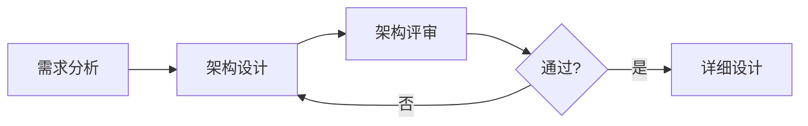
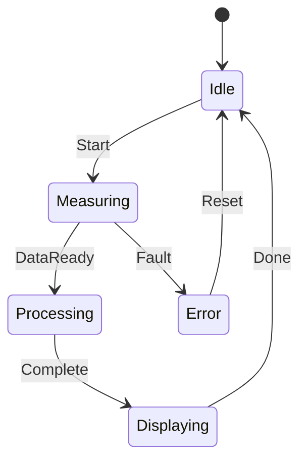
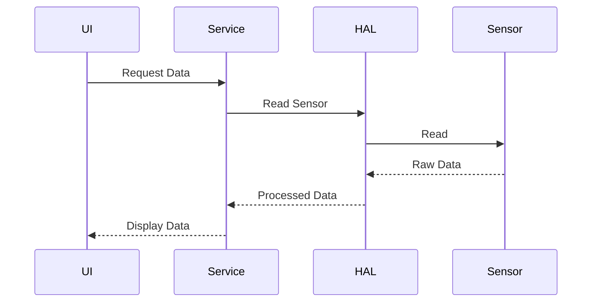

# 架构设计

## 学习目标

完成本模块后，你将能够：
- 理解软件架构的重要性和基本概念
- 掌握常见的架构模式和设计原则
- 学会设计分层架构和模块化系统
- 了解接口设计和组件通信
- 应用架构设计到医疗器械软件开发

## 前置知识

- 软件工程基础
- 面向对象设计
- 需求工程基础
- C/C++编程经验

## 软件架构概述

### 什么是软件架构？

软件架构是软件系统的高层结构，定义了：
- 系统的主要组件
- 组件之间的关系
- 组件的职责和接口
- 设计决策和约束

### 架构的重要性

在医疗器械软件开发中，良好的架构至关重要：
- **安全性**：隔离关键功能，降低风险
- **可维护性**：便于理解、修改和扩展
- **可测试性**：支持单元测试和集成测试
- **可追溯性**：清晰的组件映射到需求
- **合规性**：满足IEC 62304等标准要求

### 架构设计过程



**说明**: 这是架构设计流程图。展示了从需求分析到架构设计、架构评审、详细设计的迭代过程。如果评审不通过，需要返回架构设计阶段进行修改，确保架构质量。


## 架构设计原则

### SOLID原则

**S - 单一职责原则（Single Responsibility Principle）**：
- 一个模块只负责一个功能
- 降低耦合，提高内聚
- 便于理解和维护

**示例**：
```c
// 不好的设计：一个模块做太多事情
typedef struct {
    void (*read_sensor)(void);
    void (*process_data)(void);
    void (*display_result)(void);
    void (*save_to_storage)(void);
} AllInOne;

// 好的设计：职责分离
typedef struct {
    void (*read)(void);
} SensorModule;

typedef struct {
    void (*process)(uint8_t* data);
} DataProcessor;

typedef struct {
    void (*display)(uint8_t* result);
} DisplayModule;
```

**O - 开闭原则（Open-Closed Principle）**：
- 对扩展开放，对修改关闭
- 通过抽象和多态实现
- 降低修改风险

**L - 里氏替换原则（Liskov Substitution Principle）**：
- 子类可以替换父类
- 保持接口一致性
- 确保多态正确性

**I - 接口隔离原则（Interface Segregation Principle）**：
- 接口应该小而专注
- 客户端不应依赖不需要的接口
- 避免"胖"接口

**D - 依赖倒置原则（Dependency Inversion Principle）**：
- 依赖抽象而非具体实现
- 高层模块不依赖低层模块
- 通过接口解耦

### 其他重要原则

**关注点分离（Separation of Concerns）**：
- 不同功能分离到不同模块
- 降低复杂度
- 提高可维护性

**高内聚低耦合**：
- 模块内部紧密相关
- 模块之间松散连接
- 便于独立开发和测试

**最小知识原则（Law of Demeter）**：
- 模块只与直接朋友通信
- 减少依赖关系
- 降低耦合

## 分层架构

### 三层架构

```
┌─────────────────────────────────────┐
│      表示层 (Presentation Layer)     │
│  - 用户界面                          │
│  - 输入验证                          │
│  - 显示格式化                        │
└─────────────────────────────────────┘
           ↓
┌─────────────────────────────────────┐
│      业务逻辑层 (Business Layer)     │
│  - 业务规则                          │
│  - 数据处理                          │
│  - 算法实现                          │
└─────────────────────────────────────┘
           ↓
┌─────────────────────────────────────┐
│      数据访问层 (Data Access Layer)  │
│  - 数据存储                          │
│  - 数据检索                          │
│  - 数据持久化                        │
└─────────────────────────────────────┘
```

**优点**：
- 清晰的职责划分
- 易于理解和维护
- 支持独立测试
- 便于团队协作

**缺点**：
- 可能增加复杂度
- 性能开销
- 过度设计风险

### 医疗器械典型分层架构

```
┌─────────────────────────────────────┐
│      应用层 (Application Layer)      │
│  - 用户界面                          │
│  - 用户交互逻辑                      │
│  - 显示控制                          │
└─────────────────────────────────────┘
           ↓
┌─────────────────────────────────────┐
│      服务层 (Service Layer)          │
│  - 业务逻辑                          │
│  - 数据处理算法                      │
│  - 警报管理                          │
└─────────────────────────────────────┘
           ↓
┌─────────────────────────────────────┐
│      硬件抽象层 (HAL)                │
│  - 传感器接口                        │
│  - 执行器接口                        │
│  - 通信接口                          │
└─────────────────────────────────────┘
           ↓
┌─────────────────────────────────────┐
│      硬件层 (Hardware Layer)         │
│  - 传感器                            │
│  - 执行器                            │
│  - 处理器                            │
└─────────────────────────────────────┘
```

**示例代码**：
```c
// 硬件抽象层接口
typedef struct {
    int (*init)(void);
    int (*read)(uint8_t* buffer, size_t len);
    int (*write)(const uint8_t* buffer, size_t len);
    int (*deinit)(void);
} HAL_Interface;

// 传感器HAL实现
static HAL_Interface sensor_hal = {
    .init = sensor_init,
    .read = sensor_read,
    .write = NULL,  // 传感器只读
    .deinit = sensor_deinit
};

// 服务层使用HAL
int service_read_sensor_data(uint8_t* data) {
    // 通过HAL读取，不直接访问硬件
    return sensor_hal.read(data, DATA_SIZE);
}
```

## 模块化设计

### 模块定义

**模块特征**：
- 明确的职责
- 定义良好的接口
- 信息隐藏
- 独立编译和测试

### 模块划分策略

**按功能划分**：
```
modules/
├── sensor/          # 传感器模块
├── algorithm/       # 算法模块
├── display/         # 显示模块
├── storage/         # 存储模块
├── communication/   # 通信模块
└── alarm/          # 警报模块
```

**按层次划分**：
```
modules/
├── application/     # 应用层
├── service/        # 服务层
├── hal/            # 硬件抽象层
└── driver/         # 驱动层
```

### 模块接口设计

**接口设计原则**：
- 简单明了
- 完整性
- 一致性
- 最小化

**接口示例**：
```c
// sensor_module.h
#ifndef SENSOR_MODULE_H
#define SENSOR_MODULE_H

#include <stdint.h>
#include <stdbool.h>

// 传感器状态
typedef enum {
    SENSOR_OK = 0,
    SENSOR_ERROR_INIT,
    SENSOR_ERROR_READ,
    SENSOR_ERROR_TIMEOUT
} SensorStatus;

// 传感器数据
typedef struct {
    uint16_t value;
    uint32_t timestamp;
    bool valid;
} SensorData;

// 公共接口
SensorStatus sensor_init(void);
SensorStatus sensor_read(SensorData* data);
SensorStatus sensor_calibrate(void);
SensorStatus sensor_deinit(void);

#endif // SENSOR_MODULE_H
```

### 模块间通信

**直接调用**：
```c
// 模块A直接调用模块B
void moduleA_function(void) {
    moduleB_function();
}
```

**回调函数**：
```c
// 模块B注册回调到模块A
typedef void (*callback_t)(void);

void moduleA_register_callback(callback_t cb) {
    // 保存回调函数
}

void moduleA_trigger_event(void) {
    // 调用回调函数
    if (callback != NULL) {
        callback();
    }
}
```

**消息队列**：
```c
// 模块间通过消息队列通信
typedef struct {
    uint8_t type;
    uint8_t data[MAX_DATA_SIZE];
} Message;

void moduleA_send_message(Message* msg) {
    queue_push(msg);
}

void moduleB_receive_message(void) {
    Message msg;
    if (queue_pop(&msg)) {
        // 处理消息
    }
}
```

## 常见架构模式

### 1. 管道-过滤器模式（Pipe-Filter）

**适用场景**：数据处理流水线

**结构**：
```
输入 → 过滤器1 → 过滤器2 → 过滤器3 → 输出
```

**示例**：信号处理
```c
// 过滤器接口
typedef struct {
    void (*process)(uint8_t* input, uint8_t* output);
} Filter;

// 滤波器1：去噪
void denoise_filter(uint8_t* input, uint8_t* output) {
    // 去噪算法
}

// 滤波器2：平滑
void smooth_filter(uint8_t* input, uint8_t* output) {
    // 平滑算法
}

// 管道
void signal_pipeline(uint8_t* raw_data, uint8_t* processed_data) {
    uint8_t temp[DATA_SIZE];
    denoise_filter(raw_data, temp);
    smooth_filter(temp, processed_data);
}
```

### 2. 发布-订阅模式（Publish-Subscribe）

**适用场景**：事件驱动系统

**结构**：
```
发布者 → 事件总线 → 订阅者1
                  → 订阅者2
                  → 订阅者3
```

**示例**：警报系统
```c
// 事件类型
typedef enum {
    EVENT_ALARM_HIGH,
    EVENT_ALARM_LOW,
    EVENT_SENSOR_ERROR
} EventType;

// 订阅者回调
typedef void (*subscriber_callback_t)(EventType event, void* data);

// 订阅
void event_subscribe(EventType event, subscriber_callback_t callback);

// 发布
void event_publish(EventType event, void* data);

// 使用示例
void alarm_handler(EventType event, void* data) {
    if (event == EVENT_ALARM_HIGH) {
        // 处理高警报
    }
}

void init_alarm_system(void) {
    event_subscribe(EVENT_ALARM_HIGH, alarm_handler);
}
```

### 3. 状态机模式（State Machine）

**适用场景**：复杂状态管理

**结构**：


**示例**：测量设备状态机
```c
// 状态定义
typedef enum {
    STATE_IDLE,
    STATE_MEASURING,
    STATE_PROCESSING,
    STATE_DISPLAYING,
    STATE_ERROR
} DeviceState;

// 事件定义
typedef enum {
    EVENT_START,
    EVENT_DATA_READY,
    EVENT_COMPLETE,
    EVENT_DONE,
    EVENT_FAULT,
    EVENT_RESET
} DeviceEvent;

// 状态机结构
typedef struct {
    DeviceState current_state;
    void (*state_handlers[5])(DeviceEvent event);
} StateMachine;

// 状态处理函数
void idle_state_handler(DeviceEvent event) {
    if (event == EVENT_START) {
        // 转换到测量状态
        state_machine.current_state = STATE_MEASURING;
    }
}

void measuring_state_handler(DeviceEvent event) {
    if (event == EVENT_DATA_READY) {
        state_machine.current_state = STATE_PROCESSING;
    } else if (event == EVENT_FAULT) {
        state_machine.current_state = STATE_ERROR;
    }
}

// 状态机执行
void state_machine_execute(DeviceEvent event) {
    state_handlers[current_state](event);
}
```

### 4. 分层状态机（Hierarchical State Machine）

**适用场景**：复杂嵌套状态

**优点**：
- 减少状态转换数量
- 提高可维护性
- 支持状态继承

## 接口设计

### 接口类型

**硬件接口**：
- 传感器接口
- 执行器接口
- 通信接口

**软件接口**：
- 模块间接口
- API接口
- 回调接口

**用户接口**：
- 图形界面
- 命令行界面
- 物理按钮

### 接口设计最佳实践

**1. 使用抽象接口**：
```c
// 抽象存储接口
typedef struct {
    int (*open)(const char* name);
    int (*read)(void* buffer, size_t size);
    int (*write)(const void* buffer, size_t size);
    int (*close)(void);
} StorageInterface;

// 具体实现：Flash存储
static StorageInterface flash_storage = {
    .open = flash_open,
    .read = flash_read,
    .write = flash_write,
    .close = flash_close
};

// 具体实现：SD卡存储
static StorageInterface sd_storage = {
    .open = sd_open,
    .read = sd_read,
    .write = sd_write,
    .close = sd_close
};
```

**2. 错误处理**：
```c
// 返回错误码
typedef enum {
    SUCCESS = 0,
    ERROR_INVALID_PARAM = -1,
    ERROR_TIMEOUT = -2,
    ERROR_NO_MEMORY = -3
} ErrorCode;

ErrorCode module_function(int param) {
    if (param < 0) {
        return ERROR_INVALID_PARAM;
    }
    // 正常处理
    return SUCCESS;
}
```

**3. 参数验证**：
```c
int sensor_read(SensorData* data) {
    // 参数验证
    if (data == NULL) {
        return ERROR_INVALID_PARAM;
    }
    
    // 范围检查
    if (data->value > MAX_VALUE) {
        return ERROR_OUT_OF_RANGE;
    }
    
    // 正常处理
    return SUCCESS;
}
```

## 架构文档

### 架构设计文档内容

**1. 架构概述**：
- 系统目标
- 架构风格
- 关键设计决策

**2. 架构视图**：
- 逻辑视图：组件和关系
- 物理视图：部署结构
- 开发视图：模块组织
- 过程视图：运行时行为

**3. 组件描述**：
- 组件职责
- 组件接口
- 组件依赖

**4. 设计决策**：
- 决策理由
- 替代方案
- 权衡分析

### UML图示

**组件图**：
```
┌─────────────┐
│   UI Layer  │
└──────┬──────┘
       │
┌──────▼──────┐
│ Service Layer│
└──────┬──────┘
       │
┌──────▼──────┐
│     HAL     │
└─────────────┘
```

**序列图**：


**说明**: 这是组件交互的时序图示例。展示了UI、Service、HAL和Sensor之间的交互流程：UI请求数据，Service读取传感器，HAL与传感器通信，数据逐层返回并最终显示。这种图有助于理解系统的动态行为。


## 架构评审

### 评审检查表

**功能性**：
- [ ] 架构满足所有功能需求
- [ ] 组件职责清晰
- [ ] 接口定义完整

**质量属性**：
- [ ] 性能要求可满足
- [ ] 可靠性设计充分
- [ ] 安全性考虑完整
- [ ] 可维护性良好

**合规性**：
- [ ] 符合IEC 62304要求
- [ ] 满足风险控制措施
- [ ] 可追溯到需求

**可实现性**：
- [ ] 技术可行
- [ ] 资源充足
- [ ] 时间合理

### 架构评审方法

**ATAM（Architecture Tradeoff Analysis Method）**：
- 识别架构方法
- 分析质量属性
- 识别权衡点
- 评估风险

**场景评审**：
- 定义使用场景
- 评估架构响应
- 识别问题和风险

## 最佳实践

!!! tip "架构设计建议"
    1. **从需求出发**：架构应满足功能和质量需求
    2. **保持简单**：避免过度设计，KISS原则
    3. **模块化**：高内聚低耦合
    4. **分层清晰**：明确的层次划分
    5. **接口抽象**：依赖抽象而非具体实现
    6. **文档化**：清晰的架构文档
    7. **持续演进**：架构应随需求演进

## 常见陷阱

!!! warning "注意事项"
    1. **过度设计**：不必要的复杂性
    2. **层次混乱**：跨层调用，破坏分层
    3. **紧耦合**：模块间依赖过多
    4. **接口不稳定**：频繁修改接口
    5. **缺少抽象**：直接依赖具体实现
    6. **忽视非功能需求**：只关注功能
    7. **文档缺失**：缺少架构文档

## 实践练习

1. 为一个血压监测器设计分层架构
2. 设计一个传感器模块的接口
3. 使用状态机模式设计测量流程
4. 绘制一个组件图和序列图

## 自测问题

??? question "问题1：什么是分层架构？有什么优缺点？"
    
    ??? success "答案"
        **分层架构**：将系统划分为多个层次，每层有特定职责，上层依赖下层。
        
        **典型分层**：
        - 表示层：用户界面
        - 业务逻辑层：业务规则和算法
        - 数据访问层：数据存储和检索
        
        **优点**：
        1. 清晰的职责划分
        2. 易于理解和维护
        3. 支持独立开发和测试
        4. 便于团队协作
        5. 可替换性好（如更换UI）
        
        **缺点**：
        1. 可能增加复杂度
        2. 性能开销（层间调用）
        3. 过度设计风险
        4. 可能限制灵活性

??? question "问题2：SOLID原则是什么？如何应用？"
    
    ??? success "答案"
        **SOLID原则**：
        
        1. **S - 单一职责原则**：一个模块只负责一个功能
           - 应用：将传感器读取、数据处理、显示分离到不同模块
        
        2. **O - 开闭原则**：对扩展开放，对修改关闭
           - 应用：使用接口和多态，添加新功能不修改现有代码
        
        3. **L - 里氏替换原则**：子类可以替换父类
           - 应用：确保派生类不改变基类的行为
        
        4. **I - 接口隔离原则**：接口应该小而专注
           - 应用：不要创建"胖"接口，将大接口拆分为小接口
        
        5. **D - 依赖倒置原则**：依赖抽象而非具体实现
           - 应用：高层模块通过接口调用低层模块

??? question "问题3：什么是硬件抽象层（HAL）？为什么重要？"
    
    ??? success "答案"
        **硬件抽象层（HAL）**：在硬件和软件之间的抽象层，提供统一的硬件访问接口。
        
        **作用**：
        1. **隔离硬件依赖**：上层软件不直接访问硬件
        2. **提高可移植性**：更换硬件只需修改HAL
        3. **简化测试**：可以模拟HAL进行测试
        4. **降低风险**：硬件变更不影响上层软件
        
        **示例**：
        ```c
        // HAL接口
        typedef struct {
            int (*init)(void);
            int (*read)(uint8_t* data);
        } SensorHAL;
        
        // 具体硬件实现
        static SensorHAL sensor_a_hal = {
            .init = sensor_a_init,
            .read = sensor_a_read
        };
        
        // 上层使用HAL，不关心具体硬件
        void read_sensor(uint8_t* data) {
            sensor_hal->read(data);
        }
        ```

??? question "问题4：状态机模式适用于什么场景？如何实现？"
    
    ??? success "答案"
        **适用场景**：
        - 系统有多个状态
        - 状态之间有明确的转换条件
        - 状态转换逻辑复杂
        
        **示例场景**：
        - 测量设备的工作流程
        - 通信协议的状态管理
        - 用户界面的状态切换
        
        **实现方法**：
        
        1. **查表法**：
        ```c
        typedef enum { IDLE, MEASURING, PROCESSING } State;
        typedef enum { START, DATA_READY, COMPLETE } Event;
        
        State state_table[3][3] = {
            // IDLE, MEASURING, PROCESSING
            {MEASURING, IDLE, IDLE},        // START
            {IDLE, PROCESSING, PROCESSING}, // DATA_READY
            {IDLE, MEASURING, IDLE}         // COMPLETE
        };
        
        State current_state = IDLE;
        
        void handle_event(Event event) {
            current_state = state_table[event][current_state];
        }
        ```
        
        2. **函数指针法**：
        ```c
        typedef void (*state_handler_t)(Event event);
        
        void idle_handler(Event event);
        void measuring_handler(Event event);
        
        state_handler_t state_handlers[] = {
            idle_handler,
            measuring_handler,
            processing_handler
        };
        
        void execute_state_machine(Event event) {
            state_handlers[current_state](event);
        }
        ```

??? question "问题5：如何设计一个好的模块接口？"
    
    ??? success "答案"
        **设计原则**：
        
        1. **简单明了**：
           - 接口应该易于理解和使用
           - 避免复杂的参数和返回值
        
        2. **完整性**：
           - 提供所有必要的功能
           - 不遗漏关键操作
        
        3. **一致性**：
           - 命名规范一致
           - 参数顺序一致
           - 错误处理一致
        
        4. **最小化**：
           - 只暴露必要的接口
           - 隐藏内部实现
        
        5. **健壮性**：
           - 参数验证
           - 错误处理
           - 边界检查
        
        **示例**：
        ```c
        // 好的接口设计
        typedef enum {
            SENSOR_OK = 0,
            SENSOR_ERROR_INIT = -1,
            SENSOR_ERROR_READ = -2
        } SensorStatus;
        
        // 初始化
        SensorStatus sensor_init(void);
        
        // 读取数据（带参数验证）
        SensorStatus sensor_read(uint8_t* data, size_t* len);
        
        // 去初始化
        SensorStatus sensor_deinit(void);
        ```

??? question "问题6：架构设计文档应该包含哪些内容？"
    
    ??? success "答案"
        **架构设计文档内容**：
        
        1. **架构概述**：
           - 系统目标和范围
           - 架构风格（分层、微服务等）
           - 关键设计决策
        
        2. **架构视图**：
           - 逻辑视图：组件和关系
           - 物理视图：部署结构
           - 开发视图：模块组织
           - 过程视图：运行时行为
        
        3. **组件描述**：
           - 每个组件的职责
           - 组件的接口定义
           - 组件之间的依赖关系
        
        4. **接口规格**：
           - 接口定义
           - 数据格式
           - 通信协议
        
        5. **设计决策**：
           - 为什么选择这个架构
           - 考虑过的替代方案
           - 权衡分析
        
        6. **质量属性**：
           - 性能考虑
           - 安全性设计
           - 可靠性措施
        
        7. **风险和约束**：
           - 技术风险
           - 资源约束
           - 时间约束
        
        8. **追溯性**：
           - 架构到需求的映射
           - 风险控制措施的实现

## 相关资源

- [需求工程](../requirements-engineering/index.md)
- [IEC 62304 - 软件生命周期](../../regulatory-standards/iec-62304/index.md)
- [编码规范](../coding-standards/index.md)

## 参考文献

1. 书籍：《Software Architecture in Practice》by Len Bass, Paul Clements, Rick Kazman
2. 书籍：《Clean Architecture》by Robert C. Martin
3. 书籍：《Design Patterns: Elements of Reusable Object-Oriented Software》by Gang of Four
4. IEC 62304:2006+AMD1:2015 - Medical device software - Software life cycle processes
5. IEEE 1471-2000 - Recommended Practice for Architectural Description of Software-Intensive Systems
