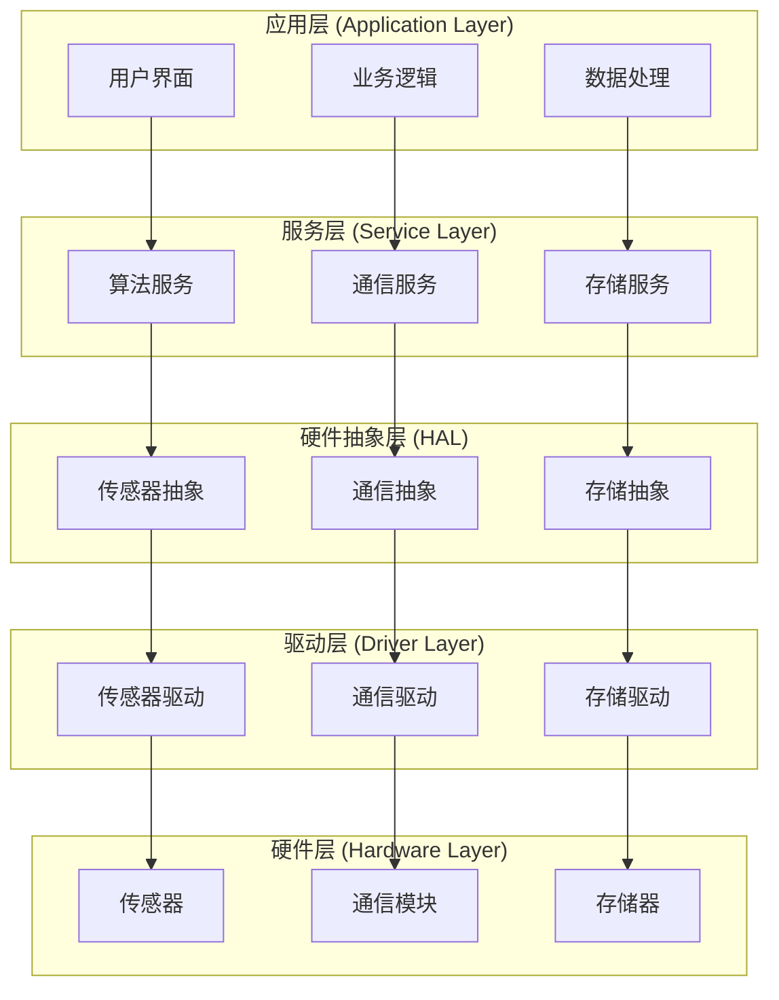

---
title: 分层架构设计
description: 医疗器械嵌入式软件的分层架构设计原则、层间通信机制和实现策略
difficulty: 中级
estimated_time: 50分钟
tags:
- 软件架构
- 分层设计
- 模块化
- 嵌入式系统
- IEC 62304
related_modules:
- zh/software-engineering/architecture-design
- zh/software-engineering/architecture-design/modular-design
- zh/software-engineering/architecture-design/interface-design
last_updated: '2026-02-09'
version: '1.0'
language: zh
---

# 分层架构设计

## 学习目标

完成本模块后，你将能够：
- 理解分层架构的基本概念和优势
- 掌握医疗器械软件的典型分层结构
- 设计清晰的层间接口和通信机制
- 应用分层原则提高软件的可维护性和可测试性
- 遵循IEC 62304对软件架构的要求

## 前置知识

- 软件工程基础
- C/C++编程基础
- 嵌入式系统基本概念
- 模块化设计原则

## 内容

### 分层架构概述

分层架构（Layered Architecture）是一种将软件系统组织成多个层次的架构模式，每一层提供特定的功能，并且只与相邻层进行交互。这种架构模式特别适合医疗器械嵌入式软件，因为它提供了清晰的关注点分离和良好的可维护性。

**分层架构的核心原则**：

1. **单向依赖**：上层可以调用下层，下层不应直接调用上层
2. **接口隔离**：层与层之间通过明确定义的接口通信
3. **职责分离**：每一层有明确的职责和功能边界
4. **可替换性**：层的内部实现可以改变而不影响其他层

### 医疗器械软件典型分层结构



**各层职责详解**：

#### 1. 应用层（Application Layer）

应用层包含用户界面和核心业务逻辑，是用户直接交互的层次。

**职责**：
- 用户界面展示和交互
- 业务流程控制
- 数据验证和格式化
- 用户输入处理

**示例代码**：

```c
// application_layer.h
#ifndef APPLICATION_LAYER_H
#define APPLICATION_LAYER_H

#include "service_layer.h"

// 应用层状态
typedef enum {
    APP_STATE_IDLE,
    APP_STATE_MEASURING,
    APP_STATE_DISPLAYING,
    APP_STATE_ERROR
} AppState_t;

// 应用层接口
typedef struct {
    void (*init)(void);
    void (*process)(void);
    AppState_t (*get_state)(void);
    void (*handle_user_input)(uint8_t input);
} ApplicationLayer_t;

// 获取应用层实例
const ApplicationLayer_t* get_application_layer(void);

#endif // APPLICATION_LAYER_H
```

```c
// application_layer.c
#include "application_layer.h"
#include <stdio.h>

static AppState_t current_state = APP_STATE_IDLE;
static const ServiceLayer_t* service_layer;

static void app_init(void) {
    // 初始化应用层
    service_layer = get_service_layer();
    service_layer->init();
    current_state = APP_STATE_IDLE;
    printf("Application layer initialized\n");
}

static void app_process(void) {
    // 应用层主循环处理
    switch (current_state) {
        case APP_STATE_IDLE:
            // 等待用户输入
            break;
            
        case APP_STATE_MEASURING:
            // 执行测量流程
            if (service_layer->start_measurement() == 0) {
                current_state = APP_STATE_DISPLAYING;
            } else {
                current_state = APP_STATE_ERROR;
            }
            break;
            
        case APP_STATE_DISPLAYING:
            // 显示测量结果
            float result = service_layer->get_measurement_result();
            printf("Measurement result: %.2f\n", result);
            current_state = APP_STATE_IDLE;
            break;
            
        case APP_STATE_ERROR:
            // 错误处理
            printf("Error occurred\n");
            current_state = APP_STATE_IDLE;
            break;
    }
}

static AppState_t app_get_state(void) {
    return current_state;
}

static void app_handle_user_input(uint8_t input) {
    // 处理用户输入
    if (input == 1 && current_state == APP_STATE_IDLE) {
        current_state = APP_STATE_MEASURING;
    }
}

static const ApplicationLayer_t app_layer = {
    .init = app_init,
    .process = app_process,
    .get_state = app_get_state,
    .handle_user_input = app_handle_user_input
};

const ApplicationLayer_t* get_application_layer(void) {
    return &app_layer;
}
```

#### 2. 服务层（Service Layer）

服务层提供可复用的业务服务，封装复杂的业务逻辑和算法。

**职责**：
- 实现核心算法（如信号处理、数据分析）
- 提供业务服务接口
- 协调多个硬件抽象层组件
- 实现业务规则和策略

**示例代码**：

```c
// service_layer.h
#ifndef SERVICE_LAYER_H
#define SERVICE_LAYER_H

#include <stdint.h>
#include "hal_layer.h"

// 服务层接口
typedef struct {
    void (*init)(void);
    int (*start_measurement)(void);
    float (*get_measurement_result)(void);
    int (*process_data)(const uint8_t* data, uint16_t length);
} ServiceLayer_t;

// 获取服务层实例
const ServiceLayer_t* get_service_layer(void);

#endif // SERVICE_LAYER_H
```

```c
// service_layer.c
#include "service_layer.h"
#include <string.h>

static const HAL_t* hal;
static float last_result = 0.0f;

static void service_init(void) {
    // 初始化服务层
    hal = get_hal_layer();
    hal->init();
}

static int service_start_measurement(void) {
    // 启动测量流程
    uint8_t raw_data[128];
    
    // 从传感器读取数据
    int result = hal->sensor_read(raw_data, sizeof(raw_data));
    if (result < 0) {
        return -1;
    }
    
    // 处理数据
    return service_process_data(raw_data, result);
}

static float service_get_measurement_result(void) {
    return last_result;
}

static int service_process_data(const uint8_t* data, uint16_t length) {
    // 数据处理算法
    if (data == NULL || length == 0) {
        return -1;
    }
    
    // 简单的平均值计算示例
    uint32_t sum = 0;
    for (uint16_t i = 0; i < length; i++) {
        sum += data[i];
    }
    
    last_result = (float)sum / length;
    return 0;
}

static const ServiceLayer_t service_layer = {
    .init = service_init,
    .start_measurement = service_start_measurement,
    .get_measurement_result = service_get_measurement_result,
    .process_data = service_process_data
};

const ServiceLayer_t* get_service_layer(void) {
    return &service_layer;
}
```

#### 3. 硬件抽象层（HAL - Hardware Abstraction Layer）

HAL层隔离硬件细节，提供统一的硬件访问接口。

**职责**：
- 封装硬件特定的操作
- 提供硬件无关的接口
- 简化硬件移植
- 隔离硬件变化对上层的影响

**示例代码**：

```c
// hal_layer.h
#ifndef HAL_LAYER_H
#define HAL_LAYER_H

#include <stdint.h>

// HAL层接口
typedef struct {
    void (*init)(void);
    int (*sensor_read)(uint8_t* buffer, uint16_t length);
    int (*sensor_write)(const uint8_t* data, uint16_t length);
    int (*storage_read)(uint32_t address, uint8_t* buffer, uint16_t length);
    int (*storage_write)(uint32_t address, const uint8_t* data, uint16_t length);
} HAL_t;

// 获取HAL层实例
const HAL_t* get_hal_layer(void);

#endif // HAL_LAYER_H
```

```c
// hal_layer.c
#include "hal_layer.h"
#include "driver_layer.h"

static const DriverLayer_t* driver;

static void hal_init(void) {
    // 初始化HAL层
    driver = get_driver_layer();
    driver->init();
}

static int hal_sensor_read(uint8_t* buffer, uint16_t length) {
    // 传感器读取的硬件抽象
    if (buffer == NULL || length == 0) {
        return -1;
    }
    
    // 调用驱动层接口
    return driver->sensor_driver->read(buffer, length);
}

static int hal_sensor_write(const uint8_t* data, uint16_t length) {
    // 传感器写入的硬件抽象
    if (data == NULL || length == 0) {
        return -1;
    }
    
    return driver->sensor_driver->write(data, length);
}

static int hal_storage_read(uint32_t address, uint8_t* buffer, uint16_t length) {
    // 存储读取的硬件抽象
    return driver->storage_driver->read(address, buffer, length);
}

static int hal_storage_write(uint32_t address, const uint8_t* data, uint16_t length) {
    // 存储写入的硬件抽象
    return driver->storage_driver->write(address, data, length);
}

static const HAL_t hal_layer = {
    .init = hal_init,
    .sensor_read = hal_sensor_read,
    .sensor_write = hal_sensor_write,
    .storage_read = hal_storage_read,
    .storage_write = hal_storage_write
};

const HAL_t* get_hal_layer(void) {
    return &hal_layer;
}
```

#### 4. 驱动层（Driver Layer）

驱动层直接与硬件交互，实现硬件的底层控制。

**职责**：
- 硬件寄存器操作
- 中断处理
- DMA配置
- 硬件初始化和配置

**示例代码**：

```c
// driver_layer.h
#ifndef DRIVER_LAYER_H
#define DRIVER_LAYER_H

#include <stdint.h>

// 传感器驱动接口
typedef struct {
    int (*init)(void);
    int (*read)(uint8_t* buffer, uint16_t length);
    int (*write)(const uint8_t* data, uint16_t length);
} SensorDriver_t;

// 存储驱动接口
typedef struct {
    int (*init)(void);
    int (*read)(uint32_t address, uint8_t* buffer, uint16_t length);
    int (*write)(uint32_t address, const uint8_t* data, uint16_t length);
} StorageDriver_t;

// 驱动层接口
typedef struct {
    void (*init)(void);
    const SensorDriver_t* sensor_driver;
    const StorageDriver_t* storage_driver;
} DriverLayer_t;

// 获取驱动层实例
const DriverLayer_t* get_driver_layer(void);

#endif // DRIVER_LAYER_H
```

```c
// driver_layer.c
#include "driver_layer.h"

// 传感器驱动实现
static int sensor_driver_init(void) {
    // 初始化传感器硬件
    // 配置GPIO、I2C等
    return 0;
}

static int sensor_driver_read(uint8_t* buffer, uint16_t length) {
    // 从传感器硬件读取数据
    // 实际的I2C/SPI读取操作
    for (uint16_t i = 0; i < length; i++) {
        buffer[i] = 0x55; // 模拟数据
    }
    return length;
}

static int sensor_driver_write(const uint8_t* data, uint16_t length) {
    // 向传感器硬件写入数据
    return length;
}

static const SensorDriver_t sensor_driver = {
    .init = sensor_driver_init,
    .read = sensor_driver_read,
    .write = sensor_driver_write
};

// 存储驱动实现
static int storage_driver_init(void) {
    // 初始化存储硬件
    return 0;
}

static int storage_driver_read(uint32_t address, uint8_t* buffer, uint16_t length) {
    // 从存储器读取数据
    return length;
}

static int storage_driver_write(uint32_t address, const uint8_t* data, uint16_t length) {
    // 向存储器写入数据
    return length;
}

static const StorageDriver_t storage_driver = {
    .init = storage_driver_init,
    .read = storage_driver_read,
    .write = storage_driver_write
};

static void driver_layer_init(void) {
    sensor_driver.init();
    storage_driver.init();
}

static const DriverLayer_t driver_layer = {
    .init = driver_layer_init,
    .sensor_driver = &sensor_driver,
    .storage_driver = &storage_driver
};

const DriverLayer_t* get_driver_layer(void) {
    return &driver_layer;
}
```

### 层间通信机制

**1. 直接函数调用**

最简单的层间通信方式，适用于同步操作。

```c
// 上层直接调用下层接口
result = hal->sensor_read(buffer, length);
```

**2. 回调函数**

用于下层向上层通知事件，实现异步通信。

```c
// 定义回调函数类型
typedef void (*DataReadyCallback_t)(const uint8_t* data, uint16_t length);

// HAL层注册回调
void hal_register_data_ready_callback(DataReadyCallback_t callback);

// 应用层实现回调
static void on_data_ready(const uint8_t* data, uint16_t length) {
    // 处理数据
    process_sensor_data(data, length);
}

// 应用层注册回调
hal_register_data_ready_callback(on_data_ready);
```

**3. 消息队列**

用于解耦层间通信，支持异步和缓冲。

```c
// 定义消息结构
typedef struct {
    uint8_t type;
    uint8_t data[64];
    uint16_t length;
} Message_t;

// 服务层发送消息到应用层
int service_send_message(const Message_t* msg) {
    return message_queue_send(APP_QUEUE, msg);
}

// 应用层接收消息
void app_process_messages(void) {
    Message_t msg;
    while (message_queue_receive(APP_QUEUE, &msg) == 0) {
        handle_message(&msg);
    }
}
```

**4. 事件驱动**

使用事件机制实现松耦合的层间通信。

```c
// 定义事件类型
typedef enum {
    EVENT_DATA_READY,
    EVENT_ERROR_OCCURRED,
    EVENT_MEASUREMENT_COMPLETE
} EventType_t;

// 事件结构
typedef struct {
    EventType_t type;
    void* data;
} Event_t;

// 注册事件处理器
void app_register_event_handler(EventType_t type, EventHandler_t handler);

// 服务层触发事件
void service_trigger_event(EventType_t type, void* data) {
    Event_t event = {.type = type, .data = data};
    event_dispatcher_dispatch(&event);
}
```

### 分层设计的优势

1. **可维护性**：每层职责清晰，修改影响范围小
2. **可测试性**：可以独立测试每一层
3. **可移植性**：更换硬件只需修改驱动层和HAL层
4. **可复用性**：服务层和应用层可以在不同硬件平台复用
5. **团队协作**：不同团队可以并行开发不同层

### IEC 62304合规性

分层架构有助于满足IEC 62304的要求：

- **5.3.1 软件架构设计**：清晰的分层结构满足架构设计要求
- **5.3.3 接口规范**：层间接口提供明确的接口规范
- **5.3.5 隔离**：分层实现了软件单元的隔离
- **5.4 软件单元实现和验证**：每层可以作为独立单元进行验证

## 最佳实践

!!! tip "分层架构最佳实践"
    1. **严格遵守单向依赖**：上层依赖下层，下层不依赖上层
    2. **明确层的职责**：避免职责混乱和跨层调用
    3. **使用接口隔离**：通过接口而非具体实现进行层间通信
    4. **最小化层间耦合**：减少层间传递的数据量和依赖
    5. **合理划分层次**：不要过度分层，保持简单实用
    6. **文档化接口**：详细记录每层的接口和职责
    7. **版本控制接口**：接口变更要有版本管理
    8. **独立测试每层**：为每层编写独立的单元测试

## 常见陷阱

!!! warning "注意事项"
    1. **跨层调用**：应用层直接调用驱动层，破坏分层结构
    2. **循环依赖**：下层依赖上层，形成循环依赖
    3. **过度分层**：层次过多导致性能损失和复杂度增加
    4. **职责不清**：层的职责边界模糊，功能重复
    5. **接口不稳定**：频繁修改接口影响多个层
    6. **全局变量滥用**：使用全局变量绕过层间接口
    7. **硬编码依赖**：硬编码特定硬件细节到上层
    8. **忽略性能**：过度抽象导致性能问题

## 实践练习

1. **分层设计练习**：
   - 为一个血压监测设备设计完整的分层架构
   - 定义每层的接口和职责

2. **接口设计练习**：
   - 设计HAL层的传感器接口
   - 考虑多种传感器类型的兼容性

3. **重构练习**：
   - 给定一个单体代码，重构为分层架构
   - 识别和消除跨层依赖

4. **移植练习**：
   - 将一个分层架构的软件移植到新硬件平台
   - 只修改驱动层和HAL层

## 自测问题

??? question "分层架构的核心原则是什么？"
    分层架构有几个核心原则需要遵守。
    
    ??? success "答案"
        分层架构的核心原则包括：
        
        1. **单向依赖**：上层可以调用下层，下层不应直接调用上层。这确保了依赖关系的清晰性。
        2. **接口隔离**：层与层之间通过明确定义的接口通信，而不是直接访问内部实现。
        3. **职责分离**：每一层有明确的职责和功能边界，避免职责混乱。
        4. **可替换性**：层的内部实现可以改变而不影响其他层，只要接口保持不变。
        
        遵守这些原则可以提高软件的可维护性、可测试性和可移植性。

??? question "医疗器械软件中HAL层的主要作用是什么？"
    HAL层在医疗器械软件架构中扮演重要角色。
    
    ??? success "答案"
        HAL（硬件抽象层）的主要作用包括：
        
        1. **封装硬件细节**：隔离硬件特定的操作，使上层不需要了解硬件细节
        2. **提供统一接口**：为不同硬件提供统一的访问接口
        3. **简化移植**：更换硬件时只需修改HAL层和驱动层
        4. **提高可测试性**：可以为HAL层创建模拟实现用于测试
        5. **降低耦合**：减少上层对特定硬件的依赖
        
        在医疗器械软件中，HAL层特别重要，因为它使得软件可以在不同硬件平台上复用，降低了开发和验证成本。

??? question "如何实现层间的异步通信？"
    层间通信不仅限于同步调用，异步通信也很重要。
    
    ??? success "答案"
        层间异步通信可以通过以下机制实现：
        
        1. **回调函数**：下层通过回调函数通知上层事件发生
        2. **消息队列**：使用RTOS的消息队列在层间传递消息
        3. **事件机制**：使用事件标志或事件组通知事件
        4. **观察者模式**：上层注册为观察者，下层通知所有观察者
        
        选择哪种机制取决于具体需求：
        - 回调函数适合简单的事件通知
        - 消息队列适合需要缓冲和解耦的场景
        - 事件机制适合多对多的通知场景

??? question "分层架构如何提高软件的可测试性？"
    可测试性是软件质量的重要指标。
    
    ??? success "答案"
        分层架构通过以下方式提高可测试性：
        
        1. **独立测试**：每层可以独立进行单元测试
        2. **模拟下层**：测试上层时可以模拟下层的实现
        3. **接口测试**：可以针对层间接口编写测试用例
        4. **隔离硬件**：应用层和服务层可以在没有硬件的情况下测试
        5. **测试替身**：可以为每层创建测试替身（stub/mock）
        
        例如，测试应用层时，可以创建服务层的模拟实现，返回预定义的测试数据，而不需要真实的硬件。

??? question "在分层架构中，如何处理性能关键的代码？"
    分层架构可能引入性能开销，需要权衡。
    
    ??? success "答案"
        处理性能关键代码的策略：
        
        1. **性能分析**：首先通过profiling确定真正的性能瓶颈
        2. **选择性优化**：只对性能关键路径进行优化
        3. **内联函数**：使用inline关键字减少函数调用开销
        4. **直接访问**：在性能关键处允许跨层访问（需文档化）
        5. **零拷贝**：使用指针传递而非数据拷贝
        6. **批处理**：批量处理数据减少层间调用次数
        
        重要的是在架构清晰性和性能之间找到平衡，不要过早优化，但也要为性能关键部分预留优化空间。

## 相关资源

- [软件架构设计](index.md)
- [接口设计](interface-design.md)
- [模块化设计](modular-design.md)
- [设计模式](design-patterns/index.md)

## 参考文献

1. IEC 62304:2006+AMD1:2015 - Medical device software - Software life cycle processes, Section 5.3 (Software architectural design)
2. Fowler, Martin. "Patterns of Enterprise Application Architecture." Addison-Wesley, 2002.
3. Bass, Len, Paul Clements, and Rick Kazman. "Software Architecture in Practice, 3rd Edition." Addison-Wesley, 2012.
4. Douglass, Bruce Powel. "Real-Time Design Patterns: Robust Scalable Architecture for Real-Time Systems." Addison-Wesley, 2002.
5. 《嵌入式软件架构设计》，李云，电子工业出版社，2019
6. MISRA C:2012 - Guidelines for the use of the C language in critical systems
