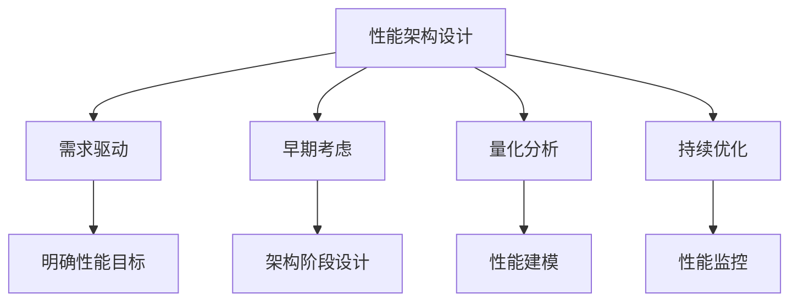
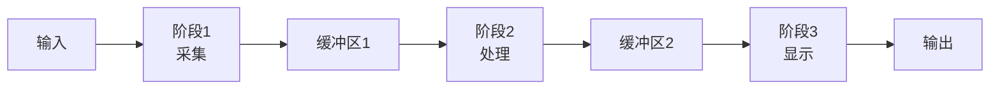
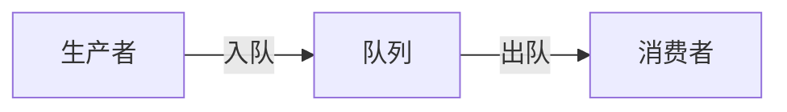

# 性能架构设计

## 学习目标

完成本模块后，你将能够：
- 理解性能架构设计的重要性和原则
- 掌握性能需求分析和建模方法
- 设计高性能的软件架构
- 应用性能优化策略和技术
- 进行性能测试和分析

## 前置知识

- 软件架构设计基础
- 嵌入式C/C++编程
- RTOS基础知识
- 数据结构和算法

## 内容

### 性能架构概述

#### 什么是性能架构？

性能架构是指在架构层面考虑和优化系统性能的设计方法，包括：
- 响应时间
- 吞吐量
- 资源利用率
- 可扩展性

#### 为什么性能架构重要？

在医疗器械软件中，性能直接影响：
1. **患者安全**：实时响应关键事件
2. **用户体验**：流畅的操作体验
3. **系统可靠性**：稳定的性能表现
4. **成本效益**：合理的资源使用

#### 性能架构设计原则




### 性能需求分析

#### 1. 性能需求类型

**响应时间需求**：
- 用户交互响应：< 100ms
- 警报响应：< 50ms
- 数据采集周期：10ms
- 显示更新频率：> 30fps

**吞吐量需求**：
- 数据采集速率：1000 samples/s
- 数据处理速率：500 samples/s
- 存储写入速率：100 KB/s

**资源约束**：
- CPU使用率：< 80%
- 内存使用：< 200KB
- 功耗：< 500mW

#### 2. 性能需求规格

**性能需求模板**：
```markdown
性能需求ID: PERF-001
类别: 响应时间
描述: 心率数据采集到显示的端到端延迟
目标值: < 100ms
测量方法: 从传感器触发到屏幕更新的时间
优先级: 高
验收标准: 99%的情况下满足要求
```

#### 3. 性能建模

**性能模型示例**：
```
总延迟 = 采集延迟 + 处理延迟 + 显示延迟

采集延迟 = 传感器响应时间 + 数据传输时间
         = 5ms + 2ms = 7ms

处理延迟 = 滤波时间 + 算法时间
         = 10ms + 30ms = 40ms

显示延迟 = 渲染时间 + 刷新时间
         = 15ms + 16.7ms = 31.7ms

总延迟 = 7ms + 40ms + 31.7ms = 78.7ms < 100ms ✓
```

### 高性能架构模式

#### 1. 管道并行模式

**概念**：将处理流程分为多个阶段，各阶段并行执行。

**架构图**：


**实现示例**：
```c
// 管道阶段定义
typedef struct {
    void* input_buffer;
    void* output_buffer;
    void (*process)(void* input, void* output);
    TaskHandle_t task_handle;
} PipelineStage_t;

// 采集阶段
void acquisition_stage(void* input, void* output) {
    SensorData_t* data = (SensorData_t*)output;
    sensor_read(data);
}

// 处理阶段
void processing_stage(void* input, void* output) {
    SensorData_t* in_data = (SensorData_t*)input;
    ProcessedData_t* out_data = (ProcessedData_t*)output;
    
    // 信号处理
    filter_data(in_data, out_data);
    calculate_features(out_data);
}

// 显示阶段
void display_stage(void* input, void* output) {
    ProcessedData_t* data = (ProcessedData_t*)input;
    update_display(data);
}

// 管道初始化
void pipeline_init(void) {
    // 创建缓冲区
    void* buffer1 = malloc(sizeof(SensorData_t));
    void* buffer2 = malloc(sizeof(ProcessedData_t));
    
    // 创建任务
    xTaskCreate(acquisition_task, "Acq", 256, buffer1, 3, NULL);
    xTaskCreate(processing_task, "Proc", 512, buffer2, 2, NULL);
    xTaskCreate(display_task, "Disp", 256, NULL, 1, NULL);
}
```

**优点**：
- 提高吞吐量
- 充分利用多核
- 降低延迟

**适用场景**：
- 数据流处理
- 信号处理
- 图像处理

#### 2. 生产者-消费者模式

**概念**：生产者和消费者通过队列解耦，异步处理。

**架构图**：


**实现示例**：
```c
// 队列定义
#define QUEUE_SIZE 10
QueueHandle_t data_queue;

// 生产者任务
void producer_task(void* param) {
    SensorData_t data;
    
    while (1) {
        // 采集数据
        sensor_read(&data);
        
        // 发送到队列
        if (xQueueSend(data_queue, &data, pdMS_TO_TICKS(10)) != pdPASS) {
            // 队列满，处理溢出
            handle_queue_overflow();
        }
        
        vTaskDelay(pdMS_TO_TICKS(10));
    }
}

// 消费者任务
void consumer_task(void* param) {
    SensorData_t data;
    
    while (1) {
        // 从队列接收
        if (xQueueReceive(data_queue, &data, portMAX_DELAY) == pdPASS) {
            // 处理数据
            process_data(&data);
        }
    }
}

// 初始化
void init_producer_consumer(void) {
    // 创建队列
    data_queue = xQueueCreate(QUEUE_SIZE, sizeof(SensorData_t));
    
    // 创建任务
    xTaskCreate(producer_task, "Producer", 256, NULL, 2, NULL);
    xTaskCreate(consumer_task, "Consumer", 512, NULL, 1, NULL);
}
```

**优点**：
- 解耦生产和消费
- 缓冲速率差异
- 支持多生产者/消费者

**适用场景**：
- 数据采集和处理
- 事件处理
- 日志记录

#### 3. 缓存模式

**概念**：使用缓存减少重复计算和I/O操作。

**实现示例**：
```c
// 缓存结构
#define CACHE_SIZE 16

typedef struct {
    uint32_t key;
    float value;
    bool valid;
    uint32_t timestamp;
} CacheEntry_t;

typedef struct {
    CacheEntry_t entries[CACHE_SIZE];
    uint32_t hit_count;
    uint32_t miss_count;
} Cache_t;

static Cache_t cache = {0};

// 缓存查找
bool cache_lookup(uint32_t key, float* value) {
    for (int i = 0; i < CACHE_SIZE; i++) {
        if (cache.entries[i].valid && cache.entries[i].key == key) {
            *value = cache.entries[i].value;
            cache.hit_count++;
            return true;
        }
    }
    cache.miss_count++;
    return false;
}

// 缓存插入
void cache_insert(uint32_t key, float value) {
    // 查找最旧的条目
    int oldest_idx = 0;
    uint32_t oldest_time = cache.entries[0].timestamp;
    
    for (int i = 1; i < CACHE_SIZE; i++) {
        if (!cache.entries[i].valid) {
            oldest_idx = i;
            break;
        }
        if (cache.entries[i].timestamp < oldest_time) {
            oldest_time = cache.entries[i].timestamp;
            oldest_idx = i;
        }
    }
    
    // 插入新条目
    cache.entries[oldest_idx].key = key;
    cache.entries[oldest_idx].value = value;
    cache.entries[oldest_idx].valid = true;
    cache.entries[oldest_idx].timestamp = get_timestamp();
}

// 使用缓存的计算函数
float expensive_calculation(uint32_t input) {
    float result;
    
    // 先查缓存
    if (cache_lookup(input, &result)) {
        return result;
    }
    
    // 缓存未命中，执行计算
    result = perform_calculation(input);
    
    // 存入缓存
    cache_insert(input, result);
    
    return result;
}
```

**优点**：
- 减少重复计算
- 降低延迟
- 提高吞吐量

**适用场景**：
- 重复计算
- 频繁访问的数据
- 昂贵的I/O操作

#### 4. 零拷贝模式

**概念**：避免不必要的数据拷贝，直接传递指针。

**实现示例**：
```c
// 不好的实现：多次拷贝
void bad_data_flow(void) {
    uint8_t sensor_buffer[256];
    uint8_t process_buffer[256];
    uint8_t display_buffer[256];
    
    // 第一次拷贝
    sensor_read(sensor_buffer, 256);
    
    // 第二次拷贝
    memcpy(process_buffer, sensor_buffer, 256);
    process_data(process_buffer);
    
    // 第三次拷贝
    memcpy(display_buffer, process_buffer, 256);
    display_update(display_buffer);
}

// 好的实现：零拷贝
typedef struct {
    uint8_t* data;
    uint16_t length;
    void (*release)(uint8_t* data);
} DataBuffer_t;

void good_data_flow(void) {
    // 分配缓冲区
    DataBuffer_t buffer;
    buffer.data = malloc(256);
    buffer.length = 256;
    buffer.release = free;
    
    // 传递指针，无拷贝
    sensor_read_to_buffer(&buffer);
    process_data_in_place(&buffer);
    display_update_from_buffer(&buffer);
    
    // 释放缓冲区
    buffer.release(buffer.data);
}

// DMA零拷贝示例
void dma_zero_copy(void) {
    static uint8_t dma_buffer[256] __attribute__((aligned(4)));
    
    // 配置DMA直接传输到缓冲区
    dma_config_t config = {
        .source = SENSOR_DATA_REGISTER,
        .destination = (uint32_t)dma_buffer,
        .length = 256,
        .callback = dma_complete_callback
    };
    
    dma_start_transfer(&config);
}

void dma_complete_callback(void) {
    // DMA完成，数据已在dma_buffer中
    // 直接处理，无需拷贝
    process_data_in_place(dma_buffer, 256);
}
```

**优点**：
- 减少内存拷贝
- 降低CPU占用
- 提高性能

**适用场景**：
- 大数据传输
- 高频数据处理
- DMA操作

### 性能优化策略

#### 1. 算法优化

**选择高效算法**：
```c
// 不好的实现：O(n²)
float calculate_average_slow(const float* data, uint16_t length) {
    float sum = 0.0f;
    for (uint16_t i = 0; i < length; i++) {
        for (uint16_t j = 0; j <= i; j++) {
            sum += data[j];
        }
    }
    return sum / (length * (length + 1) / 2);
}

// 好的实现：O(n)
float calculate_average_fast(const float* data, uint16_t length) {
    float sum = 0.0f;
    for (uint16_t i = 0; i < length; i++) {
        sum += data[i];
    }
    return sum / length;
}
```

**使用查找表**：
```c
// 不好的实现：每次计算
float calculate_sin_slow(float angle) {
    return sinf(angle);  // 浮点运算慢
}

// 好的实现：查找表
#define SIN_TABLE_SIZE 360
static const float sin_table[SIN_TABLE_SIZE] = {
    // 预计算的正弦值
    0.0000f, 0.0175f, 0.0349f, ...
};

float calculate_sin_fast(float angle) {
    // 将角度转换为索引
    int index = (int)(angle * SIN_TABLE_SIZE / 360.0f) % SIN_TABLE_SIZE;
    return sin_table[index];
}
```

#### 2. 数据结构优化

**选择合适的数据结构**：
```c
// 场景：频繁查找
// 不好：使用数组，O(n)查找
typedef struct {
    uint32_t id;
    float value;
} DataItem_t;

DataItem_t data_array[100];

float find_value_slow(uint32_t id) {
    for (int i = 0; i < 100; i++) {
        if (data_array[i].id == id) {
            return data_array[i].value;
        }
    }
    return 0.0f;
}

// 好：使用哈希表，O(1)查找
#define HASH_TABLE_SIZE 128

typedef struct HashNode {
    uint32_t id;
    float value;
    struct HashNode* next;
} HashNode_t;

HashNode_t* hash_table[HASH_TABLE_SIZE];

uint32_t hash_function(uint32_t id) {
    return id % HASH_TABLE_SIZE;
}

float find_value_fast(uint32_t id) {
    uint32_t index = hash_function(id);
    HashNode_t* node = hash_table[index];
    
    while (node != NULL) {
        if (node->id == id) {
            return node->value;
        }
        node = node->next;
    }
    
    return 0.0f;
}
```

**内存对齐优化**：
```c
// 不好：未对齐，可能导致性能损失
typedef struct {
    uint8_t flag;      // 1 byte
    uint32_t value;    // 4 bytes，未对齐
    uint8_t status;    // 1 byte
} UnalignedStruct_t;  // 总大小：12 bytes（含填充）

// 好：对齐优化
typedef struct {
    uint32_t value;    // 4 bytes，对齐
    uint8_t flag;      // 1 byte
    uint8_t status;    // 1 byte
    uint16_t padding;  // 2 bytes，显式填充
} AlignedStruct_t;    // 总大小：8 bytes

// 使用编译器属性强制对齐
typedef struct {
    uint8_t flag;
    uint32_t value;
    uint8_t status;
} __attribute__((packed)) PackedStruct_t;  // 紧凑但可能慢

typedef struct {
    uint8_t flag;
    uint32_t value;
    uint8_t status;
} __attribute__((aligned(4))) AlignedStruct2_t;  // 4字节对齐
```

#### 3. 并发优化

**任务优先级设计**：
```c
// 任务优先级定义
#define PRIORITY_CRITICAL   5  // 关键任务（警报）
#define PRIORITY_HIGH       4  // 高优先级（数据采集）
#define PRIORITY_NORMAL     3  // 正常优先级（数据处理）
#define PRIORITY_LOW        2  // 低优先级（显示更新）
#define PRIORITY_IDLE       1  // 空闲任务（日志）

void create_tasks(void) {
    // 警报任务 - 最高优先级
    xTaskCreate(alarm_task, "Alarm", 256, NULL, 
                PRIORITY_CRITICAL, NULL);
    
    // 数据采集任务 - 高优先级
    xTaskCreate(acquisition_task, "Acq", 512, NULL, 
                PRIORITY_HIGH, NULL);
    
    // 数据处理任务 - 正常优先级
    xTaskCreate(processing_task, "Proc", 1024, NULL, 
                PRIORITY_NORMAL, NULL);
    
    // 显示任务 - 低优先级
    xTaskCreate(display_task, "Disp", 512, NULL, 
                PRIORITY_LOW, NULL);
    
    // 日志任务 - 最低优先级
    xTaskCreate(logging_task, "Log", 256, NULL, 
                PRIORITY_IDLE, NULL);
}
```

**减少锁竞争**：
```c
// 不好：粗粒度锁
SemaphoreHandle_t global_mutex;

void bad_concurrent_access(void) {
    xSemaphoreTake(global_mutex, portMAX_DELAY);
    
    // 长时间持有锁
    process_data();
    update_display();
    write_log();
    
    xSemaphoreGive(global_mutex);
}

// 好：细粒度锁
SemaphoreHandle_t data_mutex;
SemaphoreHandle_t display_mutex;
SemaphoreHandle_t log_mutex;

void good_concurrent_access(void) {
    // 只在需要时持有锁
    xSemaphoreTake(data_mutex, portMAX_DELAY);
    process_data();
    xSemaphoreGive(data_mutex);
    
    xSemaphoreTake(display_mutex, portMAX_DELAY);
    update_display();
    xSemaphoreGive(display_mutex);
    
    xSemaphoreTake(log_mutex, portMAX_DELAY);
    write_log();
    xSemaphoreGive(log_mutex);
}

// 更好：无锁数据结构
typedef struct {
    volatile uint32_t head;
    volatile uint32_t tail;
    DataItem_t buffer[BUFFER_SIZE];
} LockFreeQueue_t;

bool lockfree_enqueue(LockFreeQueue_t* queue, DataItem_t item) {
    uint32_t current_tail = queue->tail;
    uint32_t next_tail = (current_tail + 1) % BUFFER_SIZE;
    
    if (next_tail == queue->head) {
        return false;  // 队列满
    }
    
    queue->buffer[current_tail] = item;
    queue->tail = next_tail;
    
    return true;
}
```


#### 4. I/O优化

**DMA使用**：
```c
// 配置DMA传输
void setup_dma_transfer(void) {
    DMA_InitTypeDef dma_init;
    
    dma_init.DMA_PeripheralBaseAddr = (uint32_t)&ADC1->DR;
    dma_init.DMA_MemoryBaseAddr = (uint32_t)adc_buffer;
    dma_init.DMA_DIR = DMA_DIR_PeripheralToMemory;
    dma_init.DMA_BufferSize = ADC_BUFFER_SIZE;
    dma_init.DMA_PeripheralInc = DMA_PeripheralInc_Disable;
    dma_init.DMA_MemoryInc = DMA_MemoryInc_Enable;
    dma_init.DMA_Mode = DMA_Mode_Circular;
    
    DMA_Init(DMA1_Channel1, &dma_init);
    DMA_Cmd(DMA1_Channel1, ENABLE);
}
```

**批处理**：
```c
// 不好：逐个写入
void write_data_slow(const DataPoint_t* points, uint16_t count) {
    for (uint16_t i = 0; i < count; i++) {
        flash_write_single(&points[i]);  // 每次写入都有开销
    }
}

// 好：批量写入
void write_data_fast(const DataPoint_t* points, uint16_t count) {
    flash_write_batch(points, count);  // 一次写入多个
}
```

### 性能测试和分析

#### 1. 性能测试方法

**基准测试**：
```c
// 性能测试框架
typedef struct {
    const char* name;
    void (*function)(void);
    uint32_t iterations;
} Benchmark_t;

void run_benchmark(const Benchmark_t* bench) {
    uint32_t start_time = get_timestamp_us();
    
    for (uint32_t i = 0; i < bench->iterations; i++) {
        bench->function();
    }
    
    uint32_t end_time = get_timestamp_us();
    uint32_t total_time = end_time - start_time;
    float avg_time = (float)total_time / bench->iterations;
    
    printf("Benchmark: %s\n", bench->name);
    printf("  Iterations: %u\n", bench->iterations);
    printf("  Total time: %u us\n", total_time);
    printf("  Average time: %.2f us\n", avg_time);
}
```

**负载测试**：
```c
// 模拟高负载
void load_test(void) {
    // 启动所有任务
    start_all_tasks();
    
    // 监控性能指标
    uint32_t start_time = xTaskGetTickCount();
    uint32_t duration = pdMS_TO_TICKS(60000);  // 1分钟
    
    while ((xTaskGetTickCount() - start_time) < duration) {
        // 记录性能数据
        record_cpu_usage();
        record_memory_usage();
        record_response_time();
        
        vTaskDelay(pdMS_TO_TICKS(1000));
    }
    
    // 分析结果
    analyze_performance_data();
}
```

#### 2. 性能分析工具

**CPU使用率监控**：
```c
// CPU使用率统计
typedef struct {
    uint32_t total_time;
    uint32_t idle_time;
    float cpu_usage;
} CpuStats_t;

void monitor_cpu_usage(void) {
    static uint32_t last_total = 0;
    static uint32_t last_idle = 0;
    
    TaskStatus_t* task_status_array;
    uint32_t total_run_time;
    uint32_t task_count;
    
    // 获取任务状态
    task_count = uxTaskGetNumberOfTasks();
    task_status_array = pvPortMalloc(task_count * sizeof(TaskStatus_t));
    
    task_count = uxTaskGetSystemState(task_status_array, 
                                      task_count, 
                                      &total_run_time);
    
    // 计算CPU使用率
    uint32_t delta_total = total_run_time - last_total;
    uint32_t idle_time = 0;
    
    for (uint32_t i = 0; i < task_count; i++) {
        if (strcmp(task_status_array[i].pcTaskName, "IDLE") == 0) {
            idle_time = task_status_array[i].ulRunTimeCounter;
            break;
        }
    }
    
    uint32_t delta_idle = idle_time - last_idle;
    float cpu_usage = 100.0f * (1.0f - (float)delta_idle / delta_total);
    
    printf("CPU Usage: %.1f%%\n", cpu_usage);
    
    last_total = total_run_time;
    last_idle = idle_time;
    
    vPortFree(task_status_array);
}
```

**内存使用监控**：
```c
void monitor_memory_usage(void) {
    size_t free_heap = xPortGetFreeHeapSize();
    size_t min_free_heap = xPortGetMinimumEverFreeHeapSize();
    size_t total_heap = configTOTAL_HEAP_SIZE;
    
    printf("Memory Usage:\n");
    printf("  Total: %u bytes\n", total_heap);
    printf("  Free: %u bytes\n", free_heap);
    printf("  Used: %u bytes (%.1f%%)\n", 
           total_heap - free_heap,
           100.0f * (total_heap - free_heap) / total_heap);
    printf("  Min Free: %u bytes\n", min_free_heap);
}
```

## 最佳实践

!!! tip "性能架构设计建议"
    1. **早期考虑性能**：在架构设计阶段就考虑性能
    2. **明确性能目标**：设定可测量的性能指标
    3. **性能建模**：使用模型预测性能
    4. **选择合适模式**：根据场景选择架构模式
    5. **持续测试**：定期进行性能测试
    6. **监控和分析**：实时监控性能指标
    7. **优化热点**：专注于性能瓶颈
    8. **权衡取舍**：平衡性能和其他质量属性

## 常见陷阱

!!! warning "注意事项"
    1. **过早优化**：在没有性能问题时过度优化
    2. **忽视测量**：没有测量就优化
    3. **局部优化**：只优化局部而忽视整体
    4. **牺牲可读性**：为性能牺牲代码可读性
    5. **忽视资源限制**：不考虑硬件资源约束
    6. **缺少监控**：没有性能监控机制
    7. **盲目跟风**：不分析就使用优化技术
    8. **忽视维护成本**：优化增加维护难度

## 实践练习

1. **性能分析练习**：
   - 分析一个医疗器械软件的性能瓶颈
   - 使用性能分析工具定位问题
   - 提出优化方案

2. **架构优化练习**：
   - 设计一个高性能的数据采集系统
   - 使用管道并行模式
   - 实现零拷贝数据传输

3. **性能测试练习**：
   - 编写性能测试用例
   - 测试不同负载下的性能
   - 分析测试结果

4. **优化实践练习**：
   - 优化一个慢速算法
   - 使用缓存提高性能
   - 测量优化效果

## 相关资源

- [软件架构设计](index.md)
- [RTOS性能调优](../../technical-knowledge/rtos/rtos-performance-tuning.md)
- [编译器优化](../../technical-knowledge/embedded-c-cpp/compiler-optimization.md)
- [测试策略](../testing-strategy/performance-testing.md)

## 参考文献

1. Smith, Connie U., and Lloyd G. Williams. "Performance Solutions: A Practical Guide to Creating Responsive, Scalable Software." Addison-Wesley, 2002.
2. Bondi, André B. "Foundations of Software and System Performance Engineering." Addison-Wesley, 2014.
3. Douglass, Bruce Powel. "Real-Time Design Patterns: Robust Scalable Architecture for Real-Time Systems." Addison-Wesley, 2002.
4. 《高性能嵌入式系统设计》，Jim Cooling，机械工业出版社，2015
5. ARM. "Cortex-M Programming Guide to Memory Barrier Instructions." Application Note 321.
6. FreeRTOS Documentation: "Run Time Stats"
