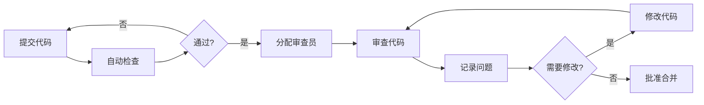

# 代码审查检查清单

## 学习目标

完成本模块后，你将能够：
- 理解代码审查在医疗器械软件开发中的重要性
- 掌握系统化的代码审查流程
- 使用检查清单进行全面的代码审查
- 应用评分标准评估代码质量
- 识别和报告代码缺陷

## 前置知识

- C/C++编程基础
- 编码规范（MISRA C、CERT C）
- 软件质量保证基础
- IEC 62304标准基础

## 内容

### 代码审查概述

代码审查是软件质量保证的关键活动，通过同行评审发现缺陷、提高代码质量、传播知识。

**代码审查的目标**：
1. **发现缺陷**：在测试前发现逻辑错误、安全漏洞
2. **提高质量**：确保代码符合标准和最佳实践
3. **知识共享**：团队成员相互学习
4. **降低风险**：减少软件失效的可能性
5. **合规性**：满足IEC 62304等标准要求


### 代码审查流程



**审查流程步骤**：

1. **准备阶段**
   - 开发者自检代码
   - 运行静态分析工具
   - 运行单元测试
   - 准备审查材料

2. **审查阶段**
   - 审查员检查代码
   - 使用检查清单
   - 记录发现的问题
   - 评估代码质量

3. **反馈阶段**
   - 讨论发现的问题
   - 确定修改优先级
   - 制定改进计划

4. **修改阶段**
   - 开发者修改代码
   - 重新提交审查
   - 验证修改

5. **批准阶段**
   - 确认所有问题已解决
   - 批准代码合并
   - 更新审查记录


### 代码审查检查清单

#### 1. 通用代码质量

**1.1 可读性**
- [ ] 代码格式一致（缩进、空格、换行）
- [ ] 命名清晰有意义（变量、函数、类型）
- [ ] 注释充分且准确
- [ ] 复杂逻辑有解释说明
- [ ] 避免过长的函数（建议<50行）
- [ ] 避免过深的嵌套（建议<4层）

**1.2 可维护性**
- [ ] 代码结构清晰
- [ ] 模块化设计合理
- [ ] 避免代码重复
- [ ] 魔法数字使用常量或宏定义
- [ ] 全局变量使用最小化
- [ ] 依赖关系清晰

**1.3 文档**
- [ ] 函数有完整的注释（目的、参数、返回值）
- [ ] 复杂算法有说明
- [ ] 假设和限制有文档
- [ ] 修改历史记录完整
- [ ] TODO/FIXME标记清晰


#### 2. 编码规范合规性

**2.1 MISRA C合规性**
- [ ] 所有强制规则已遵守
- [ ] 必需规则已遵守或有正式偏离
- [ ] 偏离已文档化并批准
- [ ] 静态分析工具检查通过
- [ ] 类型转换安全
- [ ] 指针使用安全

**2.2 CERT C合规性**
- [ ] 无未定义行为
- [ ] 无未指定行为
- [ ] 无实现定义行为（或已文档化）
- [ ] 输入验证充分
- [ ] 整数运算安全
- [ ] 字符串操作安全

**2.3 项目编码标准**
- [ ] 符合项目命名约定
- [ ] 符合项目文件组织规范
- [ ] 符合项目注释规范
- [ ] 符合项目错误处理规范


#### 3. 功能正确性

**3.1 逻辑正确性**
- [ ] 算法实现正确
- [ ] 边界条件处理正确
- [ ] 循环终止条件正确
- [ ] 条件判断逻辑正确
- [ ] 状态机转换正确
- [ ] 并发逻辑正确

**3.2 数据处理**
- [ ] 变量初始化正确
- [ ] 数据类型选择合适
- [ ] 类型转换安全
- [ ] 数组访问不越界
- [ ] 指针解引用安全
- [ ] 内存操作正确

**3.3 接口使用**
- [ ] API调用正确
- [ ] 参数传递正确
- [ ] 返回值检查完整
- [ ] 回调函数使用正确
- [ ] 中断处理正确


#### 4. 错误处理

**4.1 错误检测**
- [ ] 所有可能的错误都被检测
- [ ] 输入参数验证充分
- [ ] 资源分配失败检查
- [ ] 外部接口错误检查
- [ ] 超时和异常情况处理

**4.2 错误处理**
- [ ] 错误处理策略一致
- [ ] 错误信息清晰
- [ ] 错误恢复机制合理
- [ ] 资源清理完整
- [ ] 错误传播正确

**4.3 断言使用**
- [ ] 断言用于检查不变量
- [ ] 断言不用于正常错误处理
- [ ] 断言条件清晰
- [ ] 生产代码中断言处理正确


#### 5. 资源管理

**5.1 内存管理**
- [ ] 无内存泄漏
- [ ] 无重复释放
- [ ] 无野指针
- [ ] 动态内存使用最小化（医疗器械）
- [ ] 内存池使用正确（如果使用）
- [ ] 栈使用合理

**5.2 文件和I/O**
- [ ] 文件正确打开和关闭
- [ ] I/O错误检查完整
- [ ] 缓冲区大小合适
- [ ] 无资源泄漏

**5.3 其他资源**
- [ ] 互斥锁正确获取和释放
- [ ] 信号量使用正确
- [ ] 定时器正确管理
- [ ] 硬件资源正确初始化和清理


#### 6. 并发和同步

**6.1 线程安全**
- [ ] 共享数据访问有保护
- [ ] 临界区最小化
- [ ] 无竞态条件
- [ ] 无死锁可能
- [ ] 原子操作使用正确

**6.2 中断处理**
- [ ] ISR函数简短高效
- [ ] ISR中无阻塞操作
- [ ] 中断优先级设置合理
- [ ] 中断嵌套处理正确
- [ ] 共享变量使用volatile

**6.3 RTOS使用**
- [ ] 任务优先级设置合理
- [ ] 任务间通信正确
- [ ] 同步机制使用正确
- [ ] 无优先级反转
- [ ] 资源管理正确


#### 7. 性能和效率

**7.1 时间效率**
- [ ] 算法复杂度合理
- [ ] 无不必要的计算
- [ ] 循环优化合理
- [ ] 函数调用开销合理
- [ ] 实时性要求满足

**7.2 空间效率**
- [ ] 内存使用合理
- [ ] 栈使用不过度
- [ ] 数据结构选择合适
- [ ] 无不必要的数据复制

**7.3 功耗（嵌入式系统）**
- [ ] 睡眠模式使用合理
- [ ] 外设使用优化
- [ ] 时钟管理合理


#### 8. 安全性

**8.1 输入验证**
- [ ] 所有外部输入都被验证
- [ ] 边界检查完整
- [ ] 格式验证正确
- [ ] 范围检查完整

**8.2 缓冲区安全**
- [ ] 无缓冲区溢出
- [ ] 字符串操作安全
- [ ] 数组访问安全
- [ ] 使用安全的库函数

**8.3 加密和认证**
- [ ] 加密算法使用正确
- [ ] 密钥管理安全
- [ ] 认证机制正确
- [ ] 敏感数据保护充分

**8.4 权限和访问控制**
- [ ] 权限检查完整
- [ ] 访问控制正确
- [ ] 最小权限原则


#### 9. 测试覆盖

**9.1 单元测试**
- [ ] 关键函数有单元测试
- [ ] 测试覆盖率充分（建议>80%）
- [ ] 边界条件有测试
- [ ] 错误路径有测试
- [ ] 测试用例清晰

**9.2 可测试性**
- [ ] 代码易于测试
- [ ] 依赖可以模拟
- [ ] 接口设计支持测试
- [ ] 测试桩和驱动完整


#### 10. 医疗器械特定要求

**10.1 IEC 62304合规性**
- [ ] 软件分类正确
- [ ] 风险控制措施实施
- [ ] 可追溯性完整
- [ ] 文档要求满足
- [ ] 变更控制正确

**10.2 安全关键功能**
- [ ] 安全机制实施正确
- [ ] 故障检测充分
- [ ] 故障处理正确
- [ ] 看门狗使用正确
- [ ] 自检功能完整

**10.3 数据完整性**
- [ ] 数据校验充分（CRC、校验和）
- [ ] 数据存储可靠
- [ ] 数据传输安全
- [ ] 审计日志完整

**10.4 用户界面**
- [ ] 错误信息清晰
- [ ] 用户操作安全
- [ ] 警告和提示充分
- [ ] 可用性考虑充分


### 评分标准

#### 缺陷严重性分类

**严重性1（Critical - 关键）**
- 导致系统崩溃或数据丢失
- 安全漏洞
- 违反强制性法规要求
- 可能导致患者伤害

**严重性2（Major - 主要）**
- 功能无法正常工作
- 性能严重下降
- 违反MISRA C强制规则
- 资源泄漏

**严重性3（Minor - 次要）**
- 功能部分受限
- 违反MISRA C必需规则
- 代码可读性差
- 文档不完整

**严重性4（Trivial - 轻微）**
- 代码风格问题
- 违反MISRA C建议规则
- 注释不充分
- 命名不规范


#### 代码质量评分

**评分维度**：

| 维度 | 权重 | 评分标准 |
|------|------|----------|
| 功能正确性 | 30% | 逻辑正确、边界处理、错误处理 |
| 编码规范 | 20% | MISRA C、CERT C、项目标准 |
| 可读性 | 15% | 命名、注释、结构 |
| 可维护性 | 15% | 模块化、复用、依赖 |
| 安全性 | 10% | 输入验证、缓冲区安全 |
| 性能 | 5% | 时间、空间效率 |
| 测试覆盖 | 5% | 单元测试、可测试性 |

**评分等级**：

- **优秀（90-100分）**：
  - 无严重性1-2缺陷
  - 严重性3缺陷≤2个
  - 代码质量高，可直接合并

- **良好（80-89分）**：
  - 无严重性1缺陷
  - 严重性2缺陷≤2个
  - 需要小幅修改后合并

- **合格（70-79分）**：
  - 无严重性1缺陷
  - 严重性2缺陷≤5个
  - 需要修改后重新审查

- **不合格（<70分）**：
  - 有严重性1缺陷，或
  - 严重性2缺陷>5个
  - 需要大幅修改


### 审查记录模板

```markdown
# 代码审查记录

## 基本信息
- **审查日期**：2026-02-09
- **审查员**：张三
- **开发者**：李四
- **模块名称**：数据采集模块
- **文件列表**：
  - src/data_acquisition.c
  - src/data_acquisition.h
- **代码行数**：350行

## 审查结果

### 总体评分：85分（良好）

### 缺陷统计
| 严重性 | 数量 |
|--------|------|
| Critical | 0 |
| Major | 1 |
| Minor | 3 |
| Trivial | 5 |

### 发现的问题

#### 1. [Major] 缺少输入参数验证
**位置**：data_acquisition.c:45
**描述**：函数`acquire_data()`未验证指针参数是否为NULL
**建议**：添加参数验证
```c
if (buffer == NULL || size == 0) {
    return ERROR_INVALID_PARAM;
}
```

#### 2. [Minor] 违反MISRA C规则9.1
**位置**：data_acquisition.c:78
**描述**：变量`result`在使用前未初始化
**建议**：初始化变量
```c
int result = 0;
```

#### 3. [Minor] 注释不充分
**位置**：data_acquisition.c:120-150
**描述**：复杂的滤波算法缺少说明
**建议**：添加算法说明和参考文献

### 优点
- 代码结构清晰
- 命名规范
- 错误处理较完整

### 改进建议
1. 补充单元测试
2. 添加更多注释
3. 考虑性能优化

## 审查决定
- [ ] 批准合并
- [x] 需要修改后重新审查
- [ ] 拒绝

## 后续行动
- 开发者修改代码
- 预计重新审查时间：2026-02-10
```


### 工具支持

#### 1. 代码审查工具

**Gerrit**
- 基于Web的代码审查系统
- 集成Git工作流
- 支持在线评论和讨论

**GitHub Pull Request**
- 集成在GitHub中
- 支持代码审查和讨论
- 可集成CI/CD

**GitLab Merge Request**
- 集成在GitLab中
- 支持代码审查流程
- 可配置审查规则

**Crucible**
- Atlassian产品
- 支持多种版本控制系统
- 详细的审查报告

#### 2. 静态分析工具集成

```yaml
# .gitlab-ci.yml示例
code-review:
  stage: review
  script:
    # 运行静态分析
    - cppcheck --enable=all --xml src/ 2> cppcheck.xml
    - pclp64 std.lnt src/*.c > pclint.txt
    
    # 检查编码规范
    - python scripts/check_coding_style.py src/
    
    # 生成审查报告
    - python scripts/generate_review_report.py
  artifacts:
    reports:
      codequality: code-quality-report.json
```

#### 3. 自动化检查脚本

```python
# check_coding_style.py
import re
import sys

def check_function_length(file_path):
    """检查函数长度"""
    with open(file_path, 'r') as f:
        lines = f.readlines()
    
    in_function = False
    function_start = 0
    function_lines = 0
    issues = []
    
    for i, line in enumerate(lines):
        if re.match(r'^\w+.*\(.*\)\s*{', line):
            in_function = True
            function_start = i + 1
            function_lines = 0
        elif in_function and line.strip() == '}':
            if function_lines > 50:
                issues.append(f"Line {function_start}: Function too long ({function_lines} lines)")
            in_function = False
        elif in_function:
            function_lines += 1
    
    return issues

def check_magic_numbers(file_path):
    """检查魔法数字"""
    with open(file_path, 'r') as f:
        lines = f.readlines()
    
    issues = []
    for i, line in enumerate(lines):
        # 查找数字常量（排除0和1）
        numbers = re.findall(r'\b([2-9]\d+)\b', line)
        if numbers and '//' not in line and '/*' not in line:
            issues.append(f"Line {i+1}: Possible magic number: {numbers}")
    
    return issues

if __name__ == '__main__':
    file_path = sys.argv[1]
    
    print("Checking function length...")
    issues = check_function_length(file_path)
    for issue in issues:
        print(f"  {issue}")
    
    print("\nChecking magic numbers...")
    issues = check_magic_numbers(file_path)
    for issue in issues:
        print(f"  {issue}")
```


### 审查员指南

#### 审查准备

1. **了解背景**
   - 阅读需求文档
   - 了解设计意图
   - 查看相关的bug报告

2. **准备环境**
   - 检出代码
   - 运行静态分析工具
   - 运行单元测试

3. **时间分配**
   - 小型变更（<100行）：15-30分钟
   - 中型变更（100-500行）：1-2小时
   - 大型变更（>500行）：分批审查

#### 审查技巧

**1. 系统化审查**
- 使用检查清单
- 按类别逐项检查
- 记录所有发现

**2. 关注重点**
- 安全关键代码
- 复杂逻辑
- 错误处理
- 资源管理
- 并发代码

**3. 提供建设性反馈**
- 具体指出问题位置
- 解释问题原因
- 提供改进建议
- 保持专业和尊重

**4. 平衡严格性和效率**
- 关注重要问题
- 避免过度挑剔
- 区分必须修改和建议改进


### 开发者指南

#### 提交前准备

**自检清单**：
- [ ] 代码编译无警告
- [ ] 静态分析工具检查通过
- [ ] 单元测试全部通过
- [ ] 代码格式化完成
- [ ] 注释完整
- [ ] 提交信息清晰

**提交信息模板**：
```
[模块名] 简短描述（<50字符）

详细描述：
- 修改内容
- 修改原因
- 影响范围

相关问题：#123
测试：已通过单元测试
审查员：@reviewer
```

#### 响应审查意见

**1. 及时响应**
- 24小时内回复审查意见
- 说明修改计划
- 讨论有争议的问题

**2. 认真对待**
- 理解审查员的关注点
- 不要防御性回应
- 虚心接受建议

**3. 完整修改**
- 修改所有必须修改的问题
- 考虑建议改进的问题
- 更新相关文档和测试

**4. 重新提交**
- 说明修改内容
- 标记已解决的问题
- 请求重新审查


### 医疗器械软件审查要点

#### IEC 62304要求

**5.5.2 软件单元验证**
- 代码审查是验证活动之一
- 必须文档化审查过程
- 必须记录审查结果

**5.5.3 软件单元验证的附加要求**
- Class B和C软件需要更严格的审查
- 必须使用检查清单
- 必须由独立人员审查

**审查文档要求**：
- 审查计划
- 审查检查清单
- 审查记录
- 缺陷报告
- 修改验证记录

#### 风险相关代码审查

**高风险功能**：
- 剂量计算
- 报警系统
- 安全机制
- 数据完整性检查

**审查重点**：
- 算法正确性验证
- 边界条件测试
- 故障模式分析
- 冗余和备份机制


## 最佳实践

!!! tip "代码审查最佳实践"
    1. **早期审查**：在开发早期进行审查，降低修改成本
    2. **小批量审查**：每次审查不超过400行代码
    3. **限制时间**：单次审查不超过60分钟，保持专注
    4. **使用检查清单**：确保审查全面系统
    5. **自动化检查**：使用工具自动检查简单问题
    6. **双向学习**：审查员和开发者都能学习
    7. **记录度量**：跟踪审查效率和缺陷发现率
    8. **持续改进**：定期回顾和改进审查流程
    9. **文化建设**：营造积极的审查文化
    10. **培训团队**：定期培训审查技能

## 常见陷阱

!!! warning "注意事项"
    1. **过度审查**：关注琐碎问题而忽略重要问题
    2. **审查不足**：走过场，未认真检查
    3. **个人化**：将代码问题视为个人攻击
    4. **缺乏标准**：没有明确的审查标准
    5. **忽略工具**：不使用静态分析工具
    6. **批量审查**：一次审查过多代码
    7. **缺乏跟踪**：不跟踪问题修复情况
    8. **时间压力**：因赶进度而降低审查质量
    9. **经验不足**：审查员缺乏必要的技术知识
    10. **文档缺失**：不记录审查过程和结果


## 实践练习

1. **审查练习**：
   - 使用提供的代码示例进行审查
   - 应用检查清单识别问题
   - 编写审查报告

2. **工具使用练习**：
   - 配置静态分析工具
   - 集成到代码审查流程
   - 分析工具报告

3. **流程设计练习**：
   - 为团队设计代码审查流程
   - 定制检查清单
   - 制定评分标准

4. **角色扮演练习**：
   - 模拟审查员和开发者角色
   - 练习提供和接受反馈
   - 处理有争议的问题


## 自测问题

??? question "代码审查的主要目标是什么？"
    代码审查在软件开发中扮演多重角色。
    
    ??? success "答案"
        代码审查的主要目标包括：
        
        1. **发现缺陷**：
           - 在测试前发现逻辑错误
           - 识别安全漏洞
           - 发现性能问题
           - 早期发现成本更低
        
        2. **提高质量**：
           - 确保符合编码规范
           - 提高代码可读性
           - 改善代码结构
           - 减少技术债务
        
        3. **知识共享**：
           - 团队成员相互学习
           - 传播最佳实践
           - 提高团队整体水平
           - 减少知识孤岛
        
        4. **降低风险**：
           - 减少软件失效可能性
           - 提高系统可靠性
           - 满足法规要求
           - 保护患者安全（医疗器械）
        
        在医疗器械软件中，代码审查是IEC 62304要求的验证活动。

??? question "如何确定代码审查的优先级？"
    不是所有代码都需要同等程度的审查。
    
    ??? success "答案"
        代码审查优先级考虑因素：
        
        **高优先级（严格审查）**：
        1. **安全关键代码**：
           - 剂量计算
           - 报警系统
           - 安全机制
        
        2. **复杂逻辑**：
           - 算法实现
           - 状态机
           - 并发代码
        
        3. **新功能**：
           - 新增的核心功能
           - 架构变更
           - 接口修改
        
        4. **高风险区域**：
           - 历史缺陷多的模块
           - 性能关键路径
           - 数据处理逻辑
        
        **中优先级（常规审查）**：
        - 功能增强
        - Bug修复
        - 重构代码
        
        **低优先级（快速审查）**：
        - 文档更新
        - 注释修改
        - 代码格式化
        
        根据软件安全分类（IEC 62304 Class A/B/C）调整审查严格程度。

??? question "代码审查中发现的缺陷如何分类？"
    缺陷分类帮助确定修复优先级。
    
    ??? success "答案"
        缺陷严重性分类：
        
        **严重性1（Critical）**：
        - 系统崩溃或数据丢失
        - 安全漏洞
        - 违反强制性法规要求
        - 可能导致患者伤害
        - **必须立即修复**
        
        **严重性2（Major）**：
        - 功能无法正常工作
        - 性能严重下降
        - 违反MISRA C强制规则
        - 资源泄漏
        - **必须在合并前修复**
        
        **严重性3（Minor）**：
        - 功能部分受限
        - 违反MISRA C必需规则
        - 代码可读性差
        - 文档不完整
        - **应该修复，可协商**
        
        **严重性4（Trivial）**：
        - 代码风格问题
        - 违反MISRA C建议规则
        - 注释不充分
        - 命名不规范
        - **建议修复**
        
        医疗器械软件应该修复所有严重性1-2的缺陷。

??? question "一次代码审查应该审查多少代码？"
    审查的代码量影响审查质量。
    
    ??? success "答案"
        代码审查的最佳实践：
        
        **推荐的代码量**：
        - **最佳**：200-400行代码
        - **可接受**：最多400行代码
        - **避免**：超过400行代码
        
        **原因**：
        1. **注意力限制**：人的注意力有限，审查过多代码会降低质量
        2. **缺陷发现率**：研究表明超过400行后缺陷发现率显著下降
        3. **审查时间**：每次审查不应超过60分钟
        4. **审查速度**：建议每小时审查不超过500行
        
        **大型变更处理**：
        - 分批提交审查
        - 按功能模块分割
        - 先审查核心逻辑
        - 使用自动化工具预检查
        
        **时间分配**：
        - 小型变更（<100行）：15-30分钟
        - 中型变更（100-400行）：30-60分钟
        - 大型变更：分批审查
        
        质量比速度更重要，特别是在医疗器械软件中。

??? question "如何在代码审查中平衡严格性和效率？"
    过度严格会降低效率，过于宽松会降低质量。
    
    ??? success "答案"
        平衡严格性和效率的策略：
        
        **1. 使用分层审查**：
        - **自动化检查**：格式、简单规则
        - **工具辅助**：静态分析、MISRA C检查
        - **人工审查**：逻辑、设计、安全
        
        **2. 关注重点**：
        - 安全关键代码：严格审查
        - 核心功能：详细审查
        - 辅助功能：常规审查
        - 文档更新：快速审查
        
        **3. 区分问题类型**：
        - **必须修改**：功能错误、安全问题
        - **应该修改**：规范违反、性能问题
        - **建议修改**：风格问题、优化建议
        
        **4. 使用检查清单**：
        - 确保覆盖关键点
        - 避免遗漏重要问题
        - 提高审查效率
        
        **5. 培养审查文化**：
        - 建设性反馈
        - 相互学习
        - 持续改进
        
        **6. 度量和改进**：
        - 跟踪审查时间
        - 统计缺陷发现率
        - 定期回顾流程
        
        目标是在保证质量的前提下提高效率。

## 相关资源

- [编码标准概述](index.md)
- [MISRA C编码规范](misra-c.md)
- [CERT C安全编码规范](cert-c.md)
- [静态分析](../static-analysis/index.md)
- [测试策略](../testing-strategy/index.md)

## 参考文献

1. IEC 62304:2006+AMD1:2015 - Medical device software - Software life cycle processes
2. IEEE 1028-2008 - IEEE Standard for Software Reviews and Audits
3. Fagan, Michael E. "Design and Code Inspections to Reduce Errors in Program Development." IBM Systems Journal, 1976
4. Cohen, Jason. "Best Kept Secrets of Peer Code Review." Smart Bear Software, 2006
5. McConnell, Steve. "Code Complete: A Practical Handbook of Software Construction." Microsoft Press, 2004
6. MISRA C:2012 - Guidelines for the use of the C language in critical systems
7. 《代码审查实践指南》，李明，电子工业出版社，2020
