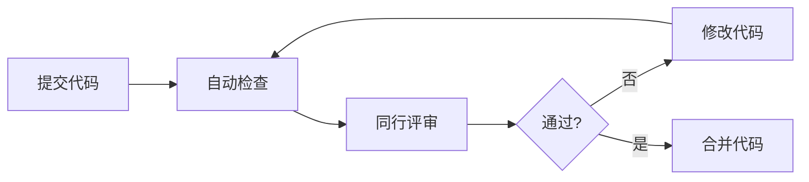

---
title: 编码规范
description: 编码规范知识，包含MISRA C、CERT C和代码审查清单
difficulty: 中级
estimated_time: 5小时
tags:
- 编码规范
- MISRA C
- CERT C
- 代码审查
related_modules:
- zh/software-engineering/architecture-design
- zh/software-engineering/static-analysis
- zh/regulatory-standards/iec-62304
last_updated: '2026-02-07'
version: '1.0'
language: zh-CN
---

# 编码规范

## 学习目标

完成本模块后，你将能够：
- 理解编码规范在医疗器械软件开发中的重要性
- 掌握MISRA C编码标准的核心规则
- 了解CERT C安全编码实践
- 学会进行有效的代码审查
- 应用编码规范提高代码质量和安全性

## 前置知识

- C/C++编程基础
- 软件工程基础
- 嵌入式系统开发经验

## 编码规范概述

### 为什么需要编码规范？

在医疗器械软件开发中，编码规范至关重要：
- **安全性**：避免常见的编程错误
- **可靠性**：提高代码质量和稳定性
- **可维护性**：统一的代码风格便于维护
- **合规性**：满足IEC 62304等标准要求
- **可审查性**：便于代码审查和认证

### 常见编码标准

**MISRA C**：
- 汽车和医疗行业广泛使用
- 关注安全性和可靠性
- 规则明确，易于检查

**CERT C**：
- 关注安全编码
- 防止常见漏洞
- 由CERT/CC维护

**BARR-C**：
- 嵌入式系统编码标准
- 实用性强
- 易于理解

## MISRA C标准

### MISRA C概述

MISRA C是由汽车工业软件可靠性协会（MISRA）制定的C语言编码标准，目前最新版本是MISRA C:2012。

### MISRA C规则分类

**必需规则（Required）**：
- 必须遵守
- 违反需要正式偏离

**建议规则（Advisory）**：
- 应该遵守
- 违反需要记录

**强制规则（Mandatory）**：
- 绝对必须遵守
- 不允许偏离

### MISRA C核心规则

#### 1. 环境规则

**规则1.1**：所有代码应符合ISO C标准
```c
// 不好：使用编译器特定扩展
__attribute__((packed)) struct Data {
    uint8_t value;
};

// 好：使用标准C
struct Data {
    uint8_t value;
} __attribute__((packed));  // 如果必须使用，应文档化
```

**规则1.3**：不应出现未定义行为
```c
// 不好：未定义行为
int x = 5;
int y = x++ + x++;  // 未定义

// 好：明确的顺序
int x = 5;
int y = x;
x++;
y += x;
x++;
```

#### 2. 类型规则

**规则8.1**：类型应明确指定
```c
// 不好：隐式int
func() {  // 返回类型未指定
    return 0;
}

// 好：明确类型
int func(void) {
    return 0;
}
```

**规则8.2**：函数类型应完整声明
```c
// 不好：旧式声明
int add();  // 参数未指定

// 好：完整声明
int add(int a, int b);
```

**规则10.1**：不应使用隐式类型转换
```c
// 不好：隐式转换
uint8_t a = 200;
uint8_t b = 100;
uint8_t c = a + b;  // 可能溢出

// 好：显式转换和检查
uint8_t a = 200;
uint8_t b = 100;
uint16_t temp = (uint16_t)a + (uint16_t)b;
if (temp > 255) {
    // 处理溢出
}
uint8_t c = (uint8_t)temp;
```

#### 3. 指针规则

**规则11.1**：不应在不兼容类型间转换
```c
// 不好：不兼容类型转换
int* p = (int*)0x1000;  // 整数到指针

// 好：使用正确的类型
volatile uint32_t* reg = (volatile uint32_t*)0x40000000;
```

**规则11.5**：不应移除const或volatile限定符
```c
// 不好：移除const
const int* cp = &value;
int* p = (int*)cp;  // 移除const

// 好：保持const
const int* cp = &value;
const int* p = cp;
```

#### 4. 表达式规则

**规则12.1**：运算符优先级应明确
```c
// 不好：依赖优先级
if (a & b == c) {  // 可能不是预期的
}

// 好：使用括号
if ((a & b) == c) {
}
```

**规则13.2**：表达式的值不应依赖求值顺序
```c
// 不好：依赖求值顺序
x = f() + g();  // f和g的调用顺序未定义

// 好：明确顺序
int temp1 = f();
int temp2 = g();
x = temp1 + temp2;
```

#### 5. 控制流规则

**规则14.3**：控制表达式不应为常量
```c
// 不好：常量条件
if (1) {  // 总是真
    // ...
}

// 好：有意义的条件
if (sensor_ready) {
    // ...
}
```

**规则15.5**：函数应有单一出口点
```c
// 不好：多个返回点
int process_data(int* data) {
    if (data == NULL) {
        return -1;
    }
    if (*data < 0) {
        return -2;
    }
    return 0;
}

// 好：单一出口点
int process_data(int* data) {
    int result = 0;
    
    if (data == NULL) {
        result = -1;
    } else if (*data < 0) {
        result = -2;
    }
    
    return result;
}
```

#### 6. 函数规则

**规则17.7**：不应忽略函数返回值
```c
// 不好：忽略返回值
sensor_read(data);  // 忽略错误码

// 好：检查返回值
int status = sensor_read(data);
if (status != 0) {
    // 处理错误
}
```

**规则17.8**：不应修改函数参数
```c
// 不好：修改参数
void process(int value) {
    value++;  // 修改参数
    // ...
}

// 好：使用局部变量
void process(int value) {
    int temp = value;
    temp++;
    // ...
}
```

#### 7. 预处理器规则

**规则20.1**：#include指令应在文件开头
```c
// 不好：#include在代码中间
void func1(void);
#include "header.h"  // 不应在这里
void func2(void);

// 好：#include在开头
#include "header.h"
void func1(void);
void func2(void);
```

**规则20.7**：宏参数应加括号
```c
// 不好：宏参数无括号
#define SQUARE(x) x * x
int result = SQUARE(a + b);  // 展开为 a + b * a + b

// 好：宏参数加括号
#define SQUARE(x) ((x) * (x))
int result = SQUARE(a + b);  // 展开为 ((a + b) * (a + b))
```

## CERT C安全编码标准

### CERT C概述

CERT C是由卡内基梅隆大学CERT/CC维护的C语言安全编码标准，关注防止常见的安全漏洞。

### CERT C核心规则

#### 1. 整数安全（INT）

**INT30-C**：确保无符号整数运算不会回绕
```c
// 不好：可能回绕
unsigned int a = UINT_MAX;
unsigned int b = a + 1;  // 回绕到0

// 好：检查溢出
unsigned int a = UINT_MAX;
unsigned int b;
if (a < UINT_MAX) {
    b = a + 1;
} else {
    // 处理溢出
}
```

**INT32-C**：确保整数运算不会溢出
```c
// 不好：可能溢出
int a = INT_MAX;
int b = a + 1;  // 溢出

// 好：检查溢出
int a = INT_MAX;
int b;
if (a < INT_MAX) {
    b = a + 1;
} else {
    // 处理溢出
}
```

#### 2. 字符串安全（STR）

**STR31-C**：保证字符串有足够的空间
```c
// 不好：缓冲区溢出风险
char buffer[10];
strcpy(buffer, user_input);  // 可能溢出

// 好：使用安全函数
char buffer[10];
strncpy(buffer, user_input, sizeof(buffer) - 1);
buffer[sizeof(buffer) - 1] = '\0';
```

**STR32-C**：不要向字符串函数传递非空终止字符串
```c
// 不好：非空终止字符串
char buffer[10];
memcpy(buffer, source, 10);
strlen(buffer);  // 可能越界

// 好：确保空终止
char buffer[10];
memcpy(buffer, source, 9);
buffer[9] = '\0';
strlen(buffer);
```

#### 3. 内存管理（MEM）

**MEM30-C**：不要访问已释放的内存
```c
// 不好：使用已释放的内存
int* p = malloc(sizeof(int));
free(p);
*p = 10;  // 使用已释放的内存

// 好：释放后置NULL
int* p = malloc(sizeof(int));
free(p);
p = NULL;
if (p != NULL) {
    *p = 10;
}
```

**MEM31-C**：释放动态分配的内存
```c
// 不好：内存泄漏
void func(void) {
    int* p = malloc(sizeof(int));
    // 忘记释放
}

// 好：释放内存
void func(void) {
    int* p = malloc(sizeof(int));
    if (p != NULL) {
        // 使用p
        free(p);
    }
}
```

#### 4. 输入验证（FIO）

**FIO30-C**：排除文件名中的无效字符
```c
// 不好：未验证文件名
void open_file(const char* filename) {
    FILE* fp = fopen(filename, "r");
}

// 好：验证文件名
bool is_valid_filename(const char* filename) {
    // 检查非法字符
    const char* invalid = "<>:\"|?*";
    return strpbrk(filename, invalid) == NULL;
}

void open_file(const char* filename) {
    if (is_valid_filename(filename)) {
        FILE* fp = fopen(filename, "r");
    }
}
```

#### 5. 并发安全（CON）

**CON30-C**：正确清理线程特定存储
```c
// 不好：未清理线程存储
pthread_key_t key;
pthread_key_create(&key, NULL);
// 忘记删除

// 好：清理线程存储
pthread_key_t key;
pthread_key_create(&key, cleanup_function);
// 使用后
pthread_key_delete(key);
```

## 代码审查

### 代码审查的重要性

- 发现缺陷
- 知识共享
- 提高代码质量
- 确保合规性

### 代码审查检查表

#### 通用检查

**代码风格**：
- [ ] 命名规范一致
- [ ] 缩进和格式正确
- [ ] 注释充分且准确
- [ ] 无多余的代码

**功能正确性**：
- [ ] 实现符合需求
- [ ] 逻辑正确
- [ ] 边界条件处理
- [ ] 错误处理完整

**安全性**：
- [ ] 输入验证
- [ ] 缓冲区溢出检查
- [ ] 整数溢出检查
- [ ] 资源释放

**性能**：
- [ ] 无不必要的计算
- [ ] 算法效率合理
- [ ] 内存使用合理

#### MISRA C检查

- [ ] 无隐式类型转换
- [ ] 指针使用安全
- [ ] 无未定义行为
- [ ] 函数返回值检查
- [ ] 宏定义正确

#### 医疗器械特定检查

- [ ] 符合IEC 62304要求
- [ ] 风险控制措施实现
- [ ] 可追溯到需求
- [ ] 关键功能有冗余
- [ ] 错误处理符合安全要求

### 代码审查流程



**说明**: 这是代码审查流程图。代码提交后先进行自动检查(静态分析、编译、测试)，然后进行同行评审。如果不通过，需要修改代码并重新检查；通过后才能合并代码。这确保了代码质量。


### 代码审查最佳实践

**审查前**：
- 代码自检
- 运行静态分析
- 确保编译通过
- 运行单元测试

**审查中**：
- 关注重要问题
- 提供建设性反馈
- 使用检查表
- 记录问题

**审查后**：
- 及时修改
- 验证修改
- 更新文档

## 命名规范

### 变量命名

**规则**：
- 使用有意义的名称
- 避免单字母变量（除循环变量）
- 使用小写字母和下划线

**示例**：
```c
// 不好
int x;
int d;

// 好
int sensor_value;
int measurement_count;
```

### 函数命名

**规则**：
- 使用动词开头
- 描述功能
- 模块前缀

**示例**：
```c
// 不好
int data(void);

// 好
int sensor_read_data(void);
int alarm_check_threshold(void);
```

### 常量命名

**规则**：
- 全大写
- 下划线分隔

**示例**：
```c
// 不好
const int maxvalue = 100;

// 好
#define MAX_SENSOR_VALUE 100
const int MAX_RETRY_COUNT = 3;
```

### 类型命名

**规则**：
- 使用_t后缀
- 描述性名称

**示例**：
```c
// 不好
typedef struct {
    int x;
} data;

// 好
typedef struct {
    int value;
} sensor_data_t;
```

## 注释规范

### 文件头注释

```c
/**
 * @file    sensor.c
 * @brief   Sensor module implementation
 * @author  John Doe
 * @date    2026-02-07
 * @version 1.0
 * 
 * @copyright Copyright (c) 2026 Company Name
 * 
 * This module implements sensor reading and processing functions.
 */
```

### 函数注释

```c
/**
 * @brief Read sensor data
 * 
 * This function reads data from the sensor and stores it in the
 * provided buffer. The function performs input validation and
 * error handling.
 * 
 * @param[out] data   Pointer to buffer for sensor data
 * @param[in]  size   Size of the buffer
 * @return     0 on success, negative error code on failure
 * 
 * @note This function is thread-safe
 * @warning Buffer must be at least MIN_BUFFER_SIZE bytes
 */
int sensor_read_data(uint8_t* data, size_t size);
```

### 代码注释

```c
// 检查传感器是否就绪
if (sensor_is_ready()) {
    // 读取数据
    status = sensor_read(&data);
    
    // 验证数据有效性
    if (validate_data(&data)) {
        // 处理有效数据
        process_data(&data);
    }
}
```

## 最佳实践

!!! tip "编码建议"
    1. **遵循标准**：选择并遵循一个编码标准（如MISRA C）
    2. **使用工具**：使用静态分析工具自动检查
    3. **代码审查**：进行定期代码审查
    4. **持续学习**：学习最新的安全编码实践
    5. **文档化**：充分注释代码
    6. **测试驱动**：编写可测试的代码
    7. **简单明了**：保持代码简单，避免过度复杂

## 常见陷阱

!!! warning "注意事项"
    1. **忽视警告**：编译器警告应该修复，不应忽略
    2. **过度优化**：不要牺牲可读性进行过早优化
    3. **魔法数字**：使用常量而非硬编码数字
    4. **全局变量**：尽量避免全局变量
    5. **深层嵌套**：避免过深的嵌套层次
    6. **长函数**：函数应该短小精悍
    7. **复制粘贴**：避免代码重复，提取公共函数

## 实践练习

1. 审查一段代码，找出MISRA C违规
2. 重构一段代码，使其符合CERT C标准
3. 为一个函数编写完整的注释
4. 进行一次代码审查，使用检查表

## 自测问题

??? question "问题1：MISRA C和CERT C有什么区别？"
    
    ??? success "答案"
        **MISRA C**：
        - 起源：汽车工业
        - 关注：安全性和可靠性
        - 规则：明确的编码规则
        - 检查：易于自动化检查
        - 应用：嵌入式系统、医疗器械
        
        **CERT C**：
        - 起源：网络安全
        - 关注：安全编码，防止漏洞
        - 规则：安全实践指南
        - 检查：部分可自动化
        - 应用：所有C语言项目
        
        **主要区别**：
        - MISRA C更关注可靠性，CERT C更关注安全性
        - MISRA C规则更严格，CERT C更灵活
        - MISRA C易于工具检查，CERT C需要人工判断
        
        **建议**：医疗器械软件应同时遵循两者

??? question "问题2：为什么要避免隐式类型转换？"
    
    ??? success "答案"
        **原因**：
        1. **数据丢失**：从大类型转换到小类型可能丢失数据
        2. **符号问题**：有符号和无符号转换可能导致错误
        3. **可读性**：隐式转换不明显，难以理解
        4. **可维护性**：隐式转换可能在修改时引入bug
        
        **示例问题**：
        ```c
        // 隐式转换导致的问题
        uint8_t a = 200;
        uint8_t b = 100;
        uint8_t c = a + b;  // 结果是44，而不是300
        // 因为a+b先提升为int(300)，然后截断为uint8_t(44)
        ```
        
        **解决方法**：
        ```c
        // 显式转换和检查
        uint8_t a = 200;
        uint8_t b = 100;
        uint16_t temp = (uint16_t)a + (uint16_t)b;
        if (temp > 255) {
            // 处理溢出
        }
        uint8_t c = (uint8_t)temp;
        ```

??? question "问题3：什么是缓冲区溢出？如何防止？"
    
    ??? success "答案"
        **缓冲区溢出**：向缓冲区写入超过其容量的数据，导致覆盖相邻内存。
        
        **危害**：
        - 程序崩溃
        - 数据损坏
        - 安全漏洞（可被利用执行恶意代码）
        
        **常见原因**：
        ```c
        // 不安全的函数
        char buffer[10];
        strcpy(buffer, user_input);  // 如果user_input>10字节，溢出
        gets(buffer);  // 永远不要使用gets
        sprintf(buffer, "%s", long_string);  // 可能溢出
        ```
        
        **防止方法**：
        
        1. **使用安全函数**：
        ```c
        char buffer[10];
        strncpy(buffer, user_input, sizeof(buffer) - 1);
        buffer[sizeof(buffer) - 1] = '\0';
        
        snprintf(buffer, sizeof(buffer), "%s", string);
        ```
        
        2. **检查长度**：
        ```c
        if (strlen(input) < sizeof(buffer)) {
            strcpy(buffer, input);
        }
        ```
        
        3. **使用边界检查**：
        ```c
        for (int i = 0; i < sizeof(buffer) && input[i] != '\0'; i++) {
            buffer[i] = input[i];
        }
        ```

??? question "问题4：为什么函数应该有单一出口点？"
    
    ??? success "答案"
        **MISRA C规则15.5**：函数应有单一出口点（单一return语句）
        
        **原因**：
        1. **资源清理**：确保所有资源都被释放
        2. **可维护性**：容易理解函数的退出逻辑
        3. **调试方便**：只需在一个地方设置断点
        4. **错误处理**：统一的错误处理逻辑
        
        **示例**：
        ```c
        // 多个出口点（不推荐）
        int process_data(int* data) {
            if (data == NULL) {
                return -1;  // 出口1
            }
            if (*data < 0) {
                return -2;  // 出口2
            }
            // 处理
            return 0;  // 出口3
        }
        
        // 单一出口点（推荐）
        int process_data(int* data) {
            int result = 0;
            
            if (data == NULL) {
                result = -1;
            } else if (*data < 0) {
                result = -2;
            } else {
                // 处理
                result = 0;
            }
            
            // 清理资源（如果有）
            
            return result;  // 唯一出口
        }
        ```
        
        **例外**：某些情况下多个返回点更清晰，但应谨慎使用

??? question "问题5：代码审查应该关注什么？"
    
    ??? success "答案"
        **代码审查关注点**：
        
        1. **功能正确性**：
           - 是否实现了需求
           - 逻辑是否正确
           - 边界条件是否处理
        
        2. **代码质量**：
           - 代码是否清晰易读
           - 命名是否有意义
           - 注释是否充分
           - 是否有代码重复
        
        3. **安全性**：
           - 输入是否验证
           - 缓冲区是否检查
           - 资源是否正确释放
           - 是否有安全漏洞
        
        4. **性能**：
           - 算法是否高效
           - 是否有不必要的计算
           - 内存使用是否合理
        
        5. **合规性**：
           - 是否符合编码标准（MISRA C）
           - 是否符合架构设计
           - 是否可追溯到需求
        
        6. **可测试性**：
           - 是否易于测试
           - 是否有单元测试
           - 测试覆盖是否充分
        
        7. **可维护性**：
           - 是否易于理解
           - 是否易于修改
           - 是否有文档

??? question "问题6：什么是魔法数字？为什么要避免？"
    
    ??? success "答案"
        **魔法数字**：代码中直接出现的数字字面量，没有说明其含义。
        
        **问题**：
        1. **可读性差**：不知道数字的含义
        2. **难以维护**：修改时需要找到所有出现的地方
        3. **容易出错**：可能遗漏某些地方
        
        **示例**：
        ```c
        // 不好：魔法数字
        if (temperature > 37.5) {
            trigger_alarm();
        }
        
        if (pressure > 140) {
            trigger_alarm();
        }
        
        delay(1000);  // 1000是什么？毫秒？微秒？
        ```
        
        **解决方法**：
        ```c
        // 好：使用命名常量
        #define FEVER_THRESHOLD_CELSIUS 37.5
        #define HIGH_BLOOD_PRESSURE_THRESHOLD 140
        #define DELAY_ONE_SECOND_MS 1000
        
        if (temperature > FEVER_THRESHOLD_CELSIUS) {
            trigger_alarm();
        }
        
        if (pressure > HIGH_BLOOD_PRESSURE_THRESHOLD) {
            trigger_alarm();
        }
        
        delay(DELAY_ONE_SECOND_MS);
        ```
        
        **例外**：
        - 0, 1, -1 等常见值可以直接使用
        - 数组索引可以直接使用
        - 但最好也使用常量以提高可读性

## 相关资源

- [架构设计](../architecture-design/index.md)
- [静态分析](../static-analysis/index.md)
- [IEC 62304 - 软件生命周期](../../regulatory-standards/iec-62304/index.md)

## 参考文献

1. MISRA C:2012 - Guidelines for the use of the C language in critical systems
2. CERT C Coding Standard - Rules for Developing Safe, Reliable, and Secure Systems
3. BARR-C:2018 - Embedded C Coding Standard
4. IEC 62304:2006+AMD1:2015 - Medical device software - Software life cycle processes
5. 书籍：《The CERT C Coding Standard》by Robert C. Seacord
