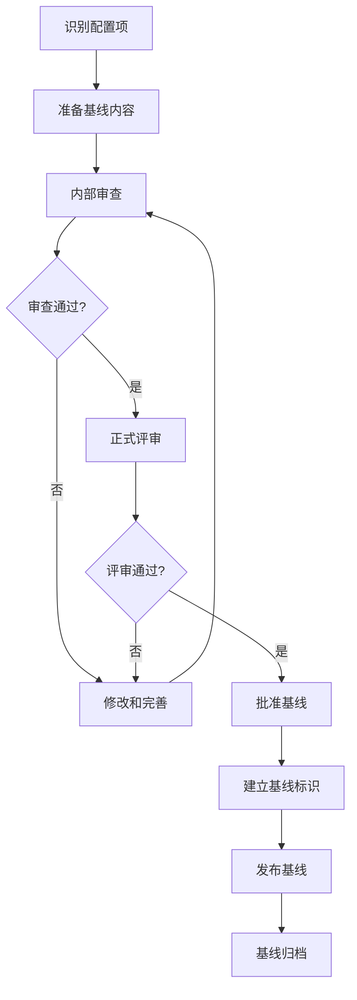
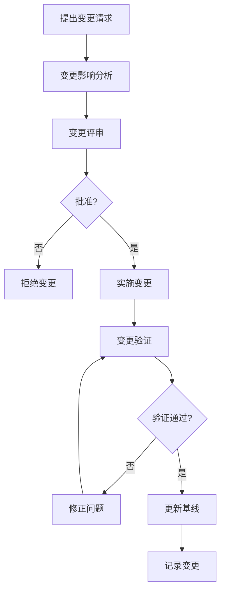

# 基线管理

## 学习目标

完成本模块后，你将能够：
- 理解基线的概念和重要性
- 掌握基线建立的流程和方法
- 实施基线变更控制
- 管理多个基线版本
- 遵循IEC 62304对基线管理的要求
- 应用基线管理最佳实践

## 前置知识

- 版本控制基础（Git）
- 软件开发生命周期
- 配置管理概念
- IEC 62304标准基础知识
- 变更管理流程

## 内容

### 基线基础概念

**基线定义**：
基线（Baseline）是在软件开发生命周期的特定时间点，经过正式审查和批准的一组配置项的集合。基线一旦建立，就成为进一步开发的基础，任何变更都必须经过正式的变更控制流程。

**基线的特征**：

```
1. 正式性：经过正式审查和批准
2. 稳定性：建立后不可随意修改
3. 可追溯性：所有配置项都有明确标识
4. 完整性：包含所有必需的配置项
5. 一致性：配置项之间相互一致
```

**基线的目的**：
- 提供稳定的开发基础
- 控制变更，防止混乱
- 支持并行开发和维护
- 满足法规要求（IEC 62304）
- 支持产品发布和交付
- 便于问题追溯和回滚

**基线与版本的区别**：

```
版本（Version）：
- 软件的一个特定状态
- 可以是任何时间点的快照
- 不一定经过正式审查

基线（Baseline）：
- 经过正式审查和批准的版本
- 具有特殊的管理地位
- 变更需要正式流程
- 通常对应重要的里程碑
```

**说明**: 这是版本和基线的区别说明。版本是软件的任何时间点快照，不一定经过正式审查；基线是经过正式审查和批准的版本，具有特殊管理地位，变更需要正式流程，通常对应重要里程碑。


### 基线类型

#### 1. 功能基线（Functional Baseline）

**定义**：系统需求规格说明书（SRS）经过审查批准后建立的基线。

**包含内容**：

```
- 系统需求文档
- 用户需求文档
- 需求追溯矩阵
- 验收标准
```

**建立时机**：需求分析阶段完成后

**示例**：
```bash
# 创建功能基线标签
git tag -a functional-baseline-v1.0 -m "功能基线 v1.0

基线内容：
- 系统需求规格说明书 v1.0
- 用户需求文档 v1.0
- 需求追溯矩阵 v1.0

审批记录：
- 需求负责人：张三 (2026-01-15)
- 项目经理：李四 (2026-01-15)
- 质量经理：王五 (2026-01-16)

状态：已批准
日期：2026-01-16"
```

#### 2. 分配基线（Allocated Baseline）

**定义**：系统设计规格说明书（SDD）经过审查批准后建立的基线。

**包含内容**：
```
- 软件设计文档
- 架构设计文档
- 接口设计文档
- 数据库设计文档
- 设计追溯矩阵
```

**建立时机**：详细设计阶段完成后


**示例**：
```bash
# 创建分配基线标签
git tag -a allocated-baseline-v1.0 -m "分配基线 v1.0

基线内容：
- 软件设计文档 v1.0
- 架构设计文档 v1.0
- 接口设计文档 v1.0

审批记录：
- 设计负责人：张三 (2026-02-01)
- 架构师：李四 (2026-02-01)
- 质量经理：王五 (2026-02-02)

状态：已批准
日期：2026-02-02"
```

#### 3. 产品基线（Product Baseline）

**定义**：软件产品经过测试和验证，准备发布时建立的基线。

**包含内容**：
```
- 所有源代码
- 构建脚本和配置
- 测试用例和测试数据
- 用户文档
- 安装和部署文档
- 发布说明
- 验证报告
```

**建立时机**：产品发布前

**示例**：
```bash
# 创建产品基线标签
git tag -a product-baseline-v1.0.0 -m "产品基线 v1.0.0

基线内容：
- 源代码（所有模块）
- 构建脚本
- 测试套件（单元、集成、系统）
- 用户手册 v1.0
- 安装指南 v1.0
- 发布说明 v1.0

测试状态：
- 单元测试：100%通过
- 集成测试：100%通过
- 系统测试：100%通过
- 代码覆盖率：95%

符合标准：
- IEC 62304 Class B
- IEC 60601-1

审批记录：
- 开发负责人：张三 (2026-02-08)
- 测试负责人：李四 (2026-02-08)
- 质量负责人：王五 (2026-02-09)
- 法规负责人：赵六 (2026-02-09)

状态：已批准，可发布
日期：2026-02-09"
```


#### 4. 开发基线（Development Baseline）

**定义**：开发过程中的中间基线，用于内部开发和测试。

**包含内容**：
```
- 当前开发代码
- 开发文档
- 内部测试用例
```

**建立时机**：开发阶段的重要里程碑

**特点**：
- 相对非正式
- 变更控制较宽松
- 主要用于团队内部协调

### 基线建立流程

#### 基线建立的步骤



**步骤1：识别配置项**

确定哪些项目应该包含在基线中。

```bash
# 配置项清单示例
配置项列表：
1. 源代码文件
   - src/ecg_processor.c
   - src/alarm_manager.c
   - src/sensor_interface.c
   - include/ecg_processor.h
   - include/alarm_manager.h

2. 文档
   - docs/requirements/SRS_v1.0.md
   - docs/design/SDD_v1.0.md
   - docs/test/test_plan_v1.0.md

3. 构建脚本
   - Makefile
   - build.sh
   - config.mk

4. 测试资源
   - tests/unit/test_ecg.c
   - tests/integration/test_system.c
   - tests/data/test_signals.dat
```


**步骤2：准备基线内容**

确保所有配置项都是最新的、完整的、一致的。

```bash
# 检查清单
☐ 所有代码已提交
☐ 所有文档已更新
☐ 版本号已更新
☐ 变更日志已更新
☐ 测试已通过
☐ 代码审查已完成
☐ 静态分析无问题
☐ 追溯矩阵已更新
```

**步骤3：内部审查**

团队内部检查基线内容的完整性和正确性。

```bash
# 内部审查检查项
1. 完整性检查
   - 所有必需文件都包含
   - 没有遗漏的配置项

2. 一致性检查
   - 代码与设计一致
   - 文档与代码一致
   - 版本号一致

3. 质量检查
   - 代码质量符合标准
   - 文档质量符合要求
   - 测试覆盖率达标
```

**步骤4：正式评审**

组织正式的基线评审会议。

```
评审会议：
- 参与人员：项目经理、开发负责人、测试负责人、质量经理
- 评审内容：基线内容、测试结果、质量报告
- 评审标准：符合项目计划和质量标准
- 评审结果：通过/不通过/有条件通过
```

**步骤5：批准基线**

获得授权人员的正式批准。

```bash
# 批准记录模板
基线批准记录

基线名称：产品基线 v1.0.0
基线日期：2026-02-09

批准人员：
- 开发负责人：张三 ✓ (2026-02-08)
- 测试负责人：李四 ✓ (2026-02-08)
- 质量负责人：王五 ✓ (2026-02-09)
- 项目经理：赵六 ✓ (2026-02-09)

批准状态：已批准
```


**步骤6：建立基线标识**

在版本控制系统中创建基线标签。

```bash
# 创建基线标签
git tag -a product-baseline-v1.0.0 -m "产品基线 v1.0.0

[基线信息]
基线类型：产品基线
基线版本：1.0.0
建立日期：2026-02-09

[包含内容]
- 源代码：commit abc123
- 文档：docs/ 目录
- 测试：tests/ 目录
- 构建脚本：build/ 目录

[质量指标]
- 单元测试覆盖率：95%
- 集成测试：100%通过
- 静态分析：0个高危问题
- MISRA C合规性：100%

[审批记录]
- 开发：张三 (2026-02-08)
- 测试：李四 (2026-02-08)
- 质量：王五 (2026-02-09)
- 项目：赵六 (2026-02-09)

[状态]
已批准，可发布"

# 推送标签到远程仓库
git push origin product-baseline-v1.0.0
```

**步骤7：发布基线**

通知相关人员基线已建立，并提供访问方式。

```bash
# 发布通知
主题：产品基线 v1.0.0 已建立

各位同事：

产品基线 v1.0.0 已于2026-02-09正式建立并批准。

基线信息：
- 标签：product-baseline-v1.0.0
- 提交：abc123def456
- 位置：https://github.com/company/medical-device/releases/tag/product-baseline-v1.0.0

获取基线：
git fetch --tags
git checkout product-baseline-v1.0.0

注意事项：
- 此基线已锁定，不可修改
- 任何变更需要通过变更控制流程
- 基线文档已归档到文档管理系统

项目经理：赵六
日期：2026-02-09
```

**步骤8：基线归档**

将基线相关文档和记录归档保存。

```bash
# 归档结构
baseline-archives/
├── product-baseline-v1.0.0/
│   ├── baseline-approval.pdf        # 批准记录
│   ├── baseline-content-list.xlsx  # 内容清单
│   ├── review-minutes.pdf           # 评审会议纪要
│   ├── test-report.pdf              # 测试报告
│   ├── quality-report.pdf           # 质量报告
│   └── traceability-matrix.xlsx    # 追溯矩阵
```


### 基线变更控制

#### 变更控制流程

基线建立后，任何变更都必须经过正式的变更控制流程。



**变更请求（Change Request）**

```markdown
# 变更请求表单

## 基本信息
- CR编号：CR-2026-001
- 提出人：张三
- 提出日期：2026-02-15
- 优先级：高

## 变更描述
### 变更原因
在实际使用中发现心率报警阈值设置不合理，需要调整。

### 当前状态
当前阈值：心率 > 200 bpm 触发报警

### 期望状态
新阈值：心率 >= 180 bpm 触发报警

### 影响的基线
产品基线 v1.0.0

## 影响分析
### 影响的配置项
- src/alarm_manager.c
- docs/design/SDD_v1.0.md
- tests/unit/test_alarm.c

### 影响的需求
- REQ-ALARM-002：心率报警阈值

### 风险评估
- 技术风险：低
- 进度风险：低
- 成本影响：1人天

## 审批
- 开发负责人：□ 批准 □ 拒绝
- 测试负责人：□ 批准 □ 拒绝
- 质量负责人：□ 批准 □ 拒绝
```


**变更影响分析**

```bash
# 影响分析检查清单
1. 技术影响
   ☐ 影响哪些模块？
   ☐ 是否影响接口？
   ☐ 是否影响性能？
   ☐ 是否引入新的依赖？

2. 文档影响
   ☐ 需要更新哪些文档？
   ☐ 需求文档
   ☐ 设计文档
   ☐ 测试文档
   ☐ 用户文档

3. 测试影响
   ☐ 需要新增测试用例？
   ☐ 需要修改现有测试？
   ☐ 需要回归测试？

4. 进度影响
   ☐ 需要多少工作量？
   ☐ 是否影响发布计划？

5. 风险影响
   ☐ 是否引入新风险？
   ☐ 是否需要风险评估？
```

**变更实施**

```bash
# 1. 创建变更分支
git checkout product-baseline-v1.0.0
git checkout -b change/CR-2026-001

# 2. 实施变更
# 修改代码
vim src/alarm_manager.c

# 3. 提交变更
git add src/alarm_manager.c
git commit -m "fix(alarm): 调整心率报警阈值

变更请求：CR-2026-001
变更原因：实际使用中发现阈值设置不合理

变更内容：
- 将心率报警阈值从200 bpm调整为180 bpm
- 更新相关测试用例

影响分析：
- 影响模块：alarm_manager
- 影响文档：SDD v1.0
- 测试影响：需要更新单元测试

Refs: CR-2026-001, REQ-ALARM-002"

# 4. 更新文档
vim docs/design/SDD_v1.0.md
git add docs/design/SDD_v1.0.md
git commit -m "docs: 更新报警阈值文档

Refs: CR-2026-001"

# 5. 更新测试
vim tests/unit/test_alarm.c
git add tests/unit/test_alarm.c
git commit -m "test: 更新报警阈值测试用例

Refs: CR-2026-001"
```


**变更验证**

```bash
# 运行测试验证变更
make test

# 检查代码质量
make static-analysis

# 生成测试报告
make test-report

# 验证追溯性
# 确保变更与需求、设计、测试都有追溯关系
```

**更新基线**

```bash
# 合并变更到主分支
git checkout main
git merge --no-ff change/CR-2026-001

# 创建新的基线
git tag -a product-baseline-v1.0.1 -m "产品基线 v1.0.1

[变更信息]
变更请求：CR-2026-001
变更类型：Bug修复
变更描述：调整心率报警阈值

[变更内容]
- src/alarm_manager.c：修改报警阈值
- docs/design/SDD_v1.0.md：更新文档
- tests/unit/test_alarm.c：更新测试

[测试状态]
- 单元测试：100%通过
- 回归测试：100%通过
- 代码覆盖率：95%

[审批记录]
- 开发负责人：张三 (2026-02-16)
- 测试负责人：李四 (2026-02-16)
- 质量负责人：王五 (2026-02-17)

[状态]
已批准"

# 推送新基线
git push origin product-baseline-v1.0.1
```

**变更记录**

```markdown
# 变更记录

## CR-2026-001：调整心率报警阈值

### 基本信息
- 变更类型：Bug修复
- 影响基线：product-baseline-v1.0.0 → v1.0.1
- 实施日期：2026-02-16
- 批准日期：2026-02-17

### 变更内容
- 修改心率报警阈值从200 bpm到180 bpm
- 更新设计文档
- 更新测试用例

### 影响分析
- 影响模块：alarm_manager
- 影响文档：SDD
- 测试影响：单元测试

### 验证结果
- 单元测试：通过
- 回归测试：通过
- 代码审查：通过

### 审批记录
- 开发：张三 ✓
- 测试：李四 ✓
- 质量：王五 ✓
```


### 多基线管理

#### 并行基线维护

医疗器械软件通常需要维护多个版本的基线。

```
产品线：
├── v1.0.x（维护版本）
│   ├── product-baseline-v1.0.0
│   ├── product-baseline-v1.0.1
│   └── product-baseline-v1.0.2
│
├── v1.1.x（当前版本）
│   ├── product-baseline-v1.1.0
│   └── product-baseline-v1.1.1
│
└── v2.0.x（开发版本）
    └── development-baseline-v2.0.0-beta
```

**分支策略**：

```bash
# 主要分支
main              # 当前发布版本
├── release/v1.0  # v1.0维护分支
├── release/v1.1  # v1.1维护分支
└── develop       # v2.0开发分支

# 基线标签
product-baseline-v1.0.0  → release/v1.0
product-baseline-v1.0.1  → release/v1.0
product-baseline-v1.1.0  → release/v1.1
product-baseline-v1.1.1  → release/v1.1
```

**跨版本变更**

某些变更可能需要应用到多个基线版本。

```bash
# 场景：安全漏洞修复需要应用到所有维护版本

# 1. 在最新版本修复
git checkout release/v1.1
git checkout -b hotfix/security-fix
# 修复代码
git commit -m "fix(security): 修复安全漏洞 CVE-2026-001"

# 2. 合并到v1.1
git checkout release/v1.1
git merge hotfix/security-fix
git tag -a product-baseline-v1.1.2 -m "安全修复版本"

# 3. 回溯到v1.0
git checkout release/v1.0
git cherry-pick <commit-hash>
git tag -a product-baseline-v1.0.3 -m "安全修复版本"

# 4. 合并到开发分支
git checkout develop
git merge hotfix/security-fix
```


#### 基线比较和追溯

**比较两个基线**：

```bash
# 查看两个基线之间的差异
git diff product-baseline-v1.0.0 product-baseline-v1.0.1

# 查看变更的文件列表
git diff --name-only product-baseline-v1.0.0 product-baseline-v1.0.1

# 查看变更统计
git diff --stat product-baseline-v1.0.0 product-baseline-v1.0.1

# 生成变更报告
git log product-baseline-v1.0.0..product-baseline-v1.0.1 \
  --pretty=format:"%h %s" > changes-v1.0.0-to-v1.0.1.txt
```

**基线追溯**：

```bash
# 查找某个文件在哪个基线中被修改
git tag --contains <commit-hash>

# 查看某个基线的完整信息
git show product-baseline-v1.0.0

# 查看基线中某个文件的内容
git show product-baseline-v1.0.0:src/alarm_manager.c

# 生成基线追溯矩阵
git log --all --grep="REQ-" --pretty=format:"%h,%s,%d" \
  > baseline-traceability.csv
```

### 医疗器械软件基线管理

#### IEC 62304要求

**配置管理要求（5.1.9）**：

```
IEC 62304 5.1.9 配置管理：

a) 识别配置项
   - 定义哪些项目需要纳入配置管理
   - 为每个配置项分配唯一标识

b) 控制配置项的修改
   - 建立变更控制流程
   - 所有变更必须经过批准

c) 记录配置项的状态
   - 记录配置项的版本
   - 记录配置项的变更历史

d) 实施配置审核
   - 定期审核配置项的一致性
   - 验证配置项与文档的一致性
```

**基线管理实施**：

```markdown
# 配置管理计划

## 1. 配置项识别

### 1.1 源代码
- 所有.c和.h文件
- 构建脚本和配置文件
- 第三方库（如果包含）

### 1.2 文档
- 需求规格说明书（SRS）
- 设计规格说明书（SDD）
- 测试计划和测试报告
- 用户手册
- 风险管理文件

### 1.3 工具和环境
- 编译器版本
- 开发工具版本
- 测试工具版本

## 2. 基线类型

### 2.1 功能基线
- 时机：需求评审通过后
- 内容：SRS、需求追溯矩阵
- 批准：项目经理、质量经理

### 2.2 分配基线
- 时机：设计评审通过后
- 内容：SDD、设计追溯矩阵
- 批准：架构师、质量经理

### 2.3 产品基线
- 时机：产品发布前
- 内容：所有配置项
- 批准：所有关键角色

## 3. 变更控制流程

### 3.1 变更请求
- 提交变更请求表单
- 包含变更原因和影响分析

### 3.2 变更评审
- 技术评审
- 风险评估
- 进度和成本评估

### 3.3 变更批准
- 根据影响级别确定批准权限
- 高影响：需要质量经理批准
- 中影响：需要项目经理批准
- 低影响：需要开发负责人批准

### 3.4 变更实施
- 按照批准的方案实施
- 更新相关文档
- 更新测试用例

### 3.5 变更验证
- 运行测试验证
- 代码审查
- 文档审查

### 3.6 变更记录
- 记录变更历史
- 更新追溯矩阵
- 归档变更文档

## 4. 配置审核

### 4.1 物理审核
- 验证配置项的物理存在
- 检查版本标识的正确性

### 4.2 功能审核
- 验证配置项与需求的一致性
- 验证配置项之间的一致性

### 4.3 审核频率
- 每个基线建立时
- 每次重大变更后
- 定期审核（每季度）
```


#### 基线审核

**物理审核（Physical Audit）**：

```bash
# 物理审核检查清单

1. 配置项完整性
   ☐ 所有配置项都存在
   ☐ 没有遗漏的文件
   ☐ 没有多余的文件

2. 版本标识
   ☐ 每个文件都有版本标识
   ☐ 版本号正确
   ☐ 标签信息完整

3. 存储和备份
   ☐ 基线已正确存储
   ☐ 备份已创建
   ☐ 可以成功恢复

# 审核脚本示例
#!/bin/bash
echo "基线物理审核报告" > audit-report.txt
echo "==================" >> audit-report.txt
echo "" >> audit-report.txt

# 检查标签是否存在
echo "1. 检查基线标签" >> audit-report.txt
git tag -l "product-baseline-*" >> audit-report.txt
echo "" >> audit-report.txt

# 检查配置项
echo "2. 配置项清单" >> audit-report.txt
git ls-tree -r product-baseline-v1.0.0 --name-only >> audit-report.txt
echo "" >> audit-report.txt

# 检查文件数量
echo "3. 文件统计" >> audit-report.txt
git ls-tree -r product-baseline-v1.0.0 | wc -l >> audit-report.txt
```

**功能审核（Functional Audit）**：

```bash
# 功能审核检查清单

1. 需求追溯
   ☐ 所有需求都有对应的设计
   ☐ 所有设计都有对应的代码
   ☐ 所有代码都有对应的测试

2. 文档一致性
   ☐ 代码与设计文档一致
   ☐ 测试与需求一致
   ☐ 用户文档与功能一致

3. 测试覆盖
   ☐ 所有需求都有测试用例
   ☐ 测试覆盖率达标
   ☐ 所有测试都通过

# 追溯性检查脚本
#!/bin/bash
echo "基线功能审核报告" > functional-audit.txt
echo "==================" >> functional-audit.txt

# 提取需求追溯
echo "1. 需求追溯" >> functional-audit.txt
git log product-baseline-v1.0.0 --grep="REQ-" \
  --pretty=format:"%h %s" >> functional-audit.txt
echo "" >> functional-audit.txt

# 检查测试覆盖率
echo "2. 测试覆盖率" >> functional-audit.txt
make coverage
cat coverage-report.txt >> functional-audit.txt
```


### 基线管理工具和自动化

#### Git标签管理

**标签命名规范**：

```bash
# 基线标签命名规范
<基线类型>-baseline-<版本号>

示例：
functional-baseline-v1.0      # 功能基线
allocated-baseline-v1.0       # 分配基线
product-baseline-v1.0.0       # 产品基线
development-baseline-v2.0.0-alpha  # 开发基线
```

**标签管理脚本**：

```bash
#!/bin/bash
# baseline-manager.sh - 基线管理脚本

# 创建基线
create_baseline() {
    local baseline_type=$1
    local version=$2
    local message=$3
    
    local tag_name="${baseline_type}-baseline-${version}"
    
    echo "创建基线: ${tag_name}"
    git tag -a "${tag_name}" -m "${message}"
    git push origin "${tag_name}"
    
    echo "基线创建成功: ${tag_name}"
}

# 列出所有基线
list_baselines() {
    echo "所有基线列表："
    git tag -l "*-baseline-*" --sort=-version:refname
}

# 比较两个基线
compare_baselines() {
    local baseline1=$1
    local baseline2=$2
    
    echo "比较基线: ${baseline1} vs ${baseline2}"
    git diff --stat "${baseline1}" "${baseline2}"
}

# 导出基线
export_baseline() {
    local baseline=$1
    local output_dir=$2
    
    echo "导出基线: ${baseline} 到 ${output_dir}"
    git archive --format=tar.gz \
        --prefix="${baseline}/" \
        -o "${output_dir}/${baseline}.tar.gz" \
        "${baseline}"
}

# 验证基线
verify_baseline() {
    local baseline=$1
    
    echo "验证基线: ${baseline}"
    
    # 检查标签是否存在
    if ! git rev-parse "${baseline}" >/dev/null 2>&1; then
        echo "错误：基线不存在"
        return 1
    fi
    
    # 检查标签信息
    git show "${baseline}" --no-patch
    
    echo "基线验证完成"
}

# 主函数
case "$1" in
    create)
        create_baseline "$2" "$3" "$4"
        ;;
    list)
        list_baselines
        ;;
    compare)
        compare_baselines "$2" "$3"
        ;;
    export)
        export_baseline "$2" "$3"
        ;;
    verify)
        verify_baseline "$2"
        ;;
    *)
        echo "用法: $0 {create|list|compare|export|verify}"
        exit 1
        ;;
esac
```

**代码说明**：
- `create_baseline`：创建新基线标签
- `list_baselines`：列出所有基线
- `compare_baselines`：比较两个基线的差异
- `export_baseline`：导出基线为压缩包
- `verify_baseline`：验证基线的有效性
(report)
    
    print(f"基线报告已生成：{output_file}")

if __name__ == '__main__':
    import sys
    if len(sys.argv) != 3:
        print("用法: baseline-report.py <基线标签> <输出文件>")
        sys.exit(1)
    
    generate_baseline_report(sys.argv[1], sys.argv[2])
```

**代码说明**：
- 自动提取基线信息
- 生成配置项清单
- 按目录分组显示文件
- 输出Markdown格式报告
ding='utf-8') as f:
        f.write
    with open(output_file, 'w', encor_name = file.split('/')[0] if '/' in file else '.'
        if dir_name not in files_by_dir:
            files_by_dir[dir_name] = []
        files_by_dir[dir_name].append(file)
    
    for dir_name in sorted(files_by_dir.keys()):
        report += f"\n### {dir_name}/\n"
        for file in sorted(files_by_dir[dir_name]):
            report += f"- {file}\n"
    
    # 写入文件 in info['files']:
        difiles,
        'file_count': len(files)
    }

def generate_baseline_report(baseline_tag, output_file):
    """生成基线报告"""
    info = get_baseline_info(baseline_tag)
    
    report = f"""# 基线报告

## 基线信息
- 基线标签：{info['tag']}
- 提交哈希：{info['commit']}
- 生成日期：{datetime.datetime.now().strftime('%Y-%m-%d %H:%M:%S')}

## 标签详情
```
{info['info']}
```

## 配置项统计
- 总文件数：{info['file_count']}

## 配置项清单
"""
    
    # 按目录分组
    files_by_dir = {}
    for filenfo,
        'files': arse', baseline_tag],
        universal_newlines=True
    ).strip()
    
    # 获取文件列表
    files = subprocess.check_output(
        ['git', 'ls-tree', '-r', baseline_tag, '--name-only'],
        universal_newlines=True
    ).strip().split('\n')
    
    return {
        'tag': baseline_tag,
        'commit': commit_hash,
        'info': tag_i

#### 基线文档生成

**自动生成基线报告**：

```python
#!/usr/bin/env python3
# baseline-report.py - 基线报告生成脚本

import subprocess
import datetime
import json

def get_baseline_info(baseline_tag):
    """获取基线信息"""
    # 获取标签信息
    tag_info = subprocess.check_output(
        ['git', 'show', baseline_tag, '--no-patch'],
        universal_newlines=True
    )
    
    # 获取提交哈希
    commit_hash = subprocess.check_output(
        ['git', 'rev-p


### 最佳实践

!!! tip "基线管理最佳实践"
    
    **1. 明确基线策略**
    - 定义清晰的基线类型
    - 确定基线建立的时机
    - 制定基线命名规范
    
    **2. 严格的变更控制**
    - 所有变更必须经过批准
    - 记录变更的原因和影响
    - 保持变更的可追溯性
    
    **3. 完整的文档**
    - 基线内容清单
    - 审批记录
    - 变更历史
    - 追溯矩阵
    
    **4. 定期审核**
    - 物理审核：验证配置项存在
    - 功能审核：验证一致性
    - 至少每季度一次
    
    **5. 自动化工具**
    - 使用脚本自动化基线创建
    - 自动生成基线报告
    - 自动化追溯性检查
    
    **6. 备份和归档**
    - 定期备份基线
    - 归档基线文档
    - 确保可恢复性
    
    **7. 培训团队**
    - 培训基线管理流程
    - 培训变更控制流程
    - 确保团队理解重要性
    
    **8. 持续改进**
    - 收集反馈
    - 优化流程
    - 更新工具和脚本


### 常见陷阱

!!! warning "注意事项"
    
    **1. 基线建立过于频繁**
    ```
    问题：每天都建立基线
    影响：管理负担过重，失去意义
    
    解决：
    - 只在重要里程碑建立基线
    - 功能基线、分配基线、产品基线
    - 开发过程中使用普通提交
    ```
    
    **2. 基线信息不完整**
    ```bash
    # 错误：标签信息过于简单
    git tag -a v1.0.0 -m "发布版本"
    
    # 正确：包含完整信息
    git tag -a product-baseline-v1.0.0 -m "产品基线 v1.0.0
    
    [基线信息]
    基线类型：产品基线
    建立日期：2026-02-09
    
    [包含内容]
    - 源代码
    - 文档
    - 测试
    
    [审批记录]
    - 开发：张三
    - 测试：李四
    - 质量：王五"
    ```
    
    **3. 绕过变更控制**
    ```
    问题：直接修改基线代码，不走变更流程
    影响：失去可追溯性，违反法规要求
    
    解决：
    - 设置分支保护
    - 强制使用Pull Request
    - 所有变更必须有CR编号
    ```
    
    **4. 基线与文档不一致**
    ```
    问题：代码更新了，文档没更新
    影响：审核失败，无法通过认证
    
    解决：
    - 变更时同时更新代码和文档
    - 定期进行功能审核
    - 使用自动化检查一致性
    ```

    
    **5. 没有备份基线**
    ```
    问题：只在一个地方存储基线
    影响：数据丢失风险
    
    解决：
    - 使用远程Git仓库
    - 定期导出基线归档
    - 多地备份
    ```
    
    **6. 基线审核流于形式**
    ```
    问题：审核只是走过场，不认真检查
    影响：问题积累，最终导致大问题
    
    解决：
    - 制定详细的审核检查清单
    - 使用自动化工具辅助审核
    - 记录审核发现的问题
    - 跟踪问题的解决
    ```
    
    **7. 多版本管理混乱**
    ```
    问题：不清楚哪个版本是哪个基线
    影响：发布错误版本，客户投诉
    
    解决：
    - 使用清晰的命名规范
    - 维护版本对照表
    - 使用分支策略管理多版本
    ```
    
    **8. 忽视追溯性**
    ```
    问题：提交信息不包含需求追溯
    影响：无法证明需求已实现
    
    解决：
    - 强制提交信息格式
    - 使用提交模板
    - 定期检查追溯性
    ```

**说明**: 这是常见问题及解决方案的示例。提交信息缺少需求追溯会导致无法证明需求已实现。解决方法包括强制提交信息格式、使用提交模板和定期检查追溯性，确保开发过程的可追溯性。


## 实践练习

1. **基础练习**：为一个小项目建立产品基线
   - 准备配置项清单
   - 创建基线标签
   - 编写基线信息

2. **中级练习**：实施基线变更控制
   - 提交变更请求
   - 进行影响分析
   - 实施变更
   - 更新基线

3. **高级练习**：管理多个并行基线
   - 维护v1.0和v1.1两个版本
   - 实施跨版本变更
   - 生成基线比较报告

4. **综合练习**：建立完整的基线管理体系
   - 编写配置管理计划
   - 定义基线类型和流程
   - 实施变更控制
   - 进行基线审核
   - 生成审核报告


## 自测问题

??? question "问题1：什么是基线？基线与普通版本有什么区别?"
    **问题**：解释基线的概念，并说明基线与普通版本的区别。
    
    ??? success "答案"
        **基线定义**：
        基线（Baseline）是在软件开发生命周期的特定时间点，经过正式审查和批准的一组配置项的集合。
        
        **基线的特征**：
        1. **正式性**：经过正式审查和批准
        2. **稳定性**：建立后不可随意修改
        3. **可追溯性**：所有配置项都有明确标识
        4. **完整性**：包含所有必需的配置项
        5. **一致性**：配置项之间相互一致
        
        **基线与版本的区别**：
        
        | 特性 | 版本（Version） | 基线（Baseline） |
        |------|----------------|-----------------|
        | 定义 | 软件的一个特定状态 | 经过正式审查批准的版本 |
        | 创建 | 任何时间点都可以 | 只在重要里程碑 |
        | 审查 | 不一定需要 | 必须经过正式审查 |
        | 批准 | 不需要 | 必须经过批准 |
        | 变更 | 可以随意修改 | 需要正式变更流程 |
        | 管理 | 相对宽松 | 严格控制 |
        | 用途 | 记录开发进度 | 作为开发基础 |
        
        **示例对比**：
        ```bash
        # 普通版本
        git commit -m "添加新功能"
        # 可以随时创建，不需要审查
        
        # 基线
        git tag -a product-baseline-v1.0.0 -m "产品基线
        
        经过审查批准：
        - 开发负责人：张三 ✓
        - 测试负责人：李四 ✓
        - 质量负责人：王五 ✓
        
        状态：已批准"
        # 需要正式审查和批准
        ```
        
        **知识点回顾**：基线是经过正式审查批准的特殊版本，具有更高的管理地位和更严格的变更控制。


??? question "问题2：医疗器械软件有哪些类型的基线？各自的用途是什么？"
    **问题**：列举医疗器械软件开发中的基线类型，并说明各自的建立时机和用途。
    
    ??? success "答案"
        **医疗器械软件基线类型**：
        
        **1. 功能基线（Functional Baseline）**
        
        **定义**：系统需求规格说明书（SRS）经过审查批准后建立的基线。
        
        **建立时机**：需求分析阶段完成后
        
        **包含内容**：
        - 系统需求文档
        - 用户需求文档
        - 需求追溯矩阵
        - 验收标准
        
        **用途**：
        - 作为设计的输入
        - 需求变更的基准
        - 验收测试的依据
        
        **示例**：
        ```bash
        git tag -a functional-baseline-v1.0 -m "功能基线 v1.0
        
        包含：
        - SRS v1.0
        - 用户需求 v1.0
        - 需求追溯矩阵 v1.0"
        ```
        
        **2. 分配基线（Allocated Baseline）**
        
        **定义**：系统设计规格说明书（SDD）经过审查批准后建立的基线。
        
        **建立时机**：详细设计阶段完成后
        
        **包含内容**：
        - 软件设计文档
        - 架构设计文档
        - 接口设计文档
        - 设计追溯矩阵
        
        **用途**：
        - 作为编码的输入
        - 设计变更的基准
        - 设计审查的依据
        
        **3. 产品基线（Product Baseline）**
        
        **定义**：软件产品经过测试和验证，准备发布时建立的基线。
        
        **建立时机**：产品发布前
        
        **包含内容**：
        - 所有源代码
        - 构建脚本和配置
        - 测试用例和测试数据
        - 用户文档
        - 验证报告
        
        **用途**：
        - 产品发布的依据
        - 维护和升级的基础
        - 法规审查的对象
        
        **示例**：
        ```bash
        git tag -a product-baseline-v1.0.0 -m "产品基线 v1.0.0
        
        测试状态：
        - 单元测试：100%通过
        - 集成测试：100%通过
        - 系统测试：100%通过
        
        符合标准：
        - IEC 62304 Class B
        - IEC 60601-1"
        ```
        
        **4. 开发基线（Development Baseline）**
        
        **定义**：开发过程中的中间基线。
        
        **建立时机**：开发阶段的重要里程碑
        
        **特点**：
        - 相对非正式
        - 变更控制较宽松
        - 主要用于团队内部
        
        **基线建立顺序**：
        ```
        需求阶段 → 功能基线
        设计阶段 → 分配基线
        开发阶段 → 开发基线（可选）
        发布阶段 → 产品基线
        ```
        
        **知识点回顾**：不同类型的基线对应软件开发的不同阶段，为后续工作提供稳定的基础。


??? question "问题3：基线建立的流程是什么？每个步骤的关键点是什么？"
    **问题**：描述基线建立的完整流程，并说明每个步骤的关键活动。
    
    ??? success "答案"
        **基线建立流程**：
        
        **步骤1：识别配置项**
        
        **关键活动**：
        - 确定哪些项目应该包含在基线中
        - 为每个配置项分配唯一标识
        - 编制配置项清单
        
        **检查点**：
        - 配置项清单完整
        - 没有遗漏重要文件
        - 标识唯一且清晰
        
        **步骤2：准备基线内容**
        
        **关键活动**：
        - 确保所有配置项都是最新的
        - 检查配置项的完整性
        - 验证配置项之间的一致性
        
        **检查清单**：
        ```
        ☐ 所有代码已提交
        ☐ 所有文档已更新
        ☐ 版本号已更新
        ☐ 测试已通过
        ☐ 代码审查已完成
        ☐ 追溯矩阵已更新
        ```
        
        **步骤3：内部审查**
        
        **关键活动**：
        - 团队内部检查基线内容
        - 验证完整性和一致性
        - 检查质量标准
        
        **审查内容**：
        - 完整性：所有必需文件都包含
        - 一致性：代码与文档一致
        - 质量：符合编码标准和质量要求
        
        **步骤4：正式评审**
        
        **关键活动**：
        - 组织正式的评审会议
        - 相关人员参与评审
        - 记录评审结果
        
        **评审参与者**：
        - 项目经理
        - 开发负责人
        - 测试负责人
        - 质量经理
        - （必要时）法规专员
        
        **评审内容**：
        - 基线内容是否完整
        - 测试结果是否满足要求
        - 质量指标是否达标
        - 是否符合法规要求
        
        **步骤5：批准基线**
        
        **关键活动**：
        - 获得授权人员的正式批准
        - 记录批准信息
        - 签署批准文档
        
        **批准记录**：
        ```
        基线批准记录
        
        基线名称：product-baseline-v1.0.0
        批准日期：2026-02-09
        
        批准人员：
        - 开发负责人：张三 ✓
        - 测试负责人：李四 ✓
        - 质量负责人：王五 ✓
        - 项目经理：赵六 ✓
        ```
        
        **步骤6：建立基线标识**
        
        **关键活动**：
        - 在版本控制系统中创建标签
        - 标签信息要详细完整
        - 推送到远程仓库
        
        **示例**：
        ```bash
        git tag -a product-baseline-v1.0.0 -m "详细的基线信息"
        git push origin product-baseline-v1.0.0
        ```
        
        **步骤7：发布基线**
        
        **关键活动**：
        - 通知相关人员
        - 提供访问方式
        - 说明使用注意事项
        
        **步骤8：基线归档**
        
        **关键活动**：
        - 归档基线文档
        - 归档审批记录
        - 归档测试报告
        - 确保可追溯性
        
        **归档内容**：
        - 批准记录
        - 配置项清单
        - 评审会议纪要
        - 测试报告
        - 质量报告
        - 追溯矩阵
        
        **流程图**：
        ```
        识别配置项 → 准备内容 → 内部审查 → 正式评审
                                              ↓
        基线归档 ← 发布基线 ← 建立标识 ← 批准基线
        ```
        
        **知识点回顾**：基线建立是一个严格的流程，需要经过多个步骤的检查和批准，确保基线的质量和可靠性。


??? question "问题4：基线建立后如何进行变更控制？"
    **问题**：说明基线变更控制的流程和关键要求。
    
    ??? success "答案"
        **基线变更控制原则**：
        
        基线一旦建立，就不能随意修改。任何变更都必须经过正式的变更控制流程。
        
        **变更控制流程**：
        
        **1. 提出变更请求（Change Request）**
        
        **内容要求**：
        - CR编号（唯一标识）
        - 提出人和日期
        - 变更原因
        - 当前状态和期望状态
        - 影响的基线
        - 优先级
        
        **示例**：
        ```markdown
        CR-2026-001：调整心率报警阈值
        
        提出人：张三
        日期：2026-02-15
        优先级：高
        
        变更原因：
        实际使用中发现阈值设置不合理
        
        当前状态：心率 > 200 bpm 触发报警
        期望状态：心率 >= 180 bpm 触发报警
        
        影响基线：product-baseline-v1.0.0
        ```
        
        **2. 变更影响分析**
        
        **分析内容**：
        ```
        技术影响：
        - 影响哪些模块？
        - 是否影响接口？
        - 是否影响性能？
        
        文档影响：
        - 需要更新哪些文档？
        - 需求、设计、测试文档
        
        测试影响：
        - 需要新增测试用例？
        - 需要修改现有测试？
        - 需要回归测试？
        
        进度影响：
        - 需要多少工作量？
        - 是否影响发布计划？
        
        风险影响：
        - 是否引入新风险？
        - 风险等级如何？
        ```
        
        **3. 变更评审**
        
        **评审内容**：
        - 变更的必要性
        - 影响分析的完整性
        - 实施方案的可行性
        - 风险的可接受性
        
        **评审决策**：
        - 批准：同意实施变更
        - 拒绝：不同意变更
        - 延期：暂缓实施
        - 有条件批准：需要满足特定条件
        
        **4. 变更实施**
        
        **实施步骤**：
        ```bash
        # 1. 创建变更分支
        git checkout product-baseline-v1.0.0
        git checkout -b change/CR-2026-001
        
        # 2. 实施变更
        # 修改代码、更新文档、更新测试
        
        # 3. 提交变更
        git commit -m "fix: 变更描述
        
        Refs: CR-2026-001"
        ```
        
        **5. 变更验证**
        
        **验证内容**：
        - 运行测试验证功能
        - 代码审查验证质量
        - 文档审查验证一致性
        - 追溯性检查
        
        **验证标准**：
        - 所有测试通过
        - 代码质量符合标准
        - 文档与代码一致
        - 追溯关系完整
        
        **6. 更新基线**
        
        **更新方式**：
        ```bash
        # 合并变更
        git checkout main
        git merge --no-ff change/CR-2026-001
        
        # 创建新基线
        git tag -a product-baseline-v1.0.1 -m "产品基线 v1.0.1
        
        变更信息：
        - CR-2026-001：调整心率报警阈值
        
        测试状态：
        - 单元测试：100%通过
        - 回归测试：100%通过"
        
        # 推送
        git push origin main product-baseline-v1.0.1
        ```
        
        **7. 记录变更**
        
        **记录内容**：
        - 变更请求
        - 影响分析
        - 评审决策
        - 实施记录
        - 验证结果
        - 新基线信息
        
        **变更控制关键要求**：
        
        **1. 所有变更必须有CR编号**
        ```bash
        # 提交信息必须包含CR编号
        git commit -m "fix: 修复问题
        
        Refs: CR-2026-001"
        ```
        
        **2. 变更必须经过批准**
        - 不能绕过审批流程
        - 批准权限明确
        - 批准记录完整
        
        **3. 变更必须可追溯**
        - 从CR到代码
        - 从代码到测试
        - 从测试到验证
        
        **4. 变更必须有记录**
        - 完整的变更历史
        - 便于审计和追溯
        
        **知识点回顾**：基线变更控制是一个严格的流程，确保所有变更都经过评估、批准和验证，保持基线的完整性和可追溯性。


??? question "问题5：IEC 62304对基线管理有哪些要求？如何实施？"
    **问题**：说明IEC 62304标准对配置管理和基线管理的要求，以及如何在实际项目中实施。
    
    ??? success "答案"
        **IEC 62304配置管理要求**：
        
        **5.1.9 配置管理**：
        
        IEC 62304标准要求制造商应建立配置管理活动，包括：
        
        **a) 识别配置项**
        
        **要求**：
        - 定义哪些项目需要纳入配置管理
        - 为每个配置项分配唯一标识
        
        **实施方法**：
        ```
        配置项分类：
        
        1. 源代码
           - 所有.c和.h文件
           - 唯一标识：文件路径 + Git提交哈希
        
        2. 文档
           - SRS、SDD、测试计划等
           - 唯一标识：文档名称 + 版本号
        
        3. 工具和环境
           - 编译器、测试工具
           - 唯一标识：工具名称 + 版本号
        
        4. 第三方组件
           - 库文件、RTOS等
           - 唯一标识：组件名称 + 版本号
        ```
        
        **b) 控制配置项的修改**
        
        **要求**：
        - 建立变更控制流程
        - 所有变更必须经过批准
        - 记录变更历史
        
        **实施方法**：
        ```
        变更控制流程：
        
        1. 提交变更请求（CR）
        2. 进行影响分析
        3. 变更评审和批准
        4. 实施变更
        5. 验证变更
        6. 更新基线
        7. 记录变更
        
        技术实现：
        - 使用Git分支保护
        - 强制Pull Request流程
        - 要求代码审查
        - CI/CD自动验证
        ```
        
        **c) 记录配置项的状态**
        
        **要求**：
        - 记录配置项的版本
        - 记录配置项的变更历史
        - 记录配置项的当前状态
        
        **实施方法**：
        ```bash
        # 使用Git记录状态
        
        # 查看文件历史
        git log --follow src/alarm_manager.c
        
        # 查看当前状态
        git status
        
        # 查看特定版本
        git show product-baseline-v1.0.0:src/alarm_manager.c
        
        # 生成状态报告
        git log --all --pretty=format:"%h,%an,%ad,%s" \
          > configuration-status.csv
        ```
        
        **d) 实施配置审核**
        
        **要求**：
        - 定期审核配置项的一致性
        - 验证配置项与文档的一致性
        - 记录审核结果
        
        **实施方法**：
        
        **物理审核**：
        ```bash
        # 检查清单
        ☐ 所有配置项都存在
        ☐ 版本标识正确
        ☐ 备份完整
        
        # 审核脚本
        #!/bin/bash
        echo "物理审核报告" > audit-report.txt
        git tag -l "*-baseline-*" >> audit-report.txt
        git ls-tree -r product-baseline-v1.0.0 \
          --name-only >> audit-report.txt
        ```
        
        **功能审核**：
        ```bash
        # 检查清单
        ☐ 代码与设计一致
        ☐ 测试与需求一致
        ☐ 文档与代码一致
        ☐ 追溯关系完整
        
        # 追溯性检查
        git log --all --grep="REQ-" \
          --pretty=format:"%h %s" > traceability.txt
        ```
        
        **审核频率**：
        - 每个基线建立时
        - 每次重大变更后
        - 定期审核（每季度）
        
        **完整实施示例**：
        
        **1. 配置管理计划**：
        ```markdown
        # 配置管理计划
        
        ## 1. 配置项识别
        - 源代码：所有.c/.h文件
        - 文档：SRS、SDD、测试文档
        - 工具：编译器、测试工具
        
        ## 2. 基线类型
        - 功能基线：需求评审后
        - 分配基线：设计评审后
        - 产品基线：发布前
        
        ## 3. 变更控制
        - 所有变更需要CR
        - 评审和批准流程
        - 变更记录和追溯
        
        ## 4. 配置审核
        - 物理审核：每个基线
        - 功能审核：每个基线
        - 定期审核：每季度
        ```
        
        **2. Git工作流配置**：
        ```yaml
        # 分支保护规则
        main:
          protected: true
          require_pull_request: true
          required_approving_reviews: 2
          require_status_checks: true
          required_status_checks:
            - unit-tests
            - integration-tests
            - code-coverage
            - static-analysis
        ```
        
        **3. 提交信息模板**：
        ```bash
        # .gitmessage
        <类型>(<范围>): <简短描述>
        
        <详细描述>
        
        需求追溯: REQ-XXX-XXX
        设计追溯: DES-XXX-XXX
        测试追溯: TEST-XXX-XXX
        变更请求: CR-XXXX-XXX
        ```
        
        **4. 基线标签模板**：
        ```bash
        # 基线标签信息模板
        <基线类型>-baseline-<版本号>
        
        [基线信息]
        基线类型：
        建立日期：
        
        [包含内容]
        - 源代码
        - 文档
        - 测试
        
        [质量指标]
        - 测试覆盖率：
        - 静态分析：
        
        [审批记录]
        - 开发：
        - 测试：
        - 质量：
        
        [状态]
        已批准
        ```
        
        **符合性证据**：
        
        为了证明符合IEC 62304要求，需要提供：
        
        1. **配置管理计划**
        2. **配置项清单**
        3. **基线记录**（标签和文档）
        4. **变更记录**（CR和Git历史）
        5. **配置审核报告**
        6. **追溯矩阵**
        
        **知识点回顾**：IEC 62304对配置管理有明确要求，通过建立完善的基线管理体系，可以满足这些要求并提供符合性证据。

## 相关资源

### 相关知识模块

- [版本控制](version-control.md) - Git版本控制基础
- [变更管理](../requirements-engineering/change-management.md) - 需求变更控制
- [IEC 62304标准](../../regulatory-standards/iec-62304/index.md) - 医疗器械软件生命周期标准

### 深入学习

- [配置管理概述](index.md) - 配置管理整体框架
- [代码审查](../coding-standards/code-review-checklist.md) - 代码审查流程

### 工具和资源

- [Git官方文档](https://git-scm.com/doc) - Git完整文档
- [Git标签管理](https://git-scm.com/book/zh/v2/Git-基础-打标签) - Git标签使用指南

## 参考文献

1. IEC 62304:2006+AMD1:2015 - Medical device software - Software life cycle processes, Section 5.1.9 (Configuration Management) and Section 8 (Configuration Management Process)
2. IEEE 828-2012 - IEEE Standard for Configuration Management in Systems and Software Engineering - 配置管理标准
3. "Software Configuration Management Patterns" by Stephen P. Berczuk and Brad Appleton - 配置管理模式
4. FDA Guidance for the Content of Premarket Submissions for Software Contained in Medical Devices (2005) - FDA软件提交指南，Section 5.3 (Configuration Management)
5. ISO 13485:2016 - Medical devices - Quality management systems, Section 4.2.4 (Control of records) - 记录控制要求
6. "Configuration Management Best Practices" by Bob Aiello and Leslie Sachs - 配置管理最佳实践

