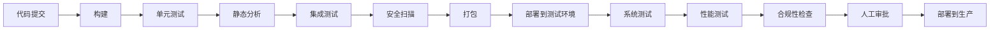

# CI/CD流水线

## 学习目标

通过本文档的学习，你将能够：

- 理解核心概念和原理
- 掌握实际应用方法
- 了解最佳实践和注意事项

## 前置知识

在学习本文档之前，建议你已经掌握：

- 基础的嵌入式系统知识
- C/C++编程基础
- 相关领域的基本概念

## 概述

持续集成/持续交付（CI/CD）是现代软件开发的核心实践。对于医疗器械软件，CI/CD流水线不仅要保证开发效率，还必须满足严格的合规性和质量要求。

## CI/CD基本概念

### 持续集成（Continuous Integration）

持续集成是指开发人员频繁地将代码集成到主分支，每次集成都通过自动化构建和测试来验证：

**核心原则**:
- 频繁提交代码（每天至少一次）
- 自动化构建
- 自动化测试
- 快速反馈

**收益**:
- 早期发现集成问题
- 减少集成风险
- 提高代码质量
- 加快开发速度

### 持续交付（Continuous Delivery）

持续交付是在持续集成的基础上，确保代码随时可以部署到生产环境：

**核心原则**:
- 自动化部署流程
- 环境一致性
- 快速回滚能力
- 部署审批机制

**收益**:
- 缩短发布周期
- 降低发布风险
- 提高部署可靠性
- 快速响应市场需求

### 持续部署（Continuous Deployment）

持续部署是持续交付的延伸，自动将通过所有测试的代码部署到生产环境。

**注意**: 医疗器械软件通常采用持续交付而非持续部署，因为需要人工审批和验证。

## 医疗器械CI/CD流水线设计

### 流水线阶段



### 1. 代码提交阶段

**触发条件**:
- 代码推送到Git仓库
- 合并请求（Merge Request）
- 定时触发

**验证内容**:
- 代码格式检查
- 提交信息规范
- 分支策略验证

```yaml
# GitLab CI示例
commit_validation:
  stage: validate
  script:
    - python scripts/validate_commit.py
    - python scripts/check_branch_policy.py
  only:
    - merge_requests
    - main
```

### 2. 构建阶段

**目标**: 编译源代码，生成可执行文件

**步骤**:
1. 检出代码
2. 安装依赖
3. 编译代码
4. 生成构建产物

```yaml
build:
  stage: build
  image: gcc:11
  script:
    - mkdir build
    - cd build
    - cmake -DCMAKE_BUILD_TYPE=Release ..
    - cmake --build . --parallel 4
  artifacts:
    paths:
      - build/
    expire_in: 1 week
  cache:
    key: ${CI_COMMIT_REF_SLUG}
    paths:
      - build/CMakeCache.txt
      - build/CMakeFiles/
```

### 3. 单元测试阶段

**目标**: 验证代码单元的正确性

**要求**:
- 代码覆盖率 ≥ 80%
- 所有测试必须通过
- 测试执行时间 < 10分钟

```yaml
unit_test:
  stage: test
  dependencies:
    - build
  script:
    - cd build
    - ctest --output-on-failure --parallel 4
    - gcovr -r .. --xml -o coverage.xml
  coverage: '/lines: \d+\.\d+%/'
  artifacts:
    reports:
      coverage_report:
        coverage_format: cobertura
        path: build/coverage.xml
```


### 4. 静态代码分析阶段

**目标**: 检测代码质量问题和潜在缺陷

**工具**:
- **Cppcheck**: C/C++静态分析
- **SonarQube**: 多语言代码质量平台
- **Coverity**: 商业静态分析工具
- **Clang-Tidy**: LLVM静态分析工具

```yaml
static_analysis:
  stage: analyze
  script:
    # Cppcheck分析
    - cppcheck --enable=all --xml --xml-version=2 src/ 2> cppcheck.xml
    
    # Clang-Tidy分析
    - run-clang-tidy -p build/ src/ > clang-tidy.txt
    
    # SonarQube扫描
    - sonar-scanner \
        -Dsonar.projectKey=medical-device \
        -Dsonar.sources=src/ \
        -Dsonar.host.url=$SONAR_HOST_URL \
        -Dsonar.login=$SONAR_TOKEN
  artifacts:
    reports:
      codequality: cppcheck.xml
  allow_failure: false
```

**质量门控**:
- 无严重（Critical）缺陷
- 无高危（High）安全漏洞
- 技术债务 < 5%
- 代码重复率 < 3%

### 5. 集成测试阶段

**目标**: 验证模块间的交互

**测试类型**:
- API测试
- 数据库集成测试
- 外部服务集成测试
- 硬件接口测试（如适用）

```yaml
integration_test:
  stage: test
  services:
    - postgres:13
    - redis:6
  variables:
    POSTGRES_DB: test_db
    POSTGRES_USER: test_user
    POSTGRES_PASSWORD: test_pass
  script:
    - python -m pytest tests/integration/ -v --junitxml=report.xml
  artifacts:
    reports:
      junit: report.xml
```

### 6. 安全扫描阶段

**目标**: 识别安全漏洞和依赖风险

**扫描内容**:
- 依赖漏洞扫描
- 容器镜像扫描
- 密钥泄露检测
- OWASP Top 10检查

```yaml
security_scan:
  stage: security
  script:
    # 依赖漏洞扫描
    - pip install safety
    - safety check --json > safety-report.json
    
    # 密钥扫描
    - trufflehog --regex --entropy=False .
    
    # SAST扫描
    - bandit -r src/ -f json -o bandit-report.json
  artifacts:
    reports:
      sast: bandit-report.json
  allow_failure: false
```

### 7. 打包阶段

**目标**: 创建可部署的软件包

**产物类型**:
- Docker镜像
- 安装包（MSI、DEB、RPM）
- 压缩归档文件
- 发布说明

```yaml
package:
  stage: package
  script:
    # 创建Docker镜像
    - docker build -t medical-device:${CI_COMMIT_SHA} .
    - docker tag medical-device:${CI_COMMIT_SHA} medical-device:latest
    
    # 创建安装包
    - cd build
    - cpack -G DEB
    - cpack -G RPM
    
    # 生成发布说明
    - python scripts/generate_release_notes.py > RELEASE_NOTES.md
  artifacts:
    paths:
      - build/*.deb
      - build/*.rpm
      - RELEASE_NOTES.md
    expire_in: 30 days
```

### 8. 部署到测试环境

**目标**: 在测试环境中验证软件

**环境配置**:
- 开发环境（Dev）
- 测试环境（Test）
- 预生产环境（Staging）

```yaml
deploy_test:
  stage: deploy
  environment:
    name: test
    url: https://test.medical-device.com
  script:
    - kubectl config use-context test-cluster
    - helm upgrade --install medical-device ./helm-chart \
        --set image.tag=${CI_COMMIT_SHA} \
        --namespace test
  only:
    - develop
```

### 9. 系统测试阶段

**目标**: 验证完整系统功能

**测试内容**:
- 功能测试
- 用户验收测试（UAT）
- 回归测试
- 兼容性测试

```yaml
system_test:
  stage: test
  environment:
    name: test
  script:
    - python -m pytest tests/system/ -v --html=report.html
  artifacts:
    paths:
      - report.html
    when: always
```

### 10. 性能测试阶段

**目标**: 验证系统性能指标

**测试指标**:
- 响应时间
- 吞吐量
- 资源使用率
- 并发用户数

```yaml
performance_test:
  stage: test
  script:
    # JMeter性能测试
    - jmeter -n -t tests/performance/load_test.jmx \
        -l results.jtl -e -o report/
    
    # 性能基准验证
    - python scripts/validate_performance.py results.jtl
  artifacts:
    paths:
      - report/
  allow_failure: false
```

### 11. 合规性检查阶段

**目标**: 验证法规合规性

**检查内容**:
- 可追溯性矩阵完整性
- 测试覆盖率达标
- 文档完整性
- 变更记录完整性

```yaml
compliance_check:
  stage: compliance
  script:
    # 可追溯性检查
    - python scripts/check_traceability.py
    
    # 文档完整性检查
    - python scripts/validate_documentation.py
    
    # 生成合规报告
    - python scripts/generate_compliance_report.py
  artifacts:
    paths:
      - compliance_report.pdf
  allow_failure: false
```

### 12. 人工审批阶段

**目标**: 人工审核和批准发布

**审批流程**:
1. 技术负责人审批
2. 质量保证审批
3. 法规事务审批
4. 管理层审批（如需要）

```yaml
manual_approval:
  stage: approval
  script:
    - echo "Waiting for manual approval"
  when: manual
  only:
    - main
```

### 13. 生产部署阶段

**目标**: 部署到生产环境

**部署策略**:
- **蓝绿部署**: 零停机部署
- **金丝雀发布**: 渐进式发布
- **滚动更新**: 逐步替换实例

```yaml
deploy_production:
  stage: deploy
  environment:
    name: production
    url: https://medical-device.com
  script:
    # 蓝绿部署
    - kubectl config use-context prod-cluster
    - helm upgrade --install medical-device-green ./helm-chart \
        --set image.tag=${CI_COMMIT_SHA} \
        --namespace production
    
    # 健康检查
    - python scripts/health_check.py https://medical-device.com
    
    # 切换流量
    - kubectl patch service medical-device \
        -p '{"spec":{"selector":{"version":"green"}}}'
  only:
    - tags
  when: manual
```

## Jenkins流水线示例

### Jenkinsfile配置

```groovy
pipeline {
    agent any
    
    environment {
        DOCKER_REGISTRY = 'registry.medical-device.com'
        SONAR_HOST = 'https://sonar.medical-device.com'
    }
    
    stages {
        stage('Checkout') {
            steps {
                checkout scm
                script {
                    env.GIT_COMMIT_SHORT = sh(
                        script: "git rev-parse --short HEAD",
                        returnStdout: true
                    ).trim()
                }
            }
        }
        
        stage('Build') {
            steps {
                sh '''
                    mkdir -p build
                    cd build
                    cmake -DCMAKE_BUILD_TYPE=Release ..
                    cmake --build . --parallel 4
                '''
            }
        }
        
        stage('Test') {
            parallel {
                stage('Unit Tests') {
                    steps {
                        sh 'cd build && ctest --output-on-failure'
                    }
                }
                
                stage('Static Analysis') {
                    steps {
                        sh 'cppcheck --enable=all --xml src/ 2> cppcheck.xml'
                    }
                }
            }
        }
        
        stage('Security Scan') {
            steps {
                sh 'trivy fs --security-checks vuln,config .'
            }
        }
        
        stage('Package') {
            steps {
                sh '''
                    docker build -t ${DOCKER_REGISTRY}/medical-device:${GIT_COMMIT_SHORT} .
                    docker push ${DOCKER_REGISTRY}/medical-device:${GIT_COMMIT_SHORT}
                '''
            }
        }
        
        stage('Deploy to Test') {
            when {
                branch 'develop'
            }
            steps {
                sh '''
                    kubectl config use-context test-cluster
                    helm upgrade --install medical-device ./helm-chart \
                        --set image.tag=${GIT_COMMIT_SHORT} \
                        --namespace test
                '''
            }
        }
        
        stage('Approval') {
            when {
                branch 'main'
            }
            steps {
                input message: 'Deploy to production?', ok: 'Deploy'
            }
        }
        
        stage('Deploy to Production') {
            when {
                branch 'main'
            }
            steps {
                sh '''
                    kubectl config use-context prod-cluster
                    helm upgrade --install medical-device ./helm-chart \
                        --set image.tag=${GIT_COMMIT_SHORT} \
                        --namespace production
                '''
            }
        }
    }
    
    post {
        always {
            junit 'build/test-results/**/*.xml'
            publishHTML([
                reportDir: 'build/coverage',
                reportFiles: 'index.html',
                reportName: 'Coverage Report'
            ])
        }
        
        failure {
            emailext(
                subject: "Pipeline Failed: ${env.JOB_NAME} #${env.BUILD_NUMBER}",
                body: "Check console output at ${env.BUILD_URL}",
                to: "${env.CHANGE_AUTHOR_EMAIL}"
            )
        }
        
        success {
            emailext(
                subject: "Pipeline Succeeded: ${env.JOB_NAME} #${env.BUILD_NUMBER}",
                body: "Build completed successfully",
                to: "${env.CHANGE_AUTHOR_EMAIL}"
            )
        }
    }
}
```

## Azure DevOps流水线示例

### azure-pipelines.yml配置

```yaml
trigger:
  branches:
    include:
      - main
      - develop
  tags:
    include:
      - v*

pool:
  vmImage: 'ubuntu-latest'

variables:
  buildConfiguration: 'Release'
  dockerRegistry: 'medical-device-registry'

stages:
- stage: Build
  jobs:
  - job: BuildJob
    steps:
    - task: CMake@1
      inputs:
        workingDirectory: 'build'
        cmakeArgs: '-DCMAKE_BUILD_TYPE=$(buildConfiguration) ..'
    
    - task: CMake@1
      inputs:
        workingDirectory: 'build'
        cmakeArgs: '--build . --parallel 4'
    
    - publish: $(System.DefaultWorkingDirectory)/build
      artifact: BuildArtifacts

- stage: Test
  dependsOn: Build
  jobs:
  - job: UnitTest
    steps:
    - download: current
      artifact: BuildArtifacts
    
    - script: |
        cd $(Pipeline.Workspace)/BuildArtifacts
        ctest --output-on-failure
      displayName: 'Run Unit Tests'
    
    - task: PublishTestResults@2
      inputs:
        testResultsFormat: 'JUnit'
        testResultsFiles: '**/test-results.xml'

  - job: StaticAnalysis
    steps:
    - task: SonarQubePrepare@5
      inputs:
        SonarQube: 'SonarQube Connection'
        scannerMode: 'CLI'
        configMode: 'manual'
        cliProjectKey: 'medical-device'
    
    - task: SonarQubeAnalyze@5
    
    - task: SonarQubePublish@5

- stage: Deploy
  dependsOn: Test
  condition: and(succeeded(), eq(variables['Build.SourceBranch'], 'refs/heads/main'))
  jobs:
  - deployment: DeployToProduction
    environment: 'production'
    strategy:
      runOnce:
        deploy:
          steps:
          - task: Kubernetes@1
            inputs:
              connectionType: 'Kubernetes Service Connection'
              kubernetesServiceEndpoint: 'prod-cluster'
              command: 'apply'
              arguments: '-f k8s/deployment.yaml'
```

## 流水线最佳实践

### 1. 快速反馈

- 优先运行快速测试
- 并行执行独立任务
- 增量构建和测试
- 及时通知失败

### 2. 可重复性

- 使用容器化构建环境
- 固定依赖版本
- 环境配置即代码
- 清理构建缓存

### 3. 可追溯性

- 记录所有构建日志
- 保存构建产物
- 关联需求和缺陷
- 生成审计报告

### 4. 安全性

- 密钥管理（使用Vault）
- 访问控制
- 审计日志
- 漏洞扫描

### 5. 可维护性

- 模块化流水线配置
- 共享库和模板
- 文档化流程
- 定期审查和优化

## 质量门控配置

### SonarQube质量门控

```json
{
  "name": "Medical Device Quality Gate",
  "conditions": [
    {
      "metric": "new_coverage",
      "op": "LT",
      "error": "80"
    },
    {
      "metric": "new_duplicated_lines_density",
      "op": "GT",
      "error": "3"
    },
    {
      "metric": "new_maintainability_rating",
      "op": "GT",
      "error": "1"
    },
    {
      "metric": "new_reliability_rating",
      "op": "GT",
      "error": "1"
    },
    {
      "metric": "new_security_rating",
      "op": "GT",
      "error": "1"
    }
  ]
}
```

### 自定义质量门控脚本

```python
#!/usr/bin/env python3
"""质量门控验证脚本"""

import sys
import json
from pathlib import Path

def check_coverage(coverage_file, threshold=80):
    """检查代码覆盖率"""
    with open(coverage_file) as f:
        data = json.load(f)
    
    coverage = data['totals']['percent_covered']
    if coverage < threshold:
        print(f"❌ 代码覆盖率 {coverage}% 低于阈值 {threshold}%")
        return False
    
    print(f"✅ 代码覆盖率 {coverage}% 达标")
    return True

def check_static_analysis(report_file):
    """检查静态分析结果"""
    with open(report_file) as f:
        data = json.load(f)
    
    critical_issues = data['summary']['critical']
    if critical_issues > 0:
        print(f"❌ 发现 {critical_issues} 个严重问题")
        return False
    
    print("✅ 静态分析通过")
    return True

def check_security_scan(report_file):
    """检查安全扫描结果"""
    with open(report_file) as f:
        data = json.load(f)
    
    high_vulns = data['summary']['high']
    critical_vulns = data['summary']['critical']
    
    if high_vulns > 0 or critical_vulns > 0:
        print(f"❌ 发现 {critical_vulns} 个严重漏洞和 {high_vulns} 个高危漏洞")
        return False
    
    print("✅ 安全扫描通过")
    return True

def main():
    """主函数"""
    checks = [
        check_coverage('coverage.json'),
        check_static_analysis('static-analysis.json'),
        check_security_scan('security-scan.json')
    ]
    
    if all(checks):
        print("\n✅ 所有质量门控检查通过")
        sys.exit(0)
    else:
        print("\n❌ 质量门控检查失败")
        sys.exit(1)

if __name__ == '__main__':
    main()
```

## 监控和告警

### 流水线监控指标

- **构建成功率**: 成功构建数 / 总构建数
- **平均构建时间**: 构建时间的平均值
- **测试通过率**: 通过测试数 / 总测试数
- **部署频率**: 单位时间内的部署次数
- **平均修复时间（MTTR）**: 从失败到修复的平均时间

### Prometheus监控配置

```yaml
# prometheus.yml
scrape_configs:
  - job_name: 'jenkins'
    metrics_path: '/prometheus'
    static_configs:
      - targets: ['jenkins:8080']
  
  - job_name: 'gitlab-ci'
    static_configs:
      - targets: ['gitlab:9090']
```

### Grafana仪表板

创建CI/CD监控仪表板，显示：
- 构建趋势图
- 测试覆盖率趋势
- 部署频率
- 失败率分析
- 构建时间分布

## 故障排查

### 常见问题

1. **构建失败**
   - 检查依赖版本
   - 验证环境配置
   - 查看构建日志

2. **测试失败**
   - 隔离失败测试
   - 检查测试数据
   - 验证环境状态

3. **部署失败**
   - 检查网络连接
   - 验证权限配置
   - 查看部署日志

### 调试技巧

```bash
# 本地复现CI环境
docker run -it --rm \
  -v $(pwd):/workspace \
  -w /workspace \
  gcc:11 \
  bash

# 在容器中执行构建
mkdir build && cd build
cmake ..
cmake --build .
ctest
```

## 相关资源

- [容器化](containerization.md) - Docker和Kubernetes实践
- [基础设施即代码](infrastructure-as-code.md) - IaC工具和实践
- [监控与日志](monitoring-logging.md) - 监控和日志管理

## 参考文献

1. "Continuous Delivery" - Jez Humble和David Farley
2. Jenkins官方文档: https://www.jenkins.io/doc/
3. GitLab CI/CD文档: https://docs.gitlab.com/ee/ci/
4. Azure DevOps文档: https://docs.microsoft.com/azure/devops/
5. FDA Guidance on Software Validation

---

**标签**: CI/CD, Jenkins, GitLab CI, Azure DevOps, 自动化, 医疗器械

**最后更新**: 2024-01
