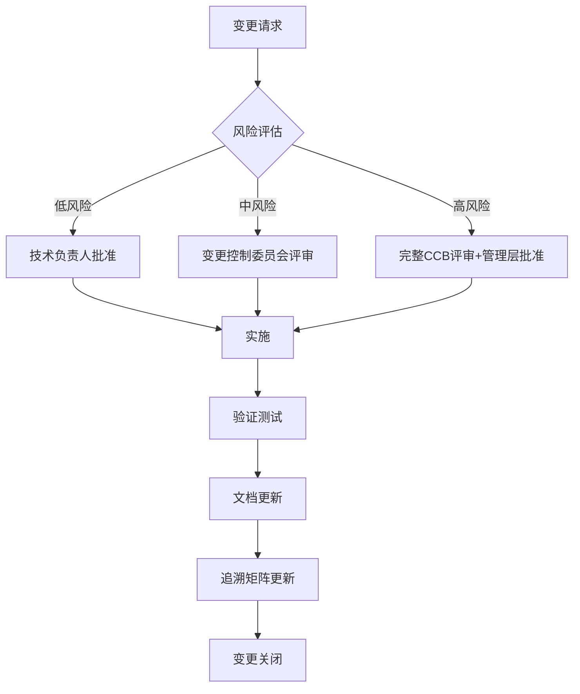

# 敏捷开发在医疗器械中的应用

## 学习目标

通过本文档的学习，你将能够：

- 理解核心概念和原理
- 掌握实际应用方法
- 了解最佳实践和注意事项

## 前置知识

在学习本文档之前，建议你已经掌握：

- 基础的嵌入式系统知识
- C/C++编程基础
- 相关领域的基本概念

## 概述

敏捷开发方法强调快速迭代、持续反馈和灵活应对变化，而医疗器械开发需要严格的文档、可追溯性和法规合规性。本文介绍如何在医疗器械软件开发中成功应用敏捷方法。

## 核心挑战

### 法规要求 vs 敏捷原则

| 法规要求 | 敏捷原则 | 解决方案 |
|---------|---------|---------|
| 详细的前期文档 | 工作软件优于详尽文档 | 渐进式文档，模板化 |
| 严格的变更控制 | 拥抱变化 | 风险驱动的变更管理 |
| 完整的可追溯性 | 简化流程 | 自动化追溯工具 |
| 正式的验证确认 | 持续测试 | 集成V&V到迭代中 |
| 预定义的计划 | 适应性规划 | 滚动波浪式规划 |

### FDA对敏捷的立场

FDA认可敏捷方法，但要求：

- **文档充分性**: 必须满足21 CFR Part 11和IEC 62304要求
- **可追溯性**: 需求到测试的完整追溯链
- **风险管理**: 持续的风险评估和缓解
- **设计控制**: 符合21 CFR Part 820.30要求
- **验证确认**: 正式的V&V活动记录

## Scrum框架适配

### 标准Scrum vs 医疗器械Scrum

#### Sprint规划

**标准Scrum**:
- 2-4周迭代
- 灵活的范围调整
- 快速交付价值

**医疗器械适配**:
```
Sprint 0: 初始化
├── 风险管理计划
├── 软件开发计划
├── 需求规格基线
└── 测试策略

Sprint 1-N: 开发迭代
├── 用户故事实现
├── 单元测试和集成测试
├── 代码审查
├── 风险评估更新
└── 追溯矩阵更新

Sprint N+1: 验证Sprint
├── 系统测试
├── 用户验收测试
├── 文档完善
└── 审计准备
```


#### 角色定义

**Product Owner (产品负责人)**:
- 管理产品待办列表
- 优先级排序（考虑风险和法规要求）
- 与法规团队协调
- 接受标准定义（包括合规性检查）

**Scrum Master (敏捷教练)**:
- 促进敏捷实践
- 移除障碍
- 确保流程合规性
- 协调跨职能团队

**开发团队**:
- 软件工程师
- 测试工程师
- 质量工程师（QA）
- 技术文档工程师

**扩展角色**:
- 法规事务专家（顾问角色）
- 临床专家（需求验证）
- 风险管理专家

#### 会议适配

**每日站会 (Daily Standup)**:
```
标准问题:
1. 昨天完成了什么？
2. 今天计划做什么？
3. 有什么障碍？

医疗器械扩展:
4. 是否有新的风险识别？
5. 文档是否同步更新？
6. 是否需要法规团队支持？
```

**Sprint评审 (Sprint Review)**:
- 演示工作软件
- 收集反馈
- **新增**: 合规性检查清单
- **新增**: 风险评估更新
- **新增**: 追溯矩阵审查

**Sprint回顾 (Sprint Retrospective)**:
- 流程改进
- 团队协作优化
- **新增**: 质量度量回顾
- **新增**: 合规性流程优化

### 用户故事编写

#### 标准格式

```
作为 [角色]
我想要 [功能]
以便 [价值]
```

#### 医疗器械增强格式

```
作为 [角色]
我想要 [功能]
以便 [价值]

风险等级: [A/B/C类]
相关需求: [REQ-001, REQ-002]
安全考虑: [描述安全相关因素]

验收标准:
- [ ] 功能标准1
- [ ] 功能标准2
- [ ] 单元测试覆盖率 ≥ 80%
- [ ] 代码审查完成
- [ ] 风险评估更新
- [ ] 追溯矩阵更新
- [ ] 技术文档更新

完成定义 (Definition of Done):
- [ ] 代码提交并通过CI
- [ ] 单元测试和集成测试通过
- [ ] 代码审查批准
- [ ] 静态分析无严重问题
- [ ] 需求追溯完成
- [ ] 风险分析更新
- [ ] 用户文档更新
- [ ] 测试文档完成
```

#### 示例：血糖监测应用

```markdown
### 用户故事: 血糖读数显示

作为糖尿病患者
我想要在应用中查看我的血糖读数
以便我能够监控我的血糖水平并做出治疗决策

**风险等级**: B类（中等风险）
**相关需求**: REQ-UI-001, REQ-DATA-003, REQ-SAFETY-005
**安全考虑**: 
- 错误的血糖读数可能导致不当的胰岛素剂量
- 必须显示数据的时间戳和单位
- 异常值需要明确标识

**验收标准**:
- [ ] 显示最近50条血糖读数
- [ ] 每条读数包含：数值、单位(mg/dL或mmol/L)、时间戳
- [ ] 高于180或低于70的读数用红色标识
- [ ] 数据加载失败时显示明确的错误信息
- [ ] 响应时间 < 2秒
- [ ] 单元测试覆盖率 ≥ 85%
- [ ] 代码审查完成（至少2名审查者）
- [ ] 风险FMEA更新
- [ ] 追溯矩阵更新（需求→设计→代码→测试）
- [ ] 用户界面文档更新

**完成定义**:
- [ ] 代码提交到主分支
- [ ] 所有自动化测试通过（单元、集成、UI）
- [ ] 代码审查批准（包括安全审查）
- [ ] 静态分析无P1/P2问题
- [ ] SonarQube质量门通过
- [ ] 需求追溯矩阵更新
- [ ] 风险分析文档更新
- [ ] 用户手册更新
- [ ] 测试协议和报告完成
- [ ] QA团队验收通过

**技术任务**:
1. 设计数据模型和API接口
2. 实现数据获取服务
3. 开发UI组件
4. 编写单元测试
5. 编写集成测试
6. 更新技术文档
7. 执行代码审查
8. 更新风险分析
```

## 迭代与法规要求平衡

### 渐进式文档策略

#### 文档模板化

创建可重用的文档模板：

```
templates/
├── software-requirements-specification.md
├── software-design-specification.md
├── test-protocol.md
├── test-report.md
├── risk-assessment.md
└── traceability-matrix.xlsx
```

#### 文档生成自动化

```python
# 示例：从代码注释生成设计文档
"""
@requirement: REQ-UI-001
@risk: RISK-023
@safety_class: B
@description: Display glucose readings with timestamp and unit
"""
def display_glucose_reading(reading):
    # 实现代码
    pass
```

自动化工具提取注释生成：
- 设计规格文档
- 追溯矩阵
- 风险分析更新

### 持续验证确认

#### 测试金字塔适配

```
           /\
          /  \  E2E测试 (5%)
         /____\  - 关键用户场景
        /      \  - 法规要求的测试用例
       /        \
      / 集成测试 \ (25%)
     /  (API/UI) \  - 组件交互
    /______________\  - 数据流验证
   /                \
  /   单元测试 (70%)  \
 /  - 代码覆盖率≥80%  \
/______________________\
```

#### V&V集成到Sprint

**每个Sprint**:
- 单元测试（开发人员）
- 集成测试（开发人员+QA）
- 代码审查（同行审查）
- 静态分析（自动化）

**验证Sprint（每3-4个开发Sprint）**:
- 系统测试（QA团队）
- 用户验收测试（临床专家）
- 性能测试
- 安全测试
- 可用性测试

**发布前**:
- 完整的回归测试
- 最终文档审查
- 法规审查
- 管理层批准

### 风险驱动的变更管理

#### 变更分类

**低风险变更**（快速通道）:
- UI文本修改
- 非功能性代码重构
- 文档更新
- 简化审批流程

**中风险变更**（标准流程）:
- 新功能添加
- 算法优化
- 第三方库更新
- 需要风险评估和测试

**高风险变更**（严格审查）:
- 安全关键功能修改
- 算法根本性改变
- 架构重大调整
- 需要完整的影响分析和验证

#### 变更控制流程



## 实践案例

### 案例1：移动医疗应用开发

**背景**:
- 产品：糖尿病管理应用（Class II医疗器械）
- 团队：8人（5开发，2测试，1QA）
- 周期：12个月

**敏捷实施**:

**Sprint结构**:
- Sprint长度：3周
- 开发Sprint：10个
- 验证Sprint：2个
- 稳定化Sprint：1个

**关键实践**:

1. **Sprint 0（4周）**:
   - 软件开发计划
   - 风险管理计划
   - 需求规格基线（高层需求）
   - 架构设计
   - 开发环境搭建
   - CI/CD流程建立

2. **开发Sprint（每3周）**:
   ```
   Week 1:
   - Sprint规划（4小时）
   - 用户故事细化
   - 技术设计
   - 开发开始
   
   Week 2:
   - 持续开发
   - 每日站会
   - 代码审查
   - 单元测试
   
   Week 3:
   - 功能完成
   - 集成测试
   - 文档更新
   - Sprint评审和回顾
   ```

3. **验证Sprint（每4周）**:
   - 系统级测试
   - 用户验收测试
   - 性能和安全测试
   - 文档审查
   - 法规差距分析

**工具链**:
- Jira：需求和任务管理
- Confluence：文档管理
- GitHub：版本控制
- Jenkins：CI/CD
- SonarQube：代码质量
- TestRail：测试管理
- Jama：需求追溯

**成果**:
- 按时交付，满足所有法规要求
- 代码覆盖率：87%
- 缺陷逃逸率：<2%
- FDA 510(k)一次性通过

### 案例2：医疗设备固件更新

**背景**:
- 产品：心电监护仪固件更新
- 团队：12人（跨职能团队）
- 周期：6个月

**挑战**:
- 嵌入式系统限制
- 实时性要求
- 安全关键功能
- 现有设备兼容性

**敏捷适配**:

1. **混合方法**:
   - 核心算法：瀑布式开发（严格验证）
   - UI和非关键功能：敏捷开发
   - 集成和测试：持续进行

2. **风险驱动迭代**:
   ```
   迭代1-2: 低风险功能
   - UI改进
   - 数据显示优化
   - 用户体验增强
   
   迭代3-4: 中风险功能
   - 数据处理优化
   - 通信协议更新
   - 性能改进
   
   迭代5-6: 高风险功能
   - 心电算法优化
   - 报警逻辑改进
   - 完整系统验证
   ```

3. **持续集成硬件在环**:
   - 自动化硬件测试台
   - 每日构建和测试
   - 快速反馈循环

**成果**:
- 成功部署到5000+设备
- 零现场故障
- 用户满意度提升40%

## 工具和技术

### 敏捷项目管理工具

#### Jira配置示例

**自定义字段**:
- 风险等级（A/B/C类）
- 相关需求ID
- 安全考虑
- 追溯状态
- V&V状态

**工作流定制**:
```
待办 → 需求分析 → 设计 → 开发中 → 代码审查 → 
测试中 → QA验证 → 文档更新 → 完成
```

**自动化规则**:
- 代码审查完成后自动转到测试
- 测试失败自动退回开发
- 文档未更新阻止关闭

### 追溯矩阵自动化

```python
# 示例：自动生成追溯矩阵
import pandas as pd

def generate_traceability_matrix():
    """从Jira和Git提取数据生成追溯矩阵"""
    
    # 从Jira获取需求
    requirements = jira.search_issues('project=MED AND type=Requirement')
    
    # 从Git获取代码提交（带需求标签）
    commits = git.log('--grep="REQ-"')
    
    # 从TestRail获取测试用例
    test_cases = testrail.get_cases(project_id)
    
    # 生成矩阵
    matrix = pd.DataFrame({
        'Requirement': requirements,
        'Design': map_to_design(requirements),
        'Code': map_to_commits(requirements, commits),
        'Tests': map_to_tests(requirements, test_cases),
        'Status': calculate_status(requirements)
    })
    
    return matrix
```

### 文档自动化

**Sphinx + Doxygen集成**:
```python
# conf.py
extensions = [
    'sphinx.ext.autodoc',
    'breathe',  # Doxygen集成
    'sphinx_rtd_theme',
]

# 从代码注释生成设计文档
breathe_projects = {
    "medical_device": "./doxygen/xml"
}
```

## 度量和KPI

### 敏捷度量

**速度 (Velocity)**:
- 每个Sprint完成的故事点
- 趋势分析
- 容量规划

**燃尽图 (Burndown Chart)**:
- Sprint燃尽图
- Release燃尽图
- 预测完成时间

**周期时间 (Cycle Time)**:
- 从开始到完成的时间
- 识别瓶颈
- 流程优化

### 质量度量

**代码质量**:
- 代码覆盖率（目标：≥80%）
- 静态分析问题数
- 代码复杂度
- 技术债务

**缺陷度量**:
- 缺陷密度（缺陷/KLOC）
- 缺陷逃逸率
- 修复时间
- 重开率

**合规性度量**:
- 追溯完整性（目标：100%）
- 文档完成度
- 审查覆盖率
- 风险评估完成度

### 仪表板示例

```
┌─────────────────────────────────────────────────┐
│         Sprint 10 Dashboard                     │
├─────────────────────────────────────────────────┤
│ 速度: 42 点 (平均: 38 点)          ↑ +10%      │
│ 燃尽: 按计划进行                   ✓           │
│ 代码覆盖率: 84%                    ✓ (>80%)    │
│ 缺陷: 3个开放 (2 P2, 1 P3)        ⚠           │
│ 追溯完整性: 98%                    ⚠ (<100%)   │
│ 文档更新: 100%                     ✓           │
├─────────────────────────────────────────────────┤
│ 风险:                                           │
│ - 1个中风险需要缓解                             │
│ - 追溯矩阵2个缺失项                             │
├─────────────────────────────────────────────────┤
│ 行动项:                                         │
│ 1. 完成REQ-045的追溯链接                        │
│ 2. 修复P2缺陷 (预计2天)                         │
│ 3. 更新风险缓解措施                             │
└─────────────────────────────────────────────────┘
```

## 最佳实践

### 成功因素

1. **管理层支持**
   - 理解敏捷价值
   - 提供必要资源
   - 信任团队决策

2. **培训和指导**
   - 敏捷方法培训
   - 医疗器械法规培训
   - 持续的教练支持

3. **工具投资**
   - 集成的工具链
   - 自动化基础设施
   - 易用的界面

4. **文化转变**
   - 拥抱透明度
   - 鼓励协作
   - 持续改进心态

5. **渐进式采用**
   - 从试点项目开始
   - 逐步扩展
   - 根据反馈调整

### 常见陷阱

1. **过度文档化**
   - 问题：为了合规而创建不必要的文档
   - 解决：专注于必需文档，使用模板和自动化

2. **忽视法规要求**
   - 问题：过度强调速度而忽略合规性
   - 解决：将合规性集成到完成定义中

3. **缺乏追溯性**
   - 问题：追溯矩阵更新滞后
   - 解决：自动化追溯，实时更新

4. **变更控制混乱**
   - 问题：变更未经适当评审
   - 解决：风险驱动的变更分类和流程

5. **测试不足**
   - 问题：为了速度而跳过测试
   - 解决：自动化测试，持续集成

## 检查清单

### Sprint规划检查清单

- [ ] 用户故事已细化并估算
- [ ] 风险等级已评估
- [ ] 需求追溯已建立
- [ ] 验收标准明确
- [ ] 完成定义已定义
- [ ] 团队容量已确认
- [ ] 依赖关系已识别
- [ ] 测试策略已制定

### Sprint完成检查清单

- [ ] 所有用户故事满足完成定义
- [ ] 代码审查已完成
- [ ] 自动化测试通过
- [ ] 代码覆盖率达标
- [ ] 静态分析通过
- [ ] 追溯矩阵已更新
- [ ] 风险评估已更新
- [ ] 技术文档已更新
- [ ] QA验收通过
- [ ] 演示已准备

### 发布准备检查清单

- [ ] 所有功能已完成并验证
- [ ] 系统测试完成
- [ ] 用户验收测试通过
- [ ] 性能测试通过
- [ ] 安全测试通过
- [ ] 可用性测试完成
- [ ] 所有文档完整且审查
- [ ] 追溯矩阵100%完整
- [ ] 风险管理文件完整
- [ ] 法规审查通过
- [ ] 发布说明准备
- [ ] 培训材料准备
- [ ] 管理层批准

## 相关资源

### 标准和指南

- **FDA Guidance**: "Content of Premarket Submissions for Device Software Functions"
- **AAMI TIR45**: "Guidance on the use of AGILE practices in the development of medical device software"
- **IEC 62304**: Medical device software lifecycle processes
- **ISO 13485**: Medical devices quality management systems

### 推荐阅读

- "Agile Development in the Medical Device Industry" - Mike Vogel
- "Essential Scrum" - Kenneth Rubin
- "User Stories Applied" - Mike Cohn
- "Continuous Delivery" - Jez Humble & David Farley

### 在线资源

- [FDA Digital Health Center](https://www.fda.gov/medical-devices/digital-health-center-excellence)
- [AAMI Standards](https://www.aami.org/)
- [Scrum.org Medical Device Resources](https://www.scrum.org/)

## 下一步

- **[项目管理工具与平台](tools-and-platforms.md)** - 深入了解工具配置和使用
- **[团队协作最佳实践](team-collaboration.md)** - 建立高效的团队协作机制
- **[返回项目管理概述](index.md)** - 查看完整的项目管理主题
