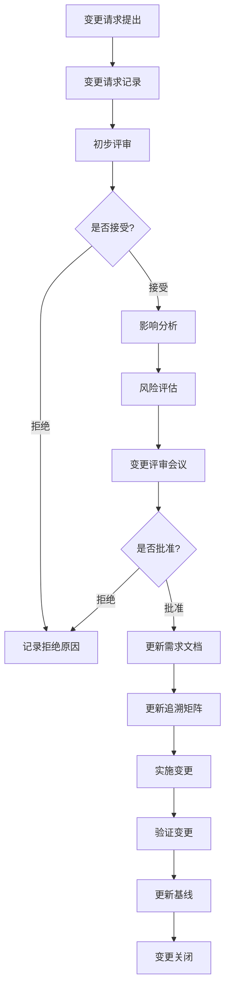

# 需求变更管理

## 学习目标

完成本模块后，你将能够：
- 理解医疗器械软件需求变更管理的重要性和法规要求
- 掌握需求变更请求（CR）的提交和评审流程
- 执行全面的变更影响分析
- 维护需求变更的可追溯性
- 应用变更管理最佳实践确保产品质量和合规性

## 前置知识

- 需求工程基础知识
- IEC 62304软件生命周期过程
- 配置管理基本概念
- 风险管理基础（ISO 14971）

## 内容

### 需求变更管理概述

需求变更管理是医疗器械软件开发中的关键过程，确保所有需求变更都经过适当的评审、批准和实施。根据IEC 62304标准，需求变更必须经过正式的变更控制过程。

**为什么需求变更管理至关重要？**

1. **法规合规性**：满足IEC 62304、FDA 21 CFR Part 820等法规要求
2. **风险控制**：识别和评估变更带来的风险
3. **质量保证**：防止未经评审的变更导致缺陷
4. **可追溯性**：维护需求到设计、实现、测试的完整追溯链
5. **成本控制**：避免后期变更带来的高昂成本

### 需求变更管理流程



**说明**: 这是需求变更管理流程图。从变更请求提出开始，经过记录、初步评审、影响分析、风险评估、变更评审会议、批准、实施、验证到关闭的完整流程，确保变更得到系统化管理。


### 变更请求（CR）提交

**变更请求模板**：

```markdown
# 变更请求 CR-2026-001

## 基本信息
- **提交人**：张三
- **提交日期**：2026-02-09
- **优先级**：高/中/低
- **类型**：功能增强/缺陷修复/法规要求/性能改进

## 变更描述
### 当前状态
描述当前需求或功能的状态

### 期望状态
描述变更后期望达到的状态

### 变更原因
- 客户需求
- 法规要求变化
- 缺陷修复
- 性能优化
- 其他原因

## 受影响的需求
- REQ-001: 用户认证功能
- REQ-015: 数据加密传输

## 初步影响评估
- 影响的模块：认证模块、通信模块
- 预计工作量：40小时
- 风险等级：中等

## 附件
- 相关文档
- 参考资料
```

### 影响分析

影响分析是变更管理中最关键的步骤，需要全面评估变更对系统各方面的影响。

**影响分析检查清单**：

| 分析维度 | 检查项 | 评估结果 |
|---------|--------|---------|
| **需求影响** | 影响哪些现有需求？ | |
| | 是否引入新需求？ | |
| | 是否导致需求冲突？ | |
| **设计影响** | 影响哪些设计文档？ | |
| | 是否需要架构变更？ | |
| | 接口是否需要修改？ | |
| **实现影响** | 影响哪些源代码文件？ | |
| | 预计代码变更量？ | |
| | 是否影响第三方库？ | |
| **测试影响** | 需要新增哪些测试用例？ | |
| | 需要修改哪些现有测试？ | |
| | 回归测试范围？ | |
| **文档影响** | 需要更新哪些文档？ | |
| | 用户手册是否需要修改？ | |
| **风险影响** | 是否引入新风险？ | |
| | 对现有风险的影响？ | |
| | 风险控制措施是否充分？ | |
| **资源影响** | 所需人力资源？ | |
| | 所需时间？ | |
| | 预算影响？ | |
| **法规影响** | 是否影响法规符合性？ | |
| | 是否需要重新认证？ | |

**影响分析示例**：

```c
// 变更前：简单的密码验证
bool authenticate_user(const char* username, const char* password) {
    // 直接比较密码（不安全）
    User* user = find_user(username);
    if (user == NULL) {
        return false;
    }
    return strcmp(user->password, password) == 0;
}

// 变更后：增加密码哈希和盐值
bool authenticate_user(const char* username, const char* password) {
    User* user = find_user(username);
    if (user == NULL) {
        return false;
    }
    
    // 使用存储的盐值计算密码哈希
    char computed_hash[SHA256_DIGEST_LENGTH];
    compute_password_hash(password, user->salt, computed_hash);
    
    // 使用安全的比较函数
    return secure_compare(user->password_hash, computed_hash, 
                         SHA256_DIGEST_LENGTH);
}

// 影响分析：
// 1. 需求影响：REQ-SEC-001需要更新，增加密码哈希要求
// 2. 设计影响：User数据结构需要增加salt和password_hash字段
// 3. 实现影响：
//    - 需要实现compute_password_hash()函数
//    - 需要实现secure_compare()函数
//    - 需要修改用户注册流程
//    - 需要实现密码迁移脚本
// 4. 测试影响：
//    - 新增密码哈希功能测试
//    - 新增密码迁移测试
//    - 更新认证功能测试用例
// 5. 风险影响：
//    - 降低密码泄露风险
//    - 引入密码迁移失败风险（需要缓解措施）
```

### 变更追溯性维护

变更实施后，必须更新追溯矩阵以维护完整的可追溯性。

**追溯矩阵更新示例**：

```
变更前追溯关系：
REQ-SEC-001 --> DESIGN-AUTH-001 --> CODE-auth.c --> TEST-AUTH-001

变更后追溯关系：
REQ-SEC-001 (已更新) --> DESIGN-AUTH-001 (已更新)
                     --> DESIGN-CRYPTO-001 (新增)
                     --> CODE-auth.c (已修改)
                     --> CODE-crypto.c (新增)
                     --> TEST-AUTH-001 (已更新)
                     --> TEST-AUTH-002 (新增)
                     --> TEST-CRYPTO-001 (新增)
```

**追溯性验证检查**：

```python
# 追溯性验证脚本示例
def verify_change_traceability(change_request):
    """验证变更的追溯性完整性"""
    issues = []
    
    # 检查所有受影响的需求是否已更新
    for req_id in change_request.affected_requirements:
        if not is_requirement_updated(req_id, change_request.id):
            issues.append(f"需求 {req_id} 未更新")
    
    # 检查设计文档是否已更新
    for design_id in change_request.affected_designs:
        if not is_design_updated(design_id, change_request.id):
            issues.append(f"设计 {design_id} 未更新")
    
    # 检查测试用例是否已更新或新增
    for test_id in change_request.affected_tests:
        if not is_test_updated(test_id, change_request.id):
            issues.append(f"测试 {test_id} 未更新")
    
    # 检查追溯矩阵是否已更新
    if not is_traceability_matrix_updated(change_request.id):
        issues.append("追溯矩阵未更新")
    
    return issues
```

### 变更评审会议

变更评审会议（Change Control Board, CCB）是变更管理的核心环节。

**CCB成员组成**：
- 项目经理（主席）
- 质量保证代表
- 技术负责人
- 测试负责人
- 风险管理负责人
- 法规事务代表（必要时）

**评审议程**：

1. **变更请求介绍**（5分钟）
   - 变更背景和原因
   - 变更内容概述

2. **影响分析报告**（10分钟）
   - 技术影响
   - 资源影响
   - 进度影响

3. **风险评估**（10分钟）
   - 新增风险
   - 风险控制措施
   - 残余风险评估

4. **讨论和决策**（15分钟）
   - 成员提问和讨论
   - 投票决策
   - 记录决策理由

**评审决策**：
- **批准**：变更可以实施
- **有条件批准**：满足特定条件后可实施
- **推迟**：需要更多信息或分析
- **拒绝**：变更不被接受

### 变更实施和验证

**实施步骤**：

```bash
# 1. 创建变更分支
git checkout -b CR-2026-001-password-hashing

# 2. 更新需求文档
# 编辑 requirements/security-requirements.md

# 3. 更新设计文档
# 编辑 design/authentication-design.md

# 4. 实施代码变更
# 修改 src/auth.c, 新增 src/crypto.c

# 5. 更新测试用例
# 修改 tests/test_auth.c, 新增 tests/test_crypto.c

# 6. 运行测试
make test

# 7. 更新追溯矩阵
python scripts/update_traceability.py --cr CR-2026-001

# 8. 代码审查
# 提交Pull Request进行审查

# 9. 合并到主分支
git checkout main
git merge CR-2026-001-password-hashing

# 10. 更新基线
python scripts/create_baseline.py --version 2.1.0
```

**验证检查清单**：

- [ ] 所有受影响的需求已更新
- [ ] 设计文档已更新
- [ ] 代码变更已实施
- [ ] 单元测试已通过
- [ ] 集成测试已通过
- [ ] 回归测试已通过
- [ ] 代码审查已完成
- [ ] 追溯矩阵已更新
- [ ] 风险评估已更新
- [ ] 相关文档已更新
- [ ] 变更记录已归档

## 最佳实践

!!! tip "变更管理最佳实践"
    1. **早期识别变更**：在开发早期识别和处理变更，成本更低
    2. **完整的影响分析**：不要低估变更的影响范围
    3. **严格的评审流程**：所有变更必须经过CCB评审
    4. **维护追溯性**：实时更新追溯矩阵，不要积压
    5. **风险驱动**：根据风险等级确定变更优先级
    6. **文档先行**：先更新文档，再实施代码变更
    7. **自动化工具**：使用工具辅助追溯性管理和影响分析
    8. **定期审计**：定期审计变更管理过程的有效性

## 常见陷阱

!!! warning "注意事项"
    1. **跳过影响分析**：直接实施变更导致意外后果
    2. **追溯性缺失**：变更后未更新追溯矩阵
    3. **风险评估不足**：未充分评估变更引入的风险
    4. **回归测试不足**：未充分测试变更对现有功能的影响
    5. **文档滞后**：代码已变更但文档未更新
    6. **变更堆积**：多个变更同时进行导致混乱
    7. **口头批准**：未记录正式的变更批准
    8. **基线管理混乱**：变更后未及时更新基线

## 实践练习

1. **变更请求练习**：
   - 为一个假设的医疗设备软件编写一个完整的变更请求
   - 包括变更描述、影响分析和风险评估

2. **影响分析练习**：
   - 给定一个需求变更场景，执行完整的影响分析
   - 识别所有受影响的工件和活动

3. **追溯性维护练习**：
   - 给定变更前后的追溯矩阵，更新追溯关系
   - 验证追溯性的完整性

4. **CCB模拟**：
   - 组织一次模拟的变更评审会议
   - 练习评审流程和决策制定

## 自测问题

??? question "为什么医疗器械软件需要正式的需求变更管理流程？"
    医疗器械软件需要正式的需求变更管理流程主要基于以下原因：
    
    ??? success "答案"
        1. **法规要求**：IEC 62304、FDA 21 CFR Part 820等法规明确要求建立变更控制流程
        2. **风险控制**：医疗器械软件的变更可能影响患者安全，必须经过风险评估
        3. **质量保证**：防止未经评审的变更引入缺陷
        4. **可追溯性**：维护从需求到实现的完整追溯链，支持审计和验证
        5. **成本控制**：早期发现和控制变更，避免后期高昂的修复成本
        6. **合规性证明**：在审计和认证过程中证明变更管理的有效性

??? question "影响分析应该包括哪些主要维度？"
    影响分析应该全面评估变更对系统各方面的影响。
    
    ??? success "答案"
        影响分析应包括以下主要维度：
        
        1. **需求影响**：影响哪些现有需求，是否引入新需求
        2. **设计影响**：影响哪些设计文档和架构
        3. **实现影响**：影响哪些代码文件，预计变更量
        4. **测试影响**：需要新增或修改哪些测试用例
        5. **文档影响**：需要更新哪些技术文档和用户文档
        6. **风险影响**：是否引入新风险，对现有风险的影响
        7. **资源影响**：所需人力、时间和预算
        8. **法规影响**：是否影响法规符合性，是否需要重新认证
        9. **接口影响**：是否影响外部接口或第三方集成
        10. **性能影响**：对系统性能的影响

??? question "变更评审会议（CCB）的主要职责是什么？"
    CCB是变更管理的决策机构。
    
    ??? success "答案"
        CCB的主要职责包括：
        
        1. **评审变更请求**：审查变更的必要性和合理性
        2. **评估影响分析**：验证影响分析的完整性和准确性
        3. **评估风险**：审查变更引入的风险和控制措施
        4. **决策批准**：决定是否批准、推迟或拒绝变更
        5. **优先级排序**：确定多个变更的实施优先级
        6. **资源分配**：协调变更实施所需的资源
        7. **监督实施**：跟踪变更实施的进度和质量
        8. **确保合规性**：确保变更管理符合法规要求

??? question "如何维护变更后的追溯性？"
    追溯性维护是变更管理的关键环节。
    
    ??? success "答案"
        维护变更后追溯性的步骤：
        
        1. **识别受影响的工件**：确定所有需要更新的需求、设计、代码、测试
        2. **更新工件**：实际修改或新增相关工件
        3. **更新追溯矩阵**：在追溯矩阵中记录新的追溯关系
        4. **验证追溯性**：检查追溯链的完整性
        5. **使用工具支持**：利用需求管理工具自动维护追溯关系
        6. **定期审查**：定期审查追溯矩阵的准确性
        7. **版本控制**：追溯矩阵也应纳入版本控制
        8. **文档化**：在变更记录中明确记录追溯性更新

??? question "变更实施后需要进行哪些验证活动？"
    变更验证确保变更正确实施且未引入新问题。
    
    ??? success "答案"
        变更实施后的验证活动包括：
        
        1. **单元测试**：验证变更的代码单元功能正确
        2. **集成测试**：验证变更后的模块集成正确
        3. **回归测试**：确保变更未影响现有功能
        4. **系统测试**：验证整体系统功能
        5. **文档审查**：确认所有文档已正确更新
        6. **追溯性验证**：检查追溯矩阵的完整性
        7. **代码审查**：审查代码变更的质量
        8. **风险验证**：确认风险控制措施有效
        9. **合规性检查**：确保变更符合法规要求
        10. **用户验收测试**：必要时进行用户验收

## 相关资源

- [需求工程基础](index.md)
- [需求可追溯性](requirements-traceability.md)
- [配置管理](../configuration-management/index.md)
- [基线管理](../configuration-management/baseline-management.md)

## 参考文献

1. IEC 62304:2006+AMD1:2015 - Medical device software - Software life cycle processes, Section 6.2.1 (Change control)
2. FDA 21 CFR Part 820.70 - Production and Process Controls
3. ISO 13485:2016 - Medical devices - Quality management systems, Section 7.3.9 (Design and development changes)
4. IEEE Std 828-2012 - IEEE Standard for Configuration Management in Systems and Software Engineering
5. Wiegers, Karl E., and Joy Beatty. "Software Requirements, 3rd Edition." Microsoft Press, 2013. Chapter 28: Change Happens
6. 《医疗器械软件开发实践指南》，中国医疗器械行业协会，2020
