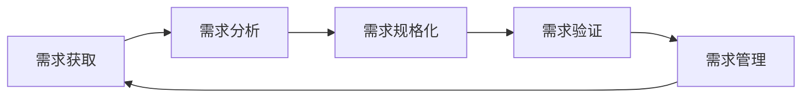
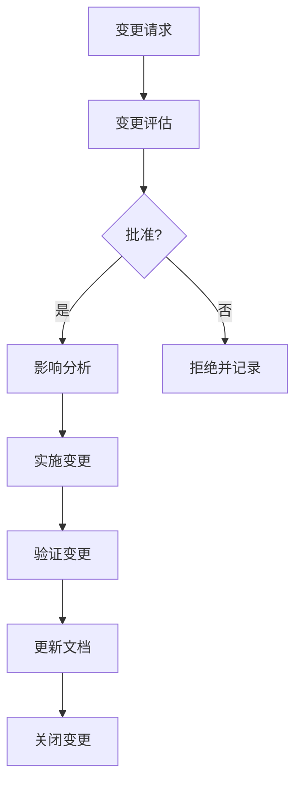

# 需求工程

## 学习目标

完成本模块后，你将能够：
- 理解医疗器械软件需求工程的重要性
- 掌握需求获取、分析和规格化方法
- 学会建立和维护需求追溯矩阵
- 了解需求验证和确认技术
- 应用需求变更管理流程

## 前置知识

- 软件工程基础
- 医疗器械开发流程
- IEC 62304标准基础

## 需求工程概述

需求工程是定义、文档化和维护软件需求的系统化过程。在医疗器械软件开发中，需求工程尤为重要，因为：
- 需求错误可能导致患者伤害
- 法规要求（IEC 62304）强制要求需求管理
- 需求是设计、实现和测试的基础
- 需求追溯是合规性的关键

### 需求工程过程



**说明**: 这是需求工程的生命周期图。展示了需求获取、需求分析、需求规格化、需求验证和需求管理之间的循环关系，体现了需求工程的迭代性和持续性。


## 需求类型

### 1. 用户需求

**定义**：从用户角度描述系统应该做什么

**特征**：
- 高层次、非技术性
- 描述用户目标和期望
- 使用用户语言

**示例**：
- "医生应该能够查看患者的历史血压数据"
- "系统应该在测量异常时发出警报"
- "护士应该能够快速记录患者生命体征"

### 2. 系统需求

**定义**：从系统角度描述系统功能和约束

**分类**：

**功能需求**：
- 系统应该提供的功能
- 输入、处理、输出
- 用户交互

**非功能需求**：
- 性能需求
- 可靠性需求
- 可用性需求
- 安全性需求
- 可维护性需求

**示例**：
```
FR-001: 系统应该存储至少1000条血压测量记录
FR-002: 系统应该在收缩压>140或舒张压>90时触发警报
NFR-001: 系统应该在2秒内完成一次血压测量
NFR-002: 系统应该达到99.9%的可用性
```

**说明**: 这是功能需求(FR)和非功能需求(NFR)的示例。功能需求定义系统应该做什么(存储记录、触发警报)，非功能需求定义系统应该如何做(性能、可用性)，两者共同构成完整的需求规格。


### 3. 软件需求

**定义**：分配给软件的系统需求

**来源**：
- 系统需求分解
- 风险控制措施
- 法规要求
- 标准要求

## 需求获取

### 获取技术

**访谈**：
- 与利益相关者一对一交流
- 结构化或非结构化
- 记录和确认

**问卷调查**：
- 收集大量用户意见
- 标准化问题
- 统计分析

**观察**：
- 观察用户实际工作
- 发现隐含需求
- 理解工作流程

**原型**：
- 快速原型展示
- 获取用户反馈
- 迭代改进

**头脑风暴**：
- 团队创意会议
- 自由讨论
- 收集想法

**文档分析**：
- 分析现有文档
- 法规和标准
- 竞品分析

### 利益相关者识别

**内部利益相关者**：
- 产品经理
- 开发团队
- 测试团队
- 质量团队
- 法规团队

**外部利益相关者**：
- 医生
- 护士
- 患者
- 医院管理者
- 监管机构

## 需求分析

### 需求分类

**MoSCoW方法**：
- **Must have**：必须有
- **Should have**：应该有
- **Could have**：可以有
- **Won't have**：不会有

### 需求优先级

**优先级因素**：
- 业务价值
- 风险等级
- 技术依赖
- 资源可用性

**优先级矩阵**：

| 重要性 | 紧急性 | 优先级 |
|-------|-------|-------|
| 高 | 高 | P0 - 立即 |
| 高 | 低 | P1 - 高 |
| 低 | 高 | P2 - 中 |
| 低 | 低 | P3 - 低 |

### 需求冲突解决

**冲突类型**：
- 功能冲突
- 性能冲突
- 资源冲突
- 利益相关者冲突

**解决方法**：
- 协商和妥协
- 优先级排序
- 技术方案调整
- 分阶段实施

## 需求规格化

### 需求规格说明（SRS）

**IEEE 830标准结构**：

1. **引言**
   - 目的
   - 范围
   - 定义、缩写和术语
   - 参考文献
   - 概述

2. **总体描述**
   - 产品前景
   - 产品功能
   - 用户特征
   - 约束
   - 假设和依赖

3. **具体需求**
   - 功能需求
   - 外部接口需求
   - 性能需求
   - 设计约束
   - 软件系统属性
   - 其他需求

### 需求编写规则

**SMART原则**：
- **S**pecific（具体的）
- **M**easurable（可测量的）
- **A**chievable（可实现的）
- **R**elevant（相关的）
- **T**ime-bound（有时限的）

**需求质量标准**：
- **明确性**：只有一种解释
- **完整性**：包含所有必要信息
- **一致性**：不与其他需求冲突
- **可验证性**：可以通过测试验证
- **可追溯性**：可以追溯到来源

**好的需求示例**：
```
REQ-001: 系统应该在用户输入错误密码3次后锁定账户30分钟
- 具体：明确3次和30分钟
- 可测量：可以测试
- 可实现：技术上可行
- 相关：与安全相关
- 可验证：可以通过测试验证
```

**不好的需求示例**：
```
REQ-002: 系统应该快速响应用户操作
- 不具体："快速"没有定义
- 不可测量：无法量化
- 不可验证：无法测试
```

**说明**: 这是不良需求的示例。"快速"是模糊的描述，既不具体也不可测量，无法验证。良好的需求应该是具体的、可测量的、可验证的，例如"系统应该在100ms内响应用户操作"。


### 需求模板

```markdown
## 需求ID: REQ-XXX

**标题**: [需求简短描述]

**优先级**: [P0/P1/P2/P3]

**类型**: [功能/性能/安全/可用性/其他]

**描述**: 
[详细描述需求]

**理由**:
[为什么需要这个需求]

**验收标准**:
1. [可验证的标准1]
2. [可验证的标准2]

**依赖**:
- [依赖的其他需求]

**风险**:
- [相关风险]

**追溯**:
- 用户需求: [UR-XXX]
- 系统需求: [SR-XXX]
- 风险: [RISK-XXX]
```

## 需求追溯

### 追溯的重要性

- 确保所有需求都被实现
- 确保所有设计都有需求支持
- 确保所有测试都覆盖需求
- 支持变更影响分析
- 满足法规要求（IEC 62304）

### 追溯类型

**前向追溯**：
- 需求 → 设计
- 设计 → 实现
- 实现 → 测试

**后向追溯**：
- 测试 → 实现
- 实现 → 设计
- 设计 → 需求

**双向追溯**：
- 前向和后向追溯的结合

### 追溯矩阵

**需求追溯矩阵（RTM）示例**：

| 需求ID | 需求描述 | 设计ID | 代码模块 | 测试用例 | 状态 |
|-------|---------|-------|---------|---------|------|
| REQ-001 | 用户登录 | DES-001 | auth.c | TC-001, TC-002 | 已实现 |
| REQ-002 | 数据加密 | DES-002 | crypto.c | TC-003 | 已实现 |
| REQ-003 | 警报功能 | DES-003 | alarm.c | TC-004, TC-005 | 开发中 |

**风险追溯矩阵示例**：

| 风险ID | 危害 | 需求ID | 设计ID | 测试ID | 验证状态 |
|-------|------|-------|-------|-------|---------|
| RISK-001 | 数据泄露 | REQ-002 | DES-002 | TC-003 | 已验证 |
| RISK-002 | 错误警报 | REQ-003 | DES-003 | TC-004 | 待验证 |

### 追溯工具

**工具类型**：
- 需求管理工具（DOORS, Jama, Helix RM）
- ALM工具（Jira, Azure DevOps）
- 文档工具（Excel, Confluence）

**工具功能**：
- 需求存储和版本控制
- 追溯链接管理
- 影响分析
- 报告生成

## 需求验证和确认

### 验证（Verification）

**目的**：确保需求正确、完整、一致

**验证技术**：

**需求评审**：
- 同行评审
- 走查
- 检查

**需求检查表**：
```
□ 需求是否明确？
□ 需求是否完整？
□ 需求是否一致？
□ 需求是否可验证？
□ 需求是否可追溯？
□ 需求是否符合标准？
□ 需求是否考虑了风险？
```

**原型验证**：
- 快速原型
- 用户界面原型
- 功能原型

**模型验证**：
- 用例模型
- 状态机模型
- 数据流模型

### 确认（Validation）

**目的**：确保需求满足用户真实需求

**确认技术**：
- 用户评审
- 用户测试
- 验收测试
- 现场试用

## 需求变更管理

### 变更控制流程



**说明**: 这是需求变更管理流程图。从变更请求开始，经过评估、批准、影响分析、实施、验证、更新文档到关闭的完整流程。如果不批准，则拒绝并记录原因，确保变更的可控性。


### 变更影响分析

**分析内容**：
- 受影响的需求
- 受影响的设计
- 受影响的代码
- 受影响的测试
- 受影响的文档
- 风险影响
- 成本和时间影响

**影响分析矩阵**：

| 变更ID | 变更描述 | 受影响需求 | 受影响设计 | 受影响代码 | 受影响测试 | 工作量估计 |
|-------|---------|-----------|-----------|-----------|-----------|-----------|
| CR-001 | 添加新警报 | REQ-003 | DES-003 | alarm.c | TC-006 | 5天 |

### 变更请求模板

```markdown
## 变更请求ID: CR-XXX

**请求日期**: [日期]

**请求人**: [姓名]

**变更类型**: [新功能/缺陷修复/改进/其他]

**优先级**: [高/中/低]

**变更描述**:
[详细描述变更内容]

**变更理由**:
[为什么需要这个变更]

**影响分析**:
- 受影响需求: [列表]
- 受影响设计: [列表]
- 受影响代码: [列表]
- 受影响测试: [列表]
- 风险影响: [描述]

**工作量估计**: [天数]

**批准状态**: [待批准/已批准/已拒绝]

**批准人**: [姓名]

**批准日期**: [日期]
```

## 最佳实践

!!! tip "需求工程建议"
    1. **早期参与**：在项目早期就开始需求工程
    2. **持续沟通**：与利益相关者保持持续沟通
    3. **迭代细化**：逐步细化需求，不要一次性完成
    4. **优先级管理**：明确需求优先级，聚焦核心需求
    5. **追溯维护**：持续维护追溯关系
    6. **变更控制**：严格控制需求变更
    7. **工具支持**：使用合适的需求管理工具

## 常见陷阱

!!! warning "注意事项"
    1. **需求不明确**：使用模糊语言描述需求
    2. **需求蔓延**：不断添加新需求，导致范围失控
    3. **缺少追溯**：未建立或维护追溯关系
    4. **忽视非功能需求**：只关注功能需求
    5. **变更失控**：未严格控制需求变更
    6. **缺少验证**：未充分验证需求质量
    7. **文档过时**：需求文档未及时更新

## 实践练习

1. 为一个血糖监测器编写5个功能需求和3个非功能需求
2. 创建一个需求追溯矩阵，包含需求、设计、代码和测试
3. 进行一次需求评审，使用检查表验证需求质量
4. 处理一个需求变更请求，进行影响分析

## 自测问题

??? question "问题1：功能需求和非功能需求有什么区别？各举3个例子。"
    
    ??? success "答案"
        **功能需求**：描述系统应该做什么，系统的功能和行为
        
        示例：
        1. 系统应该允许用户登录
        2. 系统应该存储患者数据
        3. 系统应该生成报告
        
        **非功能需求**：描述系统应该如何工作，系统的质量属性
        
        示例：
        1. 性能：系统应该在2秒内响应用户操作
        2. 可靠性：系统应该达到99.9%的可用性
        3. 安全性：系统应该加密所有敏感数据
        
        **区别**：
        - 功能需求关注"做什么"，非功能需求关注"做得怎么样"
        - 功能需求通常更容易测试，非功能需求需要特殊测试方法
        - 功能需求直接对应用户功能，非功能需求影响用户体验

??? question "问题2：什么是需求追溯？为什么重要？"
    
    ??? success "答案"
        **需求追溯**：建立和维护需求与其他工作产品（设计、代码、测试）之间的关系。
        
        **类型**：
        - 前向追溯：需求 → 设计 → 代码 → 测试
        - 后向追溯：测试 → 代码 → 设计 → 需求
        
        **重要性**：
        1. **完整性**：确保所有需求都被实现和测试
        2. **一致性**：确保设计和代码与需求一致
        3. **变更管理**：支持变更影响分析
        4. **法规合规**：满足IEC 62304等标准要求
        5. **质量保证**：提供质量证据
        6. **维护性**：便于理解系统和进行维护
        
        **示例**：
        - 需求REQ-001要求用户登录功能
        - 设计DES-001描述登录模块设计
        - 代码auth.c实现登录功能
        - 测试TC-001和TC-002验证登录功能
        - 追溯链：REQ-001 → DES-001 → auth.c → TC-001, TC-002

??? question "问题3：SMART原则是什么？如何应用到需求编写？"
    
    ??? success "答案"
        **SMART原则**：
        - **S**pecific（具体的）：需求应该明确具体
        - **M**easurable（可测量的）：需求应该可以量化
        - **A**chievable（可实现的）：需求应该技术上可行
        - **R**elevant（相关的）：需求应该与目标相关
        - **T**ime-bound（有时限的）：需求应该有明确的时间要求（如适用）
        
        **应用示例**：
        
        **不好的需求**：
        "系统应该快速响应"
        - 不具体："快速"没有定义
        - 不可测量：无法量化
        
        **好的需求**：
        "系统应该在用户点击按钮后2秒内显示结果"
        - 具体：明确是"点击按钮后显示结果"
        - 可测量：2秒可以测量
        - 可实现：技术上可行
        - 相关：与用户体验相关
        - 有时限：2秒

??? question "问题4：需求变更管理流程包括哪些步骤？"
    
    ??? success "答案"
        **需求变更管理流程**：
        
        1. **变更请求**：
           - 提交变更请求
           - 记录变更信息
        
        2. **变更评估**：
           - 评估变更的必要性
           - 评估变更的可行性
           - 初步评估影响
        
        3. **变更批准**：
           - 变更控制委员会（CCB）评审
           - 批准或拒绝变更
           - 记录决策理由
        
        4. **影响分析**：
           - 分析受影响的需求、设计、代码、测试
           - 评估风险影响
           - 估计工作量和成本
        
        5. **实施变更**：
           - 更新需求文档
           - 更新设计和代码
           - 更新测试用例
        
        6. **验证变更**：
           - 验证变更正确实施
           - 执行回归测试
        
        7. **更新文档**：
           - 更新所有相关文档
           - 更新追溯矩阵
        
        8. **关闭变更**：
           - 确认变更完成
           - 归档变更记录

??? question "问题5：需求验证和需求确认有什么区别？"
    
    ??? success "答案"
        **需求验证（Verification）**：
        - 问题："我们是否正确地编写了需求？"（Are we building the requirements right?）
        - 目的：确保需求正确、完整、一致
        - 方法：需求评审、检查表、原型、模型
        - 时机：需求编写过程中和完成后
        - 参与者：开发团队、质量团队
        
        **需求确认（Validation）**：
        - 问题："我们是否编写了正确的需求？"（Are we building the right requirements?）
        - 目的：确保需求满足用户真实需求
        - 方法：用户评审、用户测试、验收测试
        - 时机：需求完成后，实施前或实施后
        - 参与者：用户、利益相关者
        
        **简单记忆**：
        - 验证是"做对"（内部质量）
        - 确认是"做对的事"（外部质量）
        
        **示例**：
        - 验证：检查需求是否明确、完整、一致
        - 确认：让医生确认需求是否满足临床需要

??? question "问题6：如何处理需求冲突？"
    
    ??? success "答案"
        **需求冲突类型**：
        1. 功能冲突：两个需求要求不同的功能
        2. 性能冲突：性能需求相互矛盾
        3. 资源冲突：需求超出可用资源
        4. 利益相关者冲突：不同利益相关者有不同需求
        
        **解决方法**：
        
        1. **协商和妥协**：
           - 与利益相关者沟通
           - 寻找折中方案
           - 达成共识
        
        2. **优先级排序**：
           - 使用MoSCoW方法
           - 确定哪些需求更重要
           - 延后低优先级需求
        
        3. **技术方案调整**：
           - 寻找技术解决方案
           - 重新设计架构
           - 使用新技术
        
        4. **分阶段实施**：
           - 将冲突需求分到不同阶段
           - 先实现高优先级需求
           - 后续版本实现其他需求
        
        5. **风险评估**：
           - 评估不满足需求的风险
           - 选择风险较低的方案
        
        **示例**：
        - 冲突：医生要求详细的患者信息，护士要求简洁的界面
        - 解决：提供两种视图模式，医生使用详细模式，护士使用简洁模式

## 相关资源

- [需求追溯](requirements-traceability.md)
- [IEC 62304 - 软件生命周期](../../regulatory-standards/iec-62304/index.md)
- [架构设计](../architecture-design/index.md)
- [测试策略](../testing-strategy/index.md)

## 参考文献

1. IEEE 830-1998 - IEEE Recommended Practice for Software Requirements Specifications
2. IEC 62304:2006+AMD1:2015 - Medical device software - Software life cycle processes
3. ISO/IEC/IEEE 29148:2018 - Systems and software engineering - Life cycle processes - Requirements engineering
4. 书籍：《Software Requirements》by Karl Wiegers and Joy Beatty
5. 书籍：《Mastering the Requirements Process》by Suzanne Robertson and James Robertson


## 内容模块

- [需求获取技术](requirements-elicitation.md)
- [需求规格说明书（SRS）](requirements-specification.md)
- [用户需求vs系统需求](user-vs-system-requirements.md)
- [需求验证方法](requirements-validation.md)
- [需求追溯](requirements-traceability.md)
- [需求变更管理](change-management.md)
