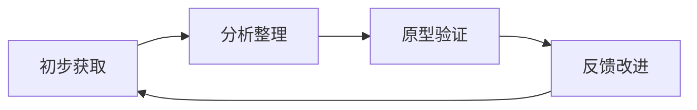

# 需求获取技术

## 学习目标

完成本模块后，你将能够：
- 掌握多种需求获取技术及其适用场景
- 识别和管理医疗器械项目的利益相关者
- 有效进行需求访谈和工作坊
- 使用原型法获取和验证需求
- 处理需求获取中的常见挑战

## 前置知识

- 软件工程基础
- 医疗器械开发流程
- 基本的沟通技巧

## 需求获取概述

需求获取是从利益相关者那里发现、理解和记录需求的过程。在医疗器械软件开发中，需求获取尤为关键，因为：

- **安全关键**：需求错误可能导致患者伤害
- **多方利益相关者**：医生、护士、患者、监管机构等
- **复杂环境**：医疗环境复杂，工作流程多样
- **法规要求**：必须满足IEC 62304、IEC 62366等标准

### 需求获取的挑战

!!! warning "常见挑战"
    1. **隐性知识**：用户难以表达隐含的需求
    2. **术语差异**：医疗术语与技术术语的鸿沟
    3. **时间限制**：医护人员时间有限
    4. **环境限制**：难以进入临床环境观察
    5. **需求变化**：医疗实践不断演进
    6. **法规约束**：必须考虑法规要求

## 利益相关者识别与分析

### 利益相关者类型

**主要利益相关者**：

1. **临床用户**
   - 医生（各专科）
   - 护士
   - 技师
   - 药剂师

2. **非临床用户**
   - 患者
   - 患者家属
   - 医院管理者
   - IT管理员

3. **内部团队**
   - 产品经理
   - 开发团队
   - 测试团队
   - 质量团队
   - 法规团队
   - 市场团队

4. **外部组织**
   - 监管机构（FDA、NMPA、EMA）
   - 认证机构
   - 保险公司
   - 供应商

### 利益相关者分析矩阵

**权力-利益矩阵**：

| 权力/利益 | 低利益 | 高利益 |
|----------|--------|--------|
| **高权力** | 保持满意<br>（医院管理者） | 重点管理<br>（主治医生、监管机构） |
| **低权力** | 最小努力<br>（偶尔使用的用户） | 保持知情<br>（护士、技师） |

**利益相关者登记表**：

```markdown
| 利益相关者 | 角色 | 关注点 | 影响力 | 参与方式 | 联系人 |
|-----------|------|--------|--------|---------|--------|
| 李医生 | 心内科主任 | 诊断准确性 | 高 | 访谈、评审 | li@hospital.com |
| 王护士 | 护士长 | 操作便捷性 | 中 | 观察、测试 | wang@hospital.com |
| 张主任 | 医院CIO | 系统集成 | 高 | 工作坊 | zhang@hospital.com |
```

## 需求获取技术

### 1. 访谈（Interviews）

**定义**：与利益相关者一对一或小组交流，获取需求信息。

**类型**：

**结构化访谈**：
- 预先准备问题清单
- 按固定顺序提问
- 适合收集特定信息
- 易于分析和比较

**半结构化访谈**：
- 有基本问题框架
- 允许灵活调整
- 可以深入探讨
- 最常用的方式

**非结构化访谈**：
- 开放式对话
- 探索性讨论
- 适合早期探索
- 难以控制方向

**访谈准备清单**：

```markdown
## 访谈准备

### 访谈前
- [ ] 确定访谈目标
- [ ] 准备问题清单
- [ ] 了解被访谈者背景
- [ ] 预约时间和地点
- [ ] 准备记录工具
- [ ] 准备演示材料（如需要）

### 访谈中
- [ ] 自我介绍和项目介绍
- [ ] 说明访谈目的和时长
- [ ] 征得录音/录像许可
- [ ] 按问题清单提问
- [ ] 积极倾听，做好记录
- [ ] 适时追问和澄清
- [ ] 总结确认理解

### 访谈后
- [ ] 整理访谈记录
- [ ] 提取需求信息
- [ ] 发送确认邮件
- [ ] 归档访谈文档
```

**访谈问题示例**（血压监护仪）：

```markdown
## 开放式问题
1. 您在日常工作中如何使用血压监护设备？
2. 当前设备有哪些让您满意的地方？
3. 当前设备有哪些让您不满意的地方？
4. 您希望新设备具备哪些功能？

## 探索式问题
5. 能否描述一个典型的患者监护场景？
6. 遇到异常血压读数时，您通常如何处理？
7. 您如何与其他医护人员共享监护数据？

## 确认式问题
8. 您是说需要在2秒内完成测量，对吗？
9. 您提到的"快速响应"具体是指多快？
10. 这个功能对您来说有多重要？（1-5分）
```

**访谈技巧**：

!!! tip "有效访谈技巧"
    1. **建立信任**：友好、专业、尊重
    2. **积极倾听**：专注、不打断、眼神交流
    3. **开放式问题**：鼓励详细回答
    4. **追问澄清**：确保理解准确
    5. **避免引导**：不要暗示答案
    6. **记录要点**：及时记录关键信息
    7. **总结确认**：访谈结束前总结确认

### 2. 问卷调查（Questionnaires）

**定义**：通过标准化问题收集大量用户的意见和需求。

**适用场景**：
- 需要收集大量用户意见
- 用户地理分布广泛
- 需要量化数据
- 预算和时间有限

**问卷设计原则**：

1. **明确目标**：清楚想要了解什么
2. **简洁明了**：问题简短易懂
3. **逻辑顺序**：从一般到具体
4. **避免偏见**：中立的问题表述
5. **适当长度**：10-15分钟完成

**问题类型**：

**封闭式问题**：
```markdown
1. 您使用血压监护仪的频率？
   □ 每天多次
   □ 每天一次
   □ 每周几次
   □ 很少使用

2. 您对当前设备的满意度？（1-5分）
   1 - 非常不满意
   2 - 不满意
   3 - 一般
   4 - 满意
   5 - 非常满意
```

**开放式问题**：
```markdown
3. 您希望新设备增加哪些功能？
   _________________________________

4. 您在使用中遇到的最大问题是什么？
   _________________________________
```

**李克特量表**：
```markdown
5. 请评价以下功能的重要性（1-5分）

| 功能 | 不重要 | 较不重要 | 一般 | 重要 | 非常重要 |
|------|--------|---------|------|------|---------|
| 自动测量 | 1 | 2 | 3 | 4 | 5 |
| 趋势分析 | 1 | 2 | 3 | 4 | 5 |
| 警报功能 | 1 | 2 | 3 | 4 | 5 |
```

### 3. 观察法（Observation）

**定义**：在实际工作环境中观察用户的行为和工作流程。

**类型**：

**被动观察**：
- 观察者不参与
- 记录用户行为
- 不干扰工作流程

**主动观察**：
- 观察者参与工作
- 体验用户角色
- 深入理解需求

**观察记录模板**：

```markdown
## 观察记录

**日期**：2026-02-10
**地点**：心内科病房
**观察者**：张工程师
**观察对象**：护士王某
**观察时长**：2小时

### 观察内容

**场景1：常规血压测量（8:00-8:15）**
- 护士从护士站取出血压计
- 走到病房，向患者解释
- 为患者佩戴袖带
- 启动测量，等待结果
- 手工记录在纸质表格
- 返回护士站，录入电脑系统

**发现的问题**：
1. 需要手工记录，容易出错
2. 双重录入，浪费时间
3. 无法实时查看历史数据

**潜在需求**：
1. 自动数据传输到护士站
2. 移动端查看历史数据
3. 异常值自动警报
```

**观察技巧**：

!!! tip "观察要点"
    1. **获得许可**：事先获得观察许可
    2. **不干扰**：尽量不影响正常工作
    3. **记录详细**：记录行为、环境、工具
    4. **注意异常**：关注问题和困难
    5. **多次观察**：观察不同场景和时间
    6. **访谈结合**：观察后进行访谈确认

### 4. 工作坊（Workshops）

**定义**：组织多个利益相关者参加的结构化会议，共同讨论和定义需求。

**适用场景**：
- 需要多方达成共识
- 解决需求冲突
- 快速获取大量需求
- 促进团队协作

**工作坊类型**：

**需求获取工作坊**：
- 目标：收集和定义需求
- 参与者：用户、开发团队、产品经理
- 时长：半天到一天

**需求优先级工作坊**：
- 目标：确定需求优先级
- 方法：MoSCoW、投票、排序
- 时长：2-4小时

**工作坊流程**：


**工作坊准备清单**：

```markdown
## 工作坊准备

### 会前准备
- [ ] 确定工作坊目标
- [ ] 邀请参与者
- [ ] 预定会议室
- [ ] 准备材料（白板、便签、笔）
- [ ] 准备议程
- [ ] 发送预读材料

### 会议室布置
- [ ] 白板和白板笔
- [ ] 便签纸（多种颜色）
- [ ] 投影仪
- [ ] 茶水点心
- [ ] 计时器

### 角色分工
- [ ] 主持人（引导讨论）
- [ ] 记录员（记录要点）
- [ ] 时间管理员（控制时间）
```

**工作坊技术**：

**头脑风暴**：
- 自由提出想法
- 不批评不评判
- 鼓励创新思维
- 数量优于质量

**亲和图法**：
- 将想法写在便签上
- 分组归类
- 识别主题
- 形成需求类别

**用户故事地图**：
- 横轴：用户活动流程
- 纵轴：优先级
- 可视化需求全景
- 识别MVP范围

### 5. 原型法（Prototyping）

**定义**：创建系统的早期版本，用于获取和验证需求。

**原型类型**：

**低保真原型**：
- 纸质原型
- 线框图
- 快速制作
- 成本低

**高保真原型**：
- 交互式原型
- 接近最终产品
- 制作时间长
- 成本较高

**原型工具**：

| 工具类型 | 工具示例 | 适用场景 |
|---------|---------|---------|
| 纸质原型 | 纸、笔、便签 | 早期概念验证 |
| 线框图工具 | Balsamiq, Sketch | UI布局设计 |
| 交互原型 | Figma, Adobe XD | 用户体验测试 |
| 代码原型 | HTML/CSS/JS | 技术可行性验证 |

**原型评审流程**：

```markdown
## 原型评审会议

### 会前准备
1. 准备原型演示
2. 准备评审问题清单
3. 邀请利益相关者

### 会议流程
1. 介绍原型目标（5分钟）
2. 演示原型功能（15分钟）
3. 用户试用原型（20分钟）
4. 收集反馈意见（15分钟）
5. 讨论修改建议（10分钟）

### 评审问题
- 这个界面是否符合您的工作流程？
- 这些功能是否满足您的需求？
- 有哪些功能缺失？
- 有哪些功能不需要？
- 操作是否直观易用？
```

**原型反馈记录**：

```markdown
| 反馈人 | 反馈内容 | 类型 | 优先级 | 处理方案 |
|-------|---------|------|--------|---------|
| 李医生 | 需要显示历史趋势 | 新功能 | 高 | 下版本添加 |
| 王护士 | 按钮太小，不易点击 | 改进 | 高 | 立即修改 |
| 张主任 | 需要导出报告功能 | 新功能 | 中 | 评估后决定 |
```

### 6. 文档分析（Document Analysis）

**定义**：分析现有文档以获取需求信息。

**文档来源**：

**内部文档**：
- 产品规划文档
- 市场调研报告
- 竞品分析报告
- 用户反馈记录
- 支持工单记录

**外部文档**：
- 法规标准（IEC 62304、FDA指南）
- 行业标准（HL7、DICOM）
- 医学文献
- 临床指南
- 竞品说明书

**文档分析清单**：

```markdown
## 法规标准分析

### IEC 62304分析
- [ ] 软件安全分类要求
- [ ] 生命周期过程要求
- [ ] 文档要求
- [ ] 追溯要求

### IEC 62366分析
- [ ] 可用性工程要求
- [ ] 使用错误分析
- [ ] 用户界面要求
- [ ] 可用性测试要求

### FDA指南分析
- [ ] 软件验证要求
- [ ] 网络安全要求
- [ ] 数据完整性要求
```

### 7. 用例分析（Use Case Analysis）

**定义**：通过用例描述系统与用户的交互，获取功能需求。

**用例模板**：

```markdown
## 用例：测量患者血压

**用例ID**：UC-001
**用例名称**：测量患者血压
**主要参与者**：护士
**次要参与者**：患者、系统
**前置条件**：
- 设备已开机并完成自检
- 患者已准备好测量

**主要流程**：
1. 护士扫描患者腕带，识别患者身份
2. 系统显示患者基本信息
3. 护士为患者佩戴袖带
4. 护士点击"开始测量"按钮
5. 系统开始充气测量
6. 系统显示测量结果（收缩压、舒张压、心率）
7. 系统自动保存测量数据
8. 护士确认数据无误

**替代流程**：
- 3a. 如果袖带佩戴不当
  - 3a1. 系统提示"袖带佩戴不当"
  - 3a2. 护士重新佩戴袖带
  - 3a3. 返回步骤4

- 5a. 如果测量失败
  - 5a1. 系统提示"测量失败，请重试"
  - 5a2. 返回步骤4

**异常流程**：
- 6a. 如果测量值异常（收缩压>180或<90）
  - 6a1. 系统发出警报
  - 6a2. 系统提示"测量值异常，建议重测"
  - 6a3. 护士决定是否重测

**后置条件**：
- 测量数据已保存到系统
- 测量记录可在患者档案中查看

**非功能需求**：
- 测量时间：<30秒
- 测量精度：±3mmHg
- 数据保存时间：<1秒
```

## 需求获取最佳实践

### 1. 多种技术组合使用

!!! tip "技术组合建议"
    - **早期探索**：访谈 + 观察 + 文档分析
    - **需求定义**：工作坊 + 原型 + 用例分析
    - **需求验证**：原型 + 问卷调查 + 评审
    - **持续改进**：用户反馈 + 数据分析

### 2. 迭代式需求获取



### 3. 需求获取计划

```markdown
## 需求获取计划

### 第一阶段：探索（2周）
- 文档分析：法规标准、竞品分析
- 访谈：5位医生、3位护士
- 观察：2次临床观察

### 第二阶段：定义（3周）
- 工作坊：需求获取工作坊（1天）
- 原型：低保真原型制作
- 用例：编写主要用例

### 第三阶段：验证（2周）
- 原型评审：与用户评审原型
- 问卷调查：收集更多用户意见
- 需求评审：内部需求评审会
```

### 4. 医疗器械特定考虑

**临床环境访问**：
- 提前预约，避免干扰临床工作
- 遵守医院规章制度
- 保护患者隐私
- 穿戴适当的防护装备

**医疗术语理解**：
- 学习基本医疗术语
- 准备术语表
- 必要时请教医学专家
- 避免误解和歧义

**法规要求整合**：
- 从法规标准中提取需求
- 将法规要求转化为系统需求
- 建立法规到需求的追溯

## 需求获取工具

### 需求管理工具

| 工具 | 类型 | 特点 | 适用场景 |
|------|------|------|---------|
| IBM DOORS | 企业级 | 强大的追溯功能 | 大型医疗器械项目 |
| Jama Connect | 云端 | 协作友好 | 中大型项目 |
| Helix RM | 企业级 | 与ALM集成 | 复杂项目 |
| Jira | 敏捷 | 灵活易用 | 敏捷开发项目 |
| Confluence | 文档 | 知识管理 | 文档协作 |

### 原型工具

| 工具 | 类型 | 学习曲线 | 协作功能 |
|------|------|---------|---------|
| Figma | 在线 | 中等 | 优秀 |
| Adobe XD | 桌面 | 中等 | 良好 |
| Sketch | 桌面 | 中等 | 良好 |
| Balsamiq | 线框图 | 简单 | 一般 |
| Axure RP | 高保真 | 较难 | 良好 |

### 协作工具

- **视频会议**：Zoom, Teams, WebEx
- **白板工具**：Miro, Mural, FigJam
- **调查工具**：SurveyMonkey, Google Forms
- **录屏工具**：Loom, Camtasia

## 实践案例：血糖监测仪需求获取

### 项目背景

开发一款家用血糖监测仪，目标用户为糖尿病患者。

### 需求获取过程

**第一阶段：准备（1周）**

1. **文档分析**
   - 分析FDA血糖仪指南
   - 分析ISO 15197标准
   - 研究竞品功能

2. **利益相关者识别**
   - 主要：糖尿病患者、内分泌科医生
   - 次要：患者家属、药店销售人员
   - 内部：产品、开发、测试、法规团队

**第二阶段：获取（3周）**

1. **访谈（第1周）**
   - 访谈5位糖尿病患者
   - 访谈3位内分泌科医生
   - 访谈2位药店销售人员

   **关键发现**：
   - 患者希望操作简单，一键测量
   - 医生需要查看患者的血糖趋势
   - 需要与手机App连接

2. **观察（第2周）**
   - 观察患者在家测量血糖
   - 观察医生查看患者血糖记录

   **关键发现**：
   - 患者经常忘记记录测量时间
   - 手工记录容易出错
   - 医生需要餐前餐后血糖对比

3. **工作坊（第2周）**
   - 组织需求工作坊
   - 参与者：2位患者、1位医生、产品团队

   **输出**：
   - 30个功能需求
   - 按MoSCoW分类
   - 识别MVP功能

4. **原型（第3周）**
   - 制作低保真原型
   - 包含主要界面和流程

**第三阶段：验证（2周）**

1. **原型评审**
   - 与5位患者评审原型
   - 收集反馈，迭代改进

2. **问卷调查**
   - 在线问卷，收集100份回复
   - 验证功能优先级

3. **需求文档**
   - 编写需求规格说明书
   - 内部评审和批准

### 获取的关键需求

```markdown
## 功能需求

**Must Have**
- FR-001: 一键测量血糖
- FR-002: 自动记录测量时间
- FR-003: 显示测量结果
- FR-004: 蓝牙连接手机App
- FR-005: 存储至少500条记录

**Should Have**
- FR-006: 餐前餐后标记
- FR-007: 血糖趋势图表
- FR-008: 异常值警报
- FR-009: 数据导出功能

**Could Have**
- FR-010: 语音播报结果
- FR-011: 用药提醒
- FR-012: 与医生共享数据

## 非功能需求

- NFR-001: 测量时间<5秒
- NFR-002: 测量精度符合ISO 15197
- NFR-003: 电池续航>1000次测量
- NFR-004: 操作步骤<3步
```

## 常见挑战与解决方案

### 挑战1：用户时间有限

**问题**：医护人员工作繁忙，难以安排访谈时间。

**解决方案**：
- 灵活安排时间（早晨、午休、下班后）
- 缩短访谈时间（30分钟内）
- 提供补偿（礼品卡、感谢信）
- 在线问卷作为补充

### 挑战2：术语理解困难

**问题**：医疗术语复杂，工程师难以理解。

**解决方案**：
- 准备医疗术语表
- 请医学顾问参与
- 录音后请教专家
- 使用图示和示例

### 挑战3：需求冲突

**问题**：不同利益相关者需求冲突。

**解决方案**：
- 组织工作坊，面对面讨论
- 使用优先级矩阵
- 寻找折中方案
- 分阶段实施

### 挑战4：隐性需求

**问题**：用户难以表达隐含的需求。

**解决方案**：
- 使用观察法发现隐性需求
- 原型法激发用户想法
- 提供竞品参考
- 多次迭代获取

## 自测问题

??? question "问题1：访谈和问卷调查各有什么优缺点？什么时候使用？"
    
    ??? success "答案"
        **访谈**
        
        优点：
        - 深入了解需求
        - 可以追问和澄清
        - 发现隐性需求
        - 建立信任关系
        
        缺点：
        - 耗时较长
        - 样本量小
        - 难以量化
        - 受访谈者影响
        
        适用场景：
        - 早期探索阶段
        - 需要深入理解
        - 关键利益相关者
        - 复杂需求
        
        **问卷调查**
        
        优点：
        - 样本量大
        - 易于量化分析
        - 成本低
        - 标准化数据
        
        缺点：
        - 缺乏深度
        - 无法追问
        - 回复率可能低
        - 问题设计困难
        
        适用场景：
        - 验证假设
        - 收集大量意见
        - 优先级排序
        - 用户分布广泛

??? question "问题2：如何识别和管理利益相关者？"
    
    ??? success "答案"
        **识别步骤**：
        
        1. **头脑风暴**：列出所有可能的利益相关者
        2. **分类**：按角色、影响力、利益分类
        3. **优先级**：使用权力-利益矩阵排序
        4. **验证**：与团队确认是否遗漏
        
        **管理策略**：
        
        - **高权力高利益**（重点管理）
          - 密切沟通
          - 定期汇报
          - 积极参与决策
        
        - **高权力低利益**（保持满意）
          - 定期更新
          - 避免过度打扰
          - 关键决策时咨询
        
        - **低权力高利益**（保持知情）
          - 提供信息
          - 收集反馈
          - 适度参与
        
        - **低权力低利益**（最小努力）
          - 基本沟通
          - 必要时通知

??? question "问题3：原型法有哪些类型？如何选择？"
    
    ??? success "答案"
        **原型类型**：
        
        1. **低保真原型**
           - 纸质原型、线框图
           - 快速制作，成本低
           - 适合早期概念验证
        
        2. **高保真原型**
           - 交互式原型，接近最终产品
           - 制作时间长，成本高
           - 适合详细设计和用户测试
        
        3. **水平原型**
           - 展示广度，功能不深入
           - 适合展示整体功能
        
        4. **垂直原型**
           - 展示深度，功能完整
           - 适合验证关键功能
        
        **选择标准**：
        
        - **项目阶段**：早期用低保真，后期用高保真
        - **目标**：概念验证用低保真，用户测试用高保真
        - **资源**：时间紧用低保真，资源充足用高保真
        - **受众**：内部评审用低保真，客户演示用高保真

??? question "问题4：如何处理需求获取中的冲突？"
    
    ??? success "答案"
        **冲突类型**：
        
        1. **功能冲突**：不同用户要求不同功能
        2. **优先级冲突**：对功能重要性看法不同
        3. **资源冲突**：需求超出可用资源
        4. **技术冲突**：需求与技术限制冲突
        
        **解决方法**：
        
        1. **协商和妥协**
           - 组织工作坊，面对面讨论
           - 寻找双方都能接受的方案
           - 强调共同目标
        
        2. **优先级排序**
           - 使用MoSCoW方法
           - 投票或评分
           - 基于业务价值和风险
        
        3. **分阶段实施**
           - 第一阶段实现核心功能
           - 后续版本添加其他功能
           - 降低冲突影响
        
        4. **技术方案调整**
           - 寻找技术解决方案
           - 重新设计架构
           - 引入新技术
        
        5. **决策升级**
           - 无法达成一致时
           - 升级到管理层决策
           - 记录决策理由

## 实践练习

1. **访谈练习**：为一个心电监护仪项目准备访谈问题清单（至少10个问题）
2. **观察练习**：观察一次医疗设备使用场景，记录观察结果和发现的需求
3. **工作坊练习**：设计一个需求获取工作坊的议程（半天）
4. **原型练习**：为一个血压计制作纸质原型，包含主要界面

## 相关资源

- [需求工程概述](index.md)
- [需求规格说明书](requirements-specification.md)
- [用户需求vs系统需求](user-vs-system-requirements.md)
- [IEC 62366 - 可用性工程](../../regulatory-standards/iec-62366/index.md)

## 参考文献

1. Lauesen, S. (2002). Software Requirements: Styles and Techniques. Addison-Wesley.
2. Robertson, S., & Robertson, J. (2012). Mastering the Requirements Process. Addison-Wesley.
3. Wiegers, K., & Beatty, J. (2013). Software Requirements (3rd ed.). Microsoft Press.
4. IEC 62366-1:2015 - Medical devices - Application of usability engineering to medical devices
5. FDA (2016). Applying Human Factors and Usability Engineering to Medical Devices
