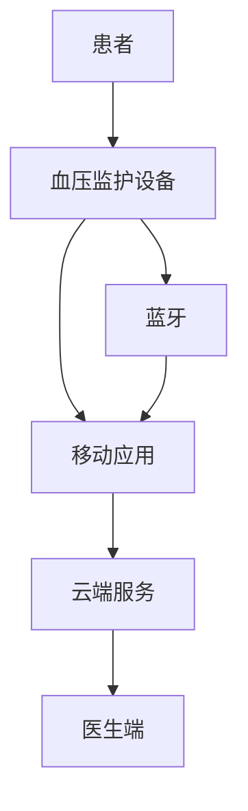

# 需求规格说明书（SRS）

## 学习目标

完成本模块后，你将能够：
- 理解需求规格说明书的目的和重要性
- 掌握IEEE 830标准的SRS结构
- 编写符合医疗器械标准的SRS
- 应用需求编写的最佳实践
- 评审和验证SRS质量

## 前置知识

- 需求工程基础
- 医疗器械开发流程
- IEC 62304标准基础

## SRS概述

### 什么是SRS？

**需求规格说明书（Software Requirements Specification, SRS）**是一份详细描述软件系统需求的文档，包括功能需求、非功能需求、约束条件和接口需求。

### SRS的目的

1. **沟通工具**：在利益相关者之间建立共同理解
2. **合同基础**：作为开发合同的一部分
3. **设计输入**：为设计和实现提供基础
4. **测试依据**：为测试提供验证标准
5. **法规合规**：满足IEC 62304等标准要求

### SRS的特征

!!! tip "优秀SRS的特征"
    - **正确性**：准确反映用户需求
    - **明确性**：只有一种解释
    - **完整性**：包含所有必要需求
    - **一致性**：需求之间不冲突
    - **可验证性**：可以通过测试验证
    - **可修改性**：易于修改和维护
    - **可追溯性**：可以追溯到来源

## IEEE 830标准

### 标准结构

IEEE 830-1998定义了SRS的推荐结构：

```markdown
1. 引言
   1.1 目的
   1.2 范围
   1.3 定义、缩写和术语
   1.4 参考文献
   1.5 概述

2. 总体描述
   2.1 产品前景
   2.2 产品功能
   2.3 用户特征
   2.4 约束
   2.5 假设和依赖

3. 具体需求
   3.1 功能需求
   3.2 外部接口需求
   3.3 性能需求
   3.4 设计约束
   3.5 软件系统属性
   3.6 其他需求

附录
索引
```

### 各章节详解

#### 1. 引言

**1.1 目的**

说明SRS的目的和目标读者。

```markdown
## 1.1 目的

本文档是[产品名称]的软件需求规格说明书（SRS）。本文档的目的是：

1. 明确定义软件系统的功能和非功能需求
2. 为设计、开发和测试提供基础
3. 作为与利益相关者沟通的基础
4. 满足IEC 62304标准的要求

**目标读者**：
- 产品经理
- 软件开发团队
- 测试团队
- 质量保证团队
- 法规事务团队
- 项目管理团队
```

**1.2 范围**

定义软件系统的范围和边界。

```markdown
## 1.2 范围

**产品名称**：智能血压监护系统

**产品范围**：
- 嵌入式软件：运行在血压监护设备上
- 移动应用：iOS和Android应用
- 云端服务：数据存储和分析服务

**主要功能**：
- 自动血压测量
- 数据存储和管理
- 趋势分析和报告
- 异常警报
- 数据同步

**不包括**：
- 硬件设计
- 袖带和传感器
- 医院信息系统集成（未来版本）
```

**1.3 定义、缩写和术语**

```markdown
## 1.3 定义、缩写和术语

### 定义

| 术语 | 定义 |
|------|------|
| 收缩压 | 心脏收缩时血管内的压力，单位mmHg |
| 舒张压 | 心脏舒张时血管内的压力，单位mmHg |
| 高血压 | 收缩压≥140mmHg或舒张压≥90mmHg |

### 缩写

| 缩写 | 全称 |
|------|------|
| SRS | Software Requirements Specification |
| BP | Blood Pressure |
| SBP | Systolic Blood Pressure |
| DBP | Diastolic Blood Pressure |
| BLE | Bluetooth Low Energy |
| API | Application Programming Interface |

### 医疗术语

| 术语 | 说明 |
|------|------|
| 白大衣高血压 | 在医疗环境中测量血压偏高的现象 |
| 体位性低血压 | 体位改变时血压下降 |
```

**1.4 参考文献**

```markdown
## 1.4 参考文献

1. IEC 62304:2006+AMD1:2015 - Medical device software - Software life cycle processes
2. IEC 60601-1:2005+AMD1:2012 - Medical electrical equipment - General requirements for basic safety
3. ISO 81060-2:2018 - Non-invasive sphygmomanometers - Clinical investigation of automated measurement type
4. FDA Guidance - Design Considerations for Devices Intended for Home Use (2014)
5. [产品名称] 产品需求文档 v1.0
6. [产品名称] 风险管理文件 v1.0
```

**1.5 概述**

```markdown
## 1.5 概述

本文档的其余部分组织如下：

- **第2章 总体描述**：提供产品的总体描述，包括产品前景、功能概述、用户特征、约束和假设。

- **第3章 具体需求**：详细描述所有功能需求、接口需求、性能需求和其他需求。每个需求都有唯一标识符，便于追溯。

- **附录**：包含补充信息，如数据字典、用例图等。
```

#### 2. 总体描述

**2.1 产品前景**

```markdown
## 2.1 产品前景

### 产品定位

智能血压监护系统是一款面向家庭用户的医疗器械，旨在帮助高血压患者和有高血压风险的人群方便地监测血压。

### 系统上下文



### 与现有系统的关系

- 替代传统手动血压计
- 与现有健康管理App集成
- 未来可与医院HIS系统对接
```

**2.2 产品功能**

```markdown
## 2.2 产品功能

### 功能概述

1. **血压测量**
   - 自动充气测量
   - 示波法测量
   - 结果显示和存储

2. **数据管理**
   - 本地存储500条记录
   - 蓝牙同步到手机
   - 云端备份

3. **数据分析**
   - 血压趋势图表
   - 统计分析
   - 异常检测

4. **警报功能**
   - 高血压警报
   - 低血压警报
   - 测量提醒

5. **用户管理**
   - 多用户支持
   - 用户配置文件
   - 权限管理
```

**2.3 用户特征**

```markdown
## 2.3 用户特征

### 主要用户

**患者（家庭用户）**
- 年龄：40-80岁
- 技术水平：低到中等
- 使用频率：每天1-2次
- 主要需求：操作简单、结果准确

**医生**
- 年龄：30-60岁
- 技术水平：中等
- 使用频率：查看患者数据时
- 主要需求：数据可靠、趋势清晰

### 用户画像

**用户1：张先生，65岁，退休教师**
- 有高血压病史5年
- 每天早晚测量血压
- 不太熟悉智能手机
- 希望操作简单，一键测量

**用户2：李女士，45岁，公司职员**
- 血压偏高，需要监测
- 经常出差
- 熟悉智能手机
- 希望数据能同步到手机，随时查看
```

**2.4 约束**

```markdown
## 2.4 约束

### 法规约束
- 必须符合IEC 62304 Class B软件要求
- 必须符合IEC 60601-1电气安全要求
- 必须符合ISO 81060-2临床精度要求
- 必须通过NMPA注册审批

### 技术约束
- 嵌入式处理器：ARM Cortex-M4, 168MHz
- 内存：512KB Flash, 128KB RAM
- 通信：BLE 5.0
- 电源：4节AAA电池
- 显示：128x64 LCD

### 业务约束
- 项目预算：500万元
- 开发周期：12个月
- 上市时间：2027年Q1

### 环境约束
- 工作温度：10-40°C
- 存储温度：-20-60°C
- 湿度：15-85% RH
- 大气压：70-106 kPa
```

**2.5 假设和依赖**

```markdown
## 2.5 假设和依赖

### 假设
- 用户能够正确佩戴袖带
- 用户在安静状态下测量
- 用户的手机支持BLE 4.0或更高版本
- 用户有稳定的网络连接（用于云同步）

### 依赖
- 依赖第三方BLE协议栈
- 依赖云服务提供商的API
- 依赖移动操作系统的蓝牙功能
- 依赖硬件团队提供的传感器驱动
```

#### 3. 具体需求

**3.1 功能需求**

功能需求的组织方式有多种：

**方式1：按功能模块组织**

```markdown
## 3.1 功能需求

### 3.1.1 血压测量模块

**FR-001: 自动测量**
- **描述**：系统应该能够自动完成血压测量
- **优先级**：P0（必须）
- **输入**：用户按下"开始"按钮
- **处理**：
  1. 检查袖带佩戴状态
  2. 自动充气至预设压力
  3. 缓慢放气
  4. 采集脉搏波信号
  5. 计算收缩压、舒张压和心率
- **输出**：显示测量结果
- **验收标准**：
  - 测量时间<30秒
  - 测量精度±3mmHg（符合ISO 81060-2）
  - 成功率>95%
- **追溯**：
  - 用户需求：UR-001
  - 风险：RISK-001（测量不准确）
  - 测试用例：TC-001, TC-002

**FR-002: 测量结果显示**
- **描述**：系统应该清晰显示测量结果
- **优先级**：P0（必须）
- **输入**：测量完成
- **输出**：
  - 收缩压（mmHg）
  - 舒张压（mmHg）
  - 心率（bpm）
  - 测量时间
  - 血压分级（正常/偏高/高血压）
- **验收标准**：
  - 数字字体大小≥5mm
  - 显示时间≥10秒
  - 背光自动开启
- **追溯**：
  - 用户需求：UR-002
  - 可用性需求：UR-UX-001
  - 测试用例：TC-003
```

**方式2：按用户用例组织**

```markdown
### 3.1.2 用例：测量血压

**UC-001: 测量血压**

**主要参与者**：患者

**前置条件**：
- 设备已开机
- 电池电量充足
- 袖带已佩戴

**主要流程**：
1. 患者按下"开始"按钮（FR-001）
2. 系统检查袖带状态（FR-003）
3. 系统开始充气（FR-004）
4. 系统测量血压（FR-005）
5. 系统显示结果（FR-002）
6. 系统保存数据（FR-010）

**替代流程**：
- 2a. 袖带未正确佩戴
  - 2a1. 系统显示"袖带佩戴不当"（FR-020）
  - 2a2. 返回步骤1

**异常流程**：
- 4a. 充气压力过高
  - 4a1. 系统停止充气（FR-030）
  - 4a2. 系统显示错误信息（FR-021）

**后置条件**：
- 测量数据已保存
- 设备返回待机状态
```

**3.2 外部接口需求**

```markdown
## 3.2 外部接口需求

### 3.2.1 用户界面

**UI-001: 主界面**
- **描述**：设备主界面应显示关键信息
- **显示内容**：
  - 当前时间
  - 电池电量
  - 蓝牙连接状态
  - 上次测量结果
- **按钮**：
  - 开始按钮（绿色，直径≥15mm）
  - 设置按钮
  - 历史记录按钮
- **可用性要求**：
  - 按钮间距≥5mm
  - 图标清晰易懂
  - 支持单手操作

**UI-002: 测量界面**
- **描述**：测量过程中的界面
- **显示内容**：
  - 测量进度条
  - 当前压力值
  - 剩余时间
  - 取消按钮
- **动画**：
  - 心跳动画
  - 进度条动画

### 3.2.2 硬件接口

**HW-001: 传感器接口**
- **描述**：与压力传感器的接口
- **接口类型**：I2C
- **地址**：0x28
- **数据格式**：16位，大端序
- **采样率**：100Hz
- **精度**：±0.5mmHg

**HW-002: 电机控制接口**
- **描述**：控制充气泵和放气阀
- **接口类型**：GPIO + PWM
- **充气泵**：GPIO PA5, PWM频率1kHz
- **放气阀**：GPIO PA6, 开关控制

### 3.2.3 软件接口

**SW-001: 蓝牙接口**
- **描述**：与移动应用的蓝牙通信
- **协议**：BLE 5.0
- **服务UUID**：0x180D（Blood Pressure Service）
- **特征UUID**：
  - 0x2A35（Blood Pressure Measurement）
  - 0x2A49（Blood Pressure Feature）
- **数据格式**：符合GATT规范
- **安全**：配对加密

**SW-002: 云端API**
- **描述**：移动应用与云端的接口
- **协议**：HTTPS REST API
- **认证**：OAuth 2.0
- **端点**：
  - POST /api/v1/measurements（上传测量数据）
  - GET /api/v1/measurements（获取历史数据）
  - GET /api/v1/analysis（获取分析报告）
- **数据格式**：JSON
```

**3.3 性能需求**

```markdown
## 3.3 性能需求

**PERF-001: 测量时间**
- 系统应该在30秒内完成一次血压测量
- 测量条件：正常成年人，安静状态
- 测量方法：从按下开始按钮到显示结果

**PERF-002: 启动时间**
- 系统应该在3秒内完成启动
- 测量方法：从按下电源按钮到显示主界面

**PERF-003: 数据同步时间**
- 系统应该在10秒内完成一次数据同步
- 测量条件：蓝牙已连接，同步100条记录
- 测量方法：从开始同步到完成

**PERF-004: 电池续航**
- 系统应该支持至少1000次测量
- 测量条件：4节AAA碱性电池，每次测量30秒
- 测量方法：实际测量直到电池耗尽

**PERF-005: 存储容量**
- 系统应该能够存储至少500条测量记录
- 每条记录包含：时间戳、收缩压、舒张压、心率、用户ID

**PERF-006: 响应时间**
- 系统应该在100ms内响应用户操作
- 适用于：按钮按下、界面切换
- 测量方法：从用户操作到界面反馈
```
