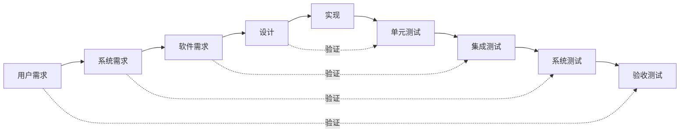

# 需求验证方法

## 学习目标

完成本模块后，你将能够：
- 理解需求验证和确认的区别
- 掌握多种需求验证技术
- 进行有效的需求评审
- 使用检查表验证需求质量
- 应用原型法验证需求

## 前置知识

- 需求工程基础
- 软件测试基础
- IEC 62304标准基础

## 验证vs确认

### 定义

**验证（Verification）**：
- 问题："我们是否正确地编写了需求？"
- 目的：确保需求正确、完整、一致
- 方法：评审、检查、分析
- 时机：需求编写过程中和完成后
- 参与者：内部团队

**确认（Validation）**：
- 问题："我们是否编写了正确的需求？"
- 目的：确保需求满足用户真实需求
- 方法：用户评审、原型、测试
- 时机：需求完成后，实施前或后
- 参与者：用户、利益相关者

### 对比

| 维度 | 验证 | 确认 |
|------|------|------|
| 英文 | Verification | Validation |
| 问题 | 做对了吗？ | 做对的事了吗？ |
| 焦点 | 内部质量 | 外部质量 |
| 标准 | 规格、标准 | 用户需求 |
| 方法 | 评审、检查 | 测试、演示 |
| 时机 | 开发过程中 | 开发完成后 |

### V模型



## 需求验证技术

### 1. 需求评审（Requirements Review）

**定义**：由团队成员系统地检查需求文档，发现问题和缺陷。

**评审类型**：

**非正式评审**：
- 临时组织
- 快速检查
- 发现明显问题

**走查（Walkthrough）**：
- 作者主导
- 逐步讲解
- 收集反馈

**技术评审（Technical Review）**：
- 技术专家参与
- 关注技术可行性
- 提供技术建议

**正式检查（Inspection）**：
- 严格流程
- 角色明确
- 记录缺陷

### 评审流程


**评审计划**：

```markdown
## 需求评审计划

### 评审信息
- 评审对象：血压监护系统需求规格说明书 v1.0
- 评审日期：2026-02-15 14:00-16:00
- 评审地点：会议室A
- 评审类型：正式检查

### 评审团队
- 主持人：张工程师
- 记录员：李工程师
- 作者：王产品经理
- 评审员：
  - 开发代表：赵工程师
  - 测试代表：刘工程师
  - 质量代表：陈工程师
  - 法规代表：周工程师

### 评审范围
- 第3章：具体需求（第15-45页）
- 重点：功能需求和接口需求

### 评审标准
- 需求质量检查表
- IEC 62304合规性
- 公司需求编写规范

### 准备要求
- 提前3天发送评审材料
- 评审员需提前阅读并标注问题
- 准备评审检查表
```

**评审会议流程**：

```markdown
## 评审会议议程（2小时）

### 1. 开场（10分钟）
- 介绍评审目的和范围
- 确认评审标准
- 说明评审规则

### 2. 需求讲解（30分钟）
- 作者讲解需求
- 回答澄清性问题
- 不讨论解决方案

### 3. 问题讨论（60分钟）
- 评审员提出问题
- 讨论和分类问题
- 记录问题和建议

### 4. 总结（20分钟）
- 汇总问题清单
- 确定问题优先级
- 决定评审结论
- 安排后续行动
```

**评审结论**：

- **通过**：无重大问题，可以进入下一阶段
- **有条件通过**：有问题但不严重，修复后无需重新评审
- **不通过**：有重大问题，修复后需重新评审

### 2. 需求检查表（Requirements Checklist）

**定义**：系统化的问题列表，用于检查需求质量。

**通用检查表**：

```markdown
## 需求质量检查表

### 明确性（Clarity）
- [ ] 需求是否只有一种解释？
- [ ] 需求是否使用了模糊词汇（如"快速"、"易用"）？
- [ ] 需求是否使用了专业术语并有定义？
- [ ] 需求是否避免了歧义？

### 完整性（Completeness）
- [ ] 需求是否包含所有必要信息？
- [ ] 需求是否定义了所有输入？
- [ ] 需求是否定义了所有输出？
- [ ] 需求是否定义了异常情况？
- [ ] 需求是否定义了边界条件？

### 正确性（Correctness）
- [ ] 需求是否准确反映用户需求？
- [ ] 需求是否符合业务规则？
- [ ] 需求是否符合法规要求？
- [ ] 需求是否经过利益相关者确认？

### 一致性（Consistency）
- [ ] 需求是否与其他需求冲突？
- [ ] 需求是否与系统架构一致？
- [ ] 需求是否使用了一致的术语？
- [ ] 需求的优先级是否一致？

### 可验证性（Verifiability）
- [ ] 需求是否可以通过测试验证？
- [ ] 需求是否有明确的验收标准？
- [ ] 需求是否可以量化？
- [ ] 需求是否定义了成功标准？

### 可追溯性（Traceability）
- [ ] 需求是否有唯一标识符？
- [ ] 需求是否追溯到用户需求？
- [ ] 需求是否追溯到风险？
- [ ] 需求是否追溯到法规要求？

### 可实现性（Feasibility）
- [ ] 需求是否技术上可行？
- [ ] 需求是否在预算内？
- [ ] 需求是否在时间内？
- [ ] 需求是否有必要的资源？

### 优先级（Priority）
- [ ] 需求是否有明确的优先级？
- [ ] 优先级是否合理？
- [ ] 优先级是否经过利益相关者同意？
```

**医疗器械特定检查表**：

```markdown
## 医疗器械需求检查表

### IEC 62304合规性
- [ ] 需求是否考虑了软件安全分类？
- [ ] 需求是否包含风险控制措施？
- [ ] 需求是否有追溯到风险分析？
- [ ] 需求是否符合生命周期过程要求？

### 安全性
- [ ] 需求是否考虑了患者安全？
- [ ] 需求是否包含安全相关功能？
- [ ] 需求是否定义了故障处理？
- [ ] 需求是否考虑了误用场景？

### 可用性（IEC 62366）
- [ ] 需求是否考虑了用户特征？
- [ ] 需求是否考虑了使用环境？
- [ ] 需求是否考虑了使用错误？
- [ ] 需求是否包含可用性要求？

### 性能
- [ ] 需求是否定义了响应时间？
- [ ] 需求是否定义了吞吐量？
- [ ] 需求是否定义了资源限制？
- [ ] 需求是否定义了可靠性指标？

### 数据完整性
- [ ] 需求是否考虑了数据验证？
- [ ] 需求是否考虑了数据备份？
- [ ] 需求是否考虑了数据恢复？
- [ ] 需求是否考虑了数据审计？

### 网络安全
- [ ] 需求是否考虑了身份认证？
- [ ] 需求是否考虑了数据加密？
- [ ] 需求是否考虑了访问控制？
- [ ] 需求是否考虑了安全日志？
```

### 3. 原型验证（Prototyping）

**定义**：通过创建系统原型来验证需求的正确性和完整性。

**原型类型**：

**纸质原型**：
- 快速制作
- 成本低
- 适合早期验证

**交互原型**：
- 模拟真实交互
- 用户体验好
- 适合可用性验证

**功能原型**：
- 实现核心功能
- 技术验证
- 适合可行性验证

**原型验证流程**：

```markdown
## 原型验证计划

### 1. 原型制作（1周）
- 识别关键需求
- 设计原型界面
- 实现原型功能

### 2. 用户测试（3天）
- 招募测试用户（5-8人）
- 准备测试任务
- 进行用户测试
- 收集反馈

### 3. 分析改进（2天）
- 分析测试结果
- 识别需求问题
- 修改需求文档
- 更新原型

### 4. 再次验证（2天）
- 与用户确认修改
- 验证问题已解决
```

**用户测试任务示例**：

```markdown
## 原型测试任务

### 任务1：首次测量
**目标**：验证首次使用的易用性

**步骤**：
1. 假设您刚收到这个血压计
2. 请尝试进行第一次测量
3. 请大声说出您的想法和困惑

**观察要点**：
- 用户是否能找到开始按钮？
- 用户是否理解如何佩戴袖带？
- 用户是否理解测量结果？
- 用户遇到了哪些困难？

### 任务2：查看历史记录
**目标**：验证历史记录功能的可用性

**步骤**：
1. 请查看您上周的血压记录
2. 请找出最高的一次测量
3. 请查看血压变化趋势

**观察要点**：
- 用户是否能找到历史记录入口？
- 用户是否理解趋势图表？
- 用户是否能完成任务？
```

### 4. 模型验证（Model Validation）

**定义**：使用模型（如用例图、状态图）来验证需求的完整性和一致性。

**用例模型**：

```markdown
## 用例验证

### 检查要点
- [ ] 是否覆盖了所有用户需求？
- [ ] 是否包含了所有主要场景？
- [ ] 是否考虑了异常场景？
- [ ] 用例之间是否一致？
- [ ] 用例是否完整？

### 用例完整性检查
- [ ] 是否定义了前置条件？
- [ ] 是否定义了后置条件？
- [ ] 是否定义了主要流程？
- [ ] 是否定义了替代流程？
- [ ] 是否定义了异常流程？
```

**状态机模型**：

```markdown
## 状态机验证

### 检查要点
- [ ] 是否覆盖了所有状态？
- [ ] 是否定义了所有状态转换？
- [ ] 是否有不可达状态？
- [ ] 是否有死锁状态？
- [ ] 状态转换是否完整？

### 状态转换表
| 当前状态 | 事件 | 下一状态 | 动作 |
|---------|------|---------|------|
| 待机 | 按下开始 | 测量中 | 开始充气 |
| 测量中 | 测量完成 | 显示结果 | 显示数据 |
| 显示结果 | 超时 | 待机 | 关闭显示 |
```

### 5. 需求追溯验证

**定义**：验证需求的追溯关系是否完整和正确。

**追溯验证检查表**：

```markdown
## 追溯验证检查表

### 前向追溯
- [ ] 每个用户需求是否都有对应的系统需求？
- [ ] 每个系统需求是否都有对应的设计？
- [ ] 每个设计是否都有对应的实现？
- [ ] 每个实现是否都有对应的测试？

### 后向追溯
- [ ] 每个测试是否都追溯到需求？
- [ ] 每个实现是否都追溯到设计？
- [ ] 每个设计是否都追溯到需求？
- [ ] 每个系统需求是否都追溯到用户需求？

### 孤儿需求检查
- [ ] 是否有需求没有对应的设计？
- [ ] 是否有需求没有对应的测试？
- [ ] 是否有设计没有对应的需求？
- [ ] 是否有测试没有对应的需求？
```

## 需求确认技术

### 1. 用户评审（User Review）

**定义**：邀请用户评审需求文档，确认需求满足用户需求。

**评审准备**：

```markdown
## 用户评审准备

### 材料准备
- [ ] 需求文档（用户友好版本）
- [ ] 用例和场景描述
- [ ] 原型或演示
- [ ] 评审问题清单

### 用户准备
- [ ] 选择代表性用户
- [ ] 提前发送材料
- [ ] 安排合适时间
- [ ] 准备补偿（如适用）

### 环境准备
- [ ] 预定会议室
- [ ] 准备投影设备
- [ ] 准备茶水点心
- [ ] 准备记录工具
```

**评审问题清单**：

```markdown
## 用户评审问题

### 功能完整性
1. 这些功能是否满足您的需求？
2. 是否有缺失的重要功能？
3. 是否有不需要的功能？

### 功能正确性
4. 这些功能的描述是否准确？
5. 是否有理解错误的地方？
6. 工作流程是否符合实际？

### 优先级
7. 功能的优先级是否合理？
8. 哪些功能是最重要的？
9. 哪些功能可以延后？

### 可用性
10. 操作是否简单易用？
11. 界面是否清晰易懂？
12. 是否符合使用习惯？
```

### 2. 验收测试（Acceptance Testing）

**定义**：在系统实现后，通过测试验证需求是否得到满足。

**验收测试计划**：

```markdown
## 验收测试计划

### 测试范围
- 所有P0和P1优先级需求
- 关键用户场景
- 法规要求的功能

### 测试环境
- 真实使用环境
- 真实用户数据
- 真实用户参与

### 测试方法
- 场景测试
- 探索性测试
- 可用性测试

### 验收标准
- 所有P0需求通过测试
- 90%以上P1需求通过测试
- 无严重缺陷
- 用户满意度≥4分（5分制）
```

### 3. 现场试用（Field Trial）

**定义**：在真实环境中试用系统，验证需求的正确性。

**试用计划**：

```markdown
## 现场试用计划

### 试用目标
- 验证需求的正确性
- 发现隐藏的需求
- 评估用户满意度
- 收集改进建议

### 试用范围
- 试用地点：3家医院
- 试用用户：15位医护人员
- 试用时长：4周

### 数据收集
- 使用日志
- 用户反馈
- 问题记录
- 满意度调查

### 评估标准
- 功能满足度≥90%
- 用户满意度≥4分
- 严重问题数=0
- 一般问题数<5
```

## 验证文档

### 需求验证报告

```markdown
## 需求验证报告

### 1. 验证概述
- 验证对象：血压监护系统需求规格说明书 v1.0
- 验证日期：2026-02-15
- 验证方法：正式评审、检查表、原型验证
- 验证团队：[团队成员列表]

### 2. 验证结果

#### 2.1 评审结果
- 参与人数：7人
- 发现问题：23个
  - 严重问题：3个
  - 一般问题：12个
  - 建议：8个

#### 2.2 检查表结果
- 检查项总数：45项
- 通过项：38项
- 不通过项：7项
- 通过率：84%

#### 2.3 原型验证结果
- 测试用户：6人
- 完成任务：85%
- 用户满意度：3.8分（5分制）
- 发现问题：15个

### 3. 问题清单

| ID | 问题描述 | 严重程度 | 责任人 | 状态 |
|----|---------|---------|--------|------|
| REQ-001 | 缺少电池低电量警告需求 | 严重 | 王工 | 已修复 |
| REQ-002 | 测量精度要求不明确 | 严重 | 王工 | 已修复 |
| REQ-003 | 缺少数据导出格式定义 | 一般 | 王工 | 已修复 |

### 4. 改进建议
1. 增加电池管理相关需求
2. 明确所有性能指标的测量方法
3. 补充数据接口的详细规格
4. 增加可用性需求

### 5. 验证结论
- 结论：有条件通过
- 条件：修复所有严重问题
- 下一步：修复问题后进行确认评审
```

## 最佳实践

!!! tip "需求验证建议"
    1. **早期验证**：在需求编写过程中就开始验证
    2. **多种方法**：结合使用多种验证技术
    3. **用户参与**：让用户参与验证过程
    4. **持续验证**：需求变更后重新验证
    5. **文档记录**：记录验证过程和结果
    6. **问题跟踪**：跟踪问题修复情况
    7. **经验总结**：总结验证经验教训

## 常见问题

### 问题1：如何处理评审中的分歧？

**解决方案**：
1. 记录不同意见
2. 分析分歧原因
3. 寻求更多信息
4. 必要时升级决策
5. 记录决策理由

### 问题2：用户不愿意参与评审怎么办？

**解决方案**：
1. 说明评审的重要性
2. 缩短评审时间
3. 提供补偿
4. 使用原型吸引兴趣
5. 选择合适的时间

### 问题3：如何验证非功能需求？

**解决方案**：
1. 定义可测量的指标
2. 使用原型验证
3. 参考行业标准
4. 咨询专家意见
5. 进行性能测试

## 实践练习

1. **评审练习**：组织一次需求评审会议，使用检查表验证需求质量
2. **原型练习**：为一个心电监护仪制作原型，进行用户测试
3. **追溯练习**：验证一个项目的需求追溯关系是否完整

## 自测问题

??? question "问题1：需求验证和需求确认有什么区别？举例说明。"
    
    ??? success "答案"
        **需求验证（Verification）**：
        - 问题："我们是否正确地编写了需求？"
        - 目的：确保需求正确、完整、一致
        - 方法：评审、检查表、模型分析
        - 参与者：内部团队
        - 示例：检查需求是否明确、是否有冲突
        
        **需求确认（Validation）**：
        - 问题："我们是否编写了正确的需求？"
        - 目的：确保需求满足用户真实需求
        - 方法：用户评审、原型、验收测试
        - 参与者：用户、利益相关者
        - 示例：让医生确认需求是否满足临床需要
        
        **举例**：
        - 验证：检查"系统应该在30秒内完成测量"这个需求是否明确、可验证
        - 确认：让医生确认30秒的测量时间是否满足临床需求

??? question "问题2：需求评审应该包括哪些角色？各自的职责是什么？"
    
    ??? success "答案"
        **评审角色**：
        
        1. **主持人（Moderator）**
           - 职责：组织和主持评审会议
           - 任务：控制评审流程、时间管理、促进讨论
           - 要求：中立、有经验
        
        2. **作者（Author）**
           - 职责：讲解需求、回答问题
           - 任务：介绍需求背景、澄清疑问
           - 要求：熟悉需求、善于沟通
        
        3. **记录员（Recorder）**
           - 职责：记录评审过程和问题
           - 任务：记录问题、建议、决策
           - 要求：记录准确、及时
        
        4. **评审员（Reviewers）**
           - 开发代表：评估技术可行性
           - 测试代表：评估可测试性
           - 质量代表：评估质量标准
           - 法规代表：评估法规合规性
           - 用户代表：评估用户需求满足度
        
        **最佳实践**：
        - 评审团队3-7人
        - 角色职责明确
        - 避免角色冲突

??? question "问题3：如何使用检查表验证需求质量？"
    
    ??? success "答案"
        **使用步骤**：
        
        1. **选择检查表**
           - 通用需求检查表
           - 医疗器械特定检查表
           - 项目定制检查表
        
        2. **逐项检查**
           - 对每个需求逐项检查
           - 标记通过/不通过
           - 记录问题和建议
        
        3. **汇总结果**
           - 统计通过率
           - 分类问题
           - 确定优先级
        
        4. **改进需求**
           - 修复发现的问题
           - 更新需求文档
           - 重新验证
        
        **示例**：
        ```
        需求：系统应该快速响应用户操作
        
        检查项：
        - [ ] 明确性：不通过（"快速"不明确）
        - [ ] 可验证性：不通过（无法测量）
        - [ ] 完整性：不通过（缺少具体标准）
        
        改进后：
        系统应该在100ms内响应用户按钮操作
        
        检查项：
        - [x] 明确性：通过
        - [x] 可验证性：通过
        - [x] 完整性：通过
        ```

??? question "问题4：原型验证的优缺点是什么？"
    
    ??? success "答案"
        **优点**：
        1. **直观**：用户可以看到和体验系统
        2. **早期反馈**：在实现前发现问题
        3. **沟通工具**：帮助用户表达需求
        4. **降低风险**：减少需求错误的风险
        5. **激发想法**：帮助用户发现新需求
        
        **缺点**：
        1. **成本**：制作原型需要时间和资源
        2. **期望管理**：用户可能认为系统已完成
        3. **范围蔓延**：可能导致需求不断增加
        4. **不完整**：原型通常只包含部分功能
        5. **技术限制**：原型可能无法展示所有技术细节
        
        **最佳实践**：
        - 明确原型的目的和范围
        - 管理用户期望
        - 选择合适的原型保真度
        - 及时收集和分析反馈
        - 控制原型制作成本

## 相关资源

- [需求工程概述](index.md)
- [需求获取技术](requirements-elicitation.md)
- [需求规格说明书](requirements-specification.md)
- [需求追溯](requirements-traceability.md)
- [测试策略](../testing-strategy/index.md)
- [IEC 62304 - 软件生命周期](../../regulatory-standards/iec-62304/index.md)

## 参考文献

1. IEC 62304:2006+AMD1:2015 - Medical device software - Software life cycle processes
2. IEEE 1028-2008 - IEEE Standard for Software Reviews and Audits
3. Wiegers, K., & Beatty, J. (2013). Software Requirements (3rd ed.). Microsoft Press.
4. Gilb, T., & Graham, D. (1993). Software Inspection. Addison-Wesley.
5. Rubin, J., & Chisnell, D. (2008). Handbook of Usability Testing (2nd ed.). Wiley.
