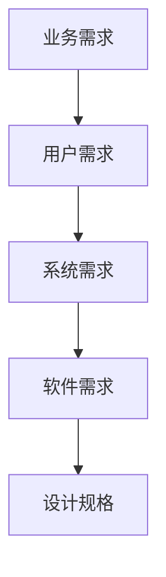
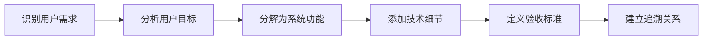
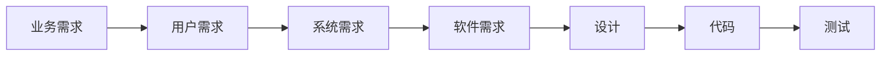

# 用户需求vs系统需求

## 学习目标

完成本模块后，你将能够：
- 理解用户需求和系统需求的区别
- 掌握从用户需求到系统需求的转换方法
- 建立用户需求和系统需求的追溯关系
- 识别和处理需求分解中的常见问题

## 前置知识

- 需求工程基础
- IEC 62304标准基础

## 需求层次

### 需求金字塔



**说明**：需求从高层到低层逐步细化，每一层都为下一层提供输入。

### 各层次定义

| 层次 | 定义 | 关注点 | 示例 |
|------|------|--------|------|
| 业务需求 | 组织的目标和愿景 | 为什么做 | 降低高血压并发症发生率 |
| 用户需求 | 用户的目标和期望 | 用户要什么 | 方便地监测血压 |
| 系统需求 | 系统应该做什么 | 系统做什么 | 自动测量并记录血压 |
| 软件需求 | 软件应该实现什么 | 软件如何做 | 实现示波法测量算法 |

## 用户需求

### 定义

**用户需求（User Requirements）**：从用户角度描述系统应该提供的能力和服务。

### 特征

- **用户视角**：使用用户语言，不涉及技术细节
- **目标导向**：描述用户想要达成的目标
- **高层次**：不涉及实现方式
- **易于理解**：非技术人员也能理解

### 编写格式

**格式1：用户故事**

```markdown
作为[用户角色]，
我想要[功能]，
以便[目标/价值]。

示例：
作为高血压患者，
我想要每天早晚测量血压，
以便监测血压变化趋势。
```

**格式2：需求陈述**

```markdown
UR-001: 用户应该能够快速测量血压
UR-002: 用户应该能够查看历史血压数据
UR-003: 用户应该能够接收异常血压警报
```

### 示例

**血压监护仪的用户需求**：

```markdown
## 用户需求

**UR-001: 简单测量**
用户应该能够通过简单操作完成血压测量，无需复杂设置。

**UR-002: 结果清晰**
用户应该能够清楚地看到测量结果，包括收缩压、舒张压和心率。

**UR-003: 数据记录**
用户应该能够自动记录每次测量数据，无需手工记录。

**UR-004: 趋势查看**
用户应该能够查看血压变化趋势，了解血压控制情况。

**UR-005: 异常提醒**
用户应该在血压异常时收到提醒，及时采取措施。

**UR-006: 数据共享**
用户应该能够将血压数据分享给医生，便于远程诊疗。

**UR-007: 多用户支持**
设备应该支持多个家庭成员使用，各自管理自己的数据。

**UR-008: 便携使用**
用户应该能够在不同场所使用设备，不受地点限制。
```

## 系统需求

### 定义

**系统需求（System Requirements）**：从系统角度描述系统应该具备的功能和性能。

### 特征

- **系统视角**：描述系统行为
- **技术性**：可能包含技术术语
- **详细具体**：明确输入、处理、输出
- **可验证**：可以通过测试验证

### 分类

**功能需求（Functional Requirements）**：
- 系统应该做什么
- 输入、处理、输出
- 用户交互

**非功能需求（Non-Functional Requirements）**：
- 性能需求
- 可靠性需求
- 可用性需求
- 安全性需求
- 可维护性需求

### 编写格式

```markdown
SR-XXX: [需求标题]

**类型**：功能/性能/安全/可用性/其他
**优先级**：P0/P1/P2/P3
**描述**：[详细描述]
**输入**：[输入条件]
**处理**：[处理过程]
**输出**：[输出结果]
**验收标准**：[可验证的标准]
**追溯**：
- 用户需求：[UR-XXX]
- 风险：[RISK-XXX]
```

### 示例

**从用户需求到系统需求的转换**：

```markdown
## 用户需求 UR-001: 简单测量
用户应该能够通过简单操作完成血压测量。

## 对应的系统需求

**SR-001: 一键测量**
- **描述**：系统应该提供一键启动测量功能
- **输入**：用户按下"开始"按钮
- **处理**：自动完成测量流程
- **输出**：显示测量结果
- **验收标准**：
  - 只需按一个按钮即可开始测量
  - 无需其他设置或确认
- **追溯**：UR-001

**SR-002: 自动充气**
- **描述**：系统应该自动控制充气压力
- **输入**：测量开始信号
- **处理**：
  1. 根据上次测量结果预估充气压力
  2. 自动充气至目标压力+30mmHg
  3. 最大充气压力不超过300mmHg
- **输出**：达到目标压力
- **验收标准**：
  - 充气时间<15秒
  - 充气压力准确度±5mmHg
- **追溯**：UR-001

**SR-003: 自动测量**
- **描述**：系统应该自动完成测量过程
- **输入**：充气完成
- **处理**：
  1. 以3-5mmHg/s速度放气
  2. 采集脉搏波信号
  3. 使用示波法计算血压
- **输出**：收缩压、舒张压、心率
- **验收标准**：
  - 测量时间<30秒
  - 测量精度±3mmHg
- **追溯**：UR-001

**SR-004: 结果自动显示**
- **描述**：系统应该自动显示测量结果
- **输入**：测量完成
- **输出**：
  - 收缩压（mmHg）
  - 舒张压（mmHg）
  - 心率（bpm）
  - 测量时间
- **验收标准**：
  - 测量完成后立即显示
  - 显示时间≥10秒
  - 数字清晰可读
- **追溯**：UR-001, UR-002
```

## 需求转换方法

### 转换步骤



### 转换技术

**1. 用例分析**

从用户需求提取用例，再从用例提取系统需求。

```markdown
用户需求 UR-004: 用户应该能够查看血压变化趋势

↓ 用例分析

用例 UC-004: 查看血压趋势
1. 用户打开历史记录
2. 系统显示测量列表
3. 用户选择时间范围
4. 系统显示趋势图表

↓ 系统需求提取

SR-020: 系统应该存储历史测量数据
SR-021: 系统应该提供时间范围选择功能
SR-022: 系统应该生成血压趋势图表
SR-023: 系统应该支持多种图表类型（折线图、柱状图）
```

**2. 场景分析**

通过具体场景细化需求。

```markdown
用户需求 UR-005: 用户应该在血压异常时收到提醒

↓ 场景分析

场景1：测量时发现高血压
- 测量结果：收缩压160mmHg
- 系统判断：超过140mmHg阈值
- 系统动作：显示警告图标，发出蜂鸣声

场景2：趋势分析发现血压升高
- 最近7天平均收缩压：从130上升到145
- 系统判断：上升趋势明显
- 系统动作：推送通知到手机

↓ 系统需求

SR-030: 系统应该实时判断测量值是否异常
SR-031: 系统应该在异常时发出声光警报
SR-032: 系统应该分析血压趋势
SR-033: 系统应该在趋势异常时推送通知
```

**3. 功能分解**

将高层需求分解为具体功能。

```markdown
用户需求 UR-006: 用户应该能够将血压数据分享给医生

↓ 功能分解

功能1：数据导出
- SR-040: 系统应该支持导出CSV格式数据
- SR-041: 系统应该支持导出PDF报告

功能2：数据传输
- SR-042: 系统应该通过蓝牙传输数据到手机
- SR-043: 系统应该通过云端同步数据

功能3：权限管理
- SR-044: 系统应该支持设置数据共享权限
- SR-045: 系统应该支持生成临时访问链接

功能4：报告生成
- SR-046: 系统应该生成包含统计信息的报告
- SR-047: 系统应该在报告中包含趋势图表
```

### 转换矩阵

**用户需求到系统需求追溯矩阵**：

| 用户需求 | 系统需求 | 类型 | 优先级 |
|---------|---------|------|--------|
| UR-001 简单测量 | SR-001 一键测量 | 功能 | P0 |
| UR-001 简单测量 | SR-002 自动充气 | 功能 | P0 |
| UR-001 简单测量 | SR-003 自动测量 | 功能 | P0 |
| UR-002 结果清晰 | SR-004 结果显示 | 功能 | P0 |
| UR-002 结果清晰 | SR-005 大字体显示 | 可用性 | P0 |
| UR-003 数据记录 | SR-010 自动保存 | 功能 | P0 |
| UR-003 数据记录 | SR-011 存储容量 | 性能 | P0 |
| UR-004 趋势查看 | SR-020 历史数据 | 功能 | P1 |
| UR-004 趋势查看 | SR-021 时间选择 | 功能 | P1 |
| UR-004 趋势查看 | SR-022 趋势图表 | 功能 | P1 |

## 软件需求

### 定义

**软件需求（Software Requirements）**：分配给软件的系统需求，描述软件应该实现的功能。

### 来源

1. **系统需求分解**：将系统需求分配给硬件和软件
2. **风险控制措施**：从风险分析得出的软件需求
3. **法规要求**：法规标准要求的软件功能
4. **架构约束**：架构设计产生的软件需求

### 示例

```markdown
## 系统需求 SR-003: 自动测量
系统应该自动完成血压测量过程

↓ 分配给软件和硬件

### 硬件需求
- HW-001: 压力传感器应该提供精度±0.5mmHg的压力测量
- HW-002: 充气泵应该提供可控的充气速率
- HW-003: 放气阀应该提供可控的放气速率

### 软件需求
- SW-001: 软件应该实现示波法血压计算算法
- SW-002: 软件应该控制充气泵和放气阀
- SW-003: 软件应该采集和处理压力传感器数据
- SW-004: 软件应该检测和处理测量异常
- SW-005: 软件应该验证测量结果的有效性
```

## 需求追溯

### 追溯链



### 追溯矩阵示例

**完整追溯矩阵**：

| 用户需求 | 系统需求 | 软件需求 | 设计 | 代码 | 测试 |
|---------|---------|---------|------|------|------|
| UR-001 | SR-001 | SW-001 | DES-001 | measure.c | TC-001 |
| UR-001 | SR-002 | SW-002 | DES-002 | pump.c | TC-002 |
| UR-001 | SR-003 | SW-003 | DES-003 | algorithm.c | TC-003 |
| UR-002 | SR-004 | SW-010 | DES-010 | display.c | TC-010 |

## 常见问题

### 问题1：需求过于笼统

**不好的用户需求**：
```
UR-001: 系统应该易于使用
```

**问题**：
- 太抽象，无法验证
- 没有具体标准
- 难以转换为系统需求

**改进**：
```
UR-001: 用户应该能够在不阅读说明书的情况下完成首次测量
UR-002: 用户应该能够在3步内完成一次测量
UR-003: 用户应该能够在5秒内找到历史记录功能
```

### 问题2：用户需求过于技术化

**不好的用户需求**：
```
UR-002: 系统应该使用示波法测量血压
```

**问题**：
- 包含实现细节
- 限制了设计选择
- 不是用户视角

**改进**：
```
UR-002: 用户应该能够获得准确的血压测量结果
（准确性要求在系统需求中定义）
```

### 问题3：系统需求缺少细节

**不好的系统需求**：
```
SR-001: 系统应该测量血压
```

**问题**：
- 太笼统
- 缺少验收标准
- 无法验证

**改进**：
```
SR-001: 自动血压测量
- 输入：用户按下开始按钮
- 处理：
  1. 充气至预估压力+30mmHg
  2. 以3-5mmHg/s速度放气
  3. 采集脉搏波信号
  4. 计算收缩压、舒张压、心率
- 输出：测量结果
- 验收标准：
  - 测量时间<30秒
  - 测量精度±3mmHg（符合ISO 81060-2）
  - 成功率>95%
```

## 实践练习

1. **需求转换练习**：将以下用户需求转换为系统需求
   ```
   UR-010: 用户应该能够设置测量提醒
   ```

2. **需求分解练习**：将以下系统需求分解为软件需求和硬件需求
   ```
   SR-050: 系统应该在电池电量低时警告用户
   ```

3. **追溯矩阵练习**：为一个血糖监测仪创建需求追溯矩阵

## 自测问题

??? question "问题1：用户需求和系统需求的主要区别是什么？"
    
    ??? success "答案"
        **用户需求**：
        - 视角：用户视角
        - 语言：用户语言，非技术性
        - 层次：高层次，目标导向
        - 内容：用户想要什么
        - 示例："用户应该能够快速测量血压"
        
        **系统需求**：
        - 视角：系统视角
        - 语言：技术语言，可能包含技术术语
        - 层次：详细具体
        - 内容：系统应该做什么，如何做
        - 示例："系统应该在30秒内完成血压测量，精度±3mmHg"
        
        **关键区别**：
        - 用户需求关注"要什么"，系统需求关注"怎么做"
        - 用户需求面向用户，系统需求面向开发团队
        - 用户需求是输入，系统需求是输出

??? question "问题2：如何从用户需求推导系统需求？"
    
    ??? success "答案"
        **推导方法**：
        
        1. **用例分析**
           - 从用户需求提取用例
           - 分析用例的每个步骤
           - 每个步骤对应一个或多个系统需求
        
        2. **场景分析**
           - 描述具体使用场景
           - 分析场景中的系统行为
           - 提取系统需求
        
        3. **功能分解**
           - 将用户需求分解为功能
           - 为每个功能定义系统需求
           - 添加技术细节和验收标准
        
        4. **追问技术**
           - 如何实现这个用户需求？
           - 需要哪些系统功能？
           - 有哪些约束条件？
           - 如何验证？
        
        **示例**：
        ```
        用户需求：用户应该能够查看血压趋势
        
        ↓ 推导
        
        系统需求：
        - 系统应该存储历史测量数据
        - 系统应该提供时间范围选择
        - 系统应该生成趋势图表
        - 系统应该计算统计指标
        ```

??? question "问题3：一个用户需求可以对应多个系统需求吗？"
    
    ??? success "答案"
        **可以，而且很常见。**
        
        一个用户需求通常需要多个系统需求来实现。
        
        **示例**：
        ```
        用户需求 UR-001: 用户应该能够简单地测量血压
        
        对应的系统需求：
        - SR-001: 一键启动测量
        - SR-002: 自动充气控制
        - SR-003: 自动测量算法
        - SR-004: 自动结果显示
        - SR-005: 自动数据保存
        - SR-006: 错误自动处理
        ```
        
        **原因**：
        - 用户需求是高层次的目标
        - 系统需求是具体的功能
        - 实现一个目标需要多个功能配合
        
        **追溯的重要性**：
        - 确保所有系统需求都支持用户需求
        - 避免实现不必要的功能
        - 支持变更影响分析

## 相关资源

- [需求工程概述](index.md)
- [需求获取技术](requirements-elicitation.md)
- [需求追溯](requirements-traceability.md)
- [需求验证方法](requirements-validation.md)
- [IEC 62304 - 软件生命周期](../../regulatory-standards/iec-62304/index.md)

## 参考文献

1. IEC 62304:2006+AMD1:2015 - Medical device software - Software life cycle processes
2. ISO/IEC/IEEE 29148:2018 - Systems and software engineering - Requirements engineering
3. Wiegers, K., & Beatty, J. (2013). Software Requirements (3rd ed.). Microsoft Press.
4. Hull, E., Jackson, K., & Dick, J. (2017). Requirements Engineering (4th ed.). Springer.
