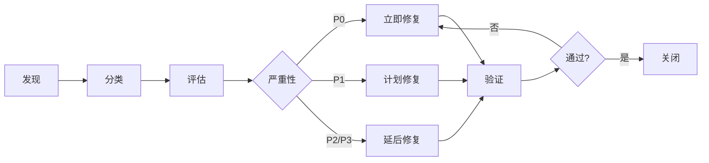

# 缺陷分类

## 学习目标

完成本模块后,你将能够:
- 理解静态分析缺陷的分类体系
- 掌握缺陷严重性评估方法
- 识别不同类型的代码缺陷
- 制定合理的缺陷处理优先级
- 建立有效的缺陷管理流程
- 应用医疗器械软件缺陷分类标准
- 生成符合法规要求的缺陷报告

## 前置知识

- 静态分析工具基础
- C/C++编程基础
- 编码规范基础(MISRA C、CERT C)
- IEC 62304标准基础知识
- 软件测试基础

## 内容

### 缺陷分类概述

**为什么需要缺陷分类?**

静态分析工具可能报告数百甚至数千个问题,缺陷分类帮助团队:
- 确定修复优先级
- 合理分配资源
- 跟踪质量趋势
- 满足法规要求
- 提高修复效率


**缺陷分类的维度**:

```
1. 严重性(Severity): 缺陷的影响程度
2. 类型(Type): 缺陷的技术分类
3. 来源(Source): 缺陷的根本原因
4. 检测阶段(Phase): 何时发现的缺陷
5. 修复成本(Cost): 修复所需的工作量
```

**说明**: 这是缺陷分类的五个维度。严重性表示影响程度，类型表示技术分类，来源表示根本原因，检测阶段表示发现时间，修复成本表示工作量。这些维度帮助全面评估和管理缺陷。


### 按严重性分类

#### 严重性级别定义

**关键(Critical) - P0**

**定义**: 可能导致系统崩溃、数据损坏或安全漏洞的缺陷

**特征**:
- 可能造成患者伤害(医疗器械)
- 导致系统完全失效
- 造成数据丢失或损坏
- 存在安全漏洞
- 违反强制性法规要求

**示例**:
```c
// P0示例1: 空指针解引用
void critical_defect_1(sensor_data_t* data) {
    // 未检查指针有效性
    int value = data->reading;  // 可能崩溃
    process_value(value);
}

// P0示例2: 缓冲区溢出
void critical_defect_2(void) {
    char buffer[10];
    // 可能写入超出缓冲区
    strcpy(buffer, user_input);  // 安全漏洞
}

// P0示例3: 未初始化变量
void critical_defect_3(void) {
    int result;
    // result未初始化
    if (result > 0) {  // 未定义行为
        perform_action();
    }
}

// P0示例4: 资源泄漏
void critical_defect_4(void) {
    FILE* file = fopen("data.txt", "r");
    if (error_condition) {
        return;  // 文件未关闭,资源泄漏
    }
    fclose(file);
}
```

**处理要求**:
- 必须立即修复
- 不允许发布包含P0缺陷的代码
- 需要根本原因分析
- 修复后需要回归测试
- 医疗器械Class C: 100%修复率


**高(High) - P1**

**定义**: 可能导致功能异常或性能问题的缺陷

**特征**:
- 影响核心功能
- 可能导致错误结果
- 违反必需的编码规范
- 存在潜在的运行时错误
- 可能影响系统可靠性

**示例**:
```c
// P1示例1: 忽略返回值
void high_defect_1(void) {
    // 忽略可能失败的操作
    read_sensor();  // 应检查返回值
    process_data();
}

// P1示例2: 不正确的错误处理
int high_defect_2(void) {
    int result = perform_operation();
    if (result < 0) {
        // 错误处理不充分
        log_error("Operation failed");
        // 应该返回错误,但继续执行
    }
    return SUCCESS;
}

// P1示例3: 数据竞争
static int shared_counter = 0;

void high_defect_3(void) {
    // 多线程访问未保护
    shared_counter++;  // 数据竞争
}

// P1示例4: 不正确的类型转换
void high_defect_4(void) {
    uint32_t large_value = 0xFFFFFFFF;
    // 可能丢失数据
    uint16_t small_value = (uint16_t)large_value;
}
```

**处理要求**:
- 应在当前迭代修复
- 可以有限期延后(需批准)
- 需要记录修复计划
- 医疗器械Class C: 必须修复
- 医疗器械Class B: 核心功能必须修复


**中(Medium) - P2**

**定义**: 影响代码质量但不直接导致功能问题的缺陷

**特征**:
- 违反建议性编码规范
- 代码可维护性问题
- 性能优化机会
- 代码异味
- 潜在的未来问题

**示例**:
```c
// P2示例1: 参数可以声明为const
int medium_defect_1(int* data) {
    // data未被修改,应声明为const
    return data[0] + data[1];
}

// P2示例2: 函数过于复杂
int medium_defect_2(int a, int b, int c) {
    // 圈复杂度过高
    if (a > 0) {
        if (b > 0) {
            if (c > 0) {
                // 嵌套过深
                return a + b + c;
            } else {
                return a + b;
            }
        } else {
            return a;
        }
    } else {
        return 0;
    }
}

// P2示例3: 魔法数字
void medium_defect_3(void) {
    // 应使用命名常量
    delay_ms(100);  // 100是什么?
    set_threshold(75);  // 75代表什么?
}

// P2示例4: 未使用的变量
void medium_defect_4(void) {
    int unused_var = 10;  // 声明但未使用
    int result = calculate();
    return result;
}
```

**处理要求**:
- 应在下个迭代修复
- 可以根据资源情况延后
- 定期审查和清理
- 医疗器械: 建议修复


**低(Low) - P3**

**定义**: 对代码质量影响较小的问题

**特征**:
- 代码风格问题
- 文档不完整
- 命名不规范
- 注释缺失
- 信息性警告

**示例**:
```c
// P3示例1: 命名不规范
void low_defect_1(void) {
    int x = 10;  // 变量名不具描述性
    int y = 20;
    int z = x + y;
}

// P3示例2: 注释缺失
void low_defect_2(void) {
    // 缺少函数说明注释
    int result = complex_calculation();
    return result;
}

// P3示例3: 代码格式
void low_defect_3(void){  // 括号位置不一致
int value=10;  // 缺少空格
    return value;
}

// P3示例4: 冗余代码
void low_defect_4(void) {
    int value = 10;
    value = value;  // 冗余赋值
}
```

**处理要求**:
- 可以延后修复
- 批量处理
- 不阻止发布
- 定期清理


#### 严重性评估矩阵

**评估因素**:

| 因素 | 权重 | 说明 |
|------|------|------|
| 影响范围 | 高 | 影响多少功能/用户 |
| 发生概率 | 高 | 缺陷触发的可能性 |
| 检测难度 | 中 | 测试中发现的难度 |
| 修复成本 | 中 | 修复所需的工作量 |
| 法规要求 | 高 | 是否违反强制要求 |

**评估流程**:

```python
# 严重性评估算法示例
def assess_severity(defect):
    score = 0
    
    # 影响范围评分
    if defect.affects_safety:
        score += 10  # 安全相关
    elif defect.affects_core_function:
        score += 7   # 核心功能
    elif defect.affects_minor_function:
        score += 4   # 次要功能
    else:
        score += 1   # 仅影响质量
    
    # 发生概率评分
    if defect.always_occurs:
        score += 5   # 必然发生
    elif defect.likely_occurs:
        score += 3   # 很可能发生
    else:
        score += 1   # 不太可能
    
    # 法规要求评分
    if defect.violates_mandatory_rule:
        score += 5   # 违反强制规则
    elif defect.violates_required_rule:
        score += 3   # 违反必需规则
    
    # 确定严重性级别
    if score >= 15:
        return "P0 - Critical"
    elif score >= 10:
        return "P1 - High"
    elif score >= 5:
        return "P2 - Medium"
    else:
        return "P3 - Low"
```


### 按类型分类

#### 内存相关缺陷

**1. 内存泄漏(Memory Leak)**

**描述**: 分配的内存未被释放

**严重性**: P0-P1

**示例**:
```c
// 内存泄漏示例
void memory_leak_example(void) {
    char* buffer = malloc(1024);
    if (buffer == NULL) {
        return;
    }
    
    if (error_condition) {
        return;  // 泄漏: buffer未释放
    }
    
    process_buffer(buffer);
    free(buffer);
}

// 修复
void memory_leak_fixed(void) {
    char* buffer = malloc(1024);
    if (buffer == NULL) {
        return;
    }
    
    if (error_condition) {
        free(buffer);  // 修复: 释放内存
        return;
    }
    
    process_buffer(buffer);
    free(buffer);
}
```

**检测工具**: Coverity, Valgrind, PC-lint


**2. 缓冲区溢出(Buffer Overflow)**

**描述**: 写入超出缓冲区边界

**严重性**: P0

**示例**:
```c
// 缓冲区溢出示例
void buffer_overflow_example(void) {
    char buffer[10];
    strcpy(buffer, "This is a very long string");  // 溢出
}

// 修复
void buffer_overflow_fixed(void) {
    char buffer[50];
    strncpy(buffer, "This is a very long string", sizeof(buffer) - 1);
    buffer[sizeof(buffer) - 1] = '\0';
}
```

**检测工具**: Coverity, PC-lint, AddressSanitizer


**3. 空指针解引用(Null Pointer Dereference)**

**描述**: 使用空指针访问内存

**严重性**: P0

**示例**:
```c
// 空指针解引用示例
void null_pointer_example(void) {
    sensor_data_t* data = get_sensor_data();
    // 未检查data是否为NULL
    int value = data->reading;  // 可能崩溃
}

// 修复
void null_pointer_fixed(void) {
    sensor_data_t* data = get_sensor_data();
    if (data != NULL) {
        int value = data->reading;
        process_value(value);
    } else {
        handle_error();
    }
}
```

**检测工具**: Coverity, Cppcheck, PC-lint


**4. 使用未初始化变量(Use of Uninitialized Variable)**

**描述**: 读取未初始化的变量

**严重性**: P0-P1

**示例**:
```c
// 未初始化变量示例
void uninitialized_example(void) {
    int result;
    // result未初始化
    if (result > 0) {  // 未定义行为
        perform_action();
    }
}

// 修复
void uninitialized_fixed(void) {
    int result = 0;  // 初始化
    if (result > 0) {
        perform_action();
    }
}
```

**检测工具**: Coverity, PC-lint, Cppcheck


#### 资源管理缺陷

**1. 资源泄漏(Resource Leak)**

**描述**: 文件、句柄等资源未释放

**严重性**: P0-P1

**示例**:
```c
// 资源泄漏示例
void resource_leak_example(void) {
    FILE* file = fopen("data.txt", "r");
    if (file == NULL) {
        return;
    }
    
    if (error_condition) {
        return;  // 泄漏: 文件未关闭
    }
    
    process_file(file);
    fclose(file);
}

// 修复
void resource_leak_fixed(void) {
    FILE* file = fopen("data.txt", "r");
    if (file == NULL) {
        return;
    }
    
    if (error_condition) {
        fclose(file);  // 修复: 关闭文件
        return;
    }
    
    process_file(file);
    fclose(file);
}
```

**检测工具**: Coverity, PC-lint


**2. 双重释放(Double Free)**

**描述**: 同一内存被释放多次

**严重性**: P0

**示例**:
```c
// 双重释放示例
void double_free_example(void) {
    char* buffer = malloc(100);
    process_buffer(buffer);
    free(buffer);
    
    if (error_condition) {
        free(buffer);  // 错误: 双重释放
    }
}

// 修复
void double_free_fixed(void) {
    char* buffer = malloc(100);
    process_buffer(buffer);
    free(buffer);
    buffer = NULL;  // 防止双重释放
    
    if (error_condition) {
        if (buffer != NULL) {
            free(buffer);
        }
    }
}
```

**检测工具**: Coverity, AddressSanitizer


#### 并发缺陷

**1. 数据竞争(Data Race)**

**描述**: 多线程未同步访问共享数据

**严重性**: P0-P1

**示例**:
```c
// 数据竞争示例
static int shared_counter = 0;

void data_race_example(void) {
    // 多线程调用,未保护
    shared_counter++;  // 数据竞争
}

// 修复
static int shared_counter = 0;
static mutex_t counter_mutex;

void data_race_fixed(void) {
    mutex_lock(&counter_mutex);
    shared_counter++;
    mutex_unlock(&counter_mutex);
}
```

**检测工具**: ThreadSanitizer, Coverity


**2. 死锁(Deadlock)**

**描述**: 线程相互等待导致永久阻塞

**严重性**: P0

**示例**:
```c
// 死锁示例
mutex_t mutex_a, mutex_b;

void thread1(void) {
    mutex_lock(&mutex_a);
    delay_ms(10);
    mutex_lock(&mutex_b);  // 可能死锁
    // 临界区
    mutex_unlock(&mutex_b);
    mutex_unlock(&mutex_a);
}

void thread2(void) {
    mutex_lock(&mutex_b);
    delay_ms(10);
    mutex_lock(&mutex_a);  // 可能死锁
    // 临界区
    mutex_unlock(&mutex_a);
    mutex_unlock(&mutex_b);
}

// 修复: 统一锁顺序
void thread1_fixed(void) {
    mutex_lock(&mutex_a);
    mutex_lock(&mutex_b);
    // 临界区
    mutex_unlock(&mutex_b);
    mutex_unlock(&mutex_a);
}

void thread2_fixed(void) {
    mutex_lock(&mutex_a);  // 与thread1相同顺序
    mutex_lock(&mutex_b);
    // 临界区
    mutex_unlock(&mutex_b);
    mutex_unlock(&mutex_a);
}
```

**检测工具**: ThreadSanitizer, Coverity


#### 逻辑缺陷

**1. 错误的条件判断(Incorrect Condition)**

**描述**: 条件表达式逻辑错误

**严重性**: P1-P2

**示例**:
```c
// 错误条件示例
void incorrect_condition_example(int value) {
    // 应该是 && 而不是 ||
    if (value < 0 || value > 100) {
        // 意图: 检查value在0-100范围内
        // 实际: 总是为真
        process_value(value);
    }
}

// 修复
void incorrect_condition_fixed(int value) {
    if (value >= 0 && value <= 100) {
        process_value(value);
    }
}
```

**检测工具**: Coverity, PC-lint


**2. 忽略返回值(Ignored Return Value)**

**描述**: 未检查函数返回值

**严重性**: P1

**示例**:
```c
// 忽略返回值示例
void ignored_return_example(void) {
    read_sensor();  // 忽略返回值
    process_data();
}

// 修复
void ignored_return_fixed(void) {
    int result = read_sensor();
    if (result == SUCCESS) {
        process_data();
    } else {
        handle_error();
    }
}
```

**检测工具**: PC-lint, Cppcheck


#### 编码规范违反

**1. MISRA C规则违反**

**严重性**: 根据规则类型
- Mandatory: P0
- Required: P1
- Advisory: P2

**示例**:
```c
// MISRA C违反示例

// Rule 10.1: 不适当的基本类型操作数
void misra_10_1_violation(void) {
    uint8_t a = 200;
    uint8_t b = 100;
    uint8_t result = a + b;  // 违反: 可能溢出
}

// Rule 21.3: 禁止使用malloc/free
void misra_21_3_violation(void) {
    char* buffer = malloc(100);  // 违反: 使用malloc
    free(buffer);
}

// Rule 17.7: 必须使用返回值
void misra_17_7_violation(void) {
    read_sensor();  // 违反: 忽略返回值
}
```

**检测工具**: PC-lint Plus, Coverity


#### 性能缺陷

**1. 低效算法(Inefficient Algorithm)**

**描述**: 使用低效的算法或数据结构

**严重性**: P2-P3

**示例**:
```c
// 低效算法示例
bool inefficient_search(int* array, int size, int target) {
    // O(n)线性搜索,数组已排序应使用二分搜索
    for (int i = 0; i < size; i++) {
        if (array[i] == target) {
            return true;
        }
    }
    return false;
}

// 修复: 使用二分搜索
bool efficient_search(int* array, int size, int target) {
    int left = 0;
    int right = size - 1;
    
    while (left <= right) {
        int mid = left + (right - left) / 2;
        if (array[mid] == target) {
            return true;
        } else if (array[mid] < target) {
            left = mid + 1;
        } else {
            right = mid - 1;
        }
    }
    return false;
}
```

**检测工具**: 代码审查, 性能分析工具


### 按来源分类

#### 设计缺陷

**特征**: 架构或设计层面的问题

**示例**:
- 模块耦合度过高
- 接口设计不合理
- 缺少错误处理机制
- 资源管理策略不当

**处理**: 需要设计层面的修改


#### 编码缺陷

**特征**: 实现层面的错误

**示例**:
- 语法错误
- 逻辑错误
- 边界条件处理不当
- 类型转换错误

**处理**: 修改代码实现


#### 规范缺陷

**特征**: 违反编码规范

**示例**:
- MISRA C规则违反
- 命名不规范
- 注释缺失
- 代码格式问题

**处理**: 按规范修正


#### 文档缺陷

**特征**: 文档不完整或不准确

**示例**:
- 函数注释缺失
- 参数说明不清
- 返回值未说明
- 前置条件未文档化

**处理**: 补充或修正文档


### 医疗器械软件缺陷分类

#### IEC 62304缺陷分类

**按软件安全分类**:

**Class C软件缺陷**:
```
P0 - 关键:
  ✓ 可能导致患者伤害
  ✓ 影响安全关键功能
  ✓ 违反强制性安全要求
  → 必须100%修复

P1 - 高:
  ✓ 影响核心医疗功能
  ✓ 可能导致误诊
  ✓ 违反必需的安全要求
  → 必须修复

P2 - 中:
  ✓ 影响辅助功能
  ✓ 违反建议性要求
  → 应该修复

P3 - 低:
  ✓ 代码质量问题
  ✓ 文档问题
  → 建议修复
```

**Class B软件缺陷**:
```
P0 - 关键:
  ✓ 影响核心功能
  ✓ 违反强制性要求
  → 必须修复

P1 - 高:
  ✓ 影响重要功能
  → 应该修复

P2/P3:
  ✓ 质量改进
  → 建议修复
```

**说明**: 这是缺陷优先级的定义。P0关键缺陷影响核心功能或违反强制性要求，必须修复；P1高优先级影响重要功能，应该修复；P2/P3可以延后修复。这帮助团队合理分配资源。


#### FDA软件缺陷分类

**按风险等级**:

**高风险缺陷**:
- 影响患者安全
- 导致设备失效
- 数据完整性问题
- 安全漏洞

**中风险缺陷**:
- 影响设备性能
- 用户界面问题
- 非关键功能异常

**低风险缺陷**:
- 代码质量问题
- 文档不完整
- 性能优化机会


### 缺陷管理流程

#### 缺陷生命周期



**说明**: 这是缺陷处理流程图。从发现开始，经过分类、评估、根据严重性决定处理方式(立即修复、计划修复或延后修复)，最后验证修复效果，确保缺陷得到妥善处理。


#### 缺陷处理流程

**1. 缺陷发现**
```python
# 自动化缺陷发现
def discover_defects():
    # 运行静态分析工具
    run_static_analysis()
    
    # 收集报告
    reports = collect_reports()
    
    # 解析缺陷
    defects = parse_defects(reports)
    
    return defects
```

**2. 缺陷分类**
```python
# 自动分类
def classify_defect(defect):
    # 确定类型
    defect_type = determine_type(defect)
    
    # 评估严重性
    severity = assess_severity(defect)
    
    # 识别来源
    source = identify_source(defect)
    
    return {
        'type': defect_type,
        'severity': severity,
        'source': source
    }
```

**3. 缺陷分配**
```python
# 分配责任人
def assign_defect(defect):
    if defect.severity == 'P0':
        # 立即分配给技术负责人
        assignee = get_tech_lead()
        priority = 'URGENT'
    elif defect.severity == 'P1':
        # 分配给相关模块负责人
        assignee = get_module_owner(defect.file)
        priority = 'HIGH'
    else:
        # 加入待办列表
        add_to_backlog(defect)
        return
    
    create_task(defect, assignee, priority)
```

**4. 缺陷修复**
```python
# 修复工作流
def fix_defect(defect):
    # 1. 分析根本原因
    root_cause = analyze_root_cause(defect)
    
    # 2. 制定修复方案
    fix_plan = create_fix_plan(defect, root_cause)
    
    # 3. 实施修复
    implement_fix(fix_plan)
    
    # 4. 单元测试
    run_unit_tests()
    
    # 5. 回归测试
    run_regression_tests()
    
    # 6. 代码审查
    request_code_review()
```

**5. 缺陷验证**
```python
# 验证修复
def verify_fix(defect):
    # 重新运行静态分析
    new_report = run_static_analysis()
    
    # 检查缺陷是否消失
    if defect not in new_report:
        # 运行相关测试
        if run_related_tests():
            mark_as_fixed(defect)
            return True
    
    return False
```


#### 缺陷跟踪

**缺陷跟踪表**:

| ID | 文件 | 行号 | 类型 | 严重性 | 状态 | 责任人 | 发现日期 | 修复日期 |
|----|------|------|------|--------|------|--------|----------|----------|
| D001 | sensor.c | 45 | 空指针 | P0 | 已修复 | 张三 | 2026-02-01 | 2026-02-02 |
| D002 | main.c | 123 | 资源泄漏 | P0 | 进行中 | 李四 | 2026-02-03 | - |
| D003 | utils.c | 67 | MISRA违反 | P1 | 待处理 | 王五 | 2026-02-05 | - |

**缺陷度量**:
```python
# 缺陷度量脚本
def calculate_metrics(defects):
    metrics = {
        'total': len(defects),
        'by_severity': {},
        'by_type': {},
        'by_status': {},
        'fix_rate': 0,
        'avg_fix_time': 0
    }
    
    # 按严重性统计
    for defect in defects:
        severity = defect.severity
        if severity not in metrics['by_severity']:
            metrics['by_severity'][severity] = 0
        metrics['by_severity'][severity] += 1
    
    # 计算修复率
    fixed = len([d for d in defects if d.status == 'Fixed'])
    metrics['fix_rate'] = fixed / len(defects) * 100
    
    # 计算平均修复时间
    fix_times = [d.fix_time for d in defects if d.status == 'Fixed']
    if fix_times:
        metrics['avg_fix_time'] = sum(fix_times) / len(fix_times)
    
    return metrics
```


### 缺陷报告

#### 缺陷报告模板

**单个缺陷报告**:
```markdown
# 缺陷报告

## 基本信息
- **缺陷ID**: D001
- **发现日期**: 2026-02-09
- **发现工具**: PC-lint Plus
- **严重性**: P0 - Critical
- **状态**: Open

## 缺陷描述
**文件**: src/sensor.c
**行号**: 45
**类型**: 空指针解引用

**代码**:
```c
void read_sensor_data(sensor_t* sensor) {
    int value = sensor->reading;  // 未检查sensor是否为NULL
}
```

**问题**: 函数未检查sensor指针有效性,可能导致程序崩溃。

## 影响分析
- **影响范围**: 传感器数据读取功能
- **触发条件**: 当sensor参数为NULL时
- **潜在后果**: 程序崩溃,设备失效
- **风险等级**: 高

## 修复建议
```c
void read_sensor_data(sensor_t* sensor) {
    if (sensor != NULL) {
        int value = sensor->reading;
        process_value(value);
    } else {
        log_error("Invalid sensor pointer");
        return ERROR_INVALID_PARAM;
    }
}
```

## 根本原因
- 缺少输入参数验证
- 未遵循防御性编程原则

## 修复计划
- **责任人**: 张三
- **计划修复日期**: 2026-02-10
- **验证方法**: 单元测试 + 静态分析重扫

## 相关缺陷
- D002: 类似的参数验证缺失
```

**汇总报告**:
```markdown
# 静态分析缺陷汇总报告

## 项目信息
- **项目名称**: 医疗监护仪软件
- **版本**: v2.1.0
- **分析日期**: 2026-02-09
- **分析工具**: PC-lint Plus 2.1, Coverity 2023.6

## 执行摘要
- **总缺陷数**: 156
- **关键缺陷(P0)**: 3
- **高优先级(P1)**: 15
- **中优先级(P2)**: 68
- **低优先级(P3)**: 70

## 严重性分布
| 严重性 | 数量 | 百分比 | 状态 |
|--------|------|--------|------|
| P0 | 3 | 1.9% | 必须修复 |
| P1 | 15 | 9.6% | 应该修复 |
| P2 | 68 | 43.6% | 计划修复 |
| P3 | 70 | 44.9% | 可选修复 |

## 类型分布
| 类型 | 数量 | 百分比 |
|------|------|--------|
| 内存相关 | 25 | 16.0% |
| 资源管理 | 18 | 11.5% |
| 逻辑错误 | 32 | 20.5% |
| MISRA违反 | 45 | 28.8% |
| 性能问题 | 12 | 7.7% |
| 其他 | 24 | 15.4% |

## 关键缺陷详情
### D001 - 空指针解引用
- **文件**: sensor.c:45
- **严重性**: P0
- **状态**: Open
- **责任人**: 张三

### D002 - 资源泄漏
- **文件**: main.c:123
- **严重性**: P0
- **状态**: In Progress
- **责任人**: 李四

### D003 - 缓冲区溢出
- **文件**: comm.c:89
- **严重性**: P0
- **状态**: Open
- **责任人**: 王五

## 趋势分析
- 相比上次分析(2026-02-01):
  - 总缺陷数: 156 (-12)
  - P0缺陷: 3 (-2)
  - P1缺陷: 15 (+3)
  - 修复率: 85%

## 建议
1. 立即修复所有P0缺陷
2. 加强输入参数验证
3. 改进资源管理策略
4. 增加代码审查频率
5. 提供MISRA C培训

## 合规性
- **IEC 62304**: 符合Class C要求
- **MISRA C:2012**: 98.5%合规率
- **FDA要求**: 满足软件验证要求
```


## 最佳实践

!!! tip "缺陷分类和管理最佳实践"
    1. **建立明确的分类标准**: 制定清晰的严重性和类型分类标准
    2. **自动化分类**: 使用脚本自动分类常见缺陷类型
    3. **优先级驱动**: 始终优先处理高严重性缺陷
    4. **根本原因分析**: 对P0/P1缺陷进行根本原因分析
    5. **趋势监控**: 跟踪缺陷数量和类型的变化趋势
    6. **定期审查**: 每周审查缺陷状态和修复进度
    7. **文档化决策**: 记录所有分类和优先级决策
    8. **团队培训**: 确保团队理解分类标准
    9. **工具集成**: 将缺陷跟踪集成到开发工具链
    10. **持续改进**: 根据经验优化分类标准

## 常见陷阱

!!! warning "注意事项"
    1. **过度分类**: 分类过于复杂导致难以使用
       - 应该: 保持分类简单实用
    
    2. **主观判断**: 严重性评估过于主观
       - 应该: 使用客观的评估标准和矩阵
    
    3. **忽视低优先级**: 认为P3缺陷不重要
       - 应该: 定期清理,防止积累
    
    4. **缺少跟踪**: 不记录缺陷状态变化
       - 应该: 建立完整的跟踪系统
    
    5. **延迟修复**: P0缺陷未立即处理
       - 应该: 立即修复关键缺陷
    
    6. **缺少验证**: 修复后未验证
       - 应该: 重新运行分析和测试
    
    7. **文档不足**: 缺陷报告信息不完整
       - 应该: 使用标准模板,记录完整信息
    
    8. **孤立处理**: 缺陷管理与开发流程脱节
       - 应该: 集成到日常开发流程

## 实践练习

1. **基础练习**: 分类静态分析报告中的缺陷
   - 获取一份静态分析报告
   - 按严重性分类所有缺陷
   - 确定修复优先级

2. **中级练习**: 建立缺陷跟踪系统
   - 创建缺陷跟踪表
   - 记录缺陷生命周期
   - 生成度量报告

3. **高级练习**: 实施自动化缺陷管理
   - 编写自动分类脚本
   - 集成到CI/CD流程
   - 自动生成报告和通知

4. **综合练习**: 建立完整的缺陷管理流程
   - 制定分类标准
   - 建立处理流程
   - 实施跟踪系统
   - 生成合规报告

## 相关资源

- [静态分析概述](index.md)
- [静态分析工具使用](tool-usagee.md)
- [MISRA C编码规范](../coding-standards/misra-c.md)
- [代码审查检查清单](../coding-standards/code-review-checklist.md)

## 参考文献

1. IEC 62304:2006+AMD1:2015 - Medical device software - Software life cycle processes, Section 5.6 (Software Problem Resolution Process)
2. IEEE 1044-2009 - Standard Classification for Software Anomalies
3. "Software Defect Classification: A Practical Approach", IEEE Software, 2018
4. MISRA C:2012 - Guidelines for the use of the C language in critical systems, Third Edition
5. FDA Guidance - General Principles of Software Validation, Section 5.2.5 (Defect Detection and Removal)
6. "Managing Software Defects in Medical Device Development", Journal of Medical Systems, 2020
7. ISO/IEC 25010:2011 - Systems and software Quality Requirements and Evaluation (SQuaRE)
8. "Static Analysis Tool Study for Medical Device Software", NIST Technical Report, 2021

## 自测问题

??? question "如何确定缺陷的严重性级别?"
    缺陷严重性应基于多个因素综合评估。
    
    ??? success "答案"
        **严重性评估方法**:
        
        **评估因素**:
        1. **影响范围**:
           - 影响患者安全 → P0
           - 影响核心功能 → P0/P1
           - 影响辅助功能 → P2
           - 仅影响代码质量 → P3
        
        2. **发生概率**:
           - 必然发生 → 提高严重性
           - 很可能发生 → 保持严重性
           - 不太可能 → 降低严重性
        
        3. **检测难度**:
           - 难以通过测试发现 → 提高严重性
           - 容易发现 → 保持严重性
        
        4. **法规要求**:
           - 违反强制规则 → P0
           - 违反必需规则 → P1
           - 违反建议规则 → P2
        
        **评估流程**:
        ```
        1. 识别缺陷类型
        2. 评估影响范围
        3. 考虑发生概率
        4. 检查法规要求
        5. 综合确定严重性
        6. 团队审查确认
        ```
        
        **示例**:
        - 空指针解引用 + 核心功能 + 必然发生 = P0
        - MISRA建议规则违反 + 辅助功能 = P2
        - 命名不规范 + 无功能影响 = P3
        
        **特殊考虑**:
        - 医疗器械Class C: 提高安全相关缺陷严重性
        - 发布前: 提高所有缺陷严重性
        - 遗留代码: 可适当降低非关键缺陷严重性

??? question "P0缺陷和P1缺陷的主要区别是什么?"
    P0和P1缺陷在影响程度和处理要求上有明显区别。
    
    ??? success "答案"
        **P0缺陷(关键)**:
        
        **特征**:
        - 可能导致系统崩溃
        - 可能造成患者伤害(医疗器械)
        - 导致数据损坏或丢失
        - 存在安全漏洞
        - 违反强制性法规要求
        
        **示例**:
        - 空指针解引用
        - 缓冲区溢出
        - 资源泄漏(关键资源)
        - 未初始化变量使用
        - 数据竞争(安全关键)
        
        **处理要求**:
        - 必须立即修复
        - 不允许发布
        - 需要根本原因分析
        - 修复后必须验证
        - 100%修复率(Class C)
        
        **P1缺陷(高)**:
        
        **特征**:
        - 影响核心功能
        - 可能导致错误结果
        - 违反必需的编码规范
        - 存在潜在运行时错误
        - 影响系统可靠性
        
        **示例**:
        - 忽略返回值
        - 不正确的错误处理
        - 数据竞争(非关键)
        - 不正确的类型转换
        - MISRA必需规则违反
        
        **处理要求**:
        - 应在当前迭代修复
        - 可以有限期延后(需批准)
        - 需要记录修复计划
        - Class C必须修复
        - Class B核心功能必须修复
        
        **主要区别**:
        
        | 维度 | P0 | P1 |
        |------|----|----|
        | 影响 | 致命 | 严重 |
        | 紧急性 | 立即 | 高 |
        | 发布 | 阻止 | 可延后 |
        | 修复率 | 100% | 高 |
        | 验证 | 必须 | 应该 |
        
        **决策示例**:
        - 空指针 + 必然崩溃 = P0
        - 空指针 + 不太可能 = P1
        - 忽略返回值 + 安全功能 = P0
        - 忽略返回值 + 辅助功能 = P1

??? question "如何处理静态分析工具报告的大量缺陷?"
    面对大量缺陷需要系统化的处理策略。
    
    ??? success "答案"
        **处理策略**:
        
        **阶段1: 分类和优先级**
        ```python
        # 自动分类脚本
        def process_large_defect_list(defects):
            # 1. 按严重性分类
            categorized = {
                'P0': [],
                'P1': [],
                'P2': [],
                'P3': []
            }
            
            for defect in defects:
                severity = assess_severity(defect)
                categorized[severity].append(defect)
            
            # 2. 识别误报
            for severity in categorized:
                categorized[severity] = filter_false_positives(
                    categorized[severity]
                )
            
            return categorized
        ```
        
        **阶段2: 分批处理**
        ```
        第1批(立即): P0缺陷
          - 停止其他工作
          - 全员参与修复
          - 每日跟踪进度
        
        第2批(本周): P1缺陷
          - 分配给模块负责人
          - 制定修复计划
          - 每周审查进度
        
        第3批(本月): P2缺陷
          - 加入迭代计划
          - 逐步修复
          - 每月审查
        
        第4批(季度): P3缺陷
          - 批量处理
          - 定期清理
          - 季度审查
        ```
        
        **阶段3: 并行处理**
        ```
        团队分工:
          - 技术负责人: P0缺陷
          - 模块负责人: P1缺陷
          - 开发人员: P2缺陷
          - 实习生: P3缺陷(在指导下)
        ```
        
        **阶段4: 自动化**
        ```bash
        # 自动修复脚本(适用于简单缺陷)
        
        # 修复代码格式问题
        clang-format -i src/*.c
        
        # 修复简单的MISRA违反
        python fix_misra_violations.py
        
        # 添加缺失的注释模板
        python add_function_comments.py
        ```
        
        **阶段5: 预防措施**
        ```
        1. 提高代码审查标准
        2. 加强编码规范培训
        3. 使用代码模板
        4. 集成静态分析到CI
        5. 设置质量门禁
        ```
        
        **实施建议**:
        
        **第1周**:
        - 修复所有P0缺陷
        - 分类所有P1缺陷
        - 识别常见模式
        
        **第2-4周**:
        - 修复P1缺陷
        - 开始处理P2缺陷
        - 建立预防措施
        
        **第2个月**:
        - 完成P2缺陷
        - 批量处理P3缺陷
        - 优化流程
        
        **度量指标**:
        - 每周修复数量
        - 修复率趋势
        - 新增缺陷数量
        - 团队效率
        
        **注意事项**:
        - 不要试图一次修复所有缺陷
        - 优先级明确,逐步推进
        - 保持代码稳定性
        - 充分测试每次修复
        - 记录修复经验

??? question "医疗器械软件缺陷分类有哪些特殊要求?"
    医疗器械软件需要满足特定的法规要求。
    
    ??? success "答案"
        **IEC 62304要求**:
        
        **Class C软件(高风险)**:
        
        **缺陷分类要求**:
        - 必须建立正式的缺陷分类系统
        - 所有缺陷必须记录和跟踪
        - 缺陷必须与风险分析关联
        - 必须评估对患者安全的影响
        
        **严重性标准**:
        ```
        P0 - 关键:
          ✓ 可能导致患者死亡或严重伤害
          ✓ 影响安全关键功能
          ✓ 违反强制性安全要求
          → 100%修复,不允许偏离
        
        P1 - 高:
          ✓ 可能导致患者轻微伤害
          ✓ 影响核心医疗功能
          ✓ 可能导致误诊
          → 必须修复或有批准的缓解措施
        
        P2 - 中:
          ✓ 影响辅助功能
          ✓ 不影响患者安全
          → 应该修复
        
        P3 - 低:
          ✓ 代码质量问题
          → 建议修复
        ```
        
        **文档要求**:
        1. **缺陷报告**:
           - 缺陷描述
           - 严重性评估
           - 影响分析
           - 风险评估
           - 修复计划
        
        2. **追溯性**:
           - 缺陷到需求的追溯
           - 缺陷到风险的追溯
           - 缺陷到测试的追溯
        
        3. **审计追踪**:
           - 缺陷发现记录
           - 分类决策记录
           - 修复过程记录
           - 验证结果记录
        
        **Class B软件(中风险)**:
        
        **简化要求**:
        - 核心功能缺陷必须分类
        - P0缺陷必须修复
        - 需要基本的跟踪系统
        
        **Class A软件(低风险)**:
        
        **最小要求**:
        - 建议建立分类系统
        - 关键缺陷需要修复
        - 基本的记录即可
        
        **FDA要求**:
        
        **软件验证**:
        - 缺陷必须与验证活动关联
        - 高风险缺陷必须有正式的修复验证
        - 需要缺陷趋势分析
        
        **上市后监控**:
        - 现场缺陷必须分类和跟踪
        - 安全相关缺陷必须报告
        - 需要定期审查缺陷趋势
        
        **审计准备**:
        
        **审计员关注点**:
        - 分类标准是否明确
        - 严重性评估是否合理
        - P0缺陷是否100%修复
        - 文档是否完整
        - 追溯性是否建立
        
        **准备材料**:
        ```
        audit_package/
        ├── defect_classification_procedure.pdf
        ├── severity_assessment_matrix.xlsx
        ├── defect_tracking_log.xlsx
        ├── defect_reports/
        │   ├── P0_defects/
        │   ├── P1_defects/
        │   └── resolution_records/
        ├── traceability_matrix.xlsx
        └── trend_analysis_reports/
        ```
        
        **最佳实践**:
        - 从项目开始就建立分类系统
        - 定期审查和更新分类标准
        - 保持完整的文档和记录
        - 培训团队理解法规要求
        - 使用工具辅助合规性管理

??? question "如何建立有效的缺陷度量体系?"
    缺陷度量帮助监控质量趋势和改进流程。
    
    ??? success "答案"
        **关键度量指标**:
        
        **1. 缺陷密度**:
        ```python
        # 每千行代码的缺陷数
        defect_density = (total_defects / lines_of_code) * 1000
        
        # 目标值:
        # - 优秀: < 1.0
        # - 良好: 1.0 - 2.0
        # - 可接受: 2.0 - 5.0
        # - 需改进: > 5.0
        ```
        
        **2. 缺陷修复率**:
        ```python
        # 已修复缺陷占总缺陷的百分比
        fix_rate = (fixed_defects / total_defects) * 100
        
        # 目标值:
        # - P0: 100%
        # - P1: > 95%
        # - P2: > 80%
        # - P3: > 50%
        ```
        
        **3. 平均修复时间**:
        ```python
        # 从发现到修复的平均时间(天)
        avg_fix_time = sum(fix_times) / len(fix_times)
        
        # 目标值:
        # - P0: < 1天
        # - P1: < 3天
        # - P2: < 7天
        # - P3: < 30天
        ```
        
        **4. 缺陷逃逸率**:
        ```python
        # 测试阶段未发现的缺陷比例
        escape_rate = (defects_in_production / total_defects) * 100
        
        # 目标值: < 5%
        ```
        
        **5. 缺陷趋势**:
        ```python
        # 每周新增缺陷数量
        weekly_new_defects = count_defects_by_week()
        
        # 目标: 持续下降趋势
        ```
        
        **度量仪表板**:
        ```python
        # 生成度量报告
        def generate_metrics_dashboard(defects):
            dashboard = {
                'summary': {
                    'total': len(defects),
                    'open': count_by_status(defects, 'Open'),
                    'fixed': count_by_status(defects, 'Fixed'),
                    'fix_rate': calculate_fix_rate(defects)
                },
                'by_severity': {
                    'P0': count_by_severity(defects, 'P0'),
                    'P1': count_by_severity(defects, 'P1'),
                    'P2': count_by_severity(defects, 'P2'),
                    'P3': count_by_severity(defects, 'P3')
                },
                'by_type': count_by_type(defects),
                'trends': {
                    'weekly': calculate_weekly_trend(defects),
                    'monthly': calculate_monthly_trend(defects)
                },
                'performance': {
                    'avg_fix_time': calculate_avg_fix_time(defects),
                    'defect_density': calculate_density(defects),
                    'escape_rate': calculate_escape_rate(defects)
                }
            }
            
            return dashboard
        ```
        
        **可视化**:
        ```python
        import matplotlib.pyplot as plt
        
        # 缺陷趋势图
        def plot_defect_trend(defects):
            dates = extract_dates(defects)
            counts = count_by_date(defects)
            
            plt.figure(figsize=(12, 6))
            plt.plot(dates, counts)
            plt.title('Defect Trend Over Time')
            plt.xlabel('Date')
            plt.ylabel('Number of Defects')
            plt.grid(True)
            plt.savefig('defect_trend.png')
        
        # 严重性分布饼图
        def plot_severity_distribution(defects):
            severities = ['P0', 'P1', 'P2', 'P3']
            counts = [count_by_severity(defects, s) for s in severities]
            
            plt.figure(figsize=(8, 8))
            plt.pie(counts, labels=severities, autopct='%1.1f%%')
            plt.title('Defect Distribution by Severity')
            plt.savefig('severity_distribution.png')
        ```
        
        **定期报告**:
        ```markdown
        # 每周缺陷度量报告
        
        ## 本周概况
        - 新增缺陷: 15
        - 修复缺陷: 23
        - 未解决缺陷: 45
        - 修复率: 85%
        
        ## 严重性分布
        - P0: 0 (目标: 0) ✓
        - P1: 5 (目标: < 10) ✓
        - P2: 20
        - P3: 20
        
        ## 性能指标
        - 平均修复时间: 2.5天
        - 缺陷密度: 1.8/KLOC
        - 逃逸率: 3%
        
        ## 趋势
        - 总缺陷数: 下降12%
        - P0缺陷: 下降100%
        - 修复率: 提高5%
        
        ## 行动项
        1. 继续保持P0零缺陷
        2. 加快P1缺陷修复
        3. 批量处理P3缺陷
        ```
        
        **使用度量改进流程**:
        1. 识别问题区域(高缺陷密度模块)
        2. 分析根本原因
        3. 制定改进措施
        4. 监控改进效果
        5. 持续优化
