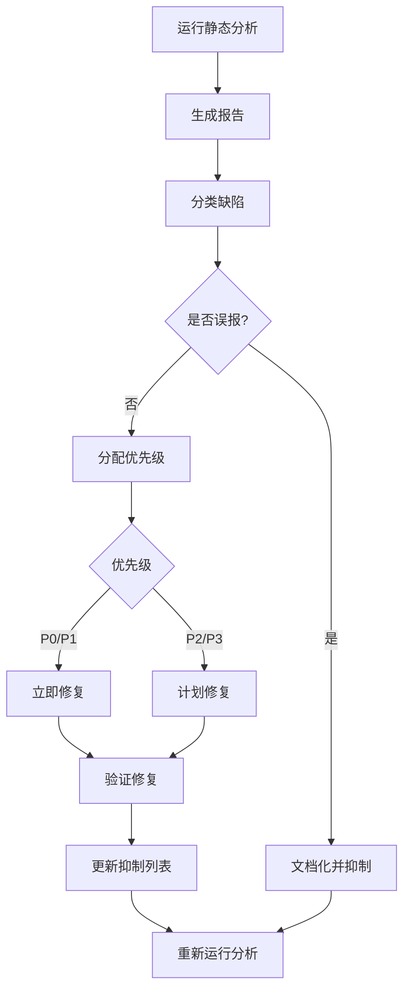

# 静态分析工具使用

## 学习目标

完成本模块后，你将能够：
- 理解静态分析工具的工作原理和价值
- 掌握主流静态分析工具的配置和使用
- 配置PC-lint进行MISRA C检查
- 使用Coverity进行深度缺陷检测
- 使用Cppcheck进行快速代码检查
- 集成静态分析到CI/CD流程
- 分析和处理静态分析报告
- 遵循医疗器械软件静态分析最佳实践

## 前置知识

- C/C++编程基础
- 编码规范基础（MISRA C、CERT C）
- 命令行工具使用
- 基本的软件构建流程
- IEC 62304标准基础知识

## 内容

### 静态分析基础

**静态分析定义**：
静态分析是在不执行程序的情况下，通过分析源代码或编译后的代码来发现潜在缺陷的技术。

**静态分析的价值**：
```
✓ 及早发现缺陷（编码阶段）
✓ 发现难以测试的问题（内存泄漏、死代码）
✓ 强制编码规范（MISRA C、CERT C）
✓ 降低测试成本
✓ 提高代码质量和可维护性
✓ 满足法规要求（IEC 62304）
```

**静态分析类型**：

1. **语法检查**：检查语法错误和编译警告
2. **规范检查**：检查是否符合编码规范（MISRA C）
3. **缺陷检测**：检查潜在的运行时错误
4. **安全漏洞检测**：检查安全相关问题
5. **代码度量**：计算复杂度、耦合度等指标


### 主流静态分析工具对比

| 工具 | 类型 | 支持语言 | MISRA C | 价格 | 适用场景 |
|------|------|---------|---------|------|---------|
| PC-lint Plus | 商业 | C/C++ | ✓ 完整 | 高 | 医疗器械、航空航天 |
| Coverity | 商业 | 多语言 | ✓ 支持 | 高 | 企业级项目 |
| Polyspace | 商业 | C/C++ | ✓ 完整 | 高 | MATLAB/Simulink集成 |
| Klocwork | 商业 | 多语言 | ✓ 支持 | 高 | 大型项目 |
| Cppcheck | 开源 | C/C++ | ✓ 部分 | 免费 | 快速检查、CI集成 |
| Clang Static Analyzer | 开源 | C/C++ | ✗ | 免费 | 开源项目 |
| SonarQube | 开源/商业 | 多语言 | ✓ 插件 | 免费/付费 | 代码质量管理 |

**选择建议**：
- **医疗器械Class C**：PC-lint Plus + Coverity
- **医疗器械Class B**：PC-lint Plus 或 Coverity
- **医疗器械Class A**：Cppcheck + PC-lint Plus
- **开源项目**：Cppcheck + Clang Static Analyzer
- **持续集成**：Cppcheck（快速）+ 定期深度扫描（PC-lint/Coverity）


### PC-lint Plus使用

PC-lint Plus是医疗器械行业最常用的静态分析工具，完整支持MISRA C:2012。

#### 安装和基本配置

**安装**：
```bash
# Windows安装
# 下载并运行安装程序
pclp_setup.exe

# Linux安装
tar -xzf pclp-linux.tar.gz
cd pclp
./install.sh
```

**基本配置文件结构**：
```
project/
├── lint/
│   ├── std.lnt          # 标准配置
│   ├── project.lnt      # 项目配置
│   ├── misra.lnt        # MISRA C配置
│   └── suppressions.lnt # 抑制规则
├── src/
└── include/
```

#### 配置文件详解

**std.lnt - 标准配置**：
```ini
// std.lnt - PC-lint Plus标准配置

// ===== 基本设置 =====
-width(120)              // 输出行宽
-hF1                     // 输出文件名
-format=%(%f:%l:%) %t %n: %m

// ===== 启用MISRA C:2012 =====
-misra(2012)             // 启用MISRA C:2012检查

// ===== 设置严重性级别 =====
-w3                      // 警告级别3（推荐）
// -w4                   // 警告级别4（更严格）

// ===== 启用所有强制规则 =====
+elib(*)                 // 检查库文件
-strong(AJX)             // 强类型检查

// ===== 包含路径 =====
-i"../include"           // 项目头文件
-i"C:/SDK/include"       // SDK头文件

// ===== 编译器选项 =====
-D__GNUC__=9             // 定义GCC版本
-D__arm__                // 定义ARM架构
-D__STDC_VERSION__=199901L  // C99标准

// ===== 消息控制 =====
+e{all}                  // 启用所有错误
-e{specific_number}      // 禁用特定消息（如有偏离）
```

**project.lnt - 项目配置**：
```ini
// project.lnt - 项目特定配置

// 包含标准配置
std.lnt

// ===== 项目特定包含路径 =====
-i"../drivers"
-i"../middleware"
-i"../application"

// ===== 项目特定宏定义 =====
-DPROJECT_VERSION=1
-DDEBUG_ENABLED
-DUSE_HAL_DRIVER

// ===== 文件列表 =====
// 方式1：直接列出文件
../src/main.c
../src/sensor.c
../src/processor.c

// 方式2：使用通配符（需要-os选项）
// -os(../src/*.c)

// ===== 抑制特定文件的警告 =====
-e{715}                  // 未使用的参数
// 仅对特定文件抑制
-esym(715, *) // 对所有符号抑制715
```

**misra.lnt - MISRA C配置**：
```ini
// misra.lnt - MISRA C:2012配置

// 启用MISRA C:2012
-misra(2012)

// ===== 规则严重性设置 =====
// Mandatory规则：错误级别
-emacro(*)               // 所有强制规则为错误

// Required规则：警告级别
-w3

// Advisory规则：信息级别
-w2

// ===== 规则偏离 =====
// 项目级偏离：Rule 21.3（malloc/free）
-esym(586, malloc, free)
/* 偏离理由：使用内存池管理器
 * 批准人：张三
 * 批准日期：2026-02-09
 */

// 文件级偏离示例
-efile(960, legacy_code.c)  // 对旧代码放宽检查

// ===== 自定义规则配置 =====
// 函数复杂度限制
-function_complexity(15)

// 文件长度限制
-file_length(1000)
```


#### 运行PC-lint Plus

**命令行使用**：
```bash
# 基本用法
pclp64 std.lnt project.lnt

# 指定输出文件
pclp64 std.lnt project.lnt > lint_report.txt

# 生成XML报告
pclp64 -xml std.lnt project.lnt > lint_report.xml

# 只检查特定文件
pclp64 std.lnt main.c

# 并行分析（多核）
pclp64 -j4 std.lnt project.lnt

# 增量分析（只检查修改的文件）
pclp64 -u std.lnt project.lnt
```

**集成到Makefile**：
```makefile
# Makefile集成PC-lint

.PHONY: lint lint-report lint-clean

# 运行lint检查
lint:
	@echo "Running PC-lint analysis..."
	pclp64 lint/std.lnt lint/project.lnt

# 生成详细报告
lint-report:
	@echo "Generating lint report..."
	pclp64 -xml lint/std.lnt lint/project.lnt > reports/lint_report.xml
	pclp64 lint/std.lnt lint/project.lnt > reports/lint_report.txt

# 清理lint生成的文件
lint-clean:
	rm -f *.lob reports/lint_*

# 在构建前运行lint
all: lint compile

compile:
	$(CC) $(CFLAGS) -o program $(SOURCES)
```

#### 分析报告解读

**报告格式示例**：
```
sensor.c:45: Warning 534: Ignoring return value of function 'read_adc'
sensor.c:67: Error 613: Possible use of null pointer 'ptr' in left argument to operator '->'
processor.c:123: Info 818: Pointer parameter 'data' could be declared as pointing to const
main.c:89: MISRA Rule 10.1: Operands shall not be of inappropriate essential type
```

**消息格式**：
```
文件名:行号: 严重性 消息编号: 消息内容
```

**严重性级别**：
- **Error**：严重错误，必须修复
- **Warning**：警告，应该修复
- **Info**：信息，建议修复
- **Note**：注释，可选修复

**常见消息及处理**：

```c
// 消息534：忽略返回值
// 问题代码
void bad_example(void) {
    read_sensor();  // 忽略返回值
}

// 修复
void good_example(void) {
    int result = read_sensor();
    if (result != SUCCESS) {
        handle_error();
    }
}

// 消息613：可能使用空指针
// 问题代码
void bad_example(sensor_t* ptr) {
    int value = ptr->value;  // 未检查ptr
}

// 修复
void good_example(sensor_t* ptr) {
    if (ptr != NULL) {
        int value = ptr->value;
    }
}

// 消息818：参数可以声明为const
// 问题代码
int calculate(int* data) {
    return data[0] + data[1];  // 未修改data
}

// 修复
int calculate(const int* data) {
    return data[0] + data[1];
}
```


### Coverity使用

Coverity是功能强大的商业静态分析工具，擅长发现深层次的缺陷。

#### 安装和配置

**安装**：
```bash
# 解压安装包
tar -xzf cov-analysis-linux64.tar.gz

# 设置环境变量
export PATH=$PATH:/opt/coverity/bin
export COVERITY_HOME=/opt/coverity
```

**基本配置**：
```bash
# 创建配置文件
cov-configure --gcc

# 配置编译器
cov-configure --compiler gcc --comptype gcc

# 配置交叉编译器
cov-configure --compiler arm-none-eabi-gcc --comptype gcc
```

#### 使用Coverity分析

**分析流程**：

**步骤1：构建捕获**
```bash
# 清理之前的构建
make clean

# 使用Coverity捕获构建过程
cov-build --dir cov-int make

# 或者直接指定编译命令
cov-build --dir cov-int gcc -o program *.c
```

**步骤2：分析**
```bash
# 运行分析
cov-analyze --dir cov-int \
            --all \
            --enable-constraint-fpp \
            --enable-fnptr \
            --enable-virtual

# 启用MISRA C检查
cov-analyze --dir cov-int \
            --coding-standard-config misra_c_2012.config
```

**步骤3：生成报告**
```bash
# 生成HTML报告
cov-format-errors --dir cov-int \
                  --html-output html-report

# 生成文本报告
cov-format-errors --dir cov-int \
                  --text-output-style multiline \
                  > coverity_report.txt

# 生成JSON报告
cov-format-errors --dir cov-int \
                  --json-output-v7 coverity_report.json
```

#### Coverity配置文件

**misra_c_2012.config - MISRA C配置**：
```xml
<?xml version="1.0" encoding="UTF-8"?>
<config>
  <coding_standard name="MISRA C 2012">
    <!-- 启用所有强制规则 -->
    <checker name="MISRA.MANDATORY.*" enabled="true"/>
    
    <!-- 启用所有必需规则 -->
    <checker name="MISRA.REQUIRED.*" enabled="true"/>
    
    <!-- 启用建议规则 -->
    <checker name="MISRA.ADVISORY.*" enabled="true"/>
    
    <!-- 禁用特定规则（偏离） -->
    <checker name="MISRA.RULE.21_3" enabled="false">
      <comment>项目偏离：使用内存池管理器</comment>
    </checker>
  </coding_standard>
</config>
```

#### Coverity缺陷类型

**常见缺陷类型**：

1. **资源泄漏（RESOURCE_LEAK）**：
```c
// Coverity检测到的资源泄漏
void bad_example(void) {
    FILE* file = fopen("data.txt", "r");
    if (file == NULL) {
        return;  // 泄漏：未关闭文件
    }
    // 处理文件
    if (error_condition) {
        return;  // 泄漏：未关闭文件
    }
    fclose(file);
}

// 修复
void good_example(void) {
    FILE* file = fopen("data.txt", "r");
    if (file == NULL) {
        return;
    }
    
    // 处理文件
    if (error_condition) {
        fclose(file);  // 修复：关闭文件
        return;
    }
    
    fclose(file);
}
```

2. **空指针解引用（NULL_RETURNS）**：
```c
// Coverity检测到的空指针问题
void bad_example(void) {
    char* buffer = malloc(100);
    strcpy(buffer, "data");  // 未检查malloc返回值
}

// 修复
void good_example(void) {
    char* buffer = malloc(100);
    if (buffer != NULL) {
        strcpy(buffer, "data");
        free(buffer);
    }
}
```

3. **缓冲区溢出（BUFFER_SIZE）**：
```c
// Coverity检测到的缓冲区溢出
void bad_example(void) {
    char buffer[10];
    strcpy(buffer, "This is a long string");  // 溢出
}

// 修复
void good_example(void) {
    char buffer[30];
    strncpy(buffer, "This is a long string", sizeof(buffer) - 1);
    buffer[sizeof(buffer) - 1] = '\0';
}
```


### Cppcheck使用

Cppcheck是开源的C/C++静态分析工具，适合快速检查和CI集成。

#### 安装

**Linux**：
```bash
# Ubuntu/Debian
sudo apt-get install cppcheck

# 从源码编译（获取最新版本）
git clone https://github.com/danmar/cppcheck.git
cd cppcheck
make MATCHCOMPILER=yes FILESDIR=/usr/share/cppcheck
sudo make install
```

**Windows**：
```bash
# 下载安装程序
# https://github.com/danmar/cppcheck/releases
cppcheck-2.x-x64-Setup.msi
```

#### 基本使用

**命令行选项**：
```bash
# 基本检查
cppcheck src/

# 启用所有检查
cppcheck --enable=all src/

# 指定检查类型
cppcheck --enable=warning,performance,portability src/

# 检查未使用的函数
cppcheck --enable=unusedFunction src/

# 指定C标准
cppcheck --std=c99 src/

# 指定包含路径
cppcheck -I include/ src/

# 定义宏
cppcheck -DDEBUG -DVERSION=1 src/

# 生成XML报告
cppcheck --xml --xml-version=2 src/ 2> report.xml

# 抑制特定警告
cppcheck --suppress=unusedVariable src/

# 从文件读取抑制规则
cppcheck --suppressions-list=suppressions.txt src/
```

#### MISRA C检查

**配置MISRA C检查**：
```bash
# 下载MISRA插件
# misra.py 和 misra.json 需要从Cppcheck仓库获取

# 运行MISRA检查
cppcheck --addon=misra.py src/

# 指定MISRA规则文件
cppcheck --addon=misra.py --addon-arg=misra.json src/

# 生成MISRA报告
cppcheck --addon=misra.py --xml --xml-version=2 src/ 2> misra_report.xml
```

**misra.json配置文件**：
```json
{
  "script": "misra.py",
  "args": [
    "--rule-texts=misra_rules.txt",
    "--suppress-rules=21.3"
  ]
}
```

**suppressions.txt - 抑制规则**：
```
# 抑制特定文件的警告
uninitvar:legacy_code.c

# 抑制特定行的警告
uninitvar:sensor.c:45

# 抑制特定符号的警告
unusedFunction:test_*

# 抑制所有某类警告
*:external_lib/*
```

#### Cppcheck配置文件

**创建项目配置文件**：
```bash
# 生成配置文件
cppcheck --project=compile_commands.json
```

**cppcheck.cfg - 自定义配置**：
```xml
<?xml version="1.0"?>
<def format="2">
  <!-- 定义项目特定的函数 -->
  <function name="safe_malloc">
    <noreturn>false</noreturn>
    <returnValue type="void *"/>
    <leak-ignore/>
    <arg nr="1">
      <not-uninit/>
    </arg>
  </function>
  
  <!-- 定义内存分配函数 -->
  <memory>
    <alloc init="false">safe_malloc</alloc>
    <dealloc>safe_free</dealloc>
  </memory>
  
  <!-- 定义资源管理 -->
  <resource>
    <alloc>sensor_open</alloc>
    <dealloc>sensor_close</dealloc>
  </resource>
</def>
```


### 集成到CI/CD

#### Jenkins集成

**Jenkinsfile示例**：
```groovy
pipeline {
    agent any
    
    stages {
        stage('Static Analysis') {
            parallel {
                stage('Cppcheck') {
                    steps {
                        sh '''
                            cppcheck --enable=all \
                                     --xml --xml-version=2 \
                                     src/ 2> cppcheck-report.xml
                        '''
                        publishCppcheck pattern: 'cppcheck-report.xml'
                    }
                }
                
                stage('PC-lint') {
                    steps {
                        sh '''
                            pclp64 -xml lint/std.lnt lint/project.lnt \
                                   > pclint-report.xml
                        '''
                        archiveArtifacts artifacts: 'pclint-report.xml'
                    }
                }
            }
        }
        
        stage('Quality Gate') {
            steps {
                script {
                    // 检查是否有高严重性问题
                    def issues = sh(
                        script: 'grep -c "severity=\"error\"" cppcheck-report.xml || true',
                        returnStdout: true
                    ).trim().toInteger()
                    
                    if (issues > 0) {
                        error("Found ${issues} critical issues")
                    }
                }
            }
        }
    }
    
    post {
        always {
            // 发布报告
            publishHTML([
                reportDir: 'reports',
                reportFiles: 'index.html',
                reportName: 'Static Analysis Report'
            ])
        }
    }
}
```

#### GitLab CI集成

**.gitlab-ci.yml示例**：
```yaml
stages:
  - static-analysis
  - quality-gate

variables:
  CPPCHECK_OPTIONS: "--enable=all --xml --xml-version=2"

cppcheck:
  stage: static-analysis
  image: gcc:latest
  before_script:
    - apt-get update && apt-get install -y cppcheck
  script:
    - cppcheck $CPPCHECK_OPTIONS src/ 2> cppcheck-report.xml
  artifacts:
    reports:
      junit: cppcheck-report.xml
    paths:
      - cppcheck-report.xml
    expire_in: 1 week

pclint:
  stage: static-analysis
  image: pclint-docker:latest
  script:
    - pclp64 -xml lint/std.lnt lint/project.lnt > pclint-report.xml
  artifacts:
    paths:
      - pclint-report.xml
    expire_in: 1 week
  only:
    - master
    - merge_requests

quality-gate:
  stage: quality-gate
  image: python:3.9
  script:
    - python scripts/check_quality_gate.py cppcheck-report.xml
  dependencies:
    - cppcheck
```

**说明**: 这是GitLab CI/CD中集成静态分析的配置示例。定义了静态分析阶段和质量门禁阶段，使用Cppcheck进行分析，并根据缺陷数量决定是否通过质量门禁，实现自动化质量控制。


#### GitHub Actions集成

**.github/workflows/static-analysis.yml**：
```yaml
name: Static Analysis

on:
  push:
    branches: [ main, develop ]
  pull_request:
    branches: [ main ]

jobs:
  cppcheck:
    runs-on: ubuntu-latest
    
    steps:
    - uses: actions/checkout@v2
    
    - name: Install Cppcheck
      run: |
        sudo apt-get update
        sudo apt-get install -y cppcheck
    
    - name: Run Cppcheck
      run: |
        cppcheck --enable=all \
                 --xml --xml-version=2 \
                 --output-file=cppcheck-report.xml \
                 src/
    
    - name: Upload results
      uses: actions/upload-artifact@v2
      with:
        name: cppcheck-report
        path: cppcheck-report.xml
    
    - name: Check for errors
      run: |
        errors=$(grep -c 'severity="error"' cppcheck-report.xml || true)
        if [ $errors -gt 0 ]; then
          echo "Found $errors errors"
          exit 1
        fi

  misra-check:
    runs-on: ubuntu-latest
    if: github.event_name == 'pull_request'
    
    steps:
    - uses: actions/checkout@v2
    
    - name: Run MISRA Check
      run: |
        cppcheck --addon=misra.py \
                 --xml --xml-version=2 \
                 src/ 2> misra-report.xml
    
    - name: Comment PR
      uses: actions/github-script@v5
      with:
        script: |
          const fs = require('fs');
          const report = fs.readFileSync('misra-report.xml', 'utf8');
          // 解析报告并评论到PR
```


### 报告分析和处理

#### 报告优先级分类

**严重性分级**：
```
P0 - 关键（Critical）：
  - 空指针解引用
  - 缓冲区溢出
  - 资源泄漏
  - 未初始化变量使用
  → 必须立即修复

P1 - 高（High）：
  - MISRA C强制规则违反
  - 安全漏洞
  - 数据竞争
  → 应在当前迭代修复

P2 - 中（Medium）：
  - MISRA C必需规则违反
  - 代码异味
  - 性能问题
  → 应在下个迭代修复

P3 - 低（Low）：
  - MISRA C建议规则违反
  - 代码风格问题
  - 信息性警告
  → 可以延后修复
```

**说明**: 这是缺陷优先级分类标准。P0关键缺陷(空指针、缓冲区溢出、资源泄漏等)必须立即修复；P1高优先级(MISRA违规、安全漏洞)应该修复；P2/P3可以计划修复或接受，确保资源合理分配。


#### 误报处理

**识别误报**：
```c
// 示例：工具误报的情况
void example(void) {
    int* ptr = get_valid_pointer();  // 工具不知道这个函数总是返回有效指针
    
    // 工具可能报告：可能的空指针解引用
    int value = *ptr;  // 实际上这是安全的
}

// 处理方式1：添加断言
void example_with_assert(void) {
    int* ptr = get_valid_pointer();
    assert(ptr != NULL);  // 帮助工具理解
    int value = *ptr;
}

// 处理方式2：添加注释抑制
void example_with_suppression(void) {
    int* ptr = get_valid_pointer();
    // coverity[var_deref_op]
    // pclint -e{613}
    int value = *ptr;
}
```

**抑制误报的最佳实践**：
```c
// 好的抑制：有详细说明
/* PC-lint抑制：消息534
 * 理由：read_sensor()的返回值在此处不重要，
 *       因为后续会通过其他方式验证传感器状态
 * 审查人：张三
 * 日期：2026-02-09
 */
//lint -e{534}
read_sensor();

// 不好的抑制：没有说明
//lint -e{534}
read_sensor();
```

#### 缺陷修复工作流



**说明**: 这是静态分析工作流程图。从运行分析、生成报告、分类缺陷、判断误报、分配优先级、修复、验证到更新基线的完整流程，确保静态分析结果得到有效利用。


#### 度量和趋势分析

**关键指标**：
```python
# 静态分析度量脚本示例
import xml.etree.ElementTree as ET

def analyze_report(xml_file):
    tree = ET.parse(xml_file)
    root = tree.getroot()
    
    metrics = {
        'total_issues': 0,
        'critical': 0,
        'high': 0,
        'medium': 0,
        'low': 0,
        'by_category': {}
    }
    
    for error in root.findall('.//error'):
        severity = error.get('severity')
        category = error.get('id')
        
        metrics['total_issues'] += 1
        
        if severity == 'error':
            metrics['critical'] += 1
        elif severity == 'warning':
            metrics['high'] += 1
        elif severity == 'style':
            metrics['low'] += 1
        
        if category not in metrics['by_category']:
            metrics['by_category'][category] = 0
        metrics['by_category'][category] += 1
    
    return metrics

# 生成趋势报告
def generate_trend_report(reports):
    """跟踪缺陷数量随时间的变化"""
    for date, report in reports:
        metrics = analyze_report(report)
        print(f"{date}: {metrics['total_issues']} issues")
```


### 医疗器械软件静态分析最佳实践

#### 1. IEC 62304合规性

**Class C软件要求**：
```
✓ 使用至少一个商业级静态分析工具（PC-lint Plus或Coverity）
✓ 启用MISRA C:2012所有强制和必需规则
✓ 100%代码覆盖（所有文件都要分析）
✓ 所有P0和P1缺陷必须修复
✓ 所有偏离必须文档化和批准
✓ 保留完整的分析报告用于审计
```

**Class B软件要求**：
```
✓ 使用商业或开源静态分析工具
✓ 启用MISRA C:2012所有强制规则
✓ 核心功能100%覆盖
✓ 所有P0缺陷必须修复
✓ 关键偏离需要文档化
```

**说明**: 这是IEC 62304 Class C软件的静态分析要求。必须使用静态分析工具，启用MISRA C:2012所有强制规则，核心功能100%覆盖，所有P0缺陷必须修复，关键偏离需要文档化，确保最高质量标准。


#### 2. 分析频率

**开发阶段**：
```
✓ 每次提交：快速检查（Cppcheck）
✓ 每日构建：完整检查（PC-lint）
✓ 每周：深度分析（Coverity）
✓ 发布前：完整分析+人工审查
```

**配置示例**：
```bash
# pre-commit hook
#!/bin/bash
# .git/hooks/pre-commit

echo "Running quick static analysis..."
cppcheck --enable=warning,error --quiet src/

if [ $? -ne 0 ]; then
    echo "Static analysis found issues. Commit aborted."
    exit 1
fi
```

#### 3. 工具组合策略

**推荐组合**：
```
医疗器械Class C：
  - PC-lint Plus（MISRA C合规）
  - Coverity（深度缺陷检测）
  - Cppcheck（快速CI检查）

医疗器械Class B：
  - PC-lint Plus 或 Coverity
  - Cppcheck（CI集成）

医疗器械Class A：
  - Cppcheck + 编译器警告
  - 可选：PC-lint Plus
```

**说明**: 这是不同安全等级软件的工具选择建议。Class C需要商业工具(PC-lint Plus、Coverity)加开源工具(Cppcheck)；Class B可以使用其中之一；Class A使用开源工具即可，根据风险等级选择合适的工具组合。


#### 4. 配置管理

**版本控制**：
```
project/
├── .git/
├── lint/
│   ├── std.lnt              # 纳入版本控制
│   ├── project.lnt          # 纳入版本控制
│   ├── misra.lnt            # 纳入版本控制
│   └── suppressions.lnt     # 纳入版本控制
├── reports/                 # 不纳入版本控制
│   └── .gitignore
└── src/
```

**配置审查**：
```
✓ 所有配置文件变更需要代码审查
✓ 抑制规则添加需要技术负责人批准
✓ 定期审查抑制列表（每季度）
✓ 记录配置变更历史
```

**说明**: 这是配置管理的最佳实践。所有配置变更需要审查，抑制规则添加需要批准，定期审查抑制列表，记录变更历史，确保配置的可控性和可追溯性。


#### 5. 培训和流程

**团队培训**：
```
✓ 工具使用培训（新员工入职）
✓ MISRA C规则培训（所有开发人员）
✓ 报告分析培训（技术负责人）
✓ 定期更新培训（新版本发布时）
```

**流程文档**：
```markdown
# 静态分析流程文档

## 1. 日常开发
- 提交前运行快速检查
- 修复所有P0问题
- 记录P1/P2问题到任务列表

## 2. 代码审查
- 审查静态分析报告
- 验证抑制规则的合理性
- 确认偏离文档完整

## 3. 发布前
- 运行完整静态分析
- 确保零P0/P1问题
- 生成合规报告
- 归档分析结果
```


## 最佳实践

!!! tip "静态分析工具使用最佳实践"
    1. **尽早集成**：从项目开始就使用静态分析
    2. **持续运行**：集成到CI/CD，每次提交都检查
    3. **零容忍关键问题**：P0问题必须立即修复
    4. **文档化偏离**：所有抑制都要有详细说明
    5. **定期审查**：每季度审查抑制列表和配置
    6. **工具组合**：使用多个工具互补
    7. **培训团队**：确保团队理解工具和规则
    8. **跟踪趋势**：监控缺陷数量和类型的变化
    9. **自动化报告**：自动生成和分发分析报告
    10. **版本控制配置**：所有配置文件纳入版本控制

## 常见陷阱

!!! warning "注意事项"
    1. **过度抑制**：不加分析地抑制所有警告
       - 应该：仔细分析每个警告，只抑制确认的误报
    
    2. **忽略低优先级问题**：认为P3问题不重要
       - 应该：定期修复低优先级问题，防止积累
    
    3. **工具配置不当**：使用默认配置
       - 应该：根据项目需求定制配置
    
    4. **只在发布前运行**：静态分析太晚
       - 应该：集成到日常开发流程
    
    5. **不更新工具**：使用过时版本
       - 应该：定期更新工具到最新版本
    
    6. **缺乏培训**：团队不理解报告
       - 应该：提供充分的工具和规则培训
    
    7. **没有度量**：不跟踪缺陷趋势
       - 应该：建立度量体系，监控质量趋势
    
    8. **单一工具依赖**：只使用一个工具
       - 应该：使用多个工具互补，提高覆盖率


## 实践练习

1. **基础练习**：配置Cppcheck检查一个简单的C项目
   - 安装Cppcheck
   - 运行基本检查
   - 分析报告并修复问题

2. **中级练习**：配置PC-lint进行MISRA C检查
   - 创建配置文件（std.lnt, project.lnt）
   - 启用MISRA C:2012检查
   - 处理报告中的违规

3. **高级练习**：集成静态分析到CI/CD
   - 配置Jenkins或GitLab CI
   - 设置质量门禁
   - 自动生成和发布报告

4. **综合练习**：建立完整的静态分析流程
   - 选择工具组合
   - 配置多个工具
   - 建立缺陷跟踪流程
   - 生成合规报告

## 相关资源

- [静态分析概述](index.md)
- [MISRA C编码规范](../coding-standards/misra-c.md)
- [CERT C安全编码](../coding-standards/cert-c.md)
- [代码审查检查清单](../coding-standards/code-review-checklist.md)


## 参考文献

1. IEC 62304:2006+AMD1:2015 - Medical device software - Software life cycle processes, Section 5.5.2 (Software Unit Verification)
2. "PC-lint Plus User's Manual", Gimpel Software, 2023
3. "Coverity Static Analysis User Guide", Synopsys, 2023
4. "Cppcheck Manual", Cppcheck Project, 2023
5. MISRA C:2012 - Guidelines for the use of the C language in critical systems, Third Edition
6. FDA Guidance - General Principles of Software Validation, 2002
7. "Static Analysis Tools for C: A Comparison", NIST Special Publication, 2020
8. "Secure Coding in C and C++", Robert C. Seacord, Addison-Wesley, 2013


## 自测问题

??? question "什么是静态分析？它与动态测试有什么区别？"
    静态分析是在不执行程序的情况下分析代码的技术。
    
    ??? success "答案"
        **静态分析定义**：
        静态分析是通过检查源代码或编译后的代码来发现潜在缺陷的技术，不需要实际运行程序。
        
        **静态分析 vs 动态测试对比**：
        
        | 维度 | 静态分析 | 动态测试 |
        |------|---------|---------|
        | 执行方式 | 不运行程序 | 运行程序 |
        | 分析时机 | 编码阶段 | 测试阶段 |
        | 覆盖范围 | 所有代码路径 | 执行的路径 |
        | 发现问题 | 潜在缺陷 | 实际缺陷 |
        | 成本 | 低（早期发现） | 高（后期发现） |
        | 误报率 | 可能有误报 | 很少误报 |
        
        **静态分析优势**：
        - 及早发现问题（编码阶段）
        - 覆盖所有代码路径（包括错误处理）
        - 发现难以测试的问题（内存泄漏、死代码）
        - 强制编码规范
        
        **动态测试优势**：
        - 发现实际运行时问题
        - 验证功能正确性
        - 测试性能和资源使用
        - 很少误报
        
        **最佳实践**：两者结合使用，静态分析在前，动态测试在后。

??? question "PC-lint Plus和Cppcheck有什么区别？如何选择？"
    PC-lint Plus是商业工具，Cppcheck是开源工具。
    
    ??? success "答案"
        **PC-lint Plus特点**：
        
        **优势**：
        - 完整支持MISRA C:2012（所有规则）
        - 检查深度和准确度高
        - 误报率低
        - 配置灵活强大
        - 商业支持和文档完善
        - 医疗器械行业广泛认可
        
        **劣势**：
        - 商业软件，需要购买许可证
        - 价格较高
        - 学习曲线较陡
        
        **Cppcheck特点**：
        
        **优势**：
        - 开源免费
        - 易于安装和使用
        - 执行速度快
        - 适合CI/CD集成
        - 社区活跃
        
        **劣势**：
        - MISRA C支持不完整
        - 检查深度有限
        - 误报率相对较高
        - 缺少商业支持
        
        **选择建议**：
        
        **医疗器械Class C软件**：
        - 必须使用PC-lint Plus（或同级别商业工具）
        - 可以配合Cppcheck做快速检查
        
        **医疗器械Class B软件**：
        - 推荐PC-lint Plus
        - 预算有限可考虑Cppcheck + 严格代码审查
        
        **医疗器械Class A软件**：
        - Cppcheck + 编译器警告通常足够
        - 可选PC-lint Plus提高质量
        
        **开源项目**：
        - Cppcheck是很好的选择
        
        **推荐组合**：
        - 日常开发：Cppcheck（快速反馈）
        - 代码审查：PC-lint Plus（深度检查）
        - 发布前：PC-lint Plus + Coverity（全面验证）

??? question "如何处理静态分析工具的误报？"
    误报是静态分析工具的常见问题，需要正确处理。
    
    ??? success "答案"
        **识别误报的方法**：
        
        1. **仔细分析报告**：
           - 理解工具为什么报告这个问题
           - 检查代码逻辑是否真的有问题
           - 考虑边界情况和异常路径
        
        2. **代码审查**：
           - 让其他开发人员审查
           - 讨论是否真的是误报
        
        3. **运行时验证**：
           - 如果可能，通过测试验证
           - 使用调试器检查实际行为
        
        **处理误报的策略**：
        
        **策略1：改进代码（首选）**
        ```c
        // 工具报告：可能的空指针解引用
        void original(void) {
            int* ptr = get_pointer();
            int value = *ptr;  // 工具不确定ptr是否为NULL
        }
        
        // 改进：添加检查，消除歧义
        void improved(void) {
            int* ptr = get_pointer();
            if (ptr != NULL) {
                int value = *ptr;  // 现在工具知道ptr有效
            }
        }
        ```
        
        **策略2：添加断言**
        ```c
        void with_assert(void) {
            int* ptr = get_pointer();
            assert(ptr != NULL);  // 帮助工具理解
            int value = *ptr;
        }
        ```
        
        **策略3：抑制警告（最后手段）**
        ```c
        /* 抑制说明
         * 工具：PC-lint
         * 消息：613（可能的空指针解引用）
         * 理由：get_pointer()在此上下文中保证返回有效指针，
         *       因为在调用前已经通过init_system()初始化
         * 审查人：张三
         * 日期：2026-02-09
         */
        //lint -e{613}
        void suppressed(void) {
            int* ptr = get_pointer();
            int value = *ptr;
        }
        ```
        
        **抑制规则的最佳实践**：
        
        1. **文档化**：
           - 说明为什么是误报
           - 记录审查人和日期
           - 解释代码的实际行为
        
        2. **最小范围**：
           - 只抑制特定行，不要全局抑制
           - 使用行级抑制而非文件级
        
        3. **定期审查**：
           - 每季度审查抑制列表
           - 检查是否仍然必要
           - 代码变更后重新评估
        
        4. **需要批准**：
           - 抑制规则需要技术负责人批准
           - 记录在配置管理系统中
        
        **注意事项**：
        - 不要轻易认定为误报
        - 优先改进代码而非抑制
        - 保持抑制列表简短
        - 误报率高可能是配置问题

??? question "如何将静态分析集成到CI/CD流程？"
    静态分析应该自动化并集成到开发流程中。
    
    ??? success "答案"
        **CI/CD集成策略**：
        
        **1. 多层次检查**：
        ```
        提交前（Pre-commit）：
          - 快速检查（Cppcheck）
          - 只检查修改的文件
          - 1-2分钟完成
        
        每次提交（CI）：
          - 中等深度检查
          - 检查所有相关文件
          - 5-10分钟完成
        
        每日构建：
          - 完整检查（PC-lint）
          - 检查整个项目
          - 30-60分钟完成
        
        发布前：
          - 深度分析（Coverity）
          - 完整项目扫描
          - 数小时完成
        ```
        
        **2. 质量门禁设置**：
        ```yaml
        # 示例：GitLab CI质量门禁
        quality-gate:
          script:
            - python check_quality.py
          rules:
            # P0问题：构建失败
            - if: critical_issues > 0
              when: on_failure
            
            # P1问题：警告但不阻止
            - if: high_issues > 5
              when: on_warning
            
            # 趋势检查：新增问题过多
            - if: new_issues > 10
              when: on_failure
        ```
        
        **3. 报告和通知**：
        ```python
        # 自动通知脚本
        def notify_team(report):
            if report['critical'] > 0:
                send_email(
                    to='team@example.com',
                    subject='[URGENT] Critical issues found',
                    body=format_report(report)
                )
            
            if report['new_issues'] > 0:
                post_to_slack(
                    channel='#code-quality',
                    message=f"New issues: {report['new_issues']}"
                )
        ```
        
        **4. 增量分析**：
        ```bash
        # 只分析变更的文件
        git diff --name-only HEAD~1 | grep '\.c$' | \
            xargs cppcheck --enable=all
        ```
        
        **5. 缓存和优化**：
        ```yaml
        # GitLab CI缓存示例
        cppcheck:
          cache:
            key: cppcheck-cache
            paths:
              - .cppcheck/
          script:
            - cppcheck --cppcheck-build-dir=.cppcheck src/
        ```
        
        **实施步骤**：
        
        **阶段1：基础集成**
        1. 选择快速工具（Cppcheck）
        2. 配置CI运行检查
        3. 生成报告但不阻止构建
        4. 团队熟悉报告
        
        **阶段2：质量门禁**
        1. 设置P0问题阻止构建
        2. 修复现有P0问题
        3. 逐步提高标准
        
        **阶段3：深度集成**
        1. 添加商业工具（PC-lint）
        2. 定期深度扫描
        3. 趋势分析和度量
        
        **阶段4：持续优化**
        1. 优化检查速度
        2. 减少误报
        3. 自动化报告分发
        
        **成功指标**：
        - 检查时间 < 10分钟（CI）
        - 误报率 < 10%
        - P0问题修复时间 < 1天
        - 团队满意度 > 80%

??? question "医疗器械软件静态分析有哪些特殊要求？"
    医疗器械软件需要满足IEC 62304等法规要求。
    
    ??? success "答案"
        **IEC 62304静态分析要求**：
        
        **Class C软件（高风险）**：
        
        **强制要求**：
        - 使用商业级静态分析工具
        - 完整的MISRA C:2012合规性检查
        - 100%代码覆盖（所有文件必须分析）
        - 所有强制和必需规则必须遵守
        - 所有P0和P1缺陷必须修复
        - 完整的偏离文档和批准流程
        - 保留所有分析报告用于审计
        
        **推荐工具组合**：
        - PC-lint Plus（MISRA C检查）
        - Coverity（深度缺陷检测）
        - Cppcheck（快速CI检查）
        
        **Class B软件（中风险）**：
        
        **要求**：
        - 使用静态分析工具（商业或开源）
        - MISRA C强制规则必须遵守
        - 核心功能100%覆盖
        - 所有P0缺陷必须修复
        - 关键偏离需要文档化
        
        **推荐工具**：
        - PC-lint Plus 或 Coverity
        - Cppcheck（辅助）
        
        **Class A软件（低风险）**：
        
        **要求**：
        - 建议使用静态分析
        - 编译器警告级别最高
        - 关键缺陷需要修复
        
        **推荐工具**：
        - Cppcheck + 编译器警告
        - 可选PC-lint Plus
        
        **文档要求**：
        
        **必需文档**：
        1. **静态分析计划**：
           - 使用的工具和版本
           - 检查规则和配置
           - 分析频率和触发条件
           - 缺陷处理流程
        
        2. **配置文件**：
           - 工具配置文件
           - 规则启用/禁用列表
           - 抑制规则列表
        
        3. **分析报告**：
           - 每次分析的完整报告
           - 缺陷列表和状态
           - 修复记录
        
        4. **偏离文档**：
           - 偏离的规则
           - 偏离理由
           - 缓解措施
           - 批准记录
        
        5. **审计追踪**：
           - 配置变更历史
           - 抑制规则变更历史
           - 缺陷修复历史
        
        **审计准备**：
        
        **审计员可能检查的内容**：
        - 静态分析工具的选择和配置
        - 分析覆盖率（是否所有代码都分析了）
        - 缺陷修复记录
        - 偏离的合理性和批准
        - 分析频率和时机
        - 工具版本和更新记录
        
        **准备材料**：
        ```
        audit_package/
        ├── static_analysis_plan.pdf
        ├── tool_configuration/
        │   ├── pclint_config/
        │   └── coverity_config/
        ├── analysis_reports/
        │   ├── 2026-01-15_report.pdf
        │   ├── 2026-02-01_report.pdf
        │   └── 2026-02-09_report.pdf
        ├── deviation_records/
        │   └── approved_deviations.xlsx
        └── defect_tracking/
            └── defect_log.xlsx
        ```
        
        **最佳实践**：
        - 从项目开始就建立静态分析流程
        - 保持完整的文档和记录
        - 定期审查和更新配置
        - 培训团队理解法规要求
        - 使用工具辅助合规性管理
