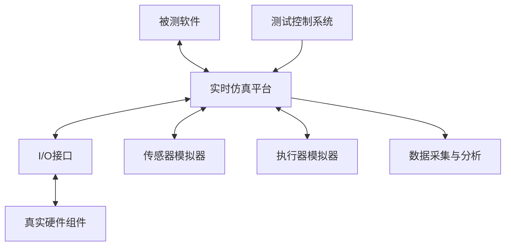

# 硬件在环测试（HIL Testing）

## 学习目标

通过本文档的学习，你将能够：

- 理解核心概念和原理
- 掌握实际应用方法
- 了解最佳实践和注意事项

## 前置知识

在学习本文档之前，建议你已经掌握：

- 基础的嵌入式系统知识
- C/C++编程基础
- 相关领域的基本概念

## 概述

硬件在环（Hardware-in-the-Loop, HIL）测试是一种将真实硬件组件与模拟环境相结合的测试方法。对于医疗设备，HIL测试可以在安全、可控的环境中验证软件与硬件的交互，而无需使用真实患者或完整的物理系统。

## 为什么需要HIL测试？

### 医疗设备的特殊需求

- **安全性**: 无法在真实患者上测试所有故障场景
- **可重复性**: 需要在相同条件下重复测试
- **边界条件**: 需要测试极端和罕见的情况
- **成本效益**: 减少物理原型和测试设备的需求
- **早期验证**: 在硬件完成前开始软件测试

### HIL测试的优势

| 优势 | 说明 |
|------|------|
| **安全性** | 在模拟环境中测试危险场景 |
| **可重复性** | 精确重现测试条件 |
| **覆盖率** | 测试难以在真实环境中重现的场景 |
| **成本** | 降低测试成本和时间 |
| **并行开发** | 软硬件可并行开发和测试 |
| **故障注入** | 系统地测试故障处理 |

## HIL测试架构

### 基本架构



### 组件说明

1. **实时仿真平台**: 运行物理模型和环境模拟
2. **I/O接口**: 连接软件和硬件的接口
3. **传感器模拟器**: 模拟各种传感器输入
4. **执行器模拟器**: 模拟执行器响应
5. **测试控制系统**: 管理测试执行和场景
6. **数据采集**: 记录和分析测试数据


## HIL测试平台搭建

### 硬件选择

#### 实时仿真平台

**dSPACE系统**:
```python
# dSPACE Python接口示例
from dspace import RTI

class DSPACEHILPlatform:
    """dSPACE HIL测试平台"""
    
    def __init__(self, platform_name='DS1006'):
        self.rti = RTI(platform_name)
        self.variables = {}
    
    def load_model(self, model_path):
        """加载Simulink模型"""
        self.rti.load_application(model_path)
        print(f"模型已加载: {model_path}")
    
    def set_parameter(self, param_name, value):
        """设置模型参数"""
        self.rti.set_variable(param_name, value)
        self.variables[param_name] = value
    
    def get_signal(self, signal_name):
        """读取信号值"""
        return self.rti.get_variable(signal_name)
    
    def start_simulation(self):
        """启动仿真"""
        self.rti.start()
        print("仿真已启动")
    
    def stop_simulation(self):
        """停止仿真"""
        self.rti.stop()
        print("仿真已停止")
```

**NI LabVIEW系统**:
```python
# NI LabVIEW Python接口
import nidaqmx
from nidaqmx.constants import AcquisitionType

class NIHILPlatform:
    """NI LabVIEW HIL测试平台"""
    
    def __init__(self, device_name='Dev1'):
        self.device = device_name
        self.tasks = {}
    
    def create_analog_input(self, channel, sample_rate=1000):
        """创建模拟输入任务"""
        task = nidaqmx.Task()
        task.ai_channels.add_ai_voltage_chan(f"{self.device}/{channel}")
        task.timing.cfg_samp_clk_timing(
            rate=sample_rate,
            sample_mode=AcquisitionType.CONTINUOUS
        )
        self.tasks[channel] = task
        return task
    
    def create_analog_output(self, channel):
        """创建模拟输出任务"""
        task = nidaqmx.Task()
        task.ao_channels.add_ao_voltage_chan(f"{self.device}/{channel}")
        self.tasks[channel] = task
        return task
    
    def read_analog_input(self, channel, num_samples=1000):
        """读取模拟输入"""
        task = self.tasks.get(channel)
        if task:
            return task.read(number_of_samples_per_channel=num_samples)
        return None
    
    def write_analog_output(self, channel, data):
        """写入模拟输出"""
        task = self.tasks.get(channel)
        if task:
            task.write(data)
    
    def close_all_tasks(self):
        """关闭所有任务"""
        for task in self.tasks.values():
            task.close()
```

### 传感器模拟

#### ECG信号模拟器

```python
import numpy as np
from scipy import signal

class ECGSimulator:
    """ECG信号模拟器"""
    
    def __init__(self, sample_rate=500):
        self.sample_rate = sample_rate
        self.time = 0
    
    def generate_normal_ecg(self, duration, heart_rate=72):
        """生成正常ECG信号"""
        num_samples = int(duration * self.sample_rate)
        t = np.linspace(0, duration, num_samples)
        
        # 基础心率
        frequency = heart_rate / 60.0
        
        # P波
        p_wave = 0.25 * signal.gaussian(num_samples, std=0.01*self.sample_rate)
        
        # QRS波群
        qrs_complex = signal.gaussian(num_samples, std=0.015*self.sample_rate)
        
        # T波
        t_wave = 0.35 * signal.gaussian(num_samples, std=0.02*self.sample_rate)
        
        # 组合波形
        ecg = np.zeros(num_samples)
        beat_interval = int(self.sample_rate / frequency)
        
        for i in range(0, num_samples, beat_interval):
            if i + len(p_wave) < num_samples:
                # 添加P波
                ecg[i:i+len(p_wave)] += p_wave
                
                # 添加QRS波群（P波后0.12秒）
                qrs_start = i + int(0.12 * self.sample_rate)
                if qrs_start + len(qrs_complex) < num_samples:
                    ecg[qrs_start:qrs_start+len(qrs_complex)] += qrs_complex
                
                # 添加T波（QRS后0.2秒）
                t_start = qrs_start + int(0.2 * self.sample_rate)
                if t_start + len(t_wave) < num_samples:
                    ecg[t_start:t_start+len(t_wave)] += t_wave
        
        return ecg
    
    def generate_arrhythmia(self, duration, arrhythmia_type='afib'):
        """生成心律失常信号"""
        if arrhythmia_type == 'afib':
            return self._generate_atrial_fibrillation(duration)
        elif arrhythmia_type == 'vfib':
            return self._generate_ventricular_fibrillation(duration)
        elif arrhythmia_type == 'pvc':
            return self._generate_premature_ventricular_contraction(duration)
        else:
            return self.generate_normal_ecg(duration)
    
    def _generate_atrial_fibrillation(self, duration):
        """生成房颤信号"""
        num_samples = int(duration * self.sample_rate)
        
        # 不规则的R-R间期
        ecg = np.zeros(num_samples)
        current_pos = 0
        
        while current_pos < num_samples:
            # 随机R-R间期（300-600ms）
            rr_interval = int(np.random.uniform(0.3, 0.6) * self.sample_rate)
            
            # 添加QRS波群
            qrs = signal.gaussian(100, std=15)
            end_pos = min(current_pos + len(qrs), num_samples)
            ecg[current_pos:end_pos] = qrs[:end_pos-current_pos]
            
            # 添加细小的f波（房颤波）
            f_wave_length = min(rr_interval, num_samples - current_pos)
            f_wave = 0.05 * np.random.randn(f_wave_length)
            ecg[current_pos:current_pos+f_wave_length] += f_wave
            
            current_pos += rr_interval
        
        return ecg
    
    def _generate_ventricular_fibrillation(self, duration):
        """生成室颤信号"""
        num_samples = int(duration * self.sample_rate)
        
        # 快速、不规则、低振幅的波形
        ecg = np.random.randn(num_samples) * 0.3
        
        # 添加高频成分
        t = np.linspace(0, duration, num_samples)
        ecg += 0.5 * np.sin(2 * np.pi * 8 * t)  # 8 Hz
        
        return ecg
    
    def _generate_premature_ventricular_contraction(self, duration):
        """生成室性早搏信号"""
        # 正常ECG
        ecg = self.generate_normal_ecg(duration, heart_rate=72)
        
        # 在随机位置插入PVC
        num_samples = len(ecg)
        pvc_positions = np.random.choice(
            range(self.sample_rate, num_samples - self.sample_rate),
            size=3,
            replace=False
        )
        
        for pos in pvc_positions:
            # 宽大畸形的QRS波群
            pvc_wave = 1.5 * signal.gaussian(150, std=30)
            end_pos = min(pos + len(pvc_wave), num_samples)
            ecg[pos:end_pos] = pvc_wave[:end_pos-pos]
        
        return ecg
    
    def add_noise(self, ecg, noise_level=0.1):
        """添加噪声"""
        noise = np.random.normal(0, noise_level, len(ecg))
        return ecg + noise
    
    def add_baseline_wander(self, ecg, frequency=0.5, amplitude=0.2):
        """添加基线漂移"""
        t = np.linspace(0, len(ecg)/self.sample_rate, len(ecg))
        baseline = amplitude * np.sin(2 * np.pi * frequency * t)
        return ecg + baseline
    
    def add_powerline_interference(self, ecg, frequency=50, amplitude=0.1):
        """添加工频干扰"""
        t = np.linspace(0, len(ecg)/self.sample_rate, len(ecg))
        interference = amplitude * np.sin(2 * np.pi * frequency * t)
        return ecg + interference
```

#### 血压传感器模拟

```python
class BloodPressureSimulator:
    """血压传感器模拟器"""
    
    def __init__(self, sample_rate=100):
        self.sample_rate = sample_rate
    
    def generate_arterial_pressure(self, duration, systolic=120, diastolic=80, heart_rate=72):
        """生成动脉压波形"""
        num_samples = int(duration * self.sample_rate)
        t = np.linspace(0, duration, num_samples)
        
        # 心率对应的频率
        frequency = heart_rate / 60.0
        
        # 基础波形（正弦波）
        pressure = diastolic + (systolic - diastolic) * (1 + np.sin(2 * np.pi * frequency * t)) / 2
        
        # 添加重搏波（dicrotic notch）
        for i in range(0, num_samples, int(self.sample_rate / frequency)):
            notch_pos = i + int(0.3 * self.sample_rate / frequency)
            if notch_pos < num_samples:
                pressure[notch_pos] -= (systolic - diastolic) * 0.1
        
        return pressure
    
    def generate_cuff_pressure(self, duration, max_pressure=180):
        """生成袖带压力波形（NIBP测量）"""
        num_samples = int(duration * self.sample_rate)
        
        # 充气阶段（0-3秒）
        inflate_samples = int(3 * self.sample_rate)
        inflate = np.linspace(0, max_pressure, inflate_samples)
        
        # 放气阶段（3秒-结束）
        deflate_samples = num_samples - inflate_samples
        deflate = np.linspace(max_pressure, 0, deflate_samples)
        
        # 添加脉搏振荡
        t_deflate = np.linspace(0, deflate_samples/self.sample_rate, deflate_samples)
        oscillations = 5 * np.sin(2 * np.pi * 1.2 * t_deflate) * np.exp(-t_deflate/5)
        deflate += oscillations
        
        pressure = np.concatenate([inflate, deflate])
        return pressure
```

#### SpO2传感器模拟

```python
class SpO2Simulator:
    """血氧饱和度传感器模拟器"""
    
    def __init__(self, sample_rate=100):
        self.sample_rate = sample_rate
    
    def generate_ppg_signal(self, duration, spo2=98, heart_rate=72):
        """生成光电容积脉搏波（PPG）信号"""
        num_samples = int(duration * self.sample_rate)
        t = np.linspace(0, duration, num_samples)
        
        # 心率对应的频率
        frequency = heart_rate / 60.0
        
        # AC成分（脉动成分）
        ac_component = np.sin(2 * np.pi * frequency * t)
        
        # DC成分（直流成分）
        dc_component = 2.0
        
        # 红光和红外光的吸收比率与SpO2相关
        # R = (AC_red/DC_red) / (AC_ir/DC_ir)
        # SpO2 = 110 - 25*R
        
        # 红光PPG
        red_ac = 0.05 * ac_component
        red_dc = dc_component
        red_ppg = red_dc + red_ac
        
        # 红外光PPG
        ir_ac = 0.1 * ac_component
        ir_dc = dc_component
        ir_ppg = ir_dc + ir_ac
        
        return {
            'red': red_ppg,
            'infrared': ir_ppg,
            'spo2': spo2,
            'heart_rate': heart_rate
        }
    
    def add_motion_artifact(self, ppg_signal, intensity=0.1):
        """添加运动伪影"""
        num_samples = len(ppg_signal)
        
        # 低频运动伪影
        motion = intensity * np.random.randn(num_samples)
        motion = signal.filtfilt([1], [1, -0.95], motion)
        
        return ppg_signal + motion
```


## 故障注入测试

### 故障类型

```python
class FaultInjector:
    """故障注入器"""
    
    def __init__(self, hil_platform):
        self.platform = hil_platform
        self.active_faults = []
    
    def inject_sensor_fault(self, sensor_name, fault_type, duration=None):
        """注入传感器故障"""
        fault = {
            'sensor': sensor_name,
            'type': fault_type,
            'start_time': time.time(),
            'duration': duration
        }
        
        if fault_type == 'disconnection':
            self._inject_disconnection(sensor_name)
        elif fault_type == 'out_of_range':
            self._inject_out_of_range(sensor_name)
        elif fault_type == 'noise':
            self._inject_noise(sensor_name)
        elif fault_type == 'drift':
            self._inject_drift(sensor_name)
        elif fault_type == 'intermittent':
            self._inject_intermittent(sensor_name)
        
        self.active_faults.append(fault)
        print(f"故障已注入: {sensor_name} - {fault_type}")
    
    def _inject_disconnection(self, sensor_name):
        """注入传感器断开故障"""
        # 设置传感器输出为无效值
        self.platform.set_parameter(f"{sensor_name}_connected", False)
        self.platform.set_parameter(f"{sensor_name}_value", float('nan'))
    
    def _inject_out_of_range(self, sensor_name):
        """注入超出范围故障"""
        # 设置传感器输出为超出正常范围的值
        self.platform.set_parameter(f"{sensor_name}_value", 9999)
    
    def _inject_noise(self, sensor_name):
        """注入噪声故障"""
        # 增加传感器噪声水平
        self.platform.set_parameter(f"{sensor_name}_noise_level", 1.0)
    
    def _inject_drift(self, sensor_name):
        """注入漂移故障"""
        # 设置传感器漂移率
        self.platform.set_parameter(f"{sensor_name}_drift_rate", 0.1)
    
    def _inject_intermittent(self, sensor_name):
        """注入间歇性故障"""
        # 设置传感器间歇性失效
        self.platform.set_parameter(f"{sensor_name}_intermittent", True)
        self.platform.set_parameter(f"{sensor_name}_failure_rate", 0.1)
    
    def inject_communication_fault(self, interface, fault_type):
        """注入通信故障"""
        if fault_type == 'packet_loss':
            self._inject_packet_loss(interface)
        elif fault_type == 'latency':
            self._inject_latency(interface)
        elif fault_type == 'corruption':
            self._inject_data_corruption(interface)
    
    def _inject_packet_loss(self, interface, loss_rate=0.1):
        """注入丢包故障"""
        self.platform.set_parameter(f"{interface}_packet_loss_rate", loss_rate)
    
    def _inject_latency(self, interface, latency_ms=100):
        """注入延迟故障"""
        self.platform.set_parameter(f"{interface}_latency", latency_ms)
    
    def _inject_data_corruption(self, interface, corruption_rate=0.01):
        """注入数据损坏故障"""
        self.platform.set_parameter(f"{interface}_corruption_rate", corruption_rate)
    
    def inject_power_fault(self, fault_type):
        """注入电源故障"""
        if fault_type == 'voltage_drop':
            self._inject_voltage_drop()
        elif fault_type == 'power_interruption':
            self._inject_power_interruption()
        elif fault_type == 'voltage_spike':
            self._inject_voltage_spike()
    
    def _inject_voltage_drop(self, drop_percentage=20):
        """注入电压跌落"""
        self.platform.set_parameter("supply_voltage_percentage", 100 - drop_percentage)
    
    def _inject_power_interruption(self, duration_ms=100):
        """注入电源中断"""
        self.platform.set_parameter("power_interruption_duration", duration_ms)
        self.platform.set_parameter("power_interrupted", True)
    
    def _inject_voltage_spike(self, spike_voltage=15):
        """注入电压尖峰"""
        self.platform.set_parameter("voltage_spike", spike_voltage)
    
    def clear_fault(self, fault_id):
        """清除故障"""
        if fault_id < len(self.active_faults):
            fault = self.active_faults[fault_id]
            sensor_name = fault['sensor']
            
            # 恢复正常状态
            self.platform.set_parameter(f"{sensor_name}_connected", True)
            self.platform.set_parameter(f"{sensor_name}_noise_level", 0.1)
            self.platform.set_parameter(f"{sensor_name}_drift_rate", 0.0)
            self.platform.set_parameter(f"{sensor_name}_intermittent", False)
            
            self.active_faults.pop(fault_id)
            print(f"故障已清除: {sensor_name}")
    
    def clear_all_faults(self):
        """清除所有故障"""
        while self.active_faults:
            self.clear_fault(0)
```

### 故障测试场景

```python
class HILTestScenario:
    """HIL测试场景"""
    
    def __init__(self, hil_platform, fault_injector):
        self.platform = hil_platform
        self.fault_injector = fault_injector
        self.test_results = []
    
    def test_ecg_lead_off_detection(self):
        """测试ECG导联脱落检测"""
        print("\n=== 测试ECG导联脱落检测 ===")
        
        # 1. 正常状态
        print("[1] 正常ECG信号...")
        ecg_sim = ECGSimulator()
        normal_ecg = ecg_sim.generate_normal_ecg(duration=10, heart_rate=72)
        self.platform.set_parameter("ecg_signal", normal_ecg)
        time.sleep(2)
        
        # 验证正常检测
        lead_status = self.platform.get_signal("ecg_lead_status")
        assert lead_status == "connected", "导联应该显示连接"
        
        # 2. 注入导联脱落故障
        print("[2] 注入导联脱落故障...")
        self.fault_injector.inject_sensor_fault("ecg_lead", "disconnection")
        time.sleep(2)
        
        # 验证故障检测
        lead_status = self.platform.get_signal("ecg_lead_status")
        alarm_status = self.platform.get_signal("lead_off_alarm")
        
        assert lead_status == "disconnected", "应该检测到导联脱落"
        assert alarm_status == True, "应该触发导联脱落警报"
        
        # 3. 清除故障
        print("[3] 清除故障...")
        self.fault_injector.clear_all_faults()
        self.platform.set_parameter("ecg_signal", normal_ecg)
        time.sleep(2)
        
        # 验证恢复
        lead_status = self.platform.get_signal("ecg_lead_status")
        alarm_status = self.platform.get_signal("lead_off_alarm")
        
        assert lead_status == "connected", "导联应该恢复连接"
        assert alarm_status == False, "警报应该清除"
        
        print("[✓] ECG导联脱落检测测试通过")
        self.test_results.append(("ECG Lead Off Detection", "PASS"))
    
    def test_arrhythmia_detection(self):
        """测试心律失常检测"""
        print("\n=== 测试心律失常检测 ===")
        
        ecg_sim = ECGSimulator()
        
        # 测试房颤检测
        print("[1] 测试房颤检测...")
        afib_ecg = ecg_sim.generate_arrhythmia(duration=30, arrhythmia_type='afib')
        self.platform.set_parameter("ecg_signal", afib_ecg)
        time.sleep(5)
        
        arrhythmia_type = self.platform.get_signal("detected_arrhythmia")
        assert arrhythmia_type == "atrial_fibrillation", "应该检测到房颤"
        
        # 测试室颤检测
        print("[2] 测试室颤检测...")
        vfib_ecg = ecg_sim.generate_arrhythmia(duration=10, arrhythmia_type='vfib')
        self.platform.set_parameter("ecg_signal", vfib_ecg)
        time.sleep(2)
        
        arrhythmia_type = self.platform.get_signal("detected_arrhythmia")
        critical_alarm = self.platform.get_signal("critical_alarm")
        
        assert arrhythmia_type == "ventricular_fibrillation", "应该检测到室颤"
        assert critical_alarm == True, "应该触发危急警报"
        
        # 测试室性早搏检测
        print("[3] 测试室性早搏检测...")
        pvc_ecg = ecg_sim.generate_arrhythmia(duration=30, arrhythmia_type='pvc')
        self.platform.set_parameter("ecg_signal", pvc_ecg)
        time.sleep(5)
        
        pvc_count = self.platform.get_signal("pvc_count")
        assert pvc_count >= 2, f"应该检测到至少2个PVC，实际: {pvc_count}"
        
        print("[✓] 心律失常检测测试通过")
        self.test_results.append(("Arrhythmia Detection", "PASS"))
    
    def test_blood_pressure_measurement(self):
        """测试血压测量"""
        print("\n=== 测试血压测量 ===")
        
        bp_sim = BloodPressureSimulator()
        
        # 正常血压测量
        print("[1] 正常血压测量...")
        bp_signal = bp_sim.generate_cuff_pressure(duration=30, max_pressure=180)
        self.platform.set_parameter("cuff_pressure", bp_signal)
        time.sleep(30)
        
        systolic = self.platform.get_signal("systolic_bp")
        diastolic = self.platform.get_signal("diastolic_bp")
        
        assert 110 <= systolic <= 130, f"收缩压应在110-130之间，实际: {systolic}"
        assert 70 <= diastolic <= 90, f"舒张压应在70-90之间，实际: {diastolic}"
        
        # 高血压场景
        print("[2] 高血压场景...")
        high_bp = bp_sim.generate_arterial_pressure(
            duration=60,
            systolic=180,
            diastolic=110,
            heart_rate=72
        )
        self.platform.set_parameter("arterial_pressure", high_bp)
        time.sleep(5)
        
        hypertension_alarm = self.platform.get_signal("hypertension_alarm")
        assert hypertension_alarm == True, "应该触发高血压警报"
        
        # 低血压场景
        print("[3] 低血压场景...")
        low_bp = bp_sim.generate_arterial_pressure(
            duration=60,
            systolic=80,
            diastolic=50,
            heart_rate=72
        )
        self.platform.set_parameter("arterial_pressure", low_bp)
        time.sleep(5)
        
        hypotension_alarm = self.platform.get_signal("hypotension_alarm")
        assert hypotension_alarm == True, "应该触发低血压警报"
        
        print("[✓] 血压测量测试通过")
        self.test_results.append(("Blood Pressure Measurement", "PASS"))
    
    def test_power_failure_recovery(self):
        """测试电源故障恢复"""
        print("\n=== 测试电源故障恢复 ===")
        
        # 1. 正常运行
        print("[1] 正常运行状态...")
        ecg_sim = ECGSimulator()
        normal_ecg = ecg_sim.generate_normal_ecg(duration=60, heart_rate=72)
        self.platform.set_parameter("ecg_signal", normal_ecg)
        time.sleep(2)
        
        # 保存当前状态
        state_before = {
            'heart_rate': self.platform.get_signal("heart_rate"),
            'alarm_settings': self.platform.get_signal("alarm_settings")
        }
        
        # 2. 注入电源中断
        print("[2] 注入电源中断...")
        self.fault_injector.inject_power_fault("power_interruption")
        time.sleep(1)
        
        # 3. 恢复电源
        print("[3] 恢复电源...")
        self.fault_injector.clear_all_faults()
        time.sleep(2)
        
        # 验证状态恢复
        state_after = {
            'heart_rate': self.platform.get_signal("heart_rate"),
            'alarm_settings': self.platform.get_signal("alarm_settings")
        }
        
        assert state_after['alarm_settings'] == state_before['alarm_settings'], \
            "警报设置应该恢复"
        
        print("[✓] 电源故障恢复测试通过")
        self.test_results.append(("Power Failure Recovery", "PASS"))
    
    def run_all_tests(self):
        """运行所有测试"""
        print("\n" + "="*60)
        print("开始HIL测试套件")
        print("="*60)
        
        try:
            self.test_ecg_lead_off_detection()
            self.test_arrhythmia_detection()
            self.test_blood_pressure_measurement()
            self.test_power_failure_recovery()
        except AssertionError as e:
            print(f"\n[✗] 测试失败: {e}")
            self.test_results.append(("Current Test", "FAIL"))
        finally:
            self.print_test_summary()
    
    def print_test_summary(self):
        """打印测试摘要"""
        print("\n" + "="*60)
        print("测试摘要")
        print("="*60)
        
        total = len(self.test_results)
        passed = sum(1 for _, result in self.test_results if result == "PASS")
        failed = total - passed
        
        for test_name, result in self.test_results:
            status = "✓" if result == "PASS" else "✗"
            print(f"{status} {test_name}: {result}")
        
        print(f"\n总计: {total}, 通过: {passed}, 失败: {failed}")
        print(f"通过率: {passed/total*100:.1f}%")
```


## 实时性能验证

### 时序测试

```python
import time
from collections import deque

class RealTimePerformanceTest:
    """实时性能测试"""
    
    def __init__(self, hil_platform):
        self.platform = hil_platform
        self.latency_measurements = deque(maxlen=1000)
        self.jitter_measurements = deque(maxlen=1000)
    
    def test_signal_processing_latency(self):
        """测试信号处理延迟"""
        print("\n=== 测试信号处理延迟 ===")
        
        ecg_sim = ECGSimulator(sample_rate=500)
        
        for i in range(100):
            # 生成测试信号
            ecg_data = ecg_sim.generate_normal_ecg(duration=1, heart_rate=72)
            
            # 记录发送时间
            send_time = time.perf_counter()
            
            # 发送信号
            self.platform.set_parameter("ecg_signal", ecg_data)
            
            # 等待处理完成
            while not self.platform.get_signal("processing_complete"):
                time.sleep(0.001)
            
            # 记录接收时间
            receive_time = time.perf_counter()
            
            # 计算延迟
            latency = (receive_time - send_time) * 1000  # 转换为毫秒
            self.latency_measurements.append(latency)
        
        # 分析结果
        avg_latency = sum(self.latency_measurements) / len(self.latency_measurements)
        max_latency = max(self.latency_measurements)
        min_latency = min(self.latency_measurements)
        
        print(f"平均延迟: {avg_latency:.2f}ms")
        print(f"最大延迟: {max_latency:.2f}ms")
        print(f"最小延迟: {min_latency:.2f}ms")
        
        # 验证延迟要求
        assert avg_latency < 100, f"平均延迟超标: {avg_latency}ms > 100ms"
        assert max_latency < 200, f"最大延迟超标: {max_latency}ms > 200ms"
        
        print("[✓] 信号处理延迟测试通过")
    
    def test_sampling_jitter(self):
        """测试采样抖动"""
        print("\n=== 测试采样抖动 ===")
        
        expected_interval = 2.0  # 2ms (500 Hz)
        timestamps = []
        
        # 记录100个采样时间戳
        for i in range(100):
            timestamp = self.platform.get_signal("sample_timestamp")
            timestamps.append(timestamp)
            time.sleep(0.002)
        
        # 计算采样间隔
        intervals = [timestamps[i+1] - timestamps[i] for i in range(len(timestamps)-1)]
        
        # 计算抖动
        for interval in intervals:
            jitter = abs(interval - expected_interval)
            self.jitter_measurements.append(jitter)
        
        # 分析结果
        avg_jitter = sum(self.jitter_measurements) / len(self.jitter_measurements)
        max_jitter = max(self.jitter_measurements)
        
        print(f"平均抖动: {avg_jitter:.3f}ms")
        print(f"最大抖动: {max_jitter:.3f}ms")
        
        # 验证抖动要求
        assert avg_jitter < 0.1, f"平均抖动超标: {avg_jitter}ms > 0.1ms"
        assert max_jitter < 0.5, f"最大抖动超标: {max_jitter}ms > 0.5ms"
        
        print("[✓] 采样抖动测试通过")
    
    def test_alarm_response_time(self):
        """测试警报响应时间"""
        print("\n=== 测试警报响应时间 ===")
        
        ecg_sim = ECGSimulator()
        response_times = []
        
        for i in range(10):
            # 生成室颤信号
            vfib_ecg = ecg_sim.generate_arrhythmia(duration=5, arrhythmia_type='vfib')
            
            # 记录发送时间
            send_time = time.perf_counter()
            
            # 发送信号
            self.platform.set_parameter("ecg_signal", vfib_ecg)
            
            # 等待警报触发
            while not self.platform.get_signal("critical_alarm"):
                time.sleep(0.001)
            
            # 记录警报时间
            alarm_time = time.perf_counter()
            
            # 计算响应时间
            response_time = (alarm_time - send_time) * 1000
            response_times.append(response_time)
            
            # 清除警报
            self.platform.set_parameter("clear_alarm", True)
            time.sleep(1)
        
        # 分析结果
        avg_response = sum(response_times) / len(response_times)
        max_response = max(response_times)
        
        print(f"平均响应时间: {avg_response:.2f}ms")
        print(f"最大响应时间: {max_response:.2f}ms")
        
        # 验证响应时间要求（危急警报应在1秒内触发）
        assert avg_response < 1000, f"平均响应时间超标: {avg_response}ms > 1000ms"
        assert max_response < 2000, f"最大响应时间超标: {max_response}ms > 2000ms"
        
        print("[✓] 警报响应时间测试通过")

## 数据采集与分析

### 测试数据记录

```python
import pandas as pd
import matplotlib.pyplot as plt
from datetime import datetime

class HILDataLogger:
    """HIL测试数据记录器"""
    
    def __init__(self, hil_platform):
        self.platform = hil_platform
        self.data = {
            'timestamp': [],
            'ecg_signal': [],
            'heart_rate': [],
            'blood_pressure_systolic': [],
            'blood_pressure_diastolic': [],
            'spo2': [],
            'alarms': []
        }
        self.recording = False
    
    def start_recording(self, duration=None):
        """开始记录数据"""
        self.recording = True
        self.start_time = time.time()
        self.duration = duration
        
        print(f"开始记录数据...")
        
        while self.recording:
            if self.duration and (time.time() - self.start_time) > self.duration:
                break
            
            # 记录时间戳
            self.data['timestamp'].append(datetime.now())
            
            # 记录各项数据
            self.data['ecg_signal'].append(
                self.platform.get_signal("ecg_value")
            )
            self.data['heart_rate'].append(
                self.platform.get_signal("heart_rate")
            )
            self.data['blood_pressure_systolic'].append(
                self.platform.get_signal("systolic_bp")
            )
            self.data['blood_pressure_diastolic'].append(
                self.platform.get_signal("diastolic_bp")
            )
            self.data['spo2'].append(
                self.platform.get_signal("spo2")
            )
            self.data['alarms'].append(
                self.platform.get_signal("active_alarms")
            )
            
            time.sleep(0.01)  # 100 Hz采样率
        
        print(f"数据记录完成，共记录 {len(self.data['timestamp'])} 个数据点")
    
    def stop_recording(self):
        """停止记录"""
        self.recording = False
    
    def save_to_csv(self, filename):
        """保存为CSV文件"""
        df = pd.DataFrame(self.data)
        df.to_csv(filename, index=False)
        print(f"数据已保存到: {filename}")
    
    def generate_report(self, output_dir='reports'):
        """生成测试报告"""
        import os
        os.makedirs(output_dir, exist_ok=True)
        
        df = pd.DataFrame(self.data)
        
        # 生成统计报告
        stats = {
            '心率': {
                '平均值': df['heart_rate'].mean(),
                '最小值': df['heart_rate'].min(),
                '最大值': df['heart_rate'].max(),
                '标准差': df['heart_rate'].std()
            },
            '收缩压': {
                '平均值': df['blood_pressure_systolic'].mean(),
                '最小值': df['blood_pressure_systolic'].min(),
                '最大值': df['blood_pressure_systolic'].max(),
                '标准差': df['blood_pressure_systolic'].std()
            },
            'SpO2': {
                '平均值': df['spo2'].mean(),
                '最小值': df['spo2'].min(),
                '最大值': df['spo2'].max(),
                '标准差': df['spo2'].std()
            }
        }
        
        # 保存统计报告
        stats_df = pd.DataFrame(stats).T
        stats_df.to_csv(f'{output_dir}/statistics.csv')
        
        # 生成图表
        self._generate_plots(df, output_dir)
        
        print(f"报告已生成到: {output_dir}")
    
    def _generate_plots(self, df, output_dir):
        """生成图表"""
        # 心率趋势图
        plt.figure(figsize=(12, 4))
        plt.plot(df['timestamp'], df['heart_rate'])
        plt.title('Heart Rate Trend')
        plt.xlabel('Time')
        plt.ylabel('Heart Rate (bpm)')
        plt.grid(True)
        plt.savefig(f'{output_dir}/heart_rate_trend.png')
        plt.close()
        
        # 血压趋势图
        plt.figure(figsize=(12, 4))
        plt.plot(df['timestamp'], df['blood_pressure_systolic'], label='Systolic')
        plt.plot(df['timestamp'], df['blood_pressure_diastolic'], label='Diastolic')
        plt.title('Blood Pressure Trend')
        plt.xlabel('Time')
        plt.ylabel('Blood Pressure (mmHg)')
        plt.legend()
        plt.grid(True)
        plt.savefig(f'{output_dir}/blood_pressure_trend.png')
        plt.close()
        
        # SpO2趋势图
        plt.figure(figsize=(12, 4))
        plt.plot(df['timestamp'], df['spo2'])
        plt.title('SpO2 Trend')
        plt.xlabel('Time')
        plt.ylabel('SpO2 (%)')
        plt.grid(True)
        plt.savefig(f'{output_dir}/spo2_trend.png')
        plt.close()
```

## HIL测试最佳实践

### 1. 测试计划

```markdown
# HIL测试计划

## 测试目标
- 验证软件与硬件接口的正确性
- 验证实时性能要求
- 验证故障检测和处理
- 验证警报功能

## 测试范围
- ECG信号处理
- 血压测量
- SpO2测量
- 警报系统
- 故障处理

## 测试环境
- HIL平台: dSPACE DS1006
- 传感器模拟器: 自研ECG/BP/SpO2模拟器
- 测试软件版本: v2.0.1

## 测试用例
1. 正常操作场景
2. 边界条件测试
3. 故障注入测试
4. 性能测试
5. 长时间稳定性测试

## 通过标准
- 所有功能测试通过
- 实时性能满足要求
- 故障检测率 > 99%
- 无严重缺陷
```

### 2. 可追溯性

```python
class TestTraceability:
    """测试可追溯性管理"""
    
    def __init__(self):
        self.requirements = {}
        self.test_cases = {}
        self.test_results = {}
    
    def add_requirement(self, req_id, description):
        """添加需求"""
        self.requirements[req_id] = {
            'description': description,
            'test_cases': []
        }
    
    def add_test_case(self, test_id, req_id, description):
        """添加测试用例"""
        self.test_cases[test_id] = {
            'requirement': req_id,
            'description': description,
            'results': []
        }
        
        if req_id in self.requirements:
            self.requirements[req_id]['test_cases'].append(test_id)
    
    def add_test_result(self, test_id, result, timestamp):
        """添加测试结果"""
        if test_id in self.test_cases:
            self.test_cases[test_id]['results'].append({
                'result': result,
                'timestamp': timestamp
            })
    
    def generate_traceability_matrix(self):
        """生成可追溯性矩阵"""
        matrix = []
        
        for req_id, req_data in self.requirements.items():
            for test_id in req_data['test_cases']:
                test_data = self.test_cases[test_id]
                latest_result = test_data['results'][-1] if test_data['results'] else None
                
                matrix.append({
                    'Requirement ID': req_id,
                    'Requirement': req_data['description'],
                    'Test Case ID': test_id,
                    'Test Case': test_data['description'],
                    'Result': latest_result['result'] if latest_result else 'Not Tested',
                    'Date': latest_result['timestamp'] if latest_result else 'N/A'
                })
        
        return pd.DataFrame(matrix)
```

### 3. 自动化测试执行

```python
class AutomatedHILTest:
    """自动化HIL测试执行"""
    
    def __init__(self, config_file):
        self.config = self.load_config(config_file)
        self.platform = None
        self.fault_injector = None
        self.data_logger = None
    
    def setup(self):
        """测试环境设置"""
        print("设置测试环境...")
        
        # 初始化HIL平台
        if self.config['platform'] == 'dspace':
            self.platform = DSPACEHILPlatform()
        elif self.config['platform'] == 'ni':
            self.platform = NIHILPlatform()
        
        # 加载模型
        self.platform.load_model(self.config['model_path'])
        
        # 初始化故障注入器
        self.fault_injector = FaultInjector(self.platform)
        
        # 初始化数据记录器
        self.data_logger = HILDataLogger(self.platform)
        
        print("测试环境设置完成")
    
    def run_test_suite(self):
        """运行测试套件"""
        print("\n开始执行测试套件...")
        
        # 创建测试场景
        test_scenario = HILTestScenario(self.platform, self.fault_injector)
        
        # 开始数据记录
        import threading
        recording_thread = threading.Thread(
            target=self.data_logger.start_recording,
            args=(self.config['test_duration'],)
        )
        recording_thread.start()
        
        # 运行测试
        test_scenario.run_all_tests()
        
        # 停止数据记录
        self.data_logger.stop_recording()
        recording_thread.join()
        
        # 生成报告
        self.data_logger.save_to_csv('test_data.csv')
        self.data_logger.generate_report('test_reports')
    
    def teardown(self):
        """测试环境清理"""
        print("\n清理测试环境...")
        
        if self.platform:
            self.platform.stop_simulation()
        
        if self.fault_injector:
            self.fault_injector.clear_all_faults()
        
        print("测试环境清理完成")
    
    def load_config(self, config_file):
        """加载配置文件"""
        import json
        with open(config_file, 'r') as f:
            return json.load(f)

# 使用示例
if __name__ == "__main__":
    test = AutomatedHILTest('hil_test_config.json')
    
    try:
        test.setup()
        test.run_test_suite()
    finally:
        test.teardown()
```

## 监管合规

### IEC 62304要求

**5.6 软件集成和集成测试**:
- 集成测试应验证软件单元之间的接口
- 应测试软件与硬件的接口
- 应记录集成测试结果

**5.7 软件系统测试**:
- 系统测试应在目标环境或等效环境中进行
- 应测试所有需求
- 应包括异常和故障条件测试

### FDA指南

**软件验证和确认**:
- HIL测试可作为系统级验证的一部分
- 需要证明测试环境的等效性
- 需要文档化测试配置和结果

## 总结

HIL测试是医疗设备软件验证的重要方法。通过HIL测试，可以:

- ✅ 在安全环境中测试危险场景
- ✅ 验证软硬件接口的正确性
- ✅ 测试实时性能要求
- ✅ 系统地进行故障注入测试
- ✅ 提高测试覆盖率和可重复性
- ✅ 满足监管合规要求

## 相关资源

- [测试策略概述](index.md)
- [性能测试](performance-testing.md)
- [安全测试](security-testing.md)
- [测试自动化](test-automation.md)

## 参考资料

- IEC 62304: Medical device software - Software life cycle processes
- dSPACE Documentation: https://www.dspace.com/
- NI LabVIEW Documentation: https://www.ni.com/labview/
- "Hardware-in-the-Loop Simulation" by Hanselmann
