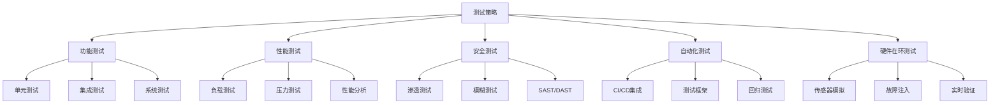

# 高级测试策略

- [集成测试](integration-testing.md)
- [系统测试](system-testing.md)
- [单元测试](unit-testing.md)


## 概述

高级测试技术是确保医疗设备软件质量、安全性和可靠性的关键环节。本模块涵盖性能测试、安全测试、自动化测试和硬件在环测试等高级测试方法。

## 为什么需要高级测试？

医疗设备软件的特殊性要求：

- **患者安全**: 软件缺陷可能直接影响患者健康
- **监管合规**: FDA、MDR等法规要求全面的测试验证
- **复杂性**: 涉及硬件交互、实时处理、数据安全等多个维度
- **可靠性**: 需要在各种条件下稳定运行

## 测试策略框架



## 测试级别与覆盖

| 测试类型 | 目标 | 覆盖范围 | IEC 62304级别 |
|---------|------|---------|--------------|
| 单元测试 | 代码正确性 | 函数/类 | A, B, C |
| 集成测试 | 模块交互 | 组件接口 | A, B, C |
| 系统测试 | 整体功能 | 完整系统 | A, B, C |
| 性能测试 | 响应时间/吞吐量 | 关键路径 | B, C |
| 安全测试 | 漏洞识别 | 攻击面 | B, C |
| HIL测试 | 硬件交互 | 设备接口 | B, C |

## 本模块内容

### [性能测试](performance-testing.md)
学习如何评估和优化医疗设备软件的性能表现，包括负载测试、压力测试和实时性能分析。

### [安全测试](security-testing.md)
掌握识别和修复安全漏洞的方法，包括渗透测试、模糊测试和静态/动态安全分析。

### [测试自动化](test-automation.md)
构建高效的自动化测试体系，实现CI/CD集成和回归测试自动化。

### [硬件在环测试](hil-testing.md)
了解如何搭建HIL测试平台，模拟真实硬件环境进行测试验证。

## 测试工具生态

### 性能测试工具
- **JMeter**: 负载和性能测试
- **Gatling**: 高性能负载测试
- **Valgrind**: 内存泄漏检测
- **perf**: Linux性能分析

### 安全测试工具
- **OWASP ZAP**: Web应用安全扫描
- **Burp Suite**: 渗透测试平台
- **AFL**: 模糊测试工具
- **SonarQube**: 静态代码分析

### 自动化测试框架
- **pytest**: Python测试框架
- **JUnit**: Java测试框架
- **Selenium**: Web UI自动化
- **Robot Framework**: 关键字驱动测试

### HIL测试平台
- **dSPACE**: 实时仿真平台
- **NI LabVIEW**: 数据采集和控制
- **MATLAB/Simulink**: 模型在环测试

## 测试最佳实践

### 1. 测试金字塔原则

```
        /\
       /  \  E2E测试 (10%)
      /____\
     /      \
    / 集成测试 \ (20%)
   /___________\
  /             \
 /   单元测试    \ (70%)
/_________________\
```

- **70%单元测试**: 快速、稳定、易维护
- **20%集成测试**: 验证模块交互
- **10%端到端测试**: 验证用户场景

### 2. 左移测试（Shift-Left Testing）

尽早发现缺陷，降低修复成本：

- 需求阶段：需求评审和可测试性分析
- 设计阶段：设计评审和测试用例设计
- 编码阶段：单元测试和代码审查
- 集成阶段：持续集成和自动化测试

### 3. 风险驱动测试

根据风险等级分配测试资源：

| 风险等级 | 测试强度 | 覆盖率要求 |
|---------|---------|-----------|
| 高风险 | 全面测试 | >95% |
| 中风险 | 重点测试 | >80% |
| 低风险 | 基础测试 | >60% |

### 4. 可追溯性

建立需求-测试-缺陷的完整追溯链：

```
需求 → 测试用例 → 测试执行 → 缺陷报告 → 修复验证
```

## 监管要求

### IEC 62304要求

- **5.5节**: 软件单元实现和验证
- **5.6节**: 软件集成和集成测试
- **5.7节**: 软件系统测试

### FDA指南

- **软件验证和确认**: 需要全面的测试文档
- **网络安全**: 需要安全测试和漏洞评估
- **性能测试**: 关键性能指标的验证

### ISO 13485

- **7.3.6**: 设计和开发验证
- **7.3.7**: 设计和开发确认

## 测试文档模板

### 测试计划
- 测试范围和目标
- 测试策略和方法
- 资源和进度安排
- 风险和缓解措施

### 测试用例
- 用例ID和描述
- 前置条件
- 测试步骤
- 预期结果
- 实际结果

### 测试报告
- 测试执行摘要
- 缺陷统计和分析
- 覆盖率报告
- 风险评估

## 持续改进

### 测试度量指标

- **缺陷密度**: 缺陷数/KLOC
- **测试覆盖率**: 代码覆盖率、需求覆盖率
- **缺陷逃逸率**: 生产环境发现的缺陷比例
- **测试效率**: 发现缺陷数/测试工时

### 回顾和优化

定期进行测试回顾：

1. 分析测试有效性
2. 识别测试盲点
3. 优化测试策略
4. 更新测试工具和流程

## 相关资源


- [需求工程](../requirements-engineering/index.md)
- [架构设计](../architecture-design/index.md)
- [配置管理](../configuration-management/index.md)- [软件工程概述](../index.md)

## 下一步

选择您感兴趣的测试主题深入学习：

1. [性能测试](performance-testing.md) - 评估系统性能
2. [安全测试](security-testing.md) - 识别安全漏洞
3. [测试自动化](test-automation.md) - 构建自动化体系
4. [硬件在环测试](hil-testing.md) - 硬件集成验证
