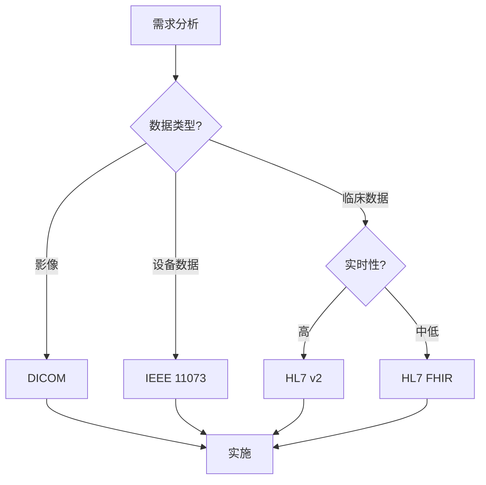

# 医疗设备互联互通

## 概述

医疗设备互联互通（Interoperability）是指不同医疗系统、设备和应用之间无缝交换、解释和使用数据的能力。在现代医疗环境中，互联互通对于提高护理质量、减少错误和优化工作流程至关重要。

## 为什么互联互通重要？

### 临床价值

- **完整的患者视图**: 整合来自多个设备和系统的数据
- **减少人工错误**: 自动数据传输，避免手工抄录
- **提高效率**: 简化工作流程，减少重复输入
- **更好的决策**: 实时访问综合医疗数据
- **连续护理**: 跨机构和环境的数据共享

### 业务价值

- **降低成本**: 减少重复检查和管理开销
- **提高患者满意度**: 更快的服务和更好的体验
- **监管合规**: 满足数据共享和报告要求
- **市场竞争力**: 与现有系统集成的能力

## 互联互通层次

### 1. 技术互联互通（Technical Interoperability）

```
定义: 系统间建立通信连接的能力
示例: TCP/IP、HTTP、蓝牙连接
关注点: 网络协议、数据传输
```

### 2. 语法互联互通（Syntactic Interoperability）

```
定义: 使用标准数据格式交换信息的能力
示例: HL7 v2消息、XML、JSON
关注点: 数据结构、编码格式
```

### 3. 语义互联互通（Semantic Interoperability）

```
定义: 理解交换数据含义的能力
示例: SNOMED CT、LOINC术语
关注点: 数据含义、术语标准
```

### 4. 组织互联互通（Organizational Interoperability）

```
定义: 跨组织边界协调流程的能力
示例: 转诊流程、数据共享协议
关注点: 政策、工作流程、治理
```

## 主要互联互通标准

### 标准对比

| 标准 | 领域 | 数据类型 | 传输方式 | 复杂度 |
|------|------|---------|---------|--------|
| **HL7 FHIR** | 综合医疗 | 临床、管理 | RESTful API | 中 |
| **HL7 v2** | 综合医疗 | 临床、管理 | 消息传递 | 高 |
| **DICOM** | 医学影像 | 影像、报告 | 文件/网络 | 高 |
| **IEEE 11073** | 个人健康设备 | 生命体征 | 点对点 | 中 |
| **IHE** | 集成配置文件 | 多种 | 多种 | 高 |

### 选择标准的决策因素



## 本章节内容

- [HL7 FHIR](hl7-fhir.md) - 现代医疗数据交换标准
- [DICOM](dicom.md) - 医学影像通信标准
- [IEEE 11073](ieee-11073.md) - 个人健康设备通信标准

## 互联互通架构模式

### 1. 点对点集成

```
特点:
- 直接连接两个系统
- 简单快速
- 难以扩展

适用场景:
- 小规模部署
- 特定设备集成
- 概念验证

示例:
[监护仪] <---> [电子病历系统]
```

### 2. 集成引擎（Integration Engine）

```
特点:
- 中央消息路由
- 协议转换
- 易于管理

适用场景:
- 医院信息系统
- 多系统集成
- 复杂路由需求

示例:
[设备A] \
[设备B] --> [集成引擎] --> [HIS]
[设备C] /                    [EMR]
```

### 3. API网关

```
特点:
- RESTful API
- 微服务架构
- 云原生

适用场景:
- 现代应用
- 移动健康
- 云平台

示例:
[移动应用] \
[Web应用]  --> [API网关] --> [FHIR服务器]
[IoT设备]  /                 [数据湖]
```

### 4. 事件驱动架构

```
特点:
- 异步通信
- 松耦合
- 高可扩展性

适用场景:
- 实时监控
- 大规模IoT
- 复杂事件处理

示例:
[传感器] --> [消息队列] --> [事件处理器] --> [存储]
                                          --> [通知]
                                          --> [分析]
```

## 实际集成示例

### 案例1: 监护仪到EMR

```
场景: 床旁监护仪自动上传生命体征到电子病历

架构:
1. 监护仪 --> IEEE 11073 --> 网关
2. 网关 --> HL7 v2 ORU消息 --> 集成引擎
3. 集成引擎 --> HL7 FHIR Observation --> EMR

数据流:
- 心率: 75 bpm
- 血压: 120/80 mmHg
- 血氧: 98%

转换:
IEEE 11073 → HL7 v2 → FHIR Observation
```

### 案例2: PACS到云存储

```
场景: 医学影像自动归档到云端

架构:
1. CT扫描仪 --> DICOM --> PACS
2. PACS --> DICOM C-STORE --> 云网关
3. 云网关 --> 对象存储 (S3)

数据流:
- DICOM文件（100MB）
- 元数据提取
- 缩略图生成
- 加密存储
```

### 案例3: 可穿戴设备到健康平台

```
场景: 智能手表上传健康数据到个人健康记录

架构:
1. 智能手表 --> BLE --> 手机应用
2. 手机应用 --> HTTPS/FHIR --> 健康平台
3. 健康平台 --> FHIR API --> 第三方应用

数据流:
- 步数、心率、睡眠
- FHIR Observation资源
- OAuth 2.0授权
```

## 数据映射与转换

### 术语映射

```c
// 不同标准间的术语映射
typedef struct {
    const char *source_system;
    const char *source_code;
    const char *target_system;
    const char *target_code;
    const char *display_name;
} terminology_mapping_t;

// 示例：LOINC到SNOMED CT映射
terminology_mapping_t mappings[] = {
    // 心率
    {"LOINC", "8867-4", "SNOMED", "364075005", "Heart rate"},
    
    // 收缩压
    {"LOINC", "8480-6", "SNOMED", "271649006", "Systolic blood pressure"},
    
    // 舒张压
    {"LOINC", "8462-4", "SNOMED", "271650006", "Diastolic blood pressure"},
    
    // 体温
    {"LOINC", "8310-5", "SNOMED", "386725007", "Body temperature"}
};

// 查找映射
const char* map_terminology(const char *source_system,
                           const char *source_code,
                           const char *target_system) {
    for (int i = 0; i < sizeof(mappings) / sizeof(mappings[0]); i++) {
        if (strcmp(mappings[i].source_system, source_system) == 0 &&
            strcmp(mappings[i].source_code, source_code) == 0 &&
            strcmp(mappings[i].target_system, target_system) == 0) {
            return mappings[i].target_code;
        }
    }
    return NULL;
}
```

### 单位转换

```c
// 单位转换
typedef struct {
    const char *from_unit;
    const char *to_unit;
    double factor;
    double offset;
} unit_conversion_t;

unit_conversion_t conversions[] = {
    // 温度
    {"Cel", "degF", 1.8, 32.0},      // 摄氏到华氏
    {"degF", "Cel", 0.5556, -17.78}, // 华氏到摄氏
    
    // 压力
    {"kPa", "mmHg", 7.50062, 0.0},   // 千帕到毫米汞柱
    {"mmHg", "kPa", 0.133322, 0.0},  // 毫米汞柱到千帕
    
    // 重量
    {"kg", "lb", 2.20462, 0.0},      // 千克到磅
    {"lb", "kg", 0.453592, 0.0}      // 磅到千克
};

double convert_unit(double value, const char *from_unit, const char *to_unit) {
    for (int i = 0; i < sizeof(conversions) / sizeof(conversions[0]); i++) {
        if (strcmp(conversions[i].from_unit, from_unit) == 0 &&
            strcmp(conversions[i].to_unit, to_unit) == 0) {
            return value * conversions[i].factor + conversions[i].offset;
        }
    }
    return value;  // 无转换
}
```

## 测试与验证

### 互联互通测试

```python
# 互联互通测试框架
import unittest
import hl7
import fhir_client

class InteroperabilityTest(unittest.TestCase):
    
    def test_hl7_to_fhir_conversion(self):
        """测试HL7 v2到FHIR的转换"""
        # HL7 v2消息
        hl7_msg = """MSH|^~\&|SendingApp|SendingFac|ReceivingApp|ReceivingFac|20240210120000||ORU^R01|MSG001|P|2.5
PID|1||12345^^^Hospital^MR||Doe^John||19800101|M
OBR|1||ORDER001|^Heart Rate
OBX|1|NM|8867-4^Heart Rate^LN||75|bpm|60-100||||F"""
        
        # 解析HL7
        msg = hl7.parse(hl7_msg)
        
        # 转换为FHIR
        fhir_obs = convert_hl7_to_fhir_observation(msg)
        
        # 验证FHIR资源
        self.assertEqual(fhir_obs['resourceType'], 'Observation')
        self.assertEqual(fhir_obs['code']['coding'][0]['code'], '8867-4')
        self.assertEqual(fhir_obs['valueQuantity']['value'], 75)
        self.assertEqual(fhir_obs['valueQuantity']['unit'], 'bpm')
    
    def test_terminology_mapping(self):
        """测试术语映射"""
        # LOINC到SNOMED映射
        loinc_code = "8867-4"
        snomed_code = map_loinc_to_snomed(loinc_code)
        
        self.assertEqual(snomed_code, "364075005")
    
    def test_unit_conversion(self):
        """测试单位转换"""
        # 摄氏到华氏
        celsius = 37.0
        fahrenheit = convert_temperature(celsius, "Cel", "degF")
        
        self.assertAlmostEqual(fahrenheit, 98.6, places=1)
```

### Connectathon测试

```
IHE Connectathon:
- 年度互联互通测试活动
- 验证IHE配置文件实现
- 多厂商互操作性测试

测试场景:
1. 患者注册（PDQ, PIX）
2. 文档共享（XDS）
3. 影像共享（XDS-I）
4. 实验室结果（LRI）
```

## 安全与隐私

### 访问控制

```c
// OAuth 2.0访问令牌验证
bool validate_access_token(const char *token, const char *required_scope) {
    // 1. 解析JWT令牌
    jwt_t *jwt;
    jwt_decode(&jwt, token, NULL, 0);
    
    // 2. 验证签名
    if (!verify_jwt_signature(jwt)) {
        return false;
    }
    
    // 3. 检查过期时间
    time_t exp = jwt_get_grant_int(jwt, "exp");
    if (time(NULL) > exp) {
        jwt_free(jwt);
        return false;
    }
    
    // 4. 验证作用域
    const char *scopes = jwt_get_grant(jwt, "scope");
    if (!strstr(scopes, required_scope)) {
        jwt_free(jwt);
        return false;
    }
    
    jwt_free(jwt);
    return true;
}
```

### 审计日志

```c
// DICOM审计消息
void log_dicom_access(const char *user_id, 
                     const char *patient_id,
                     const char *study_uid,
                     const char *action) {
    // 创建DICOM审计消息（RFC 3881）
    audit_message_t msg;
    
    msg.event_id = "110100";  // Application Activity
    msg.event_action = action;  // C-STORE, C-FIND等
    msg.event_outcome = "0";  // Success
    msg.event_time = get_current_time();
    
    msg.user_id = user_id;
    msg.patient_id = patient_id;
    msg.study_instance_uid = study_uid;
    
    // 发送到审计服务器
    send_audit_message(&msg);
}
```

## 最佳实践

### 设计原则

1. ✅ 使用标准而非自定义协议
2. ✅ 实施版本控制和向后兼容
3. ✅ 提供清晰的API文档
4. ✅ 实施错误处理和重试机制
5. ✅ 记录所有数据交换

### 实施建议

1. **从简单开始**: 先实现核心用例
2. **增量开发**: 逐步添加功能
3. **充分测试**: 多场景、多系统测试
4. **监控性能**: 跟踪延迟和吞吐量
5. **持续改进**: 根据反馈优化

## 参考资源

### 标准组织

- [HL7 International](https://www.hl7.org/)
- [DICOM Standards Committee](https://www.dicomstandard.org/)
- [IEEE 11073](https://standards.ieee.org/standard/11073-10101-2019.html)
- [IHE International](https://www.ihe.net/)

### 工具和库

- [HAPI FHIR](https://hapifhir.io/) - Java FHIR库
- [FHIR.js](https://github.com/FHIR/fhir.js) - JavaScript FHIR客户端
- [dcm4che](https://www.dcm4che.org/) - DICOM工具包
- [Mirth Connect](https://www.nextgen.com/products-and-services/integration-engine) - 集成引擎

---

**下一步**: 深入了解 [HL7 FHIR标准](hl7-fhir.md)
