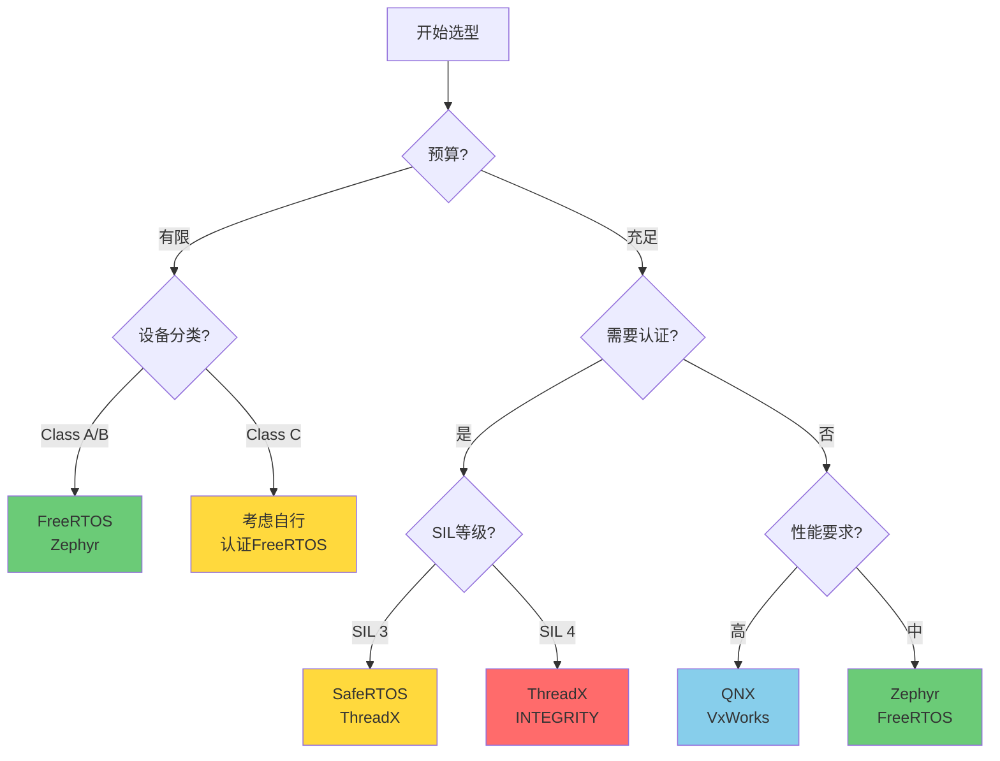

# 多RTOS对比表

## 前置知识

在学习本文档之前，建议你已经掌握：

- RTOS基础概念
- 嵌入式系统开发经验
- C/C++编程基础


## 学习目标

完成本模块后，你将能够：
- 快速对比主流RTOS的技术特性
- 理解不同RTOS的优势和局限
- 根据项目需求选择合适的RTOS
- 评估RTOS的医疗器械适用性

---

## 内容

### 综合对比表

#### 基本信息对比

| RTOS | 开发商 | 许可证 | 首次发布 | 最新版本 | 活跃度 |
|------|--------|--------|---------|---------|--------|
| **FreeRTOS** | Amazon Web Services | MIT | 2003 | 11.0+ | ⭐⭐⭐⭐⭐ |
| **Zephyr** | Linux Foundation | Apache 2.0 | 2016 | 3.5+ | ⭐⭐⭐⭐⭐ |
| **ThreadX** | Microsoft | MIT | 1996 | 6.2+ | ⭐⭐⭐⭐ |
| **SafeRTOS** | WITTENSTEIN | 商业 | 2008 | 11.0+ | ⭐⭐⭐ |
| **RTEMS** | RTEMS Project | BSD | 1988 | 6.0+ | ⭐⭐⭐⭐ |
| **QNX** | BlackBerry | 商业 | 1982 | 7.1+ | ⭐⭐⭐ |
| **VxWorks** | Wind River | 商业 | 1987 | 23.03+ | ⭐⭐⭐ |
| **embOS** | SEGGER | 商业 | 1992 | 5.18+ | ⭐⭐⭐ |

#### 技术特性对比

| 特性 | FreeRTOS | Zephyr | ThreadX | SafeRTOS | RTEMS | QNX |
|------|----------|--------|---------|----------|-------|-----|
| **内核大小** | 4-9 KB | 8-16 KB | 2-5 KB | 5-10 KB | 50+ KB | 100+ KB |
| **最小RAM** | 2 KB | 8 KB | 1 KB | 2 KB | 32 KB | 64 KB |
| **任务切换** | <1 μs | <2 μs | <0.5 μs | <1 μs | <2 μs | <3 μs |
| **最大任务数** | 无限制 | 无限制 | 无限制 | 无限制 | 无限制 | 无限制 |
| **优先级数** | 可配置 | 32 | 32 | 可配置 | 256 | 256 |
| **调度算法** | 抢占式 | 抢占式 | 抢占式 | 抢占式 | 抢占式 | 抢占式 |
| **时间片轮转** | ✅ | ✅ | ✅ | ✅ | ✅ | ✅ |
| **优先级继承** | ✅ | ✅ | ✅ | ✅ | ✅ | ✅ |
| **多核支持** | ❌ | ✅ | ✅ | ❌ | ✅ | ✅ |

#### 硬件支持对比

| 架构 | FreeRTOS | Zephyr | ThreadX | SafeRTOS | RTEMS | QNX |
|------|----------|--------|---------|----------|-------|-----|
| **ARM Cortex-M** | ✅ | ✅ | ✅ | ✅ | ✅ | ✅ |
| **ARM Cortex-A** | ✅ | ✅ | ✅ | ❌ | ✅ | ✅ |
| **RISC-V** | ✅ | ✅ | ✅ | ✅ | ✅ | ✅ |
| **x86/x64** | ✅ | ✅ | ✅ | ❌ | ✅ | ✅ |
| **MIPS** | ✅ | ✅ | ✅ | ❌ | ✅ | ✅ |
| **AVR** | ✅ | ❌ | ❌ | ❌ | ❌ | ❌ |
| **8051** | ✅ | ❌ | ❌ | ❌ | ❌ | ❌ |
| **支持MCU数** | 40+ | 500+ | 30+ | 20+ | 200+ | 100+ |

#### 功能特性对比

| 功能 | FreeRTOS | Zephyr | ThreadX | SafeRTOS | RTEMS | QNX |
|------|----------|--------|---------|----------|-------|-----|
| **任务管理** | ✅ | ✅ | ✅ | ✅ | ✅ | ✅ |
| **信号量** | ✅ | ✅ | ✅ | ✅ | ✅ | ✅ |
| **互斥锁** | ✅ | ✅ | ✅ | ✅ | ✅ | ✅ |
| **消息队列** | ✅ | ✅ | ✅ | ✅ | ✅ | ✅ |
| **事件标志** | ✅ | ✅ | ✅ | ✅ | ✅ | ✅ |
| **软件定时器** | ✅ | ✅ | ✅ | ✅ | ✅ | ✅ |
| **内存池** | ❌ | ✅ | ✅ | ❌ | ✅ | ✅ |
| **文件系统** | 第三方 | ✅ | ✅ | ❌ | ✅ | ✅ |
| **TCP/IP栈** | 第三方 | ✅ | ✅ | ❌ | ✅ | ✅ |
| **USB栈** | 第三方 | ✅ | ✅ | ❌ | ✅ | ✅ |
| **图形界面** | 第三方 | ✅ | ✅ | ❌ | ✅ | ✅ |
| **POSIX API** | ❌ | 部分 | ❌ | ❌ | ✅ | ✅ |

---

### 安全认证对比

#### 认证情况

| RTOS | IEC 61508 | IEC 62304 | ISO 26262 | DO-178C | EN 50128 | Common Criteria |
|------|-----------|-----------|-----------|---------|----------|-----------------|
| **FreeRTOS** | ❌ | ❌ | ❌ | ❌ | ❌ | ❌ |
| **Zephyr** | ❌ | ❌ | ❌ | ❌ | ❌ | ❌ |
| **ThreadX** | SIL 4 | Class C | ASIL D | Level A | SIL 4 | EAL4+ |
| **SafeRTOS** | SIL 3 | 适用 | ASIL D | - | SIL 4 | - |
| **RTEMS** | - | - | - | - | - | - |
| **QNX** | SIL 3 | 适用 | ASIL D | - | - | EAL4+ |
| **VxWorks** | SIL 3 | 适用 | ASIL D | Level A | SIL 4 | EAL6+ |
| **embOS** | SIL 2 | 适用 | ASIL B | - | - | - |

#### 医疗器械适用性

| RTOS | Class A | Class B | Class C | 认证文档 | 技术支持 | 推荐度 |
|------|---------|---------|---------|---------|---------|--------|
| **FreeRTOS** | ✅✅✅ | ✅✅ | ⚠️ | 基础 | 社区 | ⭐⭐⭐⭐ |
| **Zephyr** | ✅✅✅ | ✅✅ | ⚠️ | 基础 | 社区 | ⭐⭐⭐⭐ |
| **ThreadX** | ✅✅✅ | ✅✅✅ | ✅✅✅ | 完整 | 商业 | ⭐⭐⭐⭐⭐ |
| **SafeRTOS** | ✅✅✅ | ✅✅✅ | ✅✅✅ | 完整 | 商业 | ⭐⭐⭐⭐⭐ |
| **RTEMS** | ✅✅ | ✅✅ | ⚠️ | 中等 | 社区 | ⭐⭐⭐ |
| **QNX** | ✅✅✅ | ✅✅✅ | ✅✅✅ | 完整 | 商业 | ⭐⭐⭐⭐ |
| **VxWorks** | ✅✅✅ | ✅✅✅ | ✅✅✅ | 完整 | 商业 | ⭐⭐⭐⭐ |
| **embOS** | ✅✅✅ | ✅✅ | ✅ | 中等 | 商业 | ⭐⭐⭐ |

---

### 开发工具对比

#### IDE支持

| RTOS | Keil MDK | IAR EWARM | STM32CubeIDE | Eclipse | VS Code | 专用IDE |
|------|----------|-----------|--------------|---------|---------|---------|
| **FreeRTOS** | ✅ | ✅ | ✅ | ✅ | ✅ | ❌ |
| **Zephyr** | ❌ | ❌ | ❌ | ✅ | ✅ | ❌ |
| **ThreadX** | ✅ | ✅ | ✅ | ✅ | ✅ | ❌ |
| **SafeRTOS** | ✅ | ✅ | ❌ | ✅ | ❌ | ❌ |
| **RTEMS** | ❌ | ❌ | ❌ | ✅ | ✅ | ❌ |
| **QNX** | ❌ | ❌ | ❌ | ✅ | ❌ | ✅ QNX Momentics |
| **VxWorks** | ❌ | ❌ | ❌ | ✅ | ❌ | ✅ Wind River Workbench |
| **embOS** | ✅ | ✅ | ✅ | ✅ | ❌ | ✅ embOS View |

#### 调试和分析工具

| RTOS | 跟踪工具 | 性能分析 | 栈分析 | 内存分析 | 覆盖率分析 |
|------|---------|---------|--------|---------|-----------|
| **FreeRTOS** | Tracealyzer | SystemView | ✅ | ✅ | 第三方 |
| **Zephyr** | SystemView | 内置 | ✅ | ✅ | 第三方 |
| **ThreadX** | TraceX | ✅ | ✅ | ✅ | 第三方 |
| **SafeRTOS** | Tracealyzer | SystemView | ✅ | ✅ | 商业工具 |
| **RTEMS** | 内置 | 内置 | ✅ | ✅ | 第三方 |
| **QNX** | System Profiler | ✅ | ✅ | ✅ | ✅ |
| **VxWorks** | System Viewer | ✅ | ✅ | ✅ | ✅ |
| **embOS** | embOS View | ✅ | ✅ | ✅ | 第三方 |

---

### 生态系统对比

#### 中间件和协议栈

| 组件 | FreeRTOS | Zephyr | ThreadX | SafeRTOS | RTEMS | QNX |
|------|----------|--------|---------|----------|-------|-----|
| **TCP/IP** | FreeRTOS+TCP | 内置 | NetX Duo | ❌ | 内置 | 内置 |
| **TLS/SSL** | mbedTLS | 内置 | NetX Secure | ❌ | 内置 | 内置 |
| **USB** | 第三方 | 内置 | USBX | ❌ | 内置 | 内置 |
| **BLE** | 第三方 | 内置 | ❌ | ❌ | 第三方 | 第三方 |
| **WiFi** | 第三方 | 内置 | ❌ | ❌ | 第三方 | 内置 |
| **文件系统** | FreeRTOS+FAT | 内置 | FileX | ❌ | 内置 | 内置 |
| **图形界面** | 第三方 | LVGL | GUIX | ❌ | 第三方 | 内置 |
| **OTA更新** | FreeRTOS OTA | 内置 | ❌ | ❌ | ❌ | 内置 |

#### 云服务集成

| RTOS | AWS IoT | Azure IoT | Google Cloud | 其他云服务 |
|------|---------|-----------|--------------|-----------|
| **FreeRTOS** | ✅✅✅ | ✅ | ✅ | ✅ |
| **Zephyr** | ✅ | ✅ | ✅ | ✅ |
| **ThreadX** | ✅ | ✅✅✅ | ✅ | ✅ |
| **SafeRTOS** | ❌ | ❌ | ❌ | ❌ |
| **RTEMS** | ❌ | ❌ | ❌ | ❌ |
| **QNX** | ✅ | ✅ | ✅ | ✅ |

---

### 性能对比

#### 实时性能（ARM Cortex-M4 @ 168MHz）

| 指标 | FreeRTOS | Zephyr | ThreadX | SafeRTOS | embOS |
|------|----------|--------|---------|----------|-------|
| **任务切换时间** | 0.8 μs | 1.5 μs | 0.4 μs | 0.9 μs | 0.6 μs |
| **中断延迟** | 0.3 μs | 0.5 μs | 0.2 μs | 0.3 μs | 0.2 μs |
| **信号量操作** | 0.5 μs | 0.8 μs | 0.3 μs | 0.6 μs | 0.4 μs |
| **消息队列发送** | 1.2 μs | 1.8 μs | 0.8 μs | 1.3 μs | 1.0 μs |
| **内存分配** | 2.5 μs | 3.0 μs | 1.5 μs | 2.6 μs | 2.0 μs |

*注：实际性能取决于具体配置和编译器优化*

#### 内存占用（典型配置）

| RTOS | ROM (KB) | RAM (KB) | 最小配置ROM | 最小配置RAM |
|------|----------|----------|------------|------------|
| **FreeRTOS** | 6-8 | 2-4 | 4 | 1 |
| **Zephyr** | 12-20 | 8-16 | 8 | 4 |
| **ThreadX** | 3-6 | 1-3 | 2 | 0.5 |
| **SafeRTOS** | 7-10 | 2-4 | 5 | 1 |
| **RTEMS** | 60-100 | 32-64 | 50 | 16 |
| **QNX** | 150-300 | 64-128 | 100 | 32 |
| **embOS** | 4-7 | 1-3 | 3 | 0.8 |

---

### 成本对比

#### 许可费用

| RTOS | 许可模式 | 开发许可 | 生产许可 | 年度支持 | 培训费用 |
|------|---------|---------|---------|---------|---------|
| **FreeRTOS** | MIT | 免费 | 免费 | 可选 | 社区/商业 |
| **Zephyr** | Apache 2.0 | 免费 | 免费 | 可选 | 社区/商业 |
| **ThreadX** | MIT | 免费 | 免费 | 可选 | 商业 |
| **SafeRTOS** | 商业 | $15K-$50K | 包含 | 15-20% | $2K-$5K/人 |
| **RTEMS** | BSD | 免费 | 免费 | 可选 | 社区/商业 |
| **QNX** | 商业 | $50K-$200K | 按设备 | 15-20% | $3K-$8K/人 |
| **VxWorks** | 商业 | $100K+ | 按设备 | 15-20% | $5K-$10K/人 |
| **embOS** | 商业 | $3K-$10K | 包含 | 15-20% | $1K-$3K/人 |

#### 总拥有成本（5年项目）

| RTOS | 许可费 | 支持费 | 培训费 | 工具费 | 总计 | 适用项目 |
|------|--------|--------|--------|--------|------|---------|
| **FreeRTOS** | $0 | $0-$10K | $5K | $5K | $10K-$20K | 预算有限 |
| **Zephyr** | $0 | $0-$15K | $8K | $5K | $13K-$28K | 现代化项目 |
| **ThreadX** | $0 | $0-$20K | $10K | $5K | $15K-$35K | Azure集成 |
| **SafeRTOS** | $30K | $30K | $10K | $10K | $80K | Class B/C |
| **QNX** | $100K | $100K | $20K | $20K | $240K | 高性能 |
| **VxWorks** | $150K | $150K | $30K | $30K | $360K | 关键任务 |
| **embOS** | $5K | $5K | $5K | $5K | $20K | 商业支持 |

---

### 社区和支持对比

#### 社区活跃度

| RTOS | GitHub Stars | 贡献者 | 论坛活跃度 | 文档质量 | 示例代码 |
|------|-------------|--------|-----------|---------|---------|
| **FreeRTOS** | 4.5K+ | 200+ | ⭐⭐⭐⭐⭐ | ⭐⭐⭐⭐ | ⭐⭐⭐⭐⭐ |
| **Zephyr** | 9K+ | 1000+ | ⭐⭐⭐⭐⭐ | ⭐⭐⭐⭐⭐ | ⭐⭐⭐⭐⭐ |
| **ThreadX** | 2.5K+ | 100+ | ⭐⭐⭐⭐ | ⭐⭐⭐⭐ | ⭐⭐⭐⭐ |
| **SafeRTOS** | N/A | N/A | ⭐⭐ | ⭐⭐⭐⭐⭐ | ⭐⭐⭐ |
| **RTEMS** | 500+ | 100+ | ⭐⭐⭐ | ⭐⭐⭐⭐ | ⭐⭐⭐ |
| **QNX** | N/A | N/A | ⭐⭐ | ⭐⭐⭐⭐ | ⭐⭐⭐ |

#### 学习资源

| RTOS | 官方文档 | 书籍 | 在线课程 | 视频教程 | 博客文章 |
|------|---------|------|---------|---------|---------|
| **FreeRTOS** | ⭐⭐⭐⭐ | ⭐⭐⭐⭐⭐ | ⭐⭐⭐⭐⭐ | ⭐⭐⭐⭐⭐ | ⭐⭐⭐⭐⭐ |
| **Zephyr** | ⭐⭐⭐⭐⭐ | ⭐⭐⭐ | ⭐⭐⭐⭐ | ⭐⭐⭐⭐ | ⭐⭐⭐⭐ |
| **ThreadX** | ⭐⭐⭐⭐ | ⭐⭐⭐ | ⭐⭐⭐ | ⭐⭐⭐ | ⭐⭐⭐ |
| **SafeRTOS** | ⭐⭐⭐⭐⭐ | ⭐⭐ | ⭐⭐ | ⭐⭐ | ⭐⭐ |
| **RTEMS** | ⭐⭐⭐⭐ | ⭐⭐ | ⭐⭐ | ⭐⭐ | ⭐⭐⭐ |
| **QNX** | ⭐⭐⭐⭐ | ⭐⭐⭐ | ⭐⭐ | ⭐⭐ | ⭐⭐ |

---

### 应用场景推荐

#### 按设备类型推荐

| 设备类型 | 首选RTOS | 备选RTOS | 理由 |
|---------|---------|---------|------|
| **便携式监护仪** | FreeRTOS | Zephyr | 资源受限，需要低功耗 |
| **输液泵** | ThreadX | SafeRTOS | Class C，需要认证 |
| **呼吸机** | ThreadX | SafeRTOS | 生命支持，最高安全等级 |
| **血糖仪** | FreeRTOS | embOS | 简单应用，成本敏感 |
| **远程监护系统** | Zephyr | FreeRTOS | 需要网络功能 |
| **手术机器人** | QNX | VxWorks | 高性能，实时性要求高 |
| **医学影像设备** | QNX | Linux | 高性能，复杂处理 |
| **体外诊断设备** | FreeRTOS | Zephyr | 中等复杂度 |

#### 按项目特征推荐

| 项目特征 | 推荐RTOS | 理由 |
|---------|---------|------|
| **快速原型** | FreeRTOS | 丰富示例，快速上手 |
| **预算有限** | FreeRTOS, Zephyr | 免费开源 |
| **需要认证** | ThreadX, SafeRTOS | 预认证，简化流程 |
| **联网设备** | Zephyr, FreeRTOS | 丰富的网络协议栈 |
| **多核处理器** | Zephyr, QNX | 良好的SMP支持 |
| **长期维护** | Zephyr, ThreadX | 活跃维护，长期支持 |
| **资源极度受限** | ThreadX, embOS | 最小内存占用 |
| **高性能要求** | QNX, VxWorks | 优秀的实时性能 |
| **POSIX兼容** | RTEMS, QNX | 完整的POSIX支持 |
| **云集成** | FreeRTOS, ThreadX | AWS/Azure原生支持 |

---

### 详细特性对比

#### 任务管理

| 特性 | FreeRTOS | Zephyr | ThreadX | SafeRTOS | RTEMS | QNX |
|------|----------|--------|---------|----------|-------|-----|
| **动态任务创建** | ✅ | ✅ | ✅ | ✅ | ✅ | ✅ |
| **静态任务创建** | ✅ | ✅ | ✅ | ✅ | ✅ | ✅ |
| **任务删除** | ✅ | ✅ | ✅ | ✅ | ✅ | ✅ |
| **任务挂起/恢复** | ✅ | ✅ | ✅ | ✅ | ✅ | ✅ |
| **任务通知** | ✅ | ✅ | ❌ | ✅ | ❌ | ✅ |
| **协程支持** | ✅ | ✅ | ❌ | ❌ | ❌ | ❌ |
| **任务本地存储** | ✅ | ✅ | ✅ | ✅ | ✅ | ✅ |
| **CPU亲和性** | ❌ | ✅ | ✅ | ❌ | ✅ | ✅ |

#### 同步机制

| 特性 | FreeRTOS | Zephyr | ThreadX | SafeRTOS | RTEMS | QNX |
|------|----------|--------|---------|----------|-------|-----|
| **二值信号量** | ✅ | ✅ | ✅ | ✅ | ✅ | ✅ |
| **计数信号量** | ✅ | ✅ | ✅ | ✅ | ✅ | ✅ |
| **互斥锁** | ✅ | ✅ | ✅ | ✅ | ✅ | ✅ |
| **递归互斥锁** | ✅ | ✅ | ✅ | ✅ | ✅ | ✅ |
| **优先级继承** | ✅ | ✅ | ✅ | ✅ | ✅ | ✅ |
| **优先级天花板** | ❌ | ✅ | ❌ | ❌ | ✅ | ✅ |
| **事件标志** | ✅ | ✅ | ✅ | ✅ | ✅ | ✅ |
| **条件变量** | ❌ | ✅ | ❌ | ❌ | ✅ | ✅ |
| **读写锁** | ❌ | ✅ | ❌ | ❌ | ✅ | ✅ |

#### 通信机制

| 特性 | FreeRTOS | Zephyr | ThreadX | SafeRTOS | RTEMS | QNX |
|------|----------|--------|---------|----------|-------|-----|
| **消息队列** | ✅ | ✅ | ✅ | ✅ | ✅ | ✅ |
| **邮箱** | ❌ | ✅ | ❌ | ❌ | ✅ | ✅ |
| **管道** | ❌ | ✅ | ❌ | ❌ | ✅ | ✅ |
| **消息传递** | ❌ | ❌ | ❌ | ❌ | ❌ | ✅ |
| **共享内存** | ❌ | ❌ | ❌ | ❌ | ✅ | ✅ |
| **流缓冲区** | ✅ | ✅ | ❌ | ✅ | ❌ | ❌ |
| **零拷贝队列** | ❌ | ✅ | ❌ | ❌ | ❌ | ✅ |

#### 内存管理

| 特性 | FreeRTOS | Zephyr | ThreadX | SafeRTOS | RTEMS | QNX |
|------|----------|--------|---------|----------|-------|-----|
| **动态分配** | ✅ | ✅ | ✅ | ✅ | ✅ | ✅ |
| **静态分配** | ✅ | ✅ | ✅ | ✅ | ✅ | ✅ |
| **内存池** | ❌ | ✅ | ✅ | ❌ | ✅ | ✅ |
| **内存保护** | ❌ | ✅ | ✅ | ❌ | ✅ | ✅ |
| **MMU支持** | ❌ | ✅ | ✅ | ❌ | ✅ | ✅ |
| **MPU支持** | ✅ | ✅ | ✅ | ✅ | ✅ | ✅ |
| **碎片整理** | ❌ | ❌ | ❌ | ❌ | ❌ | ✅ |

#### 定时器和时间管理

| 特性 | FreeRTOS | Zephyr | ThreadX | SafeRTOS | RTEMS | QNX |
|------|----------|--------|---------|----------|-------|-----|
| **软件定时器** | ✅ | ✅ | ✅ | ✅ | ✅ | ✅ |
| **单次定时器** | ✅ | ✅ | ✅ | ✅ | ✅ | ✅ |
| **周期定时器** | ✅ | ✅ | ✅ | ✅ | ✅ | ✅ |
| **高精度定时器** | ❌ | ✅ | ❌ | ❌ | ✅ | ✅ |
| **RTC支持** | 第三方 | ✅ | ❌ | ❌ | ✅ | ✅ |
| **时间同步** | ❌ | ✅ | ❌ | ❌ | ✅ | ✅ |

---

### 代码示例对比

#### 任务创建

**FreeRTOS**:
```c
#include "FreeRTOS.h"
#include "task.h"

void vTaskFunction(void *pvParameters) {
    for(;;) {
        // 任务代码
        vTaskDelay(pdMS_TO_TICKS(100));
    }
}

int main(void) {
    xTaskCreate(vTaskFunction, "Task", 256, NULL, 1, NULL);
    vTaskStartScheduler();
    return 0;
}
```

**Zephyr**:
```c
#include <zephyr/kernel.h>

#define STACK_SIZE 1024
K_THREAD_STACK_DEFINE(task_stack, STACK_SIZE);
struct k_thread task_thread;

void task_function(void *p1, void *p2, void *p3) {
    while(1) {
        // 任务代码
        k_msleep(100);
    }
}

int main(void) {
    k_thread_create(&task_thread, task_stack,
                    K_THREAD_STACK_SIZEOF(task_stack),
                    task_function, NULL, NULL, NULL,
                    5, 0, K_NO_WAIT);
    return 0;
}
```

**ThreadX**:
```c
#include "tx_api.h"

#define STACK_SIZE 1024
TX_THREAD task_thread;
UCHAR task_stack[STACK_SIZE];

void task_entry(ULONG thread_input) {
    while(1) {
        // 任务代码
        tx_thread_sleep(10); // 10 ticks
    }
}

int main(void) {
    tx_kernel_enter();
}

void tx_application_define(void *first_unused_memory) {
    tx_thread_create(&task_thread, "Task",
                     task_entry, 0,
                     task_stack, STACK_SIZE,
                     5, 5, TX_NO_TIME_SLICE, TX_AUTO_START);
}
```

#### 信号量使用

**FreeRTOS**:
```c
SemaphoreHandle_t xSemaphore = xSemaphoreCreateBinary();

// 释放信号量
xSemaphoreGive(xSemaphore);

// 获取信号量
if(xSemaphoreTake(xSemaphore, portMAX_DELAY) == pdTRUE) {
    // 成功获取
}
```

**Zephyr**:
```c
K_SEM_DEFINE(my_sem, 0, 1);

// 释放信号量
k_sem_give(&my_sem);

// 获取信号量
if(k_sem_take(&my_sem, K_FOREVER) == 0) {
    // 成功获取
}
```

**ThreadX**:
```c
TX_SEMAPHORE my_semaphore;
tx_semaphore_create(&my_semaphore, "Semaphore", 0);

// 释放信号量
tx_semaphore_put(&my_semaphore);

// 获取信号量
if(tx_semaphore_get(&my_semaphore, TX_WAIT_FOREVER) == TX_SUCCESS) {
    // 成功获取
}
```

---

### 迁移难度对比

#### 从FreeRTOS迁移到其他RTOS

| 目标RTOS | 难度 | API相似度 | 概念差异 | 估算时间 | 主要挑战 |
|---------|------|----------|---------|---------|---------|
| **Zephyr** | 中 | 60% | 中 | 2-4周 | 设备树配置 |
| **ThreadX** | 低 | 70% | 小 | 1-2周 | API命名差异 |
| **SafeRTOS** | 很低 | 95% | 很小 | 1周 | 错误处理增强 |
| **RTEMS** | 高 | 40% | 大 | 4-8周 | POSIX API |
| **QNX** | 很高 | 30% | 很大 | 8-12周 | 微内核架构 |

#### API映射表（FreeRTOS → 其他RTOS）

| FreeRTOS | Zephyr | ThreadX | SafeRTOS |
|----------|--------|---------|----------|
| `xTaskCreate` | `k_thread_create` | `tx_thread_create` | `xTaskCreate` |
| `vTaskDelay` | `k_msleep` | `tx_thread_sleep` | `vTaskDelay` |
| `xSemaphoreGive` | `k_sem_give` | `tx_semaphore_put` | `xSemaphoreGive` |
| `xSemaphoreTake` | `k_sem_take` | `tx_semaphore_get` | `xSemaphoreTake` |
| `xQueueSend` | `k_msgq_put` | `tx_queue_send` | `xQueueSend` |
| `xQueueReceive` | `k_msgq_get` | `tx_queue_receive` | `xQueueReceive` |

---

### 选型决策工具

#### 快速选型流程图



#### 评分卡（满分10分）

| 评估维度 | FreeRTOS | Zephyr | ThreadX | SafeRTOS | QNX |
|---------|----------|--------|---------|----------|-----|
| **易用性** | 9 | 7 | 8 | 9 | 6 |
| **文档质量** | 8 | 9 | 8 | 9 | 8 |
| **社区支持** | 10 | 10 | 7 | 5 | 5 |
| **硬件支持** | 10 | 10 | 9 | 8 | 7 |
| **实时性能** | 8 | 7 | 9 | 8 | 9 |
| **内存效率** | 9 | 7 | 10 | 9 | 5 |
| **功能丰富度** | 6 | 9 | 8 | 5 | 10 |
| **安全认证** | 2 | 2 | 10 | 10 | 8 |
| **成本** | 10 | 10 | 10 | 5 | 3 |
| **长期支持** | 9 | 10 | 9 | 8 | 9 |
| **总分** | 81 | 81 | 88 | 76 | 70 |

---

## 实践练习

1. **对比分析**：
   - 选择3个候选RTOS
   - 使用本文档的对比表进行评估
   - 编写对比报告

2. **性能测试**：
   - 在同一硬件平台上测试不同RTOS
   - 对比任务切换时间、内存占用
   - 分析性能差异原因

3. **成本分析**：
   - 计算不同RTOS的5年总拥有成本
   - 考虑许可费、支持费、培训费
   - 制定预算建议

4. **迁移评估**：
   - 评估现有项目迁移到新RTOS的难度
   - 估算迁移时间和成本
   - 制定迁移计划

---

## 相关知识模块

### 深入学习

- [RTOS选型指南](rtos-selection-guide.md) - 系统的选型方法
- [RTOS安全认证](rtos-safety-certification.md) - 认证RTOS详解
- [RTOS性能调优](rtos-performance-tuning.md) - 性能优化技术

### 相关主题

- [任务调度](task-scheduling.md) - RTOS调度机制
- [同步机制](synchronization.md) - 任务同步方法
- [中断处理](interrupt-handling.md) - 中断管理

---

## 参考文献

1. "FreeRTOS Reference Manual" - Real Time Engineers Ltd.
2. "Zephyr Project Documentation" - Linux Foundation
3. "Azure RTOS ThreadX User Guide" - Microsoft
4. "SafeRTOS User Manual" - WITTENSTEIN High Integrity Systems
5. "RTEMS User Manual" - RTEMS Project
6. "QNX Neutrino RTOS System Architecture" - BlackBerry
7. "Real-Time Operating Systems: A Comparison" - Various Authors

---

## 总结

本对比表提供了主流RTOS的全面对比，帮助你快速了解各RTOS的特点：

**开源免费RTOS**：
- **FreeRTOS**：最流行，易用，资源丰富
- **Zephyr**：现代化，功能丰富，活跃维护

**认证RTOS**：
- **ThreadX**：SIL 4认证，免费许可
- **SafeRTOS**：SIL 3认证，基于FreeRTOS

**商业高端RTOS**：
- **QNX**：高性能，微内核架构
- **VxWorks**：关键任务，广泛认证

**选型建议**：
- Class A/B设备 → FreeRTOS或Zephyr
- Class C设备 → ThreadX或SafeRTOS
- 高性能需求 → QNX或VxWorks
- 预算有限 → FreeRTOS或Zephyr

记住：没有完美的RTOS，只有最适合你项目的RTOS。使用本对比表结合项目需求做出明智选择。
