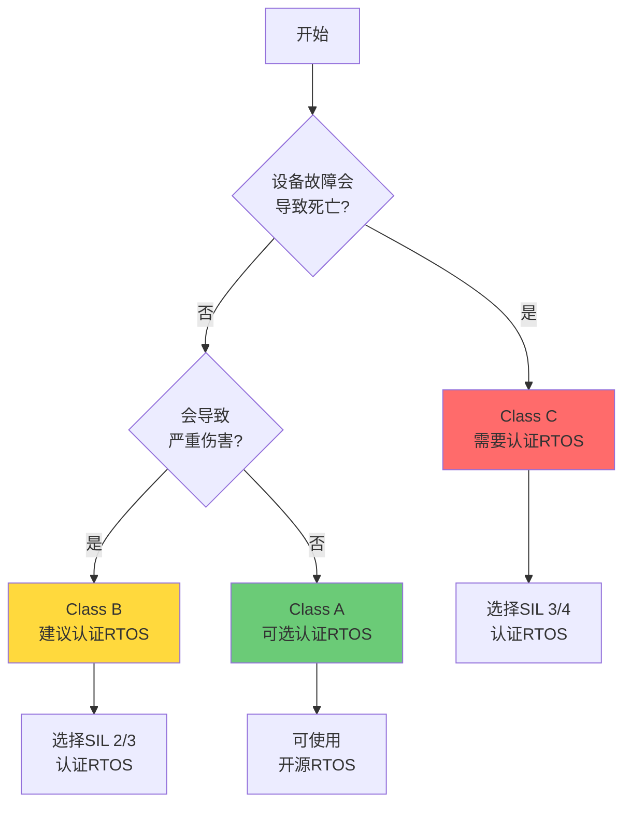
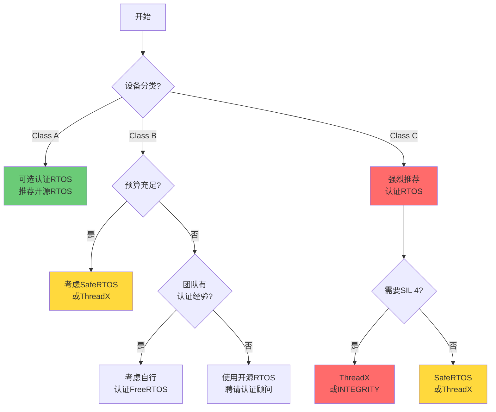

# RTOS安全认证

## 前置知识

在学习本文档之前，建议你已经掌握：

- RTOS基础概念
- 嵌入式系统开发经验
- C/C++编程基础


## 学习目标

完成本模块后，你将能够：
- 理解RTOS安全认证的重要性
- 掌握主要安全标准（IEC 61508、IEC 62304）
- 了解认证RTOS的特点和应用
- 评估RTOS认证对项目的影响

---

## 内容

### 为什么需要认证RTOS？

#### 医疗器械的特殊要求

**生命安全关键**：
- 医疗设备故障可能导致患者伤害或死亡
- RTOS作为基础软件，其可靠性至关重要
- 认证RTOS提供额外的安全保证

**法规要求**：
- IEC 62304要求软件开发过程符合质量标准
- 高安全等级设备（Class C）需要更严格的验证
- 认证RTOS可简化认证流程

**风险管理**：
- 使用认证RTOS降低系统风险
- 减少验证和确认工作量
- 提供完整的追溯性文档

#### 认证RTOS的优势

**技术优势**：
- ✅ 经过严格测试和验证
- ✅ 符合编码标准（MISRA C等）
- ✅ 提供完整的设计文档
- ✅ 已知的性能特性

**法规优势**：
- ✅ 简化IEC 62304认证
- ✅ 减少审核工作量
- ✅ 提供认证证书
- ✅ 降低监管风险

**商业优势**：
- ✅ 缩短上市时间
- ✅ 降低开发成本（长期）
- ✅ 提高产品可信度
- ✅ 专业技术支持

---

### 主要安全标准

#### IEC 61508 - 功能安全

**概述**：
- 电气/电子/可编程电子安全相关系统的功能安全标准
- 定义了安全完整性等级（SIL 1-4）
- 适用于各行业的安全关键系统

**安全完整性等级（SIL）**：

| SIL等级 | 失效概率 | 风险降低 | 应用示例 |
|---------|---------|---------|---------|
| SIL 1 | 10⁻² - 10⁻¹ | 10-100倍 | 非关键医疗设备 |
| SIL 2 | 10⁻³ - 10⁻² | 100-1000倍 | 监护设备 |
| SIL 3 | 10⁻⁴ - 10⁻³ | 1000-10000倍 | 输液泵、呼吸机 |
| SIL 4 | 10⁻⁵ - 10⁻⁴ | 10000-100000倍 | 生命支持设备 |

**RTOS认证要求**：
- 完整的开发文档
- 符合编码标准（MISRA C）
- 全面的测试覆盖
- 独立的安全评估

#### IEC 62304 - 医疗器械软件

**概述**：
- 专门针对医疗器械软件的生命周期标准
- 定义了软件安全分类（A/B/C类）
- 与IEC 61508互补

**软件安全分类**：

| 分类 | 风险等级 | RTOS要求 | 示例设备 |
|-----|---------|---------|---------|
| **Class A** | 无伤害或轻微伤害 | 基础文档 | 体温计 |
| **Class B** | 严重伤害 | 详细文档+验证 | 血压计 |
| **Class C** | 死亡或严重伤害 | 完整文档+认证RTOS | 输液泵、呼吸机 |

**RTOS文档要求**：
```
Class A:
- 基本架构文档
- 接口规范
- 测试报告

Class B:
+ 详细设计文档
+ 单元测试
+ 集成测试
+ 追溯矩阵

Class C:
+ 完整的开发过程文档
+ 认证RTOS（推荐）
+ 独立验证
+ 风险分析
```

---

### 认证RTOS详解

#### SafeRTOS

**概述**：
- FreeRTOS的安全认证版本
- WITTENSTEIN High Integrity Systems开发
- 专为安全关键应用设计

**认证情况**：
- ✅ IEC 61508 SIL 3认证
- ✅ ISO 26262 ASIL D（汽车）
- ✅ EN 50128 SIL 4（铁路）
- ✅ IEC 62304 Class C适用

**技术特点**：

```c
// SafeRTOS API示例
#include "SafeRTOS_API.h"

// 任务创建（带错误检查）
portBASE_TYPE xReturn;
xTaskHandle xTaskHandle;

xReturn = xTaskCreate(
    vTaskFunction,      // 任务函数
    "TaskName",         // 任务名称
    configMINIMAL_STACK_SIZE,  // 栈大小
    NULL,               // 参数
    tskIDLE_PRIORITY + 1,  // 优先级
    &xTaskHandle        // 任务句柄
);

if(xReturn != pdPASS) {
    // 错误处理
    handle_task_creation_error();
}

// 队列创建（带错误检查）
xQueueHandle xQueue;
xReturn = xQueueCreate(
    10,                 // 队列长度
    sizeof(uint32_t),   // 项目大小
    &xQueue             // 队列句柄
);

if(xReturn != pdPASS) {
    handle_queue_creation_error();
}
```

**与FreeRTOS的区别**：

| 特性 | FreeRTOS | SafeRTOS |
|-----|----------|----------|
| **许可证** | MIT（免费） | 商业许可 |
| **认证** | 无 | IEC 61508 SIL 3 |
| **API** | 标准API | 增强错误检查 |
| **文档** | 基础 | 完整认证文档 |
| **测试** | 社区测试 | 100% MC/DC覆盖 |
| **支持** | 社区 | 商业支持 |
| **成本** | 免费 | 许可费 |

**适用场景**：
- IEC 62304 Class B/C设备
- 需要SIL 3认证的设备
- 生命支持设备
- 监管要求严格的市场

#### ThreadX (Azure RTOS)

**概述**：
- Microsoft Azure RTOS的核心组件
- 2019年后采用MIT许可证
- 广泛的安全认证

**认证情况**：
- ✅ IEC 61508 SIL 4认证
- ✅ IEC 62304 Class C认证
- ✅ ISO 26262 ASIL D
- ✅ EN 50128 SIL 4
- ✅ UL 1998
- ✅ Common Criteria EAL4+

**技术特点**：

```c
#include "tx_api.h"

// ThreadX任务创建
TX_THREAD my_thread;
UCHAR my_thread_stack[1024];

UINT status = tx_thread_create(
    &my_thread,                 // 线程控制块
    "My Thread",                // 线程名称
    my_thread_entry,            // 入口函数
    0,                          // 输入参数
    my_thread_stack,            // 栈指针
    1024,                       // 栈大小
    5,                          // 优先级
    5,                          // 抢占阈值
    TX_NO_TIME_SLICE,           // 时间片
    TX_AUTO_START               // 自动启动
);

if(status != TX_SUCCESS) {
    // 错误处理
    handle_error(status);
}

// 互斥锁创建
TX_MUTEX my_mutex;

status = tx_mutex_create(
    &my_mutex,                  // 互斥锁控制块
    "My Mutex",                 // 互斥锁名称
    TX_INHERIT                  // 优先级继承
);
```

**认证文档包**：
- 软件安全手册
- 开发过程文档
- 测试报告
- 追溯矩阵
- 认证证书

**适用场景**：
- 最高安全等级设备（SIL 4）
- IEC 62304 Class C设备
- 需要多项认证的设备
- Azure云集成设备

#### QNX Neutrino RTOS

**概述**：
- BlackBerry开发的商业RTOS
- 微内核架构
- 用于汽车和医疗领域

**认证情况**：
- ✅ IEC 61508 SIL 3
- ✅ ISO 26262 ASIL D
- ✅ IEC 62304适用

**技术特点**：
- 微内核架构，高可靠性
- POSIX兼容
- 强大的多核支持
- 实时性能优秀

**适用场景**：
- 高性能医疗设备
- 需要POSIX兼容性
- 复杂的多任务系统

#### INTEGRITY RTOS

**概述**：
- Green Hills Software开发
- 用于航空航天和医疗
- 最高安全等级认证

**认证情况**：
- ✅ DO-178C Level A（航空）
- ✅ IEC 61508 SIL 4
- ✅ Common Criteria EAL6+

**适用场景**：
- 最高安全要求的设备
- 航空医疗设备
- 军用医疗设备

---

### 认证RTOS的使用流程

#### 1. 需求分析阶段

**确定安全等级**：



**评估清单**：

- [ ] 确定IEC 62304软件分类（A/B/C）
- [ ] 确定所需的SIL等级
- [ ] 评估认证RTOS的成本效益
- [ ] 检查目标市场的监管要求
- [ ] 评估团队的技术能力

#### 2. RTOS选型阶段

**选型决策矩阵**：

| 因素 | SafeRTOS | ThreadX | QNX | INTEGRITY |
|-----|----------|---------|-----|-----------|
| **SIL等级** | SIL 3 | SIL 4 | SIL 3 | SIL 4 |
| **成本** | 中 | 中 | 高 | 很高 |
| **易用性** | 高 | 中 | 中 | 低 |
| **文档** | 完整 | 完整 | 完整 | 完整 |
| **社区** | 小 | 中 | 小 | 很小 |
| **MCU支持** | 广泛 | 广泛 | 有限 | 有限 |

**选型建议**：

```c
// Class C设备 + 资源受限 → SafeRTOS
if(device_class == CLASS_C && flash_size < 256KB) {
    recommended_rtos = SAFE_RTOS;
}

// Class C设备 + 需要最高认证 → ThreadX
else if(device_class == CLASS_C && need_sil4) {
    recommended_rtos = THREADX;
}

// Class C设备 + 高性能 → QNX
else if(device_class == CLASS_C && need_high_performance) {
    recommended_rtos = QNX;
}

// Class B设备 + 预算有限 → 考虑自行认证FreeRTOS
else if(device_class == CLASS_B && budget_limited) {
    recommended_rtos = FREERTOS_WITH_CERTIFICATION;
}
```

#### 3. 集成阶段

**获取认证包**：

```
认证RTOS交付物：
├── 源代码
│   ├── 内核源码
│   ├── 配置文件
│   └── 示例代码
├── 文档
│   ├── 用户手册
│   ├── 安全手册
│   ├── 开发过程文档
│   └── API参考
├── 认证材料
│   ├── 认证证书
│   ├── 测试报告
│   ├── 追溯矩阵
│   └── 风险分析
└── 工具
    ├── 配置工具
    └── 测试工具
```

**集成步骤**：

```c
// 1. 配置RTOS
// SafeRTOSConfig.h
#define configCPU_CLOCK_HZ              72000000
#define configTICK_RATE_HZ              1000
#define configMAX_PRIORITIES            5
#define configMINIMAL_STACK_SIZE        128
#define configTOTAL_HEAP_SIZE           20480

// 2. 创建应用任务
portBASE_TYPE xReturn;

xReturn = xTaskCreate(
    vECGTask,
    "ECG",
    512,
    NULL,
    3,
    &xECGTaskHandle
);

// 3. 错误处理（认证RTOS要求）
if(xReturn != pdPASS) {
    // 记录错误
    log_error("Failed to create ECG task");
    
    // 进入安全状态
    enter_safe_state();
    
    // 通知用户
    display_error("System initialization failed");
}

// 4. 启动调度器
vTaskStartScheduler();

// 5. 不应到达这里
for(;;) {
    // 错误处理
}
```

#### 4. 验证阶段

**验证活动**：

```c
// 单元测试示例
void test_task_creation(void) {
    portBASE_TYPE xReturn;
    xTaskHandle xHandle;
    
    // 测试正常创建
    xReturn = xTaskCreate(vTestTask, "Test", 256, NULL, 1, &xHandle);
    assert(xReturn == pdPASS);
    assert(xHandle != NULL);
    
    // 测试无效参数
    xReturn = xTaskCreate(NULL, "Test", 256, NULL, 1, &xHandle);
    assert(xReturn == pdFAIL);
    
    // 测试栈大小不足
    xReturn = xTaskCreate(vTestTask, "Test", 0, NULL, 1, &xHandle);
    assert(xReturn == pdFAIL);
}

// 集成测试示例
void test_task_synchronization(void) {
    // 创建信号量
    xSemaphoreHandle xSemaphore;
    portBASE_TYPE xReturn;
    
    xReturn = xSemaphoreCreateBinary(&xSemaphore);
    assert(xReturn == pdPASS);
    
    // 测试信号量操作
    xReturn = xSemaphoreTake(xSemaphore, 0);
    assert(xReturn == pdFAIL);  // 应该失败（未释放）
    
    xReturn = xSemaphoreGive(xSemaphore);
    assert(xReturn == pdPASS);
    
    xReturn = xSemaphoreTake(xSemaphore, 0);
    assert(xReturn == pdPASS);  // 应该成功
}
```

**测试覆盖要求**：

| 测试类型 | Class A | Class B | Class C |
|---------|---------|---------|---------|
| **语句覆盖** | - | 100% | 100% |
| **分支覆盖** | - | 100% | 100% |
| **MC/DC覆盖** | - | - | 100% |

#### 5. 文档阶段

**必需文档**：

```
IEC 62304文档要求：
├── 软件开发计划
├── 软件需求规范
│   └── RTOS需求追溯
├── 软件架构设计
│   └── RTOS集成设计
├── 软件详细设计
│   └── RTOS配置说明
├── 软件验证计划
│   └── RTOS验证策略
├── 软件验证报告
│   └── RTOS测试结果
└── 风险管理文件
    └── RTOS相关风险
```

**RTOS追溯矩阵示例**：

| 需求ID | 需求描述 | RTOS功能 | 测试ID | 状态 |
|--------|---------|---------|--------|------|
| REQ-001 | 实时数据采集 | 任务调度 | TEST-001 | ✅ |
| REQ-002 | 任务同步 | 信号量 | TEST-002 | ✅ |
| REQ-003 | 中断处理 | ISR支持 | TEST-003 | ✅ |
| REQ-004 | 内存管理 | 堆管理 | TEST-004 | ✅ |

---

### 认证成本分析

#### 直接成本

**许可费用**：

| RTOS | 许可模式 | 估算成本 |
|------|---------|---------|
| **SafeRTOS** | 按项目 | $15,000 - $50,000 |
| **ThreadX** | MIT（免费）+ 可选支持 | $0 - $20,000 |
| **QNX** | 按设备 | $50,000 - $200,000 |
| **INTEGRITY** | 按项目 | $100,000+ |

**技术支持**：
- 年度支持费：许可费的15-20%
- 培训费用：$2,000 - $5,000/人
- 咨询服务：$200 - $500/小时

#### 间接成本

**开发成本**：
- 学习曲线：1-3个月
- 集成工作：2-4周
- 文档编写：4-8周

**认证成本节省**：
- 减少验证工作：30-50%
- 缩短认证周期：2-6个月
- 降低审核成本：$10,000 - $50,000

#### 成本效益分析

```
总成本 = 许可费 + 支持费 + 培训费 + 集成成本

节省成本 = 验证成本节省 + 时间成本节省 + 风险降低

ROI = (节省成本 - 总成本) / 总成本

示例（Class C设备）：
- SafeRTOS许可：$30,000
- 年度支持：$5,000
- 培训：$10,000
- 集成：$20,000
总成本：$65,000

- 验证成本节省：$80,000
- 时间节省（3个月）：$50,000
- 风险降低：$30,000
节省成本：$160,000

ROI = ($160,000 - $65,000) / $65,000 = 146%
```

---

### 自行认证开源RTOS

#### 可行性评估

**适用场景**：
- Class B设备
- 预算有限
- 团队有认证经验
- 时间充裕

**挑战**：
- ❌ 需要完整的开发过程文档
- ❌ 需要100%测试覆盖
- ❌ 需要独立验证
- ❌ 认证周期长
- ❌ 成本可能更高

#### 认证步骤

**1. 建立开发过程**：

```
符合IEC 62304的开发过程：
├── 需求管理
│   ├── 需求追溯工具
│   └── 变更控制流程
├── 设计管理
│   ├── 架构文档
│   └── 详细设计文档
├── 编码标准
│   ├── MISRA C检查
│   └── 代码审查流程
├── 测试管理
│   ├── 测试计划
│   ├── 测试用例
│   └── 覆盖率分析
└── 配置管理
    ├── 版本控制
    └── 基线管理
```

**2. 代码审查和修改**：

```c
// 确保符合MISRA C规则
// 示例：避免动态内存分配

// ❌ 不符合MISRA C
void* ptr = malloc(size);

// ✅ 符合MISRA C
static uint8_t buffer[MAX_SIZE];
void* ptr = buffer;

// 添加错误检查
portBASE_TYPE xReturn = xTaskCreate(...);
if(xReturn != pdPASS) {
    // 错误处理
}
```

**3. 测试和验证**：

```c
// 实现100% MC/DC覆盖
void test_all_conditions(void) {
    // 测试所有条件组合
    test_condition_true_true();
    test_condition_true_false();
    test_condition_false_true();
    test_condition_false_false();
}

// 使用覆盖率工具
// - gcov/lcov
// - Bullseye Coverage
// - VectorCAST
```

**4. 文档编写**：

```
必需文档：
├── 软件安全手册
├── 开发过程文档
├── 需求规范
├── 架构设计
├── 详细设计
├── 测试计划
├── 测试报告
├── 追溯矩阵
└── 风险分析
```

**估算成本**：
- 人力成本：6-12个月 × $10,000/月 = $60,000 - $120,000
- 工具成本：$10,000 - $30,000
- 认证咨询：$20,000 - $50,000
- **总计：$90,000 - $200,000**

**结论**：对于Class B设备，自行认证可能比购买认证RTOS更昂贵。

---

### 实际案例分析

#### 案例1：输液泵控制系统

**项目背景**：
- IEC 62304 Class C设备
- 生命支持设备
- 需要FDA 510(k)认证

**RTOS选择**：ThreadX (Azure RTOS)

**理由**：
- IEC 61508 SIL 4认证
- IEC 62304 Class C预认证
- 完整的认证文档包
- Microsoft技术支持

**实施结果**：
- ✅ 认证周期缩短4个月
- ✅ 验证成本降低40%
- ✅ 顺利通过FDA审核
- ✅ 无RTOS相关缺陷

**关键经验**：
1. 早期选择认证RTOS
2. 充分利用认证文档
3. 与RTOS供应商密切合作
4. 建立完整的追溯性

#### 案例2：便携式监护仪

**项目背景**：
- IEC 62304 Class B设备
- 预算有限
- 快速上市要求

**RTOS选择**：FreeRTOS（未认证）

**理由**：
- 免费开源
- 团队熟悉
- Class B要求相对宽松
- 丰富的社区资源

**实施结果**：
- ✅ 零许可成本
- ✅ 快速开发
- ⚠️ 验证工作量大
- ⚠️ 文档编写耗时

**关键经验**：
1. Class B设备可考虑开源RTOS
2. 需要建立严格的开发流程
3. 文档工作不可忽视
4. 预留充足的验证时间

#### 案例3：呼吸机系统

**项目背景**：
- IEC 62304 Class C设备
- COVID-19紧急项目
- 极短的开发周期

**RTOS选择**：SafeRTOS

**理由**：
- IEC 61508 SIL 3认证
- 基于FreeRTOS，团队熟悉
- 快速集成
- 完整的认证支持

**实施结果**：
- ✅ 3个月完成开发
- ✅ 快速通过紧急认证
- ✅ 可靠的系统性能
- ✅ 后续维护简单

**关键经验**：
1. 紧急项目更需要认证RTOS
2. 选择团队熟悉的RTOS变体
3. 认证文档加速审批
4. 技术支持至关重要

---

## 认证RTOS决策流程



---

## 实践练习

1. **认证评估**：
   - 选择一个医疗设备项目
   - 确定IEC 62304分类
   - 评估是否需要认证RTOS
   - 计算成本效益

2. **RTOS对比**：
   - 对比SafeRTOS和ThreadX
   - 分析认证文档的差异
   - 评估集成复杂度
   - 制定选型建议

3. **文档准备**：
   - 编写RTOS集成计划
   - 创建追溯矩阵模板
   - 准备验证测试用例
   - 编写风险分析

4. **成本分析**：
   - 计算认证RTOS的总成本
   - 估算自行认证的成本
   - 分析ROI
   - 制定预算建议

---

## 相关知识模块

### 深入学习

- [RTOS选型指南](rtos-selection-guide.md) - RTOS选择方法
- [RTOS对比表](rtos-comparison.md) - 详细技术对比
- [IEC 62304](../../regulatory-standards/iec-62304/index.md) - 医疗器械软件标准

### 相关主题

- [软件安全分类](../../regulatory-standards/iec-62304/software-classification.md) - 确定设备分类
- [风险管理](../../regulatory-standards/iso-14971/index.md) - ISO 14971风险管理
- [测试策略](../../software-engineering/testing-strategy/index.md) - 软件测试方法

---

## 参考文献

1. IEC 61508:2010 - Functional safety of electrical/electronic/programmable electronic safety-related systems
2. IEC 62304:2006+AMD1:2015 - Medical device software - Software life cycle processes
3. "SafeRTOS User Manual" - WITTENSTEIN High Integrity Systems
4. "Azure RTOS ThreadX Safety Certifications" - Microsoft
5. "Medical Device Software Development: A Practical Guide" - Ron Krawitz
6. FDA Guidance: "General Principles of Software Validation"
7. "Embedded Software Development for Safety-Critical Systems" - Chris Hobbs

---

## 自测问题

??? question "问题1：什么情况下必须使用认证RTOS？"
    **答案**：
    
    虽然没有绝对的"必须"，但以下情况强烈推荐使用认证RTOS：
    
    1. **IEC 62304 Class C设备**：
       - 故障可能导致死亡或严重伤害
       - 例如：输液泵、呼吸机、除颤器
    
    2. **需要SIL 3/4认证**：
       - 生命支持设备
       - 关键治疗设备
    
    3. **监管要求严格的市场**：
       - 欧盟MDR
       - FDA高风险设备
    
    4. **时间和成本考虑**：
       - 需要快速上市
       - 验证资源有限
    
    对于Class A/B设备，可以考虑开源RTOS，但需要建立严格的开发流程。

??? question "问题2：SafeRTOS和FreeRTOS有什么本质区别？"
    **答案**：
    
    SafeRTOS基于FreeRTOS，但有重要区别：
    
    **技术差异**：
    1. **错误处理**：SafeRTOS所有API都返回错误代码
    2. **参数检查**：SafeRTOS进行严格的参数验证
    3. **代码质量**：SafeRTOS符合MISRA C
    4. **测试覆盖**：SafeRTOS达到100% MC/DC覆盖
    
    **认证差异**：
    1. **安全认证**：SafeRTOS有IEC 61508 SIL 3认证
    2. **文档**：SafeRTOS提供完整的认证文档
    3. **追溯性**：SafeRTOS提供需求追溯矩阵
    
    **商业差异**：
    1. **许可证**：FreeRTOS免费，SafeRTOS商业许可
    2. **支持**：SafeRTOS提供专业技术支持
    3. **成本**：SafeRTOS需要许可费
    
    **API兼容性**：大部分API相似，但SafeRTOS增加了错误检查。

??? question "问题3：认证RTOS的成本是否值得？"
    **答案**：
    
    取决于多个因素，需要进行成本效益分析：
    
    **认证RTOS值得的情况**：
    
    1. **Class C设备**：
       - 验证成本节省 > 许可费用
       - 时间节省显著
       - 降低认证风险
    
    2. **多产品线**：
       - 许可费可分摊
       - 团队经验可复用
       - 长期ROI高
    
    3. **快速上市**：
       - 时间成本高
       - 市场机会窗口短
       - 竞争压力大
    
    **可能不值得的情况**：
    
    1. **Class A设备**：
       - 认证要求低
       - 验证工作量小
       - 许可费相对高
    
    2. **单一产品**：
       - 无法分摊成本
       - 学习曲线成本高
    
    3. **预算极度有限**：
       - 初创公司
       - 原型开发
    
    **建议**：进行详细的ROI分析，考虑直接成本和间接成本。

??? question "问题4：如何验证认证RTOS的集成？"
    **答案**：
    
    验证认证RTOS集成需要多层次的测试：
    
    **1. 配置验证**：
    ```c
    // 验证RTOS配置
    void verify_rtos_config(void) {
        assert(configCPU_CLOCK_HZ == 72000000);
        assert(configTICK_RATE_HZ == 1000);
        assert(configMAX_PRIORITIES == 5);
    }
    ```
    
    **2. API测试**：
    ```c
    // 测试任务创建
    void test_task_creation(void) {
        portBASE_TYPE xReturn;
        xReturn = xTaskCreate(...);
        assert(xReturn == pdPASS);
    }
    ```
    
    **3. 集成测试**：
    - 任务间通信
    - 同步机制
    - 中断处理
    - 资源管理
    
    **4. 系统测试**：
    - 实时性能测试
    - 压力测试
    - 长期稳定性测试
    - 故障注入测试
    
    **5. 文档验证**：
    - 追溯矩阵完整性
    - 测试覆盖率
    - 风险分析
    
    **6. 独立验证**：
    - 第三方审核
    - 认证机构评估

---

## 总结

认证RTOS是医疗器械开发中的重要选择，特别是对于高安全等级设备。关键要点：

**何时使用认证RTOS**：
- Class C设备（强烈推荐）
- 需要SIL 3/4认证
- 时间和成本压力大
- 验证资源有限

**主要认证RTOS**：
- **SafeRTOS**：SIL 3，适合资源受限设备
- **ThreadX**：SIL 4，最高认证等级
- **QNX**：高性能，POSIX兼容
- **INTEGRITY**：最高安全等级

**成本考虑**：
- 许可费：$15,000 - $200,000+
- 但可节省验证成本和时间
- 需要进行ROI分析

**实施要点**：
- 早期选型
- 充分利用认证文档
- 建立完整追溯性
- 与供应商密切合作

记住：认证RTOS不是万能的，但对于高安全等级医疗设备，它是降低风险、加速认证的有效工具。
