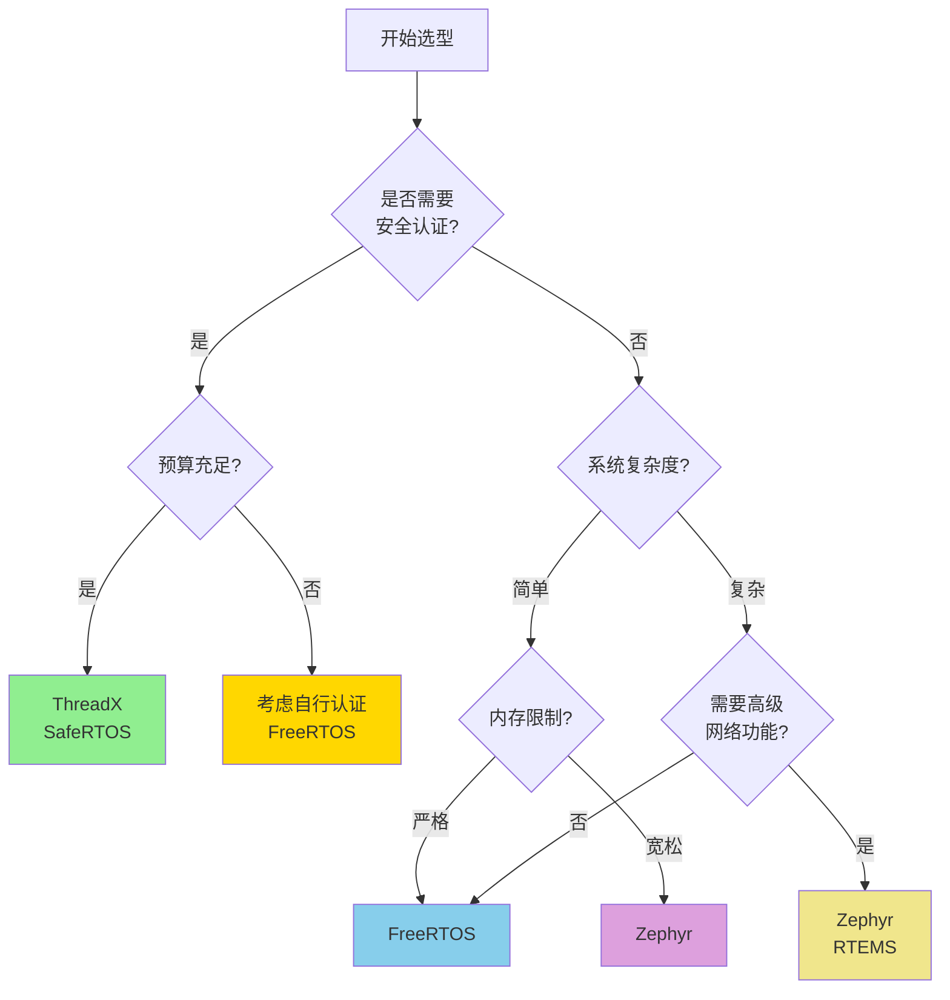

# RTOS选型指南

## 前置知识

在学习本文档之前，建议你已经掌握：

- RTOS基础概念
- 嵌入式系统开发经验
- C/C++编程基础


## 学习目标

完成本模块后，你将能够：
- 理解医疗器械RTOS选型的关键因素
- 掌握主流RTOS的特点和适用场景
- 评估RTOS的安全性和法规符合性
- 根据项目需求选择合适的RTOS

---

## 内容

### RTOS选型关键因素

在医疗器械开发中，RTOS选型需要考虑以下关键因素：

#### 1. 法规与认证要求

**IEC 62304合规性**：
- RTOS是否有预认证版本（如SafeRTOS）
- 是否提供完整的开发文档和追溯性
- 是否支持软件安全分类（A/B/C类）

**认证支持**：
- FDA 510(k)/PMA认证历史
- CE认证（MDR/IVDR）
- IEC 61508功能安全认证

#### 2. 技术特性

**实时性能**：
- 任务切换时间（通常<10μs）
- 中断响应延迟
- 最大支持任务数量
- 调度算法（抢占式/协作式）

**内存占用**：
- ROM/Flash占用（内核大小）
- RAM占用（最小运行内存）
- 动态内存管理策略

**硬件支持**：
- 支持的MCU架构（ARM Cortex-M、RISC-V等）
- 外设驱动支持
- 低功耗模式支持

#### 3. 生态系统

**开发工具**：
- IDE支持（Keil、IAR、GCC等）
- 调试工具（JTAG、SWD）
- 性能分析工具

**社区与支持**：
- 文档完整性
- 技术支持渠道
- 社区活跃度
- 商业支持选项

**第三方集成**：
- 通信协议栈（TCP/IP、BLE、USB）
- 文件系统
- 图形界面库

#### 4. 许可证与成本

**开源许可**：
- MIT许可证（如FreeRTOS）
- Apache 2.0（如Zephyr）
- 商业许可（如ThreadX）

**总拥有成本**：
- 许可费用
- 技术支持费用
- 培训成本
- 认证成本

---

### 主流RTOS对比

#### FreeRTOS

**概述**：
- 最流行的开源RTOS
- MIT许可证，完全免费
- AWS支持和维护

**优势**：
- ✅ 轻量级，内核仅需4-9KB ROM
- ✅ 广泛的硬件支持
- ✅ 丰富的文档和示例
- ✅ 活跃的社区
- ✅ AWS IoT集成

**劣势**：
- ❌ 基础功能较简单
- ❌ 需要额外集成第三方组件
- ❌ 无官方安全认证版本（需使用SafeRTOS）

**适用场景**：
- 资源受限的医疗设备
- 需要快速原型开发
- 预算有限的项目
- 需要云连接的设备

**代码示例**：

```c
#include "FreeRTOS.h"
#include "task.h"

// 心率监测任务
void vHeartRateTask(void *pvParameters) {
    TickType_t xLastWakeTime = xTaskGetTickCount();
    const TickType_t xFrequency = pdMS_TO_TICKS(100); // 100ms周期
    
    for(;;) {
        // 读取心率传感器
        uint16_t heart_rate = read_heart_rate_sensor();
        
        // 处理数据
        process_heart_rate(heart_rate);
        
        // 精确周期延时
        vTaskDelayUntil(&xLastWakeTime, xFrequency);
    }
}

int main(void) {
    // 创建任务
    xTaskCreate(vHeartRateTask, "HR", 256, NULL, 2, NULL);
    
    // 启动调度器
    vTaskStartScheduler();
    
    return 0;
}
```

#### Zephyr RTOS

**概述**：
- Linux基金会支持的开源RTOS
- Apache 2.0许可证
- 模块化设计

**优势**：
- ✅ 现代化架构和设计
- ✅ 强大的设备树配置
- ✅ 内置安全特性（TLS、加密）
- ✅ 丰富的网络协议栈
- ✅ 良好的多核支持

**劣势**：
- ❌ 学习曲线较陡
- ❌ 内存占用相对较大
- ❌ 医疗器械应用案例较少

**适用场景**：
- 复杂的联网医疗设备
- 需要高级安全特性
- 多核处理器平台
- 长期维护的项目

**代码示例**：

```c
#include <zephyr/kernel.h>
#include <zephyr/device.h>

// 定义线程栈
#define STACK_SIZE 1024
K_THREAD_STACK_DEFINE(ecg_stack, STACK_SIZE);

// 线程控制块
struct k_thread ecg_thread;

// ECG采集线程
void ecg_acquisition_thread(void *p1, void *p2, void *p3) {
    while (1) {
        // 采集ECG数据
        acquire_ecg_sample();
        
        // 10ms周期
        k_msleep(10);
    }
}

int main(void) {
    // 创建线程
    k_thread_create(&ecg_thread, ecg_stack,
                    K_THREAD_STACK_SIZEOF(ecg_stack),
                    ecg_acquisition_thread,
                    NULL, NULL, NULL,
                    5, 0, K_NO_WAIT);
    
    return 0;
}
```

#### ThreadX (Azure RTOS)

**概述**：
- Microsoft Azure RTOS的一部分
- MIT许可证（2019年后）
- 经过广泛的安全认证

**优势**：
- ✅ IEC 61508 SIL 4认证
- ✅ IEC 62304 Class C认证
- ✅ 优秀的实时性能
- ✅ 完整的中间件套件
- ✅ 商业级技术支持

**劣势**：
- ❌ 社区相对较小
- ❌ 文档不如FreeRTOS丰富
- ❌ 学习资源有限

**适用场景**：
- 高安全等级医疗设备（Class C）
- 需要预认证RTOS
- 关键生命支持设备
- 需要Azure云集成

**代码示例**：

```c
#include "tx_api.h"

#define STACK_SIZE 1024

TX_THREAD blood_pressure_thread;
UCHAR blood_pressure_stack[STACK_SIZE];

// 血压测量线程
void blood_pressure_entry(ULONG thread_input) {
    while(1) {
        // 启动血压测量
        start_bp_measurement();
        
        // 等待测量完成
        tx_thread_sleep(300); // 3秒
        
        // 读取结果
        read_bp_results();
    }
}

int main(void) {
    // 进入ThreadX内核
    tx_kernel_enter();
}

void tx_application_define(void *first_unused_memory) {
    // 创建线程
    tx_thread_create(&blood_pressure_thread,
                     "BP Thread",
                     blood_pressure_entry,
                     0,
                     blood_pressure_stack,
                     STACK_SIZE,
                     5, 5,
                     TX_NO_TIME_SLICE,
                     TX_AUTO_START);
}
```

#### SafeRTOS

**概述**：
- FreeRTOS的安全认证版本
- 商业许可
- 专为安全关键应用设计

**优势**：
- ✅ IEC 61508 SIL 3认证
- ✅ 完整的设计文档和追溯性
- ✅ 适合医疗器械认证
- ✅ 基于成熟的FreeRTOS

**劣势**：
- ❌ 商业许可费用
- ❌ 功能相对基础
- ❌ 社区支持有限

**适用场景**：
- IEC 62304 Class B/C设备
- 需要预认证RTOS
- 监管要求严格的市场
- 生命支持设备

#### RTEMS

**概述**：
- 开源实时操作系统
- 用于航空航天和医疗
- POSIX兼容

**优势**：
- ✅ 高可靠性
- ✅ POSIX API支持
- ✅ 丰富的网络功能
- ✅ 良好的多核支持

**劣势**：
- ❌ 内存占用较大
- ❌ 配置复杂
- ❌ 学习曲线陡峭

**适用场景**：
- 高性能医疗设备
- 需要POSIX兼容性
- 复杂的多任务系统

---

### 医疗器械RTOS选型决策树



### 选型建议矩阵

| 项目特征 | 推荐RTOS | 理由 |
|---------|---------|------|
| **资源受限设备**<br/>（<64KB Flash） | FreeRTOS | 最小内核占用，高效 |
| **Class C医疗设备** | ThreadX<br/>SafeRTOS | 预认证，符合IEC 62304 |
| **联网设备**<br/>（WiFi/BLE） | Zephyr<br/>FreeRTOS+AWS | 丰富的网络协议栈 |
| **快速原型开发** | FreeRTOS | 丰富示例，快速上手 |
| **多核处理器** | Zephyr<br/>RTEMS | 良好的SMP支持 |
| **长期维护项目** | Zephyr<br/>ThreadX | 活跃维护，长期支持 |
| **预算有限** | FreeRTOS<br/>Zephyr | 开源免费 |
| **需要商业支持** | ThreadX<br/>SafeRTOS | 专业技术支持 |

---

### 选型评估清单

在做出最终决策前，使用以下清单评估候选RTOS：

#### 技术评估

- [ ] 支持目标MCU架构
- [ ] 满足实时性能要求（任务切换<10μs）
- [ ] 内存占用在预算范围内
- [ ] 提供必要的中间件（TCP/IP、USB等）
- [ ] 支持所需的外设驱动
- [ ] 低功耗模式支持

#### 法规评估

- [ ] 符合IEC 62304要求
- [ ] 提供完整的开发文档
- [ ] 有医疗器械应用案例
- [ ] 支持软件追溯性
- [ ] 可获得认证支持

#### 开发评估

- [ ] 支持常用开发工具
- [ ] 文档完整且易懂
- [ ] 有充足的示例代码
- [ ] 社区或商业支持可用
- [ ] 团队有相关经验或培训可用

#### 商业评估

- [ ] 许可证符合项目要求
- [ ] 总拥有成本可接受
- [ ] 供应商稳定可靠
- [ ] 长期维护承诺
- [ ] 知识产权风险可控

---

### 实际案例分析

#### 案例1：便携式血糖仪

**需求**：
- ARM Cortex-M0+处理器
- 32KB Flash，8KB RAM
- 低功耗要求
- Class B医疗设备
- 预算有限

**选型决策**：FreeRTOS

**理由**：
- 内核占用小（<5KB），适合资源受限环境
- 良好的低功耗支持
- 免费开源，降低成本
- 丰富的ARM Cortex-M支持
- 可通过文档和流程满足Class B要求

#### 案例2：输液泵控制系统

**需求**：
- ARM Cortex-M4处理器
- 256KB Flash，64KB RAM
- Class C医疗设备
- 需要安全认证
- 生命支持设备

**选型决策**：ThreadX (Azure RTOS)

**理由**：
- IEC 61508 SIL 4认证
- IEC 62304 Class C预认证
- 优秀的实时性能
- 完整的认证文档
- 商业技术支持

#### 案例3：远程患者监护系统

**需求**：
- ARM Cortex-M7处理器
- 1MB Flash，512KB RAM
- WiFi/BLE连接
- 云端数据上传
- Class B医疗设备

**选型决策**：Zephyr RTOS

**理由**：
- 丰富的网络协议栈
- 内置安全特性（TLS）
- 良好的无线通信支持
- 现代化架构，易于扩展
- 活跃的社区和长期支持

---

## 实践练习

1. **评估练习**：
   - 选择一个医疗设备项目
   - 使用选型评估清单评估3个候选RTOS
   - 编写选型报告，说明推荐理由

2. **对比实验**：
   - 在同一硬件平台上移植FreeRTOS和Zephyr
   - 对比内存占用、任务切换时间
   - 评估开发难度和工具支持

3. **认证分析**：
   - 研究一个已认证医疗设备的RTOS选择
   - 分析其选型理由和认证策略
   - 总结经验教训

---

## 相关知识模块

### 深入学习

- [RTOS对比表](rtos-comparison.md) - 详细的多RTOS技术对比
- [RTOS安全认证](rtos-safety-certification.md) - 安全认证RTOS详解
- [RTOS性能调优](rtos-performance-tuning.md) - 性能优化技术

### 相关主题

- [任务调度](task-scheduling.md) - RTOS调度机制
- [IEC 62304软件分类](../../regulatory-standards/iec-62304/software-classification.md) - 软件安全等级
- [架构设计](../../software-engineering/architecture-design/index.md) - 系统架构设计

---

## 参考文献

1. "FreeRTOS Reference Manual" - Real Time Engineers Ltd.
2. "Zephyr Project Documentation" - Linux Foundation
3. "Azure RTOS ThreadX User Guide" - Microsoft
4. IEC 62304:2006+AMD1:2015 - Medical device software
5. IEC 61508:2010 - Functional safety of electrical/electronic systems
6. "Real-Time Systems Design and Analysis" by Phillip A. Laplante
7. "The Definitive Guide to ARM Cortex-M3 and Cortex-M4 Processors" by Joseph Yiu

---

## 自测问题

??? question "问题1：为什么医疗器械开发中RTOS选型如此重要？"
    **答案**：
    
    RTOS选型直接影响：
    
    1. **法规符合性**：某些RTOS有预认证，可简化认证流程
    2. **开发效率**：合适的RTOS可加快开发速度
    3. **系统性能**：影响实时性、功耗、可靠性
    4. **长期成本**：包括许可费、维护成本、认证成本
    5. **风险管理**：RTOS缺陷可能导致严重安全问题
    
    错误的选型可能导致项目延期、成本超支，甚至无法通过认证。

??? question "问题2：FreeRTOS和SafeRTOS有什么区别？"
    **答案**：
    
    主要区别：
    
    | 特性 | FreeRTOS | SafeRTOS |
    |-----|----------|----------|
    | **许可证** | MIT（免费） | 商业许可 |
    | **安全认证** | 无 | IEC 61508 SIL 3 |
    | **文档** | 基础文档 | 完整认证文档 |
    | **适用场景** | 一般应用 | 安全关键应用 |
    | **成本** | 免费 | 需要许可费 |
    | **技术支持** | 社区 | 商业支持 |
    
    SafeRTOS基于FreeRTOS，但经过严格的安全认证，适合Class B/C医疗设备。

??? question "问题3：如何评估RTOS的实时性能？"
    **答案**：
    
    关键性能指标：
    
    1. **任务切换时间**：
       - 测量上下文切换延迟
       - 目标：<10μs（Cortex-M系列）
    
    2. **中断响应延迟**：
       - 从中断发生到ISR执行的时间
       - 包括硬件延迟和RTOS延迟
    
    3. **调度器开销**：
       - 调度决策所需时间
       - 影响系统吞吐量
    
    4. **最坏情况执行时间（WCET）**：
       - 关键任务的最长执行时间
       - 用于可调度性分析
    
    5. **抖动（Jitter）**：
       - 周期任务执行时间的变化
       - 影响实时性的可预测性
    
    测试方法：使用逻辑分析仪或示波器测量GPIO翻转时间。

??? question "问题4：开源RTOS和商业RTOS在医疗器械应用中各有什么优劣？"
    **答案**：
    
    **开源RTOS（如FreeRTOS、Zephyr）**：
    
    优势：
    - ✅ 免费，降低成本
    - ✅ 源代码可审查
    - ✅ 社区支持和丰富资源
    - ✅ 灵活定制
    
    劣势：
    - ❌ 无预认证，需自行认证
    - ❌ 无商业技术支持保证
    - ❌ 文档可能不够完整
    - ❌ 需要更多内部专业知识
    
    **商业RTOS（如ThreadX、SafeRTOS）**：
    
    优势：
    - ✅ 预认证，简化认证流程
    - ✅ 专业技术支持
    - ✅ 完整的认证文档
    - ✅ 长期维护承诺
    
    劣势：
    - ❌ 许可费用
    - ❌ 源代码可能不完全开放
    - ❌ 定制灵活性较低
    - ❌ 供应商锁定风险
    
    选择取决于项目的安全等级、预算、团队能力和时间要求。

---

## 总结

RTOS选型是医疗器械嵌入式开发的关键决策，需要综合考虑技术、法规、商业等多方面因素。本指南提供了系统的选型方法和主流RTOS对比，帮助你做出明智的选择。

**关键要点**：
- 优先考虑法规符合性和安全认证
- 评估技术特性是否满足项目需求
- 考虑长期维护和总拥有成本
- 使用评估清单进行系统化决策
- 参考类似项目的成功案例

记住：没有"最好"的RTOS，只有"最适合"的RTOS。
