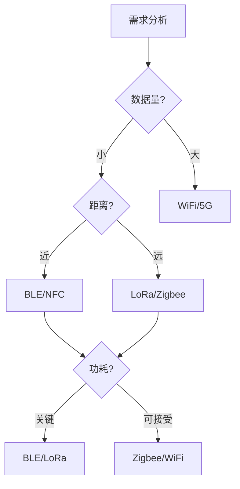

# 无线通信技术

## 概述

无线通信技术已成为现代医疗器械不可或缺的组成部分，使设备能够与智能手机、云平台、医院信息系统等进行数据交换。本章节深入探讨医疗器械中常用的无线通信技术及其实现要点。

## 为什么无线通信对医疗器械至关重要？

### 临床价值

- **实时监护**: 持续传输生命体征数据到监护中心
- **远程医疗**: 支持家庭护理和远程诊断
- **数据集成**: 自动上传数据到电子病历系统
- **用户体验**: 通过移动应用提供便捷的设备控制

### 技术挑战

- **可靠性**: 医疗环境中的无线干扰
- **安全性**: 保护敏感的健康数据
- **功耗**: 便携式设备的电池寿命
- **互操作性**: 与多种系统和设备兼容

## 医疗器械常用无线技术对比

| 技术 | 传输距离 | 数据速率 | 功耗 | 典型应用 |
|------|---------|---------|------|---------|
| **BLE** | 10-100m | 1 Mbps | 极低 | 可穿戴设备、传感器 |
| **WiFi** | 50-100m | 54-1300 Mbps | 中高 | 医学影像、监护设备 |
| **Zigbee** | 10-100m | 250 Kbps | 低 | 传感器网络 |
| **LoRa** | 2-15km | 0.3-50 Kbps | 极低 | 远程监护 |
| **NFC** | <10cm | 424 Kbps | 极低 | 身份识别、配对 |
| **5G** | 广域 | >1 Gbps | 高 | 远程手术、实时影像 |

## 监管要求

### IEC 60601-1-2（电磁兼容性）

无线医疗器械必须满足EMC要求：

- **发射限制**: 不干扰其他医疗设备
- **抗扰度**: 在电磁环境中正常工作
- **风险管理**: 评估无线通信失败的风险

### FDA指南

- **无线共存**: 证明设备在多无线环境中的性能
- **网络安全**: 遵循FDA网络安全指南
- **性能测试**: 验证无线链路的可靠性

### ETSI/FCC频谱法规

- **ISM频段**: 2.4 GHz、5 GHz等免许可频段
- **发射功率**: 符合地区法规限制
- **频谱礼仪**: 避免频道拥塞

## 本章节内容

- [蓝牙与BLE](bluetooth-ble.md) - 低功耗蓝牙技术详解
- [WiFi通信](wifi.md) - WiFi在医疗器械中的应用
- [其他无线技术](other-wireless.md) - Zigbee、LoRa、NFC、5G
- [安全考虑](security-considerations.md) - 无线通信安全实现

## 设计决策框架

选择无线技术时考虑：

### 决策因素

1. **数据吞吐量**: 传输数据的大小和频率
2. **传输距离**: 设备间的物理距离
3. **功耗预算**: 电池容量和续航要求
4. **实时性**: 延迟容忍度
5. **成本**: 硬件和认证成本
6. **生态系统**: 与现有系统的兼容性

## 实际案例

### 案例1: 连续血糖监测仪（CGM）

- **技术选择**: BLE 5.0
- **理由**: 低功耗、智能手机兼容、足够的数据速率
- **实现**: 每5分钟传输血糖读数，电池续航14天

### 案例2: 便携式超声设备

- **技术选择**: WiFi 802.11ac
- **理由**: 高带宽传输实时影像数据
- **实现**: 流式传输超声图像到平板电脑

### 案例3: 远程心电监护

- **技术选择**: 4G/5G蜂窝网络
- **理由**: 广域覆盖、患者移动性
- **实现**: 实时上传ECG数据到云端监护中心

## 测试与验证

### 功能测试

- **连接建立**: 配对和连接时间
- **数据完整性**: 传输错误率
- **断线重连**: 自动恢复机制
- **多设备**: 并发连接处理

### 性能测试

- **吞吐量**: 实际数据传输速率
- **延迟**: 端到端传输时间
- **范围**: 不同距离下的性能
- **功耗**: 各种操作模式的电流消耗

### 环境测试

- **干扰**: 其他无线设备的影响
- **移动性**: 移动中的连接稳定性
- **障碍物**: 墙壁、人体等的影响
- **极端条件**: 温度、湿度对无线性能的影响

## 最佳实践

### 设计原则

1. **冗余机制**: 实现重传和确认机制
2. **优雅降级**: 信号弱时降低数据速率而非断开
3. **用户反馈**: 清晰指示连接状态
4. **安全第一**: 默认加密所有通信
5. **功耗优化**: 使用睡眠模式和自适应传输

### 常见陷阱

- ❌ 忽视无线共存测试
- ❌ 未考虑医疗环境的特殊干扰
- ❌ 过度依赖无线连接的可用性
- ❌ 安全实现不当（弱加密、硬编码密钥）
- ❌ 未提供离线模式或本地存储

## 未来趋势

### 新兴技术

- **WiFi 6/6E**: 更高速率和更低延迟
- **BLE Audio**: 助听器等音频医疗设备
- **5G切片**: 医疗专用网络切片
- **UWB**: 超宽带精确定位

### 标准演进

- **Matter**: 智能家居互操作标准
- **Thread**: 低功耗网状网络
- **LoRaWAN**: 远程医疗物联网

## 参考资源

### 标准文档

- IEC 60601-1-2:2014 - 医用电气设备EMC要求
- ISO/IEEE 11073 - 个人健康设备通信标准
- ETSI EN 300 328 - 2.4 GHz频段无线设备

### 行业指南

- FDA - Radio Frequency Wireless Technology in Medical Devices
- AAMI TIR69 - Risk Management of Radio-Frequency Wireless Coexistence
- IEC TR 60601-4-1 - Medical Electrical Equipment Guidance

### 技术资源

- Bluetooth SIG - Medical Device Working Group
- WiFi Alliance - Healthcare Solutions
- LoRa Alliance - Healthcare Applications

---

**下一步**: 深入了解 [蓝牙与BLE技术](bluetooth-ble.md)
